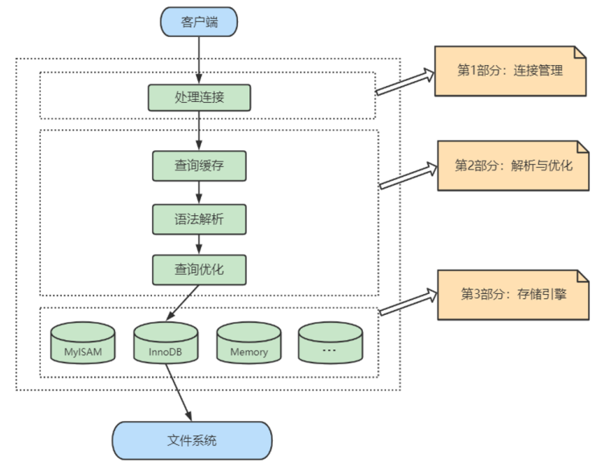
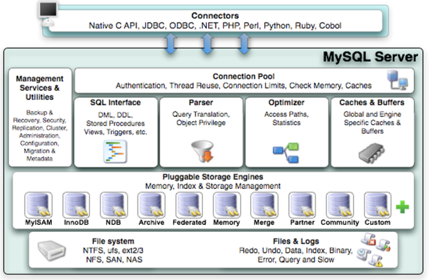
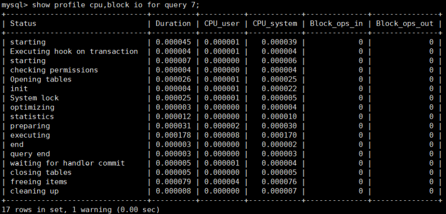
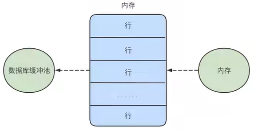
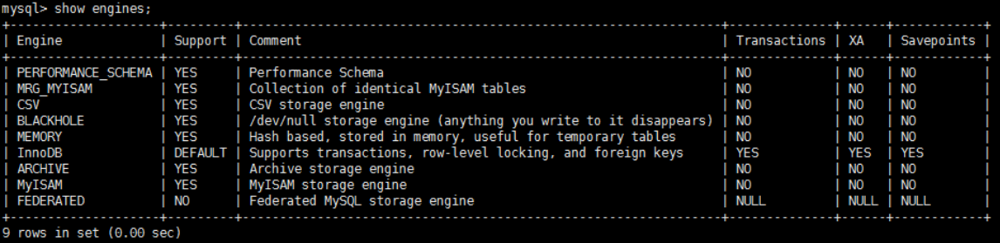

# 第02章 MySQL的数据目录

## 1. Linux下MySQL的目录结构

### 1）安装目录

```shell
# 进入MySQL命令行

# 查看安装目录
select @@datadir;
```


### 2）配置文件目录

```shell
vim /etc/my.cnf
```


## 2.  MySQL默认的四个数据库

- `MySQL` 

  ​		MySQL 系统自带的核心数据库，它存储了MySQL的用户账户和权限信息，一些存储过程、事件的定义信息，一些运行过程中产生的日志信息，一些帮助信息以及时区信息等。 

- `information_schema` 

  ​		MySQL 系统自带的数据库，这个数据库保存着MySQL服务器 **维护的所有其他数据库的信息** ，比如有 哪些表、哪些视图、哪些触发器、哪些列、哪些索引。这些信息并不是真实的用户数据，而是一些 描述性信息，有时候也称之为 **元数据** 。在系统数据库 `information_schema` 中提供了一些以 `innodb_sys` 开头的表，用于表示**内部系统表**。

- `performance_schema` 

  ​		MySQL 系统自带的数据库，这个数据库里主要保存MySQL服务器运行过程中的一些状态信息，可以 用来 **监控 MySQL 服务的各类性能指标** 。包括统计最近执行了哪些语句，在执行过程的每个阶段都 花费了多长时间，内存的使用情况等信息。 

- `sys` 

  ​		MySQL 系统自带的数据库，这个数据库主要是通过 **视图** 的形式把 **information_schema** 和 **performance_schema** 结合起来，帮助系统管理员和开发人员监控 MySQL 的技术性能。


## 3. 表在文件系统中的表示

### 1）InnoDB存储引擎模式

- **表结构** 

  ​		为了保存表结构，InnoDB在**数据目录**下对应的数据库子目录下创建了一个专门用于**描述表结构的文件**，文件名是这样：`表名.frm`。


- **表中数据和索引**

**① 系统表空间（system tablespace）**

​		默认情况下，InnoDB会在数据目录下创建一个名为 `ibdata1` 、大小为 `12M` 的文件，这个文件就是对应 的 `系统表空间` 在文件系统上的表示。怎么才12M？注意这个文件是 **自扩展文件** ，当不够用的时候它会自己增加文件大小。 

​		当然，如果你想让系统表空间对应文件系统上多个实际文件，或者仅仅觉得原来的 ibdata1 这个文件名 难听，那可以在MySQL启动时配置对应的文件路径以及它们的大小，比如我们这样修改一下my.cnf 配置 文件：

```properties
[server]
innodb_data_file_path=data1:512M;data2:512M:autoextend
```


**② 独立表空间(file-per-table tablespace)**

​		在`MySQL5.6.6`以及之后的版本中，InnoDB并不会默认的把各个表的数据存储到系统表空间中，而是为 **每 一个表建立一个独立表空间** ，也就是说<u>我们创建了多少个表，就有多少个独立表空间</u>。使用 **独立表空间** 来 存储表数据的话，会在该表所属数据库对应的子目录下创建一个表示该独立表空间的文件，文件名和表名相同，只不过添加了一个 **.ibd** 的扩展名而已。<u>在InnoDB存储引擎中，`.ibd` 文件就用来存储表中的**数据和索引**。</u>


**③ 系统表空间与独立表空间的设置**

​		我们可以自己指定使用**系统表空间**还是**独立表空间**来存储数据，这个功能由启动参数`innodb_file_per_table` 控制，比如说我们想刻意将表数据都存储到 **系统表空间** 时，可以在启动 MySQL服务器的时候这样配置：

```properties
[server]
innodb_file_per_table=0 # 0：代表使用系统表空间； 1：代表使用独立表空间
```


**④ 其他类型的表空间**

​		随着MySQL的发展，除了上述两种老牌表空间之外，现在还新提出了一些不同类型的表空间，比如**通用表空间（general tablespace）**、**临时表空间（temporary tablespace）**等。


- **说明**

> ​		**MySQL5.7**中会在文件系统中的每个数据库目录下生成`db.opt` 文件用于保存当前数据库的相关配置信息。比如：字符集、比较规则。而**MySQL8.0不再提供db.opt文件。**


### 2）MyISAM存储引擎模式

- **表结构**

  ​		在存储表结构方面， MyISAM 和 InnoDB 一样，也是在 数据目录data 下对应的数据库子目录下创建了一个专门用于描述表结构的文件：`表名.frm`。


- **表中数据和索引**

  ​		在MyISAM中的索引全部都是 **二级索引** ，该存储引擎的 **数据和索引是分开存放** 的。所以在文件系统中也是使用不同的文件来存储数据文件和索引文件，同时表数据都存放在对应的数据库子目录下。假如 <u>test</u> 表使用MyISAM存储引擎的话，那么在它所在对应的数据目录下会存在这三个文件：

```txt
test.frm 存储表结构
test.MYD 存储数据 (MYData)
test.MYI 存储索引 (MYIndex)
```

> ​		注意：即使将 `innodb_file_per_table` 变量设置为1，使用MyISAM的表也不会使用系统表空间存储数据。可以理解为，系统表空间存储的数据是针对于InnoDB存储引擎的。


## 4. 视图在文件系统中的表示

​		MySQL中的视图其实就是一张**虚拟表**，也就是<u>某个查询语句的一个别名而已</u>，所以<u>在存储视图的时候是不需要存储真实的数据的，只需要存储它的结构即可。</u>和表一样，描述视图结构的文件也会被存储到所属数据库对应的子目录下边，即：会存储一个`视图名.frm`的文件。


## 5. 其它文件

​		除了我们上边说的这些用户自己创建的数据以外，`数据目录（data）`下还包括为了更好运行程序的一些额外文件，主要包括这几种类型的文件。

- **服务器进程文件**

  ​		我们知道每运行一个 MySQL服务器程序，都意味着启动一个进程。MySQL服务器会把自己的`进程ID`写入到一个文件中。即：`本机计算机名.pid`文件

- **服务器日志文件**

  ​		在服务器的运行过程中，会产生各种各样的日志，比如常规的查询日志、错误日志、二进制日志、redo日志等。

- **默认/自动生成的SSL和RSA证书和密钥文件**

  ​		主要是为了客户端和服务器安全通信而创建的一些文件。
  
  

## 6. 总结

举例： 假设有数据库a，并在其中创建了表b 。 

1、如果表b采用 **InnoDB** ，data\a中会产生 <font style="background-color: #73cf60">1或2</font> 个文件：

- `b.frm` ：描述表结构文件，字段长度等 
- 如果采用 **系统表空间** 模式的，数据信息和索引信息都存储在 `ibdata1` 中，不会存在 `b.ibd` 文件
- 如果采用 **独立表空间** 存储模式，<u>data\a</u>中会产生 `b.ibd` 文件，用来存储数据信息和索引信息

> 此外：
>
> ​		 ① MySQL5.7 中会在文件系统中的每个数据库目录下生成 **`db.opt`** 文件用于保存当前数据库的相关配置。比如：字符集、比较 规则。而在MySQL8.0中，不再提供 **`db.opt`** 文件。
>
> ​		 ② 在MySQL8.0中，相较于MySQL5.7，将专门用于存储表结构的文件（`.frm`）与存储表数据的文件（`.ibd`）合并为了一个`.ibd`文件。      
>
> - 扩展：
>     - Q：你怎么知道它们是合并了，而不是放在其他位置了呢？
>     - A：Oracle官方表明将frm文件中的信息移动到了ibd文件内部叫做**序列化字典信息**（Serialized Dictionary Information---SDI）的区域中。可以对ibd文件使用Oracle提供的SDI提取工具，进行解析。发现其中就包含了数据库定义的表结构信息。命令如下：8.0自带。
>         ibd2sdi  --dump-file=table_name.txt   table_name.ibd


2、如果表b采用 **MyISAM** ，data\a中会产生 <font style="background-color: #73cf60">3</font> 个文件： 

- MySQL5.7 中： `b.frm` ：描述表结构文件，字段长度等。 （元数据）
- MySQL8.0 中 `b.sdi`(Serialized Dictionary Information) ：描述表结构文件，字段长度等。（元数据）
- `b.MYD (MYData)`：数据信息文件，存储数据信息
- `b.MYI (MYIndex)`：存放索引信息文件


# 第04章 逻辑架构

## 1. 逻辑架构剖析

### 1）服务器处理客户端请求

​		首先MySQL是典型的C/S架构，即`Clinet/Server 架构`，服务端程序使用的MySQLd。

​		不论客户端进程和服务器进程之间是采用哪种方式进行通信，最终的实现效果一定是：**客户端进程向服务器进程发送一段文本（<font color="blue">SQL语句</font>），服务器进程处理后再向客户端进程发送一段文本（<font color="blue">处理结果</font>）**。

​		那服务器进程对客户端进程发送的请求做了什么处理，才能产生最后的处理结果呢？这里以查询请求为例展示：



下面具体展开如下：

|                  服务端处理客户端请求流程图                  |
| :----------------------------------------------------------: |
|  |


### 2）Connectors

​		**==Connectors，指的是使用不同的语言与数据库服务器进行交互的连接对象==。**MySQL首先是一个网络程序，在TCP之上定义了自己的应用层协议。所以要使用MySQL，我们可以编写代码，跟MySQL Server `建立TCP连接`，之后按照其定义好的协议进行交互。或者比较方便的方法是调用SDK，比如Native C API、JDBC、PHP等各语言MySQL Connecotr，或者通过ODBC。但**通过SDK来访问MySQL，本质上还是在TCP连接上通过MySQL协议跟MySQL进行交互**。


- #### **接下来的<font color="blue">MySQL Server结构</font>可以分为如下三层：**

#### 3）第一层：连接层

> ​		系统（客户端）访问 MySQL 服务器前，做的第一件事就是建立 TCP 连接。 经过三次握手建立连接成功后， MySQL 服务器对 TCP 传输过来的账号密码做身份认证、权限获取。

* 用户名或密码不对，会收到一个Access denied for user错误，客户端程序结束执行 
* 用户名密码认证通过，会从权限表查出账号拥有的权限与连接关联，之后的权限判断逻辑，都将依赖于此时读到的权限

  ​		TCP 连接收到请求后，必须要分配给一个线程专门与这个客户端进行交互。所以还会有个线程池，去走后面的流程。每一个连接从线程池中获取线程，省去了创建和销毁线程的开销。

> ​		所以**连接管理**的职责是负责认证、管理连接、获取权限信息。


#### 4）第二层：服务层

> ​		第二层架构主要完成大多数的**核心服务功能**，如调用SQL接口、完成`缓存的查询`、进行SQL的分析和优化及部分内置函数的执行。所有跨存储引擎的功能也在这一层实现，如过程、函数等。
>
> ​		在该层，服务器会`解析SQL语句`并创建相应的内部`解析树`，并对其完成相应的`优化`：如确定查询表的顺序，是否利用索引等，最后生成相应的执行操作。
>
> ​		如果是SELECT语句，服务器还会`查询内部的缓存`。如果缓存空间足够大，这样在解决大量读操作的环境中能够很好的提升系统的性能。

​		

* `SQL Interface`: SQL接口
    * **接收用户的SQL命令，并且返回用户需要查询的结果。**比如SELECT ... FROM就是调用SQL Interface 
    * MySQL支持DML（数据操作语言）、DDL（数据定义语言）、存储过程、视图、触发器、自定义函数等多种SQL语言接口

* `Parser`: 解析器
    * **在解析器中对 SQL 语句进行语法分析、语义分析。**将SQL语句分解成`语法树`，并将这个语法树传递到后续步骤，后续SQL语句的传递和优化就是基于这个语法树的。<u>如果在分解中遇到错误，就说明这个SQL语句是不合理的</u> 。另外，在这个过程中，还会验证该客户端是否具有执行该查询的权限。

* `Optimizer`: 查询优化器
    * SQL语句会在<u>被解析之后、查询之前</u>使用查询优化器确定 SQL 语句的执行路径，生成一个 **执行计划** 。 这个执行计划表明应该 **使用哪些索引** 进行查询（**全表检索还是使用索引检索**），表之间的连接顺序如何，<u>最后会按照执行计划中的步骤调用存储引擎提供的方法来真正的执行查询</u>，并将查询结果返回给用户。
    * 它使用“ `选取-投影-连接` ”策略进行查询。例如：
```mysql
  SELECT id，name FROM student WHERE gender = '女';
```

> ​		这个SELECT查询先**根据WHERE语句进行 选取** ，而不是将表全部查询出来以后再进行gender过滤。 这个SELECT查询先**根据id和name进行属性投影** ，而不是将属性全部取出以后再进行过 滤，**将这两个查询条件 连接 起来生成最终查询结果**。

* `Caches & Buffers`： 查询缓存组件

  * MySQL内部维持着一些Cache和Buffer，比如Query Cache用来缓存一条SELECT语句的执行结果，如果能够在其中找到对应的查询结果，那么就不必再进行查询解析、优化和执行的整个过程了，直接将结果反馈给客户端。 
  * 这个缓存机制是由一系列小缓存组成的。比如表缓存，记录缓存，key缓存，权限缓存等 。 这个查询缓存可以在 不同客户端之间共享 。 
  * 从MySQL 5.7.20开始，不推荐使用查询缓存，并在 MySQL 8.0中删除 。
  
  

#### 5）第三层：引擎层

> ​		（插件式）存储引擎层（ Storage Engines），**真正的负责了MySQL中数据的存储和提取，对物理服务器级别维护的底层数据执行操作**，服务器通过API与存储引擎进行通信。不同的存储引擎具有的功能不同，这样 我们可以根据自己的实际需要进行选取。

|                MySQL 8.0.25默认支持的存储引擎                |
| :----------------------------------------------------------: |
|  |


### 6）存储层

​		所有的数据，数据库、表的定义，表的每一行的内容，索引，都是存在文件系统上，以`文件`的方式存在的。<u>存储引擎负责完成与这些文件的交互</u>。当然有些存储引擎比如`InnoDB`，也支持不使用文件系统直接管理裸设备，但现代文件系统的实现使得这样做没有必要了。在文件系统之下，可以使用本地磁盘，可以使用 DAS、NAS、SAN等各种存储系统。


### 7）小结

​		MySQL架构图如本节开篇所示。下面为了方便熟悉**SQL执行流程**，我们可以简化如下：


> 简化为三层结构： 
>
> 1. **连接层**：客户端和服务器端建立连接，客户端发送 SQL 至服务器端； 
> 2. **SQL 层（(MySQL Server) 服务层）**：对SQL语句进行解析、优化处理。不存在与数据库文件之间的交互；
> 3. **存储引擎层**：与文件系统中的数据库文件打交道，负责数据的存储和读取。


## 2. SQL执行流程及原理

### 1） MySQL中的SQL执行流程

|                      SQL执行流程示意图                       |
| :----------------------------------------------------------: |
|  |


#### ① 查询缓存

> ​		Server 如果在查询缓存中发现了这条 SQL 语句，就会直接将结果返回给客户端；如果没有，就进入到解析器阶段。需要说明的是，因为查询缓存的命中率很低（鸡肋功能），所以在 MySQL8.0 之后就抛弃了这个功能。
>
> ​		**总之，因为查询缓存往往弊大于利，查询缓存的失效非常频繁。**

​		一般建议大家在静态表里使用查询缓存，什么叫 **静态表** 呢？就是<u>一般我们极少更新的表</u>。比如，一个系统配置表、字典表，这张表上的查询才适合使用查询缓存。好在MySQL也提供了这种“**按需使用**”的方式。你可以将 my.cnf 参数 `query_cache_type` 设置成 **DEMAND**（<u>代表当 sql 语句中有 SQL_CACHE关键字时才缓存（即：**按需开启**）</u>）。比如：

```mysql
# query_cache_type 有3个值。0代表关闭查询缓存OFF，1代表开启ON，2代表(DEMAND-)
query_cache_type=2
```

​		这样对于默认的SQL语句都不使用查询缓存。而对于你确定要使用查询缓存的语句，可以供SQL_CACHE显示指定，像下面这个语句一样：

```mysql
# 显示声明使用“查询缓存”。前提是：query_cache_type=2
SELECT SQl_CACHE * FROM test WHERE ID=5;
```

- 查看当前 MySQL 实例是否开启缓存机制

```mysql
# MySQL5.7中：
show global variables like "%query_cache_type%";

# 或者
select @@query_cache_type;
```

- 监控查询缓存的命中率：

```mysql
show status like '%Qcache%';
```


运行结果解析：

- `Qcache_free_blocks`: 表示查询缓存中还有多少剩余的blocks，如果该值显示较大，则说明查询缓存中的`内部碎片`过多了，可能在一定的时间进行整理。
- `Qcache_free_memory`: 查询缓存的内存大小，通过这个参数可以很清晰的知道当前系统的查询内存是否够用，DBA可以根据实际情况做出调整。
- `Qcache_hits`: 表示有 `多少次命中缓存`。我们主要可以通过该值来验证我们的查询缓存的效果。数字越大，缓存效果越理想。
- `Qcache_inserts`: 表示`多少次未命中然后插入`，意思是新来的SQL请求在缓存中未找到，不得不执行查询处理，执行查询处理后把结果insert到查询缓存中。这样的情况的次数越多，表示查询缓存应用到的比较少，效果也就不理想。当然系统刚启动后，查询缓存是空的，这也正常。
- `Qcache_lowmem_prunes`: 该参数记录有`多少条查询因为内存不足而被移除`出查询缓存。通过这个值，用户可以适当的调整缓存大小。
- `Qcache_not_cached`: 表示因为query_cache_type的设置而没有被缓存的查询数量。
- `Qcache_queries_in_cache`: 当前缓存中`缓存的查询数量`。
- `Qcache_total_blocks`: 当前缓存的block数量。


#### ② 解析器

> ​		在解析器中对 SQL 语句进行**语法分析**、**语义分析**。

|                         解析器的功能                         |
| :----------------------------------------------------------: |
|  |

​		如果没有命中查询缓存，就要开始真正执行语句了。首先，MySQL需要知道你要做什么，因此需要对SQL语句做解析。SQL语句的分析分为词法分析与语法分析。

​		分析器**先做**“ `词法分析` ”。你输入的是由多个字符串和空格组成的一条 SQL 语句，MySQL 需要识别出里面 的字符串分别是什么，代表什么。 MySQL 从你输入的"select"这个关键字中识别出来，这是一个查询语句。它就需要把字符串“T”识别成“表名 T”，把字符串“ID”识别成“列 ID”。

​		接着，**再做**“ `语法分析` ”。根据词法分析的结果，语法分析器（比如：Bison）会根据语法规则，判断你输入的这个 SQL 语句是否 `满足 MySQL 语法` 。


- 如果SQL语句解析无误，则会生成一个这样的语法树：

|                          SQL语法树                           |
| :----------------------------------------------------------: |
|  |


- 下图是SQL语句被解析器解析的过程步骤:

|                         SQL解析步骤                          |
| :----------------------------------------------------------: |
|  |

至此解析器的工作任务也基本圆满了。


#### ③ 优化器

> ​		在优化器中会确定 SQL 语句的执行路径，比如是根据 `全表检索` ，还是根据 `索引检索` 等。 
>
> ​		经过解析器，MySQL就知道你要做什么了。但是在<u>开始执行之前</u>，还要先经过优化器的处理。**一条查询可以有很多种执行方式，最后都返回相同的结果。优化器的作用就是找到这其中最好的<font style="background-color: #73cf60">执行计划</font>（即：提高执行效率）**。

​		举例说明优化器的作用：在表中创建有多个索引的时候，优化器将会决定到底使用哪个索引；或者在一个语句中有多表关联 (join) 的时候，决定各个表的连接顺序；还有表达式简化；子查询转为连接查询；外连接转为内连接等。

- 举例：如下语句是执行两个表的 join

```mysql
select * from test1 join test2 using(ID)
where test1.name='zhangwei' and test2.name='MySQL高级课程';
```

```mysql
方案1：可以先从表 test1 里面取出 name='zhangwei'的记录的 ID 值，再根据 ID 值关联到表 test2，再判
断 test2 里面 name的值是否等于 'MySQL高级课程'。

方案2：可以先从表 test2 里面取出 name='MySQL高级课程' 的记录的 ID 值，再根据 ID 值关联到 test1，
再判断 test1 里面 name的值是否等于 zhangwei。

	这两种执行方法的逻辑结果是一样的，但是执行的效率会有不同，而优化器的作用就是决定选择使用哪一个方案。优化器阶段完成后，这个语句的执行方案就确定下来了，然后进入执行器阶段。
	如果你还有一些疑问，比如优化器是怎么选择索引的，有没有可能选择错等。后面讲到索引我们再谈。
```


- ==在查询优化器中，可以分为 `逻辑查询` 优化阶段和 `物理查询` 优化阶段==

  ​		从优化的内容角度看，查询优化又分为**代数优化**和**非代数优化**，或称为**逻辑优化**或**物理优化**。逻辑优化主要依据关系代数的等价变换做一些逻辑变换；物理优化主要根据数据读取、表连接方式、表连接顺序、排序等技术对查询进行优化。"查询重写规则"属于逻辑优化，运用了关系代数和启发式规则；"查询算法优化"属于物理优化，运用了基于代价估算的多表连接算法求解最小花费的技术。

  - > ​		**逻辑查询优化**就是通过改变SQL语句的内容来使得SQL查询更高效，同时为物理查询优化提供更多的候选执行计划。通常采用的方式是对SQL语句进行`等价变换`，对查询进行`重写`，而查询重写的数学基础就是关系代数。对条件表达式进行等价谓词重写、条件简化，对视图进行重写，对子查询进行优化，对连接语义进行了外连接消除、嵌套连接消除等。
  
  - > ​		**物理查询优化**是基于关系代数进行的查询重写，而关系代数的每一步都对应着物理计算，这些物理计算往往存在多种算法，因此需要计算各种物理路径的代价，从中选择代价最小的作为执行计划。在这个阶段里，对于单表和多表连接的操作，需要高效地`使用索引`，提升查询效率。


#### ④ 执行器

> ​		截止到现在，还没有真正的去读写过真实的表，**仅仅只是产出了一个执行计划**。
>
> ​		执行器阶段，就是用来执行优化器产出的执行计划的。

|                         执行器的功能                         |
| :----------------------------------------------------------: |
|  |


> ​		在执行之前需要判断该用户是否 `具备权限` 。如果没有，就会返回权限错误。如果具备权限，就执行 SQL 查询并返回结果。**在 MySQL8.0 以下的版本，如果设置了查询缓存，这时会将查询结果进行缓存。（注意：这是将查询结果查出之后的操作）**

```mysql
select * from test where id=1;
```

比如：表 test 中，ID 字段<u>没有索引</u>，那么执行器的执行流程是这样的：

- **全表检索**

    ​		调用 InnoDB 引擎接口取这个表的第一行，判断 ID 值是不是为1，如果不是则跳过，如果是则将这行存入结果集中；继续调用引擎接口取“下一行”，重复相同的判断逻辑，直到取到这个表的最后一行。执行器将上述遍历过程中所有满足条件的行组成的记录集作为结果集返回给客户端。至此，这个语句就执行完成了。对于有索引的表，执行的逻辑也差不多。


#### ⑤ 小结

> ​		SQL 语句在 MySQL 中的执行流程是： `SQL语句`→`查询缓存`→`解析器`→`优化器`→`执行器` 。

|                     SQL语句执行流程总结                      |
| :----------------------------------------------------------: |
|  |


### 2）MySQL8中SQL执行原理

#### ① 确认profiling是否开启

> ​		了解查询语句底层执行的过程：`select @profiling` 或者 `show variables like '%profiling'` 查看是否开启计划。开启它可以**让MySQL收集SQL的执行细节。**

执行时所使用的资源情况，命令如下：

```mysql
MySQL> select @@profiling;
# or
MySQL> show variables like 'profiling';
```

profiling=0 代表关闭，我们需要把 profiling 打开，即设置为 1：

```mysql
MySQL> set profiling=1;
```


#### ② 多次执行相同SQL查询

然后我们执行一个 SQL 查询（你可以执行任何一个 SQL 查询）：

```mysql
MySQL> select * from employees;
```


#### ③  查看profiles

查看当前会话所产生的所有 profiles：

```mysql
MySQL> show profiles; # 显示最近的几次查询
```


#### ④ 查看profile

显示执行计划，查看程序的执行步骤：

```mysql
MySQL> show profile;
```


当然你也可以查询指定的 Query ID，比如：

```mysql
MySQL> show profile for query 7;
```

查询 SQL 的执行时间结果和上面是一样的。

此外，还可以查询更丰富的内容：

```mysql
MySQL> show profile cpu，block io for query 6;
```


继续：

```mysql
MySQL> show profile cpu，block io for query 7;
```




1、除了查看cpu、io阻塞等参数情况，还可以查询下列参数的利用情况

```mysql
Syntax:
SHOW PROFILE [type [， type] ... ]
	[FOR QUERY n]
	[LIMIT row_count [OFFSET offset]]

type: {
	| ALL -- 显示所有参数的开销信息
	| BLOCK IO -- 显示IO的相关开销
	| CONTEXT SWITCHES -- 上下文切换相关开销
	| CPU -- 显示CPU相关开销信息
	| IPC -- 显示发送和接收相关开销信息
	| MEMORY -- 显示内存相关开销信息
	| PAGE FAULTS -- 显示页面错误相关开销信息
	| SOURCE -- 显示和Source_function，Source_file，Source_line 相关的开销信息
	| SWAPS -- 显示交换次数相关的开销信息
}
```


2、发现两次查询当前情况都一致，说明没有缓存

> ​		==**在 8.0 版本之后，MySQL 不再支持查询缓存**。==
>
> ​		一旦数据表有更新，缓存都将清空，因此只有数据表是静态的时候，或者数据表很少发生变化时，使用缓存查询才有价值，否则如果数据表经常更新，反而增加了 SQL 的查询时间。


### 3）MySQL5.7中SQL执行原理

​		上述操作在MySQL5.7中测试，发现前后两次相同的sql语句，执行的查询过程仍然是相同的。不是会使用缓存吗？这里我们需要显式开启**<font color="blue">查询缓存模式</font>** 。在MySQL5.7中如下设置：

#### ① 配置文件中开启查询缓存

在 `/etc/my.cnf` 中新增一行：

```mysql
query_cache_type=1
```

#### ② 重启MySQL服务

```mysql
systemctl restart MySQLd
```

#### ③ 开启查询执行计划

由于重启过服务，需要重新执行如下指令，开启profiling。

```mysql
MySQL> set profiling=1;
```

#### ④ 执行语句两次：

```mysql
MySQL> select * from locations;
```

#### ⑤ 查看profiles


#### ⑥ 查看profile

显示执行计划，查看程序的执行步骤：

```mysql
MySQL> show profile for query 1;
```


```mysql
MySQL> show profile for query 2;
```


​		结论不言而喻。执行编号2时，比执行编号1时少了很多信息，从截图中可以看出查询语句直接从缓存中获取数据。

### 4）SQL语法顺序

​		随着MySQL版本的更新换代，其优化器也在不断的升级。优化器会分析不同执行顺序的性能，取最佳性能的查询来动态调整执行顺序。


## 3. 数据库缓冲池（buffer pool）

> ​		`InnoDB` 存储引擎是以页为单位来管理存储空间的，我们进行的增删改查操作其实本质上都是在访问页面（包括读页面、写页面、创建新页面等操作）。而磁盘 I/O 需要消耗的时间很多，而在内存中进行操作，效率则会高很多，为了能让数据表或者索引中的数据**随时快速的**被我们所用，DBMS 会申请==占用内存来作为数据库缓冲池== ，在真正访问页面之前，需要把在磁盘上的页缓存到内存中的 `Buffer Pool` 之后才可以访问。

​		这样做的好处是可以**让磁盘活动最小化**，从而**减少与磁盘直接进行 I/O 的时间**。要知道，这种策略对提升 SQL 语句的查询性能来说至关重要。如果索引的数据在缓冲池里，那么访问的成本就会降低很多。


### 3.1 缓冲池 vs 查询缓存

[MySQL buffer pool详解](https://www.cnblogs.com/better-farther-world2099/articles/14768929.html)

> > ​      	缓冲池和查询缓存是一个东西吗？**不是！！！**
>
> ​		咱们在使用MySQL的时候，比如很简单的`select * from table;`这条语句，具体查询数据的操作其实是在**存储引擎**中实现的，大家都知道MySQL数据其实是放在磁盘里面的，如果每次查询都直接从磁盘里面查询，这样势必会很影响性能，所以一定是先把数据从磁盘中取出，然后放在内存中，下次查询直接从内存中来取。
>
> ​		但是一台机器中往往不是只有MySQL一个进程在运行的，很多个进程都需要使用内存，所以**<font color="blue">MySQL在内存中会有一个专门的区域来处理这些数据，这个专门为MySQL准备的区域，就叫`buffer pool`</font>**。buffer pool是MySQL一个非常关键的核心组件。但是，再次强调一下：**数据库中的数据实际上最终都是要存放在磁盘文件上的**。
>
> > ​		简而言之：`Buffer Pool`就是数据库的一个**内存组件**，里面缓存了磁盘上的真实数据，然后我们的系统对数据库执行的增删改操作，其实主要就是对这个内存中的`Buffer Pool`中的缓存数据执行的。通过这种方式，保证每个更新请求，尽量就是==**只更新内存，然后往磁盘里 顺序的 写日志文件**==。这样，更新内存的性能是极高的，然后顺序的向磁盘里写日志文件的性能也是比较高的，因为<u>顺序写磁盘文件的性能</u>要远高于<u>随机读写磁盘文件</u>。

#### 1）缓冲池（Buffer Pool）

​		首先我们需要了解在 InnoDB 存储引擎中，缓冲池都包括了哪些组成部分。

​		**在 InnoDB 存储引擎中有一部分数据会放到内存中，缓冲池则占了这部分内存的大部分，它用来存储各种数据的缓存**，如下图所示：

|                        缓冲池组成结构                        |
| :----------------------------------------------------------: |
|  |


从图中，你能看到 InnoDB 缓冲池包括了数据页、索引页、插入缓存、锁信息、自适应 Hash 索引和数据字典信息等。

**缓冲池的重要性：**

- **缓存原则：**

“ `位置 * 频次` ”这个原则，可以帮我们对 I/O 访问效率进行优化。

首先，**位置决定效率，提供缓冲池就是为了在内存中可以直接访问数据。<font color="red">（存储位置）</font>**

其次，**频次决定优先级顺序。**因为缓冲池的大小是有限的，比如磁盘有 200G，但是内存只有 16G，缓冲池大小只有 1G，就无法将所有数据都加载到缓冲池里，这时就涉及到优先级顺序，会优先对**使用频次高的热数据进行加载**。

- **缓冲池的预读特性:**

缓冲池的作用就是提升 I/O 效率，而我们进行读取数据的时候存在一个“局部性原理”，也就是说我们使用了一些数据，**大概率还会使用它周围的一些数据**，因此采用“预读”的机制提前加载，可以减少未来可能的磁盘 I/O 操作。


#### 2）查询缓存

那么什么是查询缓存呢？ 

​		查询缓存是提前将 **<font color="blue">查询结果</font>** 缓存起来，这样下次不需要进行SQL语句的执行就可以直接拿到结果（不需要I/O了）。需要说明的是，<u>在 MySQL 中的查询缓存，不是缓存查询计划，而是缓存对应的结果。因为命中条件苛刻，而且只要数据表 发生变化，查询缓存就会失效，因此命中率低</u>。


### 3.2 缓冲池如何读取数据

> ​		缓冲池管理器会尽量将经常使用的数据保存起来，在数据库进行页面读操作的时候，首先会判断该页面 是否在缓冲池中，如果存在就直接读取，如果不存在，就会从磁盘中获取页面，并将页面存放到缓冲池中再进行读取。

缓存在数据库中的结构和作用如下图所示：


**如果我们执行 SQL 语句的时候更新了缓存池中的数据，那么这些数据会马上同步到磁盘上吗？**

> ​		实际上，当我们对数据库中的记录进行修改的时候，首先会修改缓冲池中页里面的记录信息，然后数据库会 **以一定的频率刷新** 到磁盘中（刷盘）。注意：<u>并不是每次发生更新操作，都会立即进行磁盘回写。</u>缓冲池会采用一种叫做 `checkpoint 的机制` 将数据回写到磁盘上，这样做的好处就是提升了数据库的整体性能。

​		比如，当`缓冲池不够用`时，需要释放掉一些不常用的页，此时就可以强行采用checkpoint的方式，将不常用的**脏页**回写到磁盘上，然后再从缓存池中将这些页释放掉。这里的==**脏页 (dirty page) 指的是缓冲池中被修改过的页，与磁盘上的数据页不一致。**==


### 3.3 数据页加载的三种方式

​		InnoDB与磁盘进行交互，读取数据的 **基本单位** 是数据页。而你想得到的 id = xxx 的数据，就是这个数据页中多行中的一行。

​		对于MySQL存放的数据，逻辑概念上我们称之为表，在磁盘等物理层面而言是按 **数据页** 形式进行存放的，当其加载到 MySQL 中我们称之为 **缓存页**。

​		如果缓冲池没有该页数据，那么缓冲池有以下三种读取数据的方式，每种方式的读取速率是不同的：


#### 1）内存读取

如果该数据存在于内存中，基本上执行时间在 1ms 左右，效率还是很高的。




#### 2）随机读取

​		如果数据没有在内存中，就需要在磁盘上对该页进行查找，整体时间预估在 `10ms` 左右，这10ms 中有6ms是磁盘的实际繁忙时间(包括了 **寻道和半圈旋转时间**），有3ms是对可能发生的排队时间的估计值，另外还有1ms的传输时间，将页从磁盘服务器缓冲区传输到数据库缓冲区中。这10ms 看起来很快，但实际上对于数据库来说消耗的时间已经非常长了，因为这还只是一个页的读取时间。


#### 3）顺序读取

​		顺序读取其实是一种批量读取的方式，因为我们请求的 **数据在磁盘上往往都是相邻存储的**，顺序读取可以帮我们**批量读取页面**，这样的话，一次性加载到缓冲池中就不需要再对其他页面**单独**进行磁盘I/O操作了。如果一个磁盘的吞吐量是`40MB/S`，那么对于一个`16KB`大小的页来说，一次可以顺序读取`2560 (40MB/16KB)`个页，也就是说平均读取一个页仅仅只需要花费 `0.4ms`。

​		由此可见，采用顺序读取的方式，即使是从磁盘上进行读取，效率也比从内存中只单独读取一个页的效率要高。


### 3.4 查看/设置缓冲池的大小

- 如果你使用的是 MySQL MyISAM 存储引擎，它只缓存索引，不缓存数据，对应的键缓存参数为`key_buffer_size`，你可以用它进行查看。

- 如果你使用的是 InnoDB 存储引擎，可以通过查看 `innodb_buffer_pool_size` 变量来查看缓冲池的大小。命令如下：

```mysql
show variables like 'innodb_buffer_pool_size';  #  默认为8MB
```


你能看到此时 InnoDB 的缓冲池大小只有 8388608/1024/1024=8MB。我们可以修改缓冲池大小，比如改为256MB，方法如下：

```mysql
set global innodb_buffer_pool_size = 268435456;
```

或者：

```mysql
[server]
innodb_buffer_pool_size = 268435456
```


### 3.5 多个Buffer Pool实例

```mysql
[server]
innodb_buffer_pool_instances = 2
```

这样就表明我们要创建2个 `Buffer Pool` 实例。

我们看下如何查看缓冲池的个数，使用命令：

```mysql
show variables like 'innodb_buffer_pool_instances';
```

那**每个** Buffer Pool 实例实际占多少内存空间呢？其实使用这个公式算出来的：

```mysql
innodb_buffer_pool_size/innodb_buffer_pool_instances
```

**也就是总共的大小除以实例的个数，结果就是每个 Buffer Pool 实例占用的大小。**

> ​		我们执行上述的语句，会发现当前只有一个缓冲池。但是实际上，InnoDB的**默认缓冲池**个数应该是**8**个。
>
> ​		这里需要说明的是，如果想要开启多个缓冲池，你首先需要将`innodb_buffer_pool_size`参数设置为**大于等于 1GB**，这时innodb_buffer_pool_instances才会大于 1。你可以在 MySQL 的配置文件中对innodb_buffer_pool_size进行设置，大于等于 1GB，然后再针对innodb_buffer_pool_instances参数进行修改。

|                 InnoDB的默认缓冲池个数是：8                  |
| :----------------------------------------------------------: |
|  |


> ​		其实也不是说 Buffer Pool 实例创建的越多越好，分别管理各个 Buffer Pool 也是需要性能开销的！
>
> ​		InnDB规定：**<font color="red">当innodb_buffer_pool_size的值小于1G的时候设置多个实例是无效的，InnoDB会默认把innodb_buffer_pool_instances的值修改为1</font>**。而我们鼓励在 Buffer Pool 大于等于 1G 的时候设置多个 Buffer Pool 实例，因为这样有助于提高并发性。


### 3.6 引申问题

> ​		`Buffer Pool`是MySQL内存结构中十分核心的一个组成，你可以先把它想象成一个黑盒子。

- 黑盒下的更新数据流程

  > ​		当我们**查询**数据的时候，会先去 Buffer Pool 中查询。如果 Buffer Pool 中不存在，存储引擎会先将数据从磁盘加载到 Buffer Pool 中，然后将数据返回给客户端；
  >
  > ​		同理，当我们**更新**某个数据的时候，如果这个数据不存在于 Buffer Pool，同样会先将数据加载进来，然后修改内存中的数据。被修改的数据会在之后统一刷入磁盘。


​		我更新到一半突然发生错误了，想要回滚到更新之前的版本，该怎么办？如果连数据持久化的保证、事务回滚都做不到，还谈什么崩溃恢复？

答案：**Redo Log** & **Undo Log**


# 第05章 存储引擎

> ​		为了管理方便，人们把**连接管理**、**査询缓存**、**语法解析**、**査询优化**这些并<u>不涉及真实数据操作的功能</u>划分为`MySQL Server`的功能，把真实操作数据的功能划分到**存储引擎**的功能。所以在 MySQL Server 中完成了查询优化后，只需按照生成的**执行计划**调用底层存储引擎提供的API接口，获取到数据后返回给客户端就好了。
>
> ​		MySQL中的数据用各种不同的技术存储在文件中，每一种技术都使用不同的存储机制、索引技巧、锁定水平并最终提供不同的功能和能力，这些不同的技术以及配套的功能在MySQL中被称为存储引擎。
>
> ​		MySQL中存储引擎的<font style="background-color: #73cf60">概念</font>，简而言之就是：**<font color="blue">将数据存储在文件系统中的存储方式或者存储格式</font>**。其实存储引擎以前叫做 ***表处理器***，后来改名为存储引擎，显得高端大气上档次。它的<font style="background-color: #73cf60">功能</font>就是**<font color="blue">接收上层传下来的执行计划（指令），对表中的数据进行读取或写入操作</font>**。


## 1. 查看存储引擎

* 查看MySQL提供什么存储引擎

```mysql
show engines;
```




## 2. 设置系统默认的存储引擎

* 查看默认的存储引擎

```mysql
show variables like '%storage_engine%';
#或
SELECT @@default_storage_engine;
```


* 修改默认的存储引擎

    ​		如果在创建表的语句中没有显式指定表的存储引擎的话，那就会默认使用 InnoDB 作为表的存储引擎。 如果我们想改变表的默认存储引擎的话，可以这样写启动服务器的命令行：

```mysql
SET DEFAULT_STORAGE_ENGINE=MyISAM;
```

或者修改 my.cnf 文件：

```mysql
default-storage-engine=MyISAM
# 重启服务
systemctl restart MySQLd.service
```


## 3. 设置表的存储引擎

> ​		存储引擎是负责对表中的数据进行提取和写入工作的，我们可以为不同的表设置不同的存储引擎 ，也就是说不同的表可以有不同的物理存储结构，不同的提取和写入方式。


### 3.1 创建表时指定存储引擎

我们之前创建表的语句都没有指定表的存储引擎，那就会使用默认的存储引擎 InnoDB 。如果我们想显 式的指定一下表的存储引擎，那可以这么写：

```mysql
CREATE TABLE 表名(
建表语句;
) ENGINE = 存储引擎名称;
```


### 3.2 修改表的存储引擎

如果表已经建好了，我们也可以使用下边这个语句来修改表的存储引擎：

```mysql
ALTER TABLE 表名 ENGINE = 存储引擎名称;
```

比如我们修改一下 engine_demo_table 表的存储引擎：

```mysql
MySQL> ALTER TABLE engine_demo_table ENGINE = InnoDB;
```

这时我们再查看一下 engine_demo_table 的表结构：

```mysql
MySQL> SHOW CREATE TABLE engine_demo_table\G
*************************** 1. row ***************************
Table: engine_demo_table
Create Table: CREATE TABLE `engine_demo_table` (
    `i` int(11) DEFAULT NULL
) ENGINE=InnoDB DEFAULT CHARSET=utf8
1 row in set (0.01 sec)
```


## 4. 引擎介绍

### 4.1 InnoDB 引擎：支持外键的事务存储引擎

* MySQL从3.23.34a开始就包含InnoDB存储引擎。 `大于等于5.5之后，默认采用InnoDB引擎` 。
* InnoDB被设计用来处理大量的短期(short-lived)事务。可以确保事务的完整提交(Commit)和回滚(Rollback)。 
* **除了插入和查询外，还需要更新、删除操作。那么，应优先选择InnoDB存储引擎。 除非有非常特别的原因需要使用其他的存储引擎，否则应该优先考虑InnoDB引擎**。 
* 数据文件结构：（在《第02章_MySQL数据目录》章节已讲） 
  * 表名.frm 存储表结构（MySQL8.0时，合并在表名.ibd中） 
  * 表名.ibd 存储数据和索引
* **<font color="blue">InnoDB是为处理巨大数据量的最大性能设计</font>** 。
  * 在以前的版本中，字典数据以元数据文件、非事务表等来存储。现在这些元数据文件被删除了。比如： .frm ， .par ， .trn ， .isl ， .db.opt 等都在MySQL8.0中不存在了。 
* 对比MyISAM的存储引擎， InnoDB**<font color="blue">写</font>**的处理效率差一些 ，并且会占用更多的磁盘空间以保存数据和索引。 
* **MyISAM只缓存索引，不缓存真实数据（<font color="green">非聚簇</font>）；InnoDB不仅缓存索引还要缓存真实数据（<font color="green">聚簇</font>）， 对内存要求较高 ，而且内存大小对性能有决定性的影响。**


### 4.2 MyISAM 引擎：主要的非事务处理存储引擎

* MyISAM提供了大量的特性，包括全文索引、压缩、空间函数(GIS)等，拥有**高速存储**、**检索**，以及**全文搜索**的能力。但MyISAM不支持事务、行级锁、外键 ，有一个毫无疑问的缺陷就是**崩溃后无法安全恢复**。如果应用中需要执行大量的SELECT查询，那么MyISAM是更好的选择。
* 5.5之前默认的存储引擎 
* 优势是：访问的速度快；适用场景是：对**事务完整性**没有要求或者以SELECT、INSERT为主的应用 
* 针对数据统计有额外的常数存储。故而 count(*) 的查询效率很高。数据文件结构：（在《第02章_MySQL数据目录》章节已讲） 
  * 表名.frm 存储表结构 
  * 表名.MYD 存储数据 (MYData) 
  * 表名.MYI 存储索引 (MYIndex) 


---

附：[InnoDB和MyISAM哪个查询效率高？](https://www.zhihu.com/question/348078856/answer/2420331129)


### 4.3 Archive 引擎：用于数据存档

* 下表展示了ARCHIVE 存储引擎功能


### 4.4 Blackhole 引擎：丢弃写操作，读操作会返回空内容


### 4.5 CSV 引擎：存储数据时，以逗号分隔各个数据项

使用案例如下

```mysql
MySQL> CREATE TABLE test (i INT NOT NULL， c CHAR(10) NOT NULL) ENGINE = CSV;
Query OK， 0 rows affected (0.06 sec)
MySQL> INSERT INTO test VALUES(1，'record one')，(2，'record two');
Query OK， 2 rows affected (0.05 sec)
Records: 2 Duplicates: 0 Warnings: 0
MySQL> SELECT * FROM test;
+---+------------+
| i |      c     |
+---+------------+
| 1 | record one |
| 2 | record two |
+---+------------+
2 rows in set (0.00 sec)
```

​		创建CSV表还会创建相应的元文件 ，用于 **存储表的状态** 和 **表中存在的行数** 。此文件的名称与表的名称相 同，后缀为 CSM 。如图所示：


- 如果检查 `test.CSV` 通过执行上述语句创建的数据库目录中的文件，其内容使用Notepad++打开如下：

```mysql
"1"，"record one"
"2"，"record two"
```


- 这种格式可以被 Microsoft Excel 等电子表格应用程序读取，甚至写入。使用Microsoft Excel打开如图所示


### 4.6 Memory 引擎：置于内存的表

**概述：**

​		Memory采用的逻辑介质是**内存**，响应速度很快 ，但是**当MySQLd守护进程崩溃的时候数据会丢失** 。另外，要求存储的数据是数据长度不变的格式，比如，Blob和Text类型的数据不可用(长度不固定的)。

**主要特征：**

* Memory同时 支持 **哈希（HASH）索引** 和 **B+树索引** 。 
* Memory表至少比MyISAM表要快一个数量级 。 
* MEMORY 表的大小是受到限制 的。表的大小主要取决于两个参数，分别是 max_rows 和 max_heap_table_size 。其中，max_rows可以在创建表时指定；max_heap_table_size的大小默认为16MB，可以按需要进行扩大。 
* 数据文件与索引文件分开存储。 
* 缺点：其数据易丢失，生命周期短。基于这个缺陷，选择MEMORY存储引擎时需要特别小心。

**使用Memory存储引擎的场景：**

1. 目标数据比较小 ，而且非常频繁的进行访问 ，在内存中存放数据，如果太大的数据会造成内存溢出 。可以通过参数 `max_heap_table_size` 控制Memory表的大小，限制Memory表的最大的大小。 
2. 如果数据是临时的 ，而且必须立即可用得到，那么就可以放在内存中。
3. 存储在Memory表中的数据如果突然间丢失的话也没有太大的关系 。


### 4.7 Federated 引擎：访问远程表

​		Federated引擎是访问其他MySQL服务器的一个代理 ，尽管该引擎看起来提供了一种很好的 跨服务器的灵活性 ，但也经常带来问题，因此 默认是禁用的 。


### 4.8 Merge引擎：管理多个MyISAM表构成的表集合


### 4.9 NDB引擎：MySQL集群专用存储引擎

​		也叫做 NDB Cluster 存储引擎，主要用于 MySQL Cluster 分布式集群 环境，类似于 Oracle 的 RAC 集 群。


### 4.10 引擎对比

​		MySQL中同一个数据库，不同的表可以选择不同的存储引擎。如下表对常用存储引擎做出了对比。


​		其实这些东西大家没必要立即就给记住，列出来的目的就是想让大家明白不同的存储引擎支持不同的功能。

​		其实我们最常用的就是 InnoDB 和 MyISAM ，有时会提一下 Memory 。其中 InnoDB 是 MySQL 默认的存储引擎。


## 5. MyISAM和InnoDB

很多人对 InnoDB 和 MyISAM 的取舍存在疑问，到底选择哪个比较好呢？ 

> ​		MySQL5.5之前的默认存储引擎是MyISAM，5.5之后改为了InnoDB。

| 区别     | MyISAM                           | InnoDB                           |
| -------- | -------------------------------- | -------------------------------- |
| 存储结构 | 每个MyISAM在磁盘上存储成三个文件 | 所有的数据都保存在同一个数据文件中 |
| 存储空间 | 可被压缩，存储空间较小                                       | 会在主内存中建立其专用的缓冲池（需要更多内存和存储） |
| 缓存的数据信息 | 只缓存索引，不缓存真实数据 | 不仅缓存索引，还要缓存真实数据，对内存的要求较高，所以系统内存的大小对其性能有决定性的影响 |
| 可移植性 | 跨平台的数据转移会很方便，在备份和恢复时可单独针对某个表进行操作 | 拷贝数据文件、备份 binlog，或者用 MySQLdump          |
| 事务支持 | 每次查询具有原子性，但不支持事务                             | 提供事务、支持事务                                    |
| 锁差异 | 只支持表级锁                   | 支持行级锁，也支持表级锁          |
| 全文索引 | 支持                           | 不支持                     |
| 表主键   | 允许没有任何索引和主键的表存在 | 如果未设置主键，会隐式的生成rowid作为主键 |
| 表总行数 | 保存有                         | 没有保存                   |
| CURD     | 对于select支持更好   | INSERT/DELETE支持更好    |
| 外键     | 不支持               | 支持                     |
| 查询效率 | 小型应用可以考虑使用 | 高并发、复杂情况表现更优 |
| 小总结 | 节省资源、开销小、适用于不需要事务的简单业务 | 资源占用量大、适用于需要事务的业务、可以保证并发写场景下的数据安全 |

