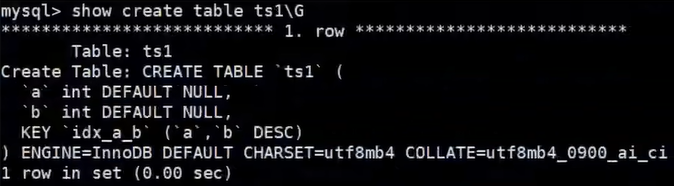

# 第8章 索引的创建与设计原则

[(37条消息) MySQL高级篇知识点——索引的创建与设计原则_星许辰的博客-CSDN博客](https://blog.csdn.net/weixin_43004044/article/details/126419076)

## 1. 索引的声明与使用

### 1.1 索引的分类

> ​		MySQL的索引包括**普通索引**、**唯一性索引**、**全文索引**、**单列索引**、**多列索引** 和 **空间索引** 等。
>
> - 从 **<font color="blue">功能逻辑（应用层次）</font>** 上说，索引**主要**有 4 种，分别是普通索引、唯一索引、主键索引、全文索引。 
> - 按照 **<font color="blue">物理实现方式</font>** ，索引可以分为 2 种：聚簇索引和非聚簇索引。 
> - 按照 **<font color="blue">作用字段个数</font>** 进行划分，分成单列索引和联合索引。
> - 从 **<font color="blue">存储的数据结构</font>** 来划分：BTree索引（B-Tree或B+Tree索引），Hash索引，full-index全文索引，R-Tree索引。这里所描述的是索引存储时保存的形式。


#### 1）普通索引

​		**在创建普通索引时，不附加任何限制/约束条件，只是用于提高查询效率**。这类索引可以创建在**任何数据类型**中，其值是否唯一和非空，要由字段本身的完整性约束条件决定。建立索引以后，可以通过索引进行查询。例如，在表 `student` 的字段 `name` 上建立一个普通索引，查询记录时就可以根据该索引进行查询。


#### 2）唯一性索引

​		使用 `UNIQUE` 参数可以设置索引为**唯一性索引**，在创建唯一性索引时，限制该索引的值必须是唯一的，但允许有空值。在一张数据表里可以有多个唯一性索引。例如，在表 `student` 的字段 `email` 中创建唯一性索引，那么字段email的值就必须是唯一的。通过唯一性索引，可以**更快速**地确定某条记录（确定到一条记录后即可返回，不需要再向下查找）


#### 3）主键索引

​		主键索引就是一种**特殊的唯一性索引**，在唯一性索引的基础上增加了**不为空的约束**，也就是`NOT NULL+UNIQUE`。一张表里最多只有一个主键索引。这是由主键索引的物理实现方式决定的，因为数据的物理存储方式在文件中只能按照一种顺序进行存储。


#### 4）单列索引

​		在表中的单个字段上创建索引。单列索引只根据该字段迸行索引。单列索引既可以是普通索引，也可以是唯一性索引，还可以是全文索引。只要保证**该索引只对应一个字段即可**。一个表可以有**多个单列索引**。


#### 5）多列 (组合、联合) 索引

​		多列索引是在表的**多个字段组合**上创建的一个索引。该索引指向创建时对应的多个字段，可以通过这几个字段进行查询，但是只有查询条件中使用了这些字段中的**第一个字段**时才会被使用（最左匹配原则）。例如，在表中的字段id、name和gender上建立一个多列索引`idx_id_name_gender`，只有在查询条件中使用了字段id时该索引才会被使用。使用组合索引时遵循**最左前缀匹配原则**。


#### 6）全文索引

​		全文索引（也称全文检索）是目前 **搜索引擎** 使用的一种关键技术（也叫**倒排文档技术**）。它能够利用 **分词技术** 等多种算法智能分析出文本文字中关键词的频率和重要性，然后按照一定的算法规则智能地筛选出我们想要的搜索结果。**全文索引非常适合大型数据集，对于小的数据集，它的用处比较小**。在实际应用上，可以理解为，全文索引的出现就是在数据量大的时候替换模糊查询的。

​		使用参数 `FULLTEXT` 可以设置索引为全文索引。在定义索引的列上支持值的全文查找，允许在这些索引列中插入重复值和空值。全文索引只能创建在 `CHAR`、`VARCHAR` 或 `TEXT` 类型及其系列类型的字段上（**文本类型**），查询数据量较大的字符串类型的字段时，使用全文索引可以提高查询速度。例如，表 student 的字段 information 是 TEXT 类型，该字段包含了很多文字信息。在字段 `information` 上建立**全文索引**后，可以提高查询字段 information 的速度。

​		全文索引典型的有两种类型：**自然语言的全文索引** 和 **布尔全文索引**。自然语言搜索引擎将计算每一个文档对象和查询的相关度。这里，相关度是基于匹配的关键词的个数，以及关键词在文档中出现的次数。**在整个索引中出现次数越少的词语，匹配时的相关度就越高**（比如：语气助词、称呼词……）。相反，非常常见的单词将不会被搜索，如果一个词语的在超过 50% 的记录中都出现了，那么自然语言的搜索将不会搜索这类词语。

​		MySQL数据库从 3.23.3 版开始支持全文索引，但 MySQL5.6.4 以前只有 MyISAM 支持，5.6.4 版本以后 InnoDB 才支持。官方版本并不支持中文分词，需要第三方分词插件。在 5.7.6 版本，MySQL 内置了 `ngram` 全文解析器，用来支持亚洲语种的分词。测试或使用全文索引时，要先看一下自己的 MySQL 版本、存储引擎和数据类型是否支持全文索引。**而随着大数据时代的到来，关系型数据库应对全文索引的需求已力不从心，逐渐被 `solr`、`ElasticSearch` 等专门的搜索引擎所替代**。


#### 7）空间索引（了解）

​		使用参数 `SPATIAL` 可以设置索引为 **空间索引**。空间索引只能建立在空间数据类型上，这样可以提高系统获取空间数据的效率。MySQL 中的空间数据类型包括 `GEOMETRY`、`POINT`、`LINESTRING` 和 `POLYGON` 等。目前只有 **MyISAM** 存储引擎支持空间检索，而且索引的字段不能为空值。对于初学者来说，这类索引很少会用到。


#### 8）不同搜索引擎支持的索引的数据结构

>  ​		不同的存储引擎所支持的索引数据结构类型也不一样 。

| 存储引擎 \ 索引数据结构 | B+tree |  Hash  | Full-text |
| :---------------------: | :----: | :----: | :-------: |
|         InnoDB          |  支持  |  支持  |   支持    |
|         MyISAM          |  支持  |  支持  |  不支持   |
|         Memory          |  支持  |  支持  |  不支持   |
|           NDB           | 不支持 |  支持  |  不支持   |
|         Archive         | 不支持 | 不支持 |  不支持   |

 

### 1.2 创建索引

> ​		MySQL支持多种方法在单个或多个列上创建索引：在创建表的定义语句 `CREATE TABLE` 中指定索引列，使用 `ALTER TABLE` 语句在存在的表上创建索引，或者使用 `CREATE INDEX` 语句在已存在的表上添加索引。


#### 1. 创建表的时候创建索引

##### 1）隐式创建索引

> ​		使用CREATE TABLE创建表时，除了可以定义列的数据类型外，还可以定义**主键约束**、**外键约束** 或者 **唯一性约束**，**<font color="red">即在声明有主键约束、唯一性约束、外键约束的字段上，会自动的添加相关的索引</font>**。


举例：

```mysql
CREATE TABLE dept(
    dept_id INT PRIMARY KEY AUTO_INCREMENT，
    dept_name VARCHAR(20)
);

CREATE TABLE emp(
    emp_id INT PRIMARY KEY AUTO_INCREMENT，
    emp_name VARCHAR(20) UNIQUE，
    dept_id INT，
    CONSTRAINT emp_dept_id_fk FOREIGN KEY(dept_id) REFERENCES dept(dept_id)
)
```


##### 2）显示创建索引

> ​	显式创建表时创建索引的基本语法格式如下：

```mysql
CREATE TABLE table_name (
    [col_name data_type] * n,
    ……
	[UNIQUE | FULLTEXT | SPATIAL] [INDEX | KEY] [index_name](col_name[(length)] [ASC |
DESC]
    );
```

* UNIQUE 、 FULLTEXT 和 SPATIAL 为可选参数，分别表示唯一索引、全文索引和空间索引； 
* INDEX 与 KEY 为同义词，两者的作用相同，用来指定创建索引； 
* index_name 指定索引的名称，为可选参数，如果不指定，那么MySQL默认col_name为索引名； 
* col_name 为需要创建索引的字段列，该列必须从数据表中定义的多个列中选择； 
* length 为可选参数，表示**索引的长度，只有字符串类型的字段才能指定索引长度**； 
* ASC 或 DESC 指定升序或者降序的索引值存储。【降序索引/升序索引】


###### ① 创建普通索引

在book表中的year_publication字段上建立普通索引，SQL语句如下：

```mysql
CREATE TABLE book(
    book_id INT ，
    book_name VARCHAR(100)，
    authors VARCHAR(100)，
    info VARCHAR(100) ，
    comment VARCHAR(100)，
    year_publication YEAR，
    INDEX(year_publication)  # 普通索引：赤裸裸的INDEX index_name(colum_name)
);
```


###### ② 创建唯一索引

```mysql
CREATE TABLE test1(
    id INT NOT NULL，
    name varchar(30) NOT NULL，
    UNIQUE INDEX uk_idx_id(id)   # UNIQUE INDEX
);
```

该语句执行完毕之后，查看表中所存在的索引：

```mysql
SHOW INDEX FROM test1\G
```


###### ③ 创建主键索引

> ​		设定为主键后数据库会自动建立索引，在InnoDB中即为聚簇索引，语法：

* 随表一起建索引：

```mysql
CREATE TABLE student (
    id INT(10) UNSIGNED AUTO_INCREMENT ，
    student_no VARCHAR(200)，
    student_name VARCHAR(200)，
    PRIMARY key(id)
);
```

* 删除主键索引：

```mysql
ALTER TABLE student
drop PRIMARY KEY;
```

* 修改主键索引：必须先删除掉(drop)原索引，再新建(add)索引


###### ④ 创建单列索引

引举:

```mysql
CREATE TABLE test2(
    id INT NOT NULL，
    name CHAR(50) NULL，
    INDEX single_idx_name(name(20))
);
```

该语句执行完毕之后，查看表中所存在的索引：

```mysql
SHOW INDEX FROM test2 \G
```


###### ⑤ 创建组合索引

举例：创建表test3，在表中的id、name和age字段上建立组合索引，SQL语句如下：

```mysql
CREATE TABLE test3(
    id INT(11) NOT NULL，
    name CHAR(30) NOT NULL，
    age INT(11) NOT NULL，
    info VARCHAR(255)，
    INDEX multi_idx(id，name，age)
);
```

该语句执行完毕之后，使用SHOW INDEX 查看：

```mysql
SHOW INDEX FROM test3 \G
```

在test3表中，查询id和name字段，使用EXPLAIN语句查看索引的使用情况：

```mysql
EXPLAIN SELECT * FROM test3 WHERE id=1 AND name='songhongkang' \G
```

​		可以看到，查询id和name字段时，使用了名称为MultiIdx的索引，如果查询 (name， age) 组合或者单独查询name和age字段，会发现结果中possible_keys和key值为NULL， 并没有使用在t3表中创建的索引进行查询。


###### ⑥ 创建全文索引

⑥ 创建全文索引

​		FULLTEXT全文索引可以用于**全文检索**，并且只为 `CHAR` 、`VARCHAR` 和 `TEXT` 列创建索引。索引总是对整个列进行，不支持局部 (前缀) 索引。

- 举例1：创建表test4，在表中的info字段上建立全文索引，SQL语句如下：

```mysql
CREATE TABLE test4(
    id INT NOT NULL，
    name CHAR(30) NOT NULL，
    age INT NOT NULL，
    info VARCHAR(255)，
    FULLTEXT INDEX futxt_idx_info(info)
) ENGINE=MyISAM DEFAULT CHARSET=utf8;
```

> ​		在MySQL5.7及之后版本中可以不指定最后的ENGINE了，因为在此版本中InnoDB支持全文索引。

该语句执行完毕之后，查看表中所存在的索引：

```mysql
SHOW INDEX FROM test4 \G
```

由结果可以看到，info字段上已经成功建立了一个名为futxt_idx_info的FULLTEXT索引。


- #### 使用全文索引的方式

不同于like方式的的查询：

```mysql
SELECT * FROM papers WHERE content LIKE ‘%查询字符串%’;
```

**全文索引用`match + against`方式查询：**

```mysql
SELECT * FROM papers WHERE MATCH(title，content) AGAINST (‘查询字符串’);
```

**相比于非右模糊查询（`like col%`），全文检索可以明显的提高查询效率**。


> - 全文索引使用注意事项
>    - 使用全文索引前，搞清楚版本支持情况
>     - **全文索引比 like + % 快 N 倍，但是可能存在精度问题**
>     - 如果全文索引的是大量数据，建议先添加数据，再创建索引


###### ⑦ 创建空间索引

空间索引创建中，要求空间类型的字段必须为 **非空** 。

举例：创建表test5，在空间类型为GEOMETRY的字段上创建空间索引，SQL语句如下：

```mysql
CREATE TABLE test5(
    geo GEOMETRY NOT NULL，
    SPATIAL INDEX spa_idx_geo(geo)
) ENGINE=MyISAM;
```

该语句执行完毕之后，使用SHOW CREATE TABLE查看表结构：

```mysql
SHOW INDEX FROM test5 \G
```

​		可以看到，test5表的geo字段上创建了名称为spa_idx_geo的空间索引。注意创建时指定空间类型字段值的非空约束，并且表的存储引擎为MyISAM。


#### 2. 在已经存在的表上创建索引

> ​	在已经存在的表中创建索引可以使用 `ALTER TABLE`语句 或者 `CREATE INDEX`语句。

###### ① 使用ALTER TABLE语句创建索引 

​		ALTER TABLE语句创建索引的基本语法如下：

```mysql
ALTER TABLE table_name 
ADD [UNIQUE | FULLTEXT | SPATIAL] [INDEX | KEY] [index_name](col_name[(length)], ...) [ASC | DESC]
```


###### ② 使用CREATE INDEX创建索引 

​		CREATE INDEX语句可以在已经存在的表上添加索引，在MySQL中， CREATE INDEX被映射到一个ALTER TABLE语句上，基本语法结构为：

```mysql
CREATE [UNIQUE | FULLTEXT | SPATIAL] INDEX index_name
ON table_name (col_name[length]，...) [ASC | DESC]
```


### 1.3 查看表中创建的索引

### `show index from table_name;`

参数解析：

1. `Table`: 表名

2. `Non_unique`: 如果索引不能包括重复值则为0，如果可以则为1（<u>唯一索引值为0；非唯一索引值为1</u>）。也就是平时所说的**唯一索引**。

3. `Key_name`：索引名称，如果**名字相同**则表明是同一个索引，而并不是重复，比如上图中的第四、五条数据，索引名称都是name，其实是一个**联合索引**。

4. `Seq_in_index`：索引中的列序列号，从1开始。上图中的四、五条数据，Seq_in_index一个是1一个是2，就是表明在联合索引中的顺序，我们就能推断出**联合索引中索引的前后顺序**。从左往右算的顺序。

5. `Column_name`：索引的列名。

6. `Collation`：指的是列以什么方式存储在索引中，大概意思就是**字符序**。

7. `Cardinality`：是基数的意思，表示索引中<font color="blue">唯一数据</font>的估计值。我们知道某个字段的重复值越少越适合建索引，所以**我们一般都是根据Cardinality来判断索引是否具有高选择性**，如果这个值非常小，那就需要重新评估这个字段是否适合建立索引。

8. `Sub_part`：前置索引的意思，如果列只是被部分地编入索引，则为被编入索引的字符的数目。**如果整列被编入索引，则为NULL**。

9. `Packed`：指示关键字如何被压缩。**如果没有被压缩，则为NULL**。压缩一般包括压缩传输协议、压缩列解决方案和压缩表解决方案。

10. `Null`：如果列含有NULL，则含有YES。

11. `Index_type`：表示索引数据结构类型，MySQL目前主要有以下几种索引类型：FULLTEXT，HASH，BTREE，RTREE。

12. `Index_comment`：注释的意思。


### 1.4 删除索引

#### 1）使用ALTER TABLE删除索引

​		ALTER TABLE删除索引的基本语法格式如下：

```mysql
ALTER TABLE table_name 
DROP INDEX index_name;
```


#### 2）使用DROP INDEX语句删除索引 

DROP INDEX删除索引的基本语法格式如下：

```mysql
DROP INDEX index_name 
ON table_name;
```


##### 索引删除注意事项

> ① 添加 `AUTO_INCREMENT` 约束字段的**键列索引（主键列、唯一键列）**不能被删除。它们俩息息相关，不可被割舍。
> ② 删除表中的列时，如果要删除的列为索引的组成部分，则该列也会从索引中删除。如果组成索引的所有列都被删除，则整个索引将被删除。


## 2. MySQL8.0索引新特性

### 2.1 支持降序索引

> ​		降序索引使用 **降序** 来存储键值。虽然在语法上，从 MySQL 4 版本开始就已经支持 降序索引 的语法了，但实际上 `DESC` 的定义是被忽略的（**语法上支持，但物理上的实现不支持**），直到MySQL 8.x版本才开始真正支持降序索引 (仅限于InnoDB存储引擎)。

​		**MySQL在8.0版本之前创建的降序索引其本质仍然是升序索引，只是在使用时进行反向扫描达到了降序索引的效果，但这却大大降低了效率**。在某些场景下，降序索引意义重大。例如，如果一个查询，需要对多个列进行排序，且顺序要求不一致，那么使用降序索引将会避免数据库使用额外的文件排序操作，从而提高性能。

举例：分别在MySQL 5.7版本和MySQL 8.0版本中创建数据表ts1，结果如下：

```mysql
CREATE TABLE ts1 (
    a int,
    b int,
    index idx_a_b(a, b desc)
);
```

在 MySQL 5.7 版本中查看数据表ts1的结构，结果如下:


**从结果可以看出，索引仍然是默认的升序**


在 MySQL 8.0 版本中查看数据表ts1的结构，结果如下：



**从结果可以看出，索引已经是降序了**。


下面继续测试降序索引在执行计划中的表现。

- 分别在MySQL 5.7版本和MySQL 8.0版本的数据表ts1中插入800条随机数据，执行语句如下：

```mysql
DELIMITER //
CREATE PROCEDURE ts_insert()
BEGIN
	DECLARE i INT DEFAULT 1;
	WHILE i < 800
	DO
		insert into ts1 select rand()*80000， rand()*80000;
		SET i = i+1;
	END WHILE;
	commit;
END //
DELIMITER;

# 调用
CALL ts_insert();
```

- 在`MySQL 5.7`版本中查看数据表 ts1 的执行计划
- 在`MySQL 8.0`版本中查看数据表 ts1 的执行计划

```mysql
EXPLAIN SELECT * FROM ts1 ORDER BY a， b DESC LIMIT 5;
```


> ​		从结果可以看出，创建降序索引后，MySQL 8.0 的执行计划要明显优于MySQL 5.7。


### 2.2 隐藏索引

​		在MySQL 5.7版本及之前，只能通过显式的方式删除索引。此时，如果发现删除索引后出现错误，又只能通过显式创建索引的方式将删除的索引创建回来。如果数据表中的数据量非常大，或者数据表本身比较大，这种操作就会消耗系统过多的资源，操作成本非常高。

​		从MySQL 8.x开始支持 **隐藏索引（invisible indexes）** ，只需要将待删除的索引设置为隐藏索引，使查询优化器不再使用这个索引（即使使用`force index`（强制使用索引），优化器也不会使用该索引）， 确认将索引设置为隐藏索引后对系统没有任何影响，就可以彻底的删除索引。 这种通过先将索引设置为隐藏索引，再删除索引的方式就是**<font color="blue">软删除</font>**。所以，如果你想验证某个索引删除之后的 **查询性能影响**，就可以暂时先隐藏该索引。

> 注意：
>
> ​		主键不能被设置为隐藏索引。当表中没有显式主键时，表中第一个唯一非空索引会成为隐式主键，也不能设置为隐藏索引。如果在整个表中没有找到**唯一非空**的索引，MySQL会生成隐藏列（`rowID`）来作为隐式主键。

​		**索引默认是可见的**，在使用CREATE TABLE， CREATE INDEX 或者 ALTER TABLE 等语句时可以通过 `VISIBLE` 或者 `INVISIBLE` 关键词设置索引的可见性。


#### 1）创建表时直接创建

​		在MySQL中创建隐藏索引通过SQL语句 `INVISIBLE` 来实现，其语法形式如下：

```mysql
CREATE TABLE tablename(
    propname1 type1[CONSTRAINT1]，
    propname2 type2[CONSTRAINT2]，
    ……
    propnamen typen，
    INDEX [indexname](propname1 [(length)]) INVISIBLE
);
```

上述语句比普通索引多了一个关键字INVISIBLE，用来标记索引为不可见索引。


#### 2）在已经存在的表上创建

可以为已经存在的表设置隐藏索引，其语法形式如下：

```mysql
CREATE INDEX indexname
ON tablename(propname[(length)]) INVISIBLE;
```


#### 3）通过ALTER TABLE语句创建

语法形式如下：

```mysql
ALTER TABLE tablename
ADD INDEX indexname (propname [(length)]) INVISIBLE;
```


#### 4）切换索引可见状态

已存在的索引可通过如下语句切换可见状态：

```mysql
ALTER TABLE tablename ALTER INDEX index_name INVISIBLE; #切换成隐藏索引
ALTER TABLE tablename ALTER INDEX index_name VISIBLE; #切换成非隐藏索引
```

如果将index_cname索引切换成可见状态，通过 `explain` 查看执行计划，优化器会选择使用index_cname索引。

> ​		注意：当索引被隐藏时，它仍然会像正常索引一样实时更新。如果一个索引需要**长期被隐藏**，那么**可以将其删除**，因为隐藏索引的存在会影响插入、更新和删除的性能。

通过设置隐藏索引的可见性可以查看索引对调优的帮助。


#### 5）使隐藏索引对查询优化器可见

​		在MySQL 8.x版本中，为索引提供了一种新的测试方式，可以通过查询优化器的一个开关 (`use_invisible_indexes`) 来打开某个设置，**使隐藏索引对查询优化器可见**。如果 `use_invisible_indexes` 设置为 `off (默认)`，**优化器会忽略隐藏索引**。如果设置为 `on`，即使隐藏索引不可见，优化器在生成执行计划时仍会考虑使用隐藏索引。


- 在MySQL命令行执行如下命令查看查询优化器的开关设置。

```mysql
 select @@optimizer_switch \G
```

- 在输出的结果信息中找到如下属性配置。

```mysql
use_invisible_indexes=off
```

**此属性配置值为off，说明隐藏索引默认对查询优化器不可见**。


- 使隐藏索引对查询优化器可见，需要在MySQL命令行执行如下命令：

```mysql
 set session optimizer_switch="use_invisible_indexes=on";
Query OK， 0 rows affected (0.00 sec)
```

- SQL语句执行成功，再次查看查询优化器的开关设置

```mysql
 select @@optimizer_switch \G
*************************** 1. row ***************************
@@optimizer_switch:
index_merge=on，index_merge_union=on，index_merge_sort_union=on，index_merge_
intersection=on，engine_condition_pushdown=on，index_condition_pushdown=on，mrr=on，mrr_co
st_based=on，block_nested_loop=on，batched_key_access=off，materialization=on，semijoin=on
，loosescan=on，firstmatch=on，duplicateweedout=on，subquery_materialization_cost_based=on
，use_index_extensions=on，condition_fanout_filter=on，derived_merge=on，use_invisible_ind
exes=on，skip_scan=on，hash_join=on
1 row in set (0.00 sec)
```

- 此时，在输出结果中可以看到如下属性配置：

```mysql
use_invisible_indexes=on
```

**use_invisible_indexes属性的值为on，说明此时隐藏索引对查询优化器可见**。


- 使用EXPLAIN查看以字段 `invisible_column` 作为查询条件时的索引使用情况。

```mysql
explain select * from classes where cname = '高一2班';
```

**此时，查询优化器会使用隐藏索引来查询数据**。


- 如果需要使隐藏索引对查询优化器不可见，则只需要执行如下命令即可。

```mysql
 set session optimizer_switch="use_invisible_indexes=off";
Query OK， 0 rows affected (0.00 sec)
```

再次查看查询优化器的开关设置。

```mysql
 select @@optimizer_switch \G
```

此时，use_invisible_indexes属性的值已经被设置为“off”。


## 3. 索引的设计原则

> ​		为了使索引的使用效率更高，在创建索引时，必须考虑在哪些字段上创建索引和创建什么类型的索引。**索引设计不合理或者缺少索引都会对数据库和应用程序的性能造成障碍。**高效的索引对于获得良好的性能非常重要。设计索引时，应该考虑相应准则。


### 3.1 数据准备

**第1步：创建数据库、创建表**

```mysql
CREATE DATABASE atguigudb1;
USE atguigudb1;
#1.创建学生表和课程表
CREATE TABLE `student_info` (
    `id` INT(11) NOT NULL AUTO_INCREMENT，
    `student_id` INT NOT NULL ，
    `name` VARCHAR(20) DEFAULT NULL，
    `course_id` INT NOT NULL ，
    `class_id` INT(11) DEFAULT NULL，
    `create_time` DATETIME DEFAULT CURRENT_TIMESTAMP ON UPDATE CURRENT_TIMESTAMP，
    PRIMARY KEY (`id`)
) ENGINE=INNODB AUTO_INCREMENT=1 DEFAULT CHARSET=utf8;

CREATE TABLE `course` (
    `id` INT(11) NOT NULL AUTO_INCREMENT，
    `course_id` INT NOT NULL ，
    `course_name` VARCHAR(40) DEFAULT NULL，
    PRIMARY KEY (`id`)
) ENGINE=INNODB AUTO_INCREMENT=1 DEFAULT CHARSET=utf8;
```

**第2步：创建模拟数据必需的存储函数**

```mysql
#函数1：创建随机产生字符串函数
DELIMITER //
CREATE FUNCTION rand_string(n INT)
	RETURNS VARCHAR(255) #该函数会返回一个字符串
BEGIN
	DECLARE chars_str VARCHAR(100) DEFAULT
'abcdefghijklmnopqrstuvwxyzABCDEFJHIJKLMNOPQRSTUVWXYZ';
	DECLARE return_str VARCHAR(255) DEFAULT '';
    DECLARE i INT DEFAULT 0;
    WHILE i < n DO
    	SET return_str =CONCAT(return_str，SUBSTRING(chars_str，FLOOR(1+RAND()*52)，1));
    	SET i = i + 1;
    END WHILE;
    RETURN return_str;
END //
DELIMITER ;
```

```mysql
#函数2：创建随机数函数
DELIMITER //
CREATE FUNCTION rand_num (from_num INT ，to_num INT) RETURNS INT(11)
    BEGIN
        DECLARE i INT DEFAULT 0;
        SET i = FLOOR(from_num +RAND()*(to_num - from_num+1)) ;
        RETURN i;
    END //
DELIMITER ;
```

创建函数，假如报错：

```mysql
This function has none of DETERMINISTIC......
```

由于开启过慢查询日志bin-log， 我们就必须为我们的function指定一个参数。

> ​		主从复制，主机会将写操作记录在bin-log日志中。从机读取bin-log日志，执行语句来同步数据。如果使 用函数来操作数据，会导致从机和主机的操作时间不一致。所以，默认情况下，mysql不开启创建函数设置。

* 查看mysql是否允许创建函数：

```mysql
show variables like 'log_bin_trust_function_creators';
```

* 命令开启：允许创建函数设置：

```mysql
set global log_bin_trust_function_creators=1; # 不加global只是当前会话有效。
```

* mysqld重启，上述参数又会消失。永久方法：

    * windows下：my.ini[mysqld]加上：

        ```mysql
        log_bin_trust_function_creators=1
        ```

    * linux下：/etc/my.cnf下my.cnf[mysqld]加上：

        ```mysql
        log_bin_trust_function_creators=1
        ```

**第3步：创建插入模拟数据的存储过程**

```mysql
# 存储过程1：创建插入课程表存储过程
DELIMITER //
CREATE PROCEDURE insert_course( max_num INT )
BEGIN
DECLARE i INT DEFAULT 0;
SET autocommit = 0; #设置手动提交事务
REPEAT #循环
SET i = i + 1; #赋值
INSERT INTO course (course_id， course_name ) VALUES
(rand_num(10000，10100)，rand_string(6));
UNTIL i = max_num
END REPEAT;
COMMIT; #提交事务
END //
DELIMITER ;
```

```mysql
# 存储过程2：创建插入学生信息表存储过程
DELIMITER //
CREATE PROCEDURE insert_stu( max_num INT )
BEGIN
DECLARE i INT DEFAULT 0;
SET autocommit = 0; #设置手动提交事务
REPEAT #循环
SET i = i + 1; #赋值
INSERT INTO student_info (course_id， class_id ，student_id ，NAME ) VALUES
(rand_num(10000，10100)，rand_num(10000，10200)，rand_num(1，200000)，rand_string(6));
UNTIL i = max_num
END REPEAT;
COMMIT; #提交事务
END //
DELIMITER ;
```

**第4步：调用存储过程**

```mysql
CALL insert_course(100);
```

```mysql
CALL insert_stu(1000000);
```


### 3.2 哪些情况适合创建索引

- #### 关闭查询缓存

（1）下面将介绍一些适合创建索引的情况，并且会用上面的数据进行测试。由于有些低版本的 MySQL 默认开启了**查询缓存**，所以为了反映真实的效果，需要**关闭**查询缓存。

```mysql
SHOW VARIABLES LIKE '%query_cache%';
```

|                         查看查询缓存                         |
| :----------------------------------------------------------: |
|  |


（2）关闭查询缓存的方法：
**① 临时关闭**

```mysql
set global query_cache_size=0
set global query_cache_type=0
```

**② 永久关闭**

```mysql
# 修改 MySQL 配置文件
# windows下：my.ini[mysqld] 加上/设置：
query_cache_size=0
query_cache_type=0

# linux下：/etc/my.cnf下my.cnf[mysqld]加上/设置：
query_cache_size=0
query_cache_type=0
```

修改 MySQL 配置文件后需要重启 MySQL ，设置才能生效。


------

#### 1）字段的数值有唯一性的限制

​		索引本身可以起到约束的作用，比如**唯一索引**、**主键索引**都是可以起到同唯一性约束一样的作用的，因此在我们的数据表中，**如果某个字段是需要设置为唯一性的，就可以直接创建唯一性索引，或者主键索引**。这样可以更快速地通过该索引来确定某条记录。
​		例如，学生表中学号是具有唯一性的字段，为该字段建立唯一性索引可以很快确定某个学生的信息（你是唯一的，我只要找到你一次就完事了，不需要再继续找下去），如果使用姓名的话，可能存在同名现象，从而降低查询速度。

> 业务上具有唯一特性的字段，即使是组合字段，也必须建成唯一索引。（来源：Alibaba） 
>
> 说明：**不要以为唯一索引影响了 insert 速度，这个速度损耗可以忽略，但提高查找速度是非常明显的**。


#### 2）频繁作为 WHERE 查询条件的字段

​		如果某个字段在SELECT语句的 `WHERE` 条件中经常被使用到，那么就需要给这个字段创建索引了。**尤其是在数据量大的情况下，就算创建的是普通索引也可以大幅提升数据查询的效率**。 

​		比如student_info数据表（含100万条数据），假设我们想要查询 student_id=123110 的用户信息。

```mysql
# 查看当前 stduent_info 表中的索引，目前只有主键(id)索引
SHOW INDEX FROM student_info;

# student_id 字段上没有索引
SELECT course_id， class_id， NAME， create_time， student_id 
FROM student_info
WHERE student_id = 123110;  # 375 ms

# 给 student_id 字段添加索引
ALTER TABLE student_info ADD INDEX idx_sid(student_id);

#student_id字段上有索引
SELECT course_id， class_id， NAME， create_time， student_id 
FROM student_info
WHERE student_id = 123110; # 6 ms
```


|                           查询结果                           |
| :----------------------------------------------------------: |
|  |


#### 3）经常 GROUP BY 和 ORDER BY 的列

[ 一个容易被忽略的SQL调优技巧 --- order by字段到底要不要加入索引](https://blog.csdn.net/asdasdasd123123123/article/details/106783196/)

- 三种情况
    - 只有ORDER BY
    - 只有GROUP BY
    - GROUP BY 和 ORDER BY 同时存在（**注意索引的创建顺序。根据SQL执行顺序来创建**）

------

​		索引就是让数据按照某种**顺序**进行**存储或检索**，因此当我们使用 `GROUP BY` 对数据进行分组查询，或者使用 `ORDER BY` 对数据进行排序的时候，就需要对分组或者排序的字段进行索引 。如果待排序的列有多个，那么可以在这些列上建立**联合索引** 。

​		比如，按照 student_id 对学生选修的课程进行分组，显示不同的 student_id 和课程数量，显示 100 个即可。**仅仅只有 `ORDER BY` 的情况**，案例如下所示：

```mysql
# student_id 字段上有索引
SELECT student_id， COUNT(*) AS num 
FROM student_info 
GROUP BY student_id LIMIT 100; # 4 ms

# 删除 idx_sid 索引
DROP INDEX idx_sid ON student_info;

# student_id 字段上没有索引
SELECT student_id， COUNT(*) AS num 
FROM student_info 
GROUP BY student_id LIMIT 100;  # 689 ms
```

​		同样，如果是**仅仅只有 `ORDER BY`的情况**，也需要对字段创建索引。


​		如果同时有 `GROUP BY` 和 `ORDER BY` 的情况：比如我们按照 `student_id` 进行分组，同时按照创建时间降序的方式进行排序，这时我们就需要同时进行 GROUP BY 和 ORDER BY，那么是不是需要单独创建 student_id 的索引和 create_time 的索引呢？

① 当我们对 student_id 和 create_time **分别创建索引**，执行下面的 SQL 查询：

> ​		其实只会使用为 `GROUP BY` 所使用的字段创建的索引。

```mysql
#添加单列索引
ALTER TABLE student_info
ADD INDEX idx_sid(student_id);

ALTER TABLE student_info
ADD INDEX idx_cre_time(create_time);

SELECT student_id， COUNT(*) AS num FROM student_info 
GROUP BY student_id 
ORDER BY create_time DESC 
LIMIT 100;  # 5.265 s

# 如果出现 this is incompatible with sql_mode=only_full_group_by 等错误信息，可执行下面的语句
SELECT @@sql_mode;
SET @@sql_mode = 'STRICT_TRANS_TABLES，NO_ZERO_IN_DATE，NO_ZERO_DATE，ERROR_FOR_DIVISION_BY_ZERO，NO_ENGINE_SUBSTITUTION';
```


② 对 student_id 和 create_time 创建**联合索引**。顺序为 `(student_id，create_time)` 。

```mysql
ALTER TABLE student_info
ADD INDEX idx_sid_cre_time(student_id，create_time DESC);

SELECT student_id， COUNT(*) AS num FROM student_info 
GROUP BY student_id 
ORDER BY create_time DESC
LIMIT 100;  # 0.257 s
```


③ 如果我们创建联合索引的顺序为 `(create_time， student_id)` 呢？运行时间为 3.790 s

> ​		**<font color="red">因为在进行 SELECT 查询的时候，先进行GROUP BY，再对数据进行 ORDER BY 的操作，所以按照 (student_id， create_time) 这个联合索引的顺序效率是最高的</font>**。

```mysql
ALTER TABLE student_info
ADD INDEX idx_cre_time_sid(create_time DESC，student_id);

DROP INDEX idx_sid_cre_time ON student_info;

SELECT student_id， COUNT(*) AS num FROM student_info 
GROUP BY student_id 
ORDER BY create_time DESC 
LIMIT 100;  # 3.790s
```


#### 4）UPDATE、DELETE 的 <font color="red">WHERE 条件列</font>

​		对数据进行 UPDATE 或 DELETE 的操作，如果对 WHERE 条件所用的字段创建了索引，就能大幅提升效率。原理是因为我们需要先根据 WHERE 条件列检索出来这条记录，然后再对它进行更新或删除。**<font color="red">如果进行更新的时候，where条件所用字段为索引字段，而被更新的字段是非索引字段，提升的效率会更明显，这是因为非索引字段的更新不需要对索引进行维护</font>**。

```mysql
SHOW INDEX FROM student_info;

UPDATE student_info SET student_id = 10002 
WHERE NAME = '462eed7ac6e791292a79';  # 0.733 s

#添加索引
ALTER TABLE student_info
ADD INDEX idx_name(NAME);

UPDATE student_info SET student_id = 10001 
WHERE NAME = '462eed7ac6e791292a79'; # 0.003 s
```


#### 5）DISTINCT 字段适合创建索引

​		有时候我们需要对某个字段进行去重，使用 `DISTINCT`，那么对这个字段创建索引，也会提升查询效率。 

​		比如，我们想要查询课程表中不同的 student_id 都有哪些，如果我们没有对 student_id 创建索引，执行 SQL 语句：

```mysql
SELECT DISTINCT(student_id) FROM `student_info`;
```

运行结果（600637 条记录，运行时间 0.683s ）

​		如果我们对 student_id 创建索引，再执行 SQL 语句：

```mysql
SELECT DISTINCT(student_id) FROM `student_info`;
```

运行结果（600637 条记录，运行时间 0.010s ）

​		你能看到 SQL 查询效率有了提升，同时显示出来的 student_id 还是按照**递增**的顺序进行展示的。**这是因为索引会对数据按照某种顺序进行排序，所以在去重的时候也会快很多（去重的那一坨挨在了一块儿）**。


### 3.3 哪些情况不适合创建索引

#### 1）在where中使用不到的字段，不要设置索引

> ​		WHERE条件 (包括 GROUP BY、ORDER BY) 里用不到的字段不需要创建索引，索引的价值是快速定位，如果起不到定位的字段通常是不需要创建索引的。举个例子：

```mysql
SELECT course_id， student_id， create_time
FROM student_info
WHERE student_id = 41251;
```

因为我们是按照 student_id 来进行检索的，所以不需要对其他字段创建索引，即使这些字段出现在SELECT字段中。


#### 2）数据量小的表最好不要使用索引

> ​		如果表记录太少，比如少于1000个，那么是不需要创建索引的。表记录太少，是否创建索引 `对查询效率的影响并不大`。甚至说，查询花费的时间可能比遍历索引的时间还要短，索引可能不会产生优化效果。

举例：创建表1：

```mysql
CREATE TABLE t_without_index(
    a INT PRIMARY KEY AUTO_INCREMENT，
    b INT
);
```

提供存储过程1：

```mysql
#创建存储过程
DELIMITER //
CREATE PROCEDURE t_wout_insert()
BEGIN
    DECLARE i INT DEFAULT 1;
    WHILE i <= 900
    DO
        INSERT INTO t_without_index(b) SELECT RAND()*10000;
        SET i = i + 1;
    END WHILE;
    COMMIT;
END //
DELIMITER ;

#调用
CALL t_wout_insert()
```

创建表2：

```mysql
CREATE TABLE t_with_index(
    a INT PRIMARY KEY AUTO_INCREMENT，
    b INT，
    INDEX idx_b(b)
);
```

创建存储过程2：

```mysql
#创建存储过程
DELIMITER //
CREATE PROCEDURE t_with_insert()
BEGIN
    DECLARE i INT DEFAULT 1;
    WHILE i <= 900
    DO
        INSERT INTO t_with_index(b) SELECT RAND()*10000;
        SET i = i + 1;
    END WHILE;
    COMMIT;
END //
DELIMITER ;

#调用
CALL t_with_insert();
```

查询对比：

```mysql
 select * from t_without_index where b = 9879;
+------+------+
| a | b |
+------+------+
| 1242 | 9879 |
+------+------+
1 row in set (0.00 sec)

 select * from t_with_index where b = 9879;
+-----+------+
| a | b |
+-----+------+
| 112 | 9879 |
+-----+------+
1 row in set (0.00 sec)
```

你能看到运行结果相同，但是在数据量不大的情况下，索引就发挥不出作用了。

> ​		结论：在数据表中的数据行数比较少的情况下，比如不到 1000 行，是不需要创建索引的。


#### 3）有大量重复数据的列上不要建立索引

​		在条件表达式中经常用到的不同值较多的列上建立索引，但字段中如果有大量重复数据，也不用创建索引。比如在学生表的"性别"字段上只有“男”与“女”两个不同值，因此无须建立索引。如果建立索引，不但不会提高查询效率，反而会`严重降低数据更新速度`。

- 举例1：要在 100 万行数据中查找其中的 50 万行（比如性别为男的数据），一旦创建了索引，你需要先访问 50 万次索引，然后再访问 50 万次数据表，这样加起来的开销比不使用索引可能还要大。

- 举例2：假设有一个学生表，学生总数为 100 万人，男性只有 10 个人，也就是占总人口的 10 万分之 1。学生表 student_gender 结构如下。其中数据表中的 student_gender 字段取值为 0 或 1，0 代表女性，1 代表男性。

```mysql
CREATE TABLE student_gender(
    student_id INT(11) NOT NULL，
    student_name VARCHAR(50) NOT NULL，
    student_gender TINYINT(1) NOT NULL，
    PRIMARY KEY(student_id)
)ENGINE = INNODB;
```

如果我们要筛选出这个学生表中的男性，可以使用：

```mysql
SELECT * FROM student_gender WHERE student_gender = 1;
```

> 结论：当数据重复度大，比如 高于 10% 的时候，也不需要对这个字段使用索引。


#### 4）避免对经常更新的表创建过多的索引

- 第一层含义：**频繁更新的<font color="blue">字段</font>不一定要创建索引**。因为更新数据的时候，也需要更新索引，如果索引太多，在更新索引的时候也会造成负担，从而影响效率。

- 第二层含义：**避免对经常更新的<font color="blue">表</font>创建过多的索引，并且索引中的<font color="blue">列</font>尽可能少**。此时，虽然提高了查询速度，同时却降低了更新表的速度。


#### 5）不建议用<font color="##ffce47">无序</font>的值作为索引

​		例如身份证、UUID(在索引比较时需要转为ASCII，并且插入时可能造成页分裂)、MD5、HASH、无序长字符串等。


#### 6）删除不再使用或者很少使用的索引

​		表中的数据被大量更新，或者数据的使用方式被改变后，原有的一些索引可能不再需要。数据库管理员应当定期找出这些索引，将它们删除，从而减少索引对更新操作的影响。


#### 7）不要定义冗余或重复的索引

① 冗余索引 

举例：建表语句如下

```mysql
CREATE TABLE person_info(
    id INT UNSIGNED NOT NULL AUTO_INCREMENT，
    name VARCHAR(100) NOT NULL，
    birthday DATE NOT NULL，
    phone_number CHAR(11) NOT NULL，
    country varchar(100) NOT NULL，
    PRIMARY KEY (id)，
    KEY idx_name_birthday_phone_number (name(10)， birthday， phone_number)，
    KEY idx_name (name(10))    # 冗余索引
);
```

> ​		我们知道，通过 idx_name_birthday_phone_number 索引就可以对 name 列进行快速搜索，再创建一个专门针对 name 列的索引就算是一个 冗余索引 ，维护这个索引只会增加维护的成本，并不会对搜索有 什么好处。


② 重复索引 

另一种情况，我们可能会**对某个列重复建立索引** ，比方说这样：

```mysql
CREATE TABLE repeat_index_demo (
    col1 INT PRIMARY KEY，
    col2 INT，
    UNIQUE uk_idx_c1 (col1)，   # 重复索引：给主键建立`唯一索引`
    INDEX idx_c1 (col1)         # 重复索引：给主键建立`普通索引`
);
```

> ​		我们看到，col1 既是主键、又给它定义为一个唯一索引，还给它定义了一个普通索引，可是主键本身就 会生成聚簇索引，所以定义的唯一索引和普通索引是重复的，这种情况要避免。


### 3.4 索引创建的注意事项

#### 1）多表 JOIN 连接操作时，创建索引时的注意事项

​		首先， `连接表的数量尽量不要超过 3 张` ，因为每增加一张表就相当于增加了一次嵌套的循环（表连接理解为循环嵌套），数量级增长会非常快（指数爆炸），严重影响查询的效率。 

​		其次， `对 WHERE 条件所用的字段创建索引` ，因为 `WHERE` 才是对数据条件的过滤。如果在数据量非常大的情况下， 没有 `WHERE` 条件过滤是非常可怕的。 

​		最后， `对用于连接的字段创建索引` ，并且该字段在多张表中的类型必须一致 。比如 course_id 在 student_info 表和 course 表中都为 int(11) 类型，而不能一个为 int 另一个为 varchar 类型。**如果数据类型不一致，会存在隐式类型转换，这会导致索引*失效***。

举个例子，如果我们只对 `student_id` 创建索引，执行 SQL 语句：

```mysql
SELECT s.course_id， name， s.student_id， c.course_name
FROM student_info s JOIN course c
ON s.course_id = c.course_id
WHERE name = '462eed7ac6e791292a79';
```

运行结果（1 条数据，运行时间 0.189s ）

这里我们对 `name` 创建索引（普通索引即可），再执行上面的 SQL 语句，运行时间为 0.002s 。


#### 2）使用列的类型数据范围小的创建索引

​		我们这里所说的**类型大小**指的就是该类型表示的**数据范围**的大小。

​		我们在定义表结构的时候要显式的指定列的类型，以整数类型为例，有 `TINYINT`、`MEDIUMINT`、`INT`、`BLGINT` 等，它们占用的存储空间依次递增，能表示的整数范围当然也是依次递增。如果我们想要对某个整数列建立索引的话，在表示的整数范围允许的情况下，尽量让索引列使用较小的类型，比如我们能使用 `INT` 就不要使用 `BIGINT`，能使用 `MEDIUMINT` 就不要使用 `INT`。这是因为：

- 数据类型越小，在查询时进行的比较操作越快；
- 数据类型越小，**索引占用的存储空间就越少**，**在一个数据页内就可以放下更多的记录**，从而**减少磁盘 I/O** 带来的性能损耗，也就意味着可以把更多的数据页缓存在内存中，从而加快读写效率。

> ​		以上建议对于表的**主键**来说更加适用，因为不仅是聚簇索引中会存储主键值，其他所有的二级索引的节点处都会存储一份记录的主键值，**如果主键使用更小的数据类型，也就意味着节省更多的存储空间和更高效的 I/O**。


#### 3）使用字符串前缀创建索引

​		假设我们的字符串很长，那存储一个字符串就需要占用很大的存储空间。当我们需要为这个字符串列建立索引时，就意味着在对应的 B+ 树中有这么两个问题：

- B+ 树索引中的记录需要把该列的**完整字符串**存储起来，更费时。而且**字符串越长，在索引中占用的存储空间越大**。
- 如果 B+ 树索引中索引列所存储的字符串很长，那在做字符串**比较**时会占用更多的时间。


​		我们可以通过**截取字段的前面一部分内容建立索引**，这个就叫**<font color="green">前缀索引</font>**。这样在查找记录时虽然**不能精确**的定位到记录的位置，但是能定位到相应前缀所在的位置，然后根据前缀相同的记录的主键值回表查询完整的字符串值。既节约空间，又减少了字符串的比较时间，还大体能解决排序的问题。例如，TEXT 和 BLOG 类型的字段，进行全文检索会很浪费时间，如果只检索字段前面的若干字符，这样可以提高检索速度。


------

创建一张商户表，因为地址字段比较长，在地址字段上建立前缀索引：

```mysql
create table shop(address varchar(120) not null); 
# 创建前缀索引，前缀长度为 12
alter table shop add index(address(12));
```

​		问题是，截取多少呢？截取多了，达不到节省索引存储空间的目的；截取少了，**重复内容**太多，字段的散列度(选择性)会降低。怎么计算不同的长度的选择性呢？

通过不同长度去计算，与全表的选择性对比：

- **公式：**

```mysql
count(distinct left(列名， 索引长度)) / count(*)
```

例如：

```mysql
select count(distinct address) / count(*) from shop;  -- 全表选择度

-- ---------------------------------------------------------------------------

select count(distinct left(address，10)) / count(*) as sub10， -- 截取前10个字符的选择度
count(distinct left(address，15)) / count(*) as sub11， -- 截取前15个字符的选择度
count(distinct left(address，20)) / count(*) as sub12， -- 截取前20个字符的选择度
count(distinct left(address，25)) / count(*) as sub13 -- 截取前25个字符的选择度
from shop;
```

> ​		**越接近于1越好，说明越有区分度**。

 

- **引申另一个问题：索引列前缀对排序的影响**

如果使用了索引列前缀，比方说前边只把address列的 `前12个字符` 放到了二级索引中，下边这个查询可能就有点尴尬了：

```mysql
SELECT * FROM shop
ORDER BY address
LIMIT 12;
```

因为二级索引中不包含完整的address列信息，所以无法对前12个字符相同，后边的字符不同的记录进行排序，也就是使用索引列前缀的方式 `无法支持使用索引排序` ，只能使用文件排序。

> **拓展：Alibaba《Java开发手册》**
>
> 【 强制 】在 varchar 字段上建立索引时，必须指定索引长度，没必要对全字段建立索引，根据实际文本 区分度决定索引长度。 
>
> 说明：索引的长度与区分度是一对矛盾体，一般对字符串类型数据，长度为 20 的索引，区分度会高达 90% 以上 ，可以使用 count(distinct left(列名， 索引长度))/count(*)的区分度来确定。


#### 4）区分度高(散列性高)的列适合作为索引

​		`列的基数` 指的是**某一列中不重复数据的个数**，比方说某个列包含值 `2， 5， 8， 2， 5， 8， 2， 5， 8`，虽然有`9`条记录，但该列的基数却是`3`。也就是说**在记录行数一定的情况下，列的基数越大，该列中的值越分散；列的基数越小，该列中的值越集中。**这个列的基数指标非常重要，直接影响我们是否能有效的利用索引。最好为列的基数大的列简历索引，为基数太小的列建立的索引效果可能不好。

​		可以使用公式`select count(distinct a) / count(*) from t1` 计算区分度，越接近1越好，一般超过`33%`就算比较高效的索引了。

> ​		扩展：联合索引应把区分度高(散列性高)的列放在前面。


#### 5）使用最频繁的列放到联合索引的左侧

​		这样也可以较少的建立一些索引。同时，由于"**最左前缀原则**"，可以增加联合索引的使用率。


#### 6）在多个字段都要创建索引的情况下，联合索引优于单值索引

​		可以减少创建索引的个数。这有两点好处：一是减少磁盘存储索引的开销。二是避免了多个索引的结构更新所引起的效率开支。只是使用的时候需要格外注意：一定要遵循“**最左匹配原则**”来使用字段。


#### 7）限制索引的数目

​		在实际工作中，我们也需要限制每张表上的索引数量，因为索引的数目不是越多越好。建议单张表索引数握**不超过 `6` 个**。原因如下：

- 每个索引都需要占用**磁盘空间**，索引越多，需要的磁盘空间就越大。
- 索引会影响 `INSERT`、`DELETE`、`UPDATE` 等语句的性能，因为表中的数据更改的同时，索引也会进行调整和更新，会造成负担。
- 优化器在选择如何优化查询时，会根据统一信息，对每一个可以用到的索引来进行评估以生成出一个最好的执行计划，如果同时有很多个索引都可以用于查询，**会增加 MySQL 优化器生成执行计划时间，降低查询性能**。


### 3.5.小结

（1）索引是一把双刃剑，可提高查询效率，但也会降低插入和更新的速度并占用磁盘空间。

（2）选择索引的最终目的是为了使查询的速度变快，上面给出的原则是最基本的准则，但不能拘泥于上面的准则，大家要在以后的学习和工作中进行不断的实践，**根据应用的实际情况进行分析和判断**，选择最合适的索引方式。（<font color="blue">标准规定的情形  <  现实实际所遇到的情形</font>）

