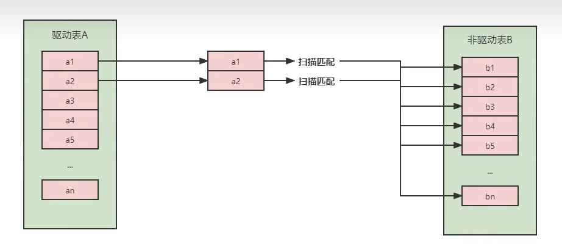
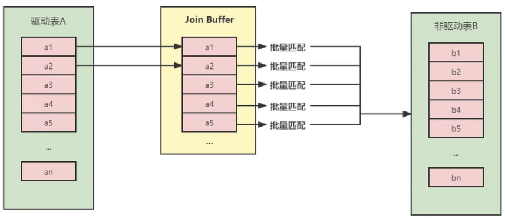
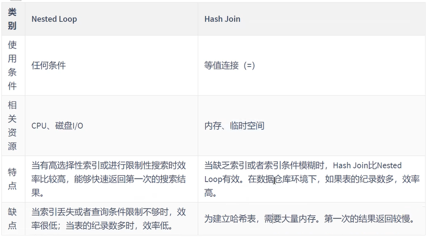
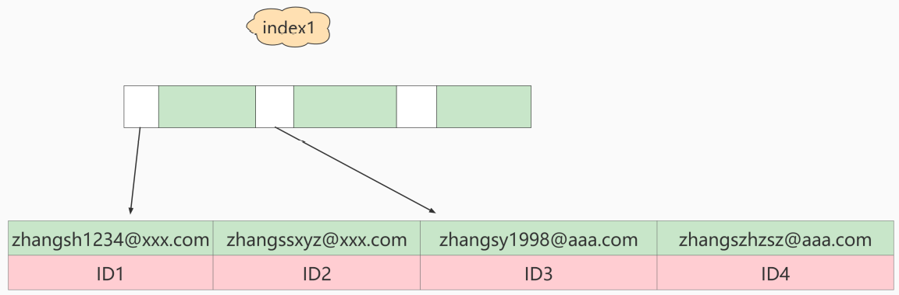
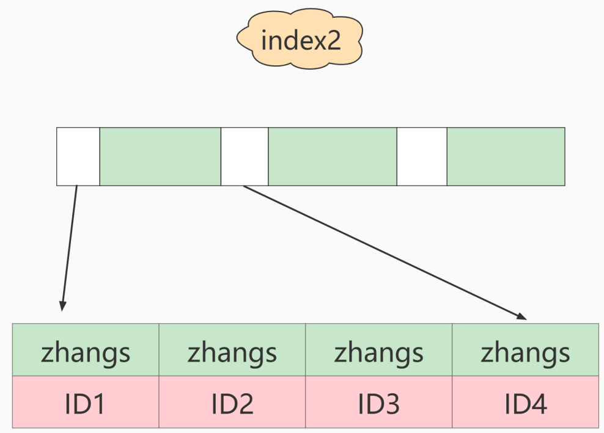
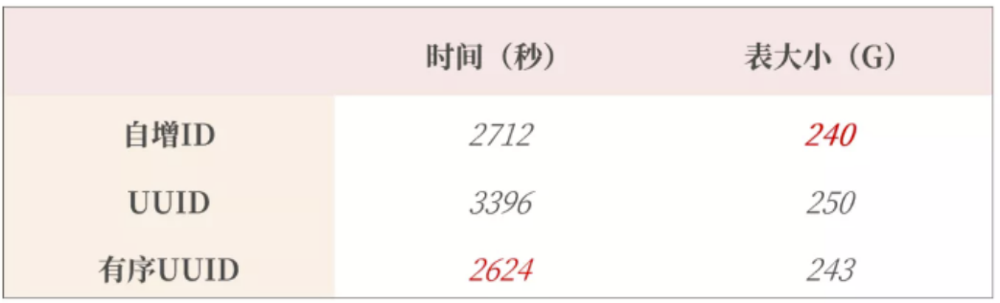

# 第10章 索引优化与查询优化

[MySQL高级篇知识点——索引优化与查询优化](https://blog.csdn.net/weixin_43004044/article/details/126573250?spm=1001.2014.3001.5502)

都有哪些维度可以进行数据库调优？简言之：

* 索引失效、没有充分利用到索引——建立适合的索引

* 关联查询太多JOIN（设计缺陷或不得已的需求）——SQL优化

* 服务器调优及各个参数设置（缓冲池、线程数等）——调整`my.cnf`

* 存储的数据过多——分库分表

    ​		关于数据库调优的知识非常分散。不同的DBMS，不同的公司，不同的职位，不同的项目遇到的问题都不尽相同。这里我们分为三个章节进行细致讲解。

虽然SQL查询优化的技术有很多，但是大方向上完全可以分成 **物理查询优化** 和 **逻辑查询优化** 两大块。

* **物理查询优化**是通过 <font color="blue">索引</font> 和 <font color="blue">表连接方式</font> 等技术来进行优化，这里重点需要掌握索引的使用。
* **逻辑查询优化**就是通过SQL <font color="blue">等价变换</font> 提升查询效率，直白一点就是说，换一种查询写法效率可能更高。


## 一、数据准备

`学员表` 插 `50万` 条，` 班级表` 插 `1万` 条。

```mysql
CREATE DATABASE atguigudb2;
USE atguigudb2;
```

**步骤1：建表**

```mysql
CREATE TABLE `class` (
    `id` INT(11) NOT NULL AUTO_INCREMENT，
    `className` VARCHAR(30) DEFAULT NULL，
    `address` VARCHAR(40) DEFAULT NULL，
    `monitor` INT NULL ，
    PRIMARY KEY (`id`)
) ENGINE=InnoDB AUTO_INCREMENT=1 DEFAULT CHARSET=utf8;

CREATE TABLE `student` (
    `id` INT(11) NOT NULL AUTO_INCREMENT，
    `stuno` INT NOT NULL ，
    `name` VARCHAR(20) DEFAULT NULL，
    `age` INT(3) DEFAULT NULL，
    `classId` INT(11) DEFAULT NULL，
    PRIMARY KEY (`id`)
    #CONSTRAINT `fk_class_id` FOREIGN KEY (`classId`) REFERENCES `t_class` (`id`)
) ENGINE=InnoDB AUTO_INCREMENT=1 DEFAULT CHARSET=utf8;
```

**步骤2：设置参数**

* 命令开启：允许创建函数设置：

```mysql
set global log_bin_trust_function_creators=1; # 不加global只是当前窗口有效。
```

**步骤3：创建函数**

保证每条数据都不同。

```mysql
#随机产生字符串
DELIMITER //
CREATE FUNCTION rand_string(n INT) RETURNS VARCHAR(255)
BEGIN
DECLARE chars_str VARCHAR(100) DEFAULT
'abcdefghijklmnopqrstuvwxyzABCDEFJHIJKLMNOPQRSTUVWXYZ';
DECLARE return_str VARCHAR(255) DEFAULT '';
DECLARE i INT DEFAULT 0;
WHILE i < n DO
SET return_str =CONCAT(return_str，SUBSTRING(chars_str，FLOOR(1+RAND()*52)，1));
SET i = i + 1;
END WHILE;
RETURN return_str;
END //
DELIMITER ;
#假如要删除
#drop function rand_string;
```

随机产生班级编号

```mysql
#用于随机产生多少到多少的编号
DELIMITER //
CREATE FUNCTION rand_num (from_num INT ，to_num INT) RETURNS INT(11)
BEGIN
DECLARE i INT DEFAULT 0;
SET i = FLOOR(from_num +RAND()*(to_num - from_num+1)) ;
RETURN i;
END //
DELIMITER ;
#假如要删除
#drop function rand_num;
```

**步骤4：创建存储过程**

```mysql
#创建往stu表中插入数据的存储过程
DELIMITER //
CREATE PROCEDURE insert_stu( START INT ， max_num INT )
BEGIN
DECLARE i INT DEFAULT 0;
SET autocommit = 0; #设置手动提交事务
REPEAT #循环
SET i = i + 1; #赋值
INSERT INTO student (stuno， name ，age ，classId ) VALUES
((START+i)，rand_string(6)，rand_num(1，50)，rand_num(1，1000));
UNTIL i = max_num
END REPEAT;
COMMIT; #提交事务
END //
DELIMITER ;
#假如要删除
#drop PROCEDURE insert_stu;
```

创建往class表中插入数据的存储过程

```mysql
#执行存储过程，往class表添加随机数据
DELIMITER //
CREATE PROCEDURE `insert_class`( max_num INT )
BEGIN
DECLARE i INT DEFAULT 0;
SET autocommit = 0;
REPEAT
SET i = i + 1;
INSERT INTO class ( classname，address，monitor ) VALUES
(rand_string(8)，rand_string(10)，rand_num(1，100000));
UNTIL i = max_num
END REPEAT;
COMMIT;
END //
DELIMITER ;
#假如要删除
#drop PROCEDURE insert_class;
```

**步骤5：调用存储过程**

class

```mysql
#执行存储过程，往class表添加1万条数据
CALL insert_class(10000);
```

stu

```mysql
#执行存储过程，往stu表添加50万条数据
CALL insert_stu(100000，500000);
```

**步骤6：删除某表上的索引**

创建存储过程

```mysql
DELIMITER //
CREATE PROCEDURE `proc_drop_index`(dbname VARCHAR(200)，tablename VARCHAR(200))
BEGIN
        DECLARE done INT DEFAULT 0;
        DECLARE ct INT DEFAULT 0;
        DECLARE _index VARCHAR(200) DEFAULT '';
        DECLARE _cur CURSOR FOR SELECT index_name FROM
information_schema.STATISTICS WHERE table_schema=dbname AND table_name=tablename AND
seq_in_index=1 AND index_name <>'PRIMARY' ;
#每个游标必须使用不同的declare continue handler for not found set done=1来控制游标的结束
		DECLARE CONTINUE HANDLER FOR NOT FOUND set done=2 ;
#若没有数据返回，程序继续，并将变量done设为2
        OPEN _cur;
        FETCH _cur INTO _index;
        WHILE _index<>'' DO
            SET @str = CONCAT("drop index " ， _index ， " on " ， tablename );
            PREPARE sql_str FROM @str ;
            EXECUTE sql_str;
            DEALLOCATE PREPARE sql_str;
            SET _index='';
            FETCH _cur INTO _index;
        END WHILE;
    CLOSE _cur;
END //
DELIMITER ;
```

执行存储过程

```mysql
CALL proc_drop_index("dbname"，"tablename");
```


## 二、索引失效案例

​		MySQL 中**提高性能**的一个最有效的方式是对数据表**设计合理的索引**。索引提供了高效访问数据的方法，并且可以加快查询的速度，因此索引对查询的速度有着至关重要的影响。
​		① 使用索引可以快速地定位表中的某条记录，从而提高数据库查询的速度，提高数据库的性能。
​		② 如果查询时没有使用索引，查询语句就会**扫描表中的所有记录**。在数据量大的情况下，这样查询的速度会很慢。

​		大多数情况下都默认采用 **B+树** 来构建索引。只是在使用空间类型时的索引会使用 **R-树**，并且 `MEMORY表` 还支持 `hash 索引`。其实，用不用索引，最终都是优化器说了算。优化器是基于什么来作为优化的条件的呢？答案是基于 <font style="background-color: #73cf60">cost 开销 (CostBaseOptimizer)</font> 的，它不是基于`规则 (Rule-BasedOptimizer)`，也不是基于`语义`。怎样开销小就怎么来。另外，**SQL语句是否使用索引，跟数据库版本、数据量、数据选择度都有关系**。


### 2.1 不满足 全值匹配 导致索引失效

> ​		全值匹配是指在MySQL的查询条件中**包含**索引中的所有列，并且针对索引中的每列进行**等值判断**。

---


（1）系统中经常出现的sql语句如下：

```mysql
EXPLAIN SELECT SQL_NO_CACHE * FROM student WHERE age=30;
EXPLAIN SELECT SQL_NO_CACHE * FROM student WHERE age=30 AND classId=746;
EXPLAIN SELECT SQL_NO_CACHE * FROM student WHERE age=30 AND classId=746 AND NAME = 'BJPYyu';
```

- 在建立索引之前执行（主要关注消耗的时间，为 0.15s）：


（2）建立索引的 3 条语句如下：

```java
CREATE INDEX idx_age ON student(age);
CREATE INDEX idx_age_classid ON student(age,classId);
CREATE INDEX idx_age_classid_name ON student(age,classId,NAME);
```

​		① 先建立索引 idx_age，然后执行上述语句，根据结果可以看出，索引 idx_age 已被使用，且消耗的时间为 0.03s，查询速度更快了。


② 再建立索引 idx_age_classid，同样执行上述语句，根据结果可以看出，**索引 idx_age_classid 已被使用，而之前建立的索引 idx_age 未被使用，并且消耗的时间更短了**。其原因在于上述 SQL 语句中的查询条件与索引列中的顺序更加匹配，简单来说：

- 索引 idx_age 可以匹配 WHERE age=30 AND classId=4 AND NAME = ‘abcd’ 中的 age；
- 而索引 idx_age_classid 则可以匹配 age 和 classId，因此使用该索引可以实现更快的查找。


③ 最后建立索引 idx_age_classid_name，同样执行上述语句，根据结果可知，**索引 idx_age_classid_name 已被使用，而之前建立的索引 idx_age 和 idx_age_classid 未被使用，即失效了**。同理，可以分析原因：索引 idx_age_classid_name 中的列 age、classId、NAME 与 WHERE age=30 AND classId=4 AND NAME = ‘abcd’ **完全匹配**（包括字段名和顺序），这也称为<font color="blue">全值匹配</font>，这种情况就是我们希望见到的。


### 2.2 不满足 最左前缀匹配原则 导致索引失效

> ​		MySQL建立联合索引时会遵守最左前缀匹配原则，即最左优先，在检索数据时从联合索引的最左边开始匹配，直到遇到**范围查询（>、<、between、like）**就停止匹配。这个顺序指的是==**优化器将SQL语句优化之后的顺序**==，与我们在SQL中所写的字段顺序没有必然关系，只是按照建立的联合索引的顺序写SQL语句的话，<u>可读性更强</u>！**<font color="blue">所以在创建的联合索引中，务必把范围查询所涉及到的字段写在最后</font>**。


- #### 举例

① 目前 student 表上有 4 个索引。

```mysql
SHOW INDEX FROM student;
```


② 下面 SQL 语句中的查询条件涉及的字段依次为：**age、name**。

```mysql
EXPLAIN SELECT SQL_NO_CACHE * FROM student WHERE age=30 AND name = 'abcd';
```


​		根据上面的explain分析结果可知，**索引 idx_age 被使用了**，因为 (age, name) 中的 age（从左往右看）正好可以和 idx_age 中的索引列 age 匹配，因此可以使用该索引。


③ 下面 SQL 语句中的查询条件涉及的字段依次为：**classid、name**。

```mysql
EXPLAIN SELECT SQL_NO_CACHE * FROM student WHERE classid=1 AND name = 'abcd';
```


​		根据上面的explain分析结果可知，该语句上**没有索引被使用**，因为根据最佳左前缀匹配原则，(classid、name) 无法与已有的任何索引进行匹配（即使优化器对字段顺序进行调整之后）。


④ 下面 SQL 语句中的查询条件涉及的字段依次为：**classid、age、name**。

```mysql
EXPLAIN SELECT SQL_NO_CACHE * FROM student WHERE classid=4 AND age=30 AND name = 'abcd'; 
```


​		根据上面的分析可知，**索引 idx_age_classid_name 被使用了**，尽管从当前SQL语句上看，没有一个索引的索引列是以 classid 开始的，但是 **MySQL 中的优化器会对字段顺序进行一定的调整，看能否匹配上已有的索引**。


④ 先删除索引 idx_age 和 idx_age_classid：

```mysql
DROP INDEX idx_age ON student;
DROP INDEX idx_age_classid ON student;
```

下面 SQL 语句中的查询条件涉及的字段依次为：**age、name**。

```mysql
EXPLAIN SELECT SQL_NO_CACHE * FROM student 
WHERE student.age=30 AND student.name = 'abcd';
```


​		根据上面的分析可知，**索引 idx_age_classid_name 被使用了**，但是 `key_len` = 5，即实际使用到的索引长度只有 5 个字节，也就是说只涉及到索引列 age，则：索引并未被充分利用。

​		其原因在于索引 idx_age_classid_name 的索引列依次为 (age, classid, name)，而上述查询条件涉及的字段依次为 (age、name)，根据最佳左前缀匹配原则，该索引的索引列 classid 被跳过后，其自身以及后面的字段都无法被使用！


- #### 总结

​		MySQL可以为多个字段创建索引，一个索引最多可以包含16个字段。对于多列索引，**过滤条件要使用索引就必须按照索引建立时的顺序，从左到右，依次满足，一旦跳过某个字段，索引后面的字段都无法被使用**。如果查询条件中没有用这些字段中第一个字段时，联合索引将不会被使用。


### 2.3 索引列存在数学计算、使用了函数导致索引失效

- 在 student 表上建立索引 **idx_name** 和 **idx_sno**

```mysql
CREATE INDEX idx_name ON student(name);

CREATE INDEX idx_sno ON student(stuno);
```


- 测试

​		下面的 2 条 SQL 语句查询得到的结果一样（数据顺序可能略有不同），但是第一条语句能够使用索引 idx_name，而第二条语句由于用到了`函数LEFT()`，从而导致索引 idx_name 失效。（**索引保存的是索引字段的原始值，而不是经过函数计算后的值，自然就无法使用索引了**）

```mysql
# 语句1：能正常使用索引
EXPLAIN SELECT SQL_NO_CACHE * FROM student WHERE student.name LIKE 'abc%';

---

# 语句2：【对索引列使用函数】。MySQL就不知道其字段本身所对应的是什么值了，何谈使用索引呢？
EXPLAIN SELECT SQL_NO_CACHE * FROM student WHERE LEFT(student.name,3) = 'abc'; 
## 针对语句2进行逻辑优化：《SQL改写》
EXPLAIN SELECT SQL_NO_CACHE * FROM student WHERE student.name LIKE 'abc%';

---

# 语句3：【索引列参与了算术运算】。此时，MySQL将不知道其字段本身所对应的是什么值，何谈使用索引呢？
EXPLAIN SELECT SQL_NO_CACHE id， stuno， NAME FROM student WHERE stuno + 1 = 900001;
## 针对语句3进行逻辑优化：《SQL改写》
EXPLAIN SELECT SQL_NO_CACHE id， stuno， NAME FROM student WHERE stuno = 900000;
```


### 2.4 自动或手动类型转换导致索引失效

- 在 student 表上建立索引 **idx_name**

```mysql
CREATE INDEX idx_name ON student(name);
```


- 测试

```mysql
# 未使用到索引
# 因为name是字符串，int类型的123需要被（自动）类型转换为字符串'123'才能被使用。导致索引失效。
EXPLAIN SELECT SQL_NO_CACHE * FROM student WHERE name = 123;  // 隐式（自动）类型转换

--- 

# 使用到索引
EXPLAIN SELECT SQL_NO_CACHE * FROM student WHERE name='123';
```


### 2.5 范围条件右边的列索引失效

- 在 student 表上建立索引 **idx_age_classId_name**

```mysql
CREATE INDEX idx_age_classId_name ON student(age,classId,NAME);
```


- 测试

```mysql
EXPLAIN SELECT SQL_NO_CACHE * FROM student 
WHERE student.age=30 AND student.classId>20 AND student.name = 'abc';
```


​		通过上面 EXPLAIN 的执行计划可知，索引 `idx_age_classId_name` 被使用了，但是没有完全使用！key_len = 10 就可以说明这一点，索引 idx_age_classId_name 上的三个字段 (age,classId,NAME) 中，只有 age 和 classId 被使用了（其长度均为 5，故 key_len = 5 + 5 = 10），其原因就在于**范围条件右边的列索引失效**，即 `student.classId > 20` 是一个**范围条件**，其右边的索引列 NAME 失效了。


> ​		此时可能有人会问：如果将 SQL 语句中的 student.classId > 20 与 student.name = ‘abc’ 颠倒顺序，这样范围条件右边就没有索引列了，这样是不是就可以完全使用上索引 idx_age_classId_name 了？
>
> ​		答案是**否定**的，这样依然不能完全使用上索引 idx_age_classId_name，并且 key_len 仍然为 10。其原因在优化器会根据已有索引来调整查询条件的顺序，以索引 idx_age_classId_name 为例，其索引列的顺序依次为(age,classId,NAME)，如果查询条件中正好出现了这 3 个字段，那么**优化器会自动调整它们之间的顺序，使其保持与索引列的顺序一致，以便可以使用上索引**。所以单纯地调整 student.classId > 20 与 student.name = ‘abc’ 的顺序是没有用的。
> 如果想要完全使用使用上索引，可以从以下两个方面进行改进：
>
> - 重新创建索引 idx_age_name_classId，**将需要进行范围查询的索引列放到最后**；
> - 修改 SQL 语句，**只对索引中的最后一个索引列进行范围查询，但是该方法限制性太大**；


- #### 结论

**① 创建的联合索引中，务必把范围涉及到的字段写在最后；**
② 应用开发中应将查询条件（例如：金额查询，日期查询往往都是范围查询）放置 where 语句的最后。


### 2.6 不等于(!= 或者 <>)导致索引失效——同2.8，理解为只要是“==非==”操作，索引就会失效

* 为name字段创建索引

```mysql
CREATE INDEX idx_name ON student(NAME);
```

* 查看索引是否失效

```mysql
EXPLAIN SELECT SQL_NO_CACHE * FROM student WHERE student.name <> 'abc';
```


场景举例：用户提出需求，将财务数据，产品利润金额不等于0的都统计出来。


###  2.7 is null可以使用索引，is not null导致索引失效

* IS NULL: 可以触发索引

```mysql
EXPLAIN SELECT SQL_NO_CACHE * FROM student WHERE age IS NULL;
```

* IS NOT NULL: 无法触发索引

```mysql
EXPLAIN SELECT SQL_NO_CACHE * FROM student WHERE age IS NOT NULL;
```


> ​		结论：最好在设计数据库的时候就 **将字段设置为 NOT NULL 约束**，比如你可以将 INT 类型的字段，默认值设置为`0`。将字符类型的默认值设置为空字符串(`''`)。
>
> - 当值为`NULL`时，变长字段列表不会占用存储空间。NULL值没有存储，不占空间，但是需要一个**标志位**（一行一个）。
>
> - 列数据信息里表明了 `NULL`数据和`''`数据都不占用任何空间，对于变长字段列表的信息：`''`数据虽然不需要占用任何存储空间，但是在变长字段列表里面还是需要占用一个字节**<毕竟是一个`''`值>**，`NULL值`本身不需要占空间，只是`NULL`会有额外的一个**标志位**，所以有个优化的说法：“数据库表中能设置NOT NULL的就尽量设置为NOT NULL，除非确实需要NULL值。”
>
> 扩展：**同理，在查询中使用`not like`也无法使用索引，导致全表扫描**。


### 2.8 like以通配符%开头（非右模糊）导致索引失效

​		在使用LIKE关键字进行查询的查询语句中，如果匹配字符串的第一个字符为'%'，索引就不会起作用。只有'%'不在第一个位置，索引才会起作用。

* 使用到索引

```mysql
EXPLAIN SELECT SQL_NO_CACHE * FROM student WHERE name LIKE 'ab%';
```


* 未使用到索引

```mysql
EXPLAIN SELECT SQL_NO_CACHE * FROM student WHERE name LIKE '%ab%';
```


> 拓展：Alibaba《Java开发手册》 
>
> 【强制】页面搜索严禁**左模糊**或者**全模糊**，如果需要请走搜索引擎来解决。


### 2.9 OR 前后存在非索引的列导致索引失效

> ​		可以把OR理解为UNION，这样再判断索引失效。

​		在WHERE子句中，只有 **`or`前后的两个条件列都有索引时（不能同在一个联合索引中包含），查询中才使用索引**。

​		因为OR的含义就是两个中只要满足一个即可。因此，只有一个条件列拥有索引是没有意义的，只要存在条件列没有创建索引的情况，就会进行 **<font color="blue">全表扫描</font>**，因此所以的条件列也会失效。

查询语句使用OR关键字的情况：

```mysql
# 未使用到索引
EXPLAIN SELECT SQL_NO_CACHE * FROM student WHERE age = 10 OR classid = 100;
```


因为classId字段上没有索引，所以上述查询语句没有使用索引。

```mysql
#使用到索引
EXPLAIN SELECT SQL_NO_CACHE * FROM student WHERE age = 10 OR name = 'Abel';
```


> ​		因为age字段和name字段上都有索引，所以查询中使用了索引。你能看到这里使用到了`index_merge`，简单来说index_merge就是对age和name分别进行了扫描，然后将这两个结果集进行了合并。这样做的好处就是 **避免了全表扫描**。


### 2.10 数据库和表的字符集未统一导致索引失效

​		统一使用utf8mb4( 5.5.3版本以上支持)兼容性更好，统一字符集可以避免由于字符集转换产生的乱码。不同的 **字符集** 进行比较前需要进行 **转换** ，这会造成索引失效。**可以理解为转换就需要使用函数，使用函数，索引自然就失效了**。


### 2.11 练习及一般性建议

**练习：**假设：index(a，b，c)


> **一般性建议**
>
> * 对于单列索引，尽量选择针对当前查询 **过滤性更好** 的索引
>
> * 在选择组合索引的时候，当前查询中的 **过滤性最好的字段** 在索引字段顺序中，**位置越靠前越好**
>
> * 在选择组合索引的时候，尽量选择在当前查询中能囊括where子句后更多字段的索引
>
> * 在选择组合索引的时候，如果某个字段可能出现 **范围查询** 时，尽量把这个字段 **放在索引次序的最后面**
>
>     **总之，书写SQL语句时，尽量避免造成索引失效的情况**


## 三、关联查询优化

### 3.1 数据准备

```mysql
# 分类
CREATE TABLE IF NOT EXISTS `type` (
    `id` INT(10) UNSIGNED NOT NULL AUTO_INCREMENT，
    `card` INT(10) UNSIGNED NOT NULL，
    PRIMARY KEY (`id`)
);
#图书
CREATE TABLE IF NOT EXISTS `book` (
    `bookid` INT(10) UNSIGNED NOT NULL AUTO_INCREMENT，
    `card` INT(10) UNSIGNED NOT NULL，
    PRIMARY KEY (`bookid`)
);

#向分类表中添加20条记录
INSERT INTO `type`(card) VALUES(FLOOR(1 + (RAND() * 20)));
INSERT INTO `type`(card) VALUES(FLOOR(1 + (RAND() * 20)));
INSERT INTO `type`(card) VALUES(FLOOR(1 + (RAND() * 20)));
INSERT INTO `type`(card) VALUES(FLOOR(1 + (RAND() * 20)));
INSERT INTO `type`(card) VALUES(FLOOR(1 + (RAND() * 20)));
INSERT INTO `type`(card) VALUES(FLOOR(1 + (RAND() * 20)));
INSERT INTO `type`(card) VALUES(FLOOR(1 + (RAND() * 20)));
INSERT INTO `type`(card) VALUES(FLOOR(1 + (RAND() * 20)));
INSERT INTO `type`(card) VALUES(FLOOR(1 + (RAND() * 20)));
INSERT INTO `type`(card) VALUES(FLOOR(1 + (RAND() * 20)));
INSERT INTO `type`(card) VALUES(FLOOR(1 + (RAND() * 20)));
INSERT INTO `type`(card) VALUES(FLOOR(1 + (RAND() * 20)));
INSERT INTO `type`(card) VALUES(FLOOR(1 + (RAND() * 20)));
INSERT INTO `type`(card) VALUES(FLOOR(1 + (RAND() * 20)));
INSERT INTO `type`(card) VALUES(FLOOR(1 + (RAND() * 20)));
INSERT INTO `type`(card) VALUES(FLOOR(1 + (RAND() * 20)));
INSERT INTO `type`(card) VALUES(FLOOR(1 + (RAND() * 20)));
INSERT INTO `type`(card) VALUES(FLOOR(1 + (RAND() * 20)));
INSERT INTO `type`(card) VALUES(FLOOR(1 + (RAND() * 20)));
INSERT INTO `type`(card) VALUES(FLOOR(1 + (RAND() * 20)));

#向图书表中添加20条记录
INSERT INTO book(card) VALUES(FLOOR(1 + (RAND() * 20)));
INSERT INTO book(card) VALUES(FLOOR(1 + (RAND() * 20)));
INSERT INTO book(card) VALUES(FLOOR(1 + (RAND() * 20)));
INSERT INTO book(card) VALUES(FLOOR(1 + (RAND() * 20)));
INSERT INTO book(card) VALUES(FLOOR(1 + (RAND() * 20)));
INSERT INTO book(card) VALUES(FLOOR(1 + (RAND() * 20)));
INSERT INTO book(card) VALUES(FLOOR(1 + (RAND() * 20)));
INSERT INTO book(card) VALUES(FLOOR(1 + (RAND() * 20)));
INSERT INTO book(card) VALUES(FLOOR(1 + (RAND() * 20)));
INSERT INTO book(card) VALUES(FLOOR(1 + (RAND() * 20)));
INSERT INTO book(card) VALUES(FLOOR(1 + (RAND() * 20)));
INSERT INTO book(card) VALUES(FLOOR(1 + (RAND() * 20)));
INSERT INTO book(card) VALUES(FLOOR(1 + (RAND() * 20)));
INSERT INTO book(card) VALUES(FLOOR(1 + (RAND() * 20)));
INSERT INTO book(card) VALUES(FLOOR(1 + (RAND() * 20)));
INSERT INTO book(card) VALUES(FLOOR(1 + (RAND() * 20)));
INSERT INTO book(card) VALUES(FLOOR(1 + (RAND() * 20)));
INSERT INTO book(card) VALUES(FLOOR(1 + (RAND() * 20)));
INSERT INTO book(card) VALUES(FLOOR(1 + (RAND() * 20)));
INSERT INTO book(card) VALUES(FLOOR(1 + (RAND() * 20)));
```


### 3.2 采用外连接

`以左外连接作为DEMO演示`

---

> ​		在外连接中，不一定就是 **LEFT 左边** 或 **RIGHT 右边** 的表作为驱动表。还是得看优化器如何去优化这条SQL。比如，如果优化器将此条外连接语句优化成了内连接，那就是内连接中的驱动表与被驱动表选择规则了。	

下面开始 EXPLAIN 分析

```mysql
EXPLAIN SELECT SQL_NO_CACHE * FROM `type` 
LEFT JOIN book 
ON type.card = book.card;
```


结论：type 有All


- 给【被驱动表】添加索引优化

```mysql
# 如果【被驱动表】上有索引，则可以避免全表扫描
CREATE INDEX Y ON book(card);  
```

- EXPLAIN 分析

```mysql
EXPLAIN SELECT SQL_NO_CACHE * FROM `type` 
LEFT JOIN book 
ON type.card = book.card;
```

		可以看到第二行的 type 变为了 ref，rows 也变成了1，优化比较明显。这是由左连接特性决定的。LEFT JOIN 条件用于确定如何从右表搜索行，左边一定都有，所以 **右边是我们的关键点，一定需要建立索引** 。


- 给【驱动表】添加索引优化

```mysql
# 如果【驱动表】上有索引，也无法避免全表扫描
CREATE INDEX X ON type(card); 
```

- EXPLAIN 分析

```mysql
EXPLAIN SELECT SQL_NO_CACHE * FROM `type` 
LEFT JOIN book 
ON type.card = book.card;
```


> ​		可以发现，给【驱动表】添不添加索引，效果都一样。


接着：

- 删除【被驱动表】上的索引

```mysql
DROP INDEX Y ON book;
```

- EXPLAIN 分析

```mysql
EXPLAIN SELECT SQL_NO_CACHE * FROM `type` 
LEFT JOIN book 
ON type.card = book.card;
```


> ​		可以发现，如果【被驱动表】上不存在索引，将会降低表连接效率。


### 3.3 采用内连接

> >    对于内连接来说，由查询优化器决定谁作为驱动表，谁作为被驱动表出现。
>
> - **如果表的连接条件中的字段只有其中一个字段有索引，则有索引的那个字段所在的表会被作为<font color="blue">被驱动表</font>**。
> - **如果表的连接条件中的字段 都有索引 或 都没有索引，则数据量小的那个表会被作为<font color="blue">驱动表</font>，即：“小表驱动大表”**。


在两张表没有任何索引的情况下，进行EXPLAIN 分析

```mysql
# 根据内连接中的索引使用规则，数据库自动选择小表作为驱动表
EXPLAIN SELECT SQL_NO_CACHE * FROM type
INNER JOIN book ON
type.card = book.card;
```


- 给 `book` 表添加索引：此时由于只有book表被添加索引，则book表将被作为**被驱动表**

```mysql
ALTER TABLE book ADD INDEX Y (card);

---

EXPLAIN SELECT SQL_NO_CACHE * FROM type 
INNER JOIN book
ON type.card=book.card;
```


- 给 `type` 表添加索引：此时由于book、type表都被添加了索引，则由优化器选取小表作为**驱动表**

```mysql
ALTER TABLE type ADD INDEX X (card);

---

EXPLAIN SELECT SQL_NO_CACHE * FROM type 
INNER JOIN book ON 
type.card=book.card;
```


### 3.4 join语句原理

[单机和分布式下的关联算法（Hash Join,SNLJ,INLJ,BKA,Merge Join）](https://zhuanlan.zhihu.com/p/497125046)

> ​		join方式连接多个表，**本质就是各个表之间数据的循环匹配**。MySQL5.5版本之前，MySQL只支持一种表间关联方式，就是**嵌套循环(Nested Loop Join)**。如果关联表的数据量很大，则join关联的执行时间会很长。在MySQL5.5以后的版本中，MySQL通过引入**BNLJ算法**来优化嵌套执行。


#### 1）驱动表和被驱动表

> ​		**驱动表就是主表，被驱动表就是从表、非驱动表**。

* 对于内连接来说：

```mysql
SELECT * FROM A JOIN B ON ...
```

​		A一定是驱动表吗？不一定，优化器会根据你查询语句做优化，决定先查哪张表。先查询的那张表就是驱动表，反之就是被驱动表。通过explain关键字可以查看。在第一行的表就是**驱动表**。

* 对于外连接来说：

```mysql
SELECT * FROM A LEFT JOIN B ON ...
# 或
SELECT * FROM B RIGHT JOIN A ON ... 
```

通常，大家会认为A就是驱动表，B就是被驱动表。但也未必。测试如下：

```mysql
CREATE TABLE a(f1 INT， f2 INT， INDEX(f1)) ENGINE=InnoDB;
CREATE TABLE b(f1 INT， f2 INT) ENGINE=InnoDB;

INSERT INTO a VALUES(1，1)，(2，2)，(3，3)，(4，4)，(5，5)，(6，6);
INSERT INTO b VALUES(3，3)，(4，4)，(5，5)，(6，6)，(7，7)，(8，8);

SELECT * FROM b;

# 测试1
# b为驱动表，a为被驱动表
# 原因：优化器将此条外连接优化为了内连接
EXPLAIN SELECT * FROM a LEFT JOIN b ON(a.f1=b.f1) WHERE (a.f2=b.f2);

# 测试2
EXPLAIN SELECT * FROM a LEFT JOIN b ON(a.f1=b.f1) AND (a.f2=b.f2);
```


#### 2）Simple Nested-Loop Join (简单嵌套循环连接)

> ​		从表A中依次取出每一条数据，再与表B中的每一条数据进行匹配，将匹配成功的数据放到result……



​		可以看到这种方式**效率是非常低**的，以上述表A数据100条，表B数据1000条计算，则A*B=10万次。开销统计如下:


当然MySQL肯定不会这么粗暴的去进行表的连接，所以就出现了后面的两种对`Simple Nested-Loop Join`算法的优化版本。


#### 3）Index Nested-Loop Join （索引嵌套循环连接）

> ​		`Index Nested-Loop Join`优化的思路主要是为了 **减少内存表数据的匹配次数**，所以==要求**被驱动表**上必须有索引==才行。通过外层表匹配条件直接与内层表索引进行匹配，避免和内存表的**每条记录**去进行比较，这样极大的减少了对内层表的匹配次数。


​		驱动表中的每条记录通过被驱动表的索引进行访问，因为索引查询的成本是比较固定的，故MySQL优化器都倾向于**使用记录数少的表作为驱动表（外表）**。


​		如果被驱动表加索引，效率是非常高的，但如果索引不是主键索引，就还得进行一次**回表查询**。相比，**被驱动表的索引如果是主键索引，效率会更高**。


#### 4）Block Nested-Loop Join（块嵌套循环连接）

[MySQL基于块的嵌套循环连接](https://blog.csdn.net/weixin_43519121/article/details/119803445)

​		对于`SNLJ`与`INLJ`这两种表连接实现原理。如果存在索引，就会使用 `INLJ` 的方式进行 join，如果 join 的列**没有索引**，就会使用`SNLJ`的方式进行join。如果扫描**被驱动表**的次数太多，每次访问被驱动表，其表中的记录都会被加载到内存中，然后再从**驱动表**中取一条与其匹配，匹配结束后清除内存，然后再从驱动表中加载一条记录，然后把被驱动表的记录在加载到内存匹配，这样大大增加了 `I/O` 的次数。为了减少被驱动表的 I/O 次数，就出现了 `Block Nested-Loop Join` 的方式。

​		不再是逐条获取驱动表的数据，而是一块一块的获取，引入了 **`join buffer` 缓冲区**，==将**<font color="blue">驱动表</font>** join 相关的部分数据列（大小受 join buffer 的限制）**缓存到 join buffer 中**，然后**全表扫描被驱动表**，**被驱动表的每一条记录一次性和 join buffer 中的所有驱动表记录进行匹配（内存中操作）**==。将简单嵌套循环中的多次比较合并成一次，降低了被驱动表的访问频率。

> 注意：
>
> ​		这里缓存的不只是关联表的列，select后面的列也会缓存起来。在一个有N个join关联的sql中会分配N-1个join buffer。所以**查询的时候尽量减少不必要的字段，可以让join buffer中存放更多的列**。




##### 参数设置

* **block_nested_loop**

查看 `block_nested_loop`状态。默认是开启的。

```mysql
show variables like '%optimizer_switch%';
```


* **join_buffer_size**

**驱动表**能不能一次加载完，要看`join buffer`能不能存储所有的数据，默认情况下`join_buffer_size=256k`。

```mysql
 show variables like '%join_buffer%';
```

​		join_buffer_size的最大值在32位操作系统可以申请4G，而在64位操作系统下可以申请大于4G的Join Buffer空间（64位Windows除外，其大值会被截断为4GB并发出警告）。


#### 5）Join小结

1、**整体效率比较：INLJ > BNLJ > SNLJ**

2、永远用小结果集驱动大结果集（其**本质就是减少<font color="green">外层循环</font>的数据数量**）（小的度量单位指的是**表行数 * 每行大小**）

```mysql
# straight_join：表示禁止优化器为我们优化join语句，就按照所写的来。
select t1.b，t2.* from t1 straight_join t2 on (t1.b=t2.b) where t2.id<=100; # 推荐
select t1.b，t2.* from t2 straight_join t1 on (t1.b=t2.b) where t2.id<=100; # 不推荐
```

3、为**被驱动表**匹配的条件增加索引(**减少内层表的循环匹配次数**)

4、增大`join buffer size`的大小（**一次缓存的数据越多，那么扫描内层表的次数就越少**）

5、减少驱动表不必要的字段查询（**字段越少，join buffer所缓存的数据就越多**）。这其实间接的否认了使用`*`作为查询列表的做法


#### 6）Hash Join

​		**从MySQL的8.0.20版本开始废弃了`BNLJ`，因为从MySQL8.0.18版本开始就加入了`hash join`，默认都会使用hash join**

* Nested Loop：

    对于**被连接的数据子集较小**的情况，Nested Loop是个较好的选择。

* Hash Join：

    这是做 **大数据集连接** 时的常用方式，优化器使用两个表中较小（相对较小）的表利用`Join Key`在内存中建立 <font color="blue">散列表</font>（即：同BNLJ，都是在内存中装载**<font color="green">驱动表</font>**），然后扫描较大的表并探测散列表，找出与Hash表匹配的行。
    
    * 这种方式适合于在较小的表中，可以将数据全部加载于内存中的情况，这样的总成本就是访问两个表的成本之和。
    * 有时在表很大的情况下并不能将数据全部加载进内存，这时优化器会将它分割成 **若干不同的分区**，不能放入内存的部分就把该分区写入磁盘的临时段，此时要求有较大的临时段从而尽量提高I/O的性能。
    * 它能够很好的工作于  **没有索引的大表** 和 **并行查询** 的环境中，并提供最好的性能。大多数人都说它是Join的重型升降机。Hash Join只能应用于等值连接（如WHERE A.COL1 = B.COL2），这是由Hash的特点决定的。




### 3.5 小结

* 保证**被驱动表**的JOIN字段已经创建了索引 
* 需要JOIN 的字段，**数据类型**保持绝对一致。 
* LEFT JOIN 时，选择**小表**作为驱动表， 大表作为被驱动表。减少外层循环的次数，从而减少将被驱动表中数据I/O到内存中的次数。
* INNER JOIN 时，MySQL会自动将 **小结果集** 的表选为驱动表 。选择相信MySQL优化策略。 
* 能够直接多表关联的尽量直接关联，不用子查询。(即：**减少查询的趟数**) 
* 不建议使用子查询，建议将子查询SQL拆开结合程序多次查询，或使用 JOIN 来代替子查询。 （使用子查询就会创建临时表，临时表无法使用索引）


## 四、子查询优化

[连接查询和子查询哪个效率高](https://blog.csdn.net/weixin_44041590/article/details/114343328)

​		MySQL从4.1版本开始支持子查询，使用子查询可以进行SELECT语句的嵌套查询，即一个SELECT查询的结果作为另一个SELECT语句的条件。 **子查询可以一次性完成很多逻辑上需要多个步骤才能完成的SQL操作**。

> ​		**子查询是 MySQL 的一项重要的功能，可以帮助我们通过一个 SQL 语句实现比较复杂的查询。但是，子查询的执行效率不高。**原因：
>
> ① 执行子查询时，MySQL需要为内层查询语句的查询结果建立一个临时表 ，然后外层查询语句从临时表 中查询记录。查询完毕后，再撤销这些临时表 。这样会消耗过多的`CPU和IO资源`，产生大量的**慢查询**。
>
> ② 子查询的结果集存储的临时表，不论是内存临时表还是磁盘临时表都 **不会存在索引** ，所以查询性能会受到一定的影响。
>
> ③ 对于返回结果集比较大的子查询，其对查询性能的影响也就越大。
>
> > ​		**在MySQL中，可以使用连接（JOIN）查询来替代子查询。**连接查询 **不需要建立临时表** ，其速度比子查询要快 ，如果查询中使用索引的话，性能就会更好一些。


举例1：查询学生表中 **是**班长 的学生信息

* 使用子查询

```mysql
# 创建班级表中班长的索引
CREATE INDEX idx_monitor ON class(monitor);

EXPLAIN SELECT * FROM student stu1
WHERE stu1.`stuno` IN (
    SELECT monitor
    FROM class c
    WHERE monitor IS NOT NULL
)
```

* 推荐使用关联查询

```mysql
EXPLAIN SELECT stu1.* FROM student stu1 
JOIN class c
ON stu1.`stuno` = c.`monitor`
WHERE c.`monitor` is NOT NULL;
```


举例2：取所有 **不是**班长 的同学

* 不推荐

```mysql
EXPLAIN SELECT SQL_NO_CACHE a.*
FROM student a
WHERE a.stuno NOT IN (
	SELECT monitor FROM class b
    WHERE monitor IS NOT NULL
);
```

执行结果如下：


* 推荐：

```mysql
EXPLAIN SELECT SQL_NO_CACHE a.*
FROM student a LEFT OUTER JOIN class b
ON a.stuno = b.monitor
WHERE b.monitor IS NULL;
```


#### 附：子查询优化小技巧

​		尽量不要使用`带NOT`的语句，诸如：`NOT IN`、`NOT EXISTS`、`IS NOT NULL`，用 `LEFT JOIN xxx ON xx WHERE xx IS NULL` 替代。


## 五、排序优化

### 5.1 排序优化

**问题**：在 `WHERE` 条件字段上加索引，但是为什么在 `ORDER BY` 字段上还要加索引呢？

**回答：**

在MySQL中，支持两种**排序方式**，分别是 `FileSort` 和 `Index` 排序。

> ​		产生一种印象：FileSort排序效率很低，是没有办法中的办法。

* Index 排序中，索引可以保证数据的有序性，不需要再进行排序，`效率更高`。
* FileSort 排序则一般在 **内存中** 进行排序，所占用的 `CPU资源` 较多。并且，如果待排序的结果集较大，会产生临时文件 I/O 到磁盘进行排序的情况，效率较低。


### 5.2 优化思路

> 1. SQL 中，可以在 WHERE 子句和 ORDER BY 子句中使用索引。使用在 `WHERE` 子句中是为了 **<font color="red">避免全表扫描</font>** ，使用在 `ORDER BY` 子句中是为了 **<font color="red">避免使用 FileSort 排序</font>** 。当然，某些情况下全表扫描，或者 FileSort 排序不一定比索引慢。但总的来说，我们还是要避免，以提高查询效率。 
> 2. 尽量使用 Index 完成 ORDER BY 排序。如果 WHERE 和 ORDER BY 后面是相同的列就使用单列索引； 如果不同就使用联合索引。 
> 3. 确实无法使用 Index 时，就需要对 `FileSort` 排序方式进行调优。见 [5.5 filesort算法：双路排序和单路排序]()
>
> ---
>
> ​		==把数据量卡小一点，就是在排序数据时，优化的本质思路==。


### 5.3 测试

- 删除student表和class表中已创建的索引

```mysql
call proc_drop_index('atguigudb2'，'student');
```


#### 1）排序字段上不存在任何索引的情况

- 直接EXPLAIN分析：没有索引可用时，都会使用 `filesort` 来进行排序

```mysql
EXPLAIN SELECT SQL_NO_CACHE * FROM student 
ORDER BY age, classid; 

---

EXPLAIN SELECT SQL_NO_CACHE * FROM student 
ORDER BY age, classid LIMIT 10; 
```


#### 2）排序字段上存在索引的情况

- 创建索引：`idx_age_classid_name`

```mysql
CREATE INDEX idx_age_classid_name ON student(age,classid,NAME);
```


##### ① 查询所有字段，索引失效

```mysql
# 使用 * 查询所有字段
EXPLAIN SELECT SQL_NO_CACHE * FROM student 
ORDER BY age, classid; 
```


​		由上图可知，索引 `idx_age_classid_name` 失效，其原因在于优化器将 **使用与不使用该索引** 时的成本进行了比较，发现：如果使用了该索引，由于查询的是所有字段（上述 SQL 语句中的 * ），那当在使用二级索引 `idx_age_classid_name` 之后还要进行**回表操作**；<font color="orange">当数据量比较**大**时，其成本可能要比不使用索引时进行直接查询的成本还要大</font>！所以上述 SQL 未使用索引 idx_age_classid_name 。


##### ② 查询索引中的字段，索引生效

```mysql
# age, classid 均为索引`idx_age_classid_name`中的字段
EXPLAIN  SELECT SQL_NO_CACHE age, classid FROM student   
ORDER BY age, classid; 
```


​		由上图可知，索引 `idx_age_classid_name` 被使用了，其原因在于 **要查询的字段并不是全部的字段，而只是 idx_age_classid_name 索引上的字段，此时便不需要回表就能查到**，成本也就较小。此时索引 idx_age_classid_name 也被称为**<font color="blue">覆盖索引</font>**。


##### ③ 查询所有字段，但使用 limit，索引生效

```mysql
EXPLAIN SELECT SQL_NO_CACHE * FROM student 
ORDER BY age,classid 
LIMIT 10;  
```


​		由于 **limit 限制了要查询的数量**，所以此时 **回表操作** 的成本相比于 **全表查询** 就降低了许多，所以使用上了索引 `idx_age_classid_name`。


##### ④ order by字段不遵循最左匹配原则，索引失效

- 创建索引：`idx_age_classid_stuno`

```mysql
# 先删除表中所有索引
call proc_drop_index('atguigudb2'，'student');

---

# 创建 idx_age_classid_stuno 索引
CREATE  INDEX idx_age_classid_stuno ON student (age,classid,stuno);
```


- **索引失效**案例：都不满足最左匹配原则

```mysql
EXPLAIN  SELECT * FROM student 
ORDER BY classid 
LIMIT 10;

---

EXPLAIN  SELECT * FROM student 
ORDER BY classid, NAME 
LIMIT 10;
```


- **索引生效**案例：满足最左匹配原则

```mysql
EXPLAIN  SELECT * FROM student 
ORDER BY age, classid, stuno 
LIMIT 10;

---

EXPLAIN  SELECT * FROM student 
ORDER BY age, classid 
LIMIT 10;

---

EXPLAIN SELECT * FROM student 
ORDER BY age 
LIMIT 10;
```


##### ⑤ order by字段 与 索引字段 规则不一致，索引失效

- 使用索引：`idx_age_classid_stuno`


- **索引失效**：order by字段排序规则 与 索引字段排序规则 不一致。即：==一正一反==导致索引失效。

```mysql
# age 字段的排序方式 (DESC) 与索引中的相反
EXPLAIN SELECT * FROM student
ORDER BY age DESC, classid ASC
LIMIT 10;

---

# classid 字段的排序方式 (DESC) 与索引中的相反
EXPLAIN  SELECT * FROM student
ORDER BY age ASC, classid DESC
LIMIT 10;
```


- **索引生效**： 每一个order by字段的排序规则 都与 索引字段的排序规则相反。即：==全都相反==索引生效

    > ​		Backward index scan：都相反，就等价于反过来遍历索引！！！

```mysql
# 如果 age 与 classid 的排序方式同为降序时，MySQL 会选择【从后往前】遍历。
              ###     即： "Backward index scan"    ###
EXPLAIN SELECT * FROM student 
ORDER BY age DESC, classid DESC 
LIMIT 10;
```


##### ⑥ 索引失效（order by字段）：使用where过滤后的数据量很小，不需要再使用索引进行数据排序，而是直接filesort

> ​		这里所说的数据量很小，其实细致点说，就是：==经过where过滤后的记录数很少。即使查询的是所有字段（`select *`），但只要记录数很少，就属于很少==。此时，order by将直接通过`filesort`进行排序，不会使用索引。

- 经过where过滤后的数据量对于CPU来说很少，order by排序将不再使用索引

```mysql
EXPLAIN SELECT age, classid FROM student
# 在where中，age列能使用到索引。过滤后，数据量对于CPU而言，很小。
# 所以，再使用order by进行排序时，就不会走索引了，而是直接filesort。
WHERE age = 45
ORDER BY classid;
```


### 5.4 案例实战

1）删除表中索引

```mysql
call proc_drop_index('atguigudb2'，'student');
```


2）**场景:查询年龄为30岁的，且学生编号小于101000的学生，按用户名称排序**

- 没有索引时，直接EXPLAIN

```mysql
EXPLAIN SELECT SQL_NO_CACHE * FROM student 
WHERE age = 30 AND stuno < 101000 
ORDER BY NAME ;

---

SELECT SQL_NO_CACHE * FROM student 
WHERE age = 30 AND stuno < 101000 
ORDER BY NAME ;
```


> ​		结论：type 是 ALL，即最坏的情况。Extra 里还出现了 Using filesort，也是最坏的情况，所以需要进行优化。


#### 3）优化思路

① 为了去掉 `filesort`，可以建立如下索引：

```mysql
CREATE INDEX idx_age_name ON student(age, NAME);
```


② 尽量让 where 中的 **过滤条件** 和 **排序字段** 都使用上索引

```mysql
CREATE INDEX idx_age_stuno_name ON student (age,stuno,NAME); 
```


---


​		仔细观察上面的结果会发现：有 `filesort`的 SQL 运行速度， 竟然超过了已经优化掉 filesort 的 SQL ，而且几乎一瞬间就出现了结果！
​		原因：所有的排序都是在 **条件过滤** 之后才执行的。所以，如果<font color="blue">条件过滤掉大部分数据</font>的话，剩下几百几千条数据进行排序其实并不是很消耗性能；也就是说，即使索引优化了排序，实际提升的性能是很有限的。相对而言， `stuno < 101000` 这个条件，如果没有用到索引的话，要对几万条的数据进行扫描，这是非常消耗性能的，所以索引放在这个字段上性价比最高，是最优选择。

> 结论：
> 		 ==当【范围条件where】和【group by 或者 order by】同时出现时，优先观察条件字段where过滤的数据数量，如果过滤的数据足够多，而需要排序的数据并不多时，优先把索引放在范围字段上==。反之，亦然。


- 下面这种建立索引的方式也是可行的：因为通过where过滤，能过滤掉大部分数据。则，将索引加在 **过滤条件字段** 上所提升的性能更高。但，比在 **过滤条件字段** 上以及 **排序字段** 上都加上索引的情况效率<font color="blue">略低</font>。

```mysql
DROP INDEX idx_age_stuno_name ON student;

CREATE INDEX idx_age_stuno ON student(age,stuno);
```


### 5.5 filesort算法：双路排序和单路排序

> ​		filesort有两种排序算法：**双路排序和单路排序**。


#### 1）双路[两次I/O]排序 （慢）【rowid 排序】

* MySQL 4.1之前是使用双路排序 ，字面意思就是**两次扫描磁盘**，最终得到数据。读取 `行指针` 和 `order by 中的列` ，对他们进行排序，然后扫描已经排序好的字段列表，按照列表中的值重新从磁盘中读取其它的与当前排序列值所对应的数据输出。简而言之：**<font color="blue">从磁盘取排序字段，在buffer进行排序，再从磁盘取其他字段</font>** 。

    ​		取一批数据，却要对磁盘进行两次扫描，众所周知，IO是很耗时的，所以在MySQL4.1之后，出现了第二种改进的算法，就是**单路排序**。


#### 2）单路[一次I/O]排序 （快）【全字段排序】

​		从磁盘中读取查询所需的 **所有列** ，按照order by列在buffer中对它们进行排序，然后扫描排序后的列表进行输出， 它的效率更快一些，避免了第二次读取数据。并且把**随机IO**变成了**顺序IO**，但是它会使用更多的空间， 因为它把每一行都保存在内存中了。

------


#### 3）结论及引申出的问题

* 由于单路是后出的，总体而言好过双路 
* 但是用单路有问题
    * 在`sort_buffer`中，**单路要比多路多占用很多空间**，因为单路是把所有字段都取出来再进行排序，所以有可能取出的数据的总大小超出了 `sort_buffer` 的容量，导致每次只能取 `sort_buffer` 容量大小的数据，再进行排序（创建tmp文件，多路合并），这一波的数据排完再从磁盘中取`sort_buffer`容量大小的数据，再排...从而导致多次`I/O`。由此可见，单路本来想省一次I/O操作的，反而因为`sort_buffer`的容量不足而导致了大量的I/O操作，得不偿失。


#### 4）优化策略

[如何让order by、group by的查询速度飞起来](https://blog.51cto.com/u_15910936/5932688)

##### ① 尝试提高 `sort_buffer_size` 的大小

> ​		MySQL 中的 Filesort 并不一定是在**磁盘**中进行排序，也有可能在**内存**中排序，是在内存中排序还是在磁盘中排序，取决于 [需要查询的字段]()（包括：**select列** 和 **order by列** ）的总大小 和 sort_buffer_size 配置的大小。
>
> - 如果 [需要查询的字段]()的大小 < sort_buffer_size：内存排序
>
> - 如果 [需要查询的字段]()的大小 > sort_buffer_size：磁盘排序


​		不管用哪种算法，提高这个参数都会提高效率，但是要根据系统的硬件能力去提高，因为这个参数是`connection` 级别的参数，是在每个connection第一次需要使用这个buffer的时候，一次性分配所设置大小的内存。但并不是越大越好，因为设置的过大，可能会在高并发的场景下快速耗尽系统内存资源。最好是针对每个进程 (connection) 的 `1M-8M` 之间调整。在 MySQL 5.7 中，InnoDB 存储引擎默认值是 `1048576` 字节，即 1MB，可以使用下面的语句进行查看。

```mysql
SHOW VARIABLES LIKE '%sort_buffer_size%';
```


##### ② 尝试提高 `max_length_for_sort_data` 的大小

> ​		将 max_length_for_sort_data 的大小和[需要查询的字段]()（包括：**select列** 和 **order by列** ）的总大小进行比较，来判断使用哪种**排序模式**。
>
> - 如果 max_length_for_sort_data 比查询字段的总长度**大** 或者包含  `TEXT|BLOB列` 时（可以使用 `subsstring() ` 把这些列转化为可以单路排序的列），使用 <font color="blue">双路排序 </font>模式
>
> - 如果 max_length_for_sort_data 比查询字段的总长度**小**，使用 <font color="blue">单路排序 </font>模式


- 提高这个参数，会增加用**单路排序算法**的概率。

```mysql
# 默认 1024 字节
SHOw VARIABLES LIKE '%max_length_for_sort_data%';
```

- 但是如果设的太高，数据总容量**超出** `sort_buffer_size` 的概率就增大，明显的表现就是**超高的**`磁盘 I/O` 活动和**低的**`处理器使用率`。注意：请在`1024-8192`字节之间调整。


##### ③ order by时，select后的字段越少越好

> ​		order by 时，使用`select *` 是一个大忌。最好只查询所需要的字段。因为select后的字段越多，使用单路算法的概率就越小，使用双路排序算法的概率越大。

- 当查询的字段大小总和小于 `max_length_for_sort_data`，而且排序字段不是 TEXT|BLOB 类型时，会用**单路排序算法**，否则用多路排序算法。
- 两种算法的数据都有可能超出 `sort_buffer_size` 的容量，**超出之后**，会创建 tmp 文件进行<font color="blue">多路合并排序</font>，**导致多次 I/O**，但是用单路排序算法的风险会更大一些，所以要提高 `sort_buffer_size`。


## 六、GROUP BY优化

* group by 使用索引的原则几乎跟order by一致 ，group by 即使没有过滤条件用到索引，也可以直接使用索引
* group by 先排序再分组，遵照索引建的最左前缀原则
* 当无法使用索引列时，增大 `max_length_for_sort_data` 和 `sort_buffer_size` 参数的设置 
* **where效率高于having，能写在where限定的条件就不要写在having中** 
* 减少使用order by，和业务沟通能不排序就不排序，或将排序放到程序端去做。Order by、group by、distinct这些语句较为耗费CPU，数据库的CPU资源是极其宝贵的。 
* 包含了order by、group by、distinct这些查询的语句，where条件过滤出来的结果集请保持在1000行 以内，否则SQL会很慢。


## 七、优化分页查询

​		一般分页查询时，通过创建**覆盖索引**能够比较好地提高性能。一个常见又非常头疼的问题就是 **limit 2000000,10**，此时需要 MySQL 排序前 2000010 条记录，但仅仅返回 2000000 - 2000010 之间的记录，其他记录丢弃，查询排序的代价非常大。

```mysql
EXPLAIN SELECT * FROM student LIMIT 2000000, 10;
```


- **优化思路一**

    ​	在索引上完成排序分页操作，最后根据主键关联回原表查询所需要的其他列内容。

```mysql
EXPLAIN SELECT * FROM student t,
(SELECT id FROM student ORDER BY id LIMIT 2000000，10) a 
WHERE t.id = a.id;
```


- **优化思路二**

该方案适用于主键自增的表，可以把Limit 查询转换成某个位置的查询 。

```mysql
EXPLAIN SELECT * FROM student WHERE id > 2000000 LIMIT 10;
```


## 八、覆盖索引

### 8.1 什么是覆盖索引？

> ​		**理解方式一**：索引是高效找到行的一个方法，但是数据库有时使用索引也能找到所查询列的所有数据，因此它不必读取整个行。这是因为索引的叶子节点存储了它们索引的数据；当能通过读取索引就可以得到想要的数据，那就不需要读取行了。**即：<font color="blue">一个索引如果包含了所查询列中所有的数据就被称为覆盖索引</font>**。
>
> ​		**理解方式二**：**非聚簇复合索引**的一种形式 ，它包括在查询里的SELECT、JOIN和WHERE子句中用到的所有列 （即建索引的字段正好是覆盖查询条件中所涉及的字段）。
>
> ==简单说就是，`索引列 + 主键` 包含 `SELECT 到 FROM之间查询的列`==。


**举例一：**

```mysql
# 删除之前的索引
---

# 创建索引：idx_age_name
CREATE INDEX idx_age_name ON student(age， NAME);

---
EXPLAIN SELECT * FROM student WHERE age <> 20;
```


**举例二：**

```mysql
EXPLAIN SELECT * FROM student WHERE NAME LIKE '%abc';
```


```mysql
CREATE INDEX idx_age_name ON student(age， NAME);
EXPLAIN SELECT id，age，NAME FROM student WHERE NAME LIKE '%abc';
```


上述都使用到了声明的索引，下面的情况则不然，查询列依然多了classId，结果是未使用到索引：

```mysql
EXPLAIN SELECT id，age，NAME，classId FROM student WHERE NAME LIKE '%abc';
```


- #### 疑问解释

> ​		**不等于（!= 或者<>）**以及 **like 以通配符 % 开头** 不是会导致索引失效吗，怎么上面 2 个案例中的第 2 条 SQL 语句都能使用上索引？
> ​		这里需要解释一下，前面的第 2 节总结的索引失效的情况指的是**一般规律，并非完全绝对的**。对于具体问题需要具体分析，这里的分析主要指优化器会对 SQL 语句的**运行成本（CPU_COST & IO_COST）**进行具体分析，看是否需要使用索引。
>
> ​		对于上面 2 个案例中的索引失效的SQL 语句案例，是均可以使用`覆盖索引 idx_age_name`的，并且其成本比需要回表操作的要低，所以就使用了该索引。试想一下，如果不使用这个索引，而是全表扫描，这会产生巨大的I\O花费，因为**需要的列**以及**不需要的列**都被查询出来了。此时，如果使用覆盖索引，由于此索引中包含了待查询的所有字段，则减少了使用回表操作去查询一些不必要字段的开销了。则，就算`<>`会导致索引失效，但优化器仍然觉得使用索引之后会更高效，所以就会使用索引。


### 8.2 覆盖索引的利弊

（1）优点
	① **避免 InnoDB 表进行索引的二次查询（回表）**；
		InnoDB 是以聚集索引的顺序来存储的，对于 InnoDB 来说，二级索引在叶子节点中所保存的是行的主键信息，如果是用二级索引查询数据，在查找到相应的键值后，还需**通过主键进行二次查询（回表）**才能获取我们真实所需要的数据。

​		在覆盖索引中，二级索引的键值中可以获取所要的数据，**避免了对主键的二次查询，减少了 I/O 操作**，提升了查询效率。

​	② **可以把随机 I/O 变成顺序 I/O 加快查询效率**；
​		由于覆盖索引是按键值的顺序存储的，对于 `I/O 密集型`的**范围查找**来说，对比随机从磁盘中读取每一行的数据 `I/O` 要少的多，因此利用覆盖索引在访问时也可以把磁盘的`随机读取 I/O` 转变成索引查找的`顺序 I/O`。

​		**<font color="red">由于覆盖索引可以减少树的搜索次数，显著提升查询性能，所以使用覆盖索引是一个常用的性能优化手段</font>**。


（2）缺点
		索引字段的**维护**总是有代价的，在建立冗余索引来支持覆盖索引时就需要权衡考虑了。即：不能仅仅为了去优化当前查询而去创建一些冗余字段的索引，得不偿失。这是业务 DBA，或者称为业务数据架构师的工作。


## 九、如何给字符串添加索引

有一张教师表，表定义如下：

```mysql
create table teacher(
    ID bigint unsigned primary key，
    email varchar(64)，
    ...
)engine=InnoDB;
```

讲师要使用邮箱登录，所以业务代码中一定会出现类似于这样的语句：

```mysql
 select col1， col2 from teacher where email='xxx';
```

如果email这个字段上没有索引，那么这个语句就只能做 **全表扫描** 。


### 9.1 前缀索引

MySQL是支持**前缀索引**的。默认地，如果你创建索引的语句不指定前缀长度，那么索引就会包含整个字符串。

```mysql
 alter table teacher add index index1(email);
#或
 alter table teacher add index index2(email(6));
```

这两种不同的定义在数据结构和存储上有什么区别呢？下图就是这两个索引的示意图。



以及



**如果使用的是index1**（即email整个字符串的索引结构），执行顺序是这样的：

1. 从index1索引树找到满足索引值是’ zhangssxyz@xxx.com’的这条记录，取得ID2的值； 
2. 到主键上查到主键值是ID2的行，判断email的值是正确的，将这行记录加入结果集； 
3. 取index1索引树上刚刚查到的位置的下一条记录，发现已经不满足email=' zhangssxyz@xxx.com ’的条件了，循环结束。

这个过程中，只需要回主键索引取一次数据，所以系统认为只扫描了一行。

**如果使用的是index2**（即email(6)索引结构），执行顺序是这样的：

1. 从index2索引树中找到满足**索引值**是’zhangs’的记录，找到的第一条记录是主键为`ID1`的记录； 
2. 到主键上查到主键值是ID1的行，判断出email的值不是’ zhangssxyz@xxx.com ’，这行记录丢弃； 
3. 取index2上刚刚查到的位置的下一条记录，发现仍然是’zhangs’，取出ID2，再到ID索引上取整行然后判断，这次值对了，将这行记录加入结果集； 
4. 重复上一步，直到在index2上取到的值不是’zhangs’时，循环结束。

也就是说**使用前缀索引，定义好长度，就可以做到既节省空间，又不用额外增加太多的查询成本。**前面已经讲过区分度，区分度越高越好。因为区分度越高，意味着重复的键值越少。


### 9.2 前缀索引对覆盖索引的影响

> ​		结论： 使用前缀索引就用不上覆盖索引对查询性能的优化了（可以理解为：只要使用了==前缀索引==，就免不掉进行回表操作去获取完整的数据记录。但是==覆盖索引==中的数据就包含在索引中，是为了减少回表操作而存在的。所以它们俩不相容），这也是你在选择是否使用前缀索引时需要考虑的一个因素。**使用前缀索引导致覆盖索引失效**。


### 9.3 前缀索引对`order by`与`group by`的影响

​		由于前缀索引只是按前缀排序，前缀之后的就不是正常顺序了。这样在`order by`和`group by`时，就用不上**索引排序**了，而只能使用**文件排序**。


## 十、索引[条件]下推 (Index Condition Pushdown, ICP)

### 10.1 使用前后对比

> ​		索引下推 (Index Condition Pushdown, ICP) 是 MySQL 5.6 中的新特性，是一种**在存储引擎层使用索引过滤数据的一种优化方式**。使用ICP后，如果有过滤条件是索引字段，但是由于某些原因造成了索引失效，当开启ICP后，这些失效的索引仍然会被当做过滤条件去使用。即：数据的过滤时机从 **server层** 下推到 **存储引擎层**。即：<font color="blue">在存储引擎层将要进行 **回表I/O前** 对命中的数据进行过滤，就可以减少扫描数据行的I/O次数</font> 。

- 如果没有 ICP，存储引擎会遍历索引以定位基表中的行，并将它们返回给 MySQL 服务器，由 MySQL 服务器评估 WHERE 后面的条件是否保留行。
- 启用 ICP 后（一般是默认开启的），如果部分 WHERE 条件可以使用索引中的列进行筛选（此时必然有了**索引失效**），则 MySQL 服务器会把这部分 WHERE 条件放到存储引擎中筛选。然后，存储引擎通过使用索引条件来筛选数据，并且只有在满足这一条件时才从表中读取行。
    ① 优点：ICP 可以减少 <font style="background-color: #73cf60">存储引擎访问基表的次数</font> 和 <font style="background-color: #73cf60">MySQL 服务器访问存储引擎的次数</font>。
    ② 缺点：ICP 的**加速效果**取决于**在存储引擎内通过 ICP 筛选掉的数据的比例**。

> ​		精辟总结：能体现出索引下推的好处的最佳场景是**查询条件中所用的字段包含在联合索引之中，但是某个字段造成了索引失效而导致无法使用索引的这一部分。此时，开启索引下推，在回表之前进行数据的过滤，就能大大的减少数据I\O，提升查询性能**。也就是说，如果索引全都能被正常使用，没有失效，反而还体现不出索引下推的好处了。


### 10.2 ICP的开启/关闭

* 默认情况下启动索引条件下推。可以通过设置系统变量`optimizer_switch`控制：`index_condition_pushdown`

```mysql
# 打开索引下推
SET optimizer_switch = 'index_condition_pushdown=on';

# 关闭索引下推
SET optimizer_switch = 'index_condition_pushdown=off';

# or    在书写SQL语句时，显示的关闭索引下推
SELECT /*+ no_icp (people) */ * FROM people 
WHERE zipcode='e88801' AND lastname 
LIKE '%张%' ;
```

* 当使用索引条件下推是，`EXPLAIN`语句输出结果中`Extra`列内容显示为`Using index condition`


### 10.3 ICP使用案例

#### 1）单列索引（特殊情况）

```mysql
# 创建索引：idx_key1
create index idx_key1 on s1(key1);

--

# 测试分析
EXPLAIN SELECT * FROM s1 WHERE key1 > 'z' AND key1 LIKE '%a';
```


​		以上面的 SQL 语句为例，开启 ICP 后，在使用二级索引 `idx_key1` 的情况下，假设通过查询条件 `key1 > ‘z’` 过滤得到了 1000 条记录（注意这里并不是完整的记录，只是包括**索引列+主键**，即 key1 + id），此时先不着急回表，而是在后面的查询语句 `key1 LIKE ‘%a’` 的基础上，对这 1000 条记录再次进行过滤，假设只剩下 100 条记录，此时再根据 id 进行**回表**操作查找完整的记录即可。这样，大大减少了I/O次数。


#### 2）联合索引（普遍情况）

- 建表

```mysql
# 建立 people 表
CREATE TABLE `people`(
    `id` INT NOT NULL AUTO_INCREMENT,
    `zipcode` VARCHAR(20) COLLATE utf8_bin DEFAULT NULL,
    `firstname` VARCHAR(20) COLLATE utf8_bin DEFAULT NULL,
    `lastname` VARCHAR(20)COLLATE utf8_bin DEFAULT NULL,
    `address` VARCHAR(50) COLLATE utf8_bin DEFAULT NULL,
    PRIMARY KEY (`id `),
    # 建立联合索引
    KEY `zip_last_first`(`zipcode`, `lastname`, `firstname`)
)ENGINE=InnoDB AUTo_INCREMENT=5 DEFAULT CHARSET=utf8mb3 COLLATE=utf8_bin;

# 插入数据
INSERT INTO `people` VALUES
('1', '000001', '三', '张', '北京市'),
('2', '000002', '四', '李', '南京市'),
('3', '000003', '五', '王', '上海市'),
('4', '000001'，'六', '赵', '天津市');
```


- 测试分析

```mysql
EXPLAIN SELECT * FROM people 
WHERE zipcode='000001'
AND lastname LIKE '%张%'
AND address LIKE '%北京市%';
```


​		① 由上面的查询计划可知，key_len = 63，这说明索引 zip_last_first 中只有索引列 zip 被使用了（like 以通配符 % 开头索引失效）。`Extra`中显示了 `Using index condition`，这表示使用了**索引下推**。另外，`Using where`表示条件中包含需要过滤的**非索引列的数据**，即 `address LIKE '%北京市%'` 这个条件<u>并不是索引列</u>，需要在服务端过滤掉。则：如果不想出现`Using where`，将 `address LIKE '%北京市%'` 去掉就行。

​		② 开启 ICP 后，在使用二级索引（联合索引） zip_last_first 的情况下，假设通过查询条件 zipcode = ‘000001’ 过滤得到了 1000 条记录（注意这里并不是完整的记录，只是包括**索引列+主键**，即 `zipcode`, `lastname`, `firstname` + `id`），此时先不着急回表，而是在后面的查询语句 lastname LIKE ‘%张%’ 的基础上，对这 1000 条记录再次进行过滤，假设只剩下 100 条记录，而此时由于字段 address 不在 `zipcode`, `lastname`, `firstname` + `id` 中，所以无法再次过滤，此时再根据 id 进行回表操作查找完整的记录即可。

​		③ 如果关闭 ICP，在使用二级索引（联合索引） zip_last_first 的情况下，假设通过查询条件 zipcode = ‘000001’ 过滤得到了 1000 条记录，此时会直接回表，根据 id 查询到完整的记录，然后再根据后面的 2 个查询条件进行过滤。**其缺点就比较明显，如果通过查询条件 zipcode = ‘000001’ 过滤得到的记录数非常大（比如有几百万条），那么此时直接全部回表的效率会比较低**。

​		④ 注：`key_len = 63` 的由来：varchar(20) 变长字段且允许 NULL = 20 * (character set:utf8 = 3, gbk = 2, latin1 = 1) + 1(NULL) + 2(变长字段) = 20 * 3 + 1 + 2 = 63


### 10.4 开启和关闭ICP性能对比

|                 关闭索引下推                  |
| :-------------------------------------------: |
|  |

> ​	注意：没有ICP或者使用ICP时，where后的条件不在索引列中，则会在Server层进行数据过滤。


#### 1）数据准备

```mysql
# 创建存储过程，向 people 表中添加 1000000 条数据，测试 ICP 开启和关闭状态下的性能
DELIMITER //
CREATE PROCEDURE insert_people (max_num INT)
BEGIN
	DECLARE i INT DEFAULT 0;
	SET autocommit = 0;
	REPEAT
	SET i = i + 1;
	INSERT INTO people (zipcode, firstname ,lastname, address ) VALUES ('000001', '六', '赵', '天津市');
	UNTIL i = max_num
	END REPEAT;
	COMMIT;
END //
DELIMITER;


# 调用存储过程，插入 1000000 条数据
CALL insert_people(1000000);


# 创建索引：idx_zipcode_lastname
……
```


#### 2）性能对比

① 打开 profiling

```mysql
set profiling = 1;
```


② 执行 SQL 语句（**索引下推已经开启**）

```mysql
SELECT * FROM people 
WHERE zipcode='000001' AND lastname LIKE '%张%';
```


③ 再次执行 SQL 语句，**不使用索引下推**（也可通过设置 optimizer_switch 来关闭索引下推）

```mysql
SELECT /*+ no_icp (people) */ * FROM people 
WHERE zipcode='000001' AND lastname LIKE '%张%';
```


④ 查看 profiles


**对比结果可知，开启 ICP 后查询所消耗的时间明显少于关闭 ICP 的！**


### 10.5 ICP的使用条件总结

> ​		无回表，不ICP。

（1）只能用于二级索引 (secondary index)；且操作中涉及**回表**操作。
（2）`explain`显示的执行计划中 `type` 值（join 类型）为 `range` 、 `ref` 、 `eq_ref` 或者 `ref_or_null` 。
（3）并非全部where条件都可以用ICP筛选，如果 `where` 条件的字段不在索引列中，还是要读取整表的记录到 server 端做 where 过滤。
（4）ICP 可以用于 `MyISAM` 和 `InnnoDB` 存储引擎。
（5）MySQL 5.6 版本的不支持分区表的 ICP 功能，5.7 版本的开始支持。
（6）==当 SQL 使用**覆盖索引**时，不支持 **ICP** 优化方法==。（可以理解为：只要使用了ICP，就有命中索引但失效的过滤字段在存储引擎层即将进行**回表操作**之前进行数据过滤。既然是在回表操作之前做的操作，都有回表操作了，就谈不上使用覆盖索引了）


#### 小总结

| 索引类型 | 是否需要回表 |
| :------: | :----------: |
| 前缀索引 |     需要     |
| 覆盖索引 |    不需要    |
| 索引下推 |     需要     |

> ​		需要回表的与不需要回表的不可以一起使用。


## 十一、普通索引 vs 唯一索引

> ​		==话说在前头：普通索引相对而言比唯一索引更好==。

从性能的角度考虑，你选择唯一索引还是普通索引呢？选择的依据是什么呢？

假设，我们有一个主键列为ID的表，表中有字段k，并且在k上有索引，假设字段 k 上的值都不重复。

这个表的建表语句是：

```mysql
 create table test(
     id int primary key，
     k int not null，
     name varchar(16)，
     index (k)
 )engine=InnoDB;
```

表中R1~R5的(ID，k)值分别为(100，1)、(200，2)、(300，3)、(500，5)和(600，6)。


### 11.1 查询过程

假设执行查询的语句是 `select id from test where k=5;`

* 对于普通索引来说，查找到满足条件的第一个记录后，还需要继续往下查找下一个记录，直到碰到第一个不满足`k=5`条件的记录。 
* 对于唯一索引来说，查找到第一个满足条件的记录后，就会停止继续检索。

那么，这个不同带来的性能差距会有多少呢？答案是， **微乎其微** 。


### 11.2 更新过程

（1）为了说明普通索引和唯一索引对更新语句性能的影响这个问题，介绍一下 `change buffer`。

（2）当需要更新一个数据页时，如果数据页在内存中就直接更新，而如果这个数据页还没有在内存中的话，在不影响数据一致性的前提下， **InooDB 会将这些更新操作缓存在 change buffer 中**，这样就不需要从磁盘中读入这个数据页了。在下次查询需要访问这个数据页的时候，将数据页读入内存，然后执行 change buffer 中与这个页有关的操作。通过这种方式就能保证这个数据逻辑的正确性。

（3）将 change buffer 中的操作应用到原数据页，得到最新结果的过程称为 **merge** 。除了**访问这个数据页**会触发 merge 外，系统有**后台线程会定期 merge**。在**数据库正常关闭 (shutdown) 的过程**中，也会执行 merge 操作。

（4）如果能够将更新操作先记录在 **change buffer**， **减少读磁盘**，语句的执行速度会得到明显的提升。而且，数据读入内存是需要占用 buffer pool 的，所以这种方式还能够**避免占用内存**，提高内存利用率。

（5）唯一索引的更新就不能使用 change buffer ，实际上也只有普通索引可以使用。


### 11.3 change buffer的使用场景

（1）普通索引和唯一索引应该怎么选择？其实，这两类索引在查询能力上是没差别的，主要考虑的是对**更新性能**的影响。所以，建议**尽量选择普通索引**。
（2）在实际使用中会发现， **普通索引**和 **change buffer** 的配合使用，对于数据量大的表的更新优化还是很明显的。
（3）如果所有的更新后面，都马上伴**随着对这个记录的查询**，那么你应该关闭 change buffer 。而在其他情况下，change buffer 都能提升更新性能。
（4）由于唯一索引用不上 change buffer 的优化机制，因此如果**业务可以接受**，从性能角度出发建议优先考虑非唯一索引。但是如果"业务可能无法确保"的情况下，怎么处理呢？
		① 首先， 业务正确性优先 。我们的前提是“业务代码已经保证不会写入重复数据”的情况下，讨论性能问题。如果业务不能保证，或者业务就是要求数据库来做约束，那么没得选，必须创建唯一索引。这种情况下，本节的意义在于，如果碰上了大量插入数据慢、内存命中率低的时候，给你多提供一个排查思路。
		② 然后，在一些"归档库"的场景，你是可以考虑使用唯一索引的。比如，线上数据只需要保留半年，然后历史数据保存在归档库。这时候，归档数据已经是确保没有唯一键冲突了。要提高归档效率，可以考虑把表里面的唯一索引改成普通索引。


## 十二、其它查询优化策略

### 12.1 (NOT) EXISTS 和 (NOT) IN 的区分

- **问题**：不太理解哪种情况下应该使用 `EXISTS`，哪种情况应该用 `IN`。选择的标准是看能否使用表的索引吗？

- **回答**：**索引是个前提**，其实选择与否还是要看==表的大小==。你可以将选择的标准理解为**小表驱动大表**。在这种方式下效率是最高的。即：==子查询的表是大表的用EXISTS，子查询的表是小表的用IN==。

---

- **问题**：对于`NOT EXISTS` 和`NOT IN`的使用，又该怎么区分？

- **回答**：如果子查询语句使用了`NOT IN`，那么**内外表**都会进行**全表扫描**，而不会使用索引。

    但是子查询使用`NOT EXISTS` 却依然能用上索引。此时，无论哪个表大，用 `NOT EXISTS` 都比`NOT IN`要快。


比如下面这样：

```mysql
# B表比A表小
SELECT * FROM A   # A大
WHERE cc IN (SELECT ce FROM B);  # B小

---

# A表比B表小
SELECT * FROM A    # A小
WHERE EXISTS (SELECT cc FROM B WHERE B.cc=A.cc)  # B大大表中。
```

> ​	 口诀：小表存在于(EXISTS)大表中。【小表驱动大表】。


① 当 A 小于 B 时，用 EXISTS。因为 EXISTS 的实现，相当于外表（主表/驱动表）循环，实现的逻辑类似于：

```mysql
for i in A
	for j in B
		if j.cc == i.cc then ...
```


② 当 B 小于 A 时用 IN，因为实现的逻辑类似于：

```mysql
for i in B
	for j in A
		if j.cc == i.cc then ...
```

> ​		哪个表小就用哪个表来驱动，A 表小就用 EXISTS，B 表小就用 IN。


### 12.2 COUNT(*)与COUNT(具体字段)效率

- **问**：

    在 MySQL 中统计数据表的行数，可以使用三种方式：SELECT COUNT(\*)、SELECT COUNT(1) 和 SELECT COUNT(具体字段)，使用这三者之间的查询效率是怎样的？

- **答**：
    前提：如果你要统计的是某个字段的非空数据行数，则另当别论，毕竟比较执行效率的前提是结果一样才可以。

    

**环节1**：`COUNT(*)` 和 `COUNT(1)` 都是对**所有结果（NULL值也算）**进行计数操作，`COUNT(*)` 和 `COUNT(1)` 本质上并没有区别（二者执行时间可能略有差别，不过你还是可以把它俩的执行效率看成是相等的）。如果有 WHERE 子句，则是对所有符合筛选条件的数据行进行统计；如果没有WHERE子句，则是对数据表的数据行数进行统计。

**环节2**：如果是 MyISAM 存储引擎，统计数据表的行数只需要`O(1)`的复杂度，这是因为每张 MyISAM 的数据表都有一个 meta 信息存储了`row_count`值，而一致性则是由**表级锁**来保证的。如果是 InnoDB 存储引擎，因为 InnoDB 支持事务，采用行级锁和 MVCC 机制，所以无法像 MyISAM 一样，维护一个 `row_count` 变量，因此需要采用 **扫描全表**，是 `O(n)` 的复杂度，进行 **循环+计数** 的方式来完成统计。

**环节3**：在 InnoDB 引擎中，如果采用 `COUNT(具体字段)` 来统计数据行数，要尽量采用二级索引。因为主键采用的索引是聚簇索引，聚簇索引包含的信息多，统计效率也就低一些。对于 `COUNT(*)` 和 `COUNT(1)` 来说，它们不需要查找具体的行，只是统计行数，系统会 **自动** 采用占用空间更小的二级索引来进行统计。

​		如果有多个二级索引，会使用 `key_len` 小的二级索引进行扫描。当没有二级索引的时候，才会采用主键索引来进行统计。


### 12.3 关于SELECT(*)

在表查询中，建议明确字段，不要使用 `*` 作为查询的字段列表，推荐使用SELECT <字段列表> 查询。原因： 

① MySQL 在解析的过程中，会通过查询**数据字典** 将 `*` 按序转换成所有列名，这会大大的耗费资源和时间。 

② 无法使用 覆盖索引。（正常人建索引怎么可能将所有字段都作为索引列呢？）


### 12.4 LIMIT 1 对优化的影响

​		针对的是会扫描全表的 SQL 语句，如果你可以确定结果集只有一条，那么加上 LIMIT 1 的时候，当找到一条结果的时候就不会继续扫描了，这样会加快查询速度。

 		如果数据表已经对字段建立了唯一索引，那么可以通过索引进行查询，不会全表扫描的话，就不需要加上 LIMIT 1 了。


### 12.5 多使用COMMIT

> ​	只要有可能，在程序中尽量多使用 COMMIT，这样，程序的性能得会因为 COMMIT 所释放的资源而提高。

COMMIT 所释放的资源： 

* 回滚段上用于恢复数据的信息 
* 被程序语句获得的锁 
* redo / undo log buffer 中的空间 
* 管理上述 3 种资源中的内部花费


## 十三、淘宝数据库，主键是如何设计的？

​		聊一个实际问题：淘宝的数据库，主键是如何设计的？

​		某些错的离谱的答案还在网上年复一年的流传着，甚至还成为了所谓的MySQL军规。其中，一个最明显的错误就是关于MySQL的主键设计。大部分人的回答如此自信：用8字节的 BIGINT 做主键，而不要用INT。 **错**！这样的回答，只站在了数据库这一层，而没有 **从业务的角度** 思考主键。主键就是一个自增ID吗？站在 2022年的新年档口，用自增做主键，架构设计上可能 **连及格都拿不到** 。


### 13.1 自增ID的问题

​		自增ID做主键，简单易懂，几乎所有数据库都支持自增类型，只是实现上各自有所不同而已。自增ID除 了简单，其他都是缺点，总体来看存在以下几方面的问题：

1. **可靠性不高**

    存在[自增ID回溯](https://juejin.cn/post/7148302193714544654)的问题，这个问题直到最新版本的MySQL 8.0才修复。 

2. **安全性不高 **

    对外暴露的接口可以非常容易猜测对应的信息。比如：/User/1/这样的接口，可以非常容易猜测用户ID的值为多少，总用户数量有多少，也可以非常容易地通过接口进行数据的爬取。 

3. **性能差** 

    自增ID的性能较差，需要在`数据库服务器端`生成。并由**表级的自增锁**来保证唯一性。

4. **交互多** 

    业务还需要额外执行一次类似 `last_insert_id()` 的函数才能知道刚才插入的自增值，这需要多一次的网络交互。在海量并发的系统中，多1条SQL，就多一次性能上的开销。 

5. **局部唯一性 **

    最重要的一点，自增ID是局部唯一，只在**当前数据库实例中唯一**，而**不是全局唯一**（在任意服务器间都是唯一）的。对于目前分布式系统来说，这简直就是噩梦。


### 13.2 业务字段做主键

​		为了能够唯一地标识一个会员的信息，需要为 会员信息表 设置一个主键。那么，怎么为这个表设置主键，才能达到我们理想的目标呢？ 这里我们考虑**业务字段**做主键。

表数据如下：


在这个表里，哪个字段比较合适呢？

* **选择卡号（cardno）**

会员卡号（cardno）看起来比较合适，因为会员卡号不能为空，而且具有唯一性，可以用来 标识一条会员记录。

```mysql
CREATE TABLE demo.membermaster (
    cardno CHAR(8) PRIMARY KEY， -- 会员卡号为主键
    membername TEXT，
    memberphone TEXT，
    memberpid TEXT，
    memberaddress TEXT，
    sex TEXT，
    birthday DATETIME
);
Query OK， 0 rows affected (0.06 sec)
```

​		不同的会员卡号对应不同的会员，字段“cardno”唯一地标识某一个会员。如果都是这样，会员卡号与会员一一对应，系统是可以正常运行的。

​		但实际情况是， 会员卡号可能存在**回收（重复）使用**的情况。比如，张三因为工作变动搬离了原来的地址，不再到商家的门店消费了 （退还了会员卡），于是张三就不再是这个商家门店的会员了。但是，商家不想让这个会员卡空着，就把卡号是“10000001”的会员卡又发给了王五。

​		从系统设计的角度看，这个变化只是修改了会员信息表中的卡号是“10000001”这个会员信息，并不会影响到数据的一致性。也就是说，修改会员卡号是“10000001”的会员信息， 系统的各个模块，都会获取到修改后的会员信息，不会出现“有的模块获取到修改之前的会员信息，有的模块获取到修改后的会员信息， 而导致系统内部数据不一致”的情况。因此，从 **系统各处获取到的信息层面** 上看是没问题的。

​		但是从使用 **系统的业务层面** 来看，就有很大的问题了，会对商家造成影响。

​		比如，我们有一个销售流水表（`trans`），记录了所有的**销售流水明细**。2020 年 12 月 01 日，张三在门店 购买了一本书，消费了 89 元。那么，系统中就有了张三买书的流水记录，如下所示：


接着，我们查询一下 2020 年 12 月 01 日的会员销售记录：

```mysql
SELECT b.membername，c.goodsname，a.quantity，a.salesvalue，a.transdate
FROM demo.trans AS a
JOIN demo.membermaster AS b
JOIN demo.goodsmaster AS c
ON (a.cardno = b.cardno AND a.itemnumber=c.itemnumber);

+------------+-----------+----------+------------+---------------------+
| membername | goodsname | quantity | salesvalue | transdate |
+------------+-----------+----------+------------+---------------------+
|     张三   | 书         | 1.000    | 89.00      | 2020-12-01 00:00:00 |
+------------+-----------+----------+------------+---------------------+
1 row in set (0.00 sec)
```

如果会员卡“10000001”又发给了王五，我们会更改会员信息表。导致查询时：

```mysql
SELECT b.membername，c.goodsname，a.quantity，a.salesvalue，a.transdate
FROM demo.trans AS a
JOIN demo.membermaster AS b
JOIN demo.goodsmaster AS c
ON (a.cardno = b.cardno AND a.itemnumber=c.itemnumber);

+------------+-----------+----------+------------+---------------------+
| membername | goodsname | quantity | salesvalue | transdate |
+------------+-----------+----------+------------+---------------------+
| 王五        | 书        | 1.000    | 89.00      | 2020-12-01 00:00:00 |
+------------+-----------+----------+------------+---------------------+
1 row in set (0.01 sec)
```

​		这次得到的结果是：王五在 2020 年 12 月 01 日，买了一本书，消费 89 元。显然是错误的！结论：千万不能把会员卡号当做主键。


* **选择会员电话 或 身份证号**

    ​	会员电话可以做主键吗？不行的。在实际操作中，手机号也存在被运营商收回 ，重新发给别人用的情况。那身份证号行不行呢？好像可以。因为身份证决不会重复，身份证号与一个人存在一一对 应的关系。可问题是，身份证号属于个人隐私 ，顾客不一定愿意给你。要是强制要求会员必须登记身份证号，会把很多客人赶跑的。其实，客户电话也有这个问题，这也是我们在设计会员信息表的时候，允许身份证号和电话都为空的原因。（即：==个人隐私字段非必须获取的信息！！！==）

    ​		**所以，尽量不要用<font color="blue">跟业务有关的字段</font>做主键。毕竟，作为项目设计的技术人员，我们谁也无法预测在项目的整个生命周期中，哪个业务字段会因为项目的业务需求而有重复，或者重用之类的情况出现**。

> ​		经验： 刚开始使用 MySQL 时，很多人都很容易犯的错误是喜欢用**业务字段**做主键，想当然地认为了解业务需求，但实际情况往往出乎意料，而<font style="background-color: #73cf60">更改/更新主键的成本非常高</font>。


### 13.3 淘宝的主键设计

​		在淘宝的电商业务中，订单服务是一个核心业务。那么订单表的主键，淘宝是如何设计的呢？是自增ID 吗？


打开淘宝，看一下订单信息：


从上图可以发现，订单号不是自增ID！我们详细看下上述4个订单号：

```mysql
15506720647623 08113
14811958471803 08113
14311561711423 08113
14311466315213 08113
```

订单号是19位的长度，且订单的最后5位都是一样的，都是08113。且订单号的前面14位部分是单调递增的。

大胆猜测，淘宝的订单ID设计应该是：

```mysql
订单ID = 时间 + 去重字段 + 用户ID后6位尾号
```

这样的设计能做到全局唯一，且对分布式系统查询及其友好。


### 13.4 推荐的主键设计

**非核心业务** ：对应表的主键自增ID，如告警、日志、监控等信息。

**核心业务** ：==主键设计至少应该是全局唯一且是单调递增==。全局唯一保证在各系统之间都是唯一的，单调递增是希望在插入时不影响数据库性能。

这里推荐最简单的一种主键设计：UUID。

**UUID的特点：**

全局唯一，占用36字节，数据无序，插入性能差。

**认识UUID：**

* 为什么UUID是全局唯一的？ 
* 为什么UUID占用36个字节？ 
* 为什么UUID是无序的？

MySQL数据库的UUID组成如下所示：

```mysql
UUID = 时间+UUID版本（16字节）- 时钟序列（4字节） - MAC地址（12字节）
```

我们以UUID值e0ea12d4-6473-11eb-943c-00155dbaa39d举例：


- **为什么UUID是全局唯一的**？

    ​		在UUID中时间部分占用60位，存储的类似 `TIMESTAMP` 的时间戳，但表示的是从1582-10-15 00：00：00.00 到现在的100ns的计数。可以看到UUID存储的时间精度比 `TIMESTAMPE` 更高，时间维度发生重复的概率降低到1/100ns。时钟序列是为了避免时钟被回拨导致产生时间重复的可能性。MAC地址用于全局唯一。

- **为什么UUID占用36个字节**？

UUID根据字符串进行存储，设计时还带有无用"-"字符串，因此总共需要36个字节（不减去“-”，其长度也是36）。

- **为什么UUID是随机无序的呢**？

因为UUID的设计中，将时间低位放在最前面，而这部分的数据是一直在变化的，并且是无序。

---

**改造UUID**

​		若将时间高低位互换，则时间就是单调递增的了，也就变得单调递增了。MySQL 8.0可以更换时间低位和时间高位的存储方式，这样UUID就是有序的UUID了。

​		MySQL 8.0还解决了UUID存在的空间占用的问题，除去了UUID字符串中无意义的"-"字符串，并且将字符串用二进制类型保存，这样存储空间降低为了16字节。

​		可以通过MySQL8.0提供的`uuid_to_bin`函数实现上述功能，同样的，MySQL也提供了`bin_to_uuid`函数进行转化：

```mysql
SET @uuid = UUID();
SELECT @uuid，uuid_to_bin(@uuid)，uuid_to_bin(@uuid，TRUE);
```


​		**通过函数uuid_to_bin(@uuid，true)将UUID转化为有序UUID了**。全局唯一 + 单调递增，这不就是我们想要的主键！

---

**有序UUID性能测试**

​		16字节的有序UUID，相比之前8字节的自增ID，性能和存储空间对比究竟如何呢？

我们来做一个测试，插入1亿条数据，每条数据占用500字节，含有3个二级索引，最终的结果如下所示：



​		从上图可以看到插入1亿条数据有序UUID是最快的，而且在实际业务使用中有序UUID在 **业务端就可以生成** 。还可以进一步减少SQL的交互次数。

​		另外，虽然有序UUID相比自增ID多了8个字节，但实际只增大了3G的存储空间，还可以接受。

> ​		在当今的互联网环境中，非常不推荐使用**自增ID**作为主键的数据库设计。更推荐类似<font style="background-color: #73cf60">有序UUID</font>的全局唯一的实现。 
>
> ​		另外在真实的业务系统中，主键还可以加入业务和系统属性，如用户的尾号，机房的信息等。这样的主键设计就更为考验架构师的水平了。


**如果不是MySQL8.0 肿么办？**

> ​	**手动赋值字段做主键**

​		比如，设计各个分店的会员表的主键，因为如果每台机器各自产生的数据需要合并，就可能会出现主键重复的问题。可以在总部 MySQL 数据库中，创建一个**信息管理表**，在这个表中添加一个字段，专门用来记录当前会员编号的最大值。在门店在添加会员的时候，先到总部 MySQL 数据库中获取这个**编号字段**的最大值，然后在这个基础上加 1，再用这个值作为新会员的“id”。同时，更新总部 MySQL 数据库管理信息表中的当前会员编号的最大值。这样一来，各个门店添加会员的时候，都对同一个总部 MySQL 数据库中的数据表字段进行操作，就解决了各门店添加会员时会员**编号冲突**的问题。

​		随之而来的问题就是，高并发下，此表的访问压力巨大……