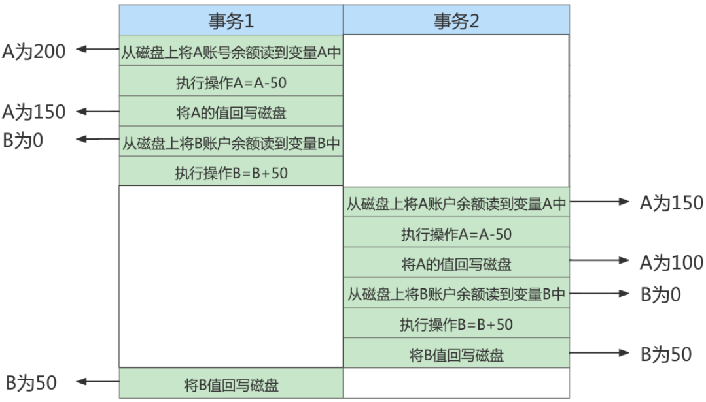
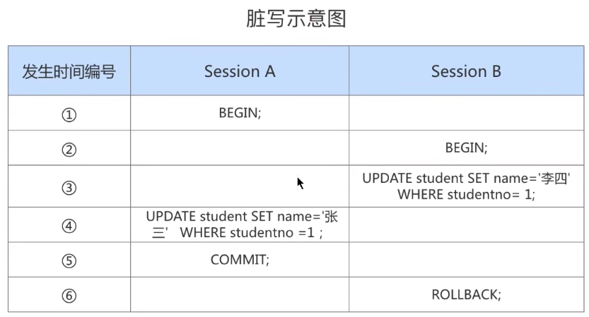
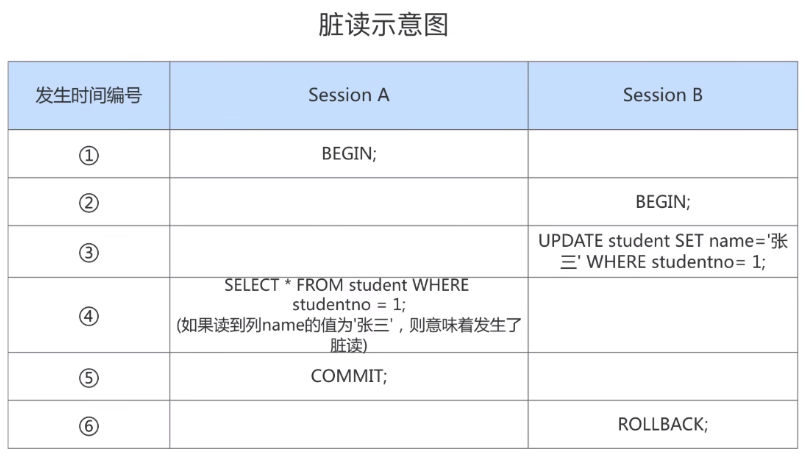
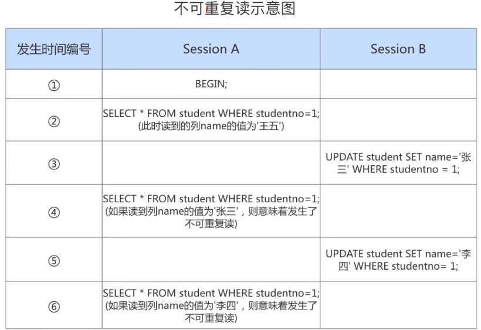
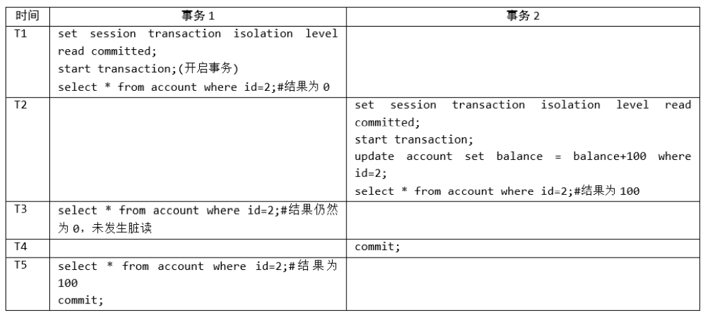
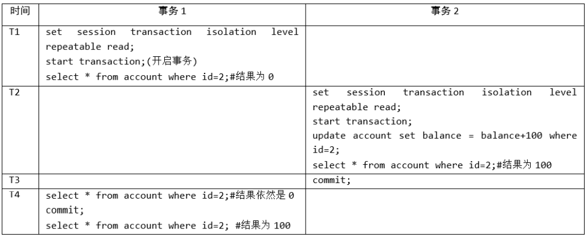
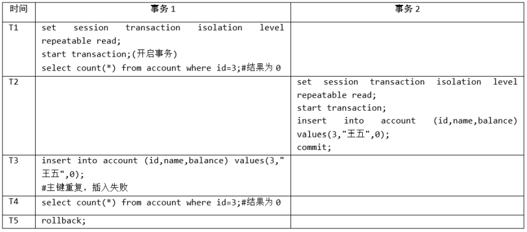

# 第13章 事务基础知识

[事务基础知识](https://blog.csdn.net/weixin_43004044/article/details/126782993?spm=1001.2014.3001.5502)

## 一、数据库事务概述

### 1.1 存储引擎支持情况

`SHOW ENGINES` 命令来查看当前 MySQL 支持的存储引擎都有哪些，以及这些存储引擎是否支持事务。


> ​	能看出在 MySQL 中，只有InnoDB 是支持事务的。


### 1.2 基本概念

- **事务**：一个事务其实就是一个完整的业务逻辑。是一个最小的工作单元。不可再分。

- **事务处理的原则：**保证所有事务都作为 `一个工作单元` 来执行，即使出现了故障，都不能改变这种执行方 式。当在一个事务中执行多个操作时，要么所有的事务都被提交( `commit` )，那么这些修改就 **永久地保存下来**；要么数据库管理系统将**放弃**所作的所有修改 ，整个事务**回滚( rollback )**到最初状态。

```mysql
# 案例：AA用户给BB用户转账100
update account set money = money - 100 where name = 'AA';
# 服务器宕机
update account set money = money + 100 where name = 'BB';
```


### 1.3 事物的ACID特性

* **原子性（atomicity）：**

  ​		原子性是指事务是一个不可分割的工作单位，要么全部提交，要么全部失败回滚。即要么转账成功，要么转账失败，是不存在中间的状态。如果无法保证原子性会怎么样？就会出现数据不一致的情形，A账户减去100元，而B账户增加100元操作失败，系统将无故丢失100元。

* **一致性（consistency）：**

> ​		**在一个事务中的数据，被操作前后的 合法性状态 不会被改变**。所谓的合法性状态是指在多个层面上的对数据的约束。可以是数据总量，可以是表中对字段定义的约束……

​		根据定义，一致性是指事务执行前后，数据从一个 `合法性状态` 变换到另外一个 `合法性状态` 。这种状态是 `语义上` 的而不是语法上的，跟具体的业务有关。

​		那什么是合法的数据状态呢？**满足 `预定的约束` 的状态就叫做合法的状态**。通俗一点，这状态是由你自己来定义的（比如满足现实世界中的约束）。满足这个状态，数据就是一致的，不满足这个状态，数据就 是不一致的！如果事务中的某个操作失败了，系统就会自动撤销当前正在执行的事务，返回到事务操作之前的状态。

**举例1：**A账户有200元，转账300元出去，此时A账户余额为-100元。你自然就发现此时数据是不一致的，为什么呢？因为你定义了一个状态，余额这列必须>=0。

**举例2：**A账户有200元，转账50元给B账户，A账户的钱扣了，但是B账户因为各种意外，余额并没有增加。你也知道此时的数据是不一致的，为什么呢？因为你定义了一个状态，要求A+B的总余额必须不变。

**举例3：**在数据表中我们将`姓名`字段设置为`唯一性约束`，这时当事务进行提交或者事务发生回滚的时候，如果数据表的姓名不唯一，就破坏了事物的一致性要求。

* **隔离型（isolation）：**

    ​		**事务的隔离性是指一个事务的执行不能被其他事务干扰**。即一个事务内部的操作及使用的数据对`并发`的其他事务是隔离的，并发执行的各个事务之间不能相互干扰。

    ​		如果无法保证隔离性会怎么样？假设A账户有200元，B账户0元。A账户往B账户转账两次，每次金额为50 元，分别在两个事务中执行。如果无法保证隔离性，会出现下面的情形：

```mysql
UPDATE accounts SET money = money - 50 WHERE NAME = 'AA';
UPDATE accounts SET money = money + 50 WHERE NAME = 'BB';
```



**持久性（durability）：**

持久性是指一个事务一旦被提交，它对数据库中数据的改变就是 **永久性**的 ，接下来的其他操作和数据库 故障不应该对其有任何影响。

持久性是通过 `事务日志` 中的`重做日志`来保证的。事务日志包括 `重做日志` 和 `回滚日志` 。当我们通过事务对数据进行修改 的时候，首先会将数据库的变化信息记录到重做日志中，然后再对数据库中对应的行进行修改。这样做 的好处是，即使数据库系统崩溃，数据库重启后也能找到没有更新到数据库系统中的重做日志，重新执行，从而使事务具有持久性。

> 总结
>
> ​		ACID是事务的四大特征，在这四个特性中：==原子性是基础，隔离性是手段，一致性是约束条件， 而持久性是我们的目的==。
>
> ​		数据库事务，其实就是数据库设计者为了方便起见，把需要保证`原子性`、`隔离性`、`一致性`和`持久性`的一个或多个数据库操作称为一个事务。


### 1.4 事务的状态

​		我们现在知道 `事务` 是一个抽象的概念，它其实对应着一个或多个数据库操作，MySQL根据这些操作所执行的不同阶段把 `事务` 大致划分成几个状态：

* **活动的（active）**

  ​		事务对应的数据库操作如果正在执行，我们就说该事务处在 `活动的` 状态。

* **部分提交的（partially committed）**（在内存中提交了，但是在磁盘中未提交）

  ​		当事务中的最后一个操作执行完成，但由于所有操作都是在内存中执行的，所造成的影响并 **没有刷新到磁盘** 时，我们就说该事务处在 `部分提交的` 状态。

* **失败的（failed）**

  ​		当事务处在 **活动的** 或者 **部分提交的** 状态时，遇到了某些错误（数据库自身的错误、操作系统的错误或者直接断电等）而导致无法继续执行，或者人为的停止当前事务的执行，我们就说该事务处在 `失败的` 状态。

* **中止的（aborted）**

  ​		如果事务执行了一部分而变为 **失败的** 状态，那么就需要把已经修改的事务中的操作还原到事务执行前的状态。换句话说，就是要**撤销失败事务对当前数据库造成的影响**。我们把这个撤销的过程称之为 `回滚` 。当 **回滚** 操作执行完毕时，也就是数据库恢复到了执行事务之前的状态，我们就说该事务处在了 `中止的` 状态。

  举例：

  ```mysql
  UPDATE accounts SET money = money - 50 WHERE NAME = 'AA';
  
  UPDATE accounts SET money = money + 50 WHERE NAME = 'BB';
  ```

* **提交的（committed）**（数据成功提交到磁盘中了）

  ​		当一个处在 `部分提交的` 状态的事务将修改过的数据都 `同步到磁盘` 上之后，我们就可以说该事务处在了 `提交的` 状态。

  一个基本的状态转换图如下所示：

  

  图中可见，只有当事物处于`提交的`或者`中止的`状态时，一个事务的生命周期才算是结束了。对于已经提交的事务来说，该事务对数据库所做的修改将永久生效，对于处于中止状态的事物，该事务对数据库所做的所有修改都会被回滚到没执行该事物之前的状态。


## 二、如何使用事务

使用事务有两种方式，分别为 **显式事务** 和 **隐式事务** 。


### 2.1 显式事务

- 使用事务的基本步骤
    - 使用 START TRANSACTION 或者 BEGIN 显式开启事务
    - 进行一系列DML操作
    - 提交事务 或 回滚事务

---


#### 1）`START TRANSACTION` 和 `BEGIN`的区别

​		`START TRANSACTION` 语句相较于 `BEGIN` 的特别之处在于，其后边能添加几个修饰符 ：

​		① `READ ONLY` ：标识当前事务是一个 **只读事务** ，也就是属于该事务的数据库操作只能读取数据，而不能修改数据。

> ​		补充：只读事务中只是不允许修改那些其他事务也能访问到的表中的数据，对于临时表来说（我们使用 CREATE TMEPORARY TABLE 创建的表），由于它们只能在当前会话中可见，所有只读事务其实也是可以对临时表进行增、删、改操作的。

​		② `READ WRITE` （**默认**）：标识当前事务是一个 **读写事务** ，也就是属于该事务的数据库操作既可以读取数据， 也可以修改数据。

​		③ `WITH CONSISTENT SNAPSHOT` ：启动一致性读。

---


#### 2）开启事务举例

```mysql
START TRANSACTION READ ONLY; # 开启一个只读事务
```

```mysql
START TRANSACTION READ ONLY, WITH CONSISTENT SNAPSHOT # 开启只读事务和一致性读
```

```mysql
START TRANSACTION READ WRITE, WITH CONSISTENT SNAPSHOT # 开启读写事务和一致性读
```

> 注意：①和②不能一起搭配！！！
>
> * `READ ONLY`和`READ WRITE`是用来设置所谓的事务 **访问模式** 的，就是以只读还是读写的方式来访问数据库中的数据，一个事务的访问模式不能同时设置为 **只读** 和 **读写** 的，所以不能**同时**把`READ ONLY`和`READ WRITE`放到`START TRANSACTION`语句后边。
> * 如果我们不显式指定事务的访问模式，那么该事务的访问模式就是 **读写** 模式
>


#### 3）提交事务举例

```mysql
# 提交事务。当提交事务后，对数据库的修改是永久性的。
mysql> COMMIT;
```

```mysql
# 回滚事务。即撤销正在进行的所有没有提交的修改
mysql> ROLLBACK;

# 将事务回滚到某个保存点。
mysql> ROLLBACK TO [SAVEPOINT]
```

其中关于SAVEPOINT相关操作有：

> ​		事务中提供保存点的目的是：设置保存点之后，可以选择将事务回滚至保存点处，即仅需**回滚部分事务**而不是**回滚至上次事务的提交点**。

```mysql
# 在事务中创建保存点，方便后续针对保存点进行回滚。一个事务中可以存在多个保存点。
SAVEPOINT 保存点名称;
```

```mysql
# 删除某个保存点
RELEASE SAVEPOINT 保存点名称;
```


### 2.2 隐式事务

MySQL中有一个系统变量 `autocommit` ：

```mysql
mysql> SHOW VARIABLES LIKE 'autocommit';
+---------------+-------+
| Variable_name | Value |
+---------------+-------+
| autocommit    |  ON   |
+---------------+-------+
1 row in set (0.01 sec)
```

当然，如果我们想关闭这种 `自动提交` 的功能，可以使用下边两种方法之一：

* 显式的的使用 `START TRANSACTION` 或者 `BEGIN` 语句开启一个事务。这样在本次事务提交或者回滚前会暂时关闭掉自动提交的功能。

* 把系统变量 `autocommit` 的值设置为 `OFF` ，就像这样：

  ```mysql
  SET autocommit = OFF;
  #或
  SET autocommit = 0;
  ```

> ​		补充：Oracle 默认不自动提交，需要手写 COMMIT 命令，而 MySQL 默认自动提交。


#### 1）隐式提交数据的触发条件

##### ① 在事务中使用DDL

​		数据库对象，指的就是`数据库、表、视图、存储过程`等结构。当我们使用`CREATE、ALTER、DROP`等语句去修改数据库对象时，就会隐式的提交前边语句所属的事务。注意：使用 `USE TABLE_NAME` 语句不会造成隐式提交。即：

```mysql
BEGIN;

INSERT ... # 事务中的一条语句
UPDATE ... # 事务中的一条语句
... # 事务中的其他语句

#####################  只要在事务中执行了DDL语句，就相当于提交了一次事务   ###############
CREATE TABLE ... # 此DDL语句会隐式的提交前边语句所属于的事务。
```


##### ② 在一个事务还没提交或者回滚时就又使用 START TRANSACTION 或者 BEGIN 语句开启了另一个事务

```mysql
BEGIN;

INSERT ... # 事务中的一条语句
UPDATE ... # 事务中的一条语句
... # 事务中的其他语句

BEGIN; # 此语句会隐式的提交前边语句所属于的事务
```


##### ③ 当前的 `autocommit` 系统变量的值为 `OFF` ，而我们手动把它调为 `ON` 时

```mysql
SET autocommit = 0;      # 关闭自动提交事务

INSERT ... # 事务中的一条语句
UPDATE ... # 事务中的一条语句
... # 事务中的其他语句

SET autocommit = 1;     # 提交事务
```

> - 当我们设置 `autocommit = 0` 时，不论是否采用 START TRANSACTION 或者 BEGIN 的方式来开启事务，都需要用 COMMIT 进行提交，让事务生效，使用 ROLLBACK 对事务进行回滚。
>
> - 当我们设置 `autocommit = 1` 时，每条 SQL 语句都会自动进行提交。不过这时，如果你采用 START TRANSACTION 或者 BEGIN 的方式来显式地开启事务，那么这个事务只有在 COMMIT 时才会生效，在 ROLLBACK 时才会回滚。


##### ④ 使用 `LOCK TABLES` 、 `UNLOCK TABLES` 等关于 表锁定 的语句时

* 加载数据的语句

  ​		使用 `LOAD DATA` 语句来批量往数据库中导入数据时，会 **隐式的提交** 前边语句所属的事务。

* 关于MySQL主从复制的一些语句 

  ​		使用 `START SLAVE、STOP SLAVE、RESET SLAVE、CHANGE MASTER TO` 等语句会**隐式的提交**前边语句所属的事务

* 其他的一些语句

  ​		使用`ANALYZE TABLE、CACHE INDEX、CAECK TABLE、FLUSH、LOAD INDEX INTO CACHE、OPTIMIZE TABLE、REPAIR TABLE、RESET`等语句也会隐式的提交前边语句所属的事务。


### 2.3 `completion_type`变量

​		**completion_type **变量有三个参数：

- `completion = 0`：这是**默认情况**。当我们执行 COMMIT 的时候会提交事务。提交事务之后，如果下次还需要使用事务，仍然得使用 START TRANSACTION 或者 BEGIN 来开启事务。
- `completion = 1`：这种情况下，当我们提交事务后，相当于执行了 `COMMIT AND CHAIN`，也就是开启一个**链式事务**，即当我们提交事务之后会立即 **开启一个相同隔离级别的事务**。
- `completion = 2`：这种情况下 ，当我们提交事务后，相当于执行了 `COMMIT AND RELEASE`，也就是当我们提交事务后，会自动与服务器断开连接。

```mysql
SET @@completion_type = 1;
```


### 2.4 设置 `SAVEPOINT`

- 创建表并添加数据：

```mysql
CREATE TABLE account(
    id INT PRIMARY KEY AUTO_INCREMENT,
    NAME VARCHAR(15),
    balance DECIMAL(10,2)
);

INSERT INTO account(NAME,balance)
VALUES
('张三',1000),
('李四',1000);
```

- 测试

```mysql
BEGIN;
UPDATE account SET balance = balance - 100 WHERE NAME = '张三';
UPDATE account SET balance = balance - 100 WHERE NAME = '张三';

------------
SAVEPOINT s1; # 设置保存点
UPDATE account SET balance = balance + 1 WHERE NAME = '张三';

------------
ROLLBACK TO s1; # 回滚到保存点
select * from account;
+-----------+--------+---------+
|    id     |  name  | balance |
+-----------+--------+---------+
|      1    |   张三  |  800.00 |
+-----------+--------+---------+
1 row in set (0.00 sec)

------------
ROLLBACK;
select * from account;
+-----------+--------+---------+
|    id     |  name  | balance |
+-----------+--------+---------+
|      1    |   张三  | 1000.00 |
+-----------+--------+---------+
1 row in set (0.00 sec)
```


## 三、事务隔离级别

> ​		MySQL是一个 `客户端／服务器` （C/S）架构的软件，对于同一个服务器来说，可以有若干个客户端与之连接，每个客户端与服务器连接上之后，就可以称为一个会话（ `Session` ）。每个客户端都可以在自己的会话中向服务器发出请求语句，一个请求语句可能是某个事务的一部分，也就是对于服务器来说可能同时处理多个事务。事务有 `隔离性` 的特性，理论上在某个事务 `对某个数据进行访问` 时，其他事务应该进行`排队` ，当该事务提交之后，其他事务才可以继续访问这个数据。但是这样对 `性能影响太大` ，**我们既想保持事务的隔离性，又想让服务器在处理访问同一数据的多个事务时 `性能尽量高些` ，那就看二者如何权衡取舍了**。


### 3.1 数据准备

```mysql
CREATE TABLE student (
    studentno INT,
    name VARCHAR(20),
    class varchar(20),
    PRIMARY KEY (studentno)
) Engine=InnoDB CHARSET=utf8;
```

然后向这个表里插入一条数据：

```mysql
INSERT INTO student VALUES(1, '小谷', '1班');
```

现在表里的数据就是这样的：

```mysql
mysql> select * from student;
+-----------+--------+-------+
| studentno | name   | class |
+-----------+--------+-------+
|      1    |   小谷  | 1班   |
+-----------+--------+-------+
1 row in set (0.00 sec)
```


### 3.2 数据并发问题

​		针对事务的隔离性和并发性，我们怎么做取舍呢？先看一下访问相同数据的事务在不保证**串行执行** （排队执行）的情况下可能会出现哪些问题：

#### 1）脏写（ Dirty Write ）

> ​		对于两个事务 Session A、Session B，如果事务Session A `修改了` 另一个 `未提交` 事务Session B `修改过` 的数据，那就意味着发生了 **脏写**，示意图如下：



​		Session A 和 Session B 各开启了一个事务，Sesssion B 中的事务先将studentno列为1的记录的name列更新为'李四'，然后Session A中的事务接着又把这条studentno列为1的记录的name列更新为'张三'。如果之后Session B中的事务进行了回滚，那么Session A中的更新也将不复存在，这种现象称之为**脏写**。这时Session A中的事务就没有效果了，明明把数据更新了，最后也提交事务了，最后看到的数据什么变化也没有。

> ​			如果自己在MySQL中测试过事务的隔离性的话，会发现即使是在最低的隔离级别`READ UNCOMMITTED`下，上面Session A中的更新语句都会处于等待（阻塞）状态，出现这种现象的原因就是为了解决<u>最严重</u>的**脏写**现象。


#### 2）脏读（ Dirty Read ）

> ​		对于两个事务 Session A、Session B，如果Session A `读取` 了已经被 Session B `更新` 但还 `没有被提交` 的字段，那就意味着发生了 **脏读**。之后若 Session B `回滚` ，Session A `读取 `的内容就是 `临时且无效` 的。



​		Session A和Session B各开启了一个事务，Session B中的事务先将studentno列为1的记录的name列更新 为'张三'，然后Session A中的事务再去查询这条studentno为1的记录，如果读到列name的值为'张三'，而 Session B中的事务稍后进行了回滚，那么Session A中的事务相当于读到了一个不存在的数据，这种现象就称之为 `脏读` 。


#### 3）不可重复读（ Non-Repeatable Read ）

> ​		对于两个事务Session A、Session B，Session A `读取`了一个字段，然后 Session B `更新`了该字段。 之后 Session A `再次读取` **同一个**字段， `值就不同` 了。那就意味着发生了不可重复读。



​		我们在Session B中提交了几个 `隐式事务` （注意是隐式事务，意味着语句结束事务就提交了），这些事务 都修改了studentno列为1的记录的列name的值，每次事务提交之后，如果Session A中的事务都可以查看到最新的值，这种现象也被称之为 `不可重复读 `。


#### 4）幻读（ Phantom ）

> ​		幻读是不可重复读的**数据增加**的特殊情况。

> ​		对于两个事务Session A、Session B，Session A 从一个表中 `读取` 了一个字段，然后 Session B 在该表中插入了一些新的行。 之后，如果 Session A `再次读取` 同一个表就会多出几行，这就意味着发生了`幻读`。


​		Session A中的事务先根据条件 studentno > 0这个条件查询表student，得到了name列值为'张三'的记录； 之后Session B中提交了一个 `隐式事务` ，该事务向表student中插入了一条新记录；之后Session A中的事务 再根据相同的条件 studentno > 0查询表student，得到的结果集中包含Session B中的事务新插入的那条记录，这种现象也被称之为 **幻读** 。我们把新插入的那些记录称之为 `幻影记录` 。


#### 5）幻读与不可重复读的区别

https://blog.51cto.com/u_15265854/2891760


- 注意 1：有的读者可能会有疑问。如果 Session B 中==删除==了一些符合 studentno > 0 的记录而不是插入新记录，那 Session A 之后再根据studentno > 0 的条件读取的记录变少了，这种现象算不算幻读呢？答：这种现象**不属于幻读**，<font style="background-color: #73cf60">幻读强调的是一个事务按照某个相同条件多次读取记录时，之后读取时读到了之前没有读到的记录</font>。
- 注意 2：那对于先前已经读到的记录，之后又读取不到这种情况，算啥呢？这相当于**对每一条记录都发生了不可重复读的现象**。**幻读只是重点强调了读取到了之前读取没有获取到的记录。**


### 3.3 `SQL标准` 中的四种隔离级别

​		上面介绍了几种并发事务执行过程中可能遇到的一些问题，这些问题有轻重缓急之分，我们给这些问题按照严重性来排一下序：==脏写 > 脏读 > 不可重复读 > 幻读==。

​		我们在 事务隔离性 与 性能 之间的选择就体现在：**隔离级别越低，存在的并发问题就越多**。 在`SQL标准` 中设立了4个 `隔离级别` ：

* `READ UNCOMMITTED` ：读未提交，在该隔离级别，所有事务都可以看到其他未提交事务的执行结果。不能避免脏读、不可重复读、幻读。 
* `READ COMMITTED` ：读已提交，它满足了隔离的简单定义：一个事务只能看见已经提交事务所做的改变。这是大多数数据库系统的默认隔离级别（但不是MySQL默认的）。可以避免脏读，但不可重复读、幻读问题仍然存在。 
* `REPEATABLE READ` ：可重复读，事务A在读到一条数据之后，此时事务B对该数据进行了修改并提交，那么事务A再读该数据，读到的还是原来的内容。可以避免脏读、不可重复读，但幻读问题仍然存在。这是MySQL的默认隔离级别。 
* `SERIALIZABLE` ：串行化，确保事务可以从一个表中读取相同的行。在这个事务持续期间，禁止其他事务对该表执行插入、更新和删除操作。所有的并发问题都可以避免，但性能十分低下。能避免脏读、不可重复读和幻读。

---


`SQL标准` 中规定，针对不同的隔离级别，并发事务可以发生不同严重程度的问题，具体情况如下：

> ​		每种隔离级别都解决了**脏写**。MySQL中是使用**锁机制**来解决的。当B事务修改A事务修改过（此时的A、B事务都没有结束）的数据时，会发生阻塞，即不允许修改。当A事务结束之后，B事务就会在A事务提交结束之后的基础上对表进行操作。
>
> > - **MySQL中，对脏写的解决方案。**		
> >
> > ​		A事务修改数据 → B事务想同时修改此数据 → B事务被阻塞  → A事务提交 → B事务成功执行修改操作 → 若B事务想回滚事务，只会回滚至A事务提交点的数据


`脏写 `怎么没涉及到？因为**脏写这个问题太严重了，不论是哪种隔离级别，都不允许脏写的情况发生**。

​		不同的隔离级别有不同的现象，并有不同的锁和并发机制，隔离级别越高，数据库的并发性能就越差，4 种事务隔离级别与并发性能的关系如下：


### 3.4 `MySQL` 中支持的四种隔离级别

​		不同的数据库厂商对 SQL 标准中规定的四种隔离级别的具体实现不一样。比如，Oracle 就只支持 READ COMNITTED（默认隔离级别）和 SERIALIZABLE 隔离级别。**MySQL 虽然支持 4 种隔离级别，但与 SQL 标准中所规定的各级隔离级别允许发生的问题却有些出入**。例如：MySQL 在 REPEATABLE READ 隔离级别下，是可以解决幻读问题的，能够解决幻读的原因在多版本并发控制中会详细介绍。

​		MySQL 的默认隔离级别为 REPEATABLE READ，我们可以手动修改一下事务的隔离级别。
MySQL的默认隔离级别为REPEATABLE READ，我们可以手动修改一下事务的隔离级别。

```mysql
# 查看隔离级别，MySQL 5.7.20的版本之前：
mysql> SHOW VARIABLES LIKE 'tx_isolation';
+---------------+-----------------+
| Variable_name | Value           |
+---------------+-----------------+
| tx_isolation  | REPEATABLE-READ |
+---------------+-----------------+
1 row in set (0.00 sec)
# MySQL 5.7.20版本之后，引入transaction_isolation来替换tx_isolation

# 查看隔离级别，MySQL 5.7.20的版本及之后：
mysql> SHOW VARIABLES LIKE 'transaction_isolation';
+-----------------------+-----------------+
| Variable_name         | Value           |
+-----------------------+-----------------+
| transaction_isolation | REPEATABLE-READ |
+-----------------------+-----------------+
1 row in set (0.02 sec)

#或者不同MySQL版本中都可以使用的：
SELECT @@transaction_isolation;
```


### 3.5 如何设置事务的隔离级别

**通过下面的语句修改事务的隔离级别：**

```mysql
SET [GLOBAL|SESSION] TRANSACTION ISOLATION LEVEL 隔离级别;
#其中，隔离级别格式：
> READ UNCOMMITTED
> READ COMMITTED
> REPEATABLE READ
> SERIALIZABLE
```

或者：

```mysql
SET [GLOBAL|SESSION] TRANSACTION_ISOLATION = '隔离级别'
#其中，隔离级别格式：
> READ-UNCOMMITTED
> READ-COMMITTED
> REPEATABLE-READ
> SERIALIZABLE
```


**关于设置时使用GLOBAL或SESSION的影响：**

* 使用 GLOBAL 关键字（在全局范围影响）：

  ```mysql
  SET GLOBAL TRANSACTION ISOLATION LEVEL SERIALIZABLE;
  #或
  SET GLOBAL TRANSACTION_ISOLATION = 'SERIALIZABLE';
  ```

  则：

  + 当前已经存在的会话无效
  + 只对执行完该语句之后产生的会话起作用

* 使用 `SESSION` 关键字（在会话范围影响）：

  ```mysql
  SET SESSION TRANSACTION ISOLATION LEVEL SERIALIZABLE;
  #或
  SET SESSION TRANSACTION_ISOLATION = 'SERIALIZABLE';
  ```

  则：

  + 对当前会话的所有后续的事务有效
  + 如果在事务之间执行，则对后续的事务有效
  + 该语句可以在已经开启的事务中间执行，但不会影响当前正在执行的事务


​		如果在服务器启动时想改变事务的默认隔离级别，可以修改启动参数`transaction_isolation`的值。比如，在启动服务器时指定了`transaction_isolation=SERIALIZABLE`，那么事务的默认隔离级别就从原来的`REPEATABLE-READ`变成了`SERIALIZABLE`。


### 3.6 测试不同隔离级别下的数据操作

#### 1）初始化数据

```mysql
TRUNCATE TABLE account;
INSERT INTO account VALUES (1,'张三','100'), (2,'李四','0');
```


#### 2）读未提交

- 设置隔离级别为未提交读：


​		脏读就是指当前事务就在访问数据，并且对数据进行了修改，而这种修改还没有提交到数据库中，这时，另外一个事务也访问了这个数据，并成功读取到了这个数据。


#### 3）读已提交




#### 4） 不可重复读

设置隔离级别为可重复读，事务的执行流程如下：



​		当我们将当前会话的隔离级别设置为可重复读的时候，当前会话可以重复读，就是每次读取的结果集都相同，而不管其他事务有没有提交。但是在可重复读的隔离级别上会出现幻读的问题。


#### 5）幻读




## 四、事务的常见分类

从事务理论的角度来看，可以把事务分为以下几种类型：

* 扁平事务（Flat Transactions） 
* 带有保存点的扁平事务（Flat Transactions with Savepoints） 
* 链事务（Chained Transactions） 
* 嵌套事务（Nested Transactions） 
* 分布式事务（Distributed Transactions）

---


### 4.1 带有保存点的扁平事务 (Flat Transactions with Savepoints)

​		带有**保存点的扁平事务**除了支持扁平事务支持的操作外，**还允许在事务执行过程中回滚到同一事务中较早的一个状态**。这是因为某些事务可能在执行过程中出现的错误并不会导致所有的操作都无效，放弃整个事务不合乎要求，开销太大。

​		保存点 (Savepoint) 用来通知事务系统应该记住事务当前的状态，以便当之后发生错误时，事务能回到保存点当时的状态。对于扁平的事务来说，隐式的设置了一个保存点，然而在整个事务中，只有这一个保存点，因此，回滚只能会滚到事务开始时的状态。


### 4.2 链事务 (Chained Transactions)

​		**链事务**是指一个事务**由多个子事务链式组成**，它可以被视为保存点模式的一个变种。带有保存点的扁平事务，当发生系统崩溃时，所有的保存点都将消失，这意味着当进行恢复时，事务需要从开始处重新执行，而不能从最近的一个保存点继续执行。

​		**链事务的思想**是：在提交一个事务时，释放不需要的数据对象，将必要的处理上下文隐式地传给下一个要开始的事务，前一个子事务的提交操作和下一个子事务的开始操作合并成一个原子操作，这意味着下一个事务将看到上一个事务的结果，就好像在一个事务中进行一样。这样，在提交子事务时就可以释放不需要的数据对象，而不必等到整个事务完成后才释放。其工作方式如下：


​		链事务与带有保存点的扁平事务的不同之处体现在：
​		① 带有保存点的扁平事务能回滚到任意正确的保存点，而链事务中的回滚仅限于当前事务，即只能恢复到最近的一个保存点。
​		② 对于锁的处理，两者也不相同，链事务在执行 COMMIT 后即释放了当前所持有的锁，而带有保存点的扁平事务不影响迄今为止所持有的锁。


### 4.3 嵌套事务 (Nested Transactions)

​		**嵌套事务**是一个层次结构框架，由一个顶层事务 (Top-Level Transaction) 控制着各个层次的事务，顶层事务之下嵌套的事务被称为子事务 (Subtransaction)，其控制着每一个局部的变换，子事务本身也可以是嵌套事务。因此，嵌套事务的层次结构可以看成是一棵树。


### 4.4 分布式事务 (Distributed Transactions)

​		**分布式事务**通常是在一个分布式环境下运行的扁平事务，因此，需要根据数据所在位置访问网络中不同节点的数据库资源。例如，一个银行用户从招商银行的账户向工商银行的账户转账 1000 元，这里需要用到分布式事务，因为不能仅调用某一家银行的数据库就完成任务。

