# 第14章 MySQL事务日志

[MySQL 事务日志](https://blog.csdn.net/weixin_43004044/article/details/126818251?spm=1001.2014.3001.5502)

事务有4种特性：原子性、一致性、隔离性和持久性。那么事务的四种特性到底是使用什么方式来保证的呢？

* 事务的**隔离性**由 **<font color="red">锁机制</font>** 、**<font color="red">MVCC</font>** 等手段来保证。

* 事务的**持久性**由 **<font color="red">redo log(重做日志)</font>**  来保证。它提供再写入操作，恢复已提交事务修改的页操作。

* 事务的**原子性**由 **<font color="red">undo log(回滚日志)</font>**  来保证。利用它，可以回滚行记录至某个特定版本。

* > 保证了事务的持久性、原子性、隔离性之后，**一致性**才会得到保障！！！


---

​		有的DBA或许会认为 UNDO 是 REDO 的逆过程，其实不然。REDO 和 UNDO都可以视为是一种 **恢复操作**，但是：

* redo log：是**存储引擎层** (`innodb`) 生成的日志，记录的是 =="物理级别"== 上的**页修改操作**，比如页号xxx，偏移量yyy写入了'zzz'数据。主要为了保证数据的**可靠性**。

* undo log：是**存储引擎层** (`innodb`) 生成的日志，记录的是 =="逻辑操作"== 日志，比如对某一行数据进行了INSERT语句操作，那么undo log就记录一条**与之相反**的DELETE操作。主要用于 **<font style="background-color: #73cf60">事务的回滚</font>** (undo log 记录的是每个修改操作的 **<font color="blue">逆操作</font>**) 和 **<font style="background-color: #73cf60">一致性非锁定读</font>** (undo log 回滚行记录到某种特定的版本——MVCC，即多版本并发控制)。


## 一、redo日志

> ​		InnoDB存储引擎是以`页为单位`来管理存储空间的。在真正访问页面之前，需要把在`磁盘上`的页缓存到内存中的`Buffer Pool`之后才可以访问。所有的变更都必须`先更新缓冲池`中的数据，然后缓冲池中的`脏页`会以一定的频率被刷入磁盘 (`checkPoint`机制)，通过缓冲池来优化CPU和磁盘之间数据存取的速度，这样就可以保证整体的性能不会下降太快。


### 1.1 为什么需要REDO日志

​		一方面，缓冲池可以帮助我们消除CPU和磁盘之间的鸿沟，checkpoint机制可以保证数据的最终落盘，然而由于checkpoint **并不是每次发生数据变更的时候就触发** 的，而是`master`线程隔一段时间去处理的。所以最坏的情况就是事务提交后，刚写完缓冲池，数据库宕机了，那么这段数据就是丢失的，无法恢复。

​		另一方面，事务包含 `持久性` 的特性，就是说对于一个已经提交的事务，在事务提交后即使系统发生了崩溃，这个事务对数据库中所做的更改也不能丢失。那么如何保证这个持久性呢？

> ​		 **一个简单的做法** ：在事务提交完成之前把该事务所修改的所有页面都刷新到磁盘，但是这个简单粗暴的做法有些问题：

* **修改量与刷新磁盘的工作量严重不成比例**

  ​		有时候我们仅仅只修改了某个页面中的一个字节，但是我们知道在InnoDB中是以页为单位来进行磁盘IO的，也就是说我们在该事务提交时不得不将一个完整的页面从内存中刷新到磁盘，我们又知道一个默认页面是`16KB`大小，只修改一个字节就要刷新16KB的数据到磁盘上显然是小题大做了。

* **随机IO刷新较慢**

  ​		一个事务可能包含很多语句，即使是一条语句也可能修改许多页面，假如该事务修改的这些页面可能并不相邻，这就意味着在将某个事务修改的Buffer Pool中的页面`刷新到磁盘`时，需要进行很多的`随机IO`，随机IO比顺序IO要慢，尤其对于传统的机械硬盘来说。
  
  ​		**<font color="blue">另一个解决的思路</font>** ：我们只是想让已经提交了的事务对数据库中数据所做的修改永久生效，即使后来系统崩溃，在重启后也能把这种修改恢复出来。所以我们其实没有必要在每次事务提交时就把该事务在内存中修改过的全部页面刷新到磁盘，只需要把 **修改** 的那些数据 **记录一下** 就好。比如，某个事务将系统表空间中第10号 页面中偏移量为 100 处的那个字节的值 1 改成 2 。我们只需要记录一下：将第0号表 空间的10号页面的偏移量为100处的值更新为 2 即可。
  
  ​		InnoDB引擎的事务采用了WAL技术 (`Write-Ahead Logging`：==**优先将数据写到日志**==)，这种技术的思想就是先写日志，再写磁盘，只有日志写入成功，才算事务提交成功，这里的日志就是`redo log`。当发生宕机且数据未刷到磁盘的时候，可以通过redo log来恢复，保证ACID中的D，这就是redo log的作用。

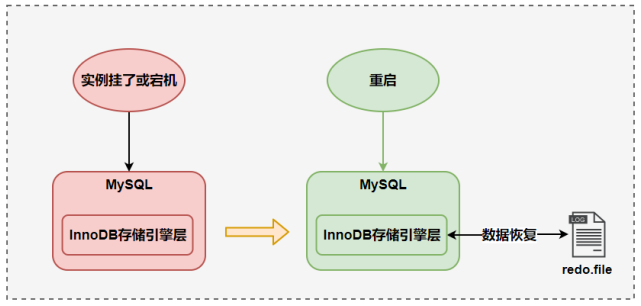


### 1.2 REDO日志的好处、特点

#### 1）好处

* redo日志降低了刷盘频率 
* redo日志占用的空间非常小

> ​	存储：表空间ID、页号、偏移量以及需要更新的值。由此可见，所需的存储空间是很小的，刷盘快。


#### 2）特点

* **redo日志是顺序写入磁盘的**

    		在执行事务的过程中，每执行一条语句，就可能产生若干条redo日志，这些日志是按照`产生的顺序写入磁盘的`，也就是使用顺序ID，效率比随机IO快。

* **事务执行过程中，`redo log`不断记录；`bin log`只在事务提交之后记录一次**

  ​		redo log跟bin log的区别，redo log是`存储引擎层`产生的，而bin log是`数据库server层`产生的。假设一个事务，对表做10万行的记录插入，在这个过程中，一直不断的往redo log顺序记录，而bin log不会记录，直到这个事务提交，才会一次写入到bin log文件中。


### 1.3 redo的组成

Redo log可以简单分为以下两个部分：

#### 1）重做日志缓冲区 (redo log buffer) 

> ​		==保存在内存中，是易失的==。在数据库服务器启动时会向操作系统申请一片称之为 redo log buffer 的 `连续内存`空间，翻译成中文就是**redo日志缓冲区**。这片内存空间被划分为若干个连续的`redo log block`。一个redo log block占用`512字节`。

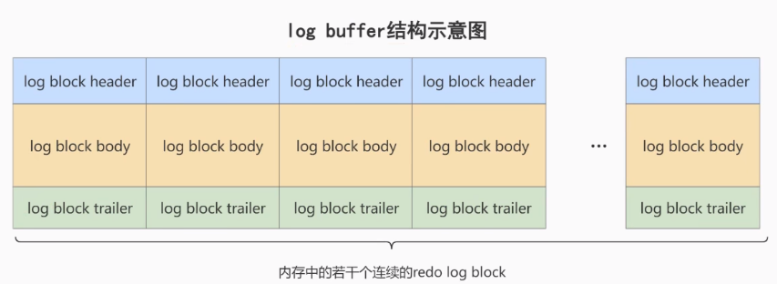

**参数设置：innodb_log_buffer_size：**

redo log buffer 大小，默认 `16M` ，最大值是4096M，最小值为1M。

```mysql
mysql> show variables like '%innodb_log_buffer_size%';
+------------------------+----------+
| Variable_name          | Value    |
+------------------------+----------+
| innodb_log_buffer_size | 16777216 |
+------------------------+----------+
```


#### 2）重做日志文件 (redo log file)

> ​		==保存在硬盘中，是持久的==。

REDO日志文件如图所示，其中`ib_logfile0`和`ib_logfile1`即为REDO日志。

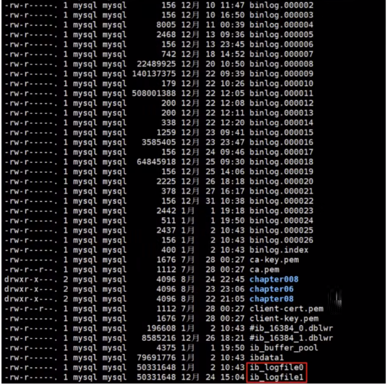


### 1.4 redo的整体流程

​		以一个更新事务为例，redo log 的工作流程，如下图所示：

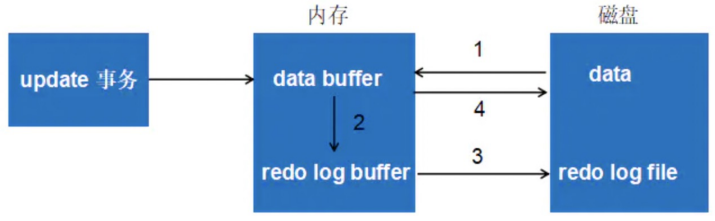

- 第1步：先将原始数据从磁盘中读入内存中来，修改数据的内存拷贝
- 第2步：修改数据的操作会产生若干条**重做日志**，并写入`redo log buffer`，记录的是数据被修改后的值
- 第3步：当事务commit时，将redo log buffer中的内容刷新到 redo log file，对 redo log file采用**追加写**的方式
- 第4步：定期将内存中修改的数据刷新到磁盘中

> 体会： Write-Ahead Log(**预先日志持久化**)：在持久化一个数据页之前，优先将内存中相应的日志页持久化。


### 1.5 redo log的刷盘策略

> ​		**redo log的写入并不是直接写入磁盘的**，InnoDB引擎会在写redo log的时候先写redo log buffer，之后以` 一定的频率 `刷入到真正的redo log file 中。这里的一定频率怎么看待呢？这就是我们要说的**刷盘策略**。

|              刷盘（刷到磁盘上的redo日志中）策略              |
| :----------------------------------------------------------: |
|  |


> ​		注意：redo log buffer刷盘到redo log file的过程并不是真正的直接刷到磁盘中去，而是先刷入到 **文件系统缓存**  **（<font color="green">page cache</font>）**（这玩意，存在于内存中）中去（这是现代操作系统为了**提高文件写入效率**做的一个优化），**真正的写入磁盘的操作会交给操作系统自己来处理**（比如`page cache`足够大了）。那么对于InnoDB来说就存在一个问题，如果交给系统来同步，同样如果`操作系统`宕机，那么数据也丢失了（虽然<u>整个系统宕机的概率还是比较小的</u>）。

 

​		针对这种情况，InnoDB给出 `innodb_flush_log_at_trx_commit` 参数，该参数**<font color="blue">控制commit提交事务时</font>**，**如何将 redo log buffer 中的日志刷新到 redo log file 中**。它支持三种策略：

* ==**设置为0**== ：【耗时最少】表示每次事务提交的时候，**不会**将 `redo log buffer` 中的内容写入至`page cache`；而是由操作系统使用默认的后台线程：`master thread`每隔1s或超出阈值容量时进行一次将 `redo log buffer` 中的内容写入至`page cache`中的操作。

  > 《数据库系统 或者 操作系统挂了，都会有问题！》

* ==**设置为1**（ **默认值** ）==  ：【耗时最多】表示每次事务提交的时候，都会将 `redo log buffer` 中的内容***立即***写入至`page cache`；然后***立即***进行**刷盘（将 `page cache` 中的数据刷到磁盘中）**操作。【可以理解为：<font color="red">只要事务提交成功，redo log 记录就一定会成功写入硬盘中，不会有任何数据丢失</font>】

  > 《数据库系统与操作系统挂了都问题不大》

* ==**设置为2 **==：【耗时居中】表示每次事务提交时都会把 `redo log buffer` 中的内容<u>立即</u>写入 `page cache`。但是不会<u>立即</u>将 `page cache` 中的内容刷到`磁盘`中，由OS决定什么时候同步到磁盘文件。

  > 《数据库系统挂了问题不大，但是操作系统也挂了，就有问题了》

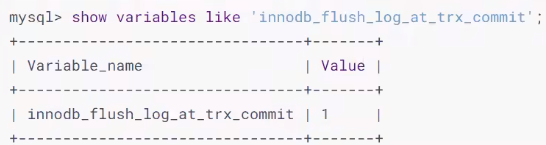


#### 附：后台线程刷盘策略

> ​		InnoDB存储引擎有一个**后台线程(master thread)**，每隔`1秒`<sup>①</sup> 或者 当`redo log buffer`占用的空间即将达到`innodb_log_buffer_size`（这个参数默认是16M）的一半<sup>②</sup> 的时候，后台线程会主动刷盘。就会把`redo log buffer`中的内容写到**文件系统缓存**(`page cache`)中，然后调用刷盘（这下是动真格的，把数据刷到磁盘中）操作。
>
> > ​		所以，即使事务没有提交，`redo log buffer`中的内容仍然会在特定的设定下被写到`page cache`中。

|                      后台线程的刷盘操作                      |
| :----------------------------------------------------------: |
| 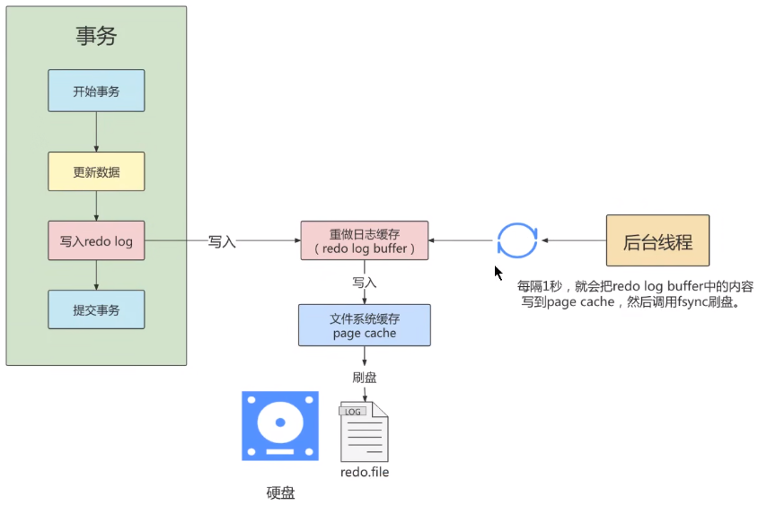 |


### 1.6 不同刷盘策略演示（细节剖析）

#### 1）流程图

|              innodb_flush_log_at_trx_commit = 1              |
| :----------------------------------------------------------: |
| 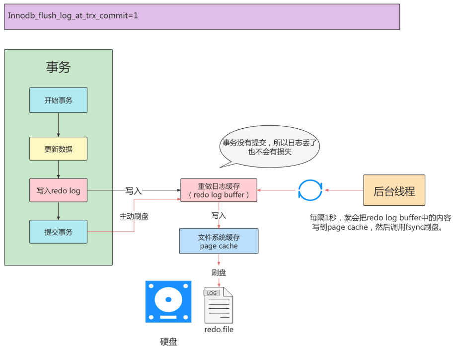 |

> ​		小结：*innodb_flush_log_at_trx_commit = 1 时，* **<font color="red">只要事务提交成功，redo log 记录就一定在硬盘里，不会有任何数据丢失</font>**。如果事务执行期间 MySQL 挂了或宕机，这部分日志丢了，但是事务并没有提交，所以日志丢了也不会有损失。可以保证 ACID 的 D，数据绝对不会丢失，但是效率是**最差**的。***建议使用默认值***，虽然操作系统宕机的概率理论小于数据库宕机的概率，但是一般既然使用了事务，那么数据的安全相对来说更重要些。

------


|              innodb_flush_log_at_trx_commit = 2              |
| :----------------------------------------------------------: |
| 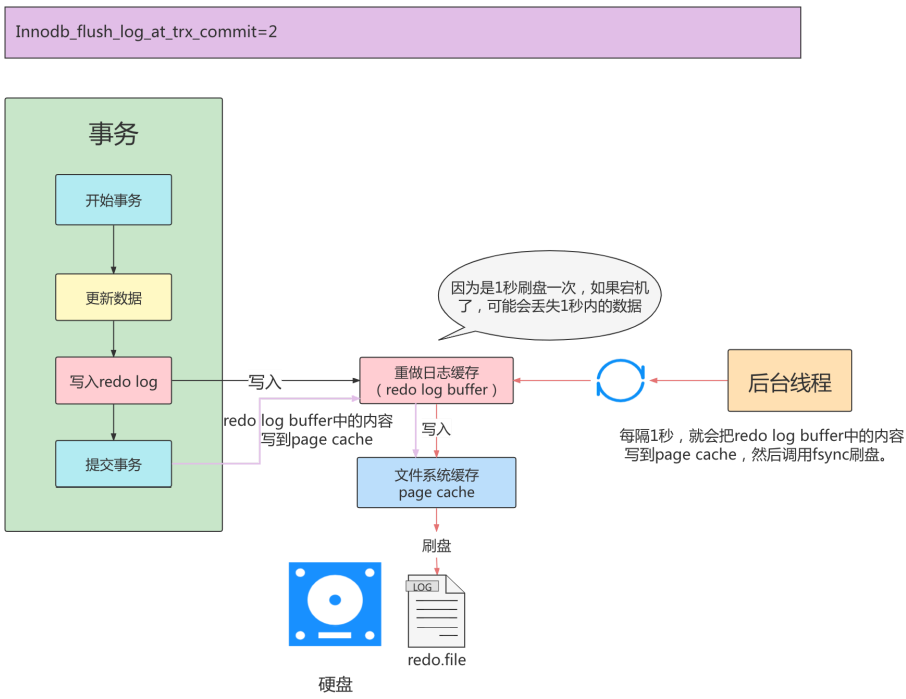 |

> ​		小结：*innodb_flush_log_at_trx_commit = 2 时*，只要事务提交成功，`redo log buffer`中的内容只写入文件系统缓存 (`page cache`)。如果仅仅只是 `MySQL` 挂了不会有任何数据丢失，但是`操作系统`宕机可能会有 1s 数据的丢失，这种情况下无法满足 ACID 中的 D。值为 2 的话，是一种折中的做法，它的 I/O 效率理论是高于 1 的，低于 0 的，这种策略也有丢失数据的风险，也无法保证 ACID 中的 D。

------


|              innodb_flush_log_at_trx_commit = 0              |
| :----------------------------------------------------------: |
| 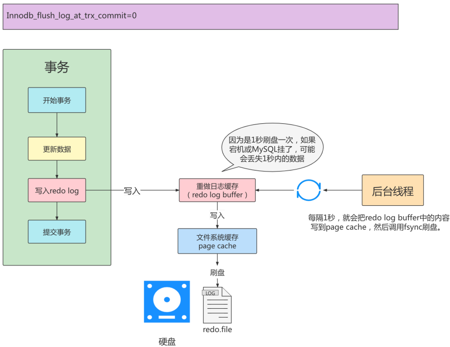 |

> ​		小结：*innodb_flush_log_at_trx_commit = 0* 时，`master thread` 中每 1s 进行一次重做日志的 **fsync 操作**，因此最多丢失 1s 内的事务。这种情况下无法满足 ACID 中的 D，但是数值 0 肯定是效率最高的。


#### 2）举例

比较`innodb_flush_log_at_trx_commit`的不同取值对事务的影响。

```mysql
CREATE TABLE test_load(
    a INT,
    b CHAR(80)
)ENGINE=INNODB;
```


- innodb_flush_log_at_trx_commit的默认值为**1**：

```mysql
DELIMITER//
CREATE PROCEDURE p_load(COUNT INT UNSIGNED)
BEGIN
DECLARE s INT UNSIGNED DEFAULT 1;
DECLARE c CHAR(80) DEFAULT REPEAT('a',80);
WHILE s<=COUNT DO
INSERT INTO test_load SELECT NULL, c;
COMMIT;
SET s=s+1;
END WHILE;
END //
DELIMITER;
```

​		存储过程代码中，每插入一条数据就进行一次**显式的COMMIT操作**。在默认的设置下，即`innodb_fush_og_at_trx_commit`的值为`1`的情况下，INNODB存储引擎会**立即**将**重做日志缓冲区**中的日志写入内存中的`page cache`中，并调用一次 `fsync` 操作进行刷盘（将`page cache`中的数据刷到磁盘中的`redo log文件`）。

​		执行命令 `CALL P_load(3000)`，向表中插入3万行的记录，并执行3万次的fsync操作。在默认情况下所需的时间为：

```mysql
mysql> CALL p_load(30000);
Query OK, 0 rows affected(1 min 23 sec)
```

`1 min 23 sec`的时间显然是不能接受的。而造成时间比较长的原因就在于`fsync操作`所需要的时间较长。


- 修改参数innodb_flush_log_at_trx_commit的值为**0**：

```mysql
mysql> set global innodb_flush_log_at_trx_commit = 0;
```

```mysql
mysql> CALL p_load(30000);
Query OK, 0 rows affected(38 sec)
```


- 修改参数innodb_flush_log_at_trx_commit的值为**2**：

```mysql
mysql> set global innodb_flush_log_at_trx_commit = 2;
```

```mysql
mysql> CALL p_load(30000);
Query OK, 0 rows affected(46 sec)
```


#### 3）小结

​		虽然用户可以通过设置参数 `innodb_flush_log_at_trx_commit` 的值为0或2来提高事务提交的性能，但需要明白的是，这种设置方法不同程度的丧失了事务 ACID 特性中的 `D` 特性。


### 1.7 写入 redo log buffer 的细致过程

#### 1）补充概念：Mini-Transaction

> ​		==MySQL把对底层**页面**的一次**原子访问过程**称之为一个`Mini-Transaction`，简称`mtr`==。比如，向某个索引对应的B+树中插入一条记录的过程就是一个`Mini-Transaction`：只可以插入成功或者插入失败，没有中间过程。
>
> ​		一个所谓的`mtr`可以包含**一组redo日志**，在进行崩溃恢复时这一组`redo`日志需要被作为**一个不可分割的整体**。

​		一个事务可以包含若干条语句，每一条语句其实是由若干个 `mtr` 组成，每一个 `mtr` 又可以包含若干条 redo日志，画个图表示它们的关系就是这样：

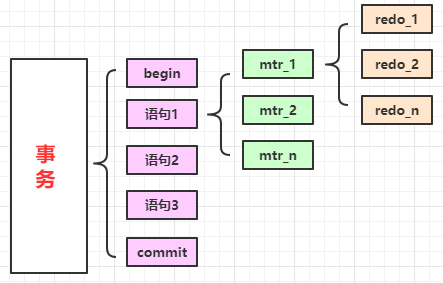


#### 2）redo 日志写入`redo log buffer`

​		向 `log buffer` 中写入 redo 日志的过程是**顺序**的，也就是先往前边的 block 中写，当该 block 的空闲空间用完之后再往下一个 block 中写。当我们想往 `log buffer` 中写入 redo 日志时，第一个遇到的问题就是应该写在哪个 `block` 的哪个偏移量处，所以 InnoDB 的设计者特意提供了一个称之为 `buf_free` 的全局变量，该变量指明后续写入的 redo 日志应该写入到 `log buffer` 中的哪个位置，如图所示：

|              redo log buffer 由 n 个 block组成               |
| :----------------------------------------------------------: |
|  |


​	

​		一个 mtr 执行过程中可能产生若干条 redo 日志，这些 redo 日志是一个**不可分割的组**，所以其实**<font color="green">并不是每生成一条 redo 日志，就将其插入到log buffer 中，而是每个 mtr 运行过程中产生的日志先暂时存到一个地方，当该 mtr 结束的时候，再将过程中产生的一组 redo 日志全部复制到 log buffer 中</font>**。我们现在假设有两个名为 T1、T2 的事务，每个事务都包含 2 个 mtr，我们给这几个 mtr 命名一下：

- 事务 T1 的两个 mtr 分别称为 mtr_T1_1 和 mtr_T1_2

- 事务 T2 的两个 mtr 分别称为 mtr_T2_1 和 mtr_T2_2

  

  每个 mtr 都会产生一组 redo 日志，用示意图来描述一下这些 mtr 产生的日志情况：

|             每个mtr会产生一组不可分割的redo日志              |
| :----------------------------------------------------------: |
| 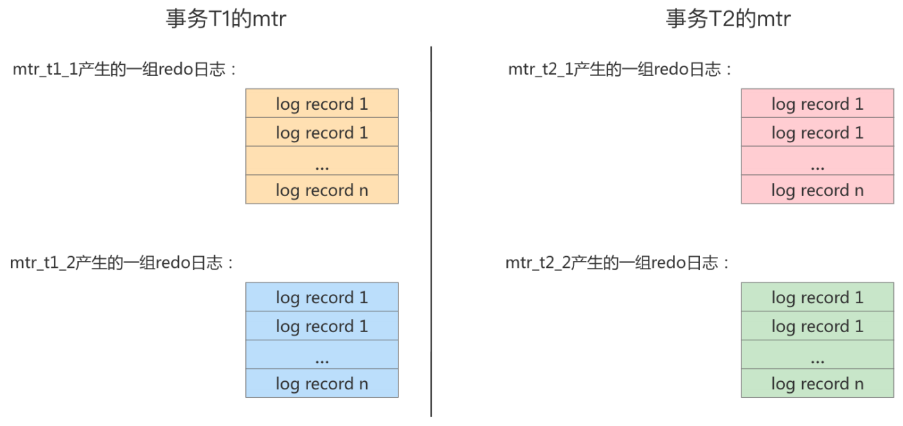 |


​		不同的事务可能是 `并发` 执行的，所以 T1 、 T2 之间的 `mtr` 也可能是 `交替执行` 的。每当一个mtr执行完成时，伴随该mtr生成的一组redo日志就需要被复制到`log buffer`中，也就是说不同事务的mtr可能是交替写入log buffer的，我们画个示意图（为了美观，我们把一个mtr中产生的所有redo日志当做一个整体来画）：

> ​		mtr可以交替，但是mtr中的一组redo日志不可交替。

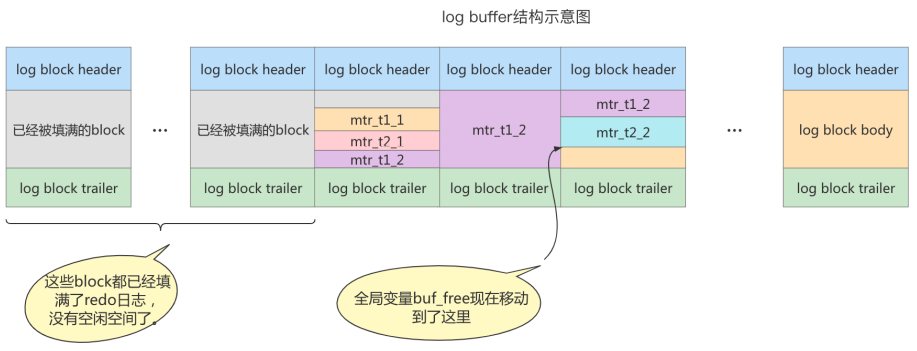

有的mtr产生的redo日志量非常大，比如`mtr_t1_2`产生的redo日志占用空间比较大，占用了3个`block`来存储。


#### 3）redo log block的结构图

​		一个redo log block是由`日志头、日志体、日志尾`组成。日志头占用12字节，日志尾占用8字节，所以一个block真正能存储的数据是512-12-8=492字节。

> - #### 为什么一个 block 设计成 512 字节？
>
>   ​		这个和磁盘的扇区有关，机械磁盘默认的扇区就是 512 字节，如果你要写入的数据大于 512 字节，那么要写入的扇区肯定不止一个，这时就要涉及到盘片的转动，找到下一个扇区，假设现在需要写入两个扇区 A 和 B，如果扇区 A 写入成功，而扇区 B 写入失败，那么就会出现**非原子性的写入**，而如果每次只写入和扇区的大小一样的 512 字节，那么每次的写入都是原子性的。


|                      redo log block结构                      |
| :----------------------------------------------------------: |
| 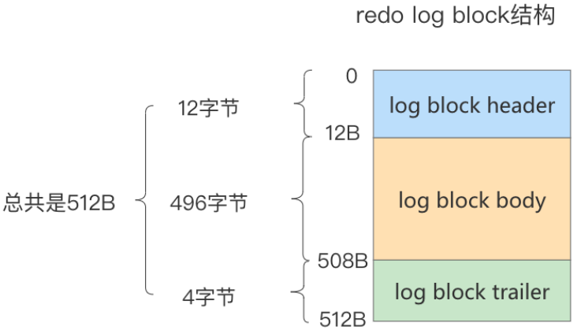 |


​		真正的redo日志都是存储到占用`496`字节大小的`log block body`中，图中的`log block header`和`log block trailer`存储的是一些**管理信息**。我们来看看这些所谓的 管理信息 都有什么。


|          属性名           |                           属性意义                           |
| :-----------------------: | :----------------------------------------------------------: |
|     LOG_BLOCK_HDR_NO      | 表示 block 中已经使用了多少字节，初始值为 12（因为 log block body 从第 12 个字节处开始）。随着往 block 中写入的 redo 日志越来也多，本属性值也跟着增长。如果 log block body 已经被全部写满，那么本属性的值被设置为 512 |
|  LOG_BLOCK_HDR_DATA_LEN   | 表示 block 中已经使用了多少字节，初始值为 12（因为 log block body 从第 12 个字节处开始）。随着往 block 中写入的 redo 日志越来也多，本属性值也跟着增长。如果 log block body 已经被全部写满，那么本属性的值被设置为 512 |
| LOG_BLOCK_FIRST_REC_GROUP | 一条 redo 日志也可以称之为一条 redo 日志记录 (redo log record)，一个 mtr 会生产多条 redo 日志记录，这些 redo 日志记录被称之为一个 redo 日志记录组(redo log record group)。LOG_BLOCK_FIRST_REC_GROUP 就代表该 block 中第一个 mtr 生成的 redo 日志记录组的偏移量（其实也就是这个 block 里第一个 mtr 生成的第一条 redo 日志的偏移量）。如果该值的大小和LOG_BLOCK_HDR_DATA_LEN 相同，则表示当前 log block 不包含新的日志 |
|  LOG_BLOCK_CHECKPOINT_NO  |   占用 4 字节，表示该 log block 最后被写入时的 checkpoint    |

- `log block header` 的属性分别如下：
    - `LOG_BLOCK_HDR_NO`：log buffer 是由 log block 组成，在内部 log buffer 就好似一个数组，因此 LOG_BLOCK_HDR_NO 用来标记这个数组中的**位置**。所谓的位置是**递增并且循环使用**的，占用 4 个字节，但是由于第一位用来判断是否是 flush bit，所以最大的值为 2G。
    - `LOG_BLOCK_HDR_DATA_LEN`：表示 **block 中已经使用了多少字节**，初始值为 12（因为 log block body 从第 12 个字节处开始）。随着往 block 中写入的 redo 日志越来也多，此属性值也跟着增长。如果 log block body 已经被全部写满，那么此属性的值会被设置为 512。
    - `LOG_BLOCK_FIRST_REC_GROUP`：一条 redo 日志也可以称之为一条 redo 日志记录 (redo log record)，一个 mtr 会生产多条 redo 日志记录，这些 redo 日志记录被称之为一个 **redo 日志记录组(redo log record group)**。LOG_BLOCK_FIRST_REC_GROUP 就代表**该 block 中第一个 mtr 生成的 redo 日志记录组的偏移量**（其实也就是这个 block 里第一个 mtr 生成的第一条 redo 日志的偏移量）。**如果该值的大小和LOG_BLOCK_HDR_DATA_LEN 相同，则表示当前 log block 不包含新的日志**。
    - `LOG_BLOCK_CHECKPOINT_NO`：占用 4 字节，表示该 log block 最后被写入时的 `checkpoint`编号。
- `log block trailer` 中的属性如下：
    - `LOG_BLOCK_CHECKSUM`：表示 block 的校验值，用于正确性校验（其值和 LOG_BLOCK_HDR_NO 相同)，我们暂时不关心它。


### 1.8 redo log file

#### 1）相关参数设置

* `innodb_log_group_home_dir` ：指定 redo log 文件组**所在的路径**，默认值为 `./` ，表示在数据库 的数据目录下。MySQL的默认数据目录（ `var/lib/mysql`）下默认有两个名为 `ib_logfile0` 和 `ib_logfile1` 的文件，log buffer中的日志默认情况下就是刷新到这两个磁盘文件中。此redo日志 文件位置还可以修改。

* `innodb_log_files_in_group`：指明redo log file的**个数**，命名方式如：ib_logfile0，iblogfile1... iblogfilen。默认2个，最大100个。

  ```mysql
  mysql> show variables like 'innodb_log_files_in_group';
  +---------------------------+-------+
  | Variable_name             | Value |
  +---------------------------+-------+
  | innodb_log_files_in_group | 2     |
  +---------------------------+-------+
  #ib_logfile0
  #ib_logfile1
  ```

* `innodb_flush_log_at_trx_commit`：控制 redo log 刷新到磁盘的策略，默认为1。

* `innodb_log_file_size`：单个 redo log 文件设置大小，默认值为 `48M` 。最大值为`512G`，注意最大值 指的是整个 redo log 系列文件之和，即（**innodb_log_files_in_group * innodb_log_file_size** ）不能大于最大值512G。

  ```mysql
  mysql> show variables like 'innodb_log_file_size';
  +----------------------+----------+
  | Variable_name        | Value    |
  +----------------------+----------+
  | innodb_log_file_size | 50331648 |
  +----------------------+----------+
  ```

根据业务修改其大小，以便容纳较大的事务。编辑`my.cnf`文件并重启数据库生效，如下所示

```mysql
[root@localhost ~]# vim /etc/my.cnf
innodb_log_file_size=200M
```

> - 在数据库实例更新比较频繁的情况下，可以适当加大 redo log 数组和大小，但也不推荐 redo log 设置过大。
>- 在MySQL崩溃时会重新执行REDO日志中的记录。


#### 2）日志文件组

​		从上边的描述中可以看到，磁盘上的 `redo 日志`文件不只一个，而是以一个**日志文件组**的形式出现的。这些文件以 `ib_logfile[数字]`（数字可以是0、1、2…）的形式进行**命名**，每个的 redo 日志文件大小都是一样的。

​		在将 redo 日志写入日志文件组时，是从 `ib_logfile0` 开始写，如果`ib_logfile0` 写满了，就在`ib_logfile1`中接着写。同理，ib_logfile1 写满了就去写 ib_logfile2，依此类推。**如果最后一个文件都被写满了，就会重新转到 ib_logfile0 继续写**。所以整个过程如下图所示：

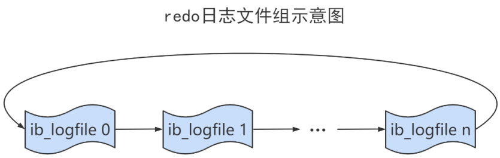

**总共**的redo日志文件大小其实就是： `innodb_log_file_size × innodb_log_files_in_group` 。

​		

#### 3）checkpoint

> ​		由于采用的是 **循环写** 的方式向redo日志文件组里写数据，这会导致后写入的redo日志覆盖掉前边写入的redo日志。所以InnoDB的设计者提出了`checkpoint`的概念。

在整个日志文件组中还有两个重要的属性，分别是 `write pos`、`checkpoint`

* `write pos`是当前**记录**的位置，一边写一边后移
* `checkpoint`是当前**要擦除**的位置，也是往后推移

​		每次刷盘 redo log 记录到日志文件组中，write pos 位置就会后移更新。每次MySQL加载日志文件组恢复数据时，会清空加载过的 redo log 记录，并把checkpoint后移更新。write pos 和 checkpoint 之间的还空着的部分可以用来写入新的 redo log 记录。


​		如果 write pos **追上** checkpoint ，表示`日志文件组`满了，这时候不能再写入新的 redo log记录，MySQL 得 停下来，**清空一些记录**，把 checkpoint 推进一下。

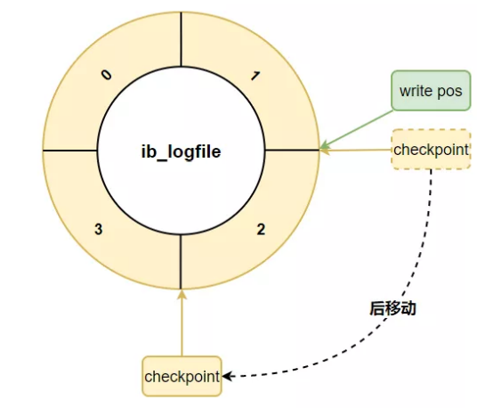


### 1.9 redo log 小结

​		相信大家都知道 redo log 的作用和它的刷盘时机、存储形式了。**InnoDB 的更新操作采用的是 `Write Ahead Log（优先日志持久化）`策略，即先写日志，再写入磁盘**。

|                      redo 与 undo 流程                       |
| :----------------------------------------------------------: |
| 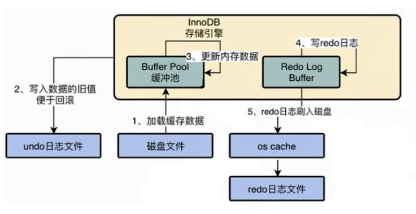 |


## 二、Undo日志

> ​		==redo log是事务持久性的保证，undo log是事务原子性的保证==。在事务中 `更新数据` 的 `前置操作` 其实是要先写入一个 `undo log` 。


### 2.1 如何理解Undo日志

​		事务需要保证**原子性**，也就是事务中的操作要么全部完成，要么什么也不做。但有时候事务执行到一半会出现一些异常情况，导致事务的失败。比如：

- 情况一：事务执行过程中可能遇到各种错误，比如**服务器本身的错误**， 操作系统错误 ，甚至是突然断电导致的错误。
- 情况二：程序员可以在事务执行过程中**手动输入 ROLLBACK 语句**结束当前事务的执行。

​		以上情况出现，我们需要把数据改回原先的样子，这个过程称之为**回滚**，这样就可以造成一个假象：这个事务<u>看起来什么都没做（逻辑上的什么都没做，物理上是做了）</u>，所以符合**原子性**要求。

​		每当我们要对一条记录做改动时（这里的改动可以指 INSERT、DELETE、UPDATE，不包括 SELECT），都需要"留一手"——即把回滚时所需的东西记下来。比如：

- **<font color="green">插入</font>**一条记录时，至少要把这条记录的**主键值**记下来，之后回滚的时候只需要把这个主键值对应的记录删除掉就好了。(对于每个INSERT，InnoDB 存储引擎会执行一个相反的DELETE）
- **<font color="green">删除</font>**一条记录时，至少要把**这条记录的所有内容**都记下来，这样之后回滚时再把由这些内容组成的记录插入到表中就好了。（对于每个DELETE，InnoDB 存储引擎会执行一个相反的 INSERT）
- **<font color="green">修改</font>**一条记录时，至少要把修改**这条记录前的旧值**都记录下来，这样之后回滚时再把这条记录更新为旧值就好了。（对于每个UPDATE，InnoDB 存储引擎会执行一个相反的 UPDATE，将修改前的旧值又更新回去）

> ​		MySQL 把这些为了便于回滚而记录的内容称之为 **回滚日志**（即 undo log）。注意，由于查询操作 (SELECT) 并不会修改任何用户记录，所以在<u>查询操作执行时，并不需要记录相应的 undo 日志</u>。此外，==undo log 也会产生 redo log==，这是**<font color="blue">因为 undo log 也需要持久性的保护</font>**。


### 2.2 Undo日志的作用

- **<font color="red">回滚数据</font>**：用户对 undo 日志可能有**误解**：认为 undo 日志是将数据库物理地恢复到执行语句或事务之前的样子。但事实并非如此。undo 是**<font color="purple">逻辑日志</font>**，因此只是将数据库 `逻辑` 地恢复到原来的样子。所有修改都被逻辑地取消了，但是**数据结构和页本身在回滚之后可能大不相同**。这是因为在多用户并发系统中，可能会有数十、数百甚至数千个并发事务。数据库的主要任务就是协调对数据记录的并发访问。比如，一个事务在修改当前一个页中某几条记录，同时还有别的事务在对同一个页中另几条记录进行修改。因此，**不能将一个页回滚到事务开始的样子，因为这样会影响其他事务正在进行的工作**。

- **<font color="red">MVCC</font>**：undo 的另一个作用是 `MVCC`（多版本并发控制），即在 InnoDB 存储引擎中， MVCC 的实现是通过 undo 来完成。当用户读取一行记录时，若该记录已经被其他事务占用，当前事务可以通过 undo 读取之前的行版本信息，以此实现非锁定读取。


### 2.3 undo的存储结构

#### 1）回滚段与undo页

​		InnoDB对undo log的管理采用**段**的方式，也就是 `回滚段（rollback segment）` 。每个回滚段记录了 `1024` 个 `undo log segment` ，而在每个undo log segment段中进行 `undo页` 的申请。

* 在` InnoDB1.1版本之前` （不包括1.1版本），只有**1个rollback segment**，因此支持同时在线的事务限制为 `1024` 。虽然对绝大多数的应用来说都已经够用。 
* 从1.1版本开始，InnoDB支持最大 **128个rollback segment** ，故其支持同时在线的事务限制提高到了 `128*1024` 。

```mysql
mysql> show variables like 'innodb_undo_logs';
+------------------+-------+
| Variable_name    | Value |
+------------------+-------+
| innodb_undo_logs | 128   |
+------------------+-------+
```

​		虽然 InnoDB 1.1 版本支持了 128 个 rollback segment，但是这些 rollback segment 都存储于**共享表空间** `ibdata` 中。从 InnoDB1.2 版本开始，可通过参数对 rollback segment 做进一步的设置。这些参数包括：

- **innodb_undo_directory**：设置 rollback segment 文件所在的**路径**。这意味着 rollback segment 可以存放在共享表空间以外的位置，即可以设置为<u>独立表空间</u>。该参数的默认值为 “./”，表示当前 InnoDB 存储引擎的目录。
- **innodb_undo_logs**：设置 rollback segment 的**个数**，默认值为 128。在 InnoDB 1.2 版本中，该参数用来替换之前版本的参数innodb_rollback_segments。
- **innodb_undo_tablespaces**：设置构成 rollback segment 文件的**数量**，这样 rollback segment 可以较为平均地分布在多个文件中。设置该参数后，会在路径 innodb_undo_directory 看到 undo 为前缀的文件，该文件就代表 rollback segment 文件。

> 注意：undo log 相关参数一般很少改动。


- **undo 页的重用**：

​		当我们开启一个事务需要写 undo log 的时候，就得先去 undo log segment 中去找到一个空闲的位置，当有空位的时候，就去申请 undo页，在这个申请到的 undo 页中进行 undo log 的写入。我们知道 MySQL 默认一页的大小是 16k。

​		为每一个事务分配一个页，是非常浪费的（除非你的事务非常大），假设你的应用的 `TPS`（每秒处理的事务数目）为1000，那么 1s 就需要 1000 个页，大概需要 16M 的存储，1 分钟大概需要 1G 的存储。如果照这样下去除非 MySQL 清理的非常勤快，否则随着时间的推移，磁盘空间会增长的非常快，而且很多空间都是浪费的。

​		于是 undo 页就被设计的可以**重用**了，当事务提交时，并不会立刻删除 undo 页。**因为重用，所以这个 undo 页可能混杂着其他事务的undo log**。undo log 在 commit 后，会被放到一个**链表**中，然后判断 undo 页的使用空间是否**小于 3/4**，如果小于 3/4 的话，则表示当前的 undo 页 可以被重用，那么它就不会被回收，其他事务的 undo log 可以记录在当前 undo 页的后面。**由于 undo log 是离散的，所以清理对应的磁盘空间时，效率不高**。


#### 2）回滚段与事务

1. 每个事务只会使用一个`回滚段`，**一个回滚段在同一时刻可能会服务于多个事务**。

2. 当一个事务开始的时候，会指定一个回滚段，在事务进行的过程中，当数据被修改时，原始的数据会被复制到回滚段。

3. 在回滚段中，事务会不断填充盘区，直到事务结束或所有的空间被用完。如果当前的盘区不够用，事务会在段中请求扩展下一个盘区，如果所有已分配的盘区都被用完，事务会覆盖最初的盘 区或者在回滚段允许的情况下扩展新的盘区来使用。

4. 回滚段存在于undo表空间中，在数据库中可以存在多个undo表空间，但**同一时刻只能使用一个undo表空间**。

   ```mysql
   mysql> show variables like 'innodb_undo_tablespaces';
   +-------------------------+-------+
   | Variable_name           | Value |
   +-------------------------+-------+
   | innodb_undo_tablespaces | 2     |
   +-------------------------+-------+
   # undo log的数量，最少为2. undo log的truncate操作由purge协调线程发起。在truncate某个undo log表空间的过程中，保证有一个可用的undo log可用。
   ```

5. 当事务提交时，InnoDB存储引擎会做以下两件事情：

   + 将undo log放入列表中，以供之后的purge操作 
   + 判断undo log所在的页是否可以重用，若可以重用，就可以分配给下个事务使用


#### 3）回滚段中的数据分类

1. `未提交的回滚数据(uncommitted undo information)`：该数据所关联的事务并**未提交**，用于实现读一致性，所以该数据不能被其他事务的数据覆盖。
2. `已经提交但未过期的回滚数据(committed undo information)`：该数据关联的事务**已经提交**，但是仍在`undo retention`参数所设置的时间以内。
3. `事务已经提交并过期的数据(expired undo information)`：事务已经提交，而且数据保存时间已经超过 undo retention参数指定的时间，属于已经过期的数据。当回滚段满了之后，就**优先覆盖“事务已经提交并过期的数据"**。


> ​		事务提交后不能马上删除undo log及undo log所在的页。这是因为可能还有其他事务需要通过undo log来得到行记录**之前的版本**，如果马上删除了，兴许又会被其它的事务使用，这个时候就无法将回滚数据重新写入了。
>
> ​		故事务提交时将undo log放入一个**链表**中，是否可以最终删除undo log以undo log所在页由purge线程来判断。


### 2.4 undo的类型

在InnoDB存储引擎中，undo log分为：

* `insert undo log`

  ​		insert undo log是指insert操作中产生的undo log。因为insert操作的记录，只对 **当前事务** 可见，对 **其他事务** 不可见（这是事务隔离性的要求），故该undo log可以在事务提交后直接删除。不需要进行purge操作。

* `update undo log`（包括了delete操作）

  ​		update undo log记录的是对delete和update操作产生的undo log。该undo log可能需要被MVCC机制所使用，因此不能在事务提交时就删除。提交时放入undo log链表，等待purge线程进行最后的删除。即：**对原始数据有变动的操作，undo log及undo log所在的页不能在事务提交之后立马被删除**。


### 2.5 undo log的生命周期

#### 1）简要生命周期

以下是`undo + redo`事务的简化过程

假设有两个数值A和B，它们的初始值分别为 A=1 和 B=2。现在，我们将A修改为3，B修改为4。

```sql
1. start transaction;
2. 记录 A = 1 到 undo log;
3. update A = 3;
4. 记录 A = 3 到 redo log;

5. 记录 B = 2 到 undo log;
6. update B =4;
7. 记录 B = 4 到 redo log;

8. 将 redo log 刷新到磁盘;
9. commit;
```

- 在 `1 ~ 8` 步骤的任意一步系统宕机，事务未提交，该事务就不会对磁盘上的数据做任何影响。
- 如果在 `8 ~ 9` 之间宕机，恢复之后可以选择回滚，也可以选择继续完成事务提交，因为此时 redo log 已经持久化。
- 若在 `9` 之后系统宕机，系统恢复之后，可以根据 redo log 把数据刷回磁盘，但**无法回滚**。

---


**只有Buffer Pool的流程**：

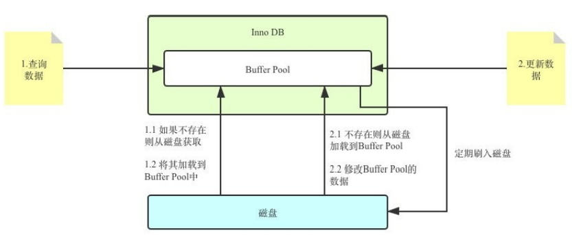


​		在更新Buffer Pool中的数据之前，我们需要先将该数据在**事务开始之前**的旧值写入 Undo Log 中。这样，假设更新到一半出错了，我们就可以通过Undo Log来回滚到事务开始前。


#### 2）详细生命周期

​		对于 InnoDB 引擎来说，每个行记录除了记录本身的数据之外，还有几个**隐藏的列**：

- `DB_ROW_ID`：如果没有为表显式地定义主键，并且表中也没有定义唯一索引，那么 InnoDB 会自动为表添加一个 `row_id` 的隐藏列作为主键。
- `DB_TRX_ID`：每个事务都会分配一个事务 ID，当对某条记录发生变更时，就会将这个事务的事务 ID 写入 `trx_id` 中。
-  `DB_ROLL_PTR`：回滚指针，本质上就是**指向 undo log “历史记录”的指针**。


---


- **当我们执行INSERT时：**

```mysql
begin;
INSERT INTO user (name) VALUES ("tom");
```

​		插入的数据都会生成一条insert undo log，并且数据的**回滚指针**会指向它。undo log会记录undo log的序号、插入主键的列和值...，那么在进行rollback的时候，通过主键直接把对应的数据删除即可。

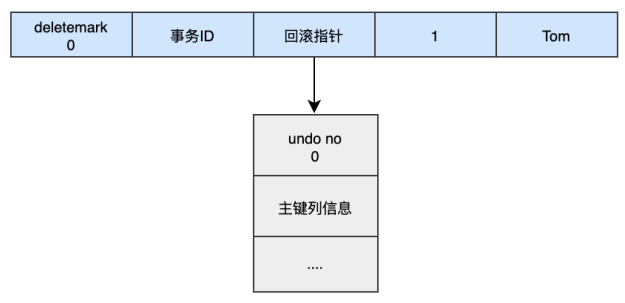

- **当我们执行UPDATE时：**

> ​		对应更新的操作会产生`update undo log`，并且会分为**更新主键**和**不更新主键**的。

**① 不更新主键的**

```mysql
UPDATE user SET name="Sun" WHERE id=1;
```


​		这时会把**旧的记录**写入新的undo log，让回滚指针指向新的undo log，它的undo no是1，并且<u>新的undo log会指向旧的undo log（undo no=0</u>）。


**② 更新主键的**

```mysql
UPDATE user SET id=2 WHERE id=1;
```

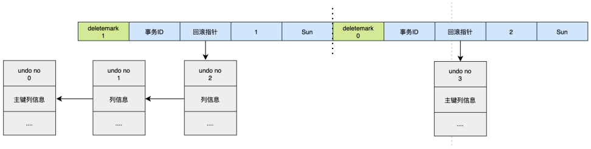

​		对于**更新主键的操作**，会先把原来数据的`deletemark标识`打开，这时并没有真正的删除数据，真正的删除会交给清理线程去判断，然后在后面插入一条新的数据，新的数据也会产生undo log，并且undo log的序号会递增。


> ​		可以发现每次对数据的变更都会产生一个undo log，当一条记录被变更多次时，那么就会产生多条undo log，undo log记录的是变更前的日志，并且每个undo log的序号是递增的，那么当要回滚的时候，按照序号`依次向前推`，就可以找到我们的原始数据了。


#### 3）undo log是如何回滚的

以上面的例子来说，假设执行`rollback`，那么对应的流程应该是这样：

1. 通过undo no=3的日志把id=2的数据删除 
2. 通过undo no=2的日志把id=1的数据的deletemark还原成0 
3. 通过undo no=1的日志把id=1的数据的name还原成Tom 
4. 通过undo no=0的日志把id=1的数据删除


#### 4）undo log的删除

* 针对于`insert undo log`

  ​		因为insert操作的记录，只对事务本身可见，对其他事务不可见。故该undo log可以在事务提交后直接删除，不需要进行purge操作。

* 针对于`update undo log`

  ​		该undo log可能需要提供MVCC机制，因此不能在事务提交时就进行删除。提交时放入undo log链表，等待purge线程进行最后的删除。

> 补充：
>
> ​		purge线程两个主要作用是：`清理undo页`和`清理page里面带有Delete_Bit标识的数据行`。在InnoDB中，事务中的Delete操作实际上并不是真正的删除掉数据行，而是一种Delete Mark操作，在记录上标识Delete_Bit，而不删除记录。是一种“假删除”，只是做了个标记，真正的删除工作需要后台purge线程去完成。


### 2.6 小结


- **undo log是==逻辑日志==，对事务回滚时，只是将数据库逻辑地恢复到原来的样子**。是看起来啥都没变，但实质上，在物理存储方面，是有变化的。

- **redo log是==物理日志==，记录的是数据页的物理变化，undo log不是redo log的逆过程**。

