# 第15章 锁

[锁](https://blog.csdn.net/weixin_43004044/article/details/126859670?spm=1001.2014.3001.5502)

[深入理解MySQL的四种隔离级别及加锁实现原理-----mysql 隔离级别实现原理](https://blog.51cto.com/u_15265854/2891760)

## 一、概述

​		**锁**是计算机协调多个进程或线程**并发访问某一资源**的机制。在程序开发中会存在多线程同步的问题，当多个线程并发访问某个数据的时候，尤其是针对一些敏感的数据（比如订单、金额等)，我们就需要保证这个数据在任何时刻**最多只有一个线程**在访问，==保证数据的**完整性**和**一致性**==。在开发过程中加锁是为了保证数据的一致性，这个思想在数据库领域中同样很重要。

​		在数据库中，除传统的计算资源（如 CPU、RAM、I/O 等）的争用以外，**数据**也是一种供许多用户共享的资源。为保证数据的一致性，需要对并发操作进行控制，因此产生了锁 。同时**锁机制**也为实现 MySQL 的各个隔离级别提供了保证。**锁冲突**也是影响数据库**并发访问性能**的一个重要因素。所以锁对数据库而言显得尤其重要，也更加复杂。


## 二、MySQL并发事务访问相同记录

并发事务访问相同记录的情况大致可以划分为3种：

### 2.1 读-读情况

​		==读-读==情况。即并发事务相继`读取相同的记录`。

​		读取操作本身不会对记录有任何影响，并不会引起什么问题，所以允许这种情况的发生。


### 2.2 写-写情况

​		==写-写== 情况。即并发事务相继对相同的记录做出改动。

​		<font style="background-color: #73cf60">在这种情况下会发生 **脏写** 的问题，任何一种隔离级别都不允许这种问题的发生</font>。所以在多个未提交事务相继对**同一条记录**做改动时，需要让它们 `排队执行` ，这个排队的过程其实是通过 `锁` 来实现的。这个所谓的锁其实是一个内存中的结构 ，在事务执行前本来是没有锁的，也就是说一开始是没有 **锁结构** 和 **记录** 进行关联的，如图所示：


​		当一个事务想对这条记录做改动时，首先会看看内存中有没有与这条记录关联的 `锁结构` ，当没有的时候就会在内存中生成一个 `锁结构` 与之关联。比如，事务` T1` 要对这条记录做改动，就需要生成一个 `锁结构` 与之关联：


在`锁结构`里有很多信息，为了简化理解，只把两个比较重要的属性拿了出来：

* `trx信息`：代表这个锁结构是哪个事务生成的。
* `is_waiting`：代表当前事务是否在等待。
  * is_waiting为false：在事务`T1`改动了这条记录后，就生成了一个`锁结构`与该记录关联，因为之前没有别的事务为这条记录加锁，所以`is_waiting`属性就是`false`，我们把这个场景就称之为`获取锁成功`，或者`加锁成功`，然后就可以继续执行操作了。
  * is_waiting为true：在事务`T1`提交之前，另一个事务`T2`也想对该记录做改动，那么先看看有没有`锁结构`与这条记录关联，发现有一个`锁结构`与之关联后，然后也生成了一个锁结构与这条记录关联，不过锁结构的`is_waiting`属性值为`true`，表示当前事务需要等待，我们把这个场景就称之为`获取锁失败`，或者`加锁失败`，图示：

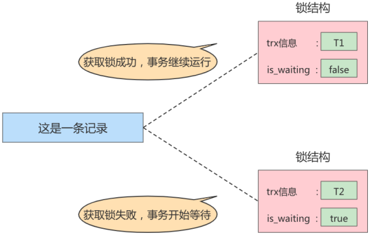

​		在事务T1提交之后，就会把该事务生成的`锁结构释放`掉，然后看看还有没有别的事务在等待获取锁，发现了事务T2还在等待获取锁，所以把事务T2对应的锁结构的`is_waiting`属性设置为`false`，然后把该事务对应的线程唤醒，让它继续执行，此时事务T2就算获取到锁了。效果就是这样。


小结几种说法：

* **不加锁**

  意思就是不需要（没有）在内存中生成对应的 `锁结构` ，可以直接执行操作。

* **获取锁成功，或者加锁成功**

  意思就是在内存中生成了对应的 `锁结构` ，而且锁结构的 `is_waiting` 属性为 `false` ，也就是事务可以继续执行操作。

* **获取锁失败，或者加锁失败，或者没有获取到锁**

  意思就是在内存中生成了对应的 `锁结构` ，不过锁结构的 `is_waiting` 属性为 `true` ，也就是事务需要等待，不可以继续执行操作。


### 2.3 读-写 或 写-读情况

​		==读-写== 或 ==写-读==，即一个事务进行读取操作，另一个进行修改操作。

​		<font style="background-color: #73cf60">这种情况下可能发生 **脏读 、 不可重复读 、 幻读** 的问题</font>。

> ​		不同的数据库厂商对 `SQL标准` 的实现可能不一样。比如MySQL在 `REPEATABLE READ` 隔离级别上就已经解决了 `幻读` 问题。


​		怎么解决 **脏读 、 不可重复读 、 幻读** 这些问题呢？其实有两种可选的解决方案：

* <font color="blue">方案一</font>：**`读操作`利用多版本并发控制（ `MVCC` ），`写操作`进行 `加锁`** 。

​		所谓的 `MVCC`，就是生成一个 `ReadView`，通过 ReadView 找到符合条件的记录版本（历史版本的数据由 undo 日志保存）。**查询语句只能读到在 ReadView 规则中所限定的数据**；而**写操作**肯定针对的是当前**最新版本的记录**，所以需要借助**锁操作**来实现。

​		但值得一提的是：==`读记录的历史版本`和`写记录的最新版本`之间并不会发生冲突，也就是采用 MVCC 时，**读-写**操作并不冲突==。

> ​		普通的SELECT语句在READ COMMITTED和REPEATABLE READ隔离级别下会使用到MVCC读取记录。另外两个隔离级别没必要使用MVCC，在MVCC章节中做了解释。
>
> * 在 `READ COMMITTED` 隔离级别下，一个事务在执行过程中每次执行SELECT操作时都会生成一 个ReadView，ReadView的存在本身就保证了 **事务不可以读取到未提交的事务（活跃事务）所做的更改** ，也就是避免了<u>脏读</u>现象；
> * 在 `REPEATABLE READ` 隔离级别下，一个事务在执行过程中只有 **第一次执行SELECT操作时** 才会生成一个ReadView，之后的SELECT操作都 **复用** 这个ReadView，这样也就避免了<u>不可重复读</u>和<u>幻读</u>的问题。

* <font color="blue">方案二</font>：`读、写操作`都采用 `加锁` 的方式。

​		如果我们的一些业务场景不允许读取记录的<u>旧版本</u>（ReadView），而是每次都必须去**读取记录的最新版本**。比如，在银行存款的事务中，你需要先把账户的余额读出来，然后将其加上本次存款的数额，最后再写到数据库中。在将账户余额读取出来后，就不想让别的事务再访问该余额，直到本次存款事务执行完成，其他事务才可以访问账户的余额。<u>这样在读取记录的时候就需要对其进行加锁操作，这样也就意味着读操作和写操作也像写-写操作那样排队执行</u>。

​		**脏读**的产生是因为当前事务读取了另一个未提交事务写的一条记录，如果另一个事务在写记录的时候就给这条记录加锁，那么当前事务就无法继续读取该记录了，所以也就不会有脏读问题的产生了。

​		**不可重复读**的产生是因为当前事务先读取一条记录，另外一个事务对<u>该记录</u>做了改动（==修改、删除==）之后并提交之后，当前事务再次读取时会获得不同的值，如果在当前事务读取记录时就给该记录加锁，那么另一个事务就无法修改该记录，自然也不会发生不可重复读了。

​		**幻读**问题的产生是因为当前事务读取了一个范围的记录，然后另外的事务向<u>该范围内</u>==插入（强调不可重复读的**新增**操作）==了新记录，当前事务再次读取该范围的记录时发现了新插入的新记录。采用加锁的方式解决幻读问题就有一些麻烦，因为当前事务在第一次读取记录时幻影记录并不存在，所以读取的时候加锁就有点尴尬（因为你并不知道给谁加锁）。


### 2.4 小结

* 采用 `MVCC` 方式的话， **读-写** 操作彼此并不冲突， 性能更高。
* 采用 `加锁` 方式的话， **读-写** 操作彼此需要 `排队执行` ，影响性能。

    > ​		一般情况下我们当然愿意采用 `MVCC` 来解决 `读-写` 操作并发执行的问题，但是业务在某些特殊的情况下，要求必须采用 `加锁 `的方式执行。下面就讲解下MySQL中不同类别的锁。


## 三、锁的不同角度分类

锁的分类图，如下：


### 3.1 从数据操作的类型划分：读锁、写锁

> ​		数据库中**并发事务**中的`读-读`情况并不会引起什么问题。但对于`写-写`、`读-写`或`写-读`这些情况可能会引起一些问题，这时候，可以使用 `MVCC` 或者`加锁`的方式来解决。
>
> ​		在使用**加锁**的方式解决问题时，由于既要允许`读-读`情况不受影响，又要使`写-写`、`读-写`或`写-读`情况中的操作相互阻塞，所以 MySQL 使用了两种类型的锁组成的`锁系统`来解决。这两种类型的锁通常被称为**共享锁 (Shared Lock, S Lock)** 和**排他锁 (Exclusive Lock, X Lock)**，也叫**读锁 (readlock)** 和**写锁 (write lock)**。

* `读锁` ：也称为 `共享锁` 、英文用 S 表示。针对同一份数据，多个事务的读操作可以同时进行而不会互相影响，相互不阻塞的。

* `写锁` ：也称为 `排他锁` 、英文用 X 表示。当前写操作没有完成前，它会阻断其他写锁和读锁。这样 就能确保在给定的时间里，只有一个事务能执行写入，并防止其他用户读取正在写入的同一资源。

  ​	**需要注意的是：对于 InnoDB 引擎来说，读锁和写锁可以加在表上，也可以加在行上。而对于 MyISAM 引擎来说，只能加在表上**。（InnoDB引擎有行锁也有表锁；MyISAM引擎只有表锁）
  
  

​		举例（<font color="blue">行级读写锁的并发场景</font>）：如果一个事务 T1 已经获得了某个行 r 的读锁，那么此时另外的一个事务 T2 是可以去获得这个行 r 的读锁的，因为读取操作并没有改变行 r 的数据；但是，如果某个事务 T3 想获得行 r 的写锁，则它必须等待事务 T1、T2 释放掉行 r 上的读锁才行。

---


#### 1）DQL操作时的锁

​		在采用`加锁`方式解决`脏读`、`不可重复读`、`幻读`这些问题时，针对于《读取一条记录时获取的是该记录的`S锁`》这句话来说，其实是不严谨的！因为有时候**在读取记录时就得获取记录的**`X锁`，从而禁止别的事务**读写**该记录。

​		为此MySQL提出了两种比较特殊的`SELECT`语句格式：

##### ① 读取记录时加`S锁`

​		在普通的 SELECT 语句后边加 `LOCK IN SHARE MODE`。如果当前事务执行了该语句，那么它会为读取到的记录加 S 锁。<font color="green">加锁之后，允许别的事务继续获取这些记录的 S 锁，但是不能获取这些记录的 X 锁</font>。**如果别的事务想要获取这些记录的 X 锁，那么它们会阻塞，直到当前事务提交之后将这些记录上的 S 锁释放掉**。


**语法规则**：

```mysql
SELECT ... LOCK IN SHARE MODE;
# 或
SELECT ... FOR SHARE; # (8.0 新增语法)
```


##### ② 读取记录时加`X锁`

​		在普通的 SELECT 语句后边加 `for update`。如果当前事务执行了该语句，那么它会为读取到的记录加 X锁。<font color="green">加锁之后，不允许别的事务继续获取这些记录的 S 锁，也不允许获取这些记录的 X 锁</font>。

​		如果当前事务执行了该语句但获取不到锁，在 5.7 及之前的版本，会一直等待，直到 `innodb_lock_wait_timeout` 超时。在 8.0 版本中，通过在 SELECT … FOR UPDATE, SELECT … FOR SHARE 后面添加 `NOWAIT`、`SKIP LOCKED` 可设置为**<font color="blue">跳过锁等待</font>**或者**<font color="blue">跳过锁定的记录读取未锁定的记录</font>**。

- `NOWAIT`：如果被查询的行已经加锁，会**立即报错返回**；
- `SKIP LOCKED`：如果被查询的行已经加锁，只返回结果中没有被锁定的其它行；


**语法规则**：

```mysql
SELECT ... FOR UPDATE;

SELECT ... FOR UPDATE [NOWAIT];

SELECT ... FOR UPDATE [SKIP LOCKED];
```

---


​		举例（如果当前查询的**行**已经加锁）：

```mysql
# session 1
mysql> begin;
mysql> select * from t1 where c1 = 2 for update;
+------+-------+
| c1   | c2l   |
+--—---+-------+
| 2    | 60530 |
| 2    | 24678 |
+------+-—-----+
2 rows in set ( 0.00 sec)

# session 2
mysql> select * from t1 where c1 = 2 for update nowait;
ERROR 3572 (HY000): Statement aborted because lock(s) could not be acquired immediately and NOWAIT is set.
mysql> select * from t1 where c1 = 2 for update skip locked;
Empty set (0.00 sec)
```


#### 2）DML操作时的锁

> ​		**delete与update操作会被自动加 X 锁，insert只能被加上隐式锁**。可以理解为：insert操作是无中生有，只有当前事务知道，但提供隐式锁是为了避免其它事务同时访问它的巧合。delete与update是在原来有的基础上进行操作，需要控制修改的事务不被同时进行。

---


平常所用到的**写操作**无非是 DELETE、UPDATE、INSERT 这三种：

- `DELETE`：对一条记录做 DELETE 操作的过程其实是先在`B+`树中定位到这条记录的位置，然后获取这条记录的`X锁`，再执行`delete mark`操作。
- `UPDATE`：在对一条记录做UPDATE操作时分为三种情况：
  - 情况 1：**未修改该记录的键值，并且被更新的列占用的存储空间在修改前后未发生变化**。则先在`B+`树中定位到这条记录的位置，然后再获取一下记录的`X锁`，最后在原记录的位置进行修改操作。
  - 情况 2：**未修改该记录的键值，并且至少有一个被更新的列占用的存储空间在修改前后发生变化**。则先在`B+`树中定位到这条记录的位置，然后获取一下记录的`X锁`，将该记录彻底删除掉（就是把记录彻底移入垃圾链表），最后再插入一条新记录。新插入的记录由`INSERT`操作提供的**<font color="blue">隐式锁</font>**进行保护。
  - 情况 3：**修改该记录的键值**。则相当于在原记录上做`DELECT`操作之后再来一次`INSERT`操作。
- `INSERT`：一般情况下，新插入一条记录的操作并不加锁，但通过一种称之为**<font color="blue">隐式锁</font>**的结构来保护这条新插入的记录在本事务提交前不被别的事务访问。


#### 3）小结

|          |  X 锁  |  S锁   |
| :------: | :----: | :----: |
| **X 锁** | 不兼容 | 不兼容 |
| **S 锁** | 不兼容 | `兼容` |


### 3.2 从数据操作的粒度划分：表级锁、页级锁、行锁

​		为了尽可能提高数据库的并发度，每次锁定的数据范围越小越好，理论上每次只锁定当前操作的数据行的方案会得到最大的并发度，但是管理锁是**很消耗资源**的事情<u>（涉及获取、检查、释放锁等动作）</u>。因此数据库系统需要在`高并发响应`和`系统性能`两方面进行平衡，这样就产生了“**<font color="green">锁粒度 (Lock Granularity)</font>**”的概念。

​		对一条记录加锁影响的也只是这条记录而已，我们就说这个锁的粒度比较细；其实一个事务也可以在**表级别**进行加锁，自然就被称之为**表级锁**或者**表锁**，对一个表加锁影响整个表中的记录，我们就说这个锁的粒度比较**粗**。锁的粒度主要分为**表级锁**、**页级锁**和**行锁**。


#### 1）表锁（Table Lock）

> ​		该锁会锁定整张表，它是 MySQL 中最基本的锁策略，并 **不依赖于存储引擎**，并且表锁是 **开销最少** 的策略。由于表级锁一次会将整个表锁定，所以可以很好的 **避免死锁** 的问题。当然，锁的粒度大所带来最大的负面影响就是出现锁资源争用的概率也会最高，**导致并发率大打折扣**。


##### ① 表级别的S锁、X锁

​		在对某个表执行SELECT、INSERT、DELETE、UPDATE语句时，InnoDB存储引擎是不会为这个表添加表级别的 `S锁` 或者 `X锁` 的。在对某个表执行一些诸如 `ALTER TABLE 、 DROP TABLE` 这类的 DDL 语句时，其他事务对这个表并发执行诸如SELECT、INSERT、DELETE、UPDATE的语句会发生阻塞。同理，某个事务中对某个表执行SELECT、INSERT、DELETE、UPDATE语句时，在其他会话中对这个表执行 `DDL` 语句也会 发生阻塞。这个过程其实是通过在 server层使用一种称之为 **<font color="blue">元数据锁</font>** （英文名： Metadata Locks ， 简称 **MDL** ）结构来实现的。

​		一般情况下，不会使用InnoDB存储引擎提供的**表级别**的 `S锁` 和 `X锁` （因为使用之后，就代表<u>将InnoDB的支持行级锁退化为了表级锁。这意味着直接将优势给干没了~</u>）。而只会在一些特殊情况下，比方说 `崩溃恢复` 过程中用到。比如，在系统变量 `autocommit=0，innodb_table_locks = 1` 时， 手动获取 InnoDB存储引擎提供的表t 的 `S锁` 或者 `X锁` 可以这么写：

* `LOCK TABLES t READ` ：InnoDB存储引擎会对表 t 加表级别的 `S锁 `。

* `LOCK TABLES t WRITE` ：InnoDB存储引擎会对表 t 加表级别的 `X锁` 。

> ​		应当尽量避免在使用InnoDB存储引擎的表上使用 `LOCK TABLES` 这样的手动锁表语句，它们并不会提供什么额外的保护，只是会降低并发能力而已。InnoDB的厉害之处还是实现了更细粒度的 `行锁` ，关于 InnoDB表级别的 `S锁` 和` X锁` 大家了解一下就可以了。

---


**举例**：以`MyISAM`引擎下的表锁为例

###### 1. 创建表并添加数据

```mysql
CREATE TABLE mylock(
    id INT NOT NULL PRIMARY KEY auto_increment,
    NAME VARCHAR(20)
)ENGINE myisam;

# 插入一条数据
INSERT INTO mylock(NAME) VALUES('a');

# 查询表中所有数据
SELECT * FROM mylock;
+----+------+
| id | Name |
+----+------+
| 1  | a    |
+----+------+
```


###### 2. 查看当前表上有锁的表

> ​		`In_use`代表当前表是否正在使用锁。

```mysql
SHOW OPEN TABLES; # 主要关注In_use字段的值
或者
SHOW OPEN TABLES where In_use > 0;
```


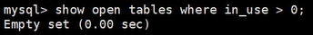

其结果表明，当前数据库中没有被锁定的表。


###### 3. 给表加S锁

我们为mylock表加 `S锁`（**读阻塞写**），观察阻塞的情况，流程如下：

```mysql
LOCK TABLES mylock READ; # 存储引擎会对表t加表级别的共享锁。
```


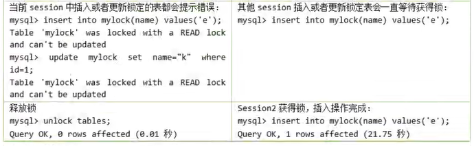


###### 4. 给表加X锁

为mylock表加`X锁`，观察阻塞的情况，流程如下：

```mysql
LOCK TABLES mylock WRITE; # 存储引擎会对表t加表级别的排他锁。
```


###### 5 释放所有表上的表锁

```mysql
UNLOCK TABLES; # 使用此命令解锁当前加锁的表
```

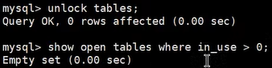


###### 6. 总结

MySQL的表级锁有两种模式：（以MyISAM表进行操作的演示）

* **表共享读锁**（Table Read Lock）

* **表独占写锁**（Table Write Lock）

  | 锁类型 | 自己可读 | 自己可写 | 自己可操作其它表 | 他人可读   | 他人可写   |
  | ------ | -------- | -------- | ---------------- | ---------- | ---------- |
  | 读锁   | 是       | 否       | 否               | 是         | 否，需等待 |
  | 写锁   | 是       | 是       | 否               | 否，需等待 | 否，需等待 |


##### ② 意向锁 （Intention lock）

> ​		InnoDB 支持 <font color="green">多粒度锁（multiple granularity locking）</font> ，它允许 `行级锁` 与 `表级锁` 共存，而`意向锁`就是其中的一种 `表锁` 。
>
> - 意向锁的存在是为了==协调行锁和表锁的关系==，支持多粒度（表锁和行锁）的锁并存
> - 意向锁是一种**不与行级锁冲突的表级锁**，这一点非常重要
> - 表明“**某个事务已经持有了某些行的锁或该事务准备去持有锁**”


意向锁分为两种：

* **意向共享锁**（intention shared lock, IS）：事务有意向的对表中的某些行加**共享锁**（S锁）

  ```mysql
  -- 事务要获取某些行的 S 锁，必须先获得表的 IS 锁。
  SELECT column FROM table ... LOCK IN SHARE MODE;
  ```

* **意向排他锁**（intention exclusive lock, IX）：事务有意向的对表中的某些行加**排他锁**（X锁）

  ```mysql
  -- 事务要获取某些行的 X 锁，必须先获得表的 IX 锁。
  SELECT column FROM table ... FOR UPDATE;
  ```
  
  > ​		意向锁是由存储引擎 **自己维护的** ，用户无法手动操作意向锁，在为<font style="background-color: #73cf60">数据行</font>加<u>共享 / 排他锁</u>之前， InooDB 会先获取该数据行 **所在数据表的对应意向锁** 。


###### 1. 意向锁要解决的问题

​		现在有两个事务，分别是 T1 和 T2，其中 T2 试图在该<u>表级别</u>上应用共享锁或排它锁，如果没有意向锁存在，那么 T2 就需要去检查各个页或行是否存在锁；如果存在意向锁，那么此时就会受到由 T1 控制的表级别意向锁的阻塞。T2 在锁定该表前**不必检查各个页或行锁，而只需检查表上的意向锁**。简单来说就是==给更大一级别的空间示意在表的**行级别**上是否已经上过锁==。

​		在数据表的场景中，如果我们给<u>某一行数据</u>加上了**排它锁**，数据库会自动给更大一级的空间，比如数据页或数据表加上**意向锁**，告诉其他人这个数据页或数据表已经有人上过排它锁了，这样当其他人想要获取<u>数据表排它锁</u>的时候，只需要了解是否有人已经获取了这个数据表的**意向排他锁**即可。

> - 如果事务获得了数据表中`某些记录`的**共享锁**，就会自动在`数据表`上添加**意向共享锁**。
>
> - 如果事务获得了数据表中`某些记录`的**排他锁**，就会自动在`数据表`上添加**意向排他锁**。
>
>   
>
> 这时，==意向锁会告诉其他事务已经有人锁定了表中的某些记录==。


- 谨记

​		意向锁不会与<font color="blue">行级</font>的共享 / 排他锁互斥！正因为如此，**意向锁并不会影响到多个事务对不同<font color="green">数据行</font>加排他锁时的并发性**。（不然直接用普通的表锁就行了）


**举例：**创建表teacher,插入6条数据，事务的隔离级别默认为`Repeatable-Read`，如下所示。

```mysql
CREATE TABLE `teacher` (
	`id` int NOT NULL,
    `name` varchar(255) NOT NULL,
    PRIMARY KEY (`id`)
)ENGINE=InnoDB DEFAULT CHARSET=utf8mb4 COLLATE=utf8mb4_0900_ai_ci;

INSERT INTO `teacher` VALUES
('1', 'zhangsan'),
('2', 'lisi'),
('3', 'wangwu'),
('4', 'zhaoliu'),
('5', 'songhongkang'),
('6', 'leifengyang');
```

```mysql
mysql> SELECT @@transaction_isolation;
+-------------------------+
| @@transaction_isolation |
+-------------------------+
| REPEATABLE-READ         |
+-------------------------+
```

假设事务A获取了某一行的排他锁，并未提交，语句如下所示：

```mysql
BEGIN;

SELECT * FROM teacher WHERE id = 6 FOR UPDATE;
```

事务B想要获取teacher表的表读锁，语句如下：

```mysql
BEGIN;

LOCK TABLES teacher READ;
```

​		

​		因为共享锁与排他锁互斥，所以 事务B 在试图对 teacher<font color="blue">表</font> 加共享锁的时候，必须保证两个条件。

- 当前没有其他事务持有 teacher表 的排他锁

- 当前没有其他事务持有 teacher表 中任意一行的排他锁

    

    ​		为了检测是否满足第二个条件，事务B必须在确保 teacher表不存在任何排他锁的前提下，去检测表中的每一行是否存在排他锁。很明显这是一个效率很差的做法。但是有了意向锁之后，情況就不一样了。

    ​		意向锁是怎么解决这个问题的呢？首先，我们需要知道意向锁之间的兼容互斥性，如下所示。

- **【意向锁之间相互兼容】**

|                 | 意向共享锁 (IS) | 意向排他锁 (IX) |
| :-------------: | :-------------: | :-------------: |
| 意向共享锁 (IS) |      兼容       |      兼容       |
| 意向排他锁 (IX) |      兼容       |      兼容       |


- **【意向锁与行级的 S/X 锁兼容；与表级的 S/X 锁 互斥】**

|                    | 意向共享锁 (IS) | 意向排他锁 (IX) |
| :----------------: | :-------------: | :-------------: |
| **表级**共享锁 (S) |      兼容       |      互斥       |
| **表级**排他锁 (X) |      互斥       |      互斥       |
| **行级**共享锁 (S) |      兼容       |      兼容       |
| **行级**排他锁 (X) |      兼容       |      兼容       |

---


事务A 获取了某一行的排他锁，并未提交：

```mysql
BEGIN;

SELECT * FROM teacher WHERE id = 6 FOR UPDATE;
```

​		此时teacher表存在两把锁：teacher`表上的意向排他锁`与id为6的`数据行上的排他锁`。紧接着，如果事务B想要获取teacher表的共享锁。

```mysql
BEGIN;

LOCK TABLES teacher READ;
```

​		此时事务B检测事务A持有teacher表的意向排他锁，就可以得知事务A当前正持有该表中某些数据行的排他锁，那么事务B对teacher表的加锁请求就会被排斥（阻塞），而**无需去检测表中的每一行数据是否存在排他锁**。

---


###### 2. 意向锁的并发性

​		意向锁不会与 <font color="green">行级的共享 / 排他锁</font>**互斥**！正因为如此，**意向锁并不会影响到多个事务对不同数据行加排他锁时的并发性**。（不然直接用普通的表锁就行了）


​		我们扩展一下上面 teacher表的例子来概括一下意向锁的作用（一条数据从被锁定到被释放的过程中，可能存在多种不同锁，但是这里我们只着重表现意向锁）。

- 事务A先获得了某一行的排他锁，并未提交：

```mysql
BEGIN;

SELECT * FROM teacher WHERE id = 6 FOR UPDATE;
```

- 事务A获取了teacher表上的意向排他锁。事务A获取了id为6的数据行上的排他锁。之后事务B想要获取teacher表上的共享锁。

```mysql
BEGIN;

LOCK TABLES teacher READ;
```

- 事务B检测到事务A持有**teacher表**的意向排他锁。事务B对teacher**表**的加锁请求被阻塞（排斥）。最后事务C也想获取teacher表中**某一行**的排他锁。

````mysql
BEGIN;

SELECT * FROM teacher WHERE id = 5 FOR UPDATE;
````

- 事务C申请teacher表的意向排他锁。事务C检测到事务A持有teacher表的意向排他锁。因为意向锁之间并不互斥，所以事务C获取到了teacher表的意向排他锁。因为id为5的数据行上不存在任何排他锁，最终事务C成功获取到了该数据行上的排他锁。


###### 3. 总结

- `InnoDB` 支持 **多粒度锁** ，在特定场景下，行级锁可以与表级锁共存。 其实也就是说：<font color="blue">行级别的X，S锁</font>不会与<font color="blue">表级别的意向锁</font>发生冲突。

- 意向锁之间互不排斥。但除了 IS 与表级别的 S 兼容外， **意向锁会与其它<font color="blue">表级别</font>的 共享锁 / 排他锁 互斥** 。 而不会和**<font color="blue">行级别</font>**的X，S锁发生冲突。

- 意向锁在保证并发性的前提下，实现了 **行锁和表锁共存** 且 **满足事务隔离性** 的要求。


> ​		总而言之，意向锁的设计目的，只是为了**加速上层资源检查下层资源是否有被占用**，**其本身并不能增加并发度**。


##### ③ 自增锁（AUTO-INC锁）

在使用MySQL的过程中，我们可以为表的某个列添加 `AUTO_INCREMENT` 属性。

**举例**：

```mysql
CREATE TABLE `teacher` (
    `id` int NOT NULL AUTO_INCREMENT,
    `name` varchar(255) NOT NULL,
    PRIMARY KEY (`id`)
) ENGINE=InnoDB DEFAULT CHARSET=utf8mb4 COLLATE=utf8mb4_0900_ai_ci;
```

​		由于这个表的id字段声明了AUTO_INCREMENT，意味着在书写插入语句时不需要为其赋值，SQL语句修改如下所示。

```mysql
INSERT INTO `teacher` (name) VALUES ('zhangsan'), ('lisi');
```

​		上边的插入语句并没有为id列显式赋值，所以系统会自动为它赋上递增的值，结果如下所示。

```mysql
mysql> select * from teacher;
+----+----------+
| id | name     |
+----+----------+
| 1  | zhangsan |
| 2  | lisi     |
+----+----------+
2 rows in set (0.00 sec)
```

​		现在我们看到的上面插入数据的方式是一种**简单插入模式**，所有插入数据的方式总共分为三类，分别是 “ `Simple inserts` ”，“ `Bulk inserts` ”和“ `Mixed-mode inserts `”。


###### 1. Simple Inserts （简单插入）

​		可以 **预先确定要插入的行数** 的语句。包括没有嵌套子查询的单行和多行` INSERT...VALUES() `和 `REPLACE` 语句。可以理解为：数据是显示插入的，不是借助SQL查出来的。


###### 2. Bulk Inserts （批量插入）

​		**事先不知道要插入的行数** ，即不知道所需自动递增值的阈值的语句。比如 `INSERT ... SELECT` ， `REPLACE ... SELECT` 和 `LOAD DATA INFILE` 这种不包括纯INSERT的插入操作。 InnoDB在每处理一行的时候，都会为`AUTO_INCREMENT`列分配一个新的自增值。


###### 3. Mixed-mode Inserts（混合模式插入）

​		其中一种类型的混合模式插入，本质上是“Simple Inserts”，但是只指定了**部分**新插入的数据行的自动递增值。例如 `INSERT INTO teacher (id,name) VALUES (1,'a'), (NULL,'b'), (5,'c'), (NULL,'d');` 只是指定了部分id的值。

```mysql
create table lock_test1(
	id int auto_increment unique key,
	name varchar(20)
);

INSERT INTO lock_test1(id,name) VALUES (1,'a'), (NULL,'b'), (5,'c'), (NULL,'d');

mysql> select * from lock_test1;
+----+------+
| id | name |
+----+------+
|  1 | a    |
|  2 | b    |
|  5 | c    |
|  6 | d    |
+----+------+
4 rows in set (0.00 sec)
```


​		另一种类型的“混合模式插入”诸如： `INSERT ... ON DUPLICATE KEY UPDATE` 。

---


​		对于上面数据插入的案例，MySQL 中采用了自增锁的方式来实现，**AUTO-INC 锁**是当向使用含有 AUTO_INCREMENT 列的表中插入数据时需要获取的**一种特殊的<font color="blue">表级锁</font>**。在执行插入语句时就在`表`上加一个 AUTO-INC 锁，然后为每条待插入记录的 AUTO_INCREMENT 修饰的列分配`递增的值`，在该语句执行结束后，再把 AUTO-INC 锁释放掉。<u>一个事务在持有 AUTO-INC 锁的过程中，其他事务的插入语句都要被阻塞</u>，可以**保证一个语句中分配的递增值是连续的**。也正因为此，其并发性显然不高。

​		当我们向一个有 AUTO_INCREMENT 关键字的主键插入值的时候，每条语句都要对这个**表锁**进行竞争，这样的并发潜力其实是很低下的。所以 InnoDB 通过 `innodb_autoinc_lock_mode` 的不同取值来提供不同的锁定机制，来显著提高 SQL 语句的可伸缩性和性能。


###### 4. innodb_autoinc_lock_mode的取值

（1）`innodb_autoinc_lock_mode = 0`(“<font style="background-color: #73cf60">传统</font>”锁定模式)

​		在此锁定模式下，所有类型的insert语句都会获得一个特殊的表级AUTO-INC锁，用于插入具有 AUTO_INCREMENT列的表。这种模式其实就如我们上面的例子，即**每当执行insert的时候，都会得到一个 表级锁(AUTO-INC锁)，使得语句中生成的auto_increment为顺序的**，且在binlog中重放的时候，可以保证 master 与slave中数据的 auto_increment 是相同的。因为是表级锁，当同一时间内有多个事务执行insert的时候，对于AUTO-INC锁的争夺会 **限制并发能力**。


（2）`innodb_autoinc_lock_mode = 1`(“<font style="background-color: #73cf60">连续</font>”锁定模式)

​		在 `MySQL 8.0 之前`，连续锁定模式是<u>默认</u>的。

- insert语句在开始时会获得一个表锁`autoinc_lock`，对于==simple insert==在获取到需要增加的ID的量后，autoinc_lock就会被释放，不必等到语句执行结束。但对于==bulk insert==，自增锁会被一直持有直到语句执行结束才会被释放。

- 保证了同一条语句插入的行记录的自增ID是**连续**的。

- 主从复制模式下的表现跟 `传统模式` 一样，但是**性能会有所提高**。


（3）`innodb_autoinc_lock_mode = 2`(“<font style="background-color: #73cf60">交错</font>”锁定模式)

​		从 `MySQL 8.0` 开始，交错锁模式是 <u>默认</u> 设置。

- simple insert语句能保证ID是连续的，但是bulk insert的ID则可能是不连续的，但能保证是递增的。因为多个语句是同时生成自增id（即，**跨语句交叉编号**）。

-  主从复制模式下的同一张表下的同一行id有可能不一样。


##### ④ 元数据锁（MDL锁）

> ​		对于**表结构锁**而言，增删改查都属于<font color="blue">读操作</font>。只有对 **表结构** 进行修改，才被视为<font color="blue">写操作</font>。

​		MySQL5.5引入了`Meta Data Lock`，简称MDL锁。属于**表锁**的范畴。MDL 的作用是：保证读写的正确性。比如，如果一个查询正在遍历一个表中的数据，而执行期间另一个线程对这个 **表结构做变更** ，增加了一列，那么查询线程所拿到的结果跟表结构对不上，肯定是不行的。

​		因此，==**当对表中数据做 增删改查 操作的时候，会加上 `MDL 读锁`；当对 <font color="blue">表结构</font> 做变更操作的时候，会自动加上 `MDL 写锁`**==。

---


**举例：元数据锁的使用场景模拟**

- **会话A：**从表中查询数据

```mysql
mysql> BEGIN;
Query OK, 0 rows affected (0.00 sec)

mysql> SELECT COUNT(1) FROM teacher;
+----------+
| COUNT(1) |
+----------+
| 2        |
+----------+
1 row int set (7.46 sec)
```

- **会话B：**修改表结构，增加新列

```mysql
mysql> BEGIN;
Query OK, 0 rows affected (0.00 sec)
mysql> alter table teacher add age int not null;
```

- **会话C：**查看当前MySQL的进程

```mysql
mysql> show processlist;
```

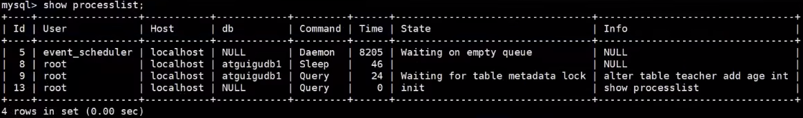

​		通过会话C可以看出**会话B被阻塞**，这是由于会话A拿到了teacher表的元数据读锁，会话B想申请teacher表的元数据写锁，由于读写锁互斥，会话B需要等待会话A释放元数据锁才能执行。


#### 2）InnoDB中的行锁

> ​		行锁（Row Lock）也称为**记录锁**，顾名思义，就是锁住某一行（某条记录 row）。需要注意的是，MySQL服务器层并没有实现行锁机制，**行级锁只在存储引擎层实现**。**<font color="blue">InnoDB是基于索引来实现行锁的</font>**。

**优点：**锁定粒度小，发生 **锁冲突概率低**，可以实现的 **并发度高**。

**缺点：** **行锁的开销比较大**，加锁会比较慢，容易出现 **死锁** 情况。

==InnoDB与MyISAM的最大不同有两点：一是支持事务（TRANSACTION）；二是采用了行级锁==。


------

- 首先我们创建表如下：

```mysql
CREATE TABLE student (
	id INT,
    name VARCHAR(20),
    class VARCHAR(10),
    PRIMARY KEY (id)
) Engine=InnoDB CHARSET=utf8;
```

- 向这个表里插入几条记录：

```mysql
INSERT INTO student VALUES
(1, '张三', '一班'),
(3, '李四', '一班'),
(8, '王五', '二班'),
(15, '赵六', '二班'),
(20, '钱七', '三班');

mysql> SELECT * FROM student;
```

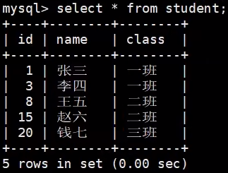

- student表中的聚簇索引的简图如下所示


这里把B+树的索引结构做了超级简化，只把索引中的记录给拿了出来，下面看看都有哪些常用的行锁类型。


##### ① 记录锁（Record Locks）

​		记录锁也就是仅仅锁住一条记录，官方的类型名称为：`LOCK_REC_NOT_GAP`。比如我们把id值为8的那条记录加一个记录锁的示意图如果所示。<u>仅仅是锁住了id值为8的记录，对周围的数据没有影响</u>。


举例如下：

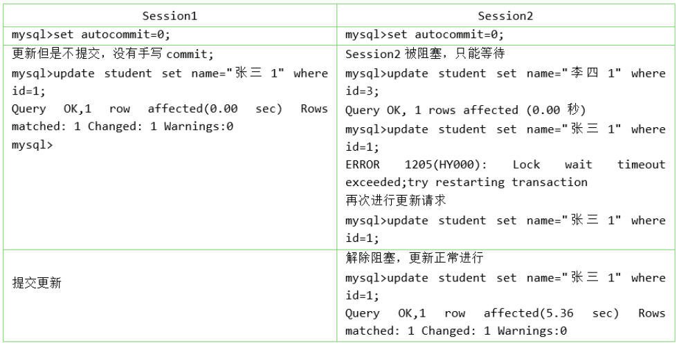

记录锁是有S锁和X锁之分的，称之为 `S型记录锁` 和 `X型记录锁` 。

* 当一个事务获取了一条记录的 <u>S型记录锁</u> 后，其他事务也可以继续获取该记录的S型记录锁，但不可以继续获取X型记录锁；
* 当一个事务获取了一条记录的 <u>X型记录锁</u> 后，其他事务既不可以继续获取该记录的S型记录锁，也不可以继续获取X型记录锁。


##### ② 间隙锁（Gap Locks）

> ​		**`MySQL` 在 `REPEATABLE READ` 隔离级别下是可以解决幻读问题的**。解决方案有两种，可以使用 `MVCC` 方案解决，也可以采用 `加锁 `方案解决。但是在<u>使用加锁方案解决</u>时有个大问题，就是事务在第一次执行读取操作时，那些幻影记录尚不存在，我们无法给这些 `幻影记录` 加上 `记录锁` 。InnoDB提出了一种称之为 `Gap Locks` 的锁，官方的类型名称为：` LOCK_GAP` ，我们可以简称为 `gap锁` 。
>
> > ​		简而言之：**就是给为了解决无法给原本不存在的记录加锁而提出的锁**。==即：记录不存在，但间隙会存在==。


比如，把id值为8的那条记录加一个gap锁的示意图如下。


​		图中id值为8的记录加了gap锁，意味着 **不允许别的事务在id值为8的记录前边的间隙** 插入新记录，其实就是 <font style="background-color: #73cf60">id列的值在 `(3, 8)` 这个**开区间**</font> 内的新记录是不允许立即插入的。

​		比如，有另外一个事务再想插入一条id值为4的新记录，它定位到该条新记录的下一条记录的id值为8，而这条记录上又有一个gap锁，所以就会阻塞插入操作，直到拥有这个gap锁的事务**提交**了之后，id列的值在区间(3, 8)中的新记录才可以被插入。

​		**gap锁的提出  仅仅  是为了防止插入幻影记录而提出的。**虽然有`共享gap锁`和`独占gap锁`这样的说法，但是它们起到的作用是相同的。而且==如果对一条记录加了gap锁（不论是共享gap锁还是独占gap锁），并不会限制其他事务对这条记录加记录锁或者继续加gap锁==。

**举例：**

| Session1                                             | Session2                                     |
| ---------------------------------------------------- | -------------------------------------------- |
| select * from student where id=5 lock in share mode; |                                              |
|                                                      | select * from student where id=5 for update; |

​		这里session2并不会被堵住。因为表里并没有id=5这条记录，因此session1加的是间隙锁(3,8)。而session2也是在这个间隙加的间隙锁。它们有**共同的目标**，即：**保护这个间隙锁，不允许插入值**。但，它们之间是<font color="blue">不冲突</font>的。

​		注意，给一条记录加了 `gap` 锁只是 **不允许** 其他事务往这条记录<font style="background-color: #73cf60">前边的间隙（开区间）</font> ==插入==新记录，那对于最后一条记录之后的间隙，也就是 student 表中 id 值为 20 的记录之后的间隙该怎么呢？也就是说给哪条记录加 gap 锁才能阻止其他事务插入 id 值在 (20, +∞) 这个区间的新记录呢？这时数据页中的**两条伪记录**派上用场了：

|   Infimum 记录    | 表示该页面中最小的记录     |
| :---------------: | -------------------------- |
| **supremum 记录** | **表示该页面中最大的记录** |

​		为了实现阻止其他事务插入的id值在`(20,正无穷)`这个区间的新记录，我们可以给**索引中的最后一条记录**，也就是id值为20的那条记录所在页面的Supremun记录加上一个gap锁，如图所示：

|                   给supremum记录加上gap锁                    |
| :----------------------------------------------------------: |
|  |

- 阻止其它事务在id值为：`(20, +∞)`的区间内插入新记录：

```mysql
mysql> select * from student where id > 20 lock in share mode;
Empty set (0.01 sec)
```

检测：

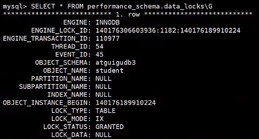

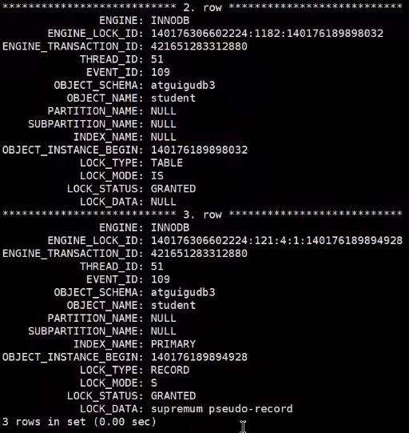


- 间隙锁的引入，可能会导致同样的语句锁住更大的范围（还可能会产生死锁），这其实是**影响了并发度**的。

| Session1                                                     | Session2                                                     |
| ------------------------------------------------------------ | ------------------------------------------------------------ |
| begin;<br />select * from student where id = 5 for update;   | begin; <br />select * from student where id = 5 for update;  |
|                                                              | insert into student values(5, ‘RainLu’, ‘二班’); <br />**此时阻塞** |
| insert into student values(5, ‘RainLu’, ‘二班’); <br />(Error 1213(40001):<br />Deadlock found when trying to get lock; <br />try restarting transaction) |                                                              |

1. session 1 执行 select … for update 语句，由于 id = 5 这一行并不存在，因此会加上间隙锁 (3, 8)；
2. session 2 执行 select … for update 语句，同样会加上间隙锁 (3, 8)，**间隙锁之间不会冲突**，因此这个语句可以执行成功；
3. session 2 试图插入一行 (5, ‘RainLu’, ‘二班’)，被 session 1 的间隙锁挡住了，只好进入等待；
4. **session 1 试图插入一行 (5, ‘RainLu’, ‘二班’)，被 session 2 的间隙锁档住了，至此，两个 session 进入互相等待状态，即产生了==死锁==**。至于 MySQL 对待死锁的策略，后面的第 3.6 节会详细介绍。


##### ③ 临键锁（Next-Key Locks）

​		**有时候我们既想 `锁住某条记录` ，又想阻止其他事务在该记录前边的间隙插入新记录（即：产生一个==半开半闭区间==）** ，所以InnoDB就提出了一种称之为 `Next-Key Locks` 的锁，官方的类型名称为： `LOCK_ORDINARY` ，我们也可以简称为 `next-key锁` 。

​		Next-Key Locks是在存储引擎为 `innodb` 、事务级别在 `可重复读` 的情况下使用的行级锁， innodb默认的锁就是Next-Key locks。

​		比如，我们把id值为8的那条记录加一个next-key锁的示意图如下：

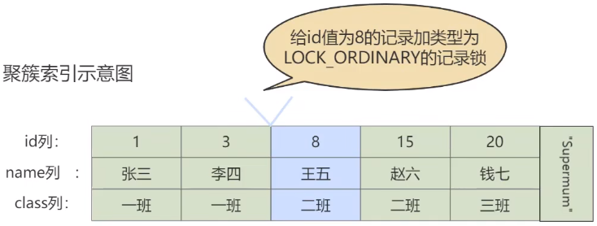

> ​		`next-key锁`的本质就是一个`记录锁`和一个`gap锁`的合体，它**既能保护该条记录，又能阻止别的事务将新记录插入被保护记录前边的`间隙`**。

```mysql
begin;
select * from student where id <=8 and id > 3 for update;
```


##### ④ 插入意向锁（Insert Intention Locks）

​		我们说一个事务在 **插入** 一条记录时需要判断一下插入位置是不是被别的事务加了`gap锁`（`next-key锁`也包含`gap锁`），如果有的话，插入操作需要等待，直到拥有`gap锁`的那个事务提交。但是**InnoDB 规定事务在等待的时候也需要在内存中生成一个锁结构**，表明有事务想在某个`间隙`中`插入`新记录，但是现在在等待。InnoDB 就把这种类型的锁命名为`Insert Intention Locks`，官方的类型名称为：`LOCK_INSERT_INTENTION`，我们称为**插入意向锁**。==插入意向锁是一种`Gap锁`，**不是意向锁**，在insert操作时产生==。

​		插入意向锁是在插入一条记录行前，<font style="background-color: #73cf60">由INSERT 操作产生的一种间隙锁</font>。该锁用以表示**插入意向**，当多个事务在同一区间 (gap) 插入位置不同的多条数据时，事务之间不需要互相等待。假设存在两条值分别为 4 和 7 的记录，两个不同的事务分别试图插入值为 5 和 6 的两条记录，每个事务在获取插入行上独占的（排他）锁前，都会获取 (4, 7)之间的间隙锁，但是因为数据行之间并不冲突，所以两个事务之间并不会产生冲突（阻塞等待）。总结来说，插入意向锁的特性可以分成两部分：
​		① 插入意向锁是一种**特殊的间隙锁**―—间隙锁可以锁定开区间内的部分记录。
​		② 插入意向锁之间**互不排斥**，所以即使多个事务在同一区间插入多条记录，只要**记录本身**（主键、唯一索引）不冲突，那么事务之间就不会出现冲突等待。

> ​		注意：虽然插入意向锁中含有意向锁三个字，**<font color="blue">但是它并不属于意向锁而属于间隙锁</font>**，因为意向锁是**表锁**而插入意向锁是**行锁**。

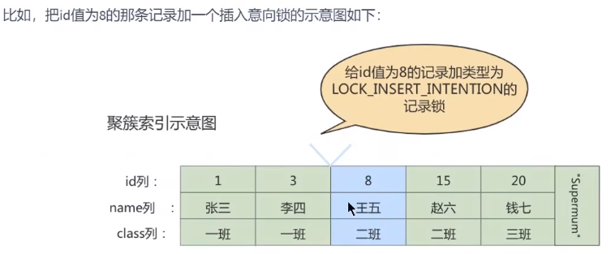

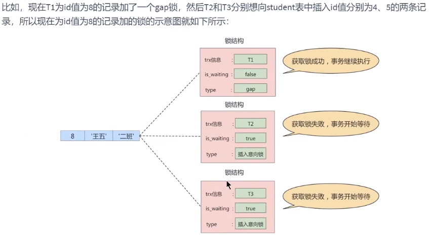

​		从图中可以看到，由于 T1 持有 gap 锁，所以 T2 和 T3 需要生成一个**插入意向锁**的锁结构并且处于等待状态。当 T1 提交后会把它获取到的锁都释放掉，这样 T2 和 T3 就能获取到对应的插入意向锁了（本质上就是把插入意向锁对应锁结构的 is_waiting 属性改为 false），T2 和 T3 之间也并不会相互阻塞，它们可以同时获取到 id 值为 8 的插入意向锁，然后执行插入操作。事实上，**插入意向锁并不会阻止别的事务继续获取该记录上任何类型的锁**。


#### 3）页锁

​		页锁就是在 `页的粒度` 上进行锁定，锁定的数据比行锁要多，因为一个页中可以有多个行记录。但这也就意味着：当我们使用页锁的时候，会出现数据浪费的现象，只不过这样的浪费最多也就是一个页上的数据行。==页锁的开销介于表锁和行锁之间，会出现死锁。锁的粒度介于表锁和行锁之间，并发度一般。被应用于`BDB存储引擎`==。`BDB存储引擎`支持页锁和表锁，默认为页锁。


#### 4）总结

##### ① select ..... for update加锁策略

- 如果查询条件使用的是**索引字段**，那么select ..... for update就会进行<font style="background-color: #73cf60">行锁</font>。理解为：通过索引字段寻找的数据能够精准的定位到那条数据，而不存在错误的命中，则只会对目标查找的数据行加锁。

- 如果查询条件使用的是**普通字段**，那么select ..... for update就会进行<font style="background-color: #73cf60">表锁</font>。理解为：普通字段需要全表检索数据行，这些被检索到的数据行都会被加锁。


##### ② 锁升级

​		每个层级的锁数量是有限制的，因为**锁会占用内存空间**， **锁空间的大小是有限的** 。当`某个层级`的锁数量`超过`了这个层级的**阈值**时，就会进行 **<font color="blue">锁升级</font>** 。<font color="blue">锁升级就是用更大粒度的锁替代多个更小粒度的锁</font>。比如 InnoDB 中行锁升级为表锁，这样做的**好处是占用的锁空间降低了，但坏处是数据的并发度下降了**。


### 3.3 从对待锁的态度划分：乐观锁、悲观锁

​		从对待锁的态度来看锁的话，可以将锁分成乐观锁和悲观锁，从名字中也可以看出这两种锁是两种看待数据并发的**思维方式** 。需要注意的是，==乐观锁和悲观锁并不是锁，而是锁的设计思想==。


#### 1）悲观锁（Pessimistic Locking）

> ​		在**数据库的锁机制**上实现的。

> ​		悲观锁是一种锁的设计思想。顾名思义，就是很悲观，总是认为有数据库事务修改了数据。是通过数据库自身的锁机制来实现的，保证数据操作的排它性。

​		悲观锁总是假设最坏的情况，每次去拿数据的时候都认为别人会修改，所以每次在拿数据的时候都会上锁，这样别人想拿这个数据就会 `阻塞` ，直到成功拿到锁（**共享资源每次只给一个线程使用，其它线程阻塞， 用完后再把资源转让给其它线程**）。比如行锁，表锁等，读锁，写锁等，都是在做操作之前先上锁，当其他线程想要访问数据时，都需要阻塞挂起。例如 Java中的 `synchronized` 和 `ReentrantLock` 等独占锁就是悲观锁思想的实现。


- **秒杀案例1：**

​		商品秒杀过程中，库存数量的减少，避免出现 **<font color="blue">商品超卖</font>** 的情况。比如，商品表中有一个字段为 `quantity` 表示当前该商品的库存量。假设商品为华为 mate40，id 为1001，quantity = 100。如果<u>不使用锁的情况下</u>，操作方法如下所示：

```mysql
# 第 1 步:查出商品库存
select quantity from items where id = 1001;
# 第 2 步:如果库存大于 8，则根据商品信息生产订单
insert into orders (item_id) values(1001);
# 第 3 步:修改商品的库存，num 表示购买数量
update items set quantity = quantity - num where id = 1001;
```


​		这样写的话，在并发量小的公司没有大的问题，但是如果在`高并发环境`下可能出现以下问题：

| 序号 |            线程A             |            线程B             |
| :--: | :--------------------------: | :--------------------------: |
|  1   | step1（查询还有 100 部手机） | step1（查询还有 100 部手机） |
|  2   |                              |      step2（生成订单）       |
|  3   |      step2（生成订单）       |                              |
|  4   |                              |       step3（减库存1）       |
|  5   |       step3（减库存2）       |                              |

​		其中，如果线程 B 此时已经下单并且减完库存，但线程 A 依然去执行 step3，就造成了**超卖**。

​		我们使用悲观锁可以解决这个问题，商品信息从查询出来到修改，中间有一个生成订单的过程，使用悲观锁的原理就是，当我们在查询 `items` 信息后就把当前的数据行锁定，直到我们修改完毕后再解锁。那么整个过程中，因为数据被锁定了，就不会再出现第三者来对其进行修改了。而**这样做的前提是需要将要执行的 SQL 语句放在<font color="blue">同一个事务</font>中，否则达不到锁定数据行的目的**。

- 修改如下：

```mysql
# 第 1 步：查出商品库存。并加锁
select quantity from items where id = 1001 for update;

# 第 2 步：如果库存大于8，则根据商品信息生产订单
insert into orders (item_id) values(1001);

# 第 3 步：修改商品的库存，num 表示购买数量
update items set quantity = quantity - num where id = 1001;
```

​		 `select … for update` 是 MySQL 中的**悲观锁**。此时在 `items` 表中，id 为 1001 的那条数据就被我们锁定了，其他的想要执行 select quantity from items where id = 1001 for update;语句的事务必须等本次事务提交之后才能执行。这样我们可以保证当前的数据不会被其它事务修改。

> ​		注意：当执行 select quantity from items where id = 1001 for update;语句之后，如果在其他事务中执行 select quantity from items where id = 1001;语句（此条语句并没有加上任何锁），并不会受第一个事务的影响，仍然可以正常查询出数据。

> ​		注意：悲观锁不适用的场景较多，它存在一些不足，因为悲观锁大多数情况下依靠数据库的锁机制来实现，以保证程序的并发访问性，同时这样对数据库性能开销影响也很大，特别是`长事务`（执行时间长的事务）而言，这样的开销往往无法承受，这时就需要`乐观锁`。


#### 2）乐观锁（Optimistic Locking）

> ​		在**应用程序**层面上实现的。

​		乐观锁认为对同一数据的并发操作不会发生，属于小概率事件，不用每次都对数据上锁，但是在更新的时候会判断一下在此期间别人有没有去更新这个数据，也就是**不采用数据库自身的锁机制，而是通过程序来实现**。在程序上，我们可以采用 `版本号机制` 或者 `CAS算法` 实现。**乐观锁适用于多读的应用类型， 这样可以提高吞吐量**。在Java中` java.util.concurrent.atomic` 包下的原子变量类就是使用了乐观锁的一种实现方式：CAS实现的。


##### ① 乐观锁的版本号机制

​		在表中设计一个 `版本字段 version` ，第一次读的时候，会获取 version 字段的取值。然后对数据进行更新或删除操作时，会执行 `UPDATE ... SET version=version+1 WHERE version=version` 。此时如果已经有事务对这条数据进行了更改，修改就不会成功。

​		这种方式类似我们熟悉的SVN、CVS版本管理系统，当我们修改了代码进行提交时，首先会检查当前版本号与服务器上的版本号是否一致，如果一致就可以直接提交，如果不一致就需要更新服务器上的最新代码，然后再进行提交。


##### ② 乐观锁的时间戳机制

​		时间戳和版本号机制一样，也是在更新提交的时候，将当前数据的时间戳和更新之前取得的时间戳进行比较，如果两者一致则更新成功，否则就是版本冲突。

​		你能看到乐观锁就是程序员自己控制数据并发操作的权限，基本是通过给数据行增加一个戳（版本号或 者时间戳），从而证明当前拿到的数据是否最新。


- **秒杀案例 2**：
    依然使用上面秒杀的案例，执行流程如下：

```mysql
# 第 1 步:查出商品库存
select quantity from items where id = 1001;

# 第 2 步:如果库存大于0，则根据商品信息生成订单
insert into orders (item_id) values(1001);

# 第 3 步:修改商品的库存，num 表示购买数量
update items set quantity = quantity - num, version = version + 1 where id = 1001 and version = #{version};
```

​		注意，如果数据表是**读写分离**的表，当 matser 表中写入的数据没有及时同步到 slave 表中时，会造成更新一直失败的问题。此时需要**强制读取 master 表**中的数据（即将 select 语句放到事务中即可，这时候查询的就是 master 主库了)。

​		如果我们对同一条数据进行**频繁的修改**的话，那么就会出现这么一种场景：每次修改都只有一个事务能更新成功，在业务感知上就有大量的失败操作。我们把代码修改如下：

```mysql
# 第1 步:查出商品库存
select quantity from items where id = 1001;

# 第 2 步:如果库存大于日，则根据商品信息生产订单
insert into orders (item_id) values(1001);

#### 修改：在进行库存更新的时候，以重新查询的库存为准作为过滤条件
# 第 3 步:修改商品的库存，num 表示购买数量
update items set quantity = quantity - num, version = version + 1 where id = 1001 and quantity - num > 0 and version = #{version};
```

这样就会使每次修改都能成功，而且不会出现`超卖`的现象。


##### ③ CAS算法


#### 3）两种锁的适用场景

从这两种锁的设计思想中，我们总结一下乐观锁和悲观锁的适用场景：

1. `乐观锁` 适合 `读操作多` 的场景，相对来说写的操作比较少。它的优点在于 `程序实现` ， `不存在死锁` 问题，不过适用场景也会相对乐观，因为它阻止不了除了程序以外的数据库操作。（多版本并发控制就是采用的乐观锁思想）
2. `悲观锁` 适合 `写操作多` 的场景，因为写操作具有 `排它性` 。采用悲观锁的方式，可以在数据库层面阻止其他事务对该数据的操作权限，防止 `读 - 写` 和 `写 - 写` 的冲突。

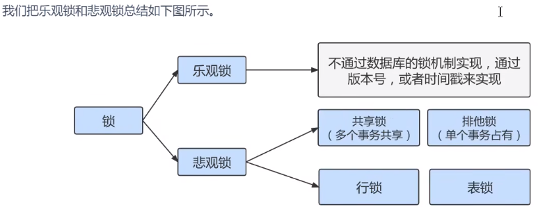


### 3.4 按加锁的方式划分：显式锁、隐式锁

#### 1）隐式锁

​		一个事务在执行 INSERT 操作时，如果即将插入的 **间隙** 已经被其他事务加了 `gap 锁`，那么本次 `INSERT` 操作会阻塞，并且当前事务会在该间隙上加一个**插入意向锁**，否则一般情况下 INSERT 操作是不加锁的。

-  那如果一个事务首先插入了一条记录（此时并没有在内存中生成与该记录关联的锁结构），然后另一个事务：
    - 立即使用 `SELECT … LOCK IN SHARE MODE` 语句==读取==这条记录，也就是要获取这条记录的 `S 锁`，怎么办？如果允许这种情况的发生，那么可能产生**脏读**问题。

    - 立即使用 `SELECT … FOR UPDATE` 语句==修改==这条记录，也就是要获取这条记录的 X 锁，怎么办？如果允许这种情况的发生，那么可能产生**脏写**问题。

      

    这时候我们前边提过的事务 id 又要起作用了。我们把聚簇索引和二级索引中的记录分开看一下：

- **情景一**：对于聚簇索引记录来说，有一个 `trx_id` 隐藏列，该隐藏列记录着最后改动该记录的 `事务 id` 。那么如果在当前事务中新插入一条聚簇索引记录后，该记录的 trx_id 隐藏列代表的的就是 当前事务的 事务id ，如果其他事务此时想对该记录添加 `S锁` 或者 `X锁` 时，首先会看一下该记录的 trx_id 隐藏列代表的事务是否是当前的活跃事务，如果是的话，那么就帮助当前事务创建一个 X 锁 （也就是为当前事务创建一个锁结构， is_waiting 属性是 false ），然后自己进入等待状态 （也就是为自己也创建一个锁结构， is_waiting 属性是 true ）。

- **情景二**：对于二级索引记录来说，本身并没有 trx_id 隐藏列，但是在二级索引页面的 Page Header 部分有一个 `PAGE_MAX_TRX_ID` 属性，该属性代表对该页面做改动的最大的 `事务id` ，如 果 PAGE_MAX_TRX_ID 属性值小于当前最小的活跃事务id ，那么说明对该页面做修改的事务都已 经提交了，否则就需要在页面中定位到对应的二级索引记录，然后回表找到它对应的聚簇索引记录，然后再重复 情景一 的做法。


​		即：一个事务对新插入的记录可以不显示的加锁（生成一个锁结构），但是由于 **事务id** 的存在，相当于加了一个 **隐式锁**。别的事务在对这条记录加`S锁`或者`X锁`时，由于`隐式锁`的存在，会先帮助当前事务生成一个锁结构，然后自己再生成一个锁结构后进入等待状态。==隐式锁是一种 **延迟加锁** 的机制，从而来减少加锁的数量==。

​		实际上，==隐式锁在内存中并不存在锁信息。只有当产生**锁等待**时，隐式锁才会转化为显式锁==。InnoDB的 `INSERT` 操作，对插入的记录不加锁，但是此时如果另一个线程进行当前读，类似以下的用例，session 2 会锁等待 session 1，那么这是如何实现的呢？


**session 1:**

```mysql
mysql> begin;
Query OK, 0 rows affected (0.00 sec)
mysql> insert INTO student VALUES(34,"周八","二班");
Query OK, 1 row affected (0.00 sec)
```

**session 2:**

```mysql
mysql> begin;
Query OK, 0 rows affected (0.00 sec)
mysql> select * from student lock in share mode; #执行完，当前事务被阻塞
```

执行下述语句，输出结果：

```mysql
# 在内存中，生成了一个显示锁
mysql> SELECT * FROM performance_schema.data_lock_waits\G;
*************************** 1. row ***************************
						ENGINE: INNODB
		REQUESTING_ENGINE_LOCK_ID: 140562531358232:7:4:9:140562535668584
REQUESTING_ENGINE_TRANSACTION_ID: 422037508068888
			REQUESTING_THREAD_ID: 64
			REQUESTING_EVENT_ID: 6
REQUESTING_OBJECT_INSTANCE_BEGIN: 140562535668584
		BLOCKING_ENGINE_LOCK_ID: 140562531351768:7:4:9:140562535619104
BLOCKING_ENGINE_TRANSACTION_ID: 15902
			BLOCKING_THREAD_ID: 64
			BLOCKING_EVENT_ID: 6
BLOCKING_OBJECT_INSTANCE_BEGIN: 140562535619104
1 row in set (0.00 sec)
```


> - #### 判断隐式锁是否会转化为显示锁的逻辑过程如下
>
> A. InnoDB的每条记录中都有一个隐含的 trx_id 字段，这个字段存在于聚簇索引的 B+Tree 中。 
>
> B. 在 某一个事务A 操作一条记录前，首先根据当前所操作的记录中的 `trx_id` 检查所标志的这个 事务B 是否是活动的事务(未提交或回滚)。如果是活动的事务，事务A会首先将 `隐式锁` 转换为 `显式锁` (就是为该 事务B 添加一个显示锁)。 如果不是活动的事务，跳到E。
>
> C. 检查是否有锁冲突，如果有冲突，创建锁，并设置为waiting状态。如果没有冲突不加锁，跳到E。 
>
> D. 等待加锁成功，被唤醒，或者超时。 
>
> E. 写数据，并将自己的trx_id重写trx_id字段。


#### 2）显式锁

> ​	通过特定的语句进行加锁操作，就称之为加显示锁。

例如：

显示加共享锁：

```mysql
select .... lock in share mode
```

显示加排它锁：

```mysql
select .... for update
```


### 3.5 其它锁之：全局锁

​		全局锁就是对 `整个数据库实例` 加锁。当你需要让整个库处于 `只读状态` 的时候，可以使用这个命令，之后 其他线程的以下语句会被阻塞：数据更新语句（数据的增删改）、数据定义语句（包括建表、修改表结 构等）和更新类事务的提交语句。全局锁的典型使用 `场景` 是：做 **<font color="blue">全库逻辑备份</font>** 。

全局锁的命令：

```mysql
Flush tables with read lock
```


### 3.6 其它锁之：死锁

#### 1）概念

> ​		多个事务之间都持有彼此需要的锁，彼此之间都在等待对方释放锁，并且彼此都不会释放自己所占有的锁。


**举例1：**

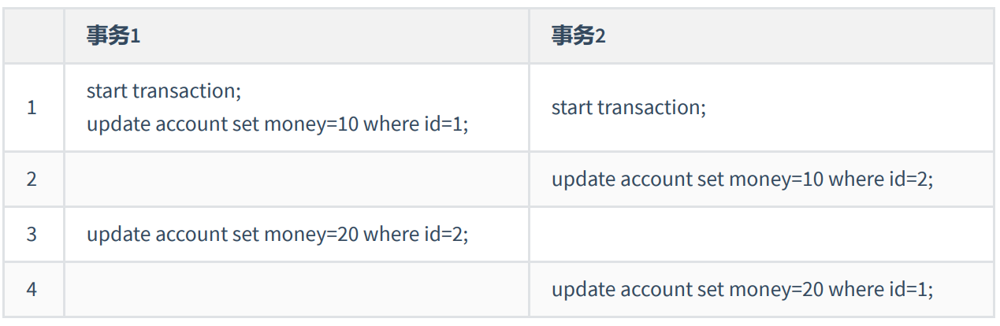

**举例2：**

用户A给用户B转账100，再次同时，用户B也给用户A转账100。这个过程，可能导致死锁。

```mysql
# 事务 1
update account set balance = balance - 100 where name = 'A';	# 操作 1
update account set balance = balance + 100 where name = 'B';	# 操作 3

# 事务 2
update account set balance = balance - 100 where name = 'B';	# 操作 2
update account set balance = balance + 100 where name = 'A';	# 操作 4
```

|                          图解-死锁                           |
| :----------------------------------------------------------: |
|  |


#### 2）产生死锁的必要条件

1. 两个或者两个以上事务
2. 锁资源同时只能被一个事务持有或者不兼容（临界资源）
3. 每个事务都已经持有锁并且彼此都在申请对方所占有的锁，并一直保持这种状态（请求与保持）
4. 每个事务都不能强行抢夺彼此所占有的锁（不剥夺）
5. 事务之间因为持有锁和申请锁导致彼此循环等待（环路等待）

> 死锁的关键在于：两个（或以上）的Session加锁的顺序不一致。


#### 3）如何处理死锁

① **方式1：等待，直到超时 (innodb_lock_wait_timeout=50s)**
		即当两个事务互相等待时，当一个事务等待时间超过设置的阈值时，就将其回滚，另外事务继续进行。这种方法简单有效，在innodb中，参数`innodb_lock_wait_timeout`用来设置<u>超时时间</u>。

- 缺点：对于在线服务来说，这个等待时间往往是无法接受的。那将此值修改短一些，比如1s，0.1s是否合适?不合适，<u>容易误伤到普通的锁等待</u>。

② **方式2：使用死锁检测进行死锁处理**
		方式 1 检测死锁太过被动，InnoDB 还提供了 `wait-for graph 算法`来主动进行死锁检测，每当加锁请求无法立即满足需要并进入等待时，wait-for graph算法都会被触发。这是一种**较为主动的死锁检测机制**，要求数据库保存`锁的信息链表`和`事务等待链表`两部分信息。


基于这两个信息，可以绘制wait-for graph（等待图）


> ​	死锁检测的原理是构建一个以**事务为顶点，锁为边**的有向图，**判断有向图是否存在环**，存在既有死锁。

​		一旦检测到回路、有死锁，这时候InnoDB存储引擎会选择 **<font color="blue">回滚undo量最小的事务</font>**，继而让其他事务继续执行（`innodb_deadlock_detect=on`表示开启这个设置）。

- 缺点：每个新的被阻塞的线程，都要判断是不是由于自己的加入导致了死锁，这个操作时间复杂度是O(n)。如果100个并发线程同时更新同一行，意味着要检测100*100=1万次，1万个线程就会有1千万次检测。

    

**如何解决？**

* 方式1：关闭死锁检测，但意味着可能会出现大量的超时，会导致业务有损。
* 方式2：控制并发访问的数量。比如在中间件中实现对于相同行的更新，在进入引擎之前排队，这样在InnoDB内部就不会有大量的死锁检测工作。


**进一步的思路：**

​		可以考虑通过将一行改成逻辑上的多行来减少`锁冲突`。比如，连锁超市账户总额的记录，可以考虑放到多条记录上。账户总额等于这多个记录的值的总和。


#### 4）如何避免死锁

- 合理设计索引，使业务 SQL 尽可能通过索引定位更少的行，减少锁竞争。
- 调整业务逻辑 SQL 执行顺序，避免长时间持有锁的 `update/delete`  的SQL 在事务中最先执行。
- 避免**大事务**的使用，尽量将大事务拆成多个小事务来处理，小事务缩短锁定资源的时间，发生锁冲突的几率也更小。
- 在并发比较高的系统中，不要显式加锁，特别是在事务里显式加锁。如 select … for update 语句，如果是在事务里运行了 start transaction 或设置了autocommit 等于 0，那么就会锁定所查找到的记录。
- 降低隔离级别。如果业务允许，将隔离级别调低也是较好的选择，此如将隔离级别从 RR 调整为 RC，可以避免掉很多因为 `gap 锁`造成的死锁。


## 四、锁的内部结构

​		我们前边说对一条记录加锁的本质就是在内存中创建一个`锁结构`与之关联，那么是不是一个事务对多条记录加锁，就要创建多个`锁结构`呢？比如：

```mysql
# 事务T1
SELECT * FROM user LOCK IN SHARE MODE;
```

​		理论上创建多个`锁结构`没问题，但是如果一个事务要获取10000条记录的锁，生成10000个锁结构也太崩溃了！所以决定在对不同记录加锁时，如果符合下边这些条件的记录会放在一个`锁结构`中。

* 在同一个事务中进行加锁操作
* 被加锁的记录在同一个页面中
* 加锁的类型是一样的
* 等待状态是一样的

`InnoDB` 存储引擎中的 `锁结构` 如下：

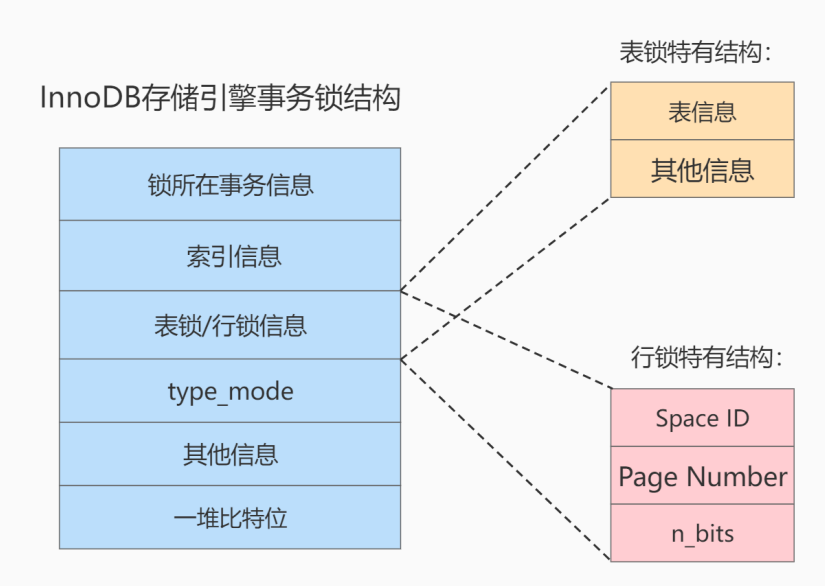

结构解析：

1. **锁所在的事务信息**：

    ​	不论是 **表锁** 还是 **行锁** ，都是在事务执行过程中生成的，哪个事务生成了这个锁结构 ，这里就记录这个事务的信息。所谓的事务信息在内存结构中只是一个**指针**，通过指针可以找到内存中关于该事务的更多信息，比方说`事务id`等。

    

2. **索引信息** ：

    ​	对于 **行锁** 来说，需要记录一下加锁的记录是属于哪个索引的。这里也是一个**指针**。

    

3. **表锁／行锁信息** ：

    ​	**表锁结构** 和 **行锁结构** 在这个位置的内容是不同的：

* 表锁：

  记载着是对哪个表加的锁，还有其他的一些信息。

* 行锁：

  记载了三个重要的信息：

  * `Space ID` ：记录所在**表空间**。
  * `Page Number` ：记录所在**页号**。
  * `n_bits `：一条记录就对应着一个比特位，一个页面中包含很多记录，用不同的比特位来区分到底是哪一条记录加了行锁。为此在行锁结构的末尾放置了一堆比特位，这个` n_bis `属性代表使用了多少比特位。

      > ​		n_bits的值一般都比页面中的记录条数多一些。主要是为了之后在页面中插入了新记录后也不至于重新分配锁结构。
  
      

4. **type_mode** ：

    这是一个32位的数，被分成了 `lock_mode` 、 `lock_type` 和 `rec_lock_type` 三个部分，如图所示：


* 锁的模式（ `lock_mode` ），占用低4位，可选的值如下：
  * `LOCK_IS` （十进制的 0 ）：表示共享意向锁，也就是 `IS锁` 。 
  * `LOCK_IX` （十进制的 1 ）：表示独占意向锁，也就是 `IX锁` 。 
  * `LOCK_S` （十进制的 2 ）：表示共享锁，也就是 `S锁` 。 
  * `LOCK_X` （十进制的 3 ）：表示独占锁，也就是 `X锁` 。 
  * `LOCK_AUTO_INC` （十进制的 4 ）：表示 `AUTO-INC锁` 。
  
      ​		在InnoDB存储引擎中，LOCK_IS，LOCK_IX，LOCK_AUTO_INC都算是表级锁的模式，LOCK_S和 LOCK_X既可以算是表级锁的模式，也可以是行级锁的模式。
  
* 锁的类型（ `lock_type` ），占用第5～8位，不过现阶段只有第5位和第6位被使用：
  * `LOCK_TABLE` （十进制的 16 ），也就是当第5个比特位置为1时，表示表级锁。
  * `LOCK_REC `（十进制的 32 ），也就是当第6个比特位置为1时，表示行级锁。
* 行锁的具体类型（ `rec_lock_type` ），使用其余的位来表示。只有在 `lock_type` 的值为 `LOCK_REC` 时，也就是只有在该锁为行级锁时，才会被细分为更多的类型：
  * `LOCK_ORDINARY` （十进制的 0 ）：表示 `next-key锁` 。
  * `LOCK_GAP` （十进制的 512 ）：也就是当第10个比特位置为1时，表示 `gap锁` 。
  * `LOCK_REC_NOT_GAP` （十进制的 1024 ）：也就是当第11个比特位置为1时，表示正经 `记录锁` 。
  * `LOCK_INSERT_INTENTION` （十进制的 2048 ）：也就是当第12个比特位置为1时，表示插入意向锁。其他的类型：还有一些不常用的类型我们就不多说了。
* `is_waiting` 属性呢？基于内存空间的节省，所以把 `is_waiting` 属性放到了 `type_mode` 这个32 位的数字中：

  * `LOCK_WAIT` （十进制的 256 ） ：当第9个比特位置为 1 时，表示 `is_waiting` 为 `true` ，也 就是当前事务尚未获取到锁，处在等待状态；当这个比特位为 0 时，表示 `is_waiting` 为 `false` ，也就是当前事务获取锁成功。


5. **其他信息** ：

    为了更好的管理系统运行过程中生成的各种锁结构而设计了各种哈希表和链表。

    

6. **一堆比特位** ：

    ​		如果是 `行锁结构` 的话，在该结构末尾还放置了一堆比特位，比特位的数量是由上边提到的 `n_bits` 属性 表示的。InnoDB数据页中的每条记录在 `记录头信息` 中都包含一个 `heap_no` 属性，伪记录 `Infimum` 的 `heap_no` 值为 0 ， `Supremum` 的 `heap_no` 值为 1 ，之后每插入一条记录， `heap_no` 值就增1。 锁结构 最后的一堆比特位就对应着一个页面中的记录，一个比特位映射一个 `heap_no` ，即==一个比特位映射到页内的一条记录==。

    

## 五、锁监控

- 关于MySQL锁的监控，我们一般可以通过检查 InnoDB_row_lock 等状态变量来分析系统上的**行锁的争夺情况**

```mysql
mysql> show status like 'innodb_row_lock%';
+-------------------------------+-------+
| Variable_name                 | Value |
+-------------------------------+-------+
| Innodb_row_lock_current_waits | 0     |
| Innodb_row_lock_time          | 0     |
| Innodb_row_lock_time_avg      | 0     |
| Innodb_row_lock_time_max      | 0     |
| Innodb_row_lock_waits         | 0     |
+-------------------------------+-------+
5 rows in set (0.01 sec)
```

对各个状态量的说明如下：

* Innodb_row_lock_current_waits：当前正在等待锁定的数量； 
* **Innodb_row_lock_time** ：从系统启动到现在锁定总时间长度；（等待总时长） 
* **Innodb_row_lock_time_avg** ：每次等待所花平均时间；（等待平均时长） 
* Innodb_row_lock_time_max：从系统启动到现在等待最常的一次所花的时间； 
* **Innodb_row_lock_waits** ：系统启动后到现在总共等待的次数；（等待总次数）

对于这5个状态变量，比较重要的3个见上面加粗。

​		尤其是当等待次数很高，而且每次等待时长也不小的时候，我们就需要分析系统中为什么会有如此多的等待，然后根据分析结果着手指定优化计划。


**其他监控方法：**

​		MySQL把事务和锁的信息记录在了 `information_schema` 库中，涉及到的三张表分别是 `INNODB_TRX` 、 `INNODB_LOCKS` 和 `INNODB_LOCK_WAITS` 。

​		`MySQL5.7及之前` ，可以通过information_schema.INNODB_LOCKS查看事务的锁情况，但只能看到阻塞事务的锁；如果事务并未被阻塞，则在该表中看不到该事务的锁情况。

​		MySQL8.0删除了information_schema.INNODB_LOCKS，添加了 `performance_schema.data_locks` ，可以通过performance_schema.data_locks查看事务的锁情况，和MySQL5.7及之前不同， performance_schema.data_locks不但可以看到阻塞该事务的锁，还可以看到该事务所持有的锁。

同时，information_schema.INNODB_LOCK_WAITS也被 `performance_schema.data_lock_waits` 所代 替。

我们模拟一个锁等待的场景，以下是从这三张表收集的信息

锁等待场景，我们依然使用记录锁中的案例，当事务2进行等待时，查询情况如下：

（1）查询正在被锁阻塞的sql语句。

```mysql
SELECT * FROM information_schema.INNODB_TRX\G;
```

重要属性代表含义已在上述中标注。

（2）查询锁等待情况

```mysql
SELECT * FROM data_lock_waits\G;
*************************** 1. row ***************************
							ENGINE: INNODB
		REQUESTING_ENGINE_LOCK_ID: 139750145405624:7:4:7:139747028690608
REQUESTING_ENGINE_TRANSACTION_ID: 13845 #被阻塞的事务ID
			REQUESTING_THREAD_ID: 72
			REQUESTING_EVENT_ID: 26
REQUESTING_OBJECT_INSTANCE_BEGIN: 139747028690608
		BLOCKING_ENGINE_LOCK_ID: 139750145406432:7:4:7:139747028813248
BLOCKING_ENGINE_TRANSACTION_ID: 13844 #正在执行的事务ID，阻塞了13845
			BLOCKING_THREAD_ID: 71
			BLOCKING_EVENT_ID: 24
BLOCKING_OBJECT_INSTANCE_BEGIN: 139747028813248
1 row in set (0.00 sec)
```

（3）查询锁的情况

```mysql
mysql > SELECT * from performance_schema.data_locks\G;
*************************** 1. row ***************************
ENGINE: INNODB
ENGINE_LOCK_ID: 139750145405624:1068:139747028693520
ENGINE_TRANSACTION_ID: 13847
THREAD_ID: 72
EVENT_ID: 31
OBJECT_SCHEMA: atguigu
OBJECT_NAME: user
PARTITION_NAME: NULL
SUBPARTITION_NAME: NULL
INDEX_NAME: NULL
OBJECT_INSTANCE_BEGIN: 139747028693520
LOCK_TYPE: TABLE
LOCK_MODE: IX
LOCK_STATUS: GRANTED
LOCK_DATA: NULL
*************************** 2. row ***************************
ENGINE: INNODB
ENGINE_LOCK_ID: 139750145405624:7:4:7:139747028690608
ENGINE_TRANSACTION_ID: 13847
THREAD_ID: 72
EVENT_ID: 31
OBJECT_SCHEMA: atguigu
OBJECT_NAME: user
PARTITION_NAME: NULL
SUBPARTITION_NAME: NULL
INDEX_NAME: PRIMARY
OBJECT_INSTANCE_BEGIN: 139747028690608
LOCK_TYPE: RECORD
LOCK_MODE: X,REC_NOT_GAP
LOCK_STATUS: WAITING
LOCK_DATA: 1
*************************** 3. row ***************************
ENGINE: INNODB
ENGINE_LOCK_ID: 139750145406432:1068:139747028816304
ENGINE_TRANSACTION_ID: 13846
THREAD_ID: 71
EVENT_ID: 28
OBJECT_SCHEMA: atguigu
OBJECT_NAME: user
PARTITION_NAME: NULL
SUBPARTITION_NAME: NULL
INDEX_NAME: NULL
OBJECT_INSTANCE_BEGIN: 139747028816304
LOCK_TYPE: TABLE
LOCK_MODE: IX
LOCK_STATUS: GRANTED
LOCK_DATA: NULL
*************************** 4. row ***************************
ENGINE: INNODB
ENGINE_LOCK_ID: 139750145406432:7:4:7:139747028813248
ENGINE_TRANSACTION_ID: 13846
THREAD_ID: 71
EVENT_ID: 28
OBJECT_SCHEMA: atguigu
OBJECT_NAME: user
PARTITION_NAME: NULL
SUBPARTITION_NAME: NULL
INDEX_NAME: PRIMARY
OBJECT_INSTANCE_BEGIN: 139747028813248
LOCK_TYPE: RECORD
LOCK_MODE: X,REC_NOT_GAP
LOCK_STATUS: GRANTED
LOCK_DATA: 1
4 rows in set (0.00 sec)

ERROR:
No query specified
```

​		从锁的情况可以看出来，两个事务分别获取了IX锁，我们从意向锁章节可以知道，IX锁互相是兼容的。所以这里不会等待，但是事务1同样持有X锁，此时事务2也要去同一行记录获取X锁，他们之间不兼容，导 致等待的情况发生。


## 六、附录

**间隙锁加锁规则（共11个案例）**

​		间隙锁是在可重复读隔离级别下才会生效的；next-key lock 实际上是由间隙锁加行锁实现的。如果切换 到读提交隔离级别 (read-committed) 的话，就好理解了，过程中去掉间隙锁的部分，也就是只剩下行锁 的部分。而在读提交隔离级别下间隙锁就没有了，为了解决可能出现的数据和日志不一致问题，需要把 binlog 格式设置为 row 。也就是说，许多公司的配置为：读提交隔离级别加 binlog_format=row。业务不 需要可重复读的保证，这样考虑到读提交下操作数据的锁范围更小（没有间隙锁），这个选择是合理的。

next-key lock的加锁规则

总结的加锁规则里面，包含了两个 “ 原则 ” 、两个 “ 优化 ” 和一个 “bug” 。

1. 原则 1 ：加锁的基本单位是 next-key lock 。 next-key lock 是前开后闭区间。 
2. 原则 2 ：查找过程中访问到的对象才会加锁。任何辅助索引上的锁，或者非索引列上的锁，最终 都要回溯到主键上，在主键上也要加一把锁。 
3. 优化 1 ：索引上的等值查询，给唯一索引加锁的时候， next-key lock 退化为行锁。也就是说如果 InnoDB扫描的是一个主键、或是一个唯一索引的话，那InnoDB只会采用行锁方式来加锁 
4. 优化 2 ：索引上（不一定是唯一索引）的等值查询，向右遍历时且最后一个值不满足等值条件的 时候， next-keylock 退化为间隙锁。 
5. 一个 bug ：唯一索引上的范围查询会访问到不满足条件的第一个值为止。

我们以表test作为例子，建表语句和初始化语句如下：其中id为主键索引

```mysql
CREATE TABLE `test` (
`id` int(11) NOT NULL,
`col1` int(11) DEFAULT NULL,
`col2` int(11) DEFAULT NULL,
PRIMARY KEY (`id`),
KEY `c` (`c`)
) ENGINE=InnoDB;
insert into test values(0,0,0),(5,5,5),
(10,10,10),(15,15,15),(20,20,20),(25,25,25);
```

**案例一：唯一索引等值查询间隙锁**

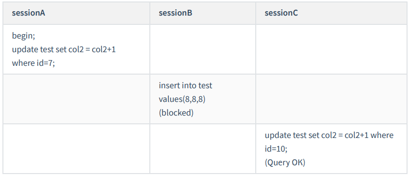

由于表 test 中没有 id=7 的记录

根据原则 1 ，加锁单位是 next-key lock ， session A 加锁范围就是 (5,10] ； 同时根据优化 2 ，这是一个等 值查询 (id=7) ，而 id=10 不满足查询条件， next-key lock 退化成间隙锁，因此最终加锁的范围是 (5,10)

**案例二：非唯一索引等值查询锁**


这里 session A 要给索引 col1 上 col1=5 的这一行加上读锁。

1. 根据原则 1 ，加锁单位是 next-key lock ，左开右闭，5是闭上的，因此会给 (0,5] 加上 next-key lock 。 
2. 要注意 c 是普通索引，因此仅访问 c=5 这一条记录是不能马上停下来的（可能有col1=5的其他记 录），需要向右遍历，查到c=10 才放弃。根据原则 2 ，访问到的都要加锁，因此要给 (5,10] 加 next-key lock 。 
3. 但是同时这个符合优化 2 ：等值判断，向右遍历，最后一个值不满足 col1=5 这个等值条件，因此退化成间隙锁 (5,10) 。
4. 根据原则 2 ， 只有访问到的对象才会加锁，这个查询使用覆盖索引，并不需要访问主键索引，所以主键索引上没有加任何锁，这就是为什么 session B 的 update 语句可以执行完成。

但 session C 要插入一个 (7,7,7) 的记录，就会被 session A 的间隙锁 (5,10) 锁住 这个例子说明，锁是加在索引上的。

执行 for update 时，系统会认为你接下来要更新数据，因此会顺便给主键索引上满足条件的行加上行锁。

如果你要用 lock in share mode来给行加读锁避免数据被更新的话，就必须得绕过覆盖索引的优化，因为覆盖索引不会访问主键索引，不会给主键索引上加锁

**案例三：主键索引范围查询锁**

上面两个例子是等值查询的，这个例子是关于范围查询的，也就是说下面的语句

```mysql
select * from test where id=10 for update
select * from tets where id>=10 and id<11 for update;
```

这两条查语句肯定是等价的，但是它们的加锁规则不太一样

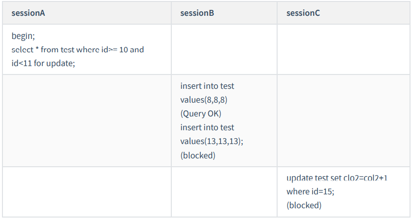

1. 开始执行的时候，要找到第一个 id=10 的行，因此本该是 next-key lock(5,10] 。 根据优化 1 ，主键 id 上的等值条件，退化成行锁，只加了 id=10 这一行的行锁。 
2. 它是范围查询， 范围查找就往后继续找，找到 id=15 这一行停下来，不满足条件，因此需要加 next-key lock(10,15] 。

session A 这时候锁的范围就是主键索引上，行锁 id=10 和 next-key lock(10,15] 。**首次 session A 定位查找 id=10 的行的时候，是当做等值查询来判断的，而向右扫描到 id=15 的时候，用的是范围查询判断。**

**案例四：非唯一索引范围查询锁**

与案例三不同的是，案例四中查询语句的 where 部分用的是字段 c ，它是普通索引

这两条查语句肯定是等价的，但是它们的加锁规则不太一样


在第一次用 col1=10 定位记录的时候，索引 c 上加了 (5,10] 这个 next-key lock 后，由于索引 col1 是非唯 一索引，没有优化规则，也就是说不会蜕变为行锁，因此最终 sesion A 加的锁是，索引 c 上的 (5,10] 和 (10,15] 这两个 next-keylock 。

这里需要扫描到 col1=15 才停止扫描，是合理的，因为 InnoDB 要扫到 col1=15 ，才知道不需要继续往后找了。

**案例五：唯一索引范围查询锁 bug**


session A 是一个范围查询，按照原则 1 的话，应该是索引 id 上只加 (10,15] 这个 next-key lock ，并且因 为 id 是唯一键，所以循环判断到 id=15 这一行就应该停止了。

但是实现上， InnoDB 会往前扫描到第一个不满足条件的行为止，也就是 id=20 。而且由于这是个范围扫描，因此索引 id 上的 (15,20] 这个 next-key lock 也会被锁上。照理说，这里锁住 id=20 这一行的行为，其实是没有必要的。因为扫描到 id=15 ，就可以确定不用往后再找了。

**案例六：非唯一索引上存在 " " 等值 " " 的例子**

这里，我给表 t 插入一条新记录：insert into t values(30,10,30);也就是说，现在表里面有两个c=10的行

**但是它们的主键值 id 是不同的（分别是 10 和 30 ），因此这两个c=10 的记录之间，也是有间隙的。**


这次我们用 delete 语句来验证。注意， delete 语句加锁的逻辑，其实跟 select ... for update 是类似的， 也就是我在文章开始总结的两个 “ 原则 ” 、两个 “ 优化 ” 和一个 “bug” 。

这时， session A 在遍历的时候，先访问第一个 col1=10 的记录。同样地，根据原则 1 ，这里加的是 (col1=5,id=5) 到 (col1=10,id=10) 这个 next-key lock 。

由于c是普通索引，所以继续向右查找，直到碰到 (col1=15,id=15) 这一行循环才结束。根据优化 2 ，这是 一个等值查询，向右查找到了不满足条件的行，所以会退化成 (col1=10,id=10) 到 (col1=15,id=15) 的间隙锁。


这个 delete 语句在索引 c 上的加锁范围，就是上面图中蓝色区域覆盖的部分。这个蓝色区域左右两边都 是虚线，表示开区间，即 (col1=5,id=5) 和 (col1=15,id=15) 这两行上都没有锁

**案例七： limit 语句加锁**

例子 6 也有一个对照案例，场景如下所示：

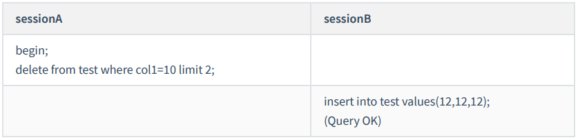

session A 的 delete 语句加了 limit 2 。你知道表 t 里 c=10 的记录其实只有两条，因此加不加 limit 2 ，删除的效果都是一样的。但是加锁效果却不一样

这是因为，案例七里的 delete 语句明确加了 limit 2 的限制，因此在遍历到 (col1=10, id=30) 这一行之后， 满足条件的语句已经有两条，循环就结束了。因此，索引 col1 上的加锁范围就变成了从（ col1=5,id=5) 到（ col1=10,id=30) 这个前开后闭区间，如下图所示：

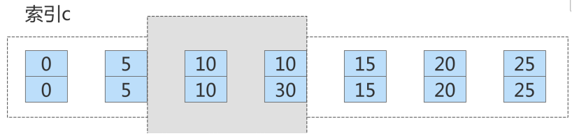

这个例子对我们实践的指导意义就是， 在删除数据的时候尽量加 limit 。

这样不仅可以控制删除数据的条数，让操作更安全，还可以减小加锁的范围。

**案例八：一个死锁的例子**

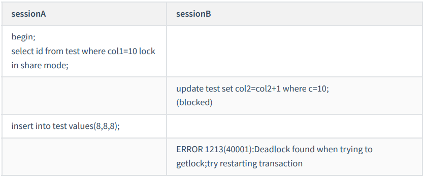

1. session A 启动事务后执行查询语句加 lock in share mode ，在索引 col1 上加了 next-keylock(5,10] 和 间隙锁 (10,15) （索引向右遍历退化为间隙锁）； 
2. session B 的 update 语句也要在索引 c 上加 next-key lock(5,10] ，进入锁等待； 实际上分成了两步， 先是加 (5,10) 的间隙锁，加锁成功；然后加 col1=10 的行锁，因为sessionA上已经给这行加上了读 锁，此时申请死锁时会被阻塞 
3. 然后 session A 要再插入 (8,8,8) 这一行，被 session B 的间隙锁锁住。由于出现了死锁， InnoDB 让 session B 回滚

**案例九：order by索引排序的间隙锁1**

如下面一条语句

```mysql
begin;
select * from test where id>9 and id<12 order by id desc for update;
```

下图为这个表的索引id的示意图。


1. 首先这个查询语句的语义是 order by id desc ，要拿到满足条件的所有行，优化器必须先找到 “ 第 一个 id<12 的值 ” 。 
2. 这个过程是通过索引树的搜索过程得到的，在引擎内部，其实是要找到 id=12 的这个值，只是最终 没找到，但找到了 (10,15) 这个间隙。（ id=15 不满足条件，所以 next-key lock 退化为了间隙锁 (10, 15) 。）
3. 然后向左遍历，在遍历过程中，就不是等值查询了，会扫描到 id=5 这一行，又因为区间是左开右 闭的，所以会加一个next-key lock (0,5] 。 也就是说，在执行过程中，通过树搜索的方式定位记录 的时候，用的是 “ 等值查询 ” 的方法。

**案例十：order by索引排序的间隙锁2**


1. 由于是 order by col1 desc ，第一个要定位的是索引 col1 上 “ 最右边的 ”col1=20 的行。这是一个非唯一索引的等值查询：

   左开右闭区间，首先加上 next-key lock (15,20] 。 向右遍历，col1=25不满足条件，退化为间隙锁 所以会 加上间隙锁(20,25) 和 next-key lock (15,20] 。

2. 在索引 col1 上向左遍历，要扫描到 col1=10 才停下来。同时又因为左开右闭区间，所以 next-key lock 会加到 (5,10] ，这正是阻塞session B 的 insert 语句的原因。

3. 在扫描过程中， col1=20 、 col1=15 、 col1=10 这三行都存在值，由于是 select * ，所以会在主键 id 上加三个行锁。 因此， session A 的 select 语句锁的范围就是：

   1. 索引 col1 上 (5, 25) ；
   2. 主键索引上 id=15 、 20 两个行锁。

**案例十一：update修改数据的例子-先插入后删除**


注意：根据 col1>5 查到的第一个记录是 col1=10 ，因此不会加 (0,5] 这个 next-key lock 。

session A 的加锁范围是索引 col1 上的 (5,10] 、 (10,15] 、 (15,20] 、 (20,25] 和(25,supremum] 。

之后 session B 的第一个 update 语句，要把 col1=5 改成 col1=1 ，你可以理解为两步：

1. 插入 (col1=1, id=5) 这个记录；
2. 删除 (col1=5, id=5) 这个记录。

通过这个操作， session A 的加锁范围变成了图 7 所示的样子:

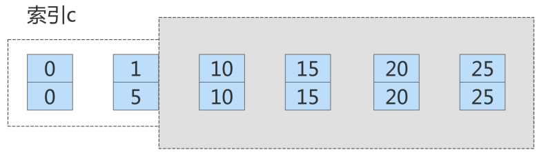

好，接下来 session B 要执行 update t set col1 = 5 where col1 = 1 这个语句了，一样地可以拆成两步：

1. 插入 (col1=5, id=5) 这个记录；
2. 删除 (col1=1, id=5) 这个记录。 第一步试图在已经加了间隙锁的 (1,10) 中插入数据，所以就被堵住了。


