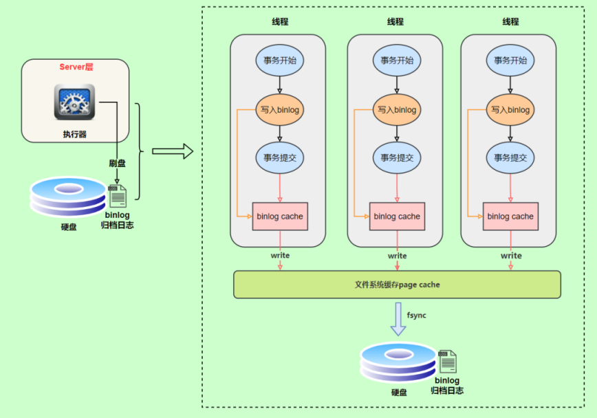
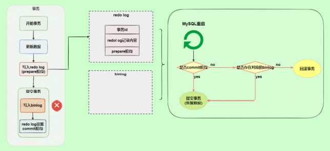

# 第17章 其他数据库日志

[其它数据库日志](https://blog.csdn.net/weixin_43004044/article/details/127910805?spm=1001.2014.3001.5502)

​		在数据库事务中，讲过两种事务日志：**重做日志**、**回滚日志**。

​		对于线上数据库应用系统，突然遭遇数据库宕机怎么办？在这种情况下，定位宕机的原因就非常关键。我们可以查看数据库的`错误日志`。因为**错误日志中记录了数据库运行中的诊断信息，包括了错误、警告和注释等信息**。比如：从日志中发现某个连接中的 SQL 操作发生了死循环，导致内存不足，被系统强行终止了。明确了原因，处理起来也就轻松了，系统很快就恢复了运行。

​		除了发现错误，日志在数据复制、数据恢复、操作审计，以及确保数据的永久性和一致性等方面，都有着不可替代的作用。

​		**千万不要小看日志**。很多看似奇怪的问题，答案往往就藏在日志里。很多情况下，只有通过**查看日志**才能发现问题的原因，真正解决问题。所以，一定要学会查看日志，养成检查日志的习惯，对提升你的数据库应用开发能力至关重要。


MySQL8.0 官网日志地址：“ https://dev.mysql.com/doc/refman/8.0/en/server-logs.html ”


## 一、MySQL支持的日志

### 1.1 日志类型

​		MySQL有不同类型的日志文件，用来存储不同类型的日志，分为 `二进制日志` 、 `错误日志` 、 `通用查询日志` 和 `慢查询日志` ，这也是常用的4种。MySQL 8又新增两种支持的日志：`中继日志`和`数据定义语句日志` 。使用这些日志文件，可以查看MySQL内部发生的事情。


这6类日志分别为：

* **慢查询日志**：记录所有执行时间超过`long_query_time`的所有查询，方便我们对查询进行优化。 
* **通用查询日志**：记录所有连接的起始时间和终止时间，以及连接发送给数据库服务器的**所有指令**， 对我们复原操作的实际场景、发现问题，甚至是对数据库操作的审计都有很大的帮助。 
* **错误日志**：记录MySQL服务的启动、运行或停止MySQL服务时出现的问题，方便我们了解服务器的 状态，从而对服务器进行维护。 
* **二进制日志**：记录所有**更改数据**的语句，可以用于主从服务器之间的数据同步，以及服务器遇到故障时数据的无损失恢复。 
* **中继日志**：用于主从服务器架构中，从服务器用来存放主服务器二进制日志内容的一个中间文件。 `从服务器`通过读取中继日志的内容，来**同步主服务器上的操作**。 
* **数据定义语句日志**：记录数据定义语句执行的元数据操作。

除二进制日志外，其他日志都是 `文本文件` 。默认情况下，所有日志创建于 `MySQL数据目录` 中。


### 1.2 日志的弊端

* 日志功能会 `降低MySQL数据库的性能` 。例如，在查询非常频繁的MySQL数据库系统中，如果开启了通用查询日志和慢查询日志，MySQL数据库会花费很多时间记录日志。
* 日志会 `占用大量的磁盘空间` 。对于用户量非常大，操作非常频繁的数据库，日志文件需要的存储空间设置比数据库文件需要的存储空间还要大。


## 二、慢查询日志(slow query log)

前面章节《第09章_性能分析工具的使用》已经详细讲述。


## 三、通用查询日志(general query log)

> ​		通用查询日志用来 `记录用户的所有操作` ，包括启动和关闭MySQL服务、所有用户的连接开始时间和截止时间、发给 MySQL 数据库服务器的所有 SQL 指令等。当我们的数据发生异常时，**查看通用查询日志， 还原操作时的具体场景**，可以帮助我们准确定位问题。


### 3.1 问题场景

​		在电商系统中，购买商品并且使用微信支付完成以后，却发现支付中心的记录并没有新增，此时用户再次使用支付宝支付，就会出现**重复支付**的问题。但是当去数据库中查询数据的时候，会发现只有一条记录存在。那么此时给到的现象就是只有一条支付记录，但是用户却支付了两次。

​		我们对系统进行了仔细检查，没有发现数据问题，因为用户编号和订单编号以及第三方流水号都是对的。可是用户确实支付了两次，这个时候，我们想到了检查通用查询日志，看看当天到底发生了什么。

​		查看之后，发现: 1 月 1 日下午 2 点，用户使用微信支付独以后，但是由于网络故障，支付中心没有及时收到微信支付的回调通知，导致当时没有写入数据。1 月 1 日下午 2 点 30，用户又使用支付宝支付，此时记录更新到支付中心。1 月 1 日晚上 9 点，微信的回调通知过来了，但是支付中心已经存在了支付宝的记录，所以只能覆盖记录了。

​		由于网络的原因导致了重复支付。至于解决问题的方案就很多了，这里省略。

​		**可以看到通用查询日志可以帮助我们了解操作发生的具体时间和操作的细节，对找出异常发生的原因极其关键。**


### 3.2 查看当前状态

```mysql
mysql> SHOW VARIABLES LIKE '%general%';
+------------------+------------------------------+
| Variable_name    | Value                        |
+------------------+------------------------------+
| general_log      | OFF                          | #通用查询日志处于关闭状态
| general_log_file | /var/lib/mysql/atguigu01.log | #通用查询日志文件的名称是atguigu01.log
+------------------+------------------------------+
2 rows in set (0.03 sec)
```

​		说明 1：系统变量 `general_log` 的值是 `OFF`，即通用查询日志处于关闭状态。在 MySQL 中，这个参数的**默认值是关闭的**。因为一旦开启记录通用查询日志，MySQL 会记录所有的连接起止和相关的 SQL 操作，这样会**非常消耗系统资源并且占用磁盘空间**。我们可以通过手动修改变量的值，在**需要的时候开启日志**。

​		说明 2：通用查询日志文件的名称是 `atguiguo1.log`。存储路径是 `/var/lib/mysql/`，默认也是`数据路径`。这样我们就知道在哪里可以查看通用查询日志的内容了。


### 3.3 启动日志

- **方式1：永久性方式**

​		修改`my.cnf`或者`my.ini`配置文件来设置。在[mysqld]组下加入log选项，并重启MySQL服务。格式如下：

```properties
[mysqld]
general_log=ON
general_log_file=[path[filename]] #日志文件所在目录路径，filename为日志文件
```

​		如果不指定目录和文件名，通用查询日志将默认存储在MySQL数据目录中的hostname.log文件中， hostname表示主机名。


- **方式2：临时性方式**

```mysql
SET GLOBAL general_log=on; # 开启通用查询日志
```

```mysql
SET GLOBAL general_log_file=’path/filename’; # 设置日志文件保存位置
```

对应的，关闭操作SQL命令如下：

```mysql
SET GLOBAL general_log=off; # 关闭通用查询日志
```

查看设置后情况：

```mysql
SHOW VARIABLES LIKE 'general_log%';
```


### 3.4 查看日志

​		通用查询日志是以 `文本文件` 的形式存储在文件系统中的，可以使用 `文本编辑器` 直接打开日志文件。每台 MySQL服务器的通用查询日志内容是不同的。

* 在Windows操作系统中，使用文本文件查看器； 
* 在Linux系统中，可以使用vi工具或者gedit工具查看； 
* 在Mac OS系统中，可以使用文本文件查看器或者vi等工具查看。

从 `SHOW VARIABLES LIKE 'general_log%'`; 结果中可以看到通用查询日志的位置。

```mysql
/usr/sbin/mysqld, Version: 8.0.26 (MySQL Community Server - GPL). started with:
Tcp port: 3306 Unix socket: /var/lib/mysql/mysql.sock
Time Id Command Argument
2022-01-04T07:44:58.052890Z 10 Query SHOW VARIABLES LIKE '%general%'
2022-01-04T07:45:15.666672Z 10 Query SHOW VARIABLES LIKE 'general_log%'
2022-01-04T07:45:28.970765Z 10 Query select * from student
2022-01-04T07:47:38.706804Z 11 Connect root@localhost on using Socket
2022-01-04T07:47:38.707435Z 11 Query select @@version_comment limit 1
2022-01-04T07:48:21.384886Z 12 Connect root@172.16.210.1 on using TCP/IP
2022-01-04T07:48:21.385253Z 12 Query SET NAMES utf8
2022-01-04T07:48:21.385640Z 12 Query USE `atguigu12`
2022-01-04T07:48:21.386179Z 12 Query SHOW FULL TABLES WHERE Table_Type !=
'VIEW'
2022-01-04T07:48:23.901778Z 13 Connect root@172.16.210.1 on using TCP/IP
2022-01-04T07:48:23.902128Z 13 Query SET NAMES utf8
2022-01-04T07:48:23.905179Z 13 Query USE `atguigu`
2022-01-04T07:48:23.905825Z 13 Query SHOW FULL TABLES WHERE Table_Type !=
'VIEW'
2022-01-04T07:48:32.163833Z 14 Connect root@172.16.210.1 on using TCP/IP
2022-01-04T07:48:32.164451Z 14 Query SET NAMES utf8
2022-01-04T07:48:32.164840Z 14 Query USE `atguigu`
2022-01-04T07:48:40.006687Z 14 Query select * from account
```

​		在通用查询日志里面，我们可以清楚地看到，什么时候开启了新的客户端登陆数据库，登录之后做了什么 SQL 操作，针对的是哪个数据表等信息。


### 3.5 停止日志

- **方式1：永久性方式**

​		修改 `my.cnf` 或者 `my.ini` 文件，把[mysqld]组下的 `general_log` 值设置为 `OFF` 或者把general_log一项 注释掉。修改保存后，再`重启MySQL服务` ，即可生效。 

举例1：

```properties
[mysqld]
general_log=OFF
```

举例2：

```properties
[mysqld]
#general_log=ON
```


- **方式2：临时性方式**

使用SET语句停止MySQL通用查询日志功能：

```mysql
SET GLOBAL general_log=off;
```

查询通用日志功能：

```mysql
SHOW VARIABLES LIKE 'general_log%';
```


### 3.6 删除\刷新日志

​		如果数据的使用**非常频繁**，那么通用查询日志会占用服务器非常大的磁盘空间。数据管理员可以**删除很长时间之前的查询日志**，以保证MySQL服务器上的硬盘空间。

- **手动删除文件**

```mysql
SHOW VARIABLES LIKE 'general_log%';
```

​		可以看出，通用查询日志的目录默认为MySQL数据目录。在该目录下手动删除通用查询日志 atguigu01.log

​		使用如下命令重新生成查询日志文件，具体命令如下。刷新MySQL数据目录，发现创建了新的日志文件。前提一定要开启通用日志。

```mysql
mysqladmin -uroot -p flush-logs
```

​		如果希望备份旧的通用查询日志，就必须先将旧的日志文件复制出来或者改名，然后执行上面的mysqladmin命令。正确流程如下：

```liunx
cd mysql-data-directory # 输入自己的通用日志文件所在目录
mv mysql.general.log mysql.general.log.old # 指定旧的文件名 以及 新的文件名
mysqladmin -uroot -p flush-logs
```


## 四、错误日志(error log)

> ​		错误日志记录了 MySQL 服务器的启动、停止运行的时间，以及系统启动、运行和停止过程中的诊断信息，包括**错误**、**警告**和**提示**等。
>
> ​		通过错误日志可以查看系统的运行状态，便于即时发现故障、修复故障。如果 MySQL 服务**出现异常**，错误日志是发现问题、解决故障的**首选**。


### 4.1 启动日志

​		在MySQL数据库中，错误日志功能是 `默认开启` 的。而且，错误日志 **无法被禁止使用** 。

​		默认情况下，错误日志存储在MySQL数据库的**数据文件夹**下，名称默认为 `mysqld.log` （Linux系统）或 `hostname.err` （mac系统/windows系统）。

​		如果需要指定文件名，则需要在`my.cnf`或者`my.ini`中做如下配置：

```properties
[mysqld]
log-error=[path/[filename]] #path为日志文件所在的目录路径，filename为日志文件名
```

​		修改配置项后，需要重启MySQL服务以生效。


### 4.2 查看日志

​		MySQL错误日志是以文本文件形式存储的，可以使用文本编辑器直接查看。

- 查询`错误日志`的存储路径：

```mysql
mysql> SHOW VARIABLES LIKE 'log_err%';
+----------------------------+----------------------------------------+
| Variable_name              | Value                                  |
+----------------------------+----------------------------------------+
| log_error                  | /var/log/mysqld.log                    |
| log_error_services         | log_filter_internal; log_sink_internal |
| log_error_suppression_list |                                        |
| log_error_verbosity        | 2                                      |
+----------------------------+----------------------------------------+
4 rows in set (0.01 sec)
```

在执行结果中可以看到错误日志文件是`mysqld.log`，位于MySQL默认的数据目录下。


### 4.3 删除\刷新日志

​		对于很久以前的错误日志，数据库管理员查看的可能性不大，我们可以将这些错误日志删除， 以腾出MySQL服务器上的`硬盘空间` 。MySQL的错误日志是以文本文件的形式存储在文件系统中的，可以`直接删除` 。

- 方式一

    - 直接删除

        - ```mysql
            rm -f /var/lib/mysql/mysqld.log
            ```

在运行状态下删除错误日志文件后，MySQL并不会自动创建日志文件。


- 方式二

    - 第一步：重命名文件

        - ```mysql
            mv /var/log/mysqld.log /var/log/mysqld.log.old
            ```

    - 第二步：重建日志

        - ```mysql
            mysqladmin -uroot -p flush-logs
            ```

            

    可能会报错:

    ```mysql
    [root@atguigu01 log]# mysqladmin -uroot -p flush-logs
    Enter password:
    mysqladmin: refresh failed; error: 'Could not open file '/var/log/mysqld.log' for
    error logging.'  # 意思：没有找到名为mysqld.log错误日志
    ```

    官网提示：

    

补充操作：

```mysql
install -omysql -gmysql -m0644 /dev/null /var/log/mysqld.log
```

`flush-logs` 指令操作：

- MySQL 5.5.7 以前的版本，flush-logs 将错误日志文件重命名为 filename.err_old，并创建新的日志文件。
- 从MySQL 5.5.7 开始，flush-logs 只是重新打开日志文件，并不做日志备份和创建的操作。
- 如果日志文件不存在，MySQL 启动或者执行 flush-logs 时会自动创建新的日志文件。重新创建错误日志，大小为 0 字节。


### 4.4 MySQL 8.0 新特性

​		MySQL8.0对错误日志改进了一波改进。MySQL8.0的错误日志可以理解为ー个全新的日志，在这个版本里，接受了来自社区的广泛批评意见，在这些意见和建议的基础上生成了新的日志。

- 下面这些是来自社区的意见：
    - 默认情况下内容过于冗长
    - 遗漏了有用的信息
    - 难以过滤某些信息
    - 没有标识错误信息的子系统源
    - 没有错误代码，解析消息需要识别错误
    - 引导消息可能会丢失
    - 日志是固定格式

- 针对这些意见，MySQL做了如下改变：
    - 采用组件架构，通过不同的组件执行日志的写入和过滤功能
    - 写入错误日志的全部信息都具有唯一的错误代码。从10000开始
    - 增加了一个新的消息分类《system》。用于在错误日志中记录非错误信息，但服务器状态发生更改的消息
    - 增加了额外的附加信息。例如关机时的版本信息，谁发起的关机等等
    - 两种过滤方式：Internal和 Dragnet
    - 三种写入形式：经典、JSON和 syseventlog

> 小结：
>
> ​		通常情况下，管理员不需要查看错误日志。但是，MySQL服务器发生异常时，管理员可以从错误日志中找到发生异常的时间、原因，然后根据这些信息来解决异常。


## 五、二进制日志(bin log)

​		binlog可以说是MySQL中比较 `重要` 的日志了，在日常开发及运维过程中，经常会遇到。

​		binlog即binary log，二进制日志文件，也叫作变更日志（update log）。它记录了数据库所有执行的 `DDL` 和 `DML` 等**数据库更新事件**的语句，但是不包含没有修改任何数据的语句（如数据查询语句select、 show等）。

​		它以`事件形式`记录并保存在`二进制文件`中。通过这些信息，我们可以再现**数据更新操作**的全过程。

> ​	如果想要记录所有语句（例如，为了识别有问题的**查询**），需要使用`通用查询日志`。


- binlog主要应用场景：
    - 一是用于**数据恢复**。如果 MySQL 数据库意外停止，可以通过二进制日志文件来查看用户执行了哪些操作，对数据库服务器文件做了哪些修改，然后根据二进制日志文件中的记录来恢复数据库服务器。
    - 二是用于**数据复制**。由于日志的延续性和时效性，master 把它的二进制日志传递给 slaves 来达到 master-slave 数据一致的目的。

​		可以说 MySQL 数据库的**数据备份**、**主备**、**主主**、**主从**都离不开 `binlog`，需要依靠 binlog 来同步数据，以保证数据的一致性。  

|                 binlog完成数据同步与数据恢复                 |
| :----------------------------------------------------------: |
|  |


### 5.1 查看默认情况

查看记录二进制日志是否开启：在MySQL8中默认情况下，二进制文件是开启的。

```mysql
mysql> show variables like '%log_bin%';
+---------------------------------+----------------------------------+
| Variable_name                   | Value                            |
+---------------------------------+----------------------------------+
| log_bin                         | ON                               |
| log_bin_basename                | /var/lib/mysql/binlog            |
| log_bin_index                   | /var/lib/mysql/binlog.index      |
| log_bin_trust_function_creators | OFF                              |
| log_bin_use_v1_row_events       | OFF                              |
| sql_log_bin                     | ON                               |
+---------------------------------+----------------------------------+
6 rows in set (0.00 sec)
```

- `log_bin_basename`：是 binlog 日志的基本文件名，后面会**追加某种规则的标识**来表示每一个文件
- `log_bin_index`：是 binlog文件的索引文件，这个文件是所有的 binlog文件的目录
- `log_bin_trust_function_creators`：**限制存储过程的创建**。前面我们已经讲过了，这是因为二进制日志的一个重要功能是用于**主从复制**，而存储函数有可能导致主从的数据不一致。例如：在使用一些函数，诸如：`NOW()`、`CURDATE()`、`CURTIME()` ，这些函数的结果会随着某方面因素的影响而发生改变。所以当开启二进制日志后，需要限制存储函数的创建、修改、调用。
- `log_bin_use_v1_row_events`：此只读系统变量已弃用。ON表示使用版本1二进制日志行。OFF表示使用版本2二进制日志行（MySQL5.6的默认值为2）。


### 5.2 日志参数设置

- **方式1：永久性方式**

修改MySQL的 `my.cnf` 或 `my.ini` 文件可以设置二进制日志的相关参数：

```properties
[mysqld]
#启用二进制日志
log-bin=atguigu-bin
binlog_expire_logs_seconds=600
max_binlog_size=100M
```


重新启动MySQL服务，查询二进制日志的信息，执行结果：

```mysql
mysql> show variables like '%log_bin%';
+---------------------------------+----------------------------------+
| Variable_name                   | Value                            |
+---------------------------------+----------------------------------+
| log_bin                         | ON                               |
| log_bin_basename                | /var/lib/mysql/atguigu-bin       |
| log_bin_index                   | /var/lib/mysql/atguigu-bin.index |
| log_bin_trust_function_creators | OFF                              |
| log_bin_use_v1_row_events       | OFF                              |
| sql_log_bin                     | ON                               |
+---------------------------------+----------------------------------+
6 rows in set (0.00 sec)
```

​		**设置带文件夹的bin-log日志存放目录**：如果想改变日志文件的目录和名称，可以对my.cnf或my.ini中的log_bin参数修改如下：

```properties
[mysqld]
log-bin="/var/lib/mysql/binlog/atguigu-bin"
```

注意：新建的文件夹需要使用mysql用户，使用下面的命令即可。

```mysql
chown -R -v mysql:mysql binlog
```

重启 MySQL 服务之后，新的二进制日志文件将出现在 `/var/lib/mysql/binlog/` 文件夹下面。

> ​		提示：**数据库文件最好不要与日志文件放在同一个磁盘上**！这样，就算数据库文件所在的磁盘发生了故障，也不会影响日志文件中数据的有效性。


- **方式2：临时性方式**

    ​		如果不希望通过修改配置文件并重启的方式设置二进制日志的话，还可以使用如下指令，需要注意的是 在MySQL8中只有 `会话级别` 的设置，没有了`global`级别的设置。

```mysql
# global 级别
mysql> set global sql_log_bin=0;
ERROR 1228 (HY000): Variable 'sql_log_bin' is a SESSION variable and can`t be used
with SET GLOBAL

# session级别
mysql> SET sql_log_bin=0;
Query OK, 0 rows affected (0.01 秒)
```


### 5.3 查看日志

​		当MySQL创建二进制日志文件时，先创建一个以“filename”为名称、以“.index”为后缀的文件，再创建一个以“filename”为名称、以“.000001”为后缀的文件。

​		MySQL服务 `重新启动一次` ，以“.000001”为后缀的文件就会增加一个，并且后缀名**按1递增**。即**日志文件的 个数与MySQL服务启动的次数相同**；如果单个日志文件的大小超过了 `max_binlog_size` 的上限（默认是1GB），就会创建一个新的日志文件。

​		查看当前的二进制日志文件列表及大小。指令如下：

```mysql
mysql> SHOW BINARY LOGS;
+--------------------+-----------+-----------+
| Log_name           | File_size | Encrypted |
+--------------------+-----------+-----------+
| atguigu-bin.000001 | 156       | No        |
+--------------------+-----------+-----------+
1 行于数据集 (0.02 秒)
```

​		所有对数据库的修改都会记录在binlog中。但binlog是二进制文件，无法直接查看，想要更直观的观测它就要借助`mysqlbinlog`命令工具了。

---


- 指令如下：在查看之前，先执行一条SQL语句，如下：

```mysql
update student set name='张三_back' where id=1;
```

开始查看binlog


```mysql
mysqlbinlog -v "/var/lib/mysql/binlog/atguigu-bin.000002"
#220105 9:16:37 server id 1 end_log_pos 324 CRC32 0x6b31978b Query thread_id=10
exec_time=0 error_code=0
SET TIMESTAMP=1641345397/*!*/;
SET @@session.pseudo_thread_id=10/*!*/;
SET @@session.foreign_key_checks=1, @@session.sql_auto_is_null=0,
@@session.unique_checks=1, @@session.autocommit=1/*!*/;
SET @@session.sql_mode=1168113696/*!*/;
SET @@session.auto_increment_increment=1, @@session.auto_increment_offset=1/*!*/;
/*!\C utf8mb3 *//*!*/;
SET
@@session.character_set_client=33,@@session.collation_connection=33,@@session.collatio
n_server=255/*!*/;
SET @@session.lc_time_names=0/*!*/;
SET @@session.collation_database=DEFAULT/*!*/;
/*!80011 SET @@session.default_collation_for_utf8mb4=255*//*!*/;
BEGIN
/*!*/;
# at 324
#220105 9:16:37 server id 1 end_log_pos 391 CRC32 0x74f89890 Table_map:
`atguigu14`.`student` mapped to number 85
# at 391
#220105 9:16:37 server id 1 end_log_pos 470 CRC32 0xc9920491 Update_rows: table id
85 flags: STMT_END_F

BINLOG '
dfHUYRMBAAAAQwAAAIcBAAAAAFUAAAAAAAEACWF0Z3VpZ3UxNAAHc3R1ZGVudAADAw8PBDwAHgAG
AQEAAgEhkJj4dA==
dfHUYR8BAAAATwAAANYBAAAAAFUAAAAAAAEAAgAD//8AAQAAAAblvKDkuIkG5LiA54+tAAEAAAAL
5byg5LiJX2JhY2sG5LiA54+tkQSSyQ==
'/*!*/;
### UPDATE `atguigu`.`student`
### WHERE
### @1=1
### @2='张三'
### @3='一班'
### SET
### @1=1
### @2='张三_back'
### @3='一班'
# at 470
#220105 9:16:37 server id 1 end_log_pos 501 CRC32 0xca01d30f Xid = 15
COMMIT/*!*/;
```

前面的命令同时显示binlog格式的语句，使用如下命令不显示它

```mysql
mysqlbinlog -v --base64-output=DECODE-ROWS "/var/lib/mysql/binlog/atguigu-bin.000002"
#220105 9:16:37 server id 1 end_log_pos 324 CRC32 0x6b31978b Query thread_id=10
exec_time=0 error_code=0
SET TIMESTAMP=1641345397/*!*/;
SET @@session.pseudo_thread_id=10/*!*/;
SET @@session.foreign_key_checks=1, @@session.sql_auto_is_null=0,
@@session.unique_checks=1, @@session.autocommit=1/*!*/;
SET @@session.sql_mode=1168113696/*!*/;
SET @@session.auto_increment_increment=1, @@session.auto_increment_offset=1/*!*/;
/*!\C utf8mb3 *//*!*/;
SET
@@session.character_set_client=33,@@session.collation_connection=33,@@session.collatio
n_server=255/*!*/;
SET @@session.lc_time_names=0/*!*/;
SET @@session.collation_database=DEFAULT/*!*/;
/*!80011 SET @@session.default_collation_for_utf8mb4=255*//*!*/;
BEGIN
/*!*/;
# at 324
#220105 9:16:37 server id 1 end_log_pos 391 CRC32 0x74f89890 Table_map:
`atguigu14`.`student` mapped to number 85
# at 391
#220105 9:16:37 server id 1 end_log_pos 470 CRC32 0xc9920491 Update_rows: table id
85 flags: STMT_END_F
### UPDATE `atguigu14`.`student`
### WHERE
### @1=1
### @2='张三'
### @3='一班'
### SET
### @1=1
### @2='张三_back'
### @3='一班'
# at 470
#220105 9:16:37 server id 1 end_log_pos 501 CRC32 0xca01d30f Xid = 15
```


​		关于mysqlbinlog工具的使用技巧还有很多，例如只解析对某个库的操作或者某个时间段内的操作等。简单分享几个常用的语句，更多操作可以参考官方文档。

```mysql
# 可查看参数帮助
mysqlbinlog --no-defaults --help
# 查看最后100行
mysqlbinlog --no-defaults --base64-output=decode-rows -vv atguigu-bin.000002 |tail
-100
# 根据position查找
mysqlbinlog --no-defaults --base64-output=decode-rows -vv atguigu-bin.000002 |grep -A
20 '4939002'
```

​		上面这种办法读取出binlog日志的全文内容比较多，不容易分辨查看到pos点信息，下面介绍一种更为方便的查询命令：

```mysql
mysql> show binlog events [IN 'log_name'] [FROM pos] [LIMIT [offset,] row_count];
```

* `IN 'log_name'` ：指定要查询的binlog文件名（不指定就是第一个binlog文件）　 
* `FROM pos` ：指定从哪个pos起始点开始查起（不指定就是从整个文件首个pos点开始算） 
* `LIMIT [offset]` ：偏移量(不指定就是0) 
* `row_count` :查询总条数（不指定就是所有行）

```mysql
mysql> show binlog events in 'atguigu-bin.000002';
+--------------------+-----+----------------+-----------+-------------+--------------------------------------------------------+
| Log_name           | Pos | Event_type     | Server_id | End_log_pos | Info                                                   |
+--------------------+-----+----------------+-----------+-------------+--------------------------------------------------------+
| atguigu-bin.000002 | 4   | Format_desc    | 1         | 125         | Server ver: 8.0.26, Binlog ver: 4                      |
| atguigu-bin.000002 | 125 | Previous_gtids | 1         | 156         |                                                        |
| atguigu-bin.000002 | 156 | Anonymous_Gtid | 1         | 235         | SET @@SESSION.GTID_NEXT= 'ANONYMOUS'                   |
| atguigu-bin.000002 | 235 | Query          | 1         | 324         | BEGIN                                                  |
| atguigu-bin.000002 | 324 | Table_map      | 1         | 391         | table_id: 85(atguigu14.student)                        |
| atguigu-bin.000002 | 391 | Update_rows    | 1         | 470         | table_id: 85flags: STMT_END_F                          |
| atguigu-bin.000002 | 470 | Xid            | 1         | 501         | COMMIT /*xid=15 */                                     |
| atguigu-bin.000002 | 501 | Anonymous_Gtid | 1         | 578         | SET @@SESSION.GTID_NEXT= 'ANONYMOUS'                   |
| atguigu-bin.000002 | 578 | Query     | 1 | 721 | use `atguigu14`; create table test(id int, title varchar(100)) /* xid=19 */ |
| atguigu-bin.000002 | 721 | Anonymous_Gtid | 1         | 800         | SET @@SESSION.GTID_NEXT= 'ANONYMOUS'                   |
| atguigu-bin.000002 | 800 | Query          | 1         | 880         | BEGIN                                                  |
| atguigu-bin.000002 | 880 | Table_map      | 1         | 943         | table_id: 89(atguigu14.test)                           |
| atguigu-bin.000002 | 943 | Write_rows     | 1         | 992         | table_id: 89 flags: STMT_END_F                         |
| atguigu-bin.000002 | 992 | Xid            | 1         | 1023        | COMMIT /*xid=21 */                                     |
+--------------------+-----+----------------+-----------+-------------+--------------------------------------------------------+
14 行于数据集 (0.02 秒)
```


### 5.4 binlog的存储格式

上面我们讲了这么多都是基于binlog的`默认格式（ROW）`，binlog格式查看

```mysql
mysql> show variables like 'binlog_format';
+---------------+-------+
| Variable_name | Value |
+---------------+-------+
| binlog_format | ROW   |
+---------------+-------+
1 行于数据集 (0.02 秒)
```

除此之外，binlog还有2种格式，分别是`Statement`和`Mixed`

* `Statement`

    * 特点：每一条对数据进行修改的 **完整SQL** 都会记录在binlog中。
    * 优点：不需要记录每一行的变化，减少了binlog的日志量，节约了I/O，提高性能。
    
* `Row`

    * 特点：5.1.5版本的MySQL才开始支持这种格式的复制，它并不是记录的一条条 **SQL语句**，而仅仅保存被修改记录的值。
    * 优点：这种格式的日志内容会非常清楚的记录每一行数据修改的细节。而且不会出现某些特定情况下的存储过程或function，以及trigger的调用和触发无法被正确复制的问题。
    
* `Mixed`

    * 特点：从5.1.8版本开始，MySQL提供了Mixed格式，实际上就是`Statement与Row的结合`。

    - 优点：可以自动的在记录数据的时候，选择是采用Statement还是Row。比如，在使用一些日期函数时，不是直接写入一条调用函数的SQL，而是直接将当前函数修改的值写入到日志文件中。但在平时，如果直接记录一条完整SQL不会导致在任意一个时刻再去执行，导致数据不同的问题，那么就可以直接去记录一条完整SQL。


### 5.5 使用日志恢复数据

​		如果MySQL服务器启用了二进制日志，那么，在数据库出现意外丢失数据时，就可以使用mysqlbinlog工具从指定的时间点开始（例如，最后一次备份）直到现在或另一个指定的时间点的日志中**恢复**这些数据。

- mysqlbinlog恢复数据的语法如下：

```mysql
mysqlbinlog [option] filename|mysql –uusername -ppassword;
```

​		这个命令可以这样理解：使用mysqlbinlog命令来读取filename中的内容，然后使用mysql命令将这些内容恢复到数据库中。

* `filename` ：是日志文件名。

* `option` ：可选项，比较重要的两对option参数是--start-date、--stop-date 和 --start-position、-- stop-position。
    * `--start-date` 和` --stop-date` ：可以指定恢复数据库的起始时间点和结束时间点。
    * `--start-position`和`--stop-position` ：可以指定恢复数据的开始位置和结束位置。

> 注意：使用mysqlbinlog命令进行恢复操作时，必须是编号小的先恢复，例如atguigu-bin.000001必须在atguigu-bin.000002之前恢复。

详见p189，由于翻页过快，这部分没办法记录。


### 5.6 删除二进制日志

​		MySQL的二进制文件可以配置自动删除，同时MySQL也提供了安全的手动删除二进制文件的方法。 `PURGE MASTER LOGS` 只删除**指定部分**的二进制日志文件， `RESET MASTER` 删除**所有**的二进制日志文件。具体如下：

#### 1）`PURGE MASTER LOGS`：删除指定日志文件

PURGE MASTER LOGS语法如下：

```mysql
# 删除创建时间比指定的日志早的所有bin日志文件
PURGE {MASTER | BINARY} LOGS TO ‘指定日志文件名’

# 删除指定日期前创建的所有bin日志文件
PURGE {MASTER | BINARY} LOGS BEFORE ‘指定日期’
```


#### 2）`RESET MASTER`: 删除所有二进制日志文件


### 5.7 其它场景

​		二进制日志可以通过数据库的 `全量备份` 和二进制日志中保存的 `增量信息` ，完成数据库的 `无损失恢复` 。 但是，如果遇到数据量大、数据库和数据表很多（比如分库分表的应用）的场景，用二进制日志进行数据恢复，是很有挑战性的，因为起止位置不容易管理。

​		在这种情况下，一个有效的解决办法是 `配置主从数据库服务器` ，甚至是 `一主多从` 的架构，把二进制日志文件的内容通过中继日志，同步到从数据库服务器中，这样就可以有效避免数据库故障导致的数据异常等问题。


## 六、再谈二进制日志(binlog)

### 6.1 写入机制

​		binlog的写入时机也非常简单，事务执行过程中，先把日志写到 `binlog cache` ，事务提交的时候，再把binlog cache写到binlog文件中。因为一个事务的binlog不能被拆开，无论这个事务多大，也要确保一次性写入，所以系统会给每个线程分配一个块内存作为`binlog cache`。

​		我们可以通过`binlog_cache_size`参数控制`单个线程 binlog cache` 大小，如果存储内容超过了这个参数，就要暂存到磁盘（Swap）。

​		binlog日志刷盘流程如下：

|                        binlog刷盘流程                        |
| :----------------------------------------------------------: |
|  |

> * 上图的`write`，是指把日志写入到文件系统的page cache，并没有把数据持久化到磁盘，所以速度比较快
> * 上图的`fsync`，才是将数据持久化到磁盘的操作

---


​		write和fsync的时机，可以由参数 `sync_binlog` 控制，默认是 `0` 。为0的时候，表示每次提交事务都只 write，由系统自行判断什么时候执行fsync。虽然性能得到提升，但是机器宕机（**操作系统死掉**），page cache里面的 binglog 会丢失。如下图：

|             sync_binlog = 0 时，binlog的刷盘策略             |
| :----------------------------------------------------------: |
|  |

---


​		为了安全起见，可以设置为 `1` ，表示每次提交事务都会执行fsync，就如同**redo log 刷盘流程**一样。 最后还有一种折中方式，可以设置为N(N>1)，表示每次提交事务都write，但**累积N个事务后才fsync**。

|            sync_binlog >= 1 时，binlog的刷盘策略             |
| :----------------------------------------------------------: |
|  |

​		在出现I/O瓶颈的场景里，将`sync_binlog`设置成一个比较大的值，可以提升性能。同样的，如果机器宕机，会丢失最近N个事务的binlog日志。


### 6.2 binlog与redolog对比

* redo log 它是 `物理日志` ，记录内容是“在某个数据页上做了什么修改”，属于 **<font color="blue">InnoDB 存储引擎层</font>**产生的。
* 而 binlog 是 `逻辑日志` ，记录内容是语句的原始逻辑，类似于“给 ID=2 这一行的 c 字段加 1”，属于 **<font color="blue">MySQL Server 层</font>**。
* 虽然它们都属于**持久化**的保证，但是侧重点不同。
    * redo log让InnoDB存储引擎拥有了==崩溃恢复能力==。
    * binlog保证了MySQL==集群架构的数据一致性==。


### 6.3 `redo log`的两阶段提交

​		在执行更新语句的过程中，会记录redo log与binlog两块日志，以基本的事务为单位，**redo log在事务执行过程中可以不断写入**，而**binlog只有在提交事务时才写入**，所以redo log与binlog的 `写入时机` 不一样。

|               redo log 与 binlog各自的写入时机               |
| :----------------------------------------------------------: |
|  |


- **redo log与binlog两份日志中写入的数据不一致，会出现什么问题**？

​		以update语句为例，假设`id=2`的记录，字段`c`值是`0`，把字段c值更新为`1`，SQL语句为`update T set c = 1 where id = 2`。

​		假设执行过程中写完redo log日志后，binlog日志写期间发生了异常，会出现什么情况呢？

|              redo log正常写入 & binlog写入异常               |
| :----------------------------------------------------------: |
|  |


​		由于binlog没写完就异常，所以在这个时候binlog里面并没有对应的修改记录。因此，**从数据库**在用`binlog`日志恢复数据时，就会缺少这一次更新，导致恢复出来的这一行c值为0，而**原库**使用redo log日志进行数据恢复，这一行c的值是1，最终导致数据不一致。

| 主数据库使用redo log恢复数据，数据正确<br />从数据库使用binlog恢复数据，数据不正确。数据与主数据库中的不一致 |
| :----------------------------------------------------------: |
|  |


​		为了解决两份日志之间的`逻辑一致性`的问题，InnoDB存储引擎使用**两阶段提交**方案。原理很简单，将redo log的写入拆成了两个步骤`prepare`和`commit`，这就是**两阶段提交**。

​		==【其实就是将**写入binlog**与**写入redo log**的过程当做一次事务来执行】，即要么同时成功，要么同时失败==。

|            两阶段提交：redo log的prepare & commit            |
| :----------------------------------------------------------: |
|  |

---


- 使用两阶段提交后，写入binlog时发生异常也不会有影响，因为MySQL根据redo log日志恢复数据时，如果发现redo log还处于`prepare`阶段，**并且没有对应的`binlog日志`**，就会回滚该事务。

| 在两阶段提交方案下，redo log在`prepare`阶段发生异常。<br />重启服务器后恢复数据时所做的判断 |
| :----------------------------------------------------------: |
|  |


- 另一个场景，redo log设置commit阶段发生异常，那会不会回滚事务呢？

| 在两阶段提交方案下，redo log在`commit`阶段发生异常。<br />重启服务器后恢复数据时所做的判断 |
| :----------------------------------------------------------: |
|  |

​		并不会回滚事务，它会执行上图框住的逻辑，**虽然redo log是处于prepare阶段，但是能通过事务id找到对应的binlog日志，所以MySQL认为是完整的，就会提交事务恢复数据**。


> ​		只要通过某个事务id能找到一份对应的binlog，就没问题。


## 7. 中继日志(relay log)

### 7.1 介绍

​		**中继日志只在主从服务器架构的从服务器上存在**。从服务器为了与主服务器保持一致，要从主服务器读取二进制日志的内容，并且把读取到的信息写入 `本地的日志文件` 中，这个从服务器本地的日志文件就叫 `中继日志` 。然后，从服务器读取中继日志，并根据中继日志的内容对从服务器的数据进行更新，完成`主从服务器`的**数据同步** 。

​		搭建好主从服务器之后，中继日志默认会保存在从服务器的**数据目录**下。

​		中继日志的文件名格式是：` 从服务器名 -relay-bin.序号` 。中继日志还有一个索引文件：`从服务器名 -relaybin.index` ，用来定位当前正在使用的中继日志。


### 7.2 查看中继日志

​		中继日志与二进制日志的格式相同，可以用 `mysqlbinlog` 工具进行查看。下面是中继日志的一个片段：

```mysql
SET TIMESTAMP=1618558728/*!*/;
BEGIN
/*!*/;
# at 950
#210416 15:38:48 server id 1 end_log_pos 832 CRC32 0xcc16d651 Table_map:
`atguigu`.`test` mapped to number 91
# at 1000
#210416 15:38:48 server id 1 end_log_pos 872 CRC32 0x07e4047c Delete_rows: table id
91 flags: STMT_END_F -- server id 1 是主服务器，意思是主服务器删了一行数据
BINLOG '
CD95YBMBAAAAMgAAAEADAAAAAFsAAAAAAAEABGRlbW8ABHRlc3QAAQMAAQEBAFHWFsw=
CD95YCABAAAAKAAAAGgDAAAAAFsAAAAAAAEAAgAB/wABAAAAfATkBw==
'/*!*/;
# at 1040
```

这一段的意思是，主服务器（“server id 1”）对表 atguigu.test 进行了 2 步操作：

```mysql
定位到表 atguigu.test 编号是 91 的记录，日志位置是 832；
删除编号是 91 的记录，日志位置是 872
```


### 7.3 恢复的典型错误

​		如果从服务器宕机，有的时候为了系统恢复，要重装操作系统，这样就可能会导致你的 `服务器名称` 与之前 `不同` 。而中继日志里是 `包含从服务器名` 的。在这种情况下，就可能导致你恢复从服务器的时候，无法 从宕机前的中继日志里读取数据，以为是日志文件损坏了，其实是名称不对了。

​		解决的方法也很简单，**<font color="blue">把从服务器的名称改回之前的名称</font>**。


## 8. 扩展知识-FLUSH/RESET句法

### 8.1 语法

```mysql
FLUSH flush_option [,flush_option]
```


### 8.2 参数

- **HOSTS** 

    ​		这个用的最多经常碰见。主要是用来**清空主机缓存表**。如果你的某些主机改变IP数字或如果你得到错误消息Host ... isblocked你应该清空主机表。当在连接MySQL服务器时对一台给定的主机有多于max_connect_errors个错误连续不断地发生时，MySQL为了安全的需要将会阻止该主机进一步的连接请求。清空主机表允许主机再尝试连接。

- **LOGS** 

    ​		关闭当前的二进制日志文件（binlog），并**创建一个新的二进制日志文件**。新的二进制日志文件的名字是在当前的二进制文件的编号上加1。

- **PRIVILEGES** 

    ​		这个也是经常使用的。每当重新进行权限的修改后，为了**让新权限立即生效**，一般都执行此条指令。目地是：从数据库授权表中重新装载权限到缓存中。

- **TABLES** 

    ​	关闭所有打开的表，同时该操作将会**清空查询缓存中的内容**。

- **FLUSH TABLES WITH READ LOCK** 

    ​		关闭所有打开的表，同时**对所有数据库中的表都加一个读锁（<font color="green">全局锁</font>）**，直到显示地执行`unlock tables`时，锁才会被释放。该操作常常用于做<u>数据备份</u>的时候。

- **STATUS** 

    ​		重置大多数状态变量到0。

- **QUERY CACHE** 

    ​		**重新整理查询缓存中的内容，整理其中的碎片以提高性能**。但是并不影响查询缓存中现有的数据。这点和 `Flush Table` 与 `Reset Query Cache`（将会清空查询缓存的内容）相比，是不一样的。

- **MASTER** 

    ​		一般在主从复制时使用。**删除所有的二进制日志文件（binlog）**。不过这个已经不推荐使用了，而是推荐使用 `reset master`。

- **SLAVE** 

    ​		一般在主从复制时使用。删除SLAVE数据库的 `relaylog` 日志文件，并重新启用新的 `relaylog` 日志文件。	

    

    > ​		一般来讲，Flush操作都会记录在二进制日志文件中。但是`FLUSH LOGS`、`FLUSH MASTER`、`FLUSH SLAVE`、`FLUSH TABLES WITH READ LOCK`不会被记录。因为上述操作如果记录在二进制日志文件中的话，会对从数据库造成影响。
    >
    > ​		注意：Reset操作其实扮演的是一个Flush操作的增强版的角色。

    