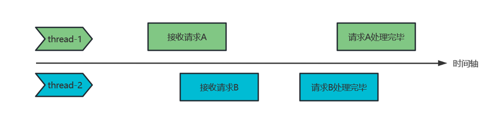

# Redis面试题

## 一、概述

### 1.1 Redis是什么？请简述它的优缺点

​		Redis(`Remote Dictionary Server`) 是一个使用 C 语言编写的、开源的（BSD许可）、高性能的`非关系型（NoSQL）的键值对数据库`。

​		Redis 提供了丰富的数据结构。`键(key)`的类型只能为字符串，`值(value)`支持五种基本数据类型：字符串、列表、集合、散列表、有序集合。当然，除了这五种基本数据类型以外，Redis还支持一些高级数据类型，即：bitmap、hyperloglog、geospatial。这些数据结构都各自拥有不同的使用场景，因此它可以去覆盖在应用开发中绝大部分的业务场景。比如说解决top10的问题用<u>有序集合</u>、解决类似于微信朋友圈点赞的问题用<u>集合</u>、存放对象数据用<u>散列表</u>等等……

​		由于 Redis 的数据是存放在内存中的，所以读写速度非常快，可以达到每秒处理超过 `10万次` 的读写操作，因此 Redis 被广泛作为**应用与数据库之间的缓存**使用，是已知性能最快的Key-Value DB。

​		最后，Redis提供了`主从复制 + 哨兵`以及`集群`的方式去实现高可用，进一步提升了整体系统的性能与安全。


- **优点**：
    - 读写性能优异， Redis能读的速度是110000次/s，写的速度是81000次/s。
    - 支持数据持久化，支持AOF和RDB两种持久化方式。
    - 支持事务，Redis的所有操作都是原子性的，同时Redis还支持对几个操作合并后的原子性执行。
    - 数据结构丰富，除了支持string类型的value外还支持hash、set、zset、list等数据结构。
    - 支持主从复制，主机会自动将数据同步到从机，可以进行读写分离。
- **缺点**：
    - 数据存储在内存，若没有配置持久化策略，主机断电则数据丢失
    - 存储容量受到物理内存的限制，只能用于小数据量的高性能操作
    - 在线扩容比较困难，系统上线时必须确保有足够的空间，但这会造成资源浪费
    - 用作缓存时，容易出现’缓存雪崩‘、’缓存击穿‘等缓存问题


### 1.2 Redis的常用场景

#### 1）缓存

​		缓存现在几乎是所有中大型网站都在用的必杀技，合理的利用缓存不仅能够提升网站访问速度，还能大大降低数据库的压力。Redis提供了`键过期功能`，也提供了灵活的`键淘汰策略`，所以，现在Redis用在缓存的场合非常多。


#### 2）排行榜

​		很多网站都有排行榜应用的，如京东的月度销量榜单、商品按时间的上新排行榜等。Redis提供的`有序集合`数据类型能实现各种复杂的排行榜应用。


#### 3）计数器

​		什么是计数器，如电商网站商品的浏览量、视频网站视频的播放数等。为了保证数据实时效，每次浏览都得给+1，并发量高时如果每次都进行数据库操作无疑是种挑战和压力。Redis提供的`incr`命令来实现计数器功能，内存操作，性能非常好，非常适用于这些计数场景。


#### 4）分布式会话

​		集群模式下，在应用不多的情况下一般使用容器自带的session复制功能就能满足，但当应用增多相对复杂的系统中，一般都会搭建以Redis等内存数据库为中心的session服务，session不再由容器管理，而是由session服务及内存数据库管理。


#### 5）分布式锁

​		在很多的互联网公司中都使用了分布式技术，分布式技术带来的技术挑战是**对同一个资源的并发访问**，如全局ID、减库存、秒杀等场景，并发量不大的场景可以使用数据库的悲观锁、乐观锁来实现，但在并发量高的场合中，利用数据库锁来控制资源的并发访问是不太理想的，因为会大大影响数据库的性能。此时，我们可以利用Redis的`setnx`功能来编写分布式锁，如果结果返回`1`，则说明获取锁成功，否则获取锁失败。但是在实际应用中要考虑的细节会更多。


#### 6）社交网络

​		点赞、踩、关注/被关注、共同好友等是社交网站的基本功能，社交网站的访问量通常来说比较大，而且传统的关系数据库类型不适合存储这种类型的数据，Redis提供的哈希、集合等数据结构能很方便的的实现这些功能。如在微博中的共同好友，通过Redis的set能够很方便得出。


#### 7）最新列表

​		Redis列表结构，LPUSH可以在列表头部插入一个内容ID作为关键字，LTRIM可用来限制列表的数量，这样列表永远为N个ID，无需查询最新的列表，直接根据ID去到对应的内容页即可。


#### 8）消息系统

​		消息队列是大型网站必用中间件，如ActiveMQ、RabbitMQ、Kafka等流行的消息队列中间件，主要用于业务解耦、流量削峰及异步处理实时性低的业务。Redis提供了发布/订阅及阻塞队列功能，能实现一个简单的消息队列系统。另外，这个不能和专业的消息中间件相比。


### 1.3 为什么要使用缓存

我们主要从“高性能”和“高并发”这两点来看待这个问题。

- **高性能**：对于一些复杂操作查询数据库得来的结果，非常耗时，并且这些结果很有可能会被多次使用。那如果每次在需要的时候都去查询数据库的话，是非常缓慢的，因为会产生大量的磁盘I/O。此时，便可以将数据存放进缓存中。由于缓存使用内存操作数据，效率非常高，所以能很快的将数据响应给用户。

- **高并发**：对于那些关系型数据库，设计的目标并不是为了应对高并发的压力，而主要是为了存储数据。虽然说也可以支持并发请求，但最高也就是千级并发，这是无法满足高并发场景的。那么这个时候，使用缓存，显得格外关键。缓存的并发量可以高达万级，将缓存作为客户端与数据库之间的中间件，就可以很好的应对高并发压力了。


### 1.4 为什么要使用 Redis 做缓存

1. Redis 可以用几十G的内存来做缓存，速度快
2. Redis 缓存可以持久化，便于数据备份、恢复；
3. Redis支持简单的事务，操作满足原子性
4. Redis 可以实现分布式的缓存；
5. Redis 可以处理每秒万级的并发，是专业的缓存服务；
6. Redis 缓存有过期机制；
7. Redis 有丰富的 API，并且容易上手；
8. Redis 支持多种高可用方案，如主从、哨兵、集群，可以很好的保证系统的可用性。


### 1.5 为什么要用 Redis 而不用 map/guava 做缓存?

​		缓存分为`本地缓存`和`分布式缓存`。

​		以java为例，使用自带的map或者guava实现的是`本地缓存`，最主要的特点是**轻量以及快速**，生命周期随着jvm的销毁而结束，并且在多实例的情况下，每个实例都需要各自保存一份缓存，**缓存不具有一致性**。

​		使用Redis或memcached之类的称为`分布式缓存`，在多实例的情况下，各实例共用一份缓存数据，**缓存具有一致性**。缺点是需要保持Redis或memcached服务的**高可用**，整个**程序架构上较为复杂**。

**对比**：

- Redis 可以用 几十G 内存来做缓存，Map 不行，一般 JVM 也就分几个 G 数据就够大了；
- Redis 的缓存可以持久化，Map 是内存对象，程序一重启数据就没了；
- Redis 可以实现分布式的缓存，Map 只能存在创建它的程序里；
- Redis 可以处理每秒万级的并发，是专业的缓存服务。而Map只是一个普通的对象，无法适应高并发场景；
- Redis 缓存有过期机制，Map 本身无此功能；
- Redis 有丰富的 API，Map 就简单太多了；
- Redis可单独部署，多个项目之间可以共享，而本地内存无法共享；
- Redis有专门的管理工具可以查看缓存数据。


## 二、Redis数据类型

### 2.1 Redis有哪些数据结构？分别有哪些典型的应用场景？

#### 1） 五种基本数据类型

1. `字符串(String)`：用来存放简单数据。可以缓存某个简单的字符串或数字，也可以缓存某个json格式的字符串。Redis分布式锁的实现就利用了这种数据结构，还包括可以实现计数器、 分布式Session……
2. `哈希表(Hash)`：可以用来存储一些key-vaue键值对的数据，很适合用来存储对象。
3. `列表(List)`：Redis的列表通过命令的组合，既可以当做栈，也可以当做队列来使用。可以用来缓存类似微信公众号最新消息等消息流数据。
4. `集合(Set)`：和列表类似，也可以存储多个元素，但是不能重复。我们可以对集合进行交集、并集、差集操作，从而可以实现类似于我和某人共同关注的人、微信朋友圈点赞等功能。
5. `有序集合(SortedSet)`：集合(set)是无序的，而有序集合(SortedSet)可以通过score来进行元素排序。因此，适合用来实现排行榜等功能。


#### 2）三种高级数据类型

1. `位图(Bitmap)`：**用于统计数据状态的数据类型**。将位图想象成一个以bit为基本元素的数组，数组中的每个元素只能存0或者1，数组的下标在Bitmap中叫做`偏移量`。我们可以使用Bitmap实现统计功能，这样更省空间，例如：如果只需要统计数据的状态，诸如商品有没有、用户在不在等……就可以使用 Bitmap，因为它只用一个 bit位就能表示 0 或 1。
2. `Hyperloglog`：**用于统计基数的数据类型**。HyperLogLog 的优点是：在输入元素的数量或者体积非常非常大时，计算基数所需的空间总是固定的、并且是很小的。每个 HyperLogLog 键只需要花费 12KB 内存，就可以计算接近 2^64 个不同元素的基数。场景：统计网页的UV（即UniqueVisitor，不重复访客，一个人访问某个网站多次，但是还是只计算为一次）。要注意，HyperLogLog 的统计规则是基于概率完成的，所以它给出的统计结果是有一定误差的，标准误算率是 0.81%。
3. `Geospatial` ：**用于存储地理位置信息的数据类型**。还可以对存储的地理信息进行操作。适用场景诸如朋友的定位、附近的人、打车距离计算等。


### 2.2 Redis底层数据是如何用跳表来存储的

​		跳表：将**有序链表（`Sorted Set`）**改造为支持近似`折半查找`算法的数据结构。可以完成快速的插入、删除、查找操作。

|                             跳表                             |
| :----------------------------------------------------------: |
|  |

- **跳表的性质**

    - 由很多层组成
    - 每一层都是一个有序链表
    - 最底层的链表包含所有元素
    - 如果一个元素出现在第i层的链表中，则它在i-1层中也会出现
    - 上层节点可以跳转到下层

    


## 三、Redis持久化

### 3.1 Redis中的RDB、AOF、混合持久化

#### 1）RDB(Redis DataBase)

##### ① 什么是RDB

​		RDB是Redis默认的持久化方式。在指定的时间间隔内将内存中的==数据集快照==写入磁盘，对应的数据文件是`dump.rdb`，通过配置文件中的save参数来定义生成快照的周期。实际的操作过程是：先fork一个子进程（**fork一个子进程的时候，基于快照数据的体积大小，主进程会有不同程度的阻塞**），然后使用这个子进程将内存中的数据以`二进制数据`的形式写入临时文件，再用这个临时文件替换掉原来的`dump.rdb文件`，子进程退出。

​		我们可以**手动执行命令来生成RDB快照**。即：进入Redis客户端执行命令`save`或`bgsave`就可以了。命令的执行会将所将内存中的数据快照保存到一个新的RDB文件里，并**覆盖**原有的RDB快照文件。


##### ②  `bgsave`的写时复制(COW)机制

​		Redis 借助操作系统提供的`写时复制技术`（Copy-On-Write，COW），在生成快照的同时，依然可以正常处理写命令。简单来说，`bgsave 子进程`是由`主线程` fork 生成的，所以可以共享主线程的所有内存数据。当`bgsave 子进程`运行后，开始读取主线程的内存数据，并把它们写入 RDB 文件。此时，如果主线程对这些数据也都是**读操作**，那么主线程和 bgsave 子进程相互不影响。但**如果主线程要修改一块数据，则这块数据就会被复制一份，并生成该数据的副本**。然后，bgsave 子进程会把这个副本数据写入 RDB 文件，而在这个过程中，主线程仍然可以直接修改原来的数据。


- **save与bgsave相比**：

| 命令                      | save             | bgsave                                 |
| ------------------------- | ---------------- | -------------------------------------- |
| I/O类型                   | 同步             | 异步                                   |
| 是否阻塞Redis中的其它命令 | 是               | 否（主线程在fork子进程时会有短暂阻塞） |
| 复杂度                    | O(N)             | O(N)                                   |
| 优点                      | 不会消耗额外内存 | 不会阻塞客户端命令                     |
| 缺点                      | 阻塞客户端命令   | 需要fork出子进程，这会消耗额外的内存   |


##### ③ RDB备份方式的优缺点分析

- **优点**：
    - 使用RDB进行数据备份时的性能比AOF更高一些。一方面RDB使用子进程进行备份；另一方面，RDB的持久化次数不像AOF那样频繁。
    - 相同数据量的情况下，RDB文件的体积比AOF的更小，在恢复数据时，速度也更快一些
- **缺点**：
    - 无法保证数据的完整性。RDB是按照持久化规则，每隔一段时间就进行一次持久化，当服务死掉后，最少都会丢失最后一次进行持久化后的那部分数据。
    - 由于RDB的复制是全量的，即使是使用fork的子进程来进行备份，当数据量很大的时候对磁盘的消耗也是不可忽视的，尤其是在访问量很高的时候，fork的时间也会延长，导致CPU吃紧，拉低服务器性能。


#### 2）AOF(Append Only File)

##### ① 什么是AOF

​		以日志的形式，以文本的格式，以只追加的方式来记录服务器所处理的每一个`写操作`，而不记录读操作。

##### ② AOF重写

​		大体积的AOF文件里可能有许多的冗余指令，为了尽可能的缩小AOF文件的体积，会在触发一定条件时进行数据的自动重写。当然，AOF文件还可以**手动**执行命令`bgrewriteaof`进行重写。

​		**AOF重写时，也会fork出一个子进程（与bgsave命令类似），不会对Redis正常命令的处理有太多影响**。

- 通过以下参数控制数据**自动重写**的频率

```shell
// aof文件至少要达到64M才会自动重写，文件太小恢复速度本来就很快，重写的意义不大 
auto‐aof‐rewrite‐min‐size 64mb 

// aof文件自上一次重写后文件大小增长了100%则再次触发重写 
auto‐aof‐rewrite‐percentage 100 
```


##### ③ RDB备份方式的优缺点分析

- **优点**：
    - 数据安全。Redis中提供了3种**同步策略**：即`每秒同步`、`每修改同步`和`不同步`。事实上，毎秒同步也是异步完成的，其效率也是非常高的。只是如果系统宕机，则会出现在这一秒钟之内修改的数据丢失的情况。而毎修改同步，我们可以将其视为同步持久化，即每次发生的数据变化都会被立即记录到磁盘中。
    - AOF机制的 `rewrite模式`。会定期对AOF文件进行重写，以达到压缩的目的。
    - 通过 `append模式` 写文件，即使中途服务器宕机也不会破坏已经存在的内容，即使由于某种原因（磁盘已满或其他原因）导致日志写入异常终止，也可以通过 `Redis-check-aof`工具进行修复。
- **缺点**：
    - 相同数据量的情况下，AOF文件的体积比RDB的更大，在恢复数据时，速度也更慢一些
    - 在进行数据恢复时，使用AOF比使用RDB的速度更慢
    - 运行效率没有RDB高


#### 3）混合持久化

​		重启 Redis 时，我们很少使用 RDB 来进行数据恢复，因为会丢失大量数据。我们通常使用 AOF 日志进行数据恢复，但是使用 AOF日志进行数据恢复的性能相对RDB来说要慢很多，这样在 Redis 实例很大的情况下，启动需要花费很长的时间。 Redis 4.0 为了解决这个问题，带来了一个新的持久化选项——**混合持久化**。

​		如果开启了混合持久化，AOF在**重写**时，会将**重写这一刻之前**的内存中的数据做RDB快照处理，然后写入到AOF文件中。如果与此同时又发生了数据更新，则会将这些增量更新以命令的形式直接拼接至AOF文件中。

​		混合模式不光兼顾了**数据恢复时的性能**，还兼顾了**数据的完整性**。

|                    混合持久化-AOF文件结构                    |
| :----------------------------------------------------------: |
|  |


- 通过如下配置可以开启混合持久化（前提是必须先开启AOF）

```shell
aof‐use‐rdb‐preamble yes
```


#### 4）小结

| 命令         | RDB        | AOF                              |
| ------------ | ---------- | -------------------------------- |
| 启动优先级   | 低         | 高                               |
| 文件体积     | 小         | 大                               |
| 数据恢复速度 | 快         | 慢                               |
| 数据安全性   | 容易丢数据 | 同步策略的不同，数据丢失量也不同 |

​		Redis启动时，如果既有RDB文件又有AOF文件，则会优先选择AOF文件进行数据恢复。因为AOF一般来说数据更全一点。


- 在线上，Redis的持久化策略一般如何设置呢？
    - 如果对数据的完整性要求不高，且可以从其他地方找回数据，则可以关闭持久化
    - 如果对数据的完整性要求不高，可以承受数分钟的数据丢失，可以只使用RDB
    - 如果对数据的完整性要求较高，可以同时使用RDB与AOF
    - 如果对性能要求较高，在Master中最好不要做持久化操作，可以在某个Slave中开启AOF备份数据，策略就设置为`每秒同步一次`即可


## 四、过期键的删除策略

### 4.1 Redis键过期了为什么其所占用的内存还没有被释放

#### 1）set命令使用不合理

​		set命令除了可以设置key-value之外，还可以设置key的过期时间：

```redis
------------------------------使用set加ex参数------------------------------
127.0.0.1:6379> set lu jun EX 10000
OK
127.0.0.1:6379> TTL lu
9996

### 如果想要修改key为lu的值，但是没有加上过期时间的参数，那么key为lu的过期时间就会被擦除。###
127.0.0.1:6379> set lu jun666
OK
127.0.0.1:6379> TTL lu       // 此时，将永不过期
-1


------------------------------使用expire也是同理------------------------------
127.0.0.1:6379> set lu3 jun3
OK
127.0.0.1:6379> ttl lu3
-1
127.0.0.1:6379> expire lu3 10000
1
127.0.0.1:6379> ttl lu3
9998

### 修改key之后，没有重新设置键过期时间，导致key的过期时间被擦除。  ###
127.0.0.1:6379> set lu3 jun6566
OK
127.0.0.1:6379> ttl lu3     // 此时，将永不过期
-1


------------------------------使用setex也可以设置过期键--------------------------
127.0.0.1:6379> setex hhh 10 666
OK
127.0.0.1:6379> TTL hhh
(integer) 5
```

​		如果你发现Redis的内存持续增长，而且有很多key原来设置了过期时间，后来却发现过期时间丢失了，就很有可能是因为这个原因导致的。这时你的 Redis 中就会存在大量不过期的key，致使消耗过多的内存资源。

​		所以，在使用`SET命令`时，如果刚开始就设置了过期时间，那么之后在修改这个key的时候，也务必要加上过期时间的参数，避免过期时间丢失的问题。


#### 2）Redis过期键的删除策略不同，导致一部分已过期的数据还残留在内存中

##### ① 定时删除

> ​		在设置某个 key 的过期时间的同时，我们创建一个`定时器`，让**定时器在该过期时间到来时，立即执行对其进行删除的操作**。

- 优点
    - 定时删除对内存来说是最友好的，能够保证**内存中的key一旦过期就能`立即`从内存中删除**。
- 缺点
    - 对CPU最不友好。在过期键比较多的时候，删除过期键就会占用一部分 CPU 资源，这**对服务器的响应时间和吞吐量会造成一定程度的影响**。


##### ② 惰性删除

> ​		在设置 key 的过期时间之后，我们不会去管它，而是当需要该key时，才去检查其是否过期。如果过期，我们就删掉它，反之则返回该key对应的value。

- 优点
    - 对 CPU 友好。我们只会在使用到该键的时候进行过期检查，对于很多用不到的key则不用浪费时间进行过期检查。
- 缺点
    - 对内存不友好，如果一个键已经过期，但是一直没有被使用（**冷数据**），那么该键就会一直存在于内存中。如果数据库中有很多这种使用不到的过期键，那么这些键将永远不会被删除，从而导致内存永远不会被释放，从而造成**内存泄漏**。


##### ③ 定期删除

> ​		定期删除策略是定时删除策略和惰性删除策略的一种整合折中方案。每隔一段时间（默认为`100ms`），就对`expires字典`中的`一部分的key`进行检查，并删除掉过期的key。由于**只是对一部分的key进行定期检查**，则可能会出现有一部分的key已经过期，但是还没有被清理掉的情况，从而导致这部分key所占有的内存不会被及时释放。（仔细想想，这样设计是合理的：**如果一次性的检查所有数据并删除过期数据，则会给服务端带来巨大的压力！**）

- 优点
    - 可以通过限制删除操作执行的频率来减少删除操作对 CPU 的影响。
- 缺点
    - 难以确定删除操作执行的时长和频率。如果执行的太频繁，定期删除策略会变得和定时删除策略一样，对CPU不友好。但如果执行的太少，就又和惰性删除一样了，过期键占用的内存不会及时得到释放。
    - 另外最重要的是，在获取某个键时，如果**某个键的过期时间已经到了，但是还没执行定期删除，那么就会返回这个键的值，这是业务不能忍受的错误**。


​		expires字典会保存所有设置了过期时间的key的过期时间数据。其中，key是指向键空间中的某个键的指针，value是该键的毫秒精度的UNIX时间戳表示的过期时间。键空间是指该 Redis集群 中保存的所有键。


##### ④ 总结

​		对于定时删除策略，如果服务器创建大量的定时器，服务器处理命令请求的性能就会降低，因此Redis目前并没有使用定时删除策略。==Redis服务器同时使用了惰性删除策略和定期删除策略==。


## 五、所有键的淘汰策略

### 5.1 Redis淘汰策略（Redis中的key没有设置过期时间为什么却被Redis主动删除了）

> ​		Redis虽会不断的删除一些**过期数据**来释放内存，但很多的没有设置过期时间的数据也会越来越多。那么Redis内存不够用的时候是怎么处理的呢？答案就是**淘汰策略**。
>
> ​		当Redis中的数据对内存的使用超过所配置的最大允许使用的内存（`maxmemory`）之后，Redis会触发**内存淘汰策略**，删除一些不常用的数据，以保证Redis服务器的正常运行。
>
> > ​	内存淘汰策略在 Redis 4.0 之前一共提供了6种；在 Redis 4.0 之后，又增加了 2种，总共 8种。


#### 1）针对设置了过期时间的key做处理

- **volatile-lru**：使用`LRU(最近使用的最少： Least Recently Used )`算法删除<u>设置了过期时间</u>的key。

- `volatile-lfu`：使用`LFU(最不经常使用： Least Frequently Used )`算法删除<u>设置了过期时间</u>的key。

- `volatile-ttl`：在筛选时，会针对<u>设置了过期时间</u>的键值对，根据过期时间的先后进行删除。即**越早过期的越先被删除**。

- `volatile-random`：从<u>设置了过期时间</u>的键值对中任意选择数据淘汰。

  ​    

#### 2）针对所有的key做处理

- `allkeys-lru`：<u>当内存不足以容纳新写入数据时</u>，使用`LRU`算法在所有的数据中进行数据淘汰。
- `allkeys-lfu`：<u>当内存不足以容纳新写入数据时</u>，使用`LFU`算法在所有的数据中进行数据淘汰。
- `allkeys-random`：<u>当内存不足以容纳新写入数据时</u>，从所有的键值对中任意选择数据淘汰。


#### 3）不做处理

- `no-eviction`：**禁止淘汰任何数据**。也就是说，当内存不足以容纳新写入的数据时，新写入操作会报错。而只会响应读操作。这个应该没人使用吧！


#### 4）默认的内存淘汰策略

​		内存淘汰策略可以通过`配置文件`来修改，`Redis.conf`对应的配置项是`maxmemory-policy` 。修改对应的值就行，默认是`no-eviction`。


#### 5）LRU和LFU的区别

​		LRU算法( Least Recently Used：最近最少使用)：即淘汰很久没有被访问过的数据。以**最近一次被访问的时间作为标杆**。

​		LFU算法( Least Frequently Used：最不经常使用)：即淘汰最近一段时间被访问次数最少的数据。以**访问次数作为标杆**。

> ​		绝大多数的情况下，我们都可以使用`LRU`策略，但当存在大量的`热点缓存数据`时，`LFU`可能更好点。


另外，还有FIFO(First In First Out：先进先出)：最先被存储的缓存，最先被淘汰。这种算法其实并不常用。


## 六、缓存异常

[架构成长系列：缓存一致性问题-脏读 - 知乎 (zhihu.com)](https://zhuanlan.zhihu.com/p/512474473)

### 6.1 如何保证数据库与缓存中数据的一致性

​		要保证缓存与数据库中数据的==强一致性==，最好的办法是加上`分布式锁`，但这样会对系统性能的提升造成极大的负面影响，这样就有点本末倒置了。

|                    分布式锁---针对读操作                     |
| :----------------------------------------------------------: |
|  |


​		通常，使用缓存的场景本身就**不要求强一致性**，而是保证整个系统数据的==最终一致性（弱一致性）==：

#### 1）`Cache Aside Pattern(旁路缓存模式)`

​	一个经典的解决方案：`Cache Aside Pattern`。这个解决方案有三步

- **缓存命中**：程序先从缓存中读取数据，如果命中，则直接返回
- **缓存失效**：程序先从缓存中读取数据，如果没有命中，则从数据库中读取，成功之后则将数据放到缓存中
- **更新缓存**：程序<font color="blue">先更新数据库，再删除缓存</font>


​		其中，最不好把控的就是**更新**这一步了。做**更新**，一共有四种思路：

1. 先`更新`数据库，再`更新`缓存（不会使用）
    - 如果a请求比b请求**先到**，**但后执行结束**，会导致a的结果覆盖b，形成脏数据
2. 先`更新`缓存，再`更新`数据库（不会使用）
    - 如果缓存更新成功，但数据库更新失败，数据库会进行回滚。这会导致数据不一致。如果想回滚缓存，这可不是件简单事
3. 先`删除`缓存，再`更新`数据库（少用）
    - 如果在删除缓存后，还没有更新完数据库前就有读请求进来，此时由于缓存中没有对应数据，就会查询数据库把旧数据重新加入缓存中。则之前的删除操作将无意义。
4. 先`更新`数据库，再`删除`缓存（常用）
    - 数据不一致时间为：==更新数据库成功到缓存删除成功==。如果考虑网络波动导致从库数据更新慢的问题，我感觉有个成本较小的方案就是再删除缓存后，过几秒再删除一次（延时双删），如果这几秒从库还不能更新数据，那我觉得有问题的是从库而不是缓存了。

> ​		总之，在考虑这些思路时，都要知道：在高并发的场景下，会存在**先到请求的结束时间比后到请求晚**的问题：
>
> 
>
> ​		
>
> ​		并且：更新缓存和数据库不是`原子性操作`，**无论如何都会有数据不一致的时期**，应比较该时期大小和后果然后选择最优的。
>
> ​		最后，做个小总结：**永远不要去主动update缓存**，**除非你能保证所有的更新操作都没有并发场景**。


#### 2）`Cache Aside Pattern + 延时双删`

​		当然，`Cache Aside Pattern`中使用先更新数据库，再删除缓存的方式，在高并发场景下仍然会存在问题，例如==读卡顿问题==。此时，可以便用【`Cache Aside Pattern + 延时双删`】。还是那句话，仍不能保证100%的数据库与缓存中数据的一致性。

`读卡顿问题`：**极端一点，在三个以上并发时，两写一读**：

1. 线程1完成了写数据库和删缓存；
2. 此时由于缓存被删除，线程2只能读数据库，读完后写入缓存前，线程2卡顿了；
3. 此时由于线程2卡顿，导致缓存中仍然没有数据，然后线程3完成了一次更新数据库和删缓存的操作；
4. 卡顿结束后，线程2才将其从数据库读到的数据写入缓存；
5. 此时缓存和数据库就不一致了，并且缓存中的是脏数据。

> - 出现读卡顿问题时的数据**不一致时长：**==缓存过期时间，或下一次更新==。
> - 使用`Cache Aside Pattern + 延时双删`时的数据**不一致时长**：所设置的延时时长

```java
public void write(String key, Object data){
    Redis.delKey(key);                // 先删除缓存
    db.updateData(data);              // 在更新数据库
    Thread.sleep(1000);               // 根据实际业务场景，设定延时时间
    Redis.delKey(key);                // 再删除一次缓存
}
```

​		自行评估自己的项目的读数据业务逻辑的耗时，写数据的休眠时间则在读数据业务逻辑的耗时基础上，加几百ms即可。

​		如果使用的是 MySQL 的`读写分离`的架构的话，那么其实`主从同步`之间也会有时间差：

|                主从同步---数据不一致的时间差                 |
| :----------------------------------------------------------: |
|  |

文字描述就是：

1. 请求 A 删除缓存
2. 请求 A 更新数据库
3. 主库与从库之间，进行同步数据的操作
4. 请求 B 查询数据，发现 缓存 中没有数据
5. 去从库中读取数据
6. 由于此时同步数据操作还未完成，所以拿到的数据是**旧数据**

解决办法就是：**如果是对 Redis 进行<font color="blue">填充数据（更新缓存）</font>的查询数据库操作，那么就强制将其指向主库进行查询**。

|                           解决方案                           |
| :----------------------------------------------------------: |
|  |


#### 3）将访问与更新操作串行化

​	具体操作步骤：

1. 维护若干个有序队列
2. 先删除缓存
3. 将更新数据库的操作放进有序队列中
4. 从缓存中查不到数据的查询操作，放进有序队列中，排在刚才更新数据库的操作之后

​		我们可以对上述步骤进行优化：进行**<font color="red">读操作去重</font>**。因为多个相同的读操作在同一个队列中是没有意义的，因此可以做去重。


这种方式面临的问题：

- 读请求积压在队列中，会有请求超时的情况发生
    - 如果请求还在等待时间范围之内，不断轮询发现可以取到值了，那么就直接返回；如果请求等待的时间超过一定时长，那么这一次直接从数据库中读取当前的**旧值**。（返回旧值不是又导致缓存和数据库不一致了么？那至少比什么都不返回，报个错强。但等待超时也不是每次都是，几率很小。所以，无伤大雅）
    - 可以根据业务来划分出多个队列，提高并行度


### 6.2 缓存击穿

​		缓存击穿跟缓存雪崩有点类似，`缓存雪崩`是**大规模的key失效**，而`缓存击穿`是**某个热点key失效**，在高并发的情况下再对其进行请求，就会造成大量请求在读缓存时没读到数据，再都去访问数据库，使得数据库短时间内承受的压力剧增。这种现象就叫做`缓存击穿`。


**解决方案**：

​		从两个方面考虑，第一：**考虑热点key不设置过期时间**；第二：**考虑降低打在数据库上的请求数量**。

- **设置热点数据永远不过期**。永不过期实际包含两层意思：
    - **物理不过期**：针对热点key不设置过期时间
    - **逻辑不过期**：把过期时间存在key对应的value里，如果发现要过期了，通过一个后台的异步线程进行缓存的构建
- **加互斥锁或者使用队列来控制读数据、写缓存的线程数量**。比如某个key只允许一个线程查询数据和写缓存，其他线程等待。显而易见，这种方式会阻塞其他的线程，此时系统的吞吐量会下降。


### 6.3 缓存穿透

​		缓存穿透是指用户请求的数据是缓存和数据库中都没有的数据，导致所有的请求都要去数据库中进行查询，造成数据库短时间內承受大量的请求而崩掉。**这种情况一般来自于恶意攻击**，否则缓存与数据库中都不存在对应数据的可能性很小。


**解决方案**：

- 接口层增加校验，如用户鉴权校验、对id值做基础校验，当id<=0时直接拦截
- 从缓存取不到的数据，在数据库中也没有取到。这时可以将对应 key 的 value 设置为`null`，然后将缓存有效时间设置短点，如30秒（设置太长会导致正常情况也没法使用）。这样可以防止攻击者反复用同一个id暴力攻击
- 采用[布隆过滤器](https://baike.baidu.com/item/布隆过滤器/5384697?fr=aladdin)，将所有可能存在的数据哈希到一个足够大的 bitmap中，一个一定不存在的数据会被这个bitmap拦截掉，从而减轻了对底层存储系统的查询压力


#### 扩展：布隆过滤器的原理及优缺点

​		`位图`：int[10]，每个int类型的整数是`4 * 8 = 32个bit`，则int[10]一共有`320bit`，每个bit非0即1，初始化时都是0。

​		添加数据时：将数据进行hash得到hash值，对应到bit位，然后将该bit位的值改为1。hash函数可以定义多个，则一个数据添加会将多个（hash函数个数）bit改为1。使用多个hash函数的目的是减少hash碰撞的概率。

​		查询数据时：hash函数计算得到hash值，对应到bit位。**如果有一个bit位为0，则说明数据 *一定* 不在数据集中；如果都为1，则该数据 *可能* 在数据集中**。


- **优点**：
    - 占用内存小
    - 增加和查询元素的时间复杂度为：O(K)（K为哈希函数的个数，一般比较小），与数据量大小无关
    - 哈希函数相互之间没有关系，方便硬件并行运算
    - 布隆过滤器不需要存储元素本身，在某些对<u>保密要求比较严格</u>的场合有很大优势
    - 当数据量很大时，布隆过滤器可以表示全集。而这就可能会导致所有比特位全是1，但这就是布隆过滤器的缺点了，存在误判。
    - 使用同一组散列函数的布隆过滤器可以进行交、并、差运算
- **缺点**：
    - **误判率，即存在假阳性( False Position)，不能准确判断元素是否在集合中**
    - 不能获取元素本身
    - 一般情况下不能从布隆过滤器中删除元素


### 6.4 缓存雪崩

​		如果缓存在某一个时刻出现**大规模的key失效**，那么就会导致后面的请求都会落到数据库上，造成数据库短时间内承受大量的请求而崩掉。这时候如果运维马上又重启数据库，就又会有新的请求再次把数据库打死。这就是缓存雪崩。

​		造成缓存雪崩的关键在于同一时间的大规模的key失效。这主要有两种可能：第一种是Redis宕机，第二种可能就是采用了相同的过期时间。


**解决方案**：

- 事前：

    - **均匀过期**：设置不同的过期时间，让缓存失效的时间尽量均匀，避免相同的过期时间导致缓存雪崩，造成对数据库的大规模访问。如把每个Key的失效时间都加个随机值：

        `setRedis（Key，value，time + Math.random() * 10000）；`。从而来保证数据不会在同一时间大面积过期。

    - **分级缓存**：第一级缓存失效的基础上，访问二级缓存，**每一级缓存的失效时间都不同**。

    - **热点数据缓存永远不过期**。永不过期实际包含两层意思：

        - **物理不过期**：针对热点key不设置过期时间
        - **逻辑不过期**：把过期时间存在key对应的value里，如果发现要过期了，再通过一个后台的异步线程进行缓存的构建

    - **保证Redis缓存的高可用，防止Redis宕机导致缓存雪崩的问题**。可以使用主从+ 哨兵、Redis集群来避免 Redis 全盘崩溃的情况。

- 事中：

    - **加互斥锁或者使用队列来控制读数据、写缓存的线程数量**。比如某个key只允许一个线程查询数据和写缓存，其他线程等待。显而易见，这种方式会阻塞其他的线程，此时系统的吞吐量会下降。
    - **使用熔断机制，限流降级**。当流量达到一定的阈值，直接返回“网络状态不佳，请稍后重试！”之类的提示，防止过多的请求打在数据库上将数据库击垮。这样至少能保证一部分用户是可以正常使用，其他用户多刷新几次也能得到结果。

- 事后：

    - **开启Redis持久化机制，尽快恢复缓存数据**。一旦重启，就能从磁盘上自动加载数据来进行数据恢复。


### 6.5 缓存预热

​		缓存预热就是指：**在系统上线后，提前将相关的缓存数据加载到缓存系统**。这样可以避免在用户请求的时候，先查询数据库，然后再将数据存入缓存的问题。如果不进行预热，那么Redis初始状态数据为空，系统上线初期，对于高并发的流量，都会访问到数据库中，对数据库造成大量流量的压力。


**解决方案**：

- 数据量不大的时候：在工程启动时，进行加载缓存动作；
- 数据量大的时候：设置一个定时任务脚本，定时进行缓存的刷新；
- 数据量太大的时候：优先保证**热点数据**被提前加载到缓存。


### 6.6 缓存降级

​		缓存降级是指**在缓存失效或缓存服务器挂掉的情况下，不再去访问数据库，而是直接返回`默认数据`或进行友好提示**。

​		降级一般是有损的操作，所以尽量减少降级对于业务的影响程度。在进行降级之前要对系统进行梳理，看看系统是不是可以丢卒保帅；从而梳理出哪些必须誓死保护，哪些可以降级；

​		比如可以参考日志级别的设置预案：

- 一般：比如有些服务偶尔因为网络抖动或者服务正在上线而超时，可以自动降级；
- 警告：有些服务在一段时间内成功率有波动（如在95~100%之间），可以自动降级或人工降级，并发送告警；
- 错误：比如可用率低于90%，或者数据库连接池被打爆了，或者访问量突然猛增到系统能承受的最大阀值，此时可以根据情况自动降级或者人工降级；
- 严重错误：比如因为特殊原因数据错误了，此时需要紧急人工降级。


## 七、Redis事务

### 7.1 Redis事务的概念

​		Redis的事务并不是我们传统意义上理解的事务，我们都知道**<font color="blue">单个</font> Redis 命令的执行是`原子性`的**，但 Redis 没有在事务上增加任何维持原子性的机制，所以 ==Redis事务 的执行并不是原子性的==。

​		Redis中的事务可以理解为一个**Redis命令批量执行脚本**，但批量执行指令并非是`原子化`的操作。若其中某条指令执行失败，不会导致前面`已执行指令`的回滚，也不会造成后续`未执行指令`的取消。Redis事务中的命令会按**插入顺序**执行（FIFO的队列）。事务在执行的过程中，不会被其他客户端发送来的命令请求所打断。

​		在事务开启之前，如果客户端与服务器之间出现通讯故障并导致网络断开，其后所有待执行的语句都将不会被服务器执行。然而如果网络中断事件是发生在客户端执行EXEC命令之后，那么该事务中的所有命令都会被服务器执行。


### 7.2 Redis事务执行的三阶段

- 使用`multi` 开启事务
- 大量指令入队
- 使用`exec` 执行事务队列中的命令。**截止此处一个事务已经结束**
- 可以在`exec`之前使用`discard` 取消事务
- 可以在`multi`开启事务之前使用`watch`监视一个或多个key，如果事务执行前key被改动，事务将打断。使用`unwatch` 取消监视。

​		事务在执行过程中，如果服务端收到有EXEC、DISCARD、WATCH、MULTI之外的请求，将会把请求放入事务队列中排队。


### 7.3 Redis事务支持隔离性吗

​		Redis 是单线程程序，并且它保证在执行事务时，不会对事务进行中断，事务可以运行直到执行完所有事务队列中的命令为止。因此，==Redis 的事务是总是带有隔离性的==。


### 7.4 Redis为什么不支持事务回滚

​		Redis命令只会因为使用**错误的语法**或是**对某个键执行不符合其数据类型的操作**而失败，并且这些问题可以在入队时被发现。这也就是说，从实用性的角度来讲，失败的命令是由`编程错误`造成的，而这些错误应该在开发的过程中被发现，而不应该出现在生产环境中。所以Redis没有必要对回滚进行支持，则 Redis的内部才可以保持简单且快速。


### 7.5 Redis事务其他实现

- 基于Lua脚本，Redis可以保证脚本内的命令一次性按顺序地执行。其同时也不提供事务运行错误的回滚，执行过程中如果部分命令运行错误，剩下的命令还是会继续运行完。

- 基于中间标记变量，通过另外的标记变量来标识事务是否执行完成，读取数据时先读取该标记变量判断是否事务执行完成。但这样会需要额外写代码实现，比较繁琐。


## 八、Redis架构

### 8.1 Redis单节点

> ​		如果业务中**没有海量的数据**且**对数据的可靠性要求不高**，主要是为了作为纯缓存来缓解高并发场景下数据库的访问压力，则可以使用Redis单节点模式。

- 优点
    - 架构简单，部署方便
    - 高性价比：缓存使用时无需备用节点（单实例可用性可以用supervisor或crontab保证），当然为了满足业务的高可用性，也可以搭配一个备用节点，但同时刻只有一个实例对外提供服务；
    - 高性能
- 缺点
    - 可用性差，存在单点故障问题，即：如果这台Redis服务器宕机，就无法提供任何服务了；
    - 一台Redis服务器所能提供的访问量是有限的，单台Redis服务器的高性能受限于单核CPU的处理能力（Redis是单线程机制），CPU为主要瓶颈，所以适合操作命令简单，排序、计算较少的场景。也可以考虑用Memcached替代。


### 8.2 Redis主从架构

​		Redis主从架构，相较于Redis单节点而言最大的特点就是**主从实例间数据实时同步，并且提供数据持久化和备份策略**。主从实例部署在不同的物理服务器上，根据公司的基础环境配置，可以实现同时对外提供服务和读写分离策略。

|                        主从架构示意图                        |
| :----------------------------------------------------------: |
|  |


- **优点**：
    - `高可用性`：一方面，采用双机主备架构，能够在主库出现故障时自动进行主备切换，从库提升为主库提供服务，保证服务平稳运行；另一方面，开启数据持久化功能和配置合理的备份策略，能有效的解决数据误操作和数据异常丢失的问题；
    - `能承受住高并发`：使用读写分离，从节点可以扩展主节点的读能力，能有效应对大并发量的读操作。
- **缺点**：
    - `故障转移实现复杂`：如果没有RedisHA系统（需要开发），当主库节点出现故障时，需要手动将一个从节点晋升为主节点，同时需要通知业务方变更配置，并且需要让其它从库节点去复制新主库节点，整个过程需要人为干预，比较繁琐；
    - `主库的写能力和存储能力受到单机的限制`：可以考虑分片；


### 8.3 Redis Sentinel（哨兵）

​		主从模式下，当主服务器宕机后，需要手动把一台从服务器切换为主服务器，这就需要人工干预，费事费力，还会造成一段时间内服务不可用，所以这种方式并不推荐。在实际生产中，我们优先考虑哨兵模式。哨兵模式其实就是对主从模式的一种升级，在这种模式下，当 Master 宕机时，哨兵会自动选举新的 Master，并将其它的 Slave 指向新的 Master。

​		哨兵模式的部署架构主要包括两部分：`Redis Sentinel集群`和`Redis数据节点`。其中Redis Sentinel集群是由若干Sentinel节点组成的分布式集群，可以实现集群监控、故障转移、配置中心和消息通知。

- **集群监控**：负责监控 Master 和 Slave 进程是否正常工作。
- **故障转移**：如果 Master 挂掉了，会自动切换至 Slave 上。
- **配置中心**：如果故障转移发生了，通知客户端新的 Master ip地址。
- **消息通知**：如果某个 Redis实例 有故障，那么哨兵负责发送消息作为报警通知给管理员。

​		Redis Sentinel的节点数量要满足`2n+1（n>=1）的奇数个`。Master 节点挂掉后，**哨兵进程**会主动选举新的 Master，可用性高，但是**每个节点存储的数据是一样的**，造成内存空间的浪费。所能存储的数据量不是很多，集群规模不是很大，适合在自动容错容灾而数据量非海量的时候使用。

|                        哨兵模式示意图                        |
| :----------------------------------------------------------: |
|  |

> ​		哨兵节点会保存主节点的信息，当客户端第一次访问系统时，哨兵会提供客户端主机的信息，再接下来的请求，客户端会直接访问主机。如果发生了主从切换，哨兵节点中的主机信息会进行更新，并及时推送给客户端。


- **优点**：
    - 对节点进行监控，可以自动完成故障的发现与转移，即：自动进行主从切换；
    - 可以实现一套`Sentinel集群`监控`一组Redis数据节点或多组数据节点`。
- **缺点**：
    - 如果集群存储的数据容量达到上限，在线扩容很难；
    - 部署相对Redis主从模式要复杂一些，原理理解更繁琐；
    - 在主从切换的瞬间存在**访问瞬断**的情况，等待时间比较长，至少十来秒不可用；
    - **资源浪费，Redis数据节点中Slave节点作为备份节点并不提供任何服务，只做故障转移**；
    - 对于读写分离的问题，实现起来相对复杂。


### 8.4 Redis Cluster（集群）

​		Redis 的哨兵模式基本已经可以实现高可用，读写分离了。但是在这种模式下，每台Redis 服务器都存储相同的数据，很浪费内存。所以在 Redis3.0 上加入了 Cluster集群模式，实现了 Redis 的分布式存储，对数据进行分片，也就是说每台 Redis 节点上存储的是不同的内容，所有Redis节点中的数据就是总的数据。

​		Redis Cluster是社区版推出的Redis分布式集群解决方案，主要解决Redis分布式方面的需求。比如，当遇到单机内存，并发和流量等瓶颈的时候，Redis Cluster能起到很好的**负载均衡**的目的。

​		Redis Cluster集群节点最少配置6个节点（3主3从），其中主节点提供读写操作，从节点作为备用节点，不提供请求，只作为**故障转移**使用。【Master节点其实还充当了像Sentinel节点一样的选举作用】

​		Redis Cluster采用`虚拟槽分区`，所有的键根据哈希函数映射到`0～16383`共计`16384`个整数槽内，每个节点负责维护一部分槽以及槽所印映射的键值数据。

​		主要是针对`海量数据 + 高并发 + 高可用`的场景，因为Redis Cluster中的所有Master节点的容量总和就是Redis Cluster总共可缓存的数据容量。

|                     Redis集群架构示意图                      |
| :----------------------------------------------------------: |
|  |

- **优点**：
    - 有很强的高并发承受能力；
    - 可存放海量数据：数据按照slot分布存储在多个节点，节点间数据共享，可动态调整数据分布；
    - 可扩展性：可线性扩展至1000多个节点，节点可动态添加或删除；
    - 高可用性：即使有部分节点不可用，集群仍可用。但是主从切换间，有些数据就无法被访问了，即存在**访问瞬断**的情况；
    - 高性能：客户端直连Redis服务，免去了proxy的代理。
- **缺点**：
    - 数据通过异步复制，不保证数据的强一致性；
    - 多个业务使用同一套集群时，无法区分冷热数据，资源隔离性较差，容易出现相互影响的情况。
    - **资源浪费，Redis数据节点中Slave节点作为备份节点并不提供任何服务，只做故障转移**；
    - 对Key进行批量操作的操作不友好。如使用`mset`、`mget`命令时，目前只支持对具有**相同slot值**的Key执行批量操作，对于映射为不同slot值的Key并不支持跨slot操作；
    - Key事务操作支持有限，只支持多key在同一节点上的事务操作，当多个Key分布于不同的节点上时无法使用事务功能；
    - 不支持使用多数据库空间。单机下的Redis可以支持到16个数据库，但在集群模式下只能使用1个数据库空间，即`db 0`；
    - 复制结构只支持一层，从节点只能复制主节点，不能够从复制从。即：不支持`嵌套树状复制结构`；
    - 避免产生hot-key，导致某个单一主库节点称为系统的短板；
    - 避免产生big-key，导致网卡撑爆、慢查询等。


**小知识**：

​		在 Redis Cluster架构下，每个Redis要放开两个端口号。一个是`6379`，另外一个就是`加1w`的端口号，如：`16379`。16379端口号是用来进行节点间通信的，也就是 cluster bus 之间的通信，用来进行故障检测、配置更新、故障转移授权。 Cluster Bus采用的是另外一种二进制的协议：`gossip协议`，用于节点间进行高效的**数据交换**（主要交换故障信息、节点的增加和移除、hash slot信息等），它占用更少的网络带宽和处理时间。


## 九、Redis线程

### 9.1 Redis是单线程还是多线程

​		Redis6.0版本之前的单线程指的是**网络I/O**（客户端请求与服务端应答）与**Redis服务器执行命令**都是由一个线程（`单线程`）完成的。但其实，其它的诸如**持久化**、**集群数据同步**等，都是由额外的线程（`多线程`）执行的。

​		Redis6.0引入的`多线程`指的是**网络I/O**采用了多线程，而**Redis服务器执行命令**仍然是使用单线程处理的，所以 Redis依然是**并发安全**的。

|               Redis客户端与Redis服务端通信简图               |
| :----------------------------------------------------------: |
|  |


### 9.2 Redis为什么选择单线程

​		官方解答：对于一个DB来说，CPU通常不会是瓶颈，因为大多数请求不会是CPU密集型的，而是`I/O密集型`的。具体到Redis的话，如果不考虑 `RDB/AOF` 等持久化方案，Redis就是完全的**纯内存操作**，执行速度是非常快的，因此这部分操作通常不会是性能瓶颈，**Redis真正的性能瓶颈在于网络I/O**，也就是客户端和服务端之间的网络传输延迟。因此， Redis 选择了单线程的`I/O多路复用`来实现它的核心网络模型。

​		Redis选择单线程可以说是多方面博弈之后的一种权衡：**在保证拥有足够性能的条件下，使用单线程又能保证代码的简单和可维护性**。


### 9.3 Redis单线程为什么还能这么快

- 命令执行基于内存操作，没有磁盘I/O的开销。一条命令在内存里操作的时间只有`几十纳秒`。
- 因为**命令的执行**是单线程操作，所以**没有线程切换开销**。
- 基于`I/O多路复用机制`提升 Redis 的l/O利用率。【**多路**：多个Socket  连接；**复用**：复用一个线程】
- 高效的数据存储结构：全局hash表以及多种髙效数据结构。比如：跳表、压缩列表、链表等等。


|                          全局hash表                          |
| :----------------------------------------------------------: |
|  |


### 9.4 Redis 6.0为何又引入了多线程

​		Redis 的性能瓶颈不在 CPU ，而在内存和网络I/O。若是内存不够，可以增加内存或通过数据结构等进行优化，但 **Redis 的网络 I/O 的读写占用了大部分 CPU 的时间**，那如果可以把网络处理改成多线程的方式，性能就会有很大提升。所以总结下 Redis 6.0 版本引入多线程有两个原因：

- **充分利用服务器CPU的多核资源**
- **使用多线程分摊 Redis 进行`网络 I/O` 时的读写负荷**

---


> ​		Redis服务器**执行命令**还是由单线程顺序执行，只是处理网络数据读写，即`网络I/O`采用了多线程，而且 I/O 线程要么同时读 Socket   ，要么同时写 Socket   ，**不会同时读写**。

- 在I/O上变成了【主线程】带着众多【I/O线程】进行I/O，I/O线程听从主线程的指挥是写入还是写出。
- 读的时候，I/O线程会和主线程一起读取并且解析命令（RESP协议）存入缓冲区；写的时候，会从缓冲区写出到Socket  。
- I/O线程听从主线程的指挥，在同一个时间点上，主线程和I/O线程会一起写出或者读取，并且主线程会等待I/O线程的结束。
- 但是这种模式的多线程会面临一种NUMA陷阱的问题，在最近的Redis版本中加强了I/O线程和CPU的亲和性解决了这个问题。
- **目前官方在默认情况下并不推荐使用多线程I/O模式，需要手动开启**。


### 9.5 Redis 6.0开启多线程后，是否会存在线程安全问题

​		**不会存在线程安全问题**。从实现机制可以看出，Redis 的多线程只是用来处理网络数据的读写和协议解析，即`网络I/O`。在**执行命令**时仍然是单线程顺序执行。所以我们不需要去考虑控制 Key、Lua、事务，LPUSH/LPOP 等等的并发及线程安全问题。


### 9.6 Redis的线程模型

​		Redis的线程模型包括Redis 6.0之前和Redis 6.0。

​		下面介绍的是Redis 6.0之前。

​		Redis 是基于 Reactor 设计模式开发的`网络事件处理器`，这个处理器叫做`文件事件处理器（file event handler）`。由于这个文件事件处理器是单线程的，所以 Redis 才叫做**单线程模型**。采用 `IO 多路复用机制`，同时监听多个 Socket  ，根据 Socket 上的事件来选择对应的`事件处理器`来处理这个事件。

> ​		IO多路复用是 IO 模型的一种，有时也称为异步阻塞 IO，是基于 Reactor 设计模式设计的。`多路`指的是多个 Socket   连接，`复用`指的是复用一个线程。多路复用主要有三种技术：`Select`，`Poll`，`Epoll`。Epoll 是最新的也是目前最好的多路复用技术。

​		网络事件处理器/文件事件处理器架构模型如下图：

|                网络事件处理器/文件事件处理器                 |
| :----------------------------------------------------------: |
|  |

- 文件事件处理器的结构包含了四个部分：
    - **多个 Socket  **。Socket   会产生 `AE_READABLE` 和 `AE_WRITABLE` 事件：
        - 当 Socket   变得可读时或者有新的可以应答的 Socket   出现时，Socket   就会产生一个`AE_READABLE` 事件。
        - 当 Socket   变得可写时，Socket   就会产生一个 `AE_WRITABLE` 事件。
    - **IO 多路复用程序**
    - **文件事件分派器**
    - 文件事件处理器，具体包含三个处理器。每个处理器对应不同的 Socket   事件
        - **连接应答处理器**：当Redis**初始化时**，程序会将`连接应答处理器`与服务端监听套接字的`AE_READABLE`事件关联起来；当有客户端通过Socket  **连接服务端时**，套接字就会产生AE_READABLE事件，引发连接应答处理器执行，并执行相应的套接字应答操作。
        - **命令请求处理器**：当一个客户端通第一步通过Socket  与服务端**连接成功后**，服务端将会把该Socket  的AE_READABLE事件和命令请求处理器关联起来，当客户端向服务端发起命令请求时，如 get xxx，set xxx，套接字就会产生AE_READABLE事件，关联的命令请求处理器就会被执行。
        - **命令回复处理器**：当服务端需要给客户端响应时，服务端会将客户端套接字的AE_WRITABLE事件和命令回复处理器关联，**当客户端准备好接受响应数据时**，就会触发AE_WRITABLE事件，执行关联的命令回复处理器的程序，执行对应的套接字写入操作，当数据写入完毕，就会将客户端套接字的AE_WRITABLE事件和命令回复处理器解绑，但是客户端套接字的AE_READABLE事件还是会和命令请求处理器关联。

> ​		多个 Socket   会产生不同的事件，不同的事件对应着不同的操作，IO 多路复用程序监听着这些Socket  ，当这些 Socket   产生了事件，IO 多路复用程序会将这些事件放到一个队列中，通过这个队列，以有序、同步、每次一个事件的方式向文件时间分派器中传送。当事件处理器处理完一个事件后，IO 多路复用程序才会继续向文件分派器传送下一个事件。

​		下图是客户端与 Redis 通信的一次完整的流程：

|                    Redis通信完整流程演示                    |
| :---------------------------------------------------------: |
|  |

1. Redis 启动初始化的时候，Redis 会将连接应答处理器与 AE_READABLE 事件关联起来。
2. 如果一个客户端跟 Redis 发起连接，此时 Redis 会产生一个 AE_READABLE 事件，由于开始之初 AE_READABLE 是与连接应答处理器关联，所以由连接应答处理器来处理该事件，这时，连接应答处理器会与客户端建立连接，创建客户端响应的 Socket ，同时将这个 Socket  的 AE_READABLE 事件与命令请求处理器关联起来。
3. 如果这个时间客户端向 Redis 发送一个命令（set k1 v1），这时 Socket  会产生一个AE_READABLE 事件，IO 多路复用程序会将该事件压入队列中，此时事件分派器从队列中取得该事件，由于该 Socket  的 AE_READABLE 事件已经和命令请求处理器关联了，因此事件分派器会将该事件交给命令请求处理器处理，命令请求处理器读取事件中的命令并完成。操作完成后，Redis 会将该 Socket  的 AE_WRITABLE 事件与命令回复处理器关联。
4. 如果客户端已经准备好接受数据后，Redis 中的该 Socket  会产生一个 AE_WRITABLE 事件，同样会压入队列然后被事件派发器取出交给相对应的命令回复处理器，由该命令回复处理器将准备好的响应数据写入 Socket  中，供客户端读取。
5. 命令回复处理器写完后，就会删除该 Socket  的 AE_WRITABLE 事件与命令回复处理器的关联关系。


## 十、Redis原理性知识

### 10.1 Redis主从复制的核心原理

[深入理解Redis的sync与psync命令 - 墨天轮 (modb.pro)](https://www.modb.pro/db/71751)

> ​		当执行`Slaveof`命令后，会让一个服务器去复制另一个服务器的数据。主数据库可以进行读写操作，当写操作导致数据变化时会自动将数据同步给从数据库。而从数据库一般是只读的，并接受主数据库同步过来的数据。一个主数据库可以拥有多个从数据库，而一个从数据库只能拥有一个主数据库。

- **全量复制**
    - 主节点通过执行 `bgsave`命令fork子进程进行RDB持久化，该过程是非常消耗CPU、内存（页表复制）、硬盘I/O的
    - 主节点通过网络将RDB文件发送给从节点，对主从节点的带宽都会带来很大的消耗
    - 从节点清空旧数据、载入新RDB文件的过程是阻塞的，无法响应客户端的命令；如果从节点执行`bgrewriteaof`，也会带来额外的消耗
- **增量复制**（部分复制）
    - `复制积压缓冲区`：主节点内部维护了一个固定长度的、先进先出（FIFO）的队列作为`复制积压缓冲区`，当主从节点`offset`**的差距过大或者超过缓冲区长度时**，将无法执行增量复制，而只能执行全量复制。
        - 想象一个场景：如果从机对主机中的数据进行复制时，是从主机的硬盘中进行拷贝，那么可想而知，复制的效率是很慢的。那么，为了解决这个问题，主机就在内存中维护了这个缓冲区（队列）。
    - `复制偏移量(offset)`：执行复制的主从节点之间，分别会维护一个复制偏移量 `offset`。
        - 大白话就是：下一次从机进行数据复制时得知道从哪儿开始复制呀，那这个offset保存的就是下一次从机进行数据复制时的起始位置。注意：起始位置指的是上述提到的`复制积压缓冲区`中的位置。
    - `服务器运行ID(runid)`：每个 Redis节点，都有其运行ID，运行ID由节点在启动时自动生成，主节点会将自己的运行ID发送给从节点，从节点会将主节点的运行ID存起来。从节点 Redis断开重连的时候，就是根据运行ID来判断同步的进度的。
        - 如果从节点保存的 `runid`与主节点现在的 `runid`==相同==，说明主从节点之前同步过，主节点会继续尝试使用增量复制。但是**到底能不能进行增量复制还要看`offset`和`复制积压缓冲区`的情况**。
        - 如果从节点保存的 `runid`与主节点现在的 `runid`==不同==，说明从节点在断线前同步的 Redis节点并不是当前的主节点，此时，就只能进行全量复制了。

|                Redis主从复制核心原理---架构图                |
| :----------------------------------------------------------: |
|  |


### 10.2 Redis集群数据Hash分片算法

​		Redis Cluster 将所有的数据划分为`16384个Slots`（**逻辑槽位**），由每个节点负责其中的一部分槽位。槽位的信息存储于每个节点中。

​		当 Redis Cluster 的客户端来连接集群时，它也会得到一份集群的槽位配置信息并将其缓存在**客户端本地**。这样当客户端要查找某个key时，可以根据`槽位定位算法`定位到目标节点。


**槽位定位算法**：

​		Cluster默认会对key值使用`CRC16算法`进行散列值的计算，从而得到一个整数值（`hash值`），然后用这个整数值对16384迸行**取模**来得到**具体槽位**。

`HASH_SLOT = CRC16(key) mod 16384`

​		再根据**槽位值和Redis节点的对应关系**就可以定位到key具体是落在哪个Redis节点上的。


- 使用哈希槽的优点：

> ​	**hash slot让node的增加和移除变得很简单**。
>
> 1. 当需要增加节点时，只需要把其他节点的某些哈希槽挪到新节点就可以了；
>
> 2. 当需要移除节点时，只需要把移除节点上的哈希槽挪到其他节点就行了。
>
>     ​		增加一个master，就将其他master的hash slot移动一部分过去；减少一个master，就将它的hash slot移动到其他master上去。每次增加或减少master节点都是对16384取模，而不是根据master数量，这样原本在老的master上的数据不会因master的新增或减少而找不到。并且增加或减少master时Redis cluster移动hash slot的成本是非常低的。

---

[为什么 Redis Cluster 是16384个槽位?_](https://blog.csdn.net/itomge/article/details/122075246)

[(62条消息) Redis 的集群_w3x3g的博客-CSDN博客_Redis一个槽可以存多少key](https://blog.csdn.net/w3x3g/article/details/127237120)

[(62条消息) Redis集群 数据分片 哈希槽_@航空母舰的博客-CSDN博客_Redis哈希槽](https://blog.csdn.net/hudeyong926/article/details/120950525)


### 10.3 在Redis集群中为什么`至少`需要三个Master节点？又为什么推荐奇数个节点呢？（这也适用于Sentinel集群）

​		因为新Master的选举需要**大于半数（`N/2 + 1`）**的集群Master节点同意才能选举成功。但如果只有两个Master节点的话，如果两个Master节点都是正常的，那确实是可以进行选举的（2个节点时的大于半数就是2）；但要是其中一个Master挂了，是达不到选举新Master的条件的。==【**这需要区分于哨兵模式。哨兵模式是使用哨兵节点进行新Master的选举；而Redis集群是使用其它的Master节点来进行新Master的选举**】==


---

> ​		**奇数个Master节点**可以在满足新的主节点选举条件的基础上**<font color="green">节省一个节点</font>**。

​		比如`三个maste节点`和`四个Master节点`的集群相比，如果都挂了一个maste节点，都能选举新 Master节点；如果都挂了两个 Master节点，那么都没法选举新 Master节点了。所以设置奇数个maste节点更多的是从**节省机器资源的角度来考虑的**。


## 十一、Redis实战畅谈

### 11.1 谈谈如何对Redis的线上数据进行备份

- 可以写 `crontab` 定时调度脚本，每小时都拷贝一份RDB或AOF文件到**另外一台机器**中去，并保留最近48小时的备份数据。【不让所有鸡蛋都装在一个篮子里】
- 可以每天都保留一份当日的数据备份到一个目录中去，我们可以保留最近1个月的数据备份。当然，一切以实际需求为主。
- 可以在每次进行备份的时候，将一些旧的、无用的备份进行删除，节约磁盘空间。

……


### 11.2 删除key的命令会阻塞Redis吗

#### 1）首先复习一下删除key的命令

##### ① 语法

```redis
// 删除给定的一个或多个key。不存在的key会被忽略。
DEL key [key ……]

> 返回值：被删除key的数量。

……………………………………………………………………………………………………………………………………………………可用版本：>=1.0.0
```


##### ② 时间复杂度


#### 2）会阻塞Redis么

​		这是需要看情况的。

​		当删除的是`字符串类型`的key时，虽然时间复杂度是O(1)，但如果key对应的value体积很小那还好说，阻塞时间很短，可以忽略不计。但是如果删除的key对应的是大体积的value时，那就会造成较长时间的阻塞了。

​		当删除的是`列表、集合、有序集合`类型的key时，当key所对应的**元素个数**很多时，那就会造成较长时间的阻塞了。


#### 3）附：Redis中key和value的大小限制

|  数据类型  |                     value大小限制                      |
| :--------: | :----------------------------------------------------: |
|   String   |                         512 MB                         |
|    List    |       2<sup>32</sup> - 1 (4,294,967,295) 个元素        |
|    Hash    | 2<sup>32</sup> - 1 (4,294,967,295) 个field-value键值对 |
|    Set     |       2<sup>32</sup> - 1 (4,294,967,295) 个元素        |
| Sorted Set |                         同Set                          |

注：**Redis`key`的大小限制均为512MB**！！

> ​		虽然Key的大小上限为`512M`，但是**一般建议key的大小不要超过1KB**，这样既可以节约存储空间，又有利于对Redis进行检索。Value存放的元素大小尽量也不要太大，具体，应该根据实际业务场景限制Value的最大存储元素的大小。


### 11.3 Redis命令中竟然有死循环阻塞BUG

> ​		使用`RANDOMKEY`命令来随机取出一个key值时，有可能导致Redis死循环阻塞。

​		由于Redis中的一些`过期key`并不会在过期后被及时删除，而是遵循所设置的**删除策略**来进行清理。所以就造成了如下问题。  

​		在`主机Master`中，当Redis去随机取出key的时候，如果发现key过期，就会删除掉这个key（**这指的是惰性删除**），然后再次随机取出一个key，循环往复……所以如果Redis中存在`大量的过期key`，就会一直持续这个过程。导致的结果就是`RANDOMKEY`的执行耗时太长以至于影响到Redis的性能。

​		如果在`从机Slave`上执行 `RANDOMEKY`，那么问题会更严重。Slave自己是不会清理`过期key`的，删除工作是由`主机Master`执行的。当主机上的过期key被清理删除时， 主机会向从机发送一个`DEL命令`，告知 Slave需要删除掉这个key，以此达到主从库的**数据一致性**。假设 Redis中存在大量已过期但还未被清理的key，那在 Slave上执行 RANDOMKEY时，就会发生以下问题：

- Slave随机取出一个key，判断是否已过期
- 如果key已过期，Slave不会删除它，而是继续随机寻找不过期的key
- 由于大量的key都已过期，那 Slave 就寻找不到符合条件的key，此时就会陷入死循环。也就是说，在 Slave上执行 `RANDOMKEY`，有可能会造成整个 Redis实例卡死。

​		这其实是Redis的一个bug。这个bug在Redis 5.0以后被修复，解决方案就是：**在查找数据的时候，如果在一定的次数内（默认是100次），无论是否找到数据，都会退出循环**。


### 11.4 Redis主从切换导致了缓存雪崩

> ​	我们假设：Slave的**机器时钟**比 Master 走得快很多。

​		造成：Master中设置了过期时间的key，从Slave的角度来看，可能会有很多在 Master 里没过期的数据其实已经“过期”了。如果此时进行主从切换，把Slave提升为新的 Master。那么在它成为 Master 之后，就会开始清理这些大量的`“过期key”`，此时就会导致以下结果：

- Master大量清理过期key，主线程可能会发生阻塞，无法及时处理客户端请求
- 由于数据大量过期，引发**缓存雪崩**。对数据库造成巨大的访问压力

> ​		由此可见：当 Master 与 Slave 的机器时钟严重不—致时，对业务的影响非常大。所以，我们一定要保证**主从库**的机器时钟一致性，以避免发生这些问题。


### 11.5 Redis不正确部署导致数据全部丢失

​		如果你的 Redis 采用如下模式部署，就会发生数据丢失的问题：

- 主从模式 + 哨兵部署实例
- **Master没有开启数据持久化功能**
- Redis进程使用诸如 supervisor 的运维管理工具，并配置为**当进程宕机时，自动进行重启**


**场景**：

​		如果此时 Master 宕机，但哨兵还**未来得及进行主从切换，** `Master进程`就立即被`supervisor`重启了。但 Master 并没有开启任何**数据持久化措施**，所以重新启动后是一个**空实例**。但此时 Slave 为了与 Master 保持一致，它会自动清空它所有的数据，所以此时 Slave 也变成了一个空实例。则在这个场景下，Master与Slave中的数据就全部丢失了。这时，当应用再来访问 Redis 时，发现缓存中没有任何数据，就会把所有请求全部打到后端数据库上，这对整个业务系统的影响非常大。

> ​		所以像这种情况下，我们一般不会给 `Redis主节点` 配置**进程宕机马上自动重启策略**，而应该等哨兵把某个 Redis从节点切换为主节点之后，再重启之前宕机的 Redis主节点，让其变为Slave节点。


### 11.6 Redis复制风暴

#### 1）什么是复制风暴

​		复制风暴是指：大量的从节点对`同一主节点`或者对`同一台机器中的多个主节点`在短时间内发起***全量复制***的过程。复制风暴对发起复制的 主节点 或者 机器 造成大量开销，导致 CPU、内存、带宽被快速消耗殆尽。因此我们应该分析出复制风暴发生的场景，提前采用合理的方式进行规避。


#### 2）单节点复制风暴

​		当一个主机下面挂了很多个 `Slave从机` 的时候，`主机Master` 挂了，这时 Master 主机重启后，因为 `runid` 发生了变化，所有的 Slave 从机都要做一次全量复制。这将引起单节点和单机器的复制风暴，开销会非常大。

​		如果 Redis主节点 有很多的从节点，这些从节点在某一时刻都去同时连接主节点，那么主节点会同时把内存中的`RDB快照`同时转发给多个从节点。这样会导致 Redis主节点 的压力非常大。这就是所谓的 **Redis主从复制风暴** 问题。

​		对于这种**单节点复制风暴**问题，我们可以对Redis的主从复制架构采用`树形架构模式`来进行避免。采用树状结构可以降低多个从节点对主节点的消耗。从节点采用树形连接非常有用，网络开销将会交给位于中间层的**从节点**，而不必消耗顶层的**主节点**。但是这种树状结构也带来了**运维的复杂性**，**增加了手动和自动处理故障转移的难度**。

|           树形-主从架构模式           |
| :-----------------------------------: |
|  |


#### 3）单机器复制风暴

​		由于 Redis 是**单线程架构**，通常在一台机器中会部署多个 Redis 实例。那么当一台机器上同时部署多个主节点，且每个主节点都拥有从节点。那么当机器宕机以后，会产生大量全量复制。这种情况是非常危险的情况，带宽马上会被占用，将会导致不可用。


如下图所示：左侧是单机器部署了多个Master实例，右侧为分散部署主节点：


- 解决方案
    - 应该把主节点尽量分散在多台机器上，避免在单台机器上部署过多的主节点。
    - 当主节点所在机器故障后提供故障转移机制，避免机器恢复后进行密集的全量复制。


#### 4）总结

​		单节点复制风暴与单机器复制风暴产生复制风暴的原因都是**机器挂了，导致Master节点重启后，大量的从节点发起同步数据的操作**。但不同点是单节点复制风暴是假设一个Master下关联100个从节点，而单机器复制风暴是指某个机器上有10个Master，每个关联10个从节点，它们都是100个从节点，如果主机挂了，都会产生风暴。

- `单节点复制风暴`：采用**树形主从架构模式**，以减少单个主节点关联的从节点
- `单机器复制风暴`：采用**分散机器部署**，让鸡蛋不要放到一个篮子里


### 11.7 怎么处理Redis集群由于网络抖动导致频繁的进行主从切换的问题

|                       Redis集群示意图                        |
| :----------------------------------------------------------: |
|  |


​		现实生活中，机房网络往往并不是风平浪静的，它们经常会发生各种各样的小问题。比如`网络抖动`就是非常常见的一种现象。所谓网络抖动就是指**部分连接在突然间变得不可访问，然后很快又恢复正常**。

​		为解决这种问题，Redis Cluster提供了一种选项 `cluster-node-timeout`，表示<font color="blue">当某个节点失联的时间超过所配置的时间时，才可以认定该节点真的是岀现了故障，而不是产生了网络抖动</font>，此时才需要进行主从切换。

​		想一想，如果没有这个选项，网络抖动将会导致**主从频繁切换**，从而导致从机不断复制主机中的数据。


### 11.8 Redis集群对批量操作命令的支持

​		对于类似`mset`, `mget`这样的**多个key**的原生**批量操作命令**，Redis集群只支持所有key落在**同一Slot**中的情况。如果有多个key想使用`mset`在Redis集群中进行操作，则可以在key的前面加上`{XXX}`。我们称之为：`hash tag`。这样的话，hash分片算法计算的只会是hash tag的值，**能保证不同的key落在同一个Slot中**。

​		例如：`mset {user1}:1:name wangji {user1}:1:age 19`


### 11.9 Lua脚本能在 Redis集群里执行吗

​		Redis官方规定`Lua脚本`如果想在`Redis集群`里执行，必须让Lua脚本里操作的`所有key`落在集群的**同一个节点**上，这样的话我们可以给Lua脚本的Key前面加一个相同的 `hash tag`，就是`{XXX}`。这样就能保证Lua脚本里所有Key都能落在相同的节点上了。


### 11.10 Redis集群的脑裂问题

​		某个Master所在机器突然脱离了正常的网络，跟其他Slave机器不能连接，但实际上Master还运行着。此时哨兵可能就会认为Master宕机了，然后开启选举，将Slave切换成了Master。这个时候，集群里就会有两个Master，这就是所谓的`脑裂`。（同时存在着两个Master）


### 11.11 Redis主从架构会有数据丢失的情况吗

有两种数据丢失的情况：

- **异步复制导致的数据丢失**：因为Master -> Slave的复制是**异步**的，所以可能有部分数据还没复制到Slave，Master就宕机了的情况，此时这些部分数据就丢失了。
- **脑裂导致的数据丢失**：脑裂发生后，虽然某个Slave被切换成了Master，但是可能client还没来得及切换到新的Master，仍然在继续向旧Master写数据，那这些数据就会丢失了。待到旧Master的网络再次恢复正常的时候，会被作为一个Slave挂到新的Master上去，而为了同步新Master中的数据，它自己的数据会被清空，再重新从新的Master中复制数据，此时，这些后来更新的数据就丢失了。


### 11.12 如何解决主从架构数据丢失的问题？

> ​		须知：数据丢失的问题是不可避免的，但是我们可以尽量减少数据丢失，及时止损。

- 在Redis的配置文件里设置参数：

```shell
# 与主节点通信的从节点数量必须大于等于该值，否则主节点拒绝写入。
min-Slaves-to-write 1

# 主节点与从节点通信的ACK消息延迟必须小于该值，否则主节点拒绝写入。
min-Slaves-max-lag 10
```


#### 1）减少异步复制导致的数据丢失

​		`min-Slaves-to-write`默认情况下是0，`min-Slaves-max-lag`默认情况下是10。上面的配置的意思是：**与主节点通信的从节点必须大于等于1个，并且主从之间通信的ACK消息延迟必须小于10秒，否则，Master就不会再接收任何请求了**。

​		减小`min-Slaves-max-lag`参数的值，这样就可以避免在发生故障时大量的数据丢失，一旦发现延迟超过了该值就不会往Master中写入数据。

​		那么对于client，我们可以采取降级措施，将数据暂时写入本地缓存和磁盘中，在一段时间后再将数据重新写入Master来保证数据不丢失；也可以将数据写入消息队列，隔一段时间去消费队列中的数据。


#### 2）脑裂导致的数据丢失

​		如果一个Master出现了脑裂，跟其他Slave丢了连接，那么上面两个配置可以确保说，如果不能继续给指定数量的Slave发送数据，而且Slave超过10秒没有给自己ack消息，那么就直接拒绝客户端的写请求。这样，脑裂后的旧Master就不会接受client的新数据，也就避免了数据丢失。因此在脑裂的场景下，最多就丢失所配置的10秒的数据。


### 11.13 Redis哨兵是如何工作的

1. 每个Sentinel以`每秒一次`的频率向它所知的Master、Slave以及其他 Sentinel 实例发送一个 `PING` 命令。
2. 如果一个实例（Instance）距离最后一次有效回复 PING 命令的时间超过 `down-after-milliseconds` 选项所指定的值，则这个实例会被当前 Sentinel 标记为**主观下线(SDOWN)**（我主观认定你下线）。
3. 如果一个Master被标记为主观下线，则正在监视这个Master的**所有** Sentinel 要以`每秒一次`的频率确认Master的确进入了主观下线状态。
4. 当有足够数量的 Sentinel（大于等于配置文件指定的值）在指定的时间范围内确认Master的确进入了主观下线状态，则Master会被标记为**客观下线(ODOWN)**（所有人客观认定你下线）。
5. 当Master被 Sentinel 标记为客观下线时，Sentinel 向下线的 Master 的所有 Slave 发送 INFO 命令的频率会从 每10秒一次改为每秒一次。
6. 若没有足够数量的 Sentinel 同意 Master 已经下线， Master 的客观下线状态就会变成主观下线。若 Master 重新向 Sentinel 的 PING 命令返回有效回复， Master 的主观下线状态就会被移除。
7. Sentinel节点会与其他Sentinel节点进行“沟通”，投票选举一个Sentinel节点进行故障处理，在从节点中选取一个主节点，其他从节点挂载到新的主节点上自动复制新主节点的数据。


### 11.14 主从切换时，选举Master的标准是什么

​		如果一个Master被认为**客观下线**了，而且`大部分哨兵(>= 2/N + 1)`都允许了主备切换，那么某个哨兵就会执行主备切换操作，此时首先要选举一个Slave来，会考虑Slave的一些信息。

- **跟Master断开连接的时长**。如果一个Slave与Master失联的次数超过了10次，并且每次都超过了配置的最大失联时间(`down-after-milliseconds option`)，并且sentinel在进行故障转移(failover)时发现Slave失联，那么这个Slave就会被sentinel认为不适合用来做新的Master。

    `(down-after-milliseconds*10)+milliseconds_since_Master_is_in_SDOWN_state`

- **Slave[^优先级]**。优先选择优先级最高的那个作为Master。

- **offset**。如果优先级相同，则比较复制偏移量`offset`，即：复制了最多数据的Slave，offset就越靠后，也就越大，就会被优先选为Master。

- **进程id（run id）**。如果以上两个条件都相同，则选择一个run id**比较小**的那个Slave。


---

[^优先级]:一个Redis无论是Master还是Slave，都必须在配置中指定一个Slave优先级（默认为100）。**所配置的优先级数字越小，其优先级越高**。但特殊的是：如果一个Redis的Slave优先级配置为`0`，那么它将永远不会被选为Master，但是它依然会从Master那里复制数据。

```redis.conf
replica-priority 100 # 优先级默认为100
```


## 十二、分布式相关

### 12.1 Redis分布式锁底层是如何实现的（待补充）

[面试必问：如何实现Redis分布式锁 - 知乎 (zhihu.com)](https://zhuanlan.zhihu.com/p/347088851)

**要点**：

1. 首先利用 `setnx` 来保证：如果key不存在才能获取到锁，如果key存在，则获取不到锁
2. 然后利用lua脚本来保证多个Redis操作的原子性
3. 同时还要考虑到锁过期，所以需要额外的一个看门狗定时任务来监听锁是否需要续约
4. 同时还要考虑到Redis节点挂掉后的情况，所以需要采用红锁的方式来同时向`N/2+1`个节点申请锁，都申请到了才证明获取锁成功，这样就算其中某个Redis节点挂掉了，锁也不能被其他客户端获取到


**流程**：


---


[Redis知识点 - -韩 - 博客园 (cnblogs.com)](https://www.cnblogs.com/bkhdd/p/16465992.html)

[(62条消息) Redis面试题（2020最新版）_ThinkWon的博客-CSDN博客_关于Redis应用场景说法正确的是](https://blog.csdn.net/ThinkWon/article/details/103522351)

[Redis脑裂现象及解决方案(面试时经常会遇到的面试题) (baidu.com)](https://mbd.baidu.com/newspage/data/landingsuper?context={"nid"%3A"news_9718512105973209798"}&n_type=1&p_from=4)

