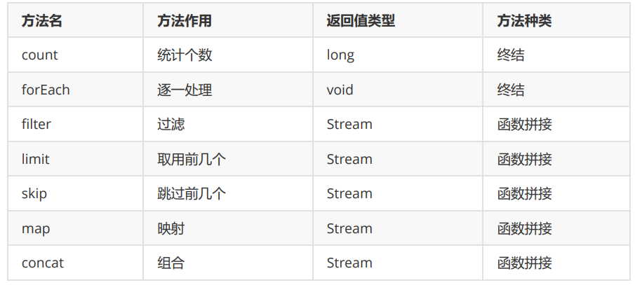

# JDK8新特性

## 一、Lambda表达式

### 1.1 Lambda表达式简介

> ​		Lambda 表达式（lambda expression）是用来简化我们使用匿名内部类调用方法的一种表达方式。


### 1.2 Lambda表达式使用前提

> 1. 方法的参数或局部变量类型必须为**接口**才能使用Lambda
> 2. 接口中**有且仅有一个**抽象方法(@FunctionalInterface)


### 1.3 Lambda表达式和匿名内部类的对比

> + 使用匿名内部类时存在的问题
>   + 必须重写被实现类中的抽象方法：所有的方法名称，方法参数，方法返回值不得不都重写一遍，而且不能出错。
>   + 而实际上，我们只在乎方法体中的代码。不在乎这个方法是什么命名。所以使用匿名内部类存在冗余
> + Lambda表达式和匿名内部类的对比
>   1. 所需类型不一样
>      + 匿名内部类的类型可以是 __类，抽象类，接口__
>      + Lambda表达式需要的类型必须是接口
>   2. 接口中抽象方法的数量不一样
>      + 匿名内部类所需接口中的抽象方法的数量是**随意**的
>      + Lambda表达式所需的接口中只能有一个抽象方法
>   3. ==实现原理不一样==
>      + 匿名内部类是在**编译**后形成一个class
>      + Lambda表达式是在**程序运行**的时候动态生成class


### 1.4 @FunctionalInterface注解

```java
// @FunctionalInterface是一个标志性注解，被该注解修饰的接口只能声明一个抽象方法。
@FunctionalInterface
interface LambdaTest {
    // 无参
    void method4NoParams();
    
    // 有参：基本数据类型
    // int method4BaseTypeParams(int i, int j);
    
    // 有参：引用数据类型 
    // int method4ReferenceTypeParams(Student i, Student j);
}
```


### 1.5 Lambda表达式语法

> ########################        标准写法         ########################
> (参数类型 参数名称) -> {
>     代码体;
> }
>
> 格式说明：
>     **(参数类型 参数名称)：**参数列表
>     **{代码体;}：**方法体
>     **->：**箭头，分割参数列表和方法体
>    
> ########################        **省略写法**         ########################
>
> 1. 小括号内的参数类型可以省略
> 2. 如果小括号内有且仅有一个参数，则<u>小括号</u>可以省略
> 3. 如果大括号内有且仅有一个语句，可以同时省略<u>大括号</u> ，<u>return 关键字</u>及<u>语句分号</u>（注意，这三样要就不省略，要就一起省略）。


### 1.6 Lambda表达式练习

```java
强转调用方法
((LambdaTest02)(i, j) -> i * j).method4BaseTypeParams(1, 2);

// 无参
LambdaTest lambda = () -> { System.out.println("lambda"); };
LambdaTest lambda = () -> System.out.println("lambda");     // 简写

// 有参
LambdaTest lambda3 = (int i, int j) -> i * j;
LambdaTest lambda3 = (i, j) -> i * j;    // 简化
```


### 1.7 Lambda表达式的原理

#### 1）匿名内部类的原理

> 会在编译时生成一个Class 文件。`XXXXX$1.class`。这个类会去实现对应接口。
>
> **可以使用反编译工具，也可以使用JDK自带的工具**：
>
> ```java
> javap -c -p 文件名.class
> 	- c:表示对代码进行反汇编
> 	- p:显示所有的类和成员
> ```
>

```java
static class DemoInnerClass$1 implements 接口名 {
    DemoInnerClass$1() {
    }
    
    public void run() {
	    System.out.println((new StringBuilder())
                           .append("新线程中执行的代码 : ").
                           append(Thread.currentThread().getName()).toString());
    }
}
```


#### 2）[Lambda表达式的实现原理](https://blog.csdn.net/langfeiyes/article/details/124671269)

- 类中lambda表达式写法

```java
public class InterfaceDemo {
    //定义函数接口方法
    public void hi(MyInterface myInterface){
        myInterface.sayHi();
    }
    public static void main(String[] args) {
        InterfaceDemo demo = new InterfaceDemo();
        demo.hi(()-> System.out.println("hello lambda..."));
    }
}
```


- 编译之后的写法：

```java
public class InterfaceDemo {
    //定义函数接口方法
    public void hi(MyInterface myInterface){
        myInterface.sayHi();
    }
    
    //编译器自动添加静态方法，方便动态生成的内部类调用
    private static void lambda$main$0(){
        System.out.println("hello lambda...");
    }
 
    public static void main(String[] args) {
        
        //编译器动态创建的局部内部类
        final class InterfaceDemo$$Lambda$14 implements MyInterface {
            private InterfaceDemo$$Lambda$14() {
            }
            @LambdaForm.Hidden
            public void sayHi() {
                InterfaceDemo.lambda$main$0();
            }
        }
        
        InterfaceDemo demo = new InterfaceDemo();
        demo.hi(new InterfaceDemo$$Lambda$14());
    }
}
```

Lambda表达式实现原理：

1. JDK编译时会给使用lambda表达式的类中添加一个**私有的，静态的方法**。命名格式：`lambda$方法名$序号` 

2. JDK编译时会动态的创建一个**局部内部类**，<u>该类实现了函数接口</u>，并重写了函数接口中唯一的抽象方法，在方法中直接调用步骤1中新增的**私有的，静态的方法**。

> ​		Lambda表达式就是一个语法糖，本质上还是常规的接口实现，只是将实现过程做了简化，这个实现过程对程序员是透明的。


## 二、接口中新增的方法

### 2.1 静态方法与默认方法区别

1. 默认方法通过实例调用，静态方法通过接口名调用 

2. 默认方法可以被继承，实现类可以直接调用接口默认方法，也可以重写接口默认方法 
3. 静态方法不能被继承，实现类不能重写接口的静态方法，只能使用接口名调用


### 2.2 使用技巧

- 如果在接口中扩展的内容是不允许子类重写的则使用`static`方法
- 如果在接口中扩展的内容是允许子类重写的则使用`default`方法


## 三、函数式接口

> ​		函数式接口(Functional Interface)就是一个**有且仅有一个**`抽象方法`，但是可以有**多个**`非抽象方法`的<font color="blue">接口</font>。

### 3.1 函数式接口的由来

​		使用Lambda表达式的前提是需要有`函数式接口`，而Lambda表达式在使用时并不关心<u>接口名</u>以及<u>抽象方法</u>名。只关心抽象方法的参数列表和返回值类型。因此，为了让我们使用Lambda表达式更加的方便，在JDK中提供了大量常用的函数式接口。


### 3.2 常用函数式接口

​		在JDK中给我们提供的函数式接口，主要是存在于 `java.util.function` 包中。

```
// 函数：一个参数一个结果【(参数1)->结果R】
Function<T, R>

// 函数：两个参数，一个结果【(参数1, 参数2)->结果R】
BiFunction<T, U, R>

// 提供|生产者：无中生有一个对象
Supplier<T>

// 消费者：一个参数没结果【(参数1)->void】 
Consumer<T>

// 消费者：两个参数没结果【(参数1, 参数2)->void】
BiConsumer<T, R>

// 一个参数，结果为boolean类型
Predicate<T>
```


## 四、方法引用

### 4.1 为什么要使用方法引用

> ​		在使用Lambda表达式的时候，也会出现代码冗余的情况。如果在Lambda表达式中要执行的代码和我们另一个方法中的代码是一样的，这时就没有必要再重写一份逻辑了，我们可以使用“**方法引用**”重复代码。

​		比如：用Lambda表达式求一个数组的和。

```java
public class FunctionRefTest01 {
    public static void main(String[] args) {
        printMax(a->{
            // Lambda表达式中的代码和 getTotal中的代码冗余了
            int sum = 0;
            for (int i : a) {
                sum += i;
            }
            System.out.println("数组之和：" + sum);
        });
    }
    /**
* 求数组中的所有元素的和
* @param a
*/
    public void getTotal(int a[]){
        int sum = 0;
        for (int i : a) {
            sum += i;
        }
        System.out.println("数组之和：" + sum);
    }
    private static void printMax(Consumer<int[]> consumer){
        int[] a= {10,20,30,40,50,60};
        consumer.accept(a);
    }
}
```


### 4.2 方法引用的使用

1. 符号表示： `::`。双冒号为方法引用运算符，而它所在的表达式被称为`方法引用`。

3. 常见的引用方式：

    - `instanceName::methodName`：对象::方法名
- `ClassName::staticMethodName`：类名::静态方法
    - `ClassName::methodName` 类名::普通方法
- 在Java中，类名只能调用静态方法。所以这里的类名引用实例方法是有前提的：**将参数列表中的第一个参数作为该方法的调用者**
    - `ClassName::new`：类名::new 调用的构造器
- `TypeName[]::new`：调用数组的构造器
  
4. 方法引用的注意事项：
    - 被引用的方法，**参数**要和**接口中的抽象方法的参数**一样
    - 当接口抽象方法有返回值时，被引用的方法也必须有返回值


#### 1）对象名::方法名

```java
private static void objMethodName() {
    Date now = new Date();
    /* 不使用方法引用 */
    Supplier<Long> supplier = () -> {
        return now.getTime();
    };
    System.out.println(supplier.get());

    /* 然后我们通过 方法引用 的方式来处理 */
    Supplier<Long> supplier1 = now::getTime;
    System.out.println(supplier1.get());
}
```


#### 2）类名::静态方法名

```java
private static void objStaticMethodName() {
    /* 不使用方法引用 */
    Supplier<Long> supplier1 = () -> {
        return System.currentTimeMillis();
    };
    System.out.println(supplier1.get());

    /* 通过 方法引用 来实现 */
    Supplier<Long> supplier2 = System::currentTimeMillis;
    System.out.println(supplier2.get());
}
```


#### 3）类名::引用实例方法

```java
private static void classNameInstance() {
    // 不使用方法引用
    Function<String, Integer> function = (s) -> {
        return s.length();
    };
    System.out.println(function.apply("hello"));

    // 通过方法引用来实现
    Function<String, Integer> function1 = String::length;
    System.out.println(function1.apply("hahahaha"));
    BiFunction<String, Integer, String> function2 = String::substring;
    String msg = function2.apply("HelloWorld", 3);
    System.out.println(msg);
}
```


#### 4）类名::构造器

```java
private static void classNameConstructor() {
    // 不使用方法引用
    Supplier<Person> sup = () -> {
        return new Person();
    };
    System.out.println(sup.get());

    // 然后通过 方法引用来实现
    Supplier<Person> sup1 = Person::new;
    System.out.println(sup1.get());
    BiFunction<String, Integer, Person> function = Person::new;
    System.out.println(function.apply("张三", 22));
}
```


#### 5）数组::构造器

```java
private static void arryConstructor() {
    Function<Integer, String[]> fun1 = (len) -> {
        return new String[len];
    };
    String[] a1 = fun1.apply(3);
    System.out.println("数组的长度是：" + a1.length);

    // 方法引用 的方式来调用数组的构造器
    Function<Integer, String[]> fun2 = String[]::new;
    String[] a2 = fun2.apply(5);
    System.out.println("数组的长度是：" + a2.length);
}
```


## 五、Stream API

### 5.1 为什么要使用Stream流

​		当我们在需要对集合中的元素进行操作的时候，除了必需的添加，删除，获取外，最典型的操作就是**集合遍历**。如果每次对集合中的元素进行某些操作时都需要手动进行循环遍历，未免也太过冗余繁琐。所以，我们需要有更加高效的处理方式，Stream流应运而生。


> **注意**：
>
> ​		`Stream流`并不能与`I/O流`相提并论，两者都不是一个东西！并且，Stream也不是一种数据结构，它不保存数据，而只是对数据进行加工处理。可以将Stream流式思想看作是“工厂车间流水线上的一个工序”，在流水线上，通过多个工序让一个原材料加工成一个商品。


### 5.2 Stream流的获取方式

#### 1）根据Collection获取

​		首先，java.util.Collection 接口中加入了default方法 `stream()`，也就是说Collection接口下的所有的实现类都可以通过`steam()`方法来获取Stream流。

```java
public static void main(String[] args) {
    List<String> list = new ArrayList<>();
    list.stream();
    Set<String> set = new HashSet<>();
    set.stream();
    Vector vector = new Vector();
    vector.stream();
}
```


​		但是Map接口并没有实现Collection接口，那这时怎么办呢？这时我们可以根据Map获取对应的`key | value`的集合。

```java
public static void main(String[] args) {
    Map<String, Object> map = new HashMap<>();
    Stream<String> keyStream = map.keySet().stream(); // key
    Stream<Object> valueStream = map.values().stream(); // value
    Stream<Map.Entry<String, Object>> entryStream = map.entrySet().stream(); // entry
}
```


#### 2）通过Stream的of方法

​		在实际开发中我们不可避免的还是会操作到`数组`中的数据，由于`数组对象`中不可能添加**默认方法**，所有Stream接口中都提供了**静态方法**`of()`。

```java
public static void main(String[] args) {
    Stream<String> a1 = Stream.of("a1", "a2", "a3");
    
    String[] arr1 = {"aa","bb","cc"};
    Stream<String> arr11 = Stream.of(arr1);
    
    Integer[] arr2 = {1,2,3,4};
    Stream<Integer> arr21 = Stream.of(arr2);
    arr21.forEach(System.out::println);
    
    // 注意：基本数据类型的数组是不行的!!!
    int[] arr3 = {1,2,3,4};
    Stream.of(arr3).forEach(System.out::println);
}
```


### 5.3 Stream常用方法介绍

​		Stream流模型的操作很丰富，这里介绍一些常用的API。这些方法可以被分成两种：

- **终结方法**：返回值类型不再是 Stream 类型的方法，即不再支持链式调用。终结方法包括 `count` 和 `forEach` 方法……
- **非终结方法**：返回值类型仍然是 Stream 类型的方法，即支持链式调用。（除了终结方法外，其余方法均为非终结方法。）




#### 1）map和reduce的组合

​		在实际开发中我们经常会将map和reduce一块来使用。

```java
public static void main(String[] args) {
    // 1.求出所有年龄的总和
    Integer sumAge = Stream.of(
        new Person("张三", 18)
        , new Person("李四", 22)
        , new Person("张三", 13)
        , new Person("王五", 15)
        , new Person("张三", 19)
        /* 实现数据类型的转换|映射 （Person --> int）*/
    ).map(Person::getAge)
        /*
                        T result = identity;
                        for (T element : this stream) {
                            result = accumulator.apply(result, element)
                        }
                        return result;
                 */
        /* .reduce(0, (a, b) -> a + b); */
        .reduce(0, Integer::sum);
    System.out.println(sumAge);

    // 2.求出所有年龄中的最大值
    Integer maxAge = Stream.of(
        new Person("张三", 18)
        , new Person("李四", 22)
        , new Person("张三", 13)
        , new Person("王五", 15)
        , new Person("张三", 19)
        /* 实现数据类型的转换，符合reduce对数据的要求 */
    ).map(Person::getAge)
        /* reduce实现数据的处理：获取两数最大值 */
        .reduce(0, Math::max);
    System.out.println(maxAge);

    // 3.统计 字符 a 出现的次数
    Integer count = Stream.of("a", "b", "c", "d", "a", "c", "a")
        /* 小技巧：数据转换 （"a" --> 1） */
        .map(ch -> "a".equals(ch) ? 1 : 0)
        /* reduce实现数据的处理：累加所有1 */
        .reduce(0, Integer::sum);
    System.out.println(count);
}
```


#### 2）mapToInt

​		如果需要将Stream中的Integer类型转换成int类型，可以使用mapToInt方法来实现。

​		为什么这样做？因为Integer所占用的内存比int多很多，并且在Stream流操作中会自动进行装箱与拆箱操作。则使用mapToInt是为了提高程序执行效率，与减少空间的占用。

```java
public static void main(String[] args) {
    // Integer占用的内存比int多很多，在Stream流操作中会自动装修和拆箱操作
    Integer[] arr = {1, 2, 3, 5, 6, 8};
    Stream.of(arr)
        .filter(i -> i > 0)
        .forEach(System.out::println);

    System.out.println("-----Integer to int----");

    // 为了提高程序代码的效率，我们可以先将流中Integer数据转换为int数据，然后再操作
    IntStream intStream = Stream.of(arr)
        .mapToInt(Integer::intValue);
    intStream.filter(i -> i > 3)
        .forEach(System.out::println);
}
```


#### 3）concat

​		如果有两个流，希望合并成为一个流，那么可以使用Stream接口的静态方法concat

```java
public static void main(String[] args) {
    Stream<String> stream1 = Stream.of("a","b","c");
    Stream<String> stream2 = Stream.of("x", "y", "z");
    // 通过concat方法将两个流合并为一个新的流
    Stream.concat(stream1, stream2).forEach(System.out::println);
}
```


### 5.4 Stream注意事项

1. Stream只能被操作一次，无法再次操作同一个Stream对象。

    ```java
    Stream<Integer> stream = Stream.of(1, 2, 3, 4, 5);
    stream.forEach((a) -> System.out.print(a + " "));
    
    /*
    	再次操作同一个Stream对象会报异常：
    		Exception in thread "main" java.lang.IllegalStateException: stream has already been operated upon or closed
    */
    stream.forEach(System.out::print);
    ```

2. Stream方法返回的是新的流

3. Stream不调用终结方法，中间的操作都不会被执行


### 5.5 Stream结果收集

#### 1）将结果收集到集合中

```java
public static void main(String[] args) {
    // 收集到 List 集合中
    List<String> list = Stream.of("aa", "bb", "cc", "aa")
        .collect(Collectors.toList());
    System.out.println(list);

    // 收集到 Set 集合中
    Set<String> set = Stream.of("aa", "bb", "cc", "aa")
        .collect(Collectors.toSet());
    System.out.println(set);

    // 收集后的类型为具体的集合实现，比如：ArrayList HashSet ……
    ArrayList<String> arrayList = Stream.of("aa", "bb", "cc", "aa")
        //.collect(Collectors.toCollection(() -> new ArrayList<>()));
        .collect(Collectors.toCollection(ArrayList::new));
    System.out.println(arrayList);

    HashSet<String> hashSet = Stream.of("aa", "bb", "cc", "aa")
        .collect(Collectors.toCollection(HashSet::new));
    System.out.println(hashSet);
}
```


#### 2）将结果收集到数组中

​		Stream中提供了`toArray`方法来将结果存放到一个数组中，返回值类型是`Object[]`，如果我们要指定返回的类型，那么可以使用另一个重载的`toArray(IntFunction f)`方法。

```java
public static void main(String[] args) {

    Object[] objects = Stream.of("aa", "bb", "cc", "aa")
        /* 返回的数组中的元素默认是 Object 类型 */
        .toArray(); 
    System.out.println(Arrays.toString(objects));

    /* 指定返回的数组中的元素类型 */
    String[] strings = Stream.of("aa", "bb", "cc", "aa")
        .toArray(String[]::new);
    System.out.println(Arrays.toString(strings));
}
```


#### 3）对流中的数据做聚合计算

​		当我们使用Stream流处理数据后，可以像数据库的`聚合函数`一样对某个字段进行操作，比如获得最大值，最小值，求和，平均值，统计数量。

```java

```


#### 4）对流中数据做分组操作


#### 5）对流中的数据做分区操作


#### 6）对流中的数据做拼接


### 5.6 并行的Stream流


## 六、[Optional](https://blog.csdn.net/xiao_yu_gan/article/details/125661440)类

​		`Optional`是`jdk8`推出的一个新类，为了减少代码中的判空代码，使代码更加干净整洁优雅，但**不会提高执行效率**。Optional是一个没有子类的工具类，是一个可以为null的容器对象，它的主要作用就是为了避免Null检查，防止NullpointerException。

​		当一个对象需要进行判空代码处理的时候，就可以考虑使用`Optional`。


## 七、重复注解与类型注解

[(115条消息) Java注解解读-ElementType详解_calmtho的博客-CSDN博客](https://blog.csdn.net/xtho62/article/details/113816008)

[【Java8新特性】重复注解与类型注解，你真的学会了吗？_冰河的技术博客_51CTO博客](https://blog.51cto.com/binghe001/5241117)

[Java注解 - 简书 (jianshu.com)](https://www.jianshu.com/p/9eb05ad1b725)

### 7.1 重复注解

​		自从Java 5中引入 `注解` 以来，注解开始变得非常流行，并在各个框架和项目中被广泛使用。不过注解有一个很大的限制是：在同一个地方不能多次使用同一个注解。JDK 8引入了**重复注解**的概念，允许在同一个地方多次使 用同一个注解。在JDK 8中使用`@Repeatable`注解定义重复注解。但前提是需要给这个重复注解定义一个**容器**。


- 定义一个重复注解的容器

```java
@Retention(RetentionPolicy.RUNTIME)
public @interface MyAnnotations {
    MyAnnotation[] value();
}
```


- 定义一个可以重复的注解

```java
@Repeatable(MyAnnotations.class)   // 绑定容器
@Retention(RetentionPolicy.RUNTIME)
public @interface MyAnnotation {
    String value();
}
```


- 重复使用注解

```java
@MyAnnotation("test1")
@MyAnnotation("test2")
@MyAnnotation("test3")
public class AnnoTest01 {
    @MyAnnotation("fun1")
    @MyAnnotation("fun2")
    public void test01(){
    }
}
```


- 解析得到指定的注解

```java
public static void main(String[] args) throws NoSuchMethodException {
    // 获取类中标注的重复注解
    MyAnnotation[] annotationsByType =
        AnnoTest01.class.getAnnotationsByType(MyAnnotation.class);
    for (MyAnnotation myAnnotation : annotationsByType) {
        System.out.println(myAnnotation.value());
    }
    
    // 获取方法上标注的重复注解
    MyAnnotation[] test01s = AnnoTest01.class.getMethod("test01")
        .getAnnotationsByType(MyAnnotation.class);
    for (MyAnnotation test01 : test01s) {
        System.out.println(test01.value());
    }
}
```


### 7.2 类型注解

JDK 8为`@Target`元注解新增了两种类型： `@TYPE_PARAMETER` ， `@TYPE_USE` 。 

- `TYPE_PARAMETER` ：表示该注解能写在类型参数（泛型）的声明语句中。
- `TYPE_USE` ：表示注解可以在任何用到类型的地方使用。


