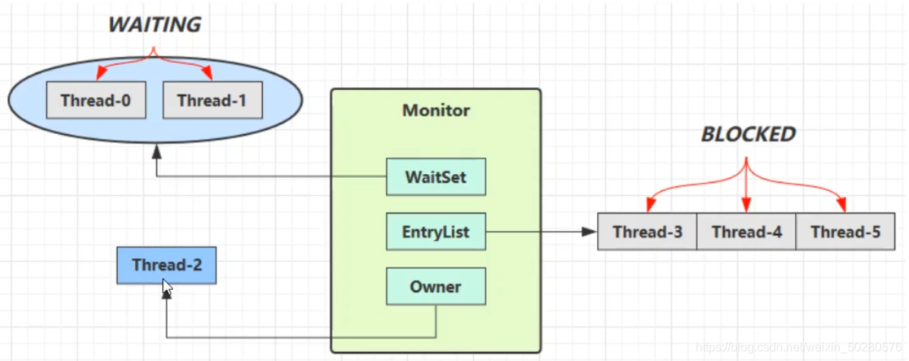

# JUC上篇

[Java 并发编程上篇](https://blog.csdn.net/weixin_50280576/article/details/113033975)

> ​		Synchronized 原理、LockSupport 原理、ReentrantLock 原理。

- POM依赖

```xml
<dependencies>
    <!-- junit单元测试 -->
    <dependency>
        <groupId>junit</groupId>
        <artifactId>junit</artifactId>
        <version>4.11</version>
        <scope>test</scope>
    </dependency>

    <!-- logback日志框架 -->
    <dependency>
        <groupId>ch.qos.logback</groupId>
        <artifactId>logback-classic</artifactId>
        <version>1.2.11</version>
    </dependency>

    <!-- lombok插件 -->
    <dependency>
        <groupId>org.projectlombok</groupId>
        <artifactId>lombok</artifactId>
        <version>1.18.24</version>
    </dependency>
</dependencies>
```


## 一、基本概念

### 1.1 进程与线程

#### 1）进程

- 程序由**指令**和**数据**组成,  但这些指令要运行,  数据要读写,  就必须**将指令加载至 CPU**,  **数据加载至内存**。在指令运行过程中还需要用到磁盘、网络等设备。**进程就是用来加载指令、管理内存、管理 I/O 的**。
- 程序是静止的,  进程实体的运行过程就是进程,  是系统进行**资源分配的基本单位**。当一个程序被运行,  从磁盘加载这个程序的代码至内存,  这时就开启了一个进程。
- **进程就可以视为程序的一个实例**。大部分程序可以同时运行多个实例进程（例如记事本、画图、浏览器 等）,  也有的程序只能启动一个实例进程（例如网易云音乐、360 安全卫士等）。


#### 2）线程

- 一个进程之内可以分为`一到多个`线程。
- **一个线程就是一个指令流**,  将指令流中的一条条指令以一定的顺序交给 CPU 执行 。
- 线程作为**最小调度单位**,  进程作为**资源分配的最小单位**。 在 windows 中进程是不活动的,  只是作为线程的容器。


#### 3）两者对比

- 进程之间是相互独立的,  而线程存在于进程内,  是进程的一个子集。进程拥有被分配的资源,  如内存空间等,  供其内部的线程共享
    - 进程间的通信较为复杂,  同一台计算机的进程通信称为 `IPC`（Inter-process communicatI/On）
    - 不同计算机之间的进程通信,  需要通过网络,  并遵守共同的协议,  例如 HTTP
- 线程通信相对简单,  因为它们共享进程内的内存。举一个例子：多个线程可以访问同一个共享变量。线程更加轻量,  `线程上下文`的切换成本一般要比`进程上下文`的切换成本低。


### 1.2 并发与并行

​		`并发(concurrent)`是`一个CPU`在不同的时间去不同的线程中执行指令（宏观上是同时发生,  微观上是CPU在很快的切换执行任务）。

​		`并行(parallel)`是`多个CPU`同时处理不同的线程。


> 引用 Rob Pike 的一段描述：
>
> - 并发（concurrent）是同一时间应对（dealing with）多件事情的能力
> - 并行（parallel）是同一时间动手做（doing）多件事情的能力


### 1.3 同步与异步

从调用方的角度讲,  如果：

- 需要等待结果返回才能继续运行的话就是**同步**
- 不需要等待就是**异步**


​		多线程可以使方法的执行变成异步的,  比如说要读取磁盘文件时,  假设读取操作花费了5秒,  如果没有线程的调度机制,  那么 CPU 只能等 5 秒,  啥都不能做。

​		比如在项目中,  视频文件需要转换格式等操作比较费时,  这时开一个新线程处理视频转换,  避免阻塞主线程。Tomcat 的异步 Servlet 也是类似的目的,  让用户线程处理耗时较长的操作,  避免阻塞 Tomcat 的工作线程。在 UI 程序中,  开线程进行其他操作,  避免阻塞 UI 线程。


### 1.4 结论

- 单核 CPU 的多线程不能实际提高程序的运行效率,  只是能够在不同的任务之间快速的切换。不同的线程之间会轮流的使用 CPU ,  而不至于一个线程总占用 CPU,  致使别的线程没法干活。
- 多核 CPU 可以并行跑多个线程,  但能否提高程序运行效率还是要分情况的
    - 有些任务,  经过精心设计,  将任务拆分,  并行执行,  当然可以提高程序的运行效率。但不是所有的计算任务都能拆分（参考后文的【阿姆达尔定律】）
    - 也不是所有任务都需要拆分,  任务的目的如果不同,  谈拆分和效率没啥意义


> ​		I/O 操作不占用 CPU,  只是我们一般拷贝文件使用的是【阻塞 I/O】,  这时相当于线程虽然不用 CPU,  但需要一直等待 I/O 结束,  导致未能充分利用线程。所以才有后面的【非阻塞 I/O】和【异步 I/O】优化。


## 二、Java 多线程

### 2.1 线程的创建与运行

#### 1）使用 Thread

> ​		【**线程**】和【**任务**】（要执行的代码）耦合到一起了。

```java
public static void main(String[] args) {
    // 匿名内部类方式创建 Thread
    Thread t = new Thread("t1") {
        @Override
        public void run() {
            log.debug("running--t1");
        }
    };

    t.start();
    log.debug("running--main");
}
```


#### 2）使用 Runnable 配合 Thread（推荐）

> ​		把【**线程**】和【**任务**】（要执行的代码）分开。用 Runnable 更容易与`线程池`等高级 API 配合,  用 Runnable 让任务类脱离了 Thread 的继承体系,  更加灵活。
>
> - Thread代表线程
> - Runnable代表可运行的任务（线程要执行的代码）

```java
public static void main(String[] args) {
    
    // 因为 Runnable 接口标注了 @FunctionalInterface 注解,  表示是一个函数式接口,  所以可以使用 lambda表达式
    Runnable r = () -> log.debug("running--t1");
    new Thread(r,   "t1").start();
}
```


#### 3）使用 FutureTask 配合 Thread

```java
public static void main(String[] args) 
    throws ExecutionException,   InterruptedException {
    // 1. 使用 FutureTask 传入 Callable 接口方式创建
    FutureTask<Integer> future = new FutureTask<Integer>(() -> {
        log.debug("running...t1");
        Thread.sleep(2000); // 休眠
        return 100;
    });
    
    // 2. 传入 future,   因为 FutureTask 这个类是实现了 RunnableFuture 接口,  RunnableFuture 继承了 Runnable 接口
    Thread t1 = new Thread(future,   "t1");
    t1.start();
    
    // 3. 获取返回结果时
    // 当主线程获取 t1 线程的返回值时,   需要等 2 秒,  此时主线程进入阻塞状态
    log.debug("task return：{}",    future.get());
    
    log.debug("running--main");
}
```

​		Future 就是对于具体的 Runnable 或者 Callable 任务的执行结果进行取消、查询是否完成、获取结果。必要时可以通过 get 方法获取执行结果,  该方法会阻塞直到任务返回结果。

```java
public interface Future<V> {
	// 取消任务
	boolean cancel(boolean mayInterruptIfRunning);
	// 获取任务执行结果
	V get() throws InterruptedException,   ExecutionException;
	// 获取任务执行结果,  带有超时时间限制
	V get(long timeout,   TimeUnit unit) throws InterruptedException,                               ExecutionException,    TimeoutException;
	// 判断任务是否已经取消
	boolean isCancelled();
	// 判断任务是否已经结束
	boolean isDone();
}
```

FutureTask 类是 Future 接口和 Runable 接口的实现,  弥补了Runnable创建线程没有返回值的缺陷,  [点这里了解](https://mp.weixin.qq.com/s/RX5rVuGr6Ab0SmKigmZEag)


### 2.2 线程运行原理

#### 1）栈与栈帧

虚拟机栈描述的是Java方法执行的内存模型：

​		当Java中使用多线程时,  每个线程都会维护它自己的`栈`！线程内的每个方法被执行的时候会在栈中创建一个`栈帧(stack frame)`用于存储局部变量表、操作数栈、动态链接、方法出口等信息,  这些信息都是**线程私有**的。


#### 2）线程上下文切换（Thread Context Switch）

因为以下一些原因导致 CPU 不再执行`当前的线程`,  转而执行`另一个线程`的代码：

**被动原因：**

- 分配给线程的 CPU 时间片用完
- 垃圾回收
- 有更高优先级的线程需要运行

**主动原因：**

- 线程自己调用了 sleep、yield、wait、join、park、synchronized、lock 等方法


> ​		当 Context Switch 发生时,  需要由操作系统保存当前线程的状态,  并恢复另一个线程的状态,  Java 中对应的概念就是`程序计数器（Program Counter Register）`,  它的作用是记住下一条 JVM 指令的执行地址,  是线程私有的。


### 2.3 Thread 的常见方法

| 方法名  | static | 功能说明                                        | 注意                                                         |
| ------- | ------ | ----------------------------------------------- | ------------------------------------------------------------ |
| start() |        | 启动一个新线程,  在新线程中运行 run 方法中的代码 | start 方法只是让线程进入就绪状态,  里面代码不一定立刻运行,  只有当 CPU 将时间片分给线程时,  才能进入运行状态,  执行代码。每个线程的 start 方法只能调用一次,  调用多次就会出现 IllegalThreadStateException |
| run() |      | 新线程启动会调用的方法 | 如果在构造 Thread 对象时传递了 Runnable 参数,  则线程启动后会调用 Runnable 中的 run 方法,  否则默认不执行任何操作。但可以创建 Thread 的子类对象,  来覆盖默认行为 |
| join()       |      | 等待线程运行结束                 |         |
| join(long n) |      | 等待线程运行结束,最多等待 n 毫秒 |         |
| getId()      |      | 获取线程长整型的 id              | id 唯一 |
| getName()    |      | 获取线程名                       |         |
| setName(String)  |      | 修改线程名     |                                                              |
| getPriority()    |      | 获取线程优先级 |                                                              |
| setPriority(int) |      | 修改线程优先级 | java中规定线程优先级是1~10 的整数,  较大的优先级能提高该线程被 CPU 调度的机率 |
| getState()      |      | 获取线程状态                   | Java 中线程状态是用 6 个 enum 表示,  分别为：NEW, RUNNABLE, BLOCKED, WAITING, TIMED_WAITING, TERMINATED |
| isInterrupted() |      | 判断是否被打断                 | 不会清除 打断标记（不会改true为false）                             |
| isAlive()       |      | 线程是否存活（还没有运行完毕） |                                                              |
| interrupt() |      | 打断线程 | 如果被打断的线程正在 sleep,  wait,  join ,  则会导致被打断的线程抛出 `InterruptedException`,  并**清除打断标记为`false`**；如果打断的是正在运行的线程,  则会设置打断标记为true,  park 的线程被打断,  也会设置打断标记为true |
| interrupted()   | static | 判断当前线程是否被打断 | 会清除 打断标记（将标记置为false） |
| currentThread() | static | 获取当前正在执行的线程 |                 |
| sleep(long n) | static | 让当前执行的线程休眠n毫秒,  休眠时让出 cpu 的时间片给其它线程 |      |
| yield() | static | 提示线程调度器让出当前线程对CPU的使用 | 主要是为了测试和调试 |


不推荐使用的方法：

- `stop()`：强制停止线程运行
- `suspend()`：挂起（暂停）当前线程的运行
- `resume()`：恢复线程运行


#### 1）start() VS run()

- 直接调用 `run()` 方法

```java
public static void main(String[] args) {

    Thread t1 = new Thread(new Runnable() {
        @Override
        public void run() {
            log.info(Thread.currentThread().getName() + " running....");
        }
    },   "t1");

    // 测试通过 Thread 类实例 t1 对象直接调用 run 方法
    t1.run();

    log.info(Thread.currentThread().getName() + " running...");
}

// ------------------结果
14:56:56 [main] c.Code_05_Test - main running....
14:56:56 [main] c.Code_05_Test - main running...
```


- 调用 `start()` 方法

```java
public static void main(String[] args) {

    Thread t1 = new Thread(new Runnable() {
        @Override
        public void run() {
            log.info(Thread.currentThread().getName() + " running....");
        }
    },   "t1");

    // 测试通过 Thread 类实例 t1 对象直接调用 run 方法
    //        t1.run();
    // 调用 start 方法
    t1.start();

    log.info(Thread.currentThread().getName() + " running...");
}

// ------------------结果
14:59:35 [main] c.Code_05_Test - main running...
14:59:35 [t1] c.Code_05_Test - t1 running....
```

> ​		可以发现两种方式的调用结果是不一样的：
>
> - 使用 `start` 方式,  CPU 会为创建的线程分配时间片,  线程进入**运行**状态,  然后线程调用 `run` 方法执行逻辑。
> - 直接使用 `run` 的方式,  虽然会创建线程,  但是它是直接调用方法,  而不是像 `start` 方式那样触发的,  所以这个线程对象会一直处在**新建**状态。从结果上也可以看出,  run 方法是 main 线程调用,  而不是 t1 线程。


#### 2）sleep()与yield()

- **sleep (使线程阻塞)**

1. 调用 sleep 会让当前线程从 `Running` 进入 `Timed Waiting` 状态（阻塞）,  可通过`state()`方法查看
2. 其它线程可以使用 `interrupt` 方法打断正在睡眠的线程,  这时 sleep 方法会抛出 `InterruptedException`
3. 睡眠结束后的线程未必会立刻得到执行（处于**就绪**状态）
4. 建议用 `TimeUnit` 中的 `sleep` 代替 Thread 的 sleep 来获得更好的可读性


- **yield （让出当前线程）**

1. 调用 yield 会让当前线程从 `Running` 进入 Runnable **就绪**状态（仍然有可能被执行,  在就绪状态重新得到CPU时间片）,  然后调度执行其它线程
2. 具体的实现依赖于操作系统的`任务调度器`


- **线程优先级**

    ​		线程优先级会提示（hint）调度器优先调度该线程,  但它仅仅是一个提示,  调度器可以忽略它。它的作用更能体现在：**如果 CPU 比较忙,  那么优先级高的线程会获得更多的时间片,  但 CPU 比较空闲时,  设置优先级几乎没作用**。


#### 3）join() 方法

​		**用于等待某个线程结束**。哪个线程调用`join()`方法,  就等待哪个线程结束,  然后再去执行其他线程。
如在主线程中调用`ti.join()`,  则是主线程等待t1线程结束,  join 采用同步。

```java
Thread t1 = new Thread();
//等待 t1 线程执行结束
t1.join();
// 最多等待 1000ms。当然,  如果 1000ms 内线程执行完毕,  则会直接执行下面的语句,  不会等够 1000ms
t1.join(1000);
```


#### 4）interrupt() 方法

**interrupt 打断线程有两种情况,  如下**：

- **<font color="red">打断正常</font>**：如果一个线程在运行中被打断,  打断标记会被置为 `true`。

- **<font color="red">打断阻塞</font>**：如果打断的是被执行`sleep`、`wait`、`join`方法而阻塞的线程,  则会抛出InterruptedException异常,  并将打断标记清除为 `false` 。此时,  如果想让标记置为true,  可以在捕获到异常的`catch块`中,  再执行一次`interrupt()`方法。

- **<font color="red">打断park</font>**：park 的线程被打断,  打断标记会被设置为true。**当打断标记为true时,  会让park失效**。

```java
/**
 * @description 打断正常运行
 * @author Jun Lu
 * @date 2023-03-30 11:00:22
 */
@Slf4j
public class InterruptForRunning {
    public static void main(String[] args) {
        Thread t1 = new Thread(() -> {
            while (true) {
                Thread currentThread = Thread.currentThread();
                if(currentThread.isInterrupted()) {
                    log.debug(currentThread.getName() + "被interrupt了！");
                    break;
                }
            }
        },   "t1");

        t1.start();
        t1.interrupt();

        log.info("t1.isInterrupted() = " + t1.isInterrupted());
    }
}

/**
 * @description 打断阻塞
 * @author Jun Lu
 * @date 2023-03-30 11:00:06
 */
@Slf4j
public class InterruptForBlock {
    public static void main(String[] args) throws InterruptedException {
        Thread t1 = new Thread(() -> {
            Thread currentThread = Thread.currentThread();
            try {
                log.debug("sleep");
                TimeUnit.SECONDS.sleep(20L);
                log.debug("wake up");
            } catch (InterruptedException e) {
                e.printStackTrace();
                log.info("catch before = " + currentThread.isInterrupted());
                currentThread.interrupt();
                log.info("catch after = " + currentThread.isInterrupted());
            }
        },   "t1");

        t1.start();
        TimeUnit.SECONDS.sleep(1L);
        log.info("t1---interrupt");
        t1.interrupt();
        log.info("t1.isInterrupted() = " + t1.isInterrupted());
    }
}
```


#### 5）isInterrupted()方法 与 interrupted()方法

​		首先,  `isInterrupted` 是实例方法,  `interrupted` 是静态方法,  它们的用处都是查看当前打断的状态,  但是 isInterrupted 方法查看线程的时候,  不会将打断标记**清空（置为 false）**。使用interrupted 查看线程打断状态后,  会将打断标志置空。

​		简单来说：

- `interrupt()` 方法类似于 `setter` 设置中断值
- `isInterrupted() 类似`于 `getter` 获取中断值
- `interrupted()` 类似于 `getter + setter` 先获取中断值,  然后清除标志。

```java
/**
 * 测试 isInterrupted 与 interrupted
 */
@Slf4j
public class Code_14_Test {

    public static void main(String[] args) throws InterruptedException {

        Thread t1 = new Thread(() -> {
            log.info("park");
            LockSupport.park();
            log.info("unpark");
            //            log.info("打断标记为:{}",   Thread.currentThread().isInterrupted());
            log.info("打断标记为:{}",   Thread.interrupted());

            // 使用 Thread.currentThread().isInterrupted() 查看打断标记为 true,   LockSupport.park() 失效
            /**
             * 执行结果：
             * 11:54:17 [t1] c.Code_14_Test - park
             * 11:54:18 [t1] c.Code_14_Test - unpark
             * 11:54:18 [t1] c.Code_14_Test - 打断标记为:true
             * 11:54:18 [t1] c.Code_14_Test - unpark
             */
            // 使用 Thread.interrupted() 查看打断标记为 true,   然后清空打断标记为 false,   LockSupport.park() 不失效
            /**
             * 执行结果：
             * 11:58:12 [t1] c.Code_14_Test - park
             * 11:58:13 [t1] c.Code_14_Test - unpark
             * 11:58:13 [t1] c.Code_14_Test - 打断标记为:true
             */
            LockSupport.park();
            log.info("unpark");

        },   "t1");

        t1.start();
        Thread.sleep(1000); // 主线程休眠 1 秒
        t1.interrupt();
    }
}
```


#### 6）守护线程

​		默认情况下,  java进程需要等待所有的线程结束后才会停止,  但是有一种特殊的线程,  叫做`守护线程`。它的特点是：**在其它线程全部结束的时候即使守护线程还未结束,  java进程也会停止**。

​		普通线程t1可以调用 `t1.setDeamon(true);` 方法变成守护线程。

> ​		注意：垃圾回收器线程就是一种守护线程； Tomcat 中的 Acceptor 和 Poller 线程也是守护线程。所以 Tomcat 接收到 `shutdown` 命令后,  不会等待它们处理完当前请求。


### 2.4 线程的状态

#### 1）OS线程的5种状态

> ​		从操作系统层划分,  线程有 5 种状态。

|                       OS层的线程状态                        |
| :---------------------------------------------------------: |
|  |


1. **初始状态**：仅仅是在语言层面上创建了线程对象,  即`Thead thread = new Thead();`,  还未与操作系统线程关联。
2. **可运行状态（就绪状态）**：指该线程已经被创建,  并与操作系统相关联了,  只要CPU给它分配时间片就可运行了。
3. **运行状态**：指线程获取到了CPU的时间片,  正在运行。当CPU时间片用完之后,  线程会转换至【**就绪状态**】,  并等待 CPU 再次分配时间片。这会导致我们前面讲到的`上下文切换`。
4. **阻塞状态**
    - 如果调用了阻塞API,  如BIO读写文件,  那么线程实际上不会用到CPU,  不会分配CPU时间片,  而会导致上下文切换,  进入【**阻塞状态**】
    - 等待BIO操作完毕,  会由操作系统唤醒阻塞的线程,  转换至【**就绪状态**】
    - 与【**就绪状态**】的区别是,  只要操作系统一直不**唤醒**线程,  调度器就一直不会考虑调度它们,  CPU就一直不会分配时间片
5. **终止状态**：表示线程已经执行完毕,  生命周期已经结束,  不会再转换为其它状态。


#### 2）Java线程的6种状态

[java有几种线程状态](https://www.php.cn/java/base/498212.html)

​		从 Java API 层面来看,  线程被定义为了 6 种状态。可以参考文章,  [点这里](https://blog.csdn.net/pange1991/article/details/53860651)

|             Java API 层面的线程状态             |
| :---------------------------------------------: |
|  |

1. **初始(NEW)**：新创建了一个线程对象,  但还没有调用start()方法。
2. **运行(RUNNABLE)**：Java线程中将【**就绪（Ready）**】和【**运行中（Running）**】两种状态笼统的称为“==运行==”。线程对象创建后,  当其他的线程（比如main线程）调用了该对象的`start()`方法。该状态的线程位于可运行线程池中,  等待被线程调度选中,  获取CPU的使用权,  此时处于【**就绪状态**】。就绪状态的线程在获得CPU时间片后变为【**运行中状态**】。
3. **阻塞(BLOCKED)**：表示线程并未获取到锁,  并阻塞于锁。
4. **等待(WAITING)**：线程已经获取到了锁,  但线程需要等待其他线程做出一些特定动作（通知或中断）才能继续向下执行。
5. **超时等待(TIMED_WAITING)**：该状态不同于WAITING,  它可以在指定的时间后自行返回。
6. **终止(TERMINATED)**：表示该线程已经执行完毕。

> ​		BLOCKED、WAITING、TIMED_WAITING是Java中对**阻塞**状态的细分。


- - - Demo：演示 Java 线程的 6 种状态

```java
/**
 * 演示 java 线程的 6 种状态(NEW,   RUNNABLE,   TERMINATED,   BLOCKED,   WAITING,   TIMED_WAITING)
 */
@Slf4j
public class ThreadSixStatus {

    public static void main(String[] args) {

        // NEW
        Thread t1 = new Thread(() -> {
            log.info("NEW 状态");
        },   "t1");

        // RUNNABLE
        Thread t2 = new Thread(() -> {
            while (true) {

            }
        },   "t2");

        t2.start();

        // TERMINATED
        Thread t3 = new Thread(() -> {
            log.info("running");
        },   "t3");
        t3.start();

        // TIMED_WAITING
        Thread t4 = new Thread(() -> {
            synchronized (ThreadSixStatus.class) {
                try {
                    Thread.sleep(100000);
                } catch (InterruptedException e) {
                    e.printStackTrace();
                }
            }
        },   "t4");
        t4.start();

        // WAITING
        Thread t5 = new Thread(() -> {
            try {
                t2.join();
            } catch (InterruptedException e) {
                e.printStackTrace();
            }
        },   "t5");
        t5.start();

        // BLOCKED
        Thread t6 = new Thread(() -> {
            synchronized (ThreadSixStatus.class) {
                try {
                    Thread.sleep(100000);
                } catch (InterruptedException e) {
                    e.printStackTrace();
                }
            }
        },   "t6");
        t6.start();

        // 主线程休眠 1 秒,   目的是为了等待 t3 线程执行完
        try {
            Thread.sleep(1000);
        } catch (InterruptedException e) {
            e.printStackTrace();
        }

        log.info("t1 线程状态: {}",   t1.getState());
        log.info("t2 线程状态: {}",   t2.getState());
        log.info("t3 线程状态: {}",   t3.getState());
        log.info("t4 线程状态: {}",   t4.getState());
        log.info("t5 线程状态: {}",   t5.getState());
        log.info("t6 线程状态: {}",   t6.getState());
    }
}
```


## 三、共享模型之管程

### 3.1 线程共享带来的问题

> ​		线程出现问题的根本原因是**线程上下文切换**,  导致线程里的指令没有执行完就切换执行其它线程了。


- 示例

```java
public static int count = 0;
public static void main(String[] args) throws InterruptedException {
    Thread t1 = new Thread(() -> {
        for (int i = 1;i < 5000; i++){
            count++;
        }
    });
    Thread t2 = new Thread(() -> {
        for (int i = 1;i < 5000; i++){
            count--;
        }
    });
    t1.start();
    t2.start();
    t1.join();
    t2.join();
    log.debug("count的值是{}",  count);
}
```

​		这个示例中,   当执行 `count++` 或者 `count--` 操作的时候,  从字节码分析,  实际上是 **4 步**操作。

```java
/* count++的字节码操作如下：*/
getstatic i // 获取静态变量i的值
iconst_1 // 准备常量1
iadd // 自增
putstatic i // 将修改后的值存入静态变量i

// ----------------------------------------------------
    
/* count--的字节码操作如下：*/
getstatic i // 获取静态变量i的值
iconst_1 // 准备常量1
isub // 自减
putstatic i // 将修改后的值存入静态变量i
```


**情况一**：每条<font color="blue">指令顺序执行</font>,  最终数据**不会产生问题**


**情况二**：最终数据**出现问题**的原因是：<font color="blue">指令交错执行</font>


<center>AND</center>


#### 1）临界区

> ​		一段代码块内如果存在对**共享资源（临界资源）**的多线程读写操作,  则称这段`代码块`为**<font color="red">临界区</font>**。


#### 2）竞态条件(Race Condition)|竞态危害

> ​		**所谓竞态条件,  指的是程序的执行结果依赖<font color="green">线程</font>执行的顺序**。

​		举例来说,  如果计算机中的两个[进程]()同时试图修改一个共享内存的内容,  在没有[并发控制]()的情况下,  最后的结果**依赖于两个进程的执行顺序与时机**。而且如果发生了并发访问冲突,  则最后的结果是不正确的。


​		一个程序运行多个线程本身是没有问题的,  问题出在多个线程访问**共享资源**：

- 若多个线程对共享资源产生读写操作时没有发生指令交错,  而是**顺序执行指令**,  不会出现问题
- 若多个线程对共享资源产生读写操作时发生了**指令交错**,  就会出现问题


### 3.2 竞态条件解决方案

#### 1）解决手段

为了避免`临界区`中的`竞态条件`发生,  有多种手段可以解决。

- **阻塞式解决方案**：synchronized ,  Lock
- **非阻塞式解决方案**：`原子变量`的CAS操作

​		现在讨论使用 **synchronized** 来进行解决,  即俗称的`对象锁`,  它采用互斥的方式让同一时刻至多只有一个线程持有对象锁,  其他线程如果想获取这个锁就会阻塞住,  这样就能保证拥有锁的线程可以安全的执行临界区内的代码,  不用担心线程上下文切换。


#### 2）synchronized 语法

```java
synchronized(对象) {
	//临界区
}
```


##### ① synchronized 加在`成员方法`上

> ​		锁住的是对象。

```java
public class Test {
	// 在方法上加上synchronized关键字
	public synchronized void test() {
	
	}
	// 等价于
	public void test() {
		synchronized(this) { // 锁住的是对象
		
		}
	}
}
```


##### ② synchronized 加在`静态方法`上

> ​		锁住的是类。

```java
public class Test {
	// 在静态方法上加上 synchronized 关键字
	public synchronized static void test() {
	
	}
	//等价于
	public void test() {
		synchronized(Test.class) { // 锁住的是类
		
		}
	}
}
```


### 3.3 变量的线程安全分析

#### 1）成员变量和静态变量的线程安全分析

- 如果变量没有被线程共享,  那么线程对该变量的操作是安全的
- 如果变量存在线程间共享
    - 如果只有`读操作`,  则线程安全
    - 如果有`读写操作`,  则这段代码就是`临界区`,  需要考虑线程安全问题


#### 2）局部变量线程安全分析

- 局部变量**被初始化为基本数据类型**是安全的。即：数据直接保存在线程私有的栈中,  不被其它线程共享。
- 局部变量是`引用类型`或者是对象引用则未必是安全的
    - 如果**局部变量引用的对象没有引用线程共享的对象**,  那么是线程安全的
    - 如果**局部变量引用的对象引用了一个线程共享的对象**,  那么要考虑线程安全问题


#### 3）实现线程安全的三种方式

1. 无共享变量
2. 共享变量**不可变**|**私有不可变** 
3. 同步


### 3.4 Monitor 概念

#### 1）Java 对象头

|                         对象的结构                          |
| :---------------------------------------------------------: |
|  |


​		以 32 位虚拟机为例,  普通对象的对象头结构如下,  其中的 `Klass Word` 为指针,  指向对应的 Class 对象。

- 普通对象


- 数组对象


- Mark Word 结构


#### 2）Monitor 原理

​		`Monitor` 被翻译为`监视器`或者说`管程`。每个 java 对象都可以关联一个 Monitor ,  如果使用 synchronized 给对象上锁（**重量级**）,  该对象头的 Mark Word 就被设置为指向 `Monitor 对象`的指针。


- 刚开始时,   Monitor 中的 `Owner` 为 null
- 当 Thread-2 执行 `synchronized(obj){}` 代码时就会将 Monitor 的所有者Owner 设置为 Thread-2,  上锁成功。在Monitor 中同一时刻只能有一个 Owner
- 当 Thread-2 占据锁时,  如果线程 Thread-3 ,  Thread-4 也来执行synchronized(obj){} 代码,  就会进入 `EntryList`（**阻塞队列**） 中变成`BLOCKED`（**阻塞**） 状态
- Thread-2 执行完同步代码块的内容,  然后唤醒 EntryList 中等待的线程来竞争锁,  这个竞争是**<font color="blue">非公平的</font>**
- 图中 WaitSet 中的 Thread-0,  Thread-1 是之前获得过锁,  但条件不满足进入 `WAITING` 状态的线程,  后面讲 wait-notify 时会分析

> ​		注意：
>
> - synchronized 必须是进入**同一个对象**的 monitor 才有上述的效果。
> - 不加 synchronized 的对象不会关联监视器,  即不遵从以上规则。


### 3.5 synchronized 原理进阶

#### 1）synchronized 用于同步代码块与同步方法原理

[深入分析Synchronized原理](https://www.cnblogs.com/aspirant/p/11470858.html)


#### 2）轻量级锁

> > ​		简而言之：**轻量级锁就是线程栈中的一条锁记录**。
>
> ​		轻量级锁的使用场景是：如果有**多个线程**要对**同一个对象**进行加锁,  但加锁的时间是错开的（也就是==没有竞争==）,  那么可以使用轻量级锁来进行优化。
>
> ​		轻量级锁对使用者是`透明`的,  即语法仍然是 `synchronized`。

- 假设有两个方法同步块,  给同一个对象加锁【**<font color="red">锁重入</font>**】

```java
static final Object obj = new Object();

public static void method1() {
     synchronized( obj ) {
         // 同步块 A
         method2();
     }
}
public static void method2() {
     synchronized( obj ) {
         // 同步块 B
     }
}
```


1. 每次执行到 synchronized 代码块时,  都会创建一个`锁记录（Lock Record）对象`,  锁记录内部可以储存对象的 `Mark Word` 和对象引用 `Object reference`。


2. 让锁记录中的 `Object reference` 指向对象,  并且尝试用 `CAS(compare and sweep)` 替换 Object 对象的 Mark Word ,  将 Mark Word 的值存入锁记录中。


3. 如果 CAS 替换成功,  那么对象的对象头储存的就是`锁记录的地址`和`状态 00` 表示轻量级锁,  如下所示


4. 如果**<font color="red">CAS</font>失败**,  有两种情况：

- 如果是`其它线程`已经持有了该 Object 的轻量级锁,  那么表示有竞争,  首先会进行自旋锁,  自旋一定次数后,  如果还是失败就进入锁膨胀阶段。
- 如果是`自己的线程`已经执行了 synchronized 进行加锁,  那么再添加一条 Lock Record 作为重入的计数。


5. 当线程退出 synchronized 代码块的时候,  如果获取的是取值为 null 的锁记录,  表示有重入,  这时重置锁记录,  表示重入计数减一


6. 当线程退出 synchronized 代码块的时候,  如果获取的锁记录取值不为 null,  那么使用 CAS 将 Mark Word 的值恢复给对象

- `成功`，则解锁成功

- `失败`,  则说明轻量级锁进行了锁膨胀或已经升级为重量级锁,  进入重量级锁解锁流程


#### 3）锁膨胀

> ​		如果在尝试加`轻量级锁`的过程中,  CAS 操作无法成功,  这是有一种情况就是其它线程已经为这个对象加上了轻量级锁,  这是就要进行锁膨胀,  将轻量级锁变成重量级锁。【**有锁竞争,  就不能使用轻量级锁了,  需要使用重量级锁**】


1. 当 Thread-1 进行轻量级加锁时,  Thread-0 已经对该对象加了轻量级锁


2. 这时 Thread-1 加轻量级锁失败,  进入锁膨胀流程,  

- 首先为对象申请Monitor锁,  让Object指向重量级锁地址
- 然后自己进入Monitor 的EntryList 变成`BLOCKED`状态


3. 当 Thread-0 退出 synchronized 同步块时,  使用 CAS 将 Mark Word 的值恢复给对象头,  对象的对象头指向 Monitor,  那么会进入重量级锁的解锁过程,  即按照 Monitor 的地址找到 Monitor 对象,  将 Owner 设置为 null ,  唤醒 EntryList 中的 Thread-1 线程。


#### 4）自旋优化

> ​		重量级锁竞争的时候,  还可以使用自旋来进行优化,  如果当前线程自旋成功（即**在自旋的时候持锁的线程释放了锁**）,  那么当前线程就可以不用进行`上下文切换`（阻塞）就获得了锁。

1. 自旋重试成功的情况


2. 自旋重试失败的情况：**自旋了一定的次数还是没有等到持锁的线程释放锁**

> ​		自旋会占用 CPU 时间。单核 CPU 自旋就是浪费,  多核 CPU 自旋才能发挥优势。在 Java 6 之后自旋锁是自适应的,  比如对象刚刚的一次自旋操作成功过,  那么认为这次自旋成功的可能性会高,  就多自旋几次；反之,  就少自旋甚至不自旋,  总之,  比较智能。Java 7 之后不能控制是否开启自旋功能。


#### 5）偏向锁

> ​		在轻量级的锁中,  我们可以发现,  如果**<font color="red">同一个线程</font>对<font color="red">同一个对象</font>进行重入锁**时,  也需要执行 `CAS` 操作,  这是需要耗费资源的。那么 Java6 开始引入了`偏向锁`,  只有当第一次使用 CAS 时会将对象的 `Mark Word` 头设置为`偏向线程`的ID,  之后这个线程再进行**<font color="green">重入锁</font>**时,  发现线程 ID 是自己的,  那么就不用再进行CAS了。
>
> ​		偏向锁只适合大部分没有锁竞争的系统中（也可以说是只有一个线程执行同步块的场景）,  但如果系统中存在大量被争用的锁时,  会导致持有锁的线程不断的进行上下文切换,  这时可以考虑关闭偏向锁。

- **分析代码,  比较轻量级锁与偏向锁**。

```java
static final Object obj = new Object();
public static void m1() {
	synchronized(obj) {
		// 同步块 A
		m2();
	}
}
public static void m2() {
	synchronized(obj) {
		// 同步块 B
		m3();
	}
}
public static void m3() {
	synchronized(obj) {
		// 同步块 C
	}
}
```


##### ① 偏向状态

- 一个对象的创建过程
    - 如果开启了`偏向锁`（默认是开启的）,  那么对象刚创建之后,  Mark Word 最后三位的值为101,  并且这时它的 Thread,  epoch,  age 都是 0 ,  在加锁的时候这些值才会被设置；
    - 偏向锁默认是**延迟开启**的,  不会在程序启动的时候立刻生效,  如果想避免延迟,  可以添加虚拟机参数来禁用延迟：`-XX:BiasedLockingStartupDelay=0` ；
    - 注意：**处于偏向锁的对象**解锁后,  线程 id 仍存储于对象头中。


##### ② 撤销偏向

以下几种情况会使对象的偏向锁失效

- 调用对象的 `hashCode` 方法
- 多个线程使用该对象
- 调用了 `wait`/`notify` 方法（调用wait方法会导致锁膨胀而使用重量级锁）


##### ③ 小结

- 当没有锁竞争（只有一个线程执行同步代码块）时,  执行`synchronized`,  加上的是偏向锁（偏向当前线程的锁）；
- 当<font color="blue">多个线程</font>之间**交错运行**锁住同一个对象的同步代码块时（没有线程对锁的竞争）,  此时（执行`synchronized`）,  会`撤销`掉偏向锁,  升级为轻量锁。当同步代码块被执行结束后,  会成为`无锁`状态。|||但是,  如果撤销偏向锁的次数超过了阈值（默认20）,  将不会考虑继续撤销偏向锁,  而是会`批量重偏向`至当前加锁的线程。|||如果撤销偏向锁的次数超过了阈值40,  JVM会觉得,  并不是偏向错了,  而是压根就不该偏向,  因为当前环境中存在多个线程,  有可能会发生锁竞争。此时,  会进行`批量撤销`操作,  会将当前整个类中的所有对象都变为不可偏向的,  就连新建的对象也是不可偏向的；【注意：对于撤销偏向锁的计数是针对于类中的对象,  而不是线程】
- 当多个线程之间存在锁竞争时,  `轻量锁`会锁膨胀至`重量级锁`。


## 四、Wait与Notify

### 4.1 原理



- 当锁对象调用`wait`方法时,  就会使当前线程进入 `WaitSet` 中,  变为 `WAITING` 状态。
- 处于`BLOCKED`和 `WAITING` 状态的线程都为**阻塞**状态,  CPU 都不会分给他们时间片。但是有所区别：
    - `BLOCKED` 状态：当某个线程想获取锁,  并发现 Monitor 的 `Owner` 已经指向了一个线程,  则线程会进入 `EntryList` 中,  并处于 BLOCKED 状态；
    - `WAITING` 状态：线程已经获得了对象的锁,  但由于某些原因需要进入阻塞状态。例如：当锁对象调用了 `wait` 方法,  就会处于 WAITING 状态,   并被加入 WaitSet 中。
- BLOCKED 状态的线程会在`锁`被释放的时候被唤醒,  如果是处于 WAITING 状态的线程，只有满足了所需原因才可以进一步的向下执行。例如，调用了`wait`方法之后，只有被锁对象调用了 `notify | notifyAll` 方法后才会被唤醒。

> ​		注：只有当对象加锁以后,  才能调用 wait 和 notify 方法。


### 4.2 Wait 与 Sleep 的区别

- Sleep 是 Thread 类的静态方法；Wait 是 Object 的成员方法,  Object 又是所有类的父类,  所以所有类中都有Wait方法。在使用 wait 时,  一般会搭配 notify 或者 notifyAll 来使用,  不然会让线程一直等待；
- Sleep 在阻塞的时候**不会释放锁**,  而 Wait 在阻塞的时候会释放锁,  但是它们**都会释放 CPU 资源**；
- Sleep 不需要与 synchronized 一起使用,  而 Wait 需要与 synchronized 一起使用。即：**对象被锁住以后才能使用对象中的`wait|notify|notifyAll`方法**。


### 4.3 优雅地使用 wait/notify

**<font color="#57d2f5">什么时候适合使用wait</font>**：

- 当线程**不满足某些条件**,  需要暂停运行时,  可以使用 wait 。这样会**<font color="red">将对象的锁释放</font>**,  让其他线程能够继续运行。如果此时使用 sleep,  **会导致所有线程都进入阻塞**,  导致所有线程都没法运行,  直到当前线程 sleep 结束后,  运行完毕,  才能继续执行。


**<font color="#57d2f5">使用wait/notify需要注意什么</font>**：

- 当有多个线程在运行时,  对象调用了 wait 方法,  此时这些线程都会进入 WaitSet 中等待。如果这时使用了 `notify` 方法,  可能会**造成虚假唤醒**（唤醒的不是满足条件的等待线程）,  这时就需要使用 `notifyAll` 方法。


**<font color="#57d2f5">wait/notify使用模板</font>**：

```java
synchronized (lock) {
	while( /* 不满足条件,  一直等待,  避免被【虚假唤醒】 */ ) {
		lock.wait();
	}
	// 当满足条件后再运行
}

synchronized (lock) {
	// 当条件准备好之后,  唤醒所有等待线程
	lock.notifyAll();
}
```


### 4.4 小结

[notify和wait的原理（wait以及notify方法区别于联系）](http://www.studyofnet.com/688163274.html)

1. 调用 wait 时,  首先需要确保调用 wait 方法的线程已经持有了对象的锁（调用 wait 方法的代码片段需要放在 `sychronized块`或者 `sychronized方法`中,  这样才可以确保线程在调用wait方法前已经获取到了对象的锁）
2. 当调用 wait 时,  该线程就会释放掉这个对象的锁,  然后进入等待状态 (wait set)
3. 当线程调用了 wait 后进入到等待状态时,  它就可以等待其他线程调用相同对象的 notify 或者 notifyAll 方法使得自己被唤醒
4. 一旦这个线程被其它线程唤醒之后,  该线程就会与其它线程开始竞争这个对象的锁(公平竞争)；只有当该线程获取到对象的锁后,  线程才会继续往下执行
5. 当调用对象的 notify 方法时,  他会随机唤醒对象等待集合 (wait set) 中的任意一个线程,  当某个线程被唤醒后,  它就会与其它线程一同竞争对象的锁
6. 当调用对象的 notifyAll 方法时,  它会唤醒该对象等待集合 (wait set) 中的所有线程,  这些线程被唤醒后,  又会开始竞争对象的锁
7. 在某一时刻,  只有唯一的一个线程能拥有对象的锁


## 五、park与unpark

### 5.1 基本使用

​		`park` & `unpark` 是 LockSupport 线程通信工具类中的静态方法。

```java
// 暂停当前线程
LockSupport.park();
// 恢复某个线程的运行
LockSupport.unpark;
```


### 5.2 信号量与条件变量

​		`信号量(mutex)`可以实现进程之间的同步和互斥,  但要设置很多信号量,  使用大量的P、V操作,  还要仔细安排多个P操作的排列次序,  否则将出现错误的结果或出现死锁现象。为了解决这些问题引入了管程。

​		`条件变量(condition)`的作用：条件变量是一种机制,  使得进程不仅能被挂起,  而且当条件满足且管程再次可用时,  可以恢复该进程并允许它在挂起点重新进入管程。管程必须使用条件变量提供对同步支持,  这些条件变量包含在管程中,  并且只有在管程中才能被访问。


### 5.3 park & unpark 原理

> ​		每个线程都有自己的一个 Parker 对象,  由三部分组成 `_counter`,   `_cond(condition)` 和 `_mutex`。

#### 1）特点

​		**unpark 可以在线程暂停(park)前调用,  也可以在线程暂停后(park)调用**。

- **暂停后调用**：能让被park暂停的线程恢复运行；
- **暂停前调用**：unpark（线程对象A）,  接下来再在线程对象A中调用park,  A仍会继续运行。


#### 2）原理

1. 每个线程都有一个自己的Parker对象,  对象里有三个变量`_mutex`,  `_cond`,  `_counter`；
2. **先调用park,  再调用unpark**：先调用**park**,  线程会看一下`_counter`是不是0。是0,  就阻塞在`_cond`里,  并再赋值0给`_counter`。再调用**unpark**,  `_counter`被赋值为1,  并唤醒`_cond`里的线程,  然后再把`_counter`置为0,  线程恢复运行；
3. **先调用unpark,  再调用park**：先调用**unpark**,  `_counter`被置为1。再调用**park**,  发现`_counter`是1,  则不需要阻塞于`_cond`,  而是继续运行,  并把`_counter`置为0。

> ​		就算多次调用 unpark ,  `_counter`永远都只能被置为1。


#### 3）先调用park再调用unpark

- **先调用 park**：

1. 当前线程调用 Unsafe.park() 方法
2. 检查 _counter ,  本情况为 0,  这时,  获得 _mutex 互斥锁(mutex对象有个等待队列 _cond)
3. 线程进入 _cond 条件变量阻塞
4. 设置 _counter = 0


- **再调用 upark**：

1. 调用 Unsafe.unpark(Thread_0) 方法,  设置 _counter 为 1
2. 唤醒 _cond 条件变量中的 Thread_0
3. Thread_0 恢复运行
4. 设置 _counter 为 0


#### 4）先调用unpark再调用park

1. 调用 Unsafe.unpark(Thread_0) 方法,  设置 _counter 为 1
2. 当前线程调用 Unsafe.park() 方法
3. 检查 _counter ,  本情况为 1,  这时线程无需阻塞,  继续运行
4. 设置 _counter 为 0


#### 5）小结

​		`wait`,  `notify`,  `notifyAll` 必须和锁配合使用,  而park和unpark则不用。
​		park和unpark是以==线程==为单位**精准阻塞**和**唤醒线程**,  而notify是==随机唤醒一个线程==、notifyAll是==唤醒所有的等待线程==。


## 六、活跃性

### 6.1 定义

​		由于某些原因,  导致代码一直无法执行完毕,  这种现象就叫做**活跃性**。


### 6.2 死锁

#### 1）定义

> ​		死锁就是：两个或两个以上的线程在执行过程中,  由于竞争资源或者由于彼此通信而造成的一种**阻塞**的现象,  若无外力作用,  它们都将无法推进下去。 【**死锁就是一种无限期阻塞**】


​		如：t1 线程获得 A 对象锁,  接下来想获取 B 对象的锁。t2 线程获得 B 对象锁,  接下来想获取 A 对象的锁。

```java
public static void main(String[] args) {
    final Object A = new Object();
    final Object B = new Object();
    new Thread(()->{
        synchronized (A) {
            try {
                Thread.sleep(2000);
            } catch (InterruptedException e) {
                e.printStackTrace();
            }
            synchronized (B) {

            }
        }
    }).start();

    new Thread(()->{
        synchronized (B) {
            try {
                Thread.sleep(1000);
            } catch (InterruptedException e) {
                e.printStackTrace();
            }
            synchronized (A) {

            }
        }
    }).start();
}
```


#### 2）发生死锁的必要条件

- **互斥条件**：在一段时间内,  一种资源只能被一个进程所使用；
- **请求和保持条件**：进程已经拥有了至少一种资源,  同时又去申请其他资源。因为其他资源被别的进程所使用,  该进程进入阻塞状态,  并且不释放自己已有的资源；
- **不剥夺条件**：进程对已获得的资源在未使用完成前不能被剥夺,  只能在进程使用完后自己释放；
- **循环等待条件**：发生死锁时,  必然存在一个进程间资源请求的循环链。


#### 3）检测死锁的方法

**方法一**：

- `JConsole`找到本地进程
- 找到线程选项卡，然后点击`检查死锁`
- 找到`blocked`状态的线程，看它所分配资源的拥有者

**方法二**：

- JVM自带的命令`jps`查看进程id
- `Jstack`根据进程id来查看栈的使用情况


#### 4）出现了死锁，怎样恢复正常

- **重启系统**：代价大，之前的工作全部白费，所有正在运行的现场都无法被保护；

- **撤销进程，剥夺资源**：终止参与死锁的进程，回收他们占的资源，从而解除死锁。这又分两种：
    - `一次性撤销`：一次性撤销掉参与死锁的全部进程，剥夺全部资源；
    - `逐步撤销`：逐步撤销需要按一定的原则，目的是撤销代价最小的进程，比如**按优先级确定线程代价**。

- **进程回退**：将死锁的线程回退到没有发生死锁的某一个时刻，并让其继续执行。


#### 5）避免死锁的方法

要避免死锁，只要破坏掉产生死锁的四个条件中的其中一个就可以了：

- **破坏互斥条件**：这个条件我们没有办法破坏,  因为我们用锁的前提本就是资源是临界资源，是需要互斥访问的；
- **破坏请求与保持条件**：一次性申请所有的资源。
- **破坏不剥夺条件**：占用部分资源的线程进一步申请其他资源时,  如果申请不到,  可以<u>主动释放</u>掉它占有的资源。
- **破坏循环等待条件**：使用有序资源排序法。即：**顺序加锁**。取得a资源后方可获取b资源，那么就不会出现b资源被使用却在等待a资源，所以就不会产生死锁。

|                          顺序加锁                           |
| :---------------------------------------------------------: |
|  |


#### ==6）避免死锁案例==


### 6.3 活锁

#### 1）定义

> ​		多个线程之间**互相改变对方的结束条件**,  导致谁也无法结束。


#### 2）避免活锁的方法

​		在线程执行时,  中途给予**不同的间隔时间**。


#### 3）死锁与活锁的区别

- 死锁是因为线程互相持有对象想要的锁,  并且都不释放,  而导致的**线程阻塞,  停止运行**的现象。
- 活锁是因为线程间修改了对方的结束条件,  而导致代码**一直在运行,  却一直运行不完**的现象。


#### 4）饥饿

​		某些线程因为**优先级**太低,  导致一直无法获得资源的现象。在使用顺序加锁时,  可能会出现饥饿现象。


## 七、ReentrantLock

### 7.1 简介

和 synchronized 相比具有的特点

- 可中断
- 可以设置超时时间
- 可以设置为公平锁 (先到先得)
- 支持多个条件变量( 具有多个 WaitSet)

```java
// 获取ReentrantLock对象
private ReentrantLock lock = new ReentrantLock();
// 加锁
lock.lock();

try {
	// 需要执行的代码
}finally {
	// 释放锁
	lock.unlock();
}
```


### 7.2 ReentrantLock锁特性

#### 1）可重入

​		**可重入**是指==同一个线程==如果首次获得了这把锁,  那么因为它是这把锁的拥有者,  因此有权利再次获取这把锁。但如果是**不可重入锁**,  那么再次去获取锁时,  自己也会被锁挡住。


#### 2）可打断

​		如果某个线程处于**阻塞**状态,  可以调用其 `interrupt` 方法让其停止阻塞。简而言之就是：**处于阻塞状态的线程,  被打断了就不用阻塞了,  直接停止运行**。


#### 3）锁超时

​		使用 **lock.tryLock** 方法会返回获取锁是否成功,  如果成功则返回 true ,  反之则返回 false。tryLock 方法还可以指定等待时间,  参数为：`tryLock(long timeout,   TimeUnit unit)`,  其中 `timeout` 为最长等待时间,  `TimeUnit` 为时间单位。

​		简而言之就是：获取锁失败了、获取超时了或者被打断了,  不再阻塞,  直接停止运行。


- **不设置等待时间**

```java
public static void main(String[] args) {
    ReentrantLock lock = new ReentrantLock();
    Thread t1 = new Thread(() -> {
        try {
            // 加锁,  可打断锁
            lock.lockInterruptibly();
        } catch (InterruptedException e) {
            e.printStackTrace();
            // 被打断,  返回,  不再向下执行
            return;
        }finally {
            // 释放锁
            lock.unlock();
        }

    });

    lock.lock();
    try {
        t1.start();
        Thread.sleep(1000);
        // 打断
        t1.interrupt();
    } catch (InterruptedException e) {
        e.printStackTrace();
    } finally {
        lock.unlock();
    }
}
```


- **设置等待时间**

```java
public static void main(String[] args) {
    ReentrantLock lock = new ReentrantLock();
    Thread t1 = new Thread(() -> {
        try {
            // 判断获取锁是否成功,  最多等待1秒
            if(!lock.tryLock(1,   TimeUnit.SECONDS)) {
                System.out.println("获取失败");
                // 获取失败,  不再向下执行,  直接返回
                return;
            }
        } catch (InterruptedException e) {
            e.printStackTrace();
            // 被打断,  不再向下执行,  直接返回
            return;
        }
        System.out.println("得到了锁");
        // 释放锁
        lock.unlock();
    });


    lock.lock();
    try{
        t1.start();
        // 打断等待
        t1.interrupt();
        Thread.sleep(3000);
    } catch (InterruptedException e) {
        e.printStackTrace();
    } finally {
        lock.unlock();
    }
}
```


#### 4）公平锁

​		线程获取锁失败,  进入阻塞队列。先进入的会在锁被释放后先获得锁。像这样的获取方式就是公平的。

```java
// 默认是不公平锁,  需要在创建时指定为公平锁
ReentrantLock lock = new ReentrantLock(true);
```


#### 5）多个条件变量

​		在 `synchronized` 中也有条件变量,  即：`waitSet`。当条件不满足时进入waitSet 等待。
ReentrantLock 的条件变量比 synchronized 强大之处在于,  它是**支持多个条件变量**的。

> ​		对于只支持一个条件变量的synchronized 来说,  不满足条件的线程都会在同一间“休息室”中等消息；而 ReentrantLock 支持多间休息室,  就比如有专门等烟的休息室、专门等早餐的休息室、唤醒时也是按休息室来唤醒。


### 7.3 使用要点

- await 前需要获得锁
- await 执行后,  会释放锁,  进入 `conditionObject` 等待
- await 的线程被唤醒（或打断、或超时）后,  会重新公平竞争 lock 锁
- 竞争 lock 锁成功后,  从 await 后继续执行


## 八、上篇小结

本章我们需要重点掌握的是

- 分析多线程访问共享资源时,  哪些代码片段属于临界区
- 使用 synchronized 互斥解决临界区的线程安全问题
    - 掌握 synchronized 锁对象语法
    - 掌握 synchronzied 加载成员方法和静态方法语法
    - 掌握 wait/notify 同步方法
- 使用 lock 互斥解决临界区的线程安全问题 掌握 lock 的使用细节：可打断、锁超时、公平锁、条件变量
- 学会分析变量的线程安全性、掌握常见线程安全类的使用
- 了解线程活跃性问题：死锁、活锁、饥饿
- 应用方面
    - 互斥：使用 synchronized 或 Lock 达到共享资源互斥效果,  实现原子性效果,  保证线程安全。
    - 同步：使用 wait/notify 或 Lock 的条件变量来达到线程间通信效果。
- 原理方面
    - monitor、synchronized 、wait/notify 原理
    - synchronized 进阶原理
    - park & unpark 原理
- 模式方面
    - 同步模式之保护性暂停
    - 异步模式之生产者消费者
    - 同步模式之顺序控制