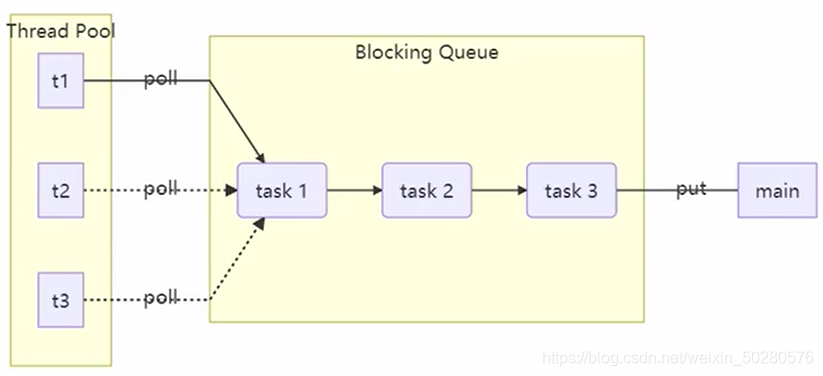
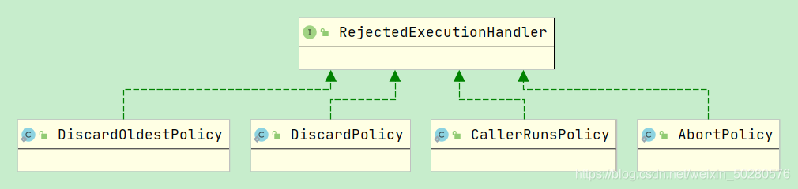
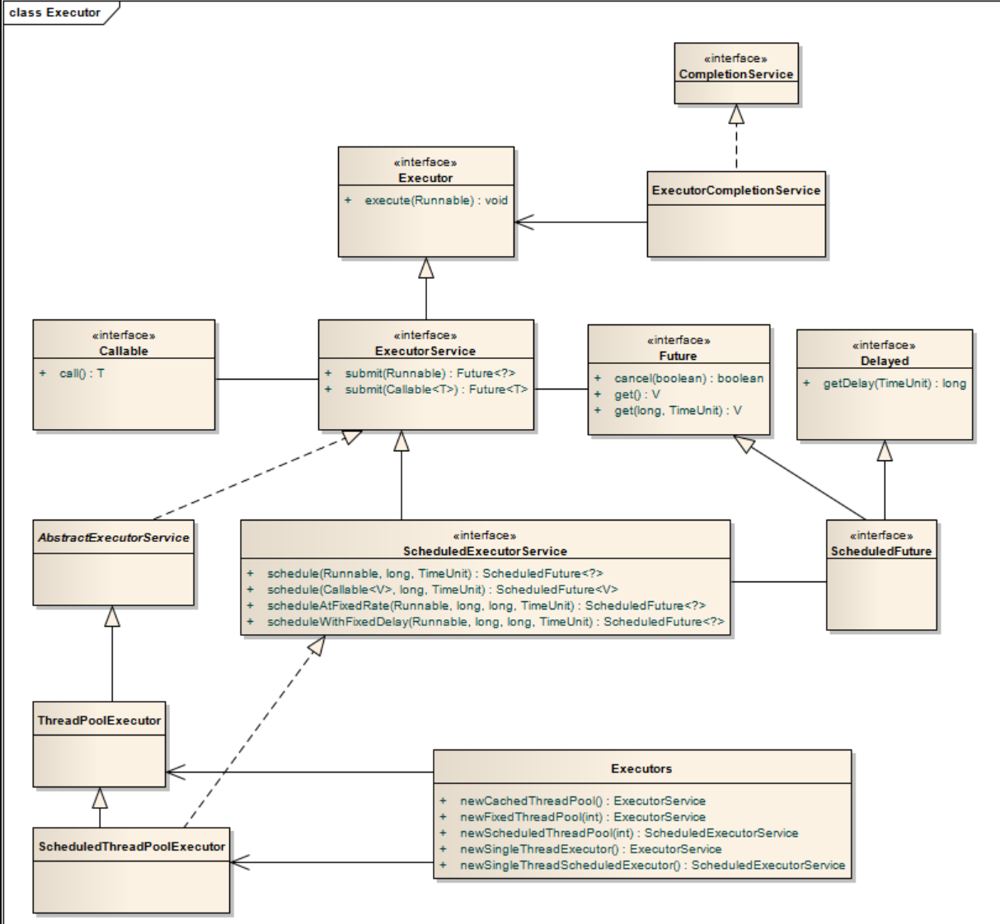

# JUC下篇

> ​		线程池。


## 一、共享模型之工具

### 1.1 线程池

​		`池化技术`想必大家已经屡见不鲜了，线程池、数据库连接池、Http 连接池等等都是对这个思想的应用。池化技术的思想主要是为了**减少每次获取资源的消耗，提高对资源的利用率**。

​		线程池提供了一种限制和管理资源（包括执行一个任务）。 每个线程池还维护一些基本统计信息，例如已完成任务的数量。这里借用《Java 并发编程的艺术》提到的来说一下使用线程池的好处：

- **降低资源消耗**。通过重复利用已创建的线程降低线程创建和销毁造成的消耗。
- **提高响应速度**。当任务到达时，任务可以不需要的等到线程创建就能立即执行。
- **提高线程的可管理性**。线程是稀缺资源，如果无限制的创建，不仅会消耗系统资源，还会降低系统的稳定性，使用线程池可以进行统一的分配，调优和监控。

> ​		同时，阿里巴巴在其《Java开发手册》中也强制规定：==线程资源必须通过线程池提供，不允许在应用中自行显式创建线程==。


### 1.2 自定义线程池

|                     自定义线程池架构图                      |
| :---------------------------------------------------------: |
|  |

​		上图就是一个线程池的实现，先初始化`线程池`、`阻塞队列`，然后开几个线程通过线程池对象调用方法执行任务，线程池中的线程会执行任务。但如果任务过多，会将来不及处理的任务添加至阻塞队列中，执行完任务再从阻塞队列中取值继续执行。当执行的线程数大于线程池和阻塞队列的大小，我们可以定义拒绝策略，类似 JDK 线程池那样。


### 1.3 线程池的使用

[(109条消息) 【Thread】线程池的 7 种创建方式及自定义线程池_sco5282的博客-CSDN博客](https://blog.csdn.net/sco5282/article/details/120963463)

线程池的创建方法总共有 7 种，但总体来说可分为 2 类：

- 通过 `ThreadPoolExecutor` 创建的线程池：1种
- 通过 `Executors` 创建的线程池：6种


1. `Executors.newFixedThreadPool`：创建一个**固定大小**的线程池，可控制并发的线程数，超出的线程会在队列中等待；
2. `Executors.newCachedThreadPool`：创建一个**可缓存**的线程池，若线程数超过处理所需，缓存一段时间后会回收，若线程数不够，则新建线程；
3. `Executors.newSingleThreadExecutor`：创建一个只有**单个线程**的线程池，它可以保证先进先出的执行顺序；
4. `Executors.newScheduledThreadPool`：创建一个可以执行**延迟任务**的线程池；
5. `Executors.newSingleThreadScheduledExecutor`：创建一个**单线程的可以执行延迟任务**的线程池；
6. `Executors.newWorkStealingPool`：创建一个**抢占式执行**的线程池（任务执行顺序不确定）JDK 1.8 添加；
7. `ThreadPoolExecutor`：最原始的创建线程池的方式，它包含了 7 个参数可供设置。


> ​		**单线程池的意义：** 虽然 `newSingleThreadExecutor` 和 `newSingleThreadScheduledExecutor` 是单线程池，但提供了工作队列，生命周期管理，工作线程维护等功能，如果是手动new一个线程，则缺少对其的维护，在使用时会特别不好管理。


#### 1）ThreadPoolExecutor

##### ① 线程池状态

​		`ThreadPoolExecutor` 使用 int 的`高 3 位`来表示**线程池状态**，`低 29 位`表示**线程数量**，ThreadPoolExecutor 类中的线程状态变量如下：

| 状态名称   | 高3位的值 | 描述                                                         |
| ---------- | --------- | ------------------------------------------------------------ |
| RUNNING    | 111       | 接收新任务，同时处理任务队列中的任务                         |
| SHUTDOWN   | 000       | 不会接收新任务，但会将任务队列中的任务处理完                 |
| STOP       | 001       | 中断正在执行的任务，同时抛弃任务队列中的任务                 |
| TIDYING    | 010       | 当任务执行完毕，并且活动着的线程数为0时，表示即将进入终结状态（善后） |
| TERMINATED | 011       | 终结状态                                                     |


==线程池状态==和==线程池中线程的数量==由一个`原子整型ctl`来表示：

- 使用一个数来表示两个值的主要原因是：**<font color="red">可以通过一次CAS同时更改两个属性的值</font>**。

```java
// 原子整数，前 3 位保存了线程池的状态，剩余位保存的是线程数量
private final AtomicInteger ctl = new AtomicInteger(ctlOf(RUNNING, 0));

// 并不是所有平台的 int 都是 32 位。
// 去掉前三位保存线程状态的位数，剩下的用于保存线程数量
// 高3位为0，剩余位数全为1
private static final int COUNT_BITS = Integer.SIZE - 3;

// 2^COUNT_BITS次方，表示可以保存的最大线程数
// CAPACITY 的高3位为 0
private static final int CAPACITY   = (1 << COUNT_BITS) - 1;


/* 获取线程池状态、线程数量以及合并两个值的操作 */
// Packing and unpacking ctl
// 获取运行状态
// 该操作会让除高3位以外的数全部变为0
private static int runStateOf(int c)     { return c & ~CAPACITY; }

// 获取运行线程数
// 该操作会让高3位为0
private static int workerCountOf(int c)  { return c & CAPACITY; }

// 计算ctl新值
private static int ctlOf(int rs, int wc) { return rs | wc; }
```


##### ② 线程池属性

```java
// 工作线程，内部封装了Thread
private final class Worker
        extends AbstractQueuedSynchronizer
        implements Runnable {
    ...
}

// 阻塞队列，用于存放来不及被核心线程执行的任务
private final BlockingQueue<Runnable> workQueue;

// 锁
private final ReentrantLock mainLock = new ReentrantLock();

//  用于存放核心线程的容器，只有当持有锁时才能够获取其中的元素（核心线程）
private final HashSet<Worker> workers = new HashSet<Worker>();
```


##### ③ 构造方法参数 | `线程池核心参数`

​		首先我们看一下 `ThreadPoolExecutor` 类参数最多、最全的有参构造方法。根据这个构造方法，JDK `Executors` 类中提供了众多**工厂方法**来创建各种用途的线程池。

```java
public ThreadPoolExecutor(
    // 核心线程数
    int corePoolSize, 
    // 最大线程数。【maximumPoolSize - corePoolSize = 救急线程数】
    int maximumPoolSize,
    // 救急线程空闲时的最大生存时间
    long keepAliveTime,
    // 时间单位
    TimeUnit unit,
    /*
    	阻塞队列（存放任务）：
    	- 有界阻塞队列：ArrayBlockingQueue
    	- 无界阻塞队列：LinkedBlockingQueue
    	- 最多只有一个同步元素的队列：SynchronousQueue
    	- 优先队列：PriorityBlockingQueue
    */
    BlockingQueue<Runnable> workQueue,
    // 线程工厂（给线程取名字，做一系列的装潢）
    ThreadFactory threadFactory,
    // 自定义拒绝策略
    RejectedExecutionHandler handler
){……}
```


##### ④ 线程池的工作流程

1. 线程池中刚开始没有线程，当一个任务提交给线程池后，线程池会创建一个新线程来执行任务。

2. 当线程数达到 `corePoolSize` 并且**没有线程空闲**时，再加入任务，这些新加的任务就会被加入 `workQueue` 队列中排队，直到有空闲的线程时为止。

3. 如果队列选择了**有界队列**，那么当任务超过了队列大小时，会创建 `maximumPoolSize - corePoolSize` 数目的**救急线程**来执行这些超出队列大小的任务。

4. 当高峰过去后，**救急线程**在空闲一段时间后需要被 结束|回收 以节省资源，这个时间可由 `keepAliveTime` 和 `unit` 来控制。

5. 如果线程数超过了 `maximumPoolSize` ，并且仍然有新任务过来，这时会执行**拒绝策略**。<font color="blue">JDK 提供了 4 种拒绝策略的实现</font>：

    - `ThreadPoolExecutor.AbortPolicy` 会让调用者抛出`RejectedExecutionException` 异常，这是**默认策略**；

    - `ThreadPoolExecutor.CallerRunsPolicy`：会让<u>调用者</u>自己执行任务；

    - `ThreadPoolExecutor.DiscardPolicy`：放弃执行本次任务；

    - `ThreadPoolExecutor.DiscardOldestPolicy`：放弃队列中最早入队的任务，让本任务取而代之。

JDK 线程池的**拒绝策略结构图**如下：




> 扩展：
>
> ​		<font color="blue">其它著名框架中提供的不同拒绝策略</font>：
>
> - Dubbo 的实现，在抛出 RejectedExecutionException 异常之前会记录日志，并 dump 线程栈信息，方便定位问题；
>
> - Netty 的实现，是创建一个新线程来执行任务；
>
> - ActiveMQ 的实现，带超时等待（60s）尝试放入队列，类似我们之前自定义的拒绝策略；
>
> - PinPoint 的实现，它使用了一个拒绝策略链，会逐一尝试策略链中每种拒绝策略。
>


submit()方法用于提交需要返回值的任务。线程池会返回一个future类型的对象，通过这个future对象可以判断任务是否执行成功，并且可以通过future的get()方法来获取返回值，get()方法会阻塞当前线程直到任务完成，而使用get（long timeout，TimeUnitunit）方法则会阻塞当前线程一段时间后立即返回，这时候有可能任务没有执行完。


##### ⑤ 常用方法

###### Ⅰ. 提交|执行任务

```java
/* 
	执行|提交任务：
		用于提交不需要返回值的任务，所以无法判断任务是否已经被线程池执行成功~
*/
void execute(Runnable command);

/* 
	执行|提交任务：
		用于提交需要返回值的任务。线程池会返回一个future类型的对象，通过这个future对象可以判断任务是否执行成功，并且可以通过future的get()方法来获取返回值（若发生了异常，则异常对象会被封装至此方法中，在调用时会自动抛出异常对象）。
		- get()方法会阻塞当前线程直到任务完成。
		- get(long timeout, TimeUnit unit)方法则会阻塞当前线程一段时间后立即返回，这时候有可能任务没有执行完。
*/	
<T> Future<T> submit(Callable<T> task);

// 提交 tasks 中所有任务，并用List集合封装任务的执行结果
<T> List<Future<T>> invokeAll(Collection<? extends Callable<T>> tasks)
    throws InterruptedException;

// 提交 tasks 中的所有任务，带超时时间
<T> List<Future<T>> invokeAll(Collection<? extends Callable<T>> tasks,
                              long timeout, TimeUnit unit)
    throws InterruptedException;

// 提交 tasks 中的所有任务，哪个任务先成功执行完毕，就返回此任务的执行结果，其它未执行完毕的任务则被取消
<T> T invokeAny(Collection<? extends Callable<T>> tasks)
    throws InterruptedException, ExecutionException;

// 提交 tasks 中所有任务，哪个任务先成功执行完毕，就返回此任务执行结果，其它未执行完毕的任务则被取消，带超时时间
<T> T invokeAny(Collection<? extends Callable<T>> tasks,
                long timeout, TimeUnit unit)
    throws InterruptedException, ExecutionException, TimeoutException;
```


###### Ⅱ. 关闭线程池

**shutdown**：

```java
/*
  线程池状态变为 SHUTDOWN
	- 不会接收新任务
	- 但已提交任务会执行完，包括等待队列里面的
	- 此方法不会阻塞调用线程的执行
*/
public void shutdown() {
    final ReentrantLock mainLock = this.mainLock;
    mainLock.lock();
    try {
        checkShutdownAccess();
        // 修改线程池状态
        advanceRunState(SHUTDOWN);
        // 仅会打断空闲线程
        interruptIdleWorkers();
        onShutdown(); // 扩展点 ScheduledThreadPoolExecutor
    } finally {
        mainLock.unlock();
    }
    // 尝试终结(没有运行的线程可以立刻终结)
    tryTerminate();
}

```


**shutdownNow**：

```java
/*
	线程池状态变为 STOP
	  - 不会接收新任务
	  - 会将队列中的任务返回
	  - 并用 interrupt 的方式中断正在执行的任务
*/
public List<Runnable> shutdownNow() {

    List<Runnable> tasks;
    final ReentrantLock mainLock = this.mainLock;
    mainLock.lock();
    try {
        checkShutdownAccess();
        // 修改线程池状态
        advanceRunState(STOP);
        // 打断所有线程
        interruptWorkers();
        // 获取队列中剩余任务
        tasks = drainQueue();
    } finally {
        mainLock.unlock();
    }
    // 尝试终结
    tryTerminate();
    return tasks;
}

```


**其它方法**：

```java
// 不在 RUNNING 状态的线程池，此方法就返回 true
boolean isShutdown();

// 线程池状态是否是 TERMINATED
boolean isTerminated();

// 调用 shutdown 后，由于调用使线程结束线程的方法是异步的并不会等待所有任务运行结束就返回，因此如果它想在线程池 TERMINATED 后做些其它事情，可以利用此方法等待
boolean awaitTermination(long timeout, TimeUnit unit) throws InterruptedException;
```


#### 2）FixedThreadPool

> ​		`FixedThreadPool`：创建一个**固定大小**的线程池，可控制并发的线程数，超出的线程会在队列中等待。
>
> ​		**适用场景**：可用于 Web 服务的`流量削峰`，但需注意长时间持续高峰情况而造成的`队列阻塞`以及可能造成的`内存溢出`的问题。

```java
public static ExecutorService newFixedThreadPool(int nThreads) {
    return new ThreadPoolExecutor(nThreads, nThreads,
                                  0L, TimeUnit.MILLISECONDS,
                                  new LinkedBlockingQueue<Runnable>());
}
```

- `corePoolSize` 与 `maximumPoolSize` 相等，即其线程全为**核心线程**，是一个固定大小的线程池；
- `keepAliveTime = 0` ，该参数默认对核心线程无效，对救急线程有效，而 `FixedThreadPool` 全部为核心线程；
- `workQueue` 为 `LinkedBlockingQueue`（无界阻塞队列），队列最大值为 `Integer.MAX_VALUE`。如果任务提交速度持续大于任务处理速度，会造成队列大量阻塞。**因为队列很大，很有可能在拒绝策略前，造成内存溢出**；
- `FixedThreadPool` 的任务执行是**无序**的。


**案例**：

```java
@Slf4j
public class FixedThreadPoolDemo {
    public static void main(String[] args) {
        log.info("主线程启动");
        // 1.创建1个有2个线程的线程池
        ExecutorService threadPool = Executors.newFixedThreadPool(2);

        Runnable runnable = () -> {
            JucUtils.sleep(2000);
            log.info("任务被线程【{}】执行", Thread.currentThread().getName());
        };

        // 2.线程池执行任务。添加4个任务，每次只能执行2个任务。
        // 当任务还未执行完毕，此时又有任务需要被执行，则会先将其加入阻塞队列。
        threadPool.execute(runnable);
        threadPool.execute(runnable);
        threadPool.execute(runnable);
        threadPool.execute(runnable);

        log.info("主线程结束");
    }
}
```

​		**该线程池重用固定数量的线程执行任务。 在任何时候，最多有 nThreads 个线程将是活动的处理任务。如果在所有线程都处于活动状态时提交了其他任务，它们将在队列中等待，直到有线程可用**。


#### 3）CachedThreadPool

> ​		`CachedThreadPool`：创建一个线程池，该线程池根据需要创建新的线程，当没有空闲线程执行任务时，都会去创建一个新的线程。任务执行完成，若这些线程空闲的时间超过了空闲生存时间，则会被回收；但是如果在线程的空闲生存时间之内又有了新的任务过来，此时此线程又处于空闲状态，则此线程可以被重新调用以执行任务。
>
> ​		**使用场景**：适合任务数比较密集，但每个任务的执行时间较短的情况。整个线程池表现为线程数会根据任务量不断增长，且没有上限，当任务执行完毕，空闲 1分钟 后释放线程。

```java
ExecutorService executorService = Executors.newCachedThreadPool();

public static ExecutorService newCachedThreadPool() {
    return new ThreadPoolExecutor(0, Integer.MAX_VALUE,
                                  60L, TimeUnit.SECONDS,
                                  new SynchronousQueue<Runnable>());
}
```

- 核心线程数是 0， 最大线程数是 `Integer.MAX_VALUE`，救急线程的空闲生存时间是 60s，这意味着
    - 全部都是救急线程（60s 后没有任务执行就回收）
    - 救急线程可以无限创建
- 队列采用了 `SynchronousQueue(同步队列)` ，此队列没有容量，来一个任务创建一个线程，线程创建完毕后取走队列中的任务，然后继续向队列中放任务……
    - 这样做的意义就是：线程池的构造需要传入一个队列，然后就得用队列的实现作为参数的子类。


**案例**：

```java
@Slf4j
public class CachedThreadPoolDemo {
    public static void main(String[] args) {
        ExecutorService threadPool = Executors.newCachedThreadPool();

        // 1. 刚开始池中没有线程，十个任务，由于sleep了1秒，则有足够的时间创建十个线程
        for (int i = 0; i < 10; i++) {
            threadPool.execute(() -> {
                log.info("任务被线程【{}】执行", Thread.currentThread().getName());

                JucUtils.sleep(1000);
            });
        }

        JucUtils.sleep(3000);

        // 2. 由于没有超过60秒的最大空闲时间，所以再有任务过来时，会重用一开始所创建的线程
        for (int i = 0; i < 10; i++) {
            threadPool.execute(() -> {
                log.info("任务被线程【{}】执行", Thread.currentThread().getName());

                JucUtils.sleep(1000);
            });
        }
    }
}
```


#### 4）SingleThreadExecutor

> ​		`SingleThreadExecutor`：创建单个线程数的线程池，它可以保证**先进先出**的执行顺序。如果是自己创建一个单线程串行执行任务，当任务执行失败而终止时，没有任何补救措施，而线程池还会新建一个线程，以保证线程池的正常工作。
>
> ​		**使用场景**：**<font color="blue">希望多个任务排队执行</font>**。线程数固定为 1，任务数多于 1 时，会放入无界队列中排队。任务执行完毕，这唯一的线程也不会被释放。

```java
public static ExecutorService newSingleThreadExecutor() {
    return new FinalizableDelegatedExecutorService
        (new ThreadPoolExecutor(1, 1,
                                0L, TimeUnit.MILLISECONDS,
                                new LinkedBlockingQueue<Runnable>()));
}
```


**`newSingleThreadExecutor` 和 `newFixedThreadPool` 区别**：

- `Executors.newSingleThreadExecutor()` 线程个数始终为 1 ，不能修改；`Executors.newFixedThreadPool(1)` 初始时为1，但以后还可以修改。
- `FinalizableDelegatedExecutorService` 应用的是**装饰器模式**，只对外暴露了 `ExecutorService` 接口，因此不能调用 `ThreadPoolExecutor` 中特有的方法；`FixedThreadPool`对外暴露的是 `ThreadPoolExecutor` 对象，可以强转后调用 setCorePoolSize 等方法进行修改。


**案例**：

```java
@Slf4j
public class SingleThreadExecutorDemo {
    public static void main(String[] args) {
        ExecutorService threadPool = Executors.newSingleThreadExecutor();

        // 排队执行
        for (int i = 0; i < 10; i++) {
            final int index = i;
            threadPool.execute(() -> {
                System.out.println(index + ":任务被执行");

                JucUtils.sleep(1000);
            });
        }
    }
}

// ============================ 使用FixedThreadPool，设置线程数为1时，也有同样的排队执行效果
public static void main(String[] args) {
    ExecutorService threadPool = Executors.newFixedThreadPool(2);

    for (int i = 0; i < 10; i++) {
        final int index = i;
        threadPool.execute(() -> {
            log.info(index + ":任务被执行");

            JucUtils.sleep(1000);
        });
    }
}
```


#### 5）ScheduledThreadPool

> ​		`ScheduledThreadPool`：创建一个多线程的可以执行延迟任务的线程池。

```java
@Slf4j
public class ScheduledThreadPoolDemo {
    public static void main(String[] args) {
        ScheduledExecutorService threadPool = Executors.newScheduledThreadPool(5);

        // 1. 一次性的任务：执行完后不再执行
        log.info("添加任务，时间：" + new Date());
        threadPool.schedule(() -> {
            log.info("任务1被执行，时间：" + new Date());
        }, 2, TimeUnit.SECONDS);

        // 2. 周期性任务
        threadPool.scheduleAtFixedRate(() -> {
            log.info("任务2被执行，时间：" + new Date());
            /*
                - initialDelay：任务第一次延迟执行的时间
                - delay：从`A线程开始执行`到`B线程开始执行`之间的时间间隔
             */
        }, 2, 2, TimeUnit.SECONDS);

        // 3. 周期性任务
        threadPool.scheduleWithFixedDelay(() -> {
            log.info("任务3被执行，时间：" + new Date());
            /*
                - initialDelay：任务第一次延迟执行的时间
                - delay：从`A线程结束`到`B线程开始执行`之间的时间间隔
             */
        }, 2, 2, TimeUnit.SECONDS);
    }
}
```


**应用**：创建一个定时任务, 使其可以在每周四 18:00:00 执行。

```java
public static void main(String[] args) {
    // 获取当前时间
    LocalDateTime now = LocalDateTime.now();
    System.out.println(now);
    
    // 获取每 周四18时 的时间
    LocalDateTime time = now.withHour(18).withMinute(0).withSecond(0).withNano(0).with(DayOfWeek.THURSDAY);
    // 如果当前的时间已经超过星期四的18时了，则获取下一周的周四18时
    if(now.compareTo(time) > 0) {
        time = time.plusWeeks(1);
    }

    // 获取当前时间与周四的时间差（毫秒）
    long initalDelay = Duration.between(now, time).toMillis();
    // 获取一周的时间[间隔]（毫秒）
    long period = 1000 * 60 * 60 * 24 * 7;
    
    ScheduledExecutorService executorService = Executors.newScheduledThreadPool(1);
    // 创建一个定时任务, 每周四 18:00:00 执行。
    executorService.scheduleAtFixedRate(() -> {
        System.out.println("现在的时间是：周四 18:00:00");
    }, initalDelay, period, TimeUnit.MILLISECONDS);
}
```


#### 6）SingleThreadScheduledExecutor

> ​		`SingleThreadScheduledExecutor`：创建一个单线程的可以执行延迟任务的线程池。除了是单线程的，其它API的调用与ScheduledThreadPool一模一样。

```java
@Slf4j
public class SingleThreadScheduledExecutorDemo {

    public static void main(String[] args) {
        ScheduledExecutorService threadPool =
                Executors.newSingleThreadScheduledExecutor();

        // 1. 一次性的任务：执行完后不再执行
        log.info("添加任务，时间：" + new Date());
        threadPool.schedule(() -> {
            log.info("任务1被执行，时间：" + new Date());
        }, 2, TimeUnit.SECONDS);

        // 2. 周期性任务
        threadPool.scheduleAtFixedRate(() -> {
            log.info("任务2被执行，时间：" + new Date());
            /*
                - initialDelay：任务第一次延迟执行的时间
                - period：从`A线程开始执行`到`B线程开始执行`之间的时间间隔
             */
        }, 2, 2, TimeUnit.SECONDS);

        // 3. 周期性任务
        threadPool.scheduleWithFixedDelay(() -> {
            log.info("任务3被执行，时间：" + new Date());
            /*
                - initialDelay：任务第一次延迟执行的时间
                - delay：从`A线程结束`到`B线程开始执行`之间的时间间隔
             */
        }, 2, 2, TimeUnit.SECONDS);
    }
}
```


#### 7）NewWorkStealingPool

> ​		`NewWorkStealingPool`：创建一个**抢占式执行**的线程池（任务执行顺序不确定），注意此方法只有在 JDK 1.8+ 版本中才能使用。

```java
@Slf4j
public class NewWorkStealingPoolDemo {
    public static void main(String[] args) {
        ExecutorService threadPool = Executors.newWorkStealingPool();
        for (int i = 0; i < 10; i++) {
            final int index = i;
            threadPool.execute(() -> {
                log.info(index + "被执行");
            });
        }

        // 确保所有任务执行完成之后，主线程才能终止运行
        while (!threadPool.isTerminated()) {
        }
    }
}
```


### 1.4 处理线程池中的异常

​		如果线程池中的线程执行任务时抛出了异常，默认是中断执行该任务而不是抛出异常或者打印异常信息。

#### 1）主动捉异常

```java
ExecutorService pool = Executors.newFixedThreadPool(1);
pool.submit(() -> {
    try {
        log.debug("task1");
        int i = 1 / 0;
    } catch (Exception e) {
        log.error("error:", e);
    }
});
```


#### 2）使用返回值是 Future 的方法时，异常信息都会被封装进Future中

```java
ExecutorService pool = Executors.newFixedThreadPool(1);
Future<Boolean> f = pool.submit(() -> {
    log.debug("task1");
    int i = 1 / 0;
    return true;
});

// 调用Future的get方法，封装的异常会被打印
log.debug("result:{}", f.get());
```


### 1.5 Executor 和Executors

- Executors 是一个工具类，其内部提供了不同的方法可以按照我们的需求创建不同的线程池，来满足业务的需求。

- Executor 接口实现类对象能执行我们的线程任务。

- ExecutorService 接口继承了 Executor 接口并对其进行了扩展，提供了更多的方法。例如：我们能获得任务执行的状态并且可以获取任务的返回值。

- 使用 ThreadPoolExecutor 用来创建自定义线程池。




