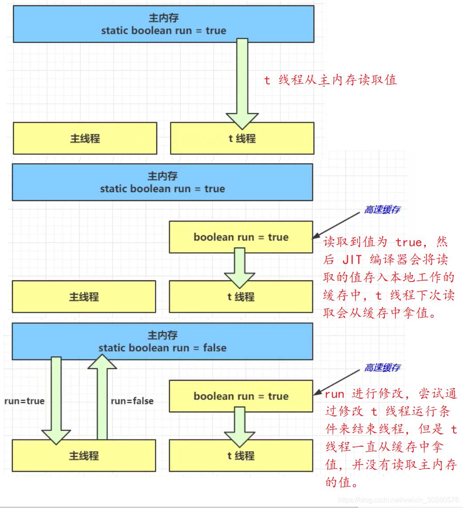
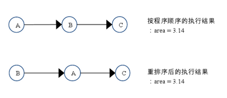

# JUC中篇

> ​		JMM、CAS 原理、Volatile 原理。

并发编程常有三个概念：

- **原子性**：即一个操作或者多个操作要么全部执行成功，要么全部执行失败

- **可见性**：当多个线程访问同一个变量时，一个线程修改了这个变量的值，其他线程能够立即看得到修改后的值

- **有序性**：即程序执行的顺序按照代码的先后顺序执行


## 一、共享模型之内存

### 1.1 内存模型

#### 1）物理机内存模型

​		存在原子性，可实现可见性，但不满足有序性：

​		会对指令进行重排序，即为了提高程序运行效率，可能会对输入代码进行优化，它不保证程序中各个语句的执行先后顺序同代码中的顺序一致，但是它会保证程序最终执行结果和代码顺序执行的结果是一致的。


#### 2）Java 内存模型（JMM）

​		JMM 即 `Java Memory Model`，它定义了主存（共享内存）、工作内存（线程私有）的抽象概念，其底层对应着 CPU 寄存器、缓存、硬件内存、 CPU 指令优化等。

JMM 的作用体现在以下几个方面：

- **原子性**：保证指令不会受到`线程上下文切换`的影响；
- **可见性**：保证指令不会受 `cpu 缓存`的影响；
- **有序性**：保证指令不会受 `cpu 指令并行优化`的影响。


### 1.2 可见性

[JMM之原子性、可见性、有序性（指令重排） (baidu.com)](https://baijiahao.baidu.com/s?id=1698980548176286623&wfr=spider&for=pc)

#### 1）案例

- “退不出的循环”

试分析以下代码存在的问题：

```java
public static boolean run = true;

public static void main(String[] args) {

    Thread t1 = new Thread(() -> {
        while(run) {
			// println方法是线程安全的
            // System.out.println(run);
        }
    }, "t1");

    t1.start();

    try {
        Thread.sleep(1000);
    } catch (InterruptedException e) {
        e.printStackTrace();
    }
    log.info("t1 Stop");
    run = false;
}
```


​		首先 t1 线程运行，然后过一秒，主线程设置 run 的值为 false，想让 t1 线程停止下来，但是 t1 线程并没有停，分析如下图：



- 解决方案
    - 使用 `volatile` （易变关键字）；
    - 它可以用来修饰**成员变量**和**静态成员变量**（放在主存中的变量），他可以避免线程从自己的工作缓存中查找变量的值，必须到主存中获取它的值，**线程操作 volatile 变量都是直接操作主存**。

```java
// 语法
public static volatile boolean run = true; // 保证内存的可见性
```


- 思考

> ​		如果在示例的死循环中加入 `System.out.println()` 会发现即使不加 volatile 修饰符，线程 t 也能正确看到 对 run 变量的修改了，想一想为什么？
>
> ​		因为 `printIn()` 方法使用了 `synchronized` 同步代码块，可以同时保证**原子性**与**可见性**，它是 `PrintStream` 类的方法。


#### 2）可见性与原子性

​		**可见性**保证的是在多个线程之间，一个线程对`volatile`变量的修改对另一个线程可见， 但不能保证**原子性**。所以仅适用于在==一个写线程，多个读线程==的情况。

​		注意： `synchronized` 语句块既可以保证代码块的原子性，也同时保证代码块内变量的可见性。但<u>缺点</u>是 synchronized 是属于**重量级操作**，性能相对更低。


### 1.3 有序性

#### 1）指令重排

​		指令重排简单来说就是：**在程序结果不受影响的前提下，可以调整指令语句的执行顺序**。单线程环境下的指令重排并不会影响程序执行的正确性，但多线程环境下的指令重排会影响正确性。

> ​		指令重排是现象，有序性是性质，是由指令是否重排而决定的性质和结果。


#### 2）多线程下指令重排问题

##### ① 案例

```java
int num = 0;

// 被 volatile 修饰的变量：可以禁用指令重排序；可以防止被修饰的变量之前的代码被重排序。
volatile boolean ready = false;

// 线程1 执行此方法
public void actor1(I_Result r) {
    if(ready) {
        r.r1 = num + num;
    } 
    else {
        r.r1 = 1;
    }
}

// 线程2 执行此方法
public void actor2(I_Result r) {
    num = 2;          // ①
    ready = true;     // ②
    
    /*   交换顺序之后：
   		    ready = true;     // ③
    	    num = 2;          // ④
    */
}
```

在多线程环境下，以上代码中 `r1` 的值有三种情况：

- 第一种：线程 2 先执行，然后线程 1 后执行，r1 的结果为 4；
- 第二种：线程 1 先执行，然后线程 2 后执行，r1 的结果为 1；
- 第三种：线程 2 先执行，但是发生了**指令重排**，num = 2 与 ready = true 这两行代码的语序交换了顺序，然后执行 ready = true 后，线程 1 运行了，那么 r1 的结果是为 0。


##### ② 解决方案

###### Ⅰ. 使用 volatile

​		使用`volatile`。被`volatile`修饰的变量，可以**禁止指令重排**，也就可以保证程序执行的**有序性**了。


###### Ⅱ. 使用 synchronized

​		**`synchronized`和`Lock`也可以保证有序性，但却无法禁止指令重排**。synchronized 和 Lock 可以保证每个时刻只有一个线程执行同步代码块，相当于是让线程顺序执行同步代码。你就可以理解为线程顺序执行后，那块同步代码块执行的是单线程操作，即没有其它线程影响它，那指令是否被处理器重排就都不会影响最终结果了，也就是说，**天然的保证有序了**。但毕竟是重量级锁，对性能会有较大影响。


> ​		Q：为什么synchronized无法禁止指令重排，却能保证有序性？
>
> ​		A：这是个好问题，这个问题我曾经也思考过，也查阅过很多资料，甚至还去看过hotsopt的源码。为了进一步提升计算机各方面的能力，在硬件层面做了很多优化，如`处理器优化`和`指令重排`等，但是这些技术的引入就会导致`有序性`问题。我们知道，最好的解决有序性问题的办法，就是**禁止处理器优化**和**指令重排**，就像`volatile`中所使用的`内存屏障`一样。虽然很多硬件都会为了优化做一些重排，但在Java中，不管怎么重排序，都不能影响**单线程程序**的执行结果，这就是`as-if-serial`语义。所有硬件优化的前提都是必须遵守`as-if-serial`语义。再说下`synchronized`，它是Java提供的锁，可以通过它对Java中的对象加锁，并且他是一种**排他的**、**可重入**的锁。所以，当某个线程执行到一段被`synchronized`修饰的代码之前，会先进行加锁，执行完之后再进行解锁。在加锁之后，解锁之前，其他线程是无法再次获得锁的，只有这条加锁线程可以重复获得该锁（重入）。`synchronized`通过排他锁的方式就保证了**在同一时间内，被`synchronized`修饰的代码是<font color="green">单线程</font>执行的**。所以呢，这就满足了`as-if-serial`语义的一个关键前提，那就是单线程，因为有`as-if-serial`语义保证，单线程时的**有序性**就天然存在了。
>
> ​												——————————————https://blog.51cto.com/u_13626762/3116811


### 1.4 volatile

​		获取共享变量时，为了保证该变量的`可见性`，可以使用 `volatile` 修饰。它可以用来修饰成员变量和静态成员变量，使用它可以**避免线程从自己的`工作缓存`中查找变量的值，而必须到`主存`中获取变量的值**。

​		**线程操作 `volatile` 变量都是直接操作主存**。即一个线程对 volatile 变量的修改，对另一个线程可见。

注意：

​		==volatile 并不能解决多线程中，**各个线程之间**指令的**<font color="blue">交错执行</font>**！！！（即不能保证**原子性**）==，volatile只能保证**本线程内**的相关代码不被`重排序`（有序性）。由于 `CAS` 是原子性操作，所以 CAS 借助 volatile 读取到共享变量的新值可以完美实现无锁、无阻塞的【**比较 & 交换**】的效果。


### 1.5 volatile 原理

volatile 的底层实现原理是`内存屏障(Memory Barrier | Memory Fence)`。

- 对 volatile 变量的**写指令后**会加入`写屏障`；
- 对 volatile 变量的**读指令前**会加入`读屏障`；


#### 1）如何保证可见性

- `写屏障（sfence）`保证在该屏障之前的，对共享变量的**改动**，都同步到主存当中

```java
volatile boolean ready = false;

public void actor2(I_Result r) {
     num = 2;
     ready = true; // ready 是被 volatile 修饰的，赋值带写屏障
     /* 
     	$$$$$$$$$$$$$$$$$$$$$$$$$$$$$【写屏障】$$$$$$$$$$$$$$$$$$$$$$$$$$$$$
	    在对volatile变量的写指令之后加入，保证该屏障之前所有共享变量的可见性
      */
}
```


- `读屏障（lfence）`保证在该屏障之后的，对共享变量的**读取**，加载的都是主存中的最新数据

```java
volatile boolean ready = false;

public void actor1(I_Result r) {
    /* 
     	$$$$$$$$$$$$$$$$$$$$$$$$$$$$$【读屏障】$$$$$$$$$$$$$$$$$$$$$$$$$$$$$
	    在对volatile变量的读指令之前加入，保证该屏障之后的所有共享变量的可见性
     */
    if(ready) {      // ready是被 volatile 修饰的，读取值带读屏障
        r.r1 = num + num;
    } else {
        r.r1 = 1;
    }
}
```


|                           示意图                            |
| :---------------------------------------------------------: |
|  |


#### 2）如何保证有序性

- `写屏障`会确保指令重排序时，不会将写屏障之前的代码排在写屏障之后

```java
public void actor2(I_Result r) {
    num = 2;
    ready = true; // ready 是被 volatile 修饰的，赋值带写屏障
    // $$$$$$$$$$$$$$$$$$$$$$$$$$$$$【写屏障】$$$$$$$$$$$$$$$$$$$$$$$$$$$$$
}
```


- `读屏障`会确保指令重排序时，不会将读屏障之后的代码排在读屏障之前

```java
public void actor1(I_Result r) {
    // $$$$$$$$$$$$$$$$$$$$$$$$$$$$$【读屏障】$$$$$$$$$$$$$$$$$$$$$$$$$$$$$
    // ready 是被 volatile 修饰的，读取值带读屏障
    if(ready) {
        r.r1 = num + num;
    } else {
        r.r1 = 1;
    }
}
```


#### 3）double-checked locking

##### ① 问题暴露

- 案例

```java
// 最开始的单例模式是这样的
public final class Singleton {
    private Singleton() { }
    private static Singleton INSTANCE = null;
    public static Singleton getInstance() {
        // 首次访问会同步，而之后的使用不用进入synchronized
        synchronized(Singleton.class) {
            if (INSTANCE == null) { // t1
                INSTANCE = new Singleton();
            }
        }
        return INSTANCE;
    }
}

/*             |||||||||||             改进            |||||||||||          */

// 但是上面的代码块的效率是有问题的，因为即使已经产生了单实例之后，之后调用了getInstance()方法之后还是会加锁，这会严重影响性能！因此就有了如下改进：
public final class Singleton {
    private Singleton() { }
    private static Singleton INSTANCE = null;
    public static Singleton getInstance() {
        if(INSTANCE == null) { // t2
            // 首次访问会同步，而之后的使用没有 synchronized
            synchronized(Singleton.class) {
                if (INSTANCE == null) { // t1
                    INSTANCE = new Singleton();
                }
            }
        }
        return INSTANCE;
    }
}
// 注意：上述代码中，第一层 if(INSTANCE == null) 并没有在同步代码块synchronized中，无法享有synchronized 所保证的原子性，可见性。所以，会存在一定隐患。
```

- 以上的实现特点是：
    - 懒惰实例化
    - 首次使用 `getInstance()` 才使用 synchronized 加锁，后续使用时都无需加锁

    

- `getInstance()` 方法对应的字节码为：

```properties
0: getstatic #2 // Field INSTANCE:Lcn/itCASt/n5/Singleton;
3: ifnonnull 37
// ldc是获得类对象
6: ldc #3 // class cn/itCASt/n5/Singleton
// 复制操作数栈栈顶的值放入栈顶, 将类对象的引用地址复制了一份
8: dup
// 操作数栈栈顶的值弹出，即将对象的引用地址存到局部变量表中
// 将类对象的引用地址存储了一份，是为了将来解锁用
9: astore_0
10: monitorenter
11: getstatic #2 // Field INSTANCE:Lcn/itCASt/n5/Singleton;
14: ifnonnull 27
// 新建一个实例
17: new #3 // class cn/itCASt/n5/Singleton
// 复制了一个实例的引用
20: dup

########################  需确保这两行指令不发生重排序，否则会产生无意义的【空对象】   ########
// 通过这个复制的引用调用它的构造方法
21: invokespecial #4 // Method "<init>":()V
// 最开始的这个引用用来进行赋值操作
24: putstatic #2 // Field INSTANCE:Lcn/itCASt/n5/Singleton;
#####################################################################################

27: aload_0
28: monitorexit
29: goto 37
32: astore_1
33: aload_0
34: monitorexit
35: aload_1
36: athrow
37: getstatic #2 // Field INSTANCE:Lcn/itCASt/n5/Singleton;
40: areturn
```


其中

- 17 表示创建对象，将对象引用入栈               // new Singleton
- 20 表示复制一份对象引用                              // 复制了引用地址
- 21 表示利用一个对象引用，调用构造方法   // 根据复制的引用地址调用构造方法
- 24 表示利用一个对象引用，赋值给 static INSTANCE

也许 jvm 会优化为：先执行 24，再执行 21。如果两个线程 t1，t2 按如下时间序列执行：


> ​		有一个误区是：并不是`synchronized`代码块无法保证有序性，而是由于 `getstatic`(对应INSTANCE) 这行代码在 monitor 的控制之外，所以其可以越过 monitor 读取 INSTANCE 变量的值。如果变量完全被synchronized包管，则可以保证原子性、可见性、有序性。


​		如果 t1 中发生**指令重排序**，使得\<<24>>与\<<21>>交换执行顺序，就会导致构造方法还未执行完毕，而引用先不为null，则 t2 拿到的将是一个**未初始化完毕的单例**【引用不为null，但对象是一个无意义的`空对象`，因为构造方法还未执行完成】。

​		如果对 INSTANCE 使用 `volatile` 修饰，则可以**禁用指令重排序**。

​		注意：在 JDK 5 以上版本的 volatile 才会真正有效。


##### ② 问题解决

​		给INSTANCE变量加上volatile关键字即可。


### 1.6 先行发生原则(happens-before)

​		happens-before （先行发生）原则，如果两个操作的执行次序无法从happens-before原则推导出来，那么就不能保证它们的有序性，虚拟机可以随意地对它们进行重排序。即：满足happens-before原则的，才能被保证有序性。


[8大原则带你秒懂Happens-Before原则](https://zhuanlan.zhihu.com/p/433467241)

1. **程序次序规则**：一个线程内，按照代码顺序，书写在前面的操作先行发生于书写在后面的操作

2. **锁定规则**：一个unLock操作先行发生于后面对同一个锁的lock操作

3. **volatile变量规则**：对一个变量的写操作先行发生于后面对这个变量的读操作

4. **传递规则**：如果操作A先行发生于操作B，而操作B又先行发生于操作C，则可以得出操作A先行发生于操作C

5. **线程启动规则**：Thread对象的start()方法先行发生于此线程的每个一个动作

6. **线程中断规则**：对线程interrupt()方法的调用先行发生于被中断线程的代码检测到中断事件的发生

7. **线程终结规则**：线程中所有的操作都先行发生于线程的终止检测，我们可以通过Thread.join()方法结束、Thread.isAlive()的返回值手段检测到线程已经终止执行

8. **对象终结规则**：一个对象的初始化完成先行发生于他的finalize()方法的调用


### 1.7 as-if-serial语义

[(107条消息) java并发-内存模型happens before，as-if-serial_西京刀客的博客-CSDN博客](https://blog.csdn.net/inthat/article/details/107760742)

​		`as-if-serial`语义就是：不管怎么重排序（编译器和处理器为了提高并行度），\[**单线程**]程序的执行结果不能被改变。`编译器`，`runtime` 和`处理器`都必须遵守as-if-serial语义。为了遵守as-if-serial语义，编译器和处理器不会对存在**数据依赖关系**的操作做重排序，因为这种重排序会改变执行结果。但是，如果操作之间不存在数据依赖关系，这些操作可能被编译器和处理器重排序。

​		为了具体说明，请看下面计算圆面积的代码示例：

```java
double pi  = 3.14;    // A

double r   = 1.0;     // B

double area = pi * r * r; // C
```

|                     上述案例数据依赖关系                     |
| :----------------------------------------------------------: |
|  |


​		如上图所示，A和C之间存在数据依赖关系，同时B和C之间也存在数据依赖关系。因此在最终执行的指令序列中，C不能被重排序到A和B的前面。如果C排到A和B的前面，程序的结果将会被改变。

　　但A和B之间没有数据依赖关系，编译器和处理器可以重排序A和B之间的执行顺序。下图是该程序的两种执行顺序：

|                     指令重排序的可能顺序                     |
| :----------------------------------------------------------: |
|  |


​		`as-if-serial`语义把**单线程**程序保护了起来，遵守`as-if-serial`语义的编译器，runtime 和处理器共同为编写单线程程序的程序员创建了一个幻觉：**单线程程序是按程序的顺序来执行的**。as-if-serial语义使单线程程序员无需担心`重排序`会干扰他们，也无需担心内存`可见性`问题。


## 二、共享模型之无锁

​		管程即 `monitor` 是**阻塞式的悲观锁**来实现并发控制。所谓无锁，就是使用**非阻塞式的乐观锁**的来实现并发控制。


### 2.1 无锁解决线程安全问题

- Account接口

```java
public interface Account {
    // 获取金额的方法
    Integer getBalance();

    // 取款的方法
    void withdraw(Integer amount);

    static void demo(Account account) {
        List<Thread> list = new ArrayList<>();

        long start = System.nanoTime();
        for (int i = 0; i < 1000; i++) {
            list.add(new Thread(() -> {
                account.withdraw(10);
            }));
        }

        // 启动所有线程
        for (Thread thread : list) {
            thread.start();
        }

        // 等待所有线程执行完
        for (Thread thread : list) {
            try {
                thread.join();
            } catch (InterruptedException e) {
                e.printStackTrace();
            }
        }
        long end = System.nanoTime();

        System.out.println(account.getBalance()
                           + " 花费时间: " + (end - start) / 1000_000 + " ms");
    }
}
```


- `AccountSynchronizedImpl`：使用Synchronized实现存取款操作【有锁】

```java
public class AccountSynchronizedImpl implements Account {
    private Integer balance;

    public AccountSynchronizedImpl(Integer balance) {
        this.balance = balance;
    }

    @Override
    public Integer getBalance() {
        return this.balance;
    }

    @Override
    public void withdraw(Integer amount) {
        synchronized (this) { // 加锁。
            this.balance -= amount;
        }
    }
}
```

> ​		如上代码加锁会造成线程堵塞，堵塞的时间取决于临界区代码的执行时间，这使得加锁的性能不高。我们可以使用无锁来解决此问题。


- `AccountCASImpl`：使用CAS实现存取款操作【无锁】

```java
public class AccountCASImpl implements Account {
    AtomicInteger atomicInteger;

    public AccountCASImpl(Integer balance) {
        this.atomicInteger = new AtomicInteger(balance);
    }

    @Override
    public Integer getBalance() {
        return atomicInteger.get();
    }

    @Override
    public void withdraw(Integer amount) {
        // 核心代码
        int pre, next;
        do {
            pre = getBalance();
            next = pre - amount;
        } while (!atomicInteger.compareAndSet(pre, next));
    }
}
```


### 2.2 CAS

#### 1）CAS

​		我们看到，使用 `AtomicInteger` 来实现取款操作，其内部并没有用锁来保护`共享变量`的线程安全。	其中的关键是 `compareAndSwap`（比较并设置值），它的简称就是 `CAS` （也有 Compare And Swap 的说法），CAS必须是一个 **原子操作**。


|          使用CAS实现的存取款操作：CAS更新余额流程图          |
| :----------------------------------------------------------: |
|  |

用文字简述上图流程：

​		当一个线程要去修改 Account 对象中的值时，先获取**旧值** `preVal`（调用get方法），然后再将其设置为**新值** `nextVal`（调用 CAS方法）。在调用 CAS方法时，会将 preVal 与 Account 中的余额（**内存值**）进行比较。

- 如果两者相等（==内存值 = 旧值==），就说明该值还未被其他线程修改，此时便可以进行修改操作。
- 如果两者不相等（==内存值 ≠ 旧值==），就不设置值，重新获取值 preVal（调用get方法），然后再将其设置为新的值 nextVal（调用CAS方法），直到修改成功为止。


> 注意：
>
> - 其实 `CAS` 的底层是 `lock cmpxchg` 指令（X86 架构），在`单核 CPU` 和`多核 CPU` 下都能够保证【**比较 & 交换**】的原子性。
> - 在多核状态下，某个核执行到带 lock 的指令时，CPU 会让总线锁住，当这个核把此指令执行完毕，再开启总线。在这个过程中**不会被线程的 调度机制 所打断，保证了多个线程对内存操作的准确性，是==原子性操作==** 。


#### 2）CAS 的特点

结合 `CAS` 和 `volatile` 可以实现**无锁并发**，==适用于线程数少、多核 CPU== 的场景下。

- CAS 是**乐观锁**：以乐观的态度，认为不会有别的线程来修改共享变量，或者就算改了也没关系，我吃亏点再重试呗。【适用于`读多写少`的场景】。
- synchronized 是**悲观锁**：以悲观的态度，总认为会有其它线程来修改共享变量，所以用悲观极端的方式：**上锁**，来解决问题。即：我上了锁你们都别想改！等我改完了解开了锁，你们才有机会。【适用于`读少写多`的场景】。
- CAS 体现的是**无锁并发**、**无阻塞并发**，请仔细体会这两句话的意思：
    - 因为没有使用 synchronized，所以线程不会陷入阻塞，这是效率提升的因素之一；
    - 但如果竞争激烈（写操作多），可以想到`重试`必然频繁发生，反而效率会受影响。


#### 3）为什么无锁效率高

- 无锁情况下，即使重试失败，线程始终在高速运行，没有停歇，而 synchronized 会让线程在没有获得锁的时候，发生上下文切换，进入阻塞。打个比喻：线程就好像高速跑道上的赛车，高速运行时，速度超快，一旦发生上下文切换，就好比赛车要减速、熄火，等被唤醒又得重新打火、启动、加速… 恢复到高速运行，代价比较大
- 但无锁情况下，因为线程要保持运行，需要额外 CPU 的支持，CPU 在这里就好比高速跑道，没有额外的跑道，线程想高速运行也无从谈起，虽然不会进入阻塞，但由于没有分到时间片，仍然会进入可运行状态，还是会导致上下文切换。


### 2.3 并发操作工具类

​		`java.util.concurrent.atomic`并发包中提供了一些并发工具类，这里把它分成五类：

- 原子整数
- 原子引用
- 原子数组
- 字段更新器
- 原子累加器


#### 1）原子整数

使用原子的方式更新基本类型：

- `AtomicInteger`：整型原子类
- `AtomicLong`：长整型原子类
- `AtomicBoolean` ：布尔型原子类


​		上面三个类提供的方法几乎相同，所以只以 `AtomicInteger` 为例子来介绍。`AtomicInteger` 内部操作都是通过 CAS 来实现的。

```java
public static void main(String[] args) {
    AtomicInteger i = new AtomicInteger(0);
    // 获取并自增（i = 0, 结果 i = 1, 返回 0），类似于 i++
    System.out.println(i.getAndIncrement());
    
    // 自增并获取（i = 1, 结果 i = 2, 返回 2），类似于 ++i
    System.out.println(i.incrementAndGet());
    
    // 自减并获取（i = 2, 结果 i = 1, 返回 1），类似于 --i
    System.out.println(i.decrementAndGet());
    
    // 获取并自减（i = 1, 结果 i = 0, 返回 1），类似于 i--
    System.out.println(i.getAndDecrement());
    
    // 获取并加值（i = 0, 结果 i = 5, 返回 0）
    System.out.println(i.getAndAdd(5));
    
    // 加值并获取（i = 5, 结果 i = 0, 返回 0）
    System.out.println(i.addAndGet(-5));
    
    // 获取并更新（i = 0, p 为 i 的当前值, 结果 i = -2, 返回 0）
    // 函数式编程接口，其中函数中的操作能保证原子，但函数需要无副作用
    System.out.println(i.getAndUpdate(p -> p - 2));
    
    // 更新并获取（i = -2, p 为 i 的当前值, 结果 i = 0, 返回 0）
    // 函数式编程接口，其中函数中的操作能保证原子，但函数需要无副作用
    System.out.println(i.updateAndGet(p -> p + 2));
    
    // 获取并计算（i = 0, p 为 i 的当前值, x 为参数1, 结果 i = 10, 返回 0）
    // 函数式编程接口，其中函数中的操作能保证原子，但函数需要无副作用
    // getAndUpdate 如果在 lambda 中引用了外部的局部变量，要保证该局部变量是 final 的
    // getAndAccumulate 可以通过 参数1 来引用外部的局部变量，但因为其不在 lambda 中因此不必是 final
    System.out.println(i.getAndAccumulate(10, (p, x) -> p + x));
    
    // 计算并获取（i = 10, p 为 i 的当前值, x 为参数1值, 结果 i = 0, 返回 0）
    // 函数式编程接口，其中函数中的操作能保证原子，但函数需要无副作用
    System.out.println(i.accumulateAndGet(-10, (p, x) -> p + x));
}
```


#### 2）原子引用

​		`原子引用类型`可以保证`引用类型的共享变量`是线程安全的（但需要确保这个原子引用没有引用过别人）。
`基本类型原子类型`只能更新一个变量，如果需要原子更新多个变量，需要使用引用类型原子类。

- `AtomicReference`：引用类型原子类；
- `AtomicStampedReference`：原子更新带有**版本号**的引用类型。该类将整数值版本号与引用关联起来，通过原子的更新数据和数据的版本号，可以解决使用 CAS 进行原子更新时可能会出现的 `ABA` 问题；
- `AtomicMarkableReference` ：原子更新带有**标记**的引用类型。该类将 boolean 标记与引用关联起来，如果我们只在意是否出现了ABA问题，而不在意中途有几次版本的迭代，则可以使用此类。


##### ① AtomicReference

```java
public static AtomicReference<String> ref = new AtomicReference<>("A");

public static void main(String[] args) throws InterruptedException {
    log.debug("main start...");
    String preVal = ref.get();

    // 等待其它两个线程执行ABA操作
    other();

    TimeUnit.SECONDS.sleep(1);
    // 更新成功！因为AtomicReference中的CAS操作无法感知到ABA问题
    log.debug("change A->C {}", ref.compareAndSet(preVal, "C"));
}

private static void other() throws InterruptedException {
    new Thread(() -> {
        log.debug("change A->B {}", ref.compareAndSet(ref.get(), "B"));
    }, "t1").start();

    TimeUnit.SECONDS.sleep(1);

    new Thread(() -> {
        log.debug("change B->A {}", ref.compareAndSet(ref.get(), "A"));
    }, "t2").start();
}
```


##### ② ABA问题

​		主线程仅能判断出共享变量的值与最初值 A 是否相同，不能感知到这种从 A 改为 B 又改回 A 的情况，如果主线程希望：只要有其它线程**修改**了共享变量，那么自己的 CAS 就算失败，这时，仅比较值是不够的，需要再加一个`版本号`或者记录是否被改动的布尔标识。可以使用`AtomicStampedReference|AtomicMarkableReference`来解决。


##### ③ AtomicStampedReference

​		使用 `AtomicStampedReference` 加 `stamp` （版本号或者时间戳）的方式解决 ABA 问题。代码如下：

```java
// 两个参数，第一个：变量的值 第二个：版本号初始值
public static AtomicStampedReference<String> ref = new AtomicStampedReference<>("A", 0);

public static void main(String[] args) throws InterruptedException {
    log.debug("main start...");
    String preVal = ref.getReference();
    int stamp = ref.getStamp();
    log.info("main 拿到的版本号 {}", stamp);

    other();

    TimeUnit.SECONDS.sleep(1);

    log.info("修改后的版本号 {}", ref.getStamp());
    log.info("change A->C:{}", ref.compareAndSet(preVal, "C", stamp, stamp + 1));
}

private static void other() throws InterruptedException {
    new Thread(() -> {
        int stamp = ref.getStamp();
        log.info("{}", stamp);
        log.info("change A->B:{}", ref.compareAndSet(ref.getReference(), "B", stamp, stamp + 1));
    }).start();

    TimeUnit.SECONDS.sleep(1);

    new Thread(() -> {
        int stamp = ref.getStamp();
        log.info("{}", stamp);
        log.debug("change B->A:{}", ref.compareAndSet(ref.getReference(), "A", stamp, stamp + 1));
    }).start();
}
```


##### ④ AtomicMarkableReference

​		`AtomicStampedReference` 可以给原子引用加上**版本号**，追踪原子引用整个的变化过程，如：A -> B -> A ->C，通过AtomicStampedReference，我们可以知道，引用变量中途被更改了几次。但有时候，我们并不关心引用变量到底被更改了几次，而只是单纯的关心是否被更改过，所以就有了`AtomicMarkableReference` 。

```java
public static void main(String[] args) {
    AtomicMarkableReference<String> amr = new AtomicMarkableReference<>("A", false);

    /* step1：t1线程修改内存中的值 */
    new Thread(() -> {
        // 修改内存值，但修改前和修改后的值是【相同】的（ABA问题）
        String prev = amr.getReference();
        String next = prev;
        amr.compareAndSet(prev, next, false, true);
    }, "t1").start();

    JucUtils.sleep(1000);

    /*
            step2：main线程欲修改内存中的值失败。
            原因：内存中的值已经被t1线程修改过！
         */
    String prev = amr.getReference();
    String next = "B";
    boolean isSuccess = amr.compareAndSet(prev, next, false, true);
    log.info("CAS操作" + (isSuccess ? "成功！" : "失败！"));

    log.info(amr.getReference());
}
```


#### 3）原子数组

使用原子的方式更新数组里的某个元素，可以保证元素的线程安全。

- `AtomicIntegerArray`：整形数组原子类
- `AtomicLongArray`：长整形数组原子类
- `AtomicReferenceArray` ：引用类型数组原子类

上面三个类提供的方法几乎相同，所以我们这里以 AtomicIntegerArray 为例子来介绍，代码如下：

```java
public static void main(String[] args) throws InterruptedException {
    demo(
        () -> new int[10],
        (array) -> array.length,
        (array, index) -> array[index]++,
        (array) -> System.out.println(Arrays.toString(array))
    );

    TimeUnit.SECONDS.sleep(1);

    demo(
        () -> new AtomicIntegerArray(10),
        (array) -> array.length(),
        (array, index) -> array.getAndIncrement(index),
        (array) -> System.out.println(array)
    );
}

private static <T> void demo(
    /* 提供者：无中生有一个对象 */
    Supplier<T> arraySupplier,
    /* 函数：一个参数一个结果【(参数1)->结果】；BiFunction：两个参数，一个结果【(参数1, 参数2)->结果】 */
    Function<T, Integer> lengthFun,
    /* 消费者：两个参数没结果【(参数1, 参数2)->void】 */
    BiConsumer<T, Integer> putConsumer,
    /* 消费者：一个参数没结果【(参数1)->void】 */
    Consumer<T> printConsumer) {

    ArrayList<Thread> ts = new ArrayList<>(); // 创建集合
    T array = arraySupplier.get(); // 获取数组
    int length = lengthFun.apply(array); // 获取数组的长度

    for (int i = 0; i < length; i++) {
        ts.add(new Thread(() -> {
            for (int j = 0; j < 10000; j++) {
                putConsumer.accept(array, j % length);
            }
        }));
    }

    ts.forEach(Thread::start);  // 启动所有线程
    ts.forEach((thread) -> {    // 等待所有线程执行完毕
        try {
            thread.join();
        } catch (InterruptedException e) {
            e.printStackTrace();
        }
    });

    printConsumer.accept(array);
}
```


#### 4）字段更新器

字段更新器就是为了保证**类中某个属性**线程安全问题。

- `AtomicReferenceFieldUpdater`：引用类型字段更新器原子类；
- `AtomicIntegerFieldUpdater`：整形字段更新器原子类；
- `AtomicLongFieldUpdater`：长整形字段更新器原子类。

​		注意：利用字段更新器，可以针对对象的某个域（`Field`）进行**原子操作**，但字段必须被 `volatile` 修饰，否则会出现异常：`Exception in thread "main" java.lang.IllegalArgumentException: Must be volatile type`。

```java
public static AtomicReferenceFieldUpdater<Student, String> ref =
    AtomicReferenceFieldUpdater.newUpdater(Student.class, String.class, "name");

public static void main(String[] args) throws InterruptedException {
    Student student = new Student();

    new Thread(() -> {
        System.out.println(ref.compareAndSet(student, null, "list"));
    }, "t1").start();

    // 确保t1线程先执行
    JucUtils.sleep(100);

    System.out.println(ref.compareAndSet(student, null, "张三"));
    System.out.println(student);  // Student{name='list'}
}

static class Student {

    public volatile String name;

    @Override
    public String toString() {
        return "Student{" +
            "name='" + name + '\'' +
            '}';
    }
}
```


#### 5）原子累加器

##### ① AtomicLong Vs LongAdder

```java
public static void main(String[] args) {
    for (int i = 0; i < 5; i++) {
        demo(() -> new AtomicLong(0), (ref) -> ref.getAndIncrement());
    }

    System.out.println("========= 分割线 =========");

    for (int i = 0; i < 5; i++) {
        demo(() -> new LongAdder(), (ref) -> ref.increment());
    }
}

private static <T> void demo(Supplier<T> supplier, Consumer<T> consumer) {
    ArrayList<Thread> list = new ArrayList<>();

    T adder = supplier.get();
    // 4 个线程，每人累加 50 万
    for (int i = 0; i < 4; i++) {
        list.add(new Thread(() -> {
            for (int j = 0; j < 500000; j++) {
                consumer.accept(adder);
            }
        }));
    }

    long start = System.nanoTime();
    list.forEach(t -> t.start());
    list.forEach(t -> {
        try {
            t.join();
        } catch (InterruptedException e) {
            e.printStackTrace();
        }
    });
    long end = System.nanoTime();

    System.out.println(adder + " cost:" + (end - start) / 1000_000);
}

```

​		执行代码后，发现使用 `LongAdder` 比 `AtomicLong` 快2，3倍，使用 LongAdder 性能提升的原因很简单，就是在有竞争时，设置多个**累加单元**（但不会超过CPU的核心数），Therad-0 累加 Cell[0]，而 Thread-1 累加Cell[1]… 最后将结果汇总。这样，不同的线程在累加时操作不同的 Cell 变量，便减少了 CAS 重试次数，从而提高性能。


### 2.4 LongAdder 原理

​		LongAdder 类有几个关键域。`public class LongAdder extends Striped64 implements Serializable {}`。

​		下面的变量属于 `Striped64`：

```java
// 累加单元数组, 懒惰初始化
transient volatile Cell[] cells;
// 基础值, 如果没有竞争, 则用 CAS 累加这个域
transient volatile long base;
// 在 cells 创建或扩容时, 置为 1, 表示加锁
transient volatile int cellsBusy;
```


#### 1）使用 CAS 实现一个自旋锁

```java
public class LockCAS {

    // 如果 state 值为 0 表示没上锁, 1 表示上锁
    public AtomicInteger state = new AtomicInteger(0);

    // 自旋锁上锁：无阻塞，无限期忙等
    public void lock() {
        while (true) {
            if(state.compareAndSet(0, 1)) {
                break;
            }
        }
    }

    // 自旋锁解锁，使能满足lock()中的锁退出条件
    public void unlock() {
        log.debug("unlock...");
        state.set(0);
    }

    public static void main(String[] args) {
        LockCAS lock = new LockCAS();

        new Thread(() -> {
            log.info("begin...");
            lock.lock();
            try {
                log.info("上锁成功");
                TimeUnit.SECONDS.sleep(1);
            } catch (InterruptedException e) {
                e.printStackTrace();
            } finally {
                lock.unlock();
            }
        }, "t1").start();

        new Thread(() -> {
            log.info("begin...");
            lock.lock();
            try {
                log.info("上锁成功");
                TimeUnit.SECONDS.sleep(1);
            } catch (InterruptedException e) {
                e.printStackTrace();
            } finally {
                lock.unlock();
            }
        }, "t2").start();
    }
}
```


#### 2）伪共享

##### ① 什么是伪共享

​		随着`CPU`和 `内存` 的发展速度差异的问题，导致CPU的速度远远快于内存，所以一般现在的CPU都加入了`高速缓存`，就是常说的**解决不同硬件之间的性能差异问题**。

​		但加入了缓存，就必然会出现`缓存一致性`的问题，由此，又引入了[缓存一致性协议]()。**由于缓存的加入会造成数据副本的产生，即同一份数据会缓存在不同核心的缓存行中，CPU 要保证数据的一致性，如果某个 CPU 核心更改了数据，其它 CPU 核心对应的整个缓存行必须失效**。

​		CPU缓存，顾名思义，越贴近CPU的缓存速度越快，容量越小，造价成本也越高，而高速缓存一般可以分为L1、L2、L3三级缓存，按照性能的划分：==L1 \> L2 \> L3==。

|                        三级CPU缓存                         |
| :--------------------------------------------------------: |
|  |


​		数据在缓存内部都是按照**行**来存储的，这就叫做**缓存行**。缓存行一般都是`2的整数幂个字节`，一般来说范围在`32~256`个字节之间，现在最为常见的缓存行的大小在`64`个字节。

​		所以，按照这个存储方式，缓存中的数据并不是一个个单独的变量的存储方式，而是多个变量会放到一行中。我们常说的一个例子就是数组和链表，**数组的内存地址是连续的**，**当我们去读取数组中的元素时，CPU会把数组中后续的若干个元素也加载到缓存中，以此提高效率**，但是链表则不会，也就是说，<font color="blue">内存地址连续的变量才有可能被放到一个缓存行中</font>。

​		什么是==伪共享==呢？即：**<font color="red">一些相互独立的变量却 共享|共用 着同一个缓存行</font>**。


> ​		至于伪共享所导致问题的实例，请在下文 [3）LongAdder 内部实现](#3）LongAdder 内部实现) 中查看、体会。


##### ② 如何避免伪共享

###### Ⅰ. 字节填充

​		在JDK8之前，可以通过**手动填充字节**的方式来避免伪共享的问题。

​		一般而言，缓存行有`64`个字节，我们知道一个long是8个字节，填充5个long之后，一共就是48个字节。而 Java 中，`对象头`在32位系统下占用8个字节，64位系统下占用16个字节。所以，在当前流行的64位系统中，我们再填充**5个long型**即可填满64字节，也就是一个缓存行所占用的总大小。

```java
class Pointer {
    MyLong x = new MyLong();
    MyLong y = new MyLong();
}

class MyLong {
    volatile long value;
    // 再填充5个long类型数据，占满一个缓存行
    long p1, p2, p3, p4, p5;
}
```


###### Ⅱ. 使用 @Contented 注解

​		在 JDK8 以及之后的版本， Java 提供了`sun.misc.Contended` 注解，通过`@Contented`注解就可以解决伪共享的问题。使用 `@Contented` 注解后会增加128字节的padding，并且需要开启
`-XX:-RestrictContended`选项后才能生效。

```java
@sun.misc.Contended
class MyLong {
    volatile long value;
}
```


​		所以，通过以上两种方式你会发现，对象头大小和缓存行的大小都和操作系统位数有关，JDK的注解帮你解决了这个问题，所以推荐尽量使用注解的方式来实现。

​		虽然解决了伪共享问题，但是这种填充的方式也浪费了缓存资源，明明只有8字节的大小，硬是使用了64字节缓存空间，造成了缓存资源的浪费。而且我们知道，缓存又小又贵，时间和空间的取舍要自己酌情考虑。


#### 3）LongAdder 内部实现

其中 Cell 即为`累加单元`。

```java
// 防止 缓存行 伪共享
@sun.misc.Contended
static final class Cell {
    volatile long value;
    Cell(long x) { value = x; }
    // 最重要的方法, 用来进行 CAS 累加, prev 表示旧值, next 表示新值
    final boolean cas(long prev, long next) {
        return UNSAFE.compareAndSwapLong(this, valueOffset, prev, next);
    }
    // 省略不重要代码
}
```


​		因为 Cell 是**数组形式**，在内存中是连续存储的，一个 Cell 为 `24 字节`（16 字节的对象头和 8 字节的 value），因此缓存行中最多可以存下Cell数组中连续的 2 个 Cell 对象。这也就是问题所在： Core-0 要修改 Cell[0]，Core-1 要修改 Cell[1]，但无论是谁修改成功，都会导致对方 Core 的`缓存行`失效，比如 Core-0 中 Cell[0]=6000, Cell[1]=8000 要累加 Cell[0]=6001, Cell[1]=8000 ，这时会让 Core-1 的缓存行失效。这也就是**伪共享**所带来的问题。

|                     伪共享所带来的问题                      |
| :---------------------------------------------------------: |
|  |


​		因此，可以使用`@sun.misc.Contended`来解决伪共享问题。它的原理是在使用此注解的对象或字段的前后各增加 `128 字节`大小的`padding`，从而让 CPU 将对象预读至缓存时，占用不同的缓存行。这样，在更改数据时，就不会造成对方缓存行的失效了。

|     使用`@sun.misc.Contended`注解解决伪共享所带来的问题     |
| :---------------------------------------------------------: |
|  |


#### 4）add 方法分析


#### 5）sum 方法分析


### 2.5 Unsafe

#### 1）Unsafe 对象的获取

​		`Unsafe类` 的名字会让人产生误解，会让人误认为它是线程不安全的类，但事实并非如此。只因这个类中提供了非常底层的，直接操作内存、线程的方法，所以，使用这个类会存在着安全隐患，也就是不安全的。

​		**Unsafe 对象不能直接调用，只能通过反射获得**。

​		LockSupport 的 park 方法，cas 相关的方法底层都是通过Unsafe类来实现的。

```java
public static void main(String[] args) 
    throws NoSuchFieldException, IllegalAccessException {
    // Unsafe 使用了单例模式，unsafe 对象是类中的一个私有的变量 
    Field theUnsafe = Unsafe.class.getDeclaredField("theUnsafe");
    theUnsafe.setAccessible(true);
    Unsafe unsafe = (Unsafe)theUnsafe.get(null);
}
```


#### 2）Unsafe 模拟实现 CAS 操作

```java
public class UnsafeToCas {

    public static void main(String[] args) throws NoSuchFieldException, IllegalAccessException {

        /* 创建 unsafe 对象 */
        // 获取Unsafe类中提供的Unsafe对象
        Field theUnsafe = Unsafe.class.getDeclaredField("theUnsafe");
        theUnsafe.setAccessible(true);
        // 获取Field属性值：由于Unsafe中的theUnsafe属性为静态的，则不需要使用对象便可以获取，即传入null值即可
        Unsafe unsafe = (Unsafe) theUnsafe.get(null);

        // 拿到偏移量
        long idOffset = unsafe.objectFieldOffset(Teacher.class.getDeclaredField("id"));
        long nameOffset = unsafe.objectFieldOffset(Teacher.class.getDeclaredField("name"));

        // 进行 cas 操作
        Teacher teacher = new Teacher();
        unsafe.compareAndSwapLong(teacher, idOffset, 0, 100);
        unsafe.compareAndSwapObject(teacher, nameOffset, null, "lisi");

        System.out.println(teacher);
    }

}

@Data
class Teacher {

    private volatile int id;
    private volatile String name;

}
```


#### 3）Unsafe 模拟实现原子整数

```java
public class UnsafeToAtomicInteger {

    public static void main(String[] args) {
        Account.demo(new MyAtomicInteger(10000));
    }

}

class MyAtomicInteger implements Account {

    private volatile Integer value;
    private static final Unsafe UNSAFE;
    private static final long valueOffset;

    static {

        try {
            /* 反射创建 unsafe 对象 */
            Field theUnsafe = Unsafe.class.getDeclaredField("theUnsafe");
            theUnsafe.setAccessible(true);
            // 获取Field属性值：由于Unsafe中的theUnsafe属性为静态的，则不需要使用对象便可以获取，即传入null值即可
            UNSAFE = (Unsafe) theUnsafe.get(null);

            /* 获取自定义原子整数类中的value属性的偏移量 */
            valueOffset = UNSAFE.objectFieldOffset
                (MyAtomicInteger.class.getDeclaredField("value"));
        } catch (Exception ex) {
            throw new Error(ex);
        }
    }

    public MyAtomicInteger(Integer value) {
        this.value = value;
    }

    public Integer get() {
        return value;
    }

    public void decrement(Integer amount) {
        Integer preVal;
        Integer nextVal;
        do {
            preVal = this.value;
            nextVal = preVal - amount;
        } while (!UNSAFE.compareAndSwapObject(this, valueOffset, preVal, nextVal));
    }

    @Override
    public Integer getBalance() {
        return get();
    }

    @Override
    public void withdraw(Integer amount) {
        decrement(amount);
    }
}
```


## 三、共享模型之不可变类

> ​		`不可变类`的线程安全性都是指`单个方法`的运行是线程安全的，而`多个方法`的组合不能够保护线程安全。所以，我们才需要额外的手段来保护其线程安全。比如使用原子引用来保护BigInteger类的线程安全。


### 3.1 Demo之日期转换的问题

- 问题提出：

​		下面的代码在运行时，由于 `SimpleDateFormat` 不是线程安全的，则有很大几率出现 `java.lang.NumberFormatException` 或者出现不正确的日期解析结果。

```java
SimpleDateFormat sdf = new SimpleDateFormat("yyyy-MM-dd");
for (int i = 0; i < 10; i++) {
    new Thread(() -> {
        try {
            log.debug("{}", sdf.parse("1951-04-21"));
        } catch (Exception e) {
            log.error("{}", e);
        }
    }).start();
}
```


- 问题解决：**使用不可变对象**

​		如果一个对象不能够修改其内部状态（属性），那么它就是线程安全的，因为不存在并发修改啊！这样的对象在 Java 中有很多，例如在 Java 8 后，提供了一个新的日期格式化类 `DateTimeFormatter`。

```java
DateTimeFormatter dtf = DateTimeFormatter.ofPattern("yyyy-MM-dd");
for (int i = 0; i < 10; i++) {
    new Thread(() -> {
        LocalDate date = dtf.parse("2018-10-01", LocalDate::from);
        log.debug("{}", date);
    }).start();
}
```


### 3.2 不可变设计

String类中不可变的体现：

```java
public final class String
    implements java.io.Serializable, Comparable<String>, CharSequence {
    /** The value is used for character storage. */
    private final char value[];
    /** Cache the hash code for the string */
    private int hash; // Default to 0
    // ...
}
```


#### 1）final 的使用

发现该类、类中所有属性都是 `final` 的

- 属性用 final 修饰保证了该属性是只读的，不能修改
- 类用 final 修饰保证了该类中的方法不能被覆盖，防止子类无意间破坏不可变性


#### 2）保护性拷贝

​		但有同学会说，使用字符串时，也有一些跟修改相关的方法啊，比如 `substring` 等，那么下面就看一看这些方法是如何实现的，就以 `substring` 为例：

```java
public String substring(int beginIndex, int endIndex) {
    if (beginIndex < 0) {
        throw new StringIndexOutOfBoundsException(beginIndex);
    }
    if (endIndex > value.length) {
        throw new StringIndexOutOfBoundsException(endIndex);
    }

    int subLen = endIndex - beginIndex;
    if (subLen < 0) {
        throw new StringIndexOutOfBoundsException(subLen);
    }

    // 上面是一些校验，下面才是真正的创建新的String对象
    return ((beginIndex == 0) && (endIndex == value.length)) ? this
        : new String(value, beginIndex, subLen);
}

/* String构造方法 */
public String(char value[], int offset, int count) {
    if (offset < 0) {
        throw new StringIndexOutOfBoundsException(offset);
    }
    if (count <= 0) {
        if (count < 0) {
            throw new StringIndexOutOfBoundsException(count);
        }
        if (offset <= value.length) {
            this.value = "".value;
            return;
        }
    }
    // Note: offset or count might be near -1>>>1.
    if (offset > value.length - count) {
        throw new StringIndexOutOfBoundsException(offset + count);
    }
    // 上面是一些安全性的校验，下面是给String对象的value赋值，新创建了一个数组来保存String对象的值
    this.value = Arrays.copyOfRange(value, offset, offset+count);
}
```

​		构造新字符串对象时，会生成新的 `char[] value`，并对内容进行复制 。这种通过创建`副本对象`来避免共享的手段称之为【**<font color="red">保护性拷贝（defensive copy）</font>**】。


### 3.3 享元模式(`Flyweight Pattern`)

#### 1）简介

​		GoF设计模式之一：被用于当需要重用数量有限的同一类对象时，归类为：`Structual Patterns`。


#### 2）体现

**包装类**

​		在JDK中， Boolean，Byte，Short，Integer，Long，Character 等包装类提供了 `valueOf` 方法。
例如 Long 的 valueOf 会缓存 `-128~127` 之间的 Long 对象，在这个范围之间会重用对象，大于这个范围，才会新建 Long 对象：

```java
public static Long valueOf(long l) {
    final int offset = 128;
    if (l >= -128 && l <= 127) { // will cache
        return LongCache.cache[(int)l + offset];
    }
    return new Long(l);
}
```

- Byte，Short，Long 缓存的范围都是 -128~127
- Character 缓存的范围是 0~127
- Integer 的默认范围是 -128~127，最小值不能变，但最大值可以通过调整虚拟机参数 
    "`-Djava.lang.Integer.IntegerCache.high`"来改变
- Boolean 缓存了 TRUE 和 FALSE


#### 3）DIY 实现简单的数据库连接池

​		例如：一个线上商城应用，`QPS` 达到数千，如果每次都重新创建和关闭数据库连接，性能会受到极大影响。 这时预先创建好一批连接，放入连接池。一次请求到达后，从连接池获取连接，使用完毕后再还回连接池，这样既节约了连接的创建和关闭时间，也实现了连接的重用，不至于让庞大的连接数压垮数据库。

代码实现如下：

```java
public class Code_17_DatabaseConnectionPoolTest {

    public static void main(String[] args) {
        Pool pool = new Pool(2);
        for(int i = 0; i < 5; i++) {
            new Thread(() -> {
                Connection connection = pool.borrow();
                try {
                    Thread.sleep(new Random().nextInt(1000));
                } catch (InterruptedException e) {
                    e.printStackTrace();
                }
                pool.free(connection);
            }).start();
        }
    }

}

@Slf4j(topic = "c.Pool")
class Pool {

    // 连接池的大小, 因为没有实现连接池大小的扩容, 用 final 表示池的大小是一个固定值。
    private final int poolSize;
    // 连接池
    private Connection[] connections;
    // 表示连接状态, 如果是 0 表示没连接, 1 表示有连接
    private AtomicIntegerArray status;
    // 初始化连接池
    public Pool(int poolSize) {
        this.poolSize = poolSize;
        status = new AtomicIntegerArray(new int[poolSize]);
        connections = new Connection[poolSize];
        for(int i = 0; i < poolSize; i++) {
            connections[i] = new MockConnection("连接" + (i + 1));
        }
    }

    // 从连接池中获取连接
    public Connection borrow() {
        while (true) {
            for(int i = 0; i < poolSize; i++) {
                if(0 == status.get(i)) {
                    if(status.compareAndSet(i,0, 1)) {
                        log.info("获取连接:{}", connections[i]);
                        return connections[i];
                    }
                }
            }
            synchronized (this) {
                try {
                    log.info("wait ...");
                    wait();
                } catch (InterruptedException e) {
                    e.printStackTrace();
                }
            }
        }
    }

    // 从连接池中释放指定的连接
    public void free(Connection connection) {
        for (int i = 0; i < poolSize; i++) {
            if(connections[i] == connection) {
                status.set(i, 0);
                log.info("释放连接:{}", connections[i]);
                synchronized (this) {
                    notifyAll();
                }
            }
        }
    }

}

class MockConnection implements Connection {

    private String name;

    public MockConnection(String name) {
        this.name = name;
    }

    @Override
    public String toString() {
        return "MockConnection{" +
            "name='" + name + '\'' +
            '}';
    }
}

```

以上实现没有考虑：

- 连接的动态增长与收缩
- 连接保活（可用性检测）
- 等待超时处理
- 分布式 hash

​		对于关系型数据库，有比较成熟的连接池的实现，例如 c3p0、druid 等。对于更通用的对象池，可以考虑用 apache commons pool，例如 redis 连接池可以参考 jedis 中关于连接池的实现。


### 3.4 final的原理

#### 1）设置 final 变量的原理

​		理解了 volatile 原理，再对比 final 的实现就比较简单了。

```java
public class TestFinal {
	final int a = 20;
}

// =================================== 字节码 ===================================
0: aload_0
1: invokespecial #1 // Method java/lang/Object."<init>":()V
4: aload_0
5: bipush 20
7: putfield #2 // Field a:I
// $$$$$$$$$$$$$$$$$$$$$$$$$$$$$【写屏障】$$$$$$$$$$$$$$$$$$$$$$$$$$$$$
10: return
```

​		final 变量的赋值操作都必须在<u>定义时</u>或者<u>构造器</u>中进行初始化赋值，并发现 final 变量的赋值也会通过 `putfield` 指令来完成，同样在这条指令之后也会加入`写屏障`，保证在其它线程读到它的值时不会出现为 0 的情况。


#### 2）获取 final 变量的原理

​		需要从字节码层面去理解，可以参考如下文章：

[深入理解final关键字](https://weihubeats.blog.csdn.net/article/details/87708198?utm_medium=distribute.pc_relevant.none-task-blog-BlogCommendFromMachineLearnPai2-2.control&depth_1-utm_source=distribute.pc_relevant.none-task-blog-BlogCommendFromMachineLearnPai2-2.control)


 


[不可变对象为何是线程安全的]()


[JMM之原子性、可见性、有序性（指令重排） (baidu.com)](https://baijiahao.baidu.com/s?id=1698980548176286623&wfr=spider&for=pc)


[Java内存模型(Java Memory Model，JMM) (qq.com)](https://mp.weixin.qq.com/s?__biz=MzU0OTE4MzYzMw==&mid=2247533850&idx=4&sn=7477c8346a738e9a234c3b85f1cd0bc4&chksm=fbb1cce4ccc645f238e66ee5d45c9aa85c51f47987a8719e035b51ec8d49c75457b18a1dfae3&scene=27)


[一道大题决定去留：为什么synchronized无法禁止指令重排，却能保证有序性？_Hollis的技术博客_51CTO博客](https://blog.51cto.com/u_13626762/3116811)


