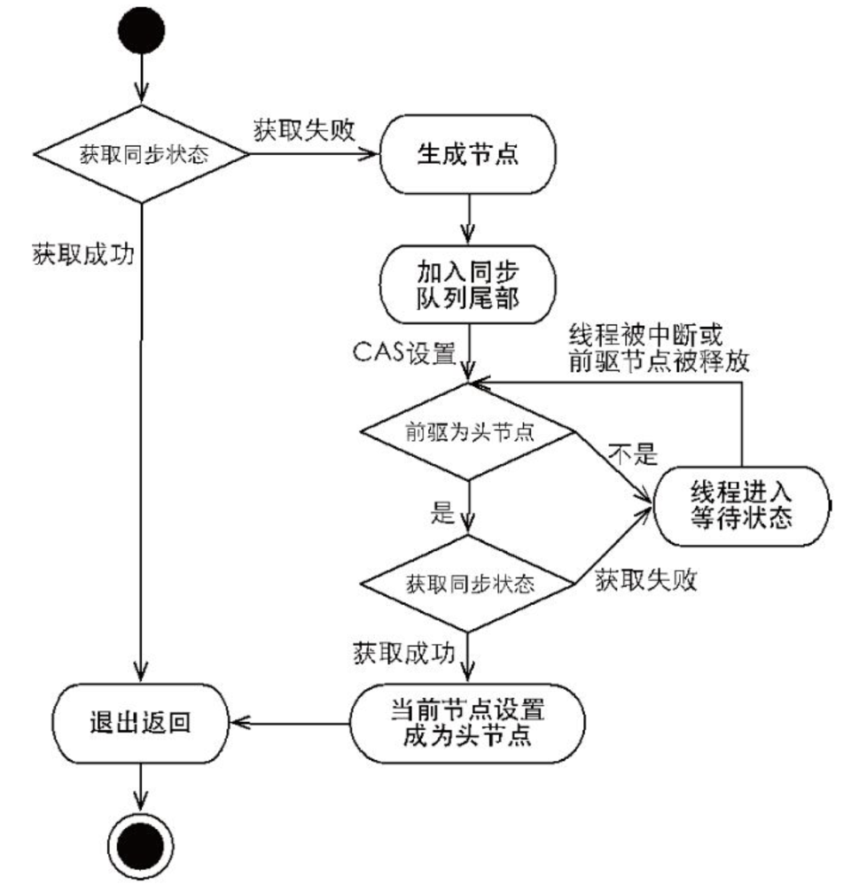

# JUC原理

> ​		JUC、AQS 源码、ReentrantLock 源码。


> - 同步队列与条件队列都是CLH队列？
> - 究竟什么是同步器？
> - 为什么ReentrantReadWriteLock只支持锁降级而不支持锁升级？
> - 对状态属性state的印象：不就是0和1|n表示是否加锁吗？怎么还表示`独占模式`和`共享模式`的资源的状态？
> - state到底是什么东东？同步状态【**`同步状态`又是什么**】？共享资源数量【独占和共享的区别】？
> - 只有独占时才需要使用condition队列么？共享时不需要么？
> - 公平锁 & 非公平锁是指AQS的哪个方面的内容。


## 一、AQS

[(113条消息) java并发-JUC_clh队列全称是啥_枫火木烈王的博客-CSDN博客](https://blog.csdn.net/WangMapleWang/article/details/127645762)

[(112条消息) JUC笔记-同步器（AQS原理、ReentrantLock原理）_0129y的博客-CSDN博客](https://blog.csdn.net/weixin_50255400/article/details/122848553)

[(114条消息) java线程与并发编程-同步器_8k大佬随风的博客-CSDN博客](https://blog.csdn.net/weixin_43872382/article/details/109714700)


- 锁分类

[(114条消息) JAVA中的各种锁机制_java四种锁机制_有分享欲的小莫的博客-CSDN博客](https://blog.csdn.net/2201_75382167/article/details/129496209)


- volatile & CAS 原理

[(117条消息) volatile原理_汇编指令lock_技术不值钱的博客-CSDN博客](https://blog.csdn.net/cow4j/article/details/119652077)


### 1.1 AQS 概念

​		AQS的全称是 `AbstractQueuedSynchronizer`，即是一个**抽象的队列同步器**。

​		AQS是一个用来构建**阻塞式锁**和**同步器（==同步器指的是控制通用同步方法的类？？？==）**工具的框架，许多同步器类的实现都依赖于AQS。AQS 用状态属性`state`来表示资源的`同步状态`，子类需要定义如何维护这个状态，以控制如何获取锁和释放锁。`state`如果大于0则表示当前资源正被某个线程使用，如果为0则表示没有线程使用该共享资源。




### 1.2 同步队列(CLH)

​		所谓同步队列，其实就是一个`FIFO`的`CLH`双向队列。

> ​		CLH队列的全称是(Craig, Landin and Hagersten) lock queuee，是一个**虚拟的双向队列**（即**不存在队列实例，仅存在节点之间的关联关系**），只是通过结点之间的连接构成了双向的队列。
>
> ​		AQS将请求共享资源时被阻塞（底层使用的`park`）的线程封装成一个CLH同步队列中的一个结点（`Node`）来实现锁的分配。**添加被阻塞的线程到CLH队尾时使用的是CAS操作**。在同步队列中，通过节点`head`和`tail`记录`队首`和`队尾元素`。


**当多线程访问共享资源（state）时，流程如下**：

1. 当线程1、2、3通过CAS获取state时，如果线程1获取到了资源的使用权（获取到了锁），则将当前锁的`owenerThread`设置为线程1，并将`state + 1`；
2. 由于线程2、3未获取到共享资源，将会被加入`等待队列`（`CLH 双端链表队列`）；
3. 当线程1释放`state`时，则将当前锁的`ownerThread`设置为null，`state – 1`；
4. 当再次发生竞争时，如果是公平锁，将会按照**等待队列的顺序依次获取资源**；如果不是公平锁，**等待队列中的第一个线程将会和新进来的线程竞争获取资源**。


### 1.3 同步状态(state)

​		AQS维护了一个 `volatile int` 类型的变量`state`，用于表示当前的同步状态。volatile虽然不能保证操作的原子性，但是能保证当前变量state的可见性。state状态的**取值不同**，其状态也不同，而不同的实现对state的状态值的定义也不同。如ReentrantReadWriteLock会将state分为高16位和低16位分别为读锁和写锁的状态。

​		对`state`的访问方式有三种： `getState()`、`setState()`和`compareAndSetState()`，均是原子操作，其中，compareAndSetState的实现依赖于 Unsafe 的 compareAndSwaplnt() 。在AQS中，源码实现如下：

```java
// 返回共享资源状态，此操作的内存语义为volatile修饰的原子读操作
protected final int getState() {
    return state;
}

// 设置共享资源状态，此操作的内存语义为volatile修饰的原子写操作
protected final void setState(int newState) {
    state = newState;
}

// 以CAS的方式，将同步状态设置为给定的更新状态值（如果当前状态值等于预期值），设置共享资源状态，此操作的内存语义为volatile修饰的原子写操作
protected final boolean compareAndSetState(int expect, int update) {
    // See below for intrinsics setup to support this
    return unsafe.compareAndSwapInt(this, stateOffset, expect, update);
}
```


### 1.4 AQS共享资源的方式：独占式和共享式

AQS 定义了两种资源共享方式 ：独占式(Exclusive)和共享式(Share)

- **独占模式(Exclusive)**是只有一个线程能够访问共享资源，如 `ReentrantLock`。==又可分为**公平锁**和**非公平锁**（共享模式好像也分公平锁？非公平锁？）==：

    - **公平锁**：按照线程在队列中的排队顺序，先到者先拿到锁；
    - **非公平锁**：当线程要获取锁时，无视队列顺序直接去抢锁，谁抢到就是谁的。

- **共享模式(Share)**允许多个线程同时访问共享资源，如 `Semaphore`、`CountDownLatch`等。

    另外，`ReentrantReadWriteLock` 可以看成是**组合式**，即既包括共享式的`读锁`，又包括独占式的`写锁`。


### 1.5 自定义锁

​		基于 AQS 实现一个`独占式`的、`不可重入`的**阻塞式锁**：使用 `AbstractQueuedSynchronizer` 自定义一个同步器来实现自定义锁，代码如下：

```java
/**
 * @description 基于AQS实现自定义锁：独占、不可重入锁
 * @author Jun Lu
 * @date 2023-04-22 09:43:03
 */
public class AQSCustomLock implements Lock {

    /**
     * @description 加锁状态枚举类
     * @author Jun Lu
     * @date 2023-04-22 09:51:32
     */
    enum LockState {
        NORMAL("无锁状态", 0),
        LOCK("被加锁状态", 1)
            ;

        private final String lockState;
        private final int state;

        LockState(String lockState, int state) {
            this.lockState = lockState;
            this.state = state;
        }

        public String getLockState() {
            return lockState;
        }

        public int getState() {
            return state;
        }

        @Override
        public String toString() {
            return "LockState{" +
                "lockState='" + lockState + '\'' +
                ", state=" + state +
                '}';
        }
    }

    /**
     * @description 自定义同步器类：目的是实现独占锁
     * @author Jun Lu
     * @date 2023-04-22 09:42:52
     */
    class MyAnsynchronizer extends AbstractQueuedSynchronizer {

        @Override
        // 尝试获取锁
        protected boolean tryAcquire(int arg) {
            if (compareAndSetState(LockState.NORMAL.getState(), LockState.LOCK.getState())) {
                // 若加上了锁，则设置“独占锁所有者”为当前线程
                setExclusiveOwnerThread(Thread.currentThread());
                return true;
            }
            return false;
        }

        @Override
        // 释放锁
        protected boolean tryRelease(int arg) {
            try {
                // 解锁逻辑：设置“独占锁所有者”为null
                setExclusiveOwnerThread(null);
                // 由于state变量是volatile的，则能保证有序性。
                // 所以，应该写在setExclusiveOwnerThread()方法之后，充分发挥写屏障的作用
                setState(LockState.NORMAL.getState());
                return true;
            } catch (Exception e) {   // 出现异常，解锁失败
                e.printStackTrace();
                return false;
            }
        }

        @Override
        // 当前线程是否持有锁
        protected boolean isHeldExclusively() {
            return getState() == LockState.LOCK.getState();
        }

        public Condition newCondition() {
            return new ConditionObject();
        }
    }

    private final MyAnsynchronizer sync = new MyAnsynchronizer();

    @Override
    // 加锁不成功会进入阻塞队列，直到获取到锁为止
    public void lock() {
        // 当前的加锁逻辑是不能使用MyAnsynchronizer中重写的tryAcquire方法的
        // 因为tryAcquire是tryLock()方法的实现逻辑！
        sync.acquire(LockState.LOCK.getState());
    }

    @Override
    // 加锁，可被打断。若加锁不成功会进入阻塞队列，直到获取到锁为止
    public void lockInterruptibly() throws InterruptedException {
        sync.acquireInterruptibly(LockState.LOCK.getState());
    }

    @Override
    // 尝试加锁。加锁成功则返回true；加锁失败则返回false，而不会进入阻塞队列。
    public boolean tryLock() {
        try {
            sync.tryAcquire(LockState.LOCK.getState());
            return true;
        } catch (Exception e) {
            e.printStackTrace();
            return false;
        }
    }

    @Override
    // 尝试在给定的超时时间内加锁。加锁成功则返回true；加锁失败则返回false，而不会进入阻塞队列。
    public boolean tryLock(long time, TimeUnit unit) throws InterruptedException {
        sync.tryAcquireNanos(LockState.LOCK.getState(), unit.toNanos(time));
    }

    @Override
    // 解锁
    public void unlock() {
        sync.release(LockState.NORMAL.getState());
    }

    @Override
    // 新建一个条件变量
    public Condition newCondition() {
        return sync.newCondition();
    }
}
```


- 测试类：测试是否可重入

```java
public static void main(String[] args) {

    AQSCustomLock myLock = new AQSCustomLock();
    new Thread(() -> {
        myLock.lock();
        log.info("lock ... ");
        // 测试是否可重入
        myLock.lock();
        /* 结果是：不可以！直接被阻塞住了。 */
        try {
            log.info("starting ... ");
            Thread.sleep(1000);
        } catch (InterruptedException e) {
            e.printStackTrace();
        } finally {
            log.info("unlock ... ");
            myLock.unlock();
        }
    }, "t1").start();

}
```


## 二、ReentrantLock

|                   ReentrantLock内部结构图                   |
| :---------------------------------------------------------: |
|  |


## 三、ReentrantReadWriteLock

[(112条消息) 锁降级_锁的降级_枉然轻狂的博客-CSDN博客](https://blog.csdn.net/fenkanghong9779/article/details/111872079)

[(112条消息) ReentrantReadWriteLoc读写锁-锁降级及锁升级问题_已经获取到readlock 是否可以升级到writelock_handsomeyinjun的博客-CSDN博客](https://blog.csdn.net/handsomeyinjun/article/details/120323986)

[ReentrantReadWriteLock不能锁升级的原因总结 / 张生荣 (zhangshengrong.com)](https://www.zhangshengrong.com/p/Ap1ZeWQVX0/)


## 四、Semaphore

> ​		允许多个线程同时访问， synchronized 和 ReentrantLock 都是一次只允许一个线程访问某个资源，Semaphore(信号量)可以指定多个线程同时访问某个资源。


## 五、CountdownLatch

[(112条消息) 阿里面试，问了我乐观锁、悲观锁、AQS、sync和Lock，这个回答让我拿了offer_敖 丙的博客-CSDN博客](https://aobing.blog.csdn.net/article/details/104691668?spm=1001.2101.3001.6650.2&utm_medium=distribute.pc_relevant.none-task-blog-2~default~CTRLIST~Rate-2-104691668-blog-123347503.235^v31^pc_relevant_default_base3&depth_1-utm_source=distribute.pc_relevant.none-task-blog-2~default~CTRLIST~Rate-2-104691668-blog-123347503.235^v31^pc_relevant_default_base3&utm_relevant_index=4)

> ​		CountDownLatch（倒计时器）是一个同步工具类，用来协调多个线程之间的同步。这个工具通常用来控制线程等待，它可以让某一个线程等待直到倒计时结束，再开始执行。


## 六、CyclicBarrier

> ​		CyclicBarrier（循环栅栏） 和 CountDownLatch 非常类似，它也可以实现线程间的技术等待，但是它的功能比 CountDownLatch 更加复杂和强大。主要应用场景和 CountDownLatch 类似。CyclicBarrier 的字面意思是可循环使用（Cyclic）的屏障（Barrier）。它要做的事情是，让一组线程到达一个屏障（也可以叫同步点）时被阻塞，直到最后一个线程到达屏障时，屏障才会开门，所有被屏障拦截的线程才会继续干活。CyclicBarrier默认的构造方法是 CyclicBarrier(int parties)，其参数表示屏障拦截的线程数量，每个线程调用await()方法告诉 CyclicBarrier 我已经到达了屏障，然后当前线程被阻塞。


## 七、ConcurrentHashMap原理

[助力面试之ConcurrentHashMap面试灵魂拷问，你能扛多久 - 知乎 (zhihu.com)](https://zhuanlan.zhihu.com/p/355565143)


[(112条消息) Java 面试问题 —— 多线程模块（JUC 模块）_java juc面试题_梦の澜的博客-CSDN博客](https://blog.csdn.net/baiyang2001/article/details/126892291)

[(112条消息) java经典面试题JUC并发篇（持续更新）_java juc面试题_呆萌小新@渊洁的博客-CSDN博客](https://blog.csdn.net/m0_50913327/article/details/127686842)


## 附：Java中相关锁分类

### 乐观锁 & 悲观锁

​		悲观锁与乐观锁都是一种锁的设计思想。

- **乐观锁**：很乐观，每次去拿数据的时候都认为别人不会修改，所以**<font color="red">不会上锁</font>**，但是在更新的时候会判断一下在此期间别人有没有去更新这个数据，可以使用版本号、CAS等机制来实现。
- **悲观锁**：总是假设最坏的情况，即每次去拿数据的时候都认为别人会修改，所以**<font color="red">每次在拿数据的时候都会上锁</font>**，这样别人想拿这个数据时就会阻塞直到它拿到锁。


### 公平锁 & 非公平锁

- **公平锁**：就是很公平，在并发环境中，每个线程在获取锁时会先查看此锁维护的`阻塞|同步队列`：<u>如果队列为空</u>，或者当前线程是等待队列的第一个就占有锁；如果<u>队列不为空</u>就会加入到队列中，以后会按照`FIFO`的规则从队列中取到自己。
- **非公平锁**：非公平锁比较粗鲁，上来就直接尝试占有锁，而不管队列中是否有被阻塞的线程，但如果竞争失败，就会像公平锁那样，加入队列。
    - 非公平锁的**优点**是可以减少唤起线程的开销，整体的吞吐效率高，因为线程有几率不阻塞直接获得锁，CPU不必唤醒所有线程。
    - **缺点**是处于等待队列中的线程可能会饿死，或者等很久才会获得锁。


```java
// 非公平锁
Lock lock = new ReentrantLock(); 

// 公平锁
Lock lock = new ReentrantLock(true);
```

​		对于`ReentrantLock` 而言，通过构造器函数指定该锁是否是公平锁，默认是非公平锁。非公平锁的优点在于**吞吐量比公平锁大**，但容易产生饥饿现象。

​		对于`synchronized`而言，其也是一种非公平锁，并且无法指定为公平锁。


### 可重入锁

​		指的是在**同一线程**中，外层函数获得锁后，内层递归函数仍能获取到该锁。同一个线程在外层方法获取锁的时候，在进入内层方法会自动获取锁。

​		也就是说，当前线程可以进入到任何一个它已经拥有的锁所同步的代码块。


> ​		ReentrantLock和synchronized就是典型的可重入锁。


### 独占锁(写锁) & 共享锁(读锁)

​		多个线程同时**读**一个`共享资源`没有任何问题，所以为了满足并发量，读取共享资源应该可以同时进行。但是，如果有一个线程想去**写**共享资源，就不应该再有其他的线程可以对该资源进行读或者写。

- **共享锁**是一种思想：可以有多个线程获取读锁，以`共享`的方式持有锁。
- **独占锁**是一种思想：只能有一个线程获取锁，以`独占`的方式持有锁。


### 自旋锁

​		<u>阻塞</u>或<u>唤醒</u>一个Java线程需要操作系统**切换CPU状态**来完成，这种状态的转换需要耗费处理器时间。如果同步代码块中的内容过于简单，状态转换所消耗的时间有可能比用户代码执行的时间还要长。在此类场景中，同步资源的锁定时间很短，如果为了这一小段时间去切换线程，<u>线程挂起</u>和<u>恢复现场</u>的花费可能会让系统得不偿失。

​		而自旋锁就是让获取锁的线程不会被立即阻塞，而是采用循环的方式继续去尝试获取锁，这样的好处是可以**减少线程上下文切换的消耗**，但缺点就是**增加CPU的消耗**。

|                `自旋锁` & `非自旋锁`加锁流程                 |
| :----------------------------------------------------------: |
|  |


自旋锁本身是有缺点的，它不能代替阻塞。**自旋等待虽然避免了线程切换的开销，但它要占用处理器时间**。

- 如果锁被占用的时间很短，自旋等待的效果就会非常好；
- 如果锁被占用的时间很长，那么自旋的线程只会白白浪费处理器资源。

​		所以，自旋等待的时间必须要有一定的限度，如果自旋超过了限定的次数没有成功获得锁，就应当挂起线程。（这个次数默认是10次，可以使用`-XX:PreBlockSpin`配置）


> ​		**自适应意味着自旋的时间（次数）不固定，而是由前一次在同一个锁上的自旋时间及锁的拥有者的状态来决定**。
>
> - 如果在同一个锁对象上，自旋等待刚刚成功获得过锁，并且持有锁的线程正在运行中，那么虚拟机就会认为这次自旋也是很有可能再次成功，进而它将允许自旋等待持续相对更长的时间。
> - 如果对于某个锁，自旋很少成功获得过，那在以后尝试获取这个锁时将可能省略掉自旋过程，直接阻塞线程，避免浪费处理器资源。


### 分段锁

​		**分段锁其实是一种锁的设计思想，并不是一种具体的锁**。对于ConcurrentHashMap而言，其并发的实现就是通过分段锁的形式来实现高效的并发操作。

​		我们以ConcurrentHashMap来说一下分段锁的含义以及设计思想，ConcurrentHashMap中的分段锁称为Segment，它即类似于HashMap（JDK7与JDK8中HashMap的实现）的结构，即内部拥有一个Entry数组，数组中的每个元素又是一个链表；同时又是一个ReentrantLock（Segment继承了ReentrantLock)。

​		当需要put元素的时候，并不是对整个hashmap进行加锁，而是先通过hashcode来知道他要放在那一个分段中，然后对这个分段进行加锁，所以当多线程put的时候，只要不是放在一个分段中，就实现了真正的并行的插入。**但是，在统计size的时候，就是获取hashmap全局信息的时候，此时需要获取所有的分段锁才能统计**。

​		分段锁的设计目的是细化锁的粒度，当操作不需要更新整个数组的时候，就仅仅针对数组中的一项进行加锁操作。


