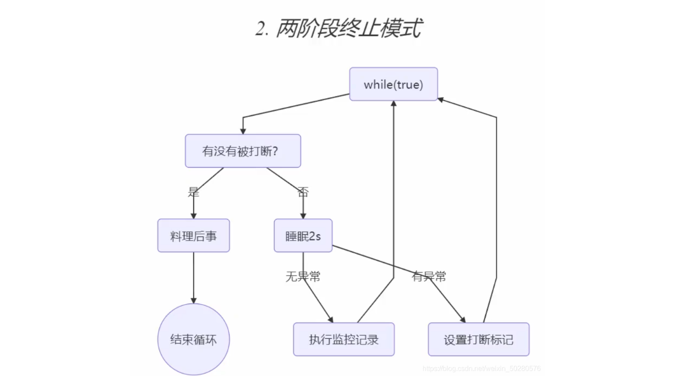

# 并发设计模式

## 一、终止模式

### 1.1 两阶段终止模式

[并发设计模式之两阶段终止模式（Two-Phase Termination Patter）](https://blog.csdn.net/crazyzxljing0621/article/details/56669649)

#### 1）使用interrupt实现

​		`Two Phase Termination`，就是考虑在一个线程T1中如何优雅地终止另一个线程T2？这里的优雅指的是**给T2一个料理后事的机会**（如释放锁）。



```java
public class TwoParseTerminationUseInterrupt {

    public static void main(String[] args) throws InterruptedException {
        TwoParseTerminationUseInterrupt tpt = new TwoParseTerminationUseInterrupt();
        tpt.start();
        Thread.sleep(3500);
        tpt.stop();
    }

    private Thread monitor;

    // 启动线程
    public void start() {
        monitor = new Thread(() -> {
            while (true) {
                Thread thread = Thread.currentThread();
                if(thread.isInterrupted()) { // 调用 isInterrupted 不会清除标记
                    log.info("料理后事 ...");
                    break;
                } else {
                    try {
                        Thread.sleep(1000);
                        log.info("执行监控的功能 ...");
                    } catch (InterruptedException e) {
                        log.info("设置打断标记 ...");
                        thread.interrupt();
                        e.printStackTrace();
                    }
                }
            }
        }, "monitor");
        monitor.start();
    }

    // 终止线程
    public void stop() {
        monitor.interrupt();
    }
}
```


#### 2）使用volatile实现

```java
public class TwoParseTerminationUseVolatile {

    public static void main(String[] args) {
        Monitor monitor = new Monitor();
        monitor.start();
        JucUtils.sleep(3500);
        monitor.stop();
    }

    static class Monitor {

        Thread monitor;
        // 设置终止标记，用于判断是否线程是否被终止了
        private volatile boolean stop = false;

        /**
         * 启动监控器线程
         */
        public void start() {
            // 设置线控器线程，用于监控线程状态
            monitor = new Thread(() -> {
                // 开始不停的监控
                while (true) {
                    if (stop) {
                        System.out.println("处理后续任务");
                        break;
                    }
                    System.out.println("监控器运行中...");
                    try {
                        // 线程休眠
                        Thread.sleep(1000);
                    } catch (InterruptedException e) {
                        System.out.println("被打断了");
                    }
                }
            });
            monitor.start();
        }

        /**
         * 用于停止监控器线程
         */
        public void stop() {
            // 修改标记
            stop = true;
            // 打断线程：目的是尽早结束线程。因为在打断线程时，线程可能正在sleep
            monitor.interrupt();
        }
    }
}
```


## 二、同步模式

### 2.1 保护性暂停模式(Guarded Suspension)

> ​		此模式作用：**需要在一个线程中等待另一个线程的执行结果**。


要点：

- 有**<font color="red">一个结果</font>**需要从一个线程传递到另一个线程，让他们关联同一个 `GuardedObject`【线程之间交互的结果是**一对一**的】
- 如果有结果不断的从一个线程到另一个线程，那么可以使用`消息队列`（见生产者/消费者）
- JDK 中，join 的实现、Future 的实现，采用的就是此模式
- 因为要等待另一方的结果，因此归类到==同步模式==


​		多任务版 Guarded Object 图中 Futures 就好比居民楼一层的信箱（每个信箱有房间编号），左侧的 t0，t2，t4 就好比等待邮件的居民，右侧的 t1，t3，t5 就好比邮递员。如果需要在多个类之间使用 GuardedObject 对象，作为参数传递不是很方便，因此设计一个用来解耦的中间类，这样不仅能够解耦【结果等待者】和【结果生产者】，还能够同时支持多个任务的管理。和生产者消费者模式的区别就是：这个生产者和消费者之间是一一对应的关系，但是生产者消费者模式并不是。rpc 框架的调用中就使用到了这种模式。


```java
/**
 * 同步模式-保护性暂停 (Guarded-Suspension-pattern)
 */
@Slf4j(topic = "c.Code_23_Test")
public class Code_23_Test {

    public static void main(String[] args) {

        for (int i = 0; i < 3; i++) {
            new People().start();
        }

        try {
            Thread.sleep(1000);
        } catch (InterruptedException e) {
            e.printStackTrace();
        }

        for(Integer id : Mailboxes.getIds()) {
            new Postman(id, "内容 " + id).start();
        }
    }

}

@Slf4j(topic = "c.People")
class People extends Thread {

    @Override
    public void run() {
        GuardedObject guardedObject = Mailboxes.createGuardedObject();
        log.info("收信的为 id: {}", guardedObject.getId());
        Object o = guardedObject.get(5000);
        log.info("收到信的 id: {}, 内容: {}", guardedObject.getId(), o);
    }
}

@Slf4j(topic = "c.Postman")
class Postman extends Thread {

    private int id;
    private String mail;

    public Postman(int id, String mail) {
        this.id = id;
        this.mail = mail;
    }

    @Override
    public void run() {
        GuardedObject guardedObject = Mailboxes.getGuardedObject(id);
        log.info("送信的 id: {}, 内容: {}", id, mail);
        guardedObject.complete(mail);
    }
}

class Mailboxes {

    private static int id = 1;
    private static Map<Integer, GuardedObject> boxes = new Hashtable<>();

    public static synchronized int generateId() {
        return id++;
    }

    // 用户会进行投信
    public static GuardedObject createGuardedObject() {
        GuardedObject guardedObject = new GuardedObject(generateId());
        boxes.put(guardedObject.getId(), guardedObject);
        return guardedObject;
    }

    // 派件员会派发信
    public static GuardedObject getGuardedObject(int id) {
        return boxes.remove(id);
    }

    public static Set<Integer> getIds() {
        return boxes.keySet();
    }
}

class GuardedObject {

    private int id;

    public GuardedObject(int id) {
        this.id = id;
    }

    public int getId() {
        return this.id;
    }

    private Object response;

    // 优化等待时间
    public Object get(long timeout) {
        synchronized (this) {
            long begin = System.currentTimeMillis();
            long passTime = 0;
            while (response == null) {
                long waitTime = timeout - passTime; // 剩余等待时间
                if(waitTime <= 0) {
                    break;
                }
                try {
                    this.wait(waitTime);
                } catch (InterruptedException e) {
                    e.printStackTrace();
                }
                passTime = System.currentTimeMillis() - begin;
            }
            return response;
        }
    }

    public void complete(Object response) {
        synchronized (this) {
            this.response = response;
            this.notify();
        }
    }

}
```


## 三、异步模式

### 3.1 生产者与消费者模式

要点

- 与前面的保护性暂停中的 `GuardObject` 不同，不需要产生结果和消费结果的线程一一对应
- 消费队列可以用来平衡生产和消费的线程资源
- 生产者仅负责产生结果数据，不关心数据该如何处理，而消费者专心处理结果数据
- 消息队列是有容量限制的，满时不会再加入数据，空时不会再消耗数据
- JDK 中各种阻塞队列，采用的就是这种模式

> ​		“异步”的意思就是生产者产生消息之后消息没有被立刻消费，而“同步模式”中，消息在产生之后被立刻消费了。


### 3.2 工作线程模式


## 四、

### 4.1 犹豫模式

​		Balking （犹豫）模式用在一个线程发现另一个线程或本线程已经做了某一件相同的事，那么本线程就无需再做 了，直接结束返回，有点类似单例。

- 用一个标记来判断该任务是否已经被执行过了
- 需要避免线程安全问题
- 加锁的代码块要尽量的小，以保证性能

```java
public class BalkingMode {

    public static void main(String[] args) throws InterruptedException {
        Monitor monitor = new Monitor();
        monitor.start();
        monitor.start();
        Thread.sleep(3500);
        monitor.stop();
    }

    static class Monitor {

        Thread monitor;
        // 设置标记，用于判断是否被终止了
        private volatile boolean stop = false;
        // 设置标记，用于判断是否已经启动过了
        private boolean starting = false;

        /**
         * 启动监控器线程
         */
        public void start() {
            /*        【犹豫模式核心代码】
                上锁，避免多线程运行时出现线程安全问题。
                至于为什么starting不使用volatile修饰，而使用synchronized保护，
                则是因为：此处出现并发问题的主要原因在于【原子性】。
             */
            synchronized (this) {
                if (starting) {
                    // 已被启动，直接返回
                    return;
                }
                // 启动监视器，改变标记
                starting = true;
            }

            // 设置线控器线程，用于监控线程状态
            monitor = new Thread(() -> {
                // 开始不停的监控
                while (true) {
                    if(stop) {
                        System.out.println("处理后续任务");
                        break;
                    }
                    System.out.println("监控器运行中...");
                    try {
                        // 线程休眠
                        Thread.sleep(1000);
                    } catch (InterruptedException e) {
                        System.out.println("被打断了");
                    }
                }
            });
            monitor.start();
        }

        /**
         * 	用于停止监控器线程
         */
        public void stop() {
            // 打断线程
            monitor.interrupt();
            stop = true;
        }
    }
}
```


