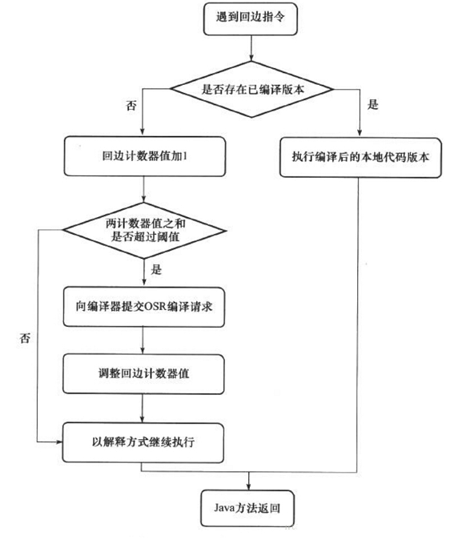

## 四、类加载与字节码技术&内存

### 4.1 [javap](https://blog.csdn.net/Xin_101/article/details/126282130)工具

​		`javap`是class文件分解器，可以**反编译**java编译器生成的字节码。用于**分解class文件**。

```java
javap -v D:Demo.class
```

[从字节码层面去看new一个对象的执行过程](https://www.jianshu.com/p/d299be16e889)


### 4.2 图解方法执行流程

#### 1）代码

```java
public class Test {    
    public static void main(String[] args) {        
        int a = 10;        
    // 在short范围内的整数是和字节码指令直接存储在一起的。但超出了short范围的整数是存储在常量池中的
        int b = Short.MAX_VALUE + 1;        
        int c = a + b;        
        System.out.println(c);   
    } 
}

// ------------------------------------------------------
// 字节码：javap -v Test.class
Classfile /E:/log/blog/Test.class
  Last modified 2023-3-18; size 426 bytes
  MD5 checksum 1e5b3b7f5209af4c81800932058bb6b8
  Compiled from "Test.java"
public class Test
  minor version: 0
  major version: 52
  flags: ACC_PUBLIC, ACC_SUPER
Constant pool:
   #1 = Methodref          #7.#16         // java/lang/Object."<init>":()V
   #2 = Class              #17            // java/lang/Short
   #3 = Integer            32768
   #4 = Fieldref           #18.#19        // java/lang/System.out:Ljava/io/PrintStream;
   #5 = Methodref          #20.#21        // java/io/PrintStream.println:(I)V
   #6 = Class              #22            // Test
   #7 = Class              #23            // java/lang/Object
   #8 = Utf8               <init>
   #9 = Utf8               ()V
  #10 = Utf8               Code
  #11 = Utf8               LineNumberTable
  #12 = Utf8               main
  #13 = Utf8               ([Ljava/lang/String;)V
  #14 = Utf8               SourceFile
  #15 = Utf8               Test.java
  #16 = NameAndType        #8:#9          // "<init>":()V
  #17 = Utf8               java/lang/Short
  #18 = Class              #24            // java/lang/System
  #19 = NameAndType        #25:#26        // out:Ljava/io/PrintStream;
  #20 = Class              #27            // java/io/PrintStream
  #21 = NameAndType        #28:#29        // println:(I)V
  #22 = Utf8               Test
  #23 = Utf8               java/lang/Object
  #24 = Utf8               java/lang/System
  #25 = Utf8               out
  #26 = Utf8               Ljava/io/PrintStream;
  #27 = Utf8               java/io/PrintStream
  #28 = Utf8               println
  #29 = Utf8               (I)V
{
  public Test();
    descriptor: ()V
    flags: ACC_PUBLIC
    Code:
      stack=1, locals=1, args_size=1
         0: aload_0
         1: invokespecial #1                  // Method java/lang/Object."<init>":()V
         4: return
      LineNumberTable:
        line 1: 0

  public static void main(java.lang.String[]);
    descriptor: ([Ljava/lang/String;)V
    flags: ACC_PUBLIC, ACC_STATIC
    Code:
      stack=2, locals=4, args_size=1
         0: bipush        10
         2: istore_1
         3: ldc           #3                  // int 32768
         5: istore_2
         6: iload_1
         7: iload_2
         8: iadd
         9: istore_3
        10: getstatic     #4                  // Field java/lang/System.out:Ljava/io/PrintStream;
        13: iload_3
        14: invokevirtual #5                  // Method java/io/PrintStream.println:(I)V
        17: return
      LineNumberTable:
        line 3: 0
        line 4: 3
        line 5: 6
        line 6: 10
        line 7: 17
}
SourceFile: "Test.java"
```


#### 2）流程

##### ① 常量池载入运行时常量池

​		常量池也属于方法区，只不过这里单独提出来了而已。


##### ② 方法字节码载入方法区

​		（stack=2，locals=4） 对应`操作数栈`有 2 个空间（每个空间 4 个字节），`局部变量表`中有 4 个槽位。


##### ③ 执行引擎开始执行字节码

- `bipush 10`：**将一个 byte 压入`操作数栈`**（其长度会补齐 4 个字节），类似的指令还有
    - `sipush`：将一个 short 压入操作数栈（其长度会补齐 4 个字节）
    - `ldc`：将一个 int 压入操作数栈
    - `ldc2_w`：将一个 long 压入操作数栈（**分两次压入**，因为 long 是 8 个字节）
    - 这里小的数字都是和字节码指令存在一起的，那些**超过了 short 范围的数字会被存入`常量池`**


- `istore 1`：将**操作数栈**栈顶元素弹出，放入**局部变量表**的 slot1 中。对应源代码中的 `a = 10`。


- `ldc #3`：读取`运行时常量池`中的 #3 ，即 `32768` (超过 short 最大值范围的数会被放到运行时常量池中)，并将其加载到`操作数栈`中。注意 `Short.MAX_VALUE` 是一个常量值 32767，所以 `32768 = Short.MAX_VALUE + 1` 实际是在**编译期间**就被计算好了的。


- `istore 2`：将`操作数栈`中的元素弹出，放到`局部变量表`的 2 号位置。


- `iload1 iload2`：将`局部变量表`中 **1号位置** 和 **2号位置** 的元素放入到`操作数栈`中。因为只能在操作数栈中执行运算操作。


- `iadd`：将`操作数栈`中的两个元素弹出栈并相加，再将结果压入至`操作数栈`中。


- `istore 3`：将`操作数栈`中的元素弹出，再放入`局部变量表`的3号位置。


- `getstatic #4`：在`运行时常量池`中找到 #4 ，发现是一个对象，则在`堆内存`中找到该对象，并将其**引用**放入`操作数栈`中。


- `iload 3`：将`局部变量表`中 3 号位置的元素压入`操作数栈`中。


- `invokevirtual #5`：找到`常量池` #5 项，定位到方法区 `java/io/PrintStream.println:(I)V` 方法。生成新的栈帧（分配 locals、stack等），传递参数，执行新栈帧中的字节码指令。


- 执行完毕，弹出栈帧。清除 **main操作数栈** 中的内容。


- `return`：完成 main 方法调用，弹出 main 栈帧，程序结束。


#### 3）使用字节码指令分析实际问题

- 代码

```java
public class ByteCodeTest {
    public static void main(String[] args) {

        int i = 0;
        int x = 0;
        while (i < 10) {
            x = x++;
            i++;
        }
        System.out.println(x); // 0
    }
}
```


- 为什么最终的 x 结果为 0 呢？ 通过分析**字节码指令**即可知晓：

```java
Code:
     stack=2, locals=3, args_size=1	// 操作数栈分配2个空间，局部变量表分配 3 个空间
        0: iconst_0	// 准备一个常数 0
        1: istore_1	// 将常数 0 放入局部变量表的 1 号槽位 i = 0
        2: iconst_0	// 准备一个常数 0
        3: istore_2	// 将常数 0 放入局部变量的 2 号槽位 x = 0	
        4: iload_1		// 将局部变量表 1 号槽位的数放入操作数栈中
        5: bipush        10	// 将数字 10 放入操作数栈中，此时操作数栈中有 2 个数
        7: if_icmpge     21	// 比较操作数栈中的两个数，如果下面的数大于上面的数，就跳转到 21 。这里的比较是将两个数做减法。因为涉及运算操作，所以会将两个数弹出操作数栈来进行运算。运算结束后操作数栈为空
       10: iload_2		// 将局部变量 2 号槽位的数放入操作数栈中，放入的值是 0 
       11: iinc          2, 1	// 将局部变量 2 号槽位的数加 1 ，自增后，槽位中的值为 1 
       14: istore_2	//将操作数栈中的数放入到局部变量表的 2 号槽位，2 号槽位的值又变为了0
       15: iinc          1, 1 // 1 号槽位的值自增 1 
       18: goto          4 // 跳转到第4条指令
       21: getstatic     #2                  // Field java/lang/System.out:Ljava/io/PrintStream;
       24: iload_2
       25: invokevirtual #3                  // Method java/io/PrintStream.println:(I)V
       28: return
```


#### 4）构造方法

- **cinit()V**

```java
public class CinitTest {
	static int i = 10;

	static {
		i = 20;
	}

	static {
		i = 30;
	}

	public static void main(String[] args) {
		System.out.println(i); // 30
	}
}
```

​		编译器会按**从上至下**的顺序，收集所有 `static 静态代码块`和`为静态成员赋值`的代码，将其合并为一个特殊的方法 `cinit()V` ：

```java
stack=1, locals=0, args_size=0
         0: bipush        10
         2: putstatic     #3                  // Field i:I
         5: bipush        20
         7: putstatic     #3                  // Field i:I
        10: bipush        30
        12: putstatic     #3                  // Field i:I
        15: return
```


- **init()V**

```java
public class InitTest {

    private String a = "s1";

    {
        b = 20;
    }

    private int b = 10;

    {
        a = "s2";
    }

    public InitTest(String a, int b) {
        this.a = a;
        this.b = b;
    }

    public static void main(String[] args) {
        Code_13_InitTest d = new Code_13_InitTest("s3", 30);
        System.out.println(d.a);
        System.out.println(d.b);
    }

}
```

​		编译器会按**从上至下**的顺序，收集所有 `实例代码块`和`为成员变量赋值`的代码，形成新的构造方法，但**原始构造方法内的代码**总是在后。

```java
Code:
     stack=2, locals=3, args_size=3
        0: aload_0
        1: invokespecial #1                  // Method java/lang/Object."<init>":()V
        4: aload_0
        5: ldc           #2                  // String s1
        7: putfield      #3                  // Field a:Ljava/lang/String;
       10: aload_0
       11: bipush        20
       13: putfield      #4                  // Field b:I
       16: aload_0
       17: bipush        10
       19: putfield      #4                  // Field b:I
       22: aload_0
       23: ldc           #5                  // String s2
       25: putfield      #3                  // Field a:Ljava/lang/String;
       // 原始构造方法在最后执行
       28: aload_0
       29: aload_1
       30: putfield      #3                  // Field a:Ljava/lang/String;
       33: aload_0
       34: iload_2
       35: putfield      #4                  // Field b:I
       38: return
```


#### 5）方法调用

```java
public class MethodTest {

    public MethodTest() {

    }

    private void test1() {

    }

    private final void test2() {

    }

    public void test3() {

    }
    
    public final void test4() {

    }

    protected void test5() {

    }
    
    void test6() {

    }
    
    public static void test7() {

    }

    public static void main(String[] args) {
        MethodTest obj = new MethodTest();
        obj.test1();
        obj.test2();
        obj.test3();
        obj.test4();
        obj.test5();
        obj.test6();
        MethodTest.test7();
    }
}
```

​		不同类型的方法在调用时，对应的`虚拟机指令`有所区别。

- 私有、构造、被 final 修饰的方法（**编译期**就已经能确定了的静态方法），在调用时都使用 `invokespecial` 指令。
- 普通成员方法在调用时，使用 `invokevirtual` 指令。因为**编译期间**无法确定该方法的内容，只有在**运行期间**才能确定。
- 静态方法在调用时使用 `invokestatic` 指令。

[(17 封私信 / 79 条消息) 为什么java中调用final方法是用invokevirtual指令而不是invokespecial? - 知乎 (zhihu.com)](https://www.zhihu.com/question/45131640)

```java
Code:
      stack=2, locals=2, args_size=1
         0: new           #2                  // class MethodTest
         3: dup
         4: invokespecial #3                  // Method "<init>":()V
         7: astore_1
         8: aload_1
         9: invokespecial #4                  // Method test1:()V
        12: aload_1
        13: invokespecial #5                  // Method test2:()V
        16: aload_1
        17: invokevirtual #6                  // Method test3:()V
        20: aload_1
        21: invokevirtual #7                  // Method test4:()V
        24: aload_1
        25: invokevirtual #8                  // Method test5:()V
        28: aload_1
        29: invokevirtual #9                  // Method test6:()V
        32: invokestatic  #10                 // Method test7:()V
        35: return
```


- new 是创建【对象】，给对象分配堆内存，执行成功会将【对象引用】压入操作数栈
- dup 是赋值操作数栈栈顶的内容，本例即为【对象引用】，为什么需要两份引用呢，一个是要配合 invokespecial 调用该对象的构造方法 “init”: ()V （会消耗掉栈顶一个引用），另一个要 配合 astore_1 赋值给局部变量
- 终方法（final），私有方法（private），构造方法都是由 invokespecial 指令来调用，属于静态绑定
- 普通成员方法是由 invokevirtual 调用，属于动态绑定，即支持多态 成员方法与静态方法调用的另一个区别是，执行方法前是否需要【对象引用】


#### 6）多态原理

​		因为`普通成员方法`需要在运行时才能确定具体的内容，所以虚拟机需要调用 `invokevirtual` 指令。在执行 `invokevirtual` 指令时，经历了以下几个步骤：

- 先通过栈帧中对象的引用找到对象
- 分析对象头，找到对象实际的 Class
- Class 结构中有 vtable
- 查询 vtable 找到方法的具体地址
- 执行方法的字节码


#### 7）异常处理

[方法返回指令](https://www.jianshu.com/p/03f53f540459)

##### ① try-catch

````java
public class TryCatchTest {
    public static void main(String[] args) {
        int i = 0;
        try {
            i = 10;
        }catch (Exception e) {
            i = 20;
        }
    }
}

// -------------------------------------------对应的字节码指令
Code:
     stack=1, locals=3, args_size=1
        0: iconst_0
        1: istore_1
        2: bipush        10
        4: istore_1
        5: goto          12
        8: astore_2
        9: bipush        20
       11: istore_1
       12: return
     //多出来一个异常表
     Exception table:
         from    to  target type
            2     5     8   Class java/lang/Exception
````

- 可以看到多出来一个 Exception table 的结构，`[from, to)` 是**前闭后开**（也就是检测 2~4 行）的检测范围，一旦这个范围内的字节码执行出现异常，则通过 type 匹配异常类型，如果一致，则进入 target 所指示的行号。
- 第 8 行的字节码指令 `astore_2` 是将**异常对象e**的`引用`存入`局部变量表`的 2 号位置。


##### ② 多个 single-catch

```java
public class MultipleCatchTest {
    public static void main(String[] args) {
        int i = 0;
        try {
            i = 10;
        }catch (ArithmeticException e) {
            i = 20;
        }catch (Exception e) {
            i = 30;
        }
    }
}

// -------------------------------------------对应的字节码指令
Code:
     stack=1, locals=3, args_size=1
        0: iconst_0
        1: istore_1
        2: bipush        10
        4: istore_1
        5: goto          19
        8: astore_2      // 存储异常对象e
        9: bipush        20
       11: istore_1
       12: goto          19
       15: astore_2      // 存储异常对象e
       16: bipush        30
       18: istore_1
       19: return
     Exception table:
         from    to  target type
            2     5     8   Class java/lang/ArithmeticException
            2     5    15   Class java/lang/Exception
```

- 因为异常出现时，只能进入 Exception table 中的一个分支，所以`局部变量表 slot 2` 位置被共用


##### ③ finally

```java
public class FinallyTest {
    public static void main(String[] args) {
        int i = 0;
        try {
            i = 10;
        } catch (Exception e) {
            i = 20;
        } finally {
            i = 30;
        }
    }
}

// -------------------------------------------对应的字节码指令
Code:
     stack=1, locals=4, args_size=1
        0: iconst_0
        1: istore_1
        // try块
        2: bipush        10
        4: istore_1
        // try块执行完后，会执行finally    
        5: bipush        30
        7: istore_1
        8: goto          27
       // catch块     
       11: astore_2 // 异常信息放入局部变量表的2号槽位
       12: bipush        20
       14: istore_1
       // catch块执行完后，会执行finally        
       15: bipush        30
       17: istore_1
       18: goto          27
       // 出现异常，但未被 Exception 捕获，会抛出其他异常，这时也需要执行 finally 块中的代码   
       21: astore_3      // 其它的异常对象
       22: bipush        30
       24: istore_1
       25: aload_3
       26: athrow  // 抛出异常
       27: return
     Exception table:
         from    to  target type
            2     5    11   Class java/lang/Exception
            2     5    21   any
           11    15    21   any
```

​		可以看到 finally 中的代码被复制了 3 份，分别放入了 **try 流程**，**catch 流程**以及 **catch 剩余的异常类型流程**。注意：虽然从字节码指令看来，每个块中都有 finally 块，但是 finally 块中的代码只会被执行一次。


##### ④ finally 中的 return

```java
public class FinallyReturnTest {
    public static void main(String[] args) {
        int i = test();
        // 结果为 20
        System.out.println(i);
    }

    public static int test() {
        int i;
        try {
            i = 10;
            return i;
        } finally {
            i = 20;
            return i;
        }
    }
}

// -------------------------------------------对应的字节码指令
Code:
     stack=1, locals=3, args_size=0
        0: bipush        10
        2: istore_0
        3: iload_0
        4: istore_1  // 暂存返回值
        5: bipush        20
        7: istore_0
        8: iload_0
        9: ireturn	// ireturn 会返回操作数栈顶的整型值 20
       // 如果程序出现了异常，还是会执行finally 块中的内容，但是不会抛出异常！！！
       // 可以看到这里压根没有存储异常对象     
       10: astore_2
       11: bipush        20
       13: istore_0
       14: iload_0
       15: ireturn	// 这里没有 athrow 了，也就是如果在 finally 块中如果有返回操作的话，且 try 块中出现了异常，那么程序将会吞掉这个异常（不会外抛）！
     Exception table:
         from    to  target type
            0     5    10   any
```

- 由于 finally 中的 ireturn 被插入了所有可能的流程，因此返回结果肯定以finally的为准。
- 至于字节码中的第 2 行，现在似乎没看出来有啥用，且留个伏笔，看下个例子。
- 跟上例中的 finally 相比，发现没有 `athrow` 了，这告诉我们：如果在 finally 中出现了 return，则会吞掉异常。所以不要在finally中进行返回操作。


##### ⑤ 被吞掉的异常

```java
public static int test() {
    int i;
    try {
        i = 10;
        // 这里应该会抛出异常的（无关是否catch）
        // 如果finally中没有return的话，是会有隐式的athrow来抛出异常的！
        i = i/0;
        return i;
    } finally {
        i = 20;
        return i;
    }
}
```

​		仅仅打印了结果为 20 ，但并未抛出异常。


##### ⑥ finally 不带 return

```java
public static int test() {
    int i = 10;
    try {
        return i;
    } finally {
        i = 20;
    }
}

// -------------------------------------------对应的字节码指令
Code:
     stack=1, locals=3, args_size=0
        0: bipush        10
        2: istore_0 // 赋值给i 10
        3: iload_0	// 加载到操作数栈顶
        4: istore_1 // 存储到局部变量表的1号位置
        5: bipush        20
        7: istore_0 // 赋值给i 20
        8: iload_1 // 加载局部变量表1号位置的数10到操作数栈
        9: ireturn // 返回操作数栈顶元素 10
       10: astore_2
       11: bipush        20
       13: istore_0
       14: aload_2 // 加载异常
       15: athrow // 抛出异常
     Exception table:
         from    to  target type
            3     5    10   any
```

​		打印的结果为 10。


#### 8）Synchronized

```java
public class SyncTest {
    public static void main(String[] args) {
        Object lock = new Object();
        synchronized (lock) {
            System.out.println("ok");
        }
    }
}

// -------------------------------------------对应的字节码指令
Code:
      stack=2, locals=4, args_size=1
         0: new           #2                  // class java/lang/Object
         3: dup // 复制一份栈顶，然后压入栈中。用于invokespecial调用构造函数被消耗
         4: invokespecial #1                  // Method java/lang/Object."<init>":()V
         7: astore_1 // 将栈顶对象的地址存入局部变量表中 1 中
         8: aload_1 // 加载到操作数栈
         9: dup // 复制一份，放到操作数栈，用于加锁时被消耗
        10: astore_2 // 将操作数栈顶元素弹出，暂存到局部变量表的 2 号槽位。这时操作数栈中有一份对象的引用
        11: monitorenter // 加锁
        12: getstatic     #3                  // Field java/lang/System.out:Ljava/io/PrintStream;
        15: ldc           #4                  // String ok
        17: invokevirtual #5                  // Method java/io/PrintStream.println:(Ljava/lang/String;)V
        20: aload_2 // 加载被加锁的对象到栈顶
        21: monitorexit // 释放锁
        22: goto          30
        // 程序发生异常时的解决方案-----保证能释放锁！
        25: astore_3      // 存放异常对象的引用
        26: aload_2  // 加载被加锁的对象到栈顶
        27: monitorexit
        28: aload_3       // 加载异常对象至操作数栈顶
        29: athrow        // 抛出异常对象
        30: return
        // 异常表！
      Exception table:
          from    to  target type
            12    22    25   any
            25    28    25   any
```


### 4.3 编译期处理（语法糖）

​		所谓的 **语法糖** ，其实就是指 java 编译器把 .java 源码编译为 .class 字节码的过程中，自动生成和转换的一些代码，主要是为了**减轻程序员的负担**，算是 java 编译器给我们的一个额外福利。

​		注意，以下代码的分析，借助了 javap 工具，idea 的反编译功能，idea 插件 jclasslib 等工具。另外， **编译器转换的结果直接就是 class 字节码**！只是为了便于阅读，又给出了 几乎等价 的 java 源码方式，并不是编译器还会转换出中间的 java 源码，切记。


#### 1）默认构造器

```java
public class Candy1 {

}

// -------------------------------------经过编译期优化后
public class Candy1 {
   // 这个无参构造器是java编译器帮我们加上的
   public Candy1() {
      // 即调用父类 Object 的无参构造方法，即调用 java/lang/Object." <init>":()V
      super();
   }
}
```


#### 2）自动拆装箱

- 基本类型和其包装类型的相互转换过程，称为拆装箱。

- 在 JDK 5 以后，它们的转换可以在编译期自动完成。

```java
public class Candy2 {
   public static void main(String[] args) {
      Integer x = 1;
      int y = x;
   }
}

// -------------------------------------经过编译期优化后
public class Candy2 {
   public static void main(String[] args) {
      // 基本类型赋值给包装类型，称为装箱
      Integer x = Integer.valueOf(1);
      // 包装类型赋值给基本类型，称谓拆箱
      int y = x.intValue();
   }
}
```


#### 3）泛型集合取值

​		泛型也是在 JDK 5 开始加入的特性，java编译器在编译泛型代码后会执行**泛型擦除**的动作，即泛型信息在编译为字节码之后就丢失了，实际的类型都当做了 Object 类型来处理：

```java
public class Candy3 {
   public static void main(String[] args) {
      List<Integer> list = new ArrayList<>();
      list.add(10);
      Integer x = list.get(0);
   }
}

// -------------------------------------经过编译期优化后
Code:
    stack=2, locals=3, args_size=1
       0: new           #2                  // class java/util/ArrayList
       3: dup
       4: invokespecial #3                  // Method java/util/ArrayList."<init>":()V
       7: astore_1
       8: aload_1
       9: bipush        10
      11: invokestatic  #4                  // Method java/lang/Integer.valueOf:(I)Ljava/lang/Integer;
      // 这里进行了泛型擦除，实际调用的是add(Objcet o)
      14: invokeinterface #5,  2            // InterfaceMethod java/util/List.add:(Ljava/lang/Object;)Z

      19: pop
      20: aload_1
      21: iconst_0
      // 这里也进行了泛型擦除，实际调用的是get(Object o)   
      22: invokeinterface #6,  2            // InterfaceMethod java/util/List.get:(I)Ljava/lang/Object;
// 这里进行了类型转换，将 Object 转换成了 Integer
      27: checkcast     #7                  // class java/lang/Integer
      30: astore_2
      31: return
```

- 所以调用 get 函数取值时，有一个类型转换的操作。

```java
Integer x = (Integer) list.get(0);
```


- 如果要将返回结果赋值给一个 int 类型的变量，则还有自动拆箱的操作

```java
int x = (Integer) list.get(0).intValue();
```


---


- 使用反射可以得到，参数的类型以及泛型类型。泛型反射代码如下：

```java
public class ReflectTest {
    public static void main(String[] args) throws NoSuchMethodException {
        // 1. 拿到方法
        Method method = ReflectTest.class.getMethod("test", List.class, Map.class);
        // 2. 得到泛型参数的类型信息
        Type[] types = method.getGenericParameterTypes();
        for(Type type : types) {
            // 3. 判断参数类型是否，带泛型的类型。
            if(type instanceof ParameterizedType) {
                ParameterizedType parameterizedType = (ParameterizedType) type;

                // 4. 得到原始类型
                System.out.println("原始类型 - " + parameterizedType.getRawType());
                // 5. 拿到泛型类型
                Type[] arguments = parameterizedType.getActualTypeArguments();
                for(int i = 0; i < arguments.length; i++) {
                    System.out.printf("泛型参数[%d] - %s\n", i, arguments[i]);
                }
            }
        }
    }

    public Set<Integer> test(List<String> list, Map<Integer, Object> map) {
        return null;
    }
}

// --------------------------------输出
原始类型 - interface java.util.List
泛型参数[0] - class java.lang.String
原始类型 - interface java.util.Map
泛型参数[0] - class java.lang.Integer
泛型参数[1] - class java.lang.Object
```


#### 4）可变参数

- 可变参数也是 JDK 5 开始加入的新特性： 例如：

```java
public class Candy4 {
   public static void foo(String... args) {
      // 将 args 赋值给 arr ，可以看出 String... 实际就是 String[]  
      String[] arr = args;
      System.out.println(arr.length);
   }

   public static void main(String[] args) {
      foo("hello", "world");
   }
}

// -------------------------------------经过编译期优化后
// 可变参数 String… args 其实是一个 String[] args ，从代码中的赋值语句中就可以看出来。
public class Candy4 {
   public Candy4 {}
   public static void foo(String[] args) {
      String[] arr = args;
      System.out.println(arr.length);
   }

   public static void main(String[] args) {
      foo(new String[]{"hello", "world"});
   }
}
```

​		注意，如果调用的是 `foo()` ，即**未传递参数**时，等价代码为 `foo(new String[]{})` ，即创建了一个**空数组**，而不是传递 null。


#### 5）foreach 循环

- 仍是 JDK 5 开始引入的语法糖，数组的循环遍历：

```java
/* 如果是数组使用 foreach */
public class Candy5 {
	public static void main(String[] args) {
       // 数组赋初值的简化写法也是一种语法糖。完整写法：int[] arr = new int[]{1, 2, 3, 4, 5};
		int[] arr = {1, 2, 3, 4, 5};
		for(int x : arr) {
			System.out.println(x);
		}
	}
}

// -------------------------------------经过编译期优化后
public class Candy5 {
    public Candy5() {}

	public static void main(String[] args) {
		int[] arr = new int[]{1, 2, 3, 4, 5};  // 给数组静态赋值的优化版本
		for(int i = 0; i < arr.length; ++i) {
			int x = arr[i];         // foreach优化为了循环下标遍历输出
			System.out.println(x);
		}
	}
}
```


```java
/* 如果是集合使用 foreach */
public class Candy5 {
   public static void main(String[] args) {
      List<Integer> list = Arrays.asList(1, 2, 3, 4, 5);
      for (Integer x : list) {
         System.out.println(x);
      }
   }
}

// -------------------------------------经过编译期优化后
public class Candy5 {
    public Candy5(){}
    
   public static void main(String[] args) {
      List<Integer> list = Arrays.asList(1, 2, 3, 4, 5);
      // 获得该集合的迭代器
      Iterator<Integer> iterator = list.iterator();
      while(iterator.hasNext()) {
         Integer x = iterator.next();
         System.out.println(x);
      }
   }
}

```

集合要使用 foreach ，需要该集合类实现了 `Iterable` 接口，因为集合的遍历需要用到`迭代器 Iterator`。


#### 6）switch 字符串

- 从 JDK 7 开始，switch 可以作用于**字符串**和**枚举类**，这个功能其实也是语法糖，例如：

```java
public class Cnady6 {
   public static void main(String[] args) {
      String str = "hello";
      switch (str) {
         case "hello" :
            System.out.println("h");
            break;
         case "world" :
            System.out.println("w");
            break;
         default:
            break;
      }
   }
}

// -------------------------------------经过编译期优化后
public class Candy6 {
   public Candy6() {
      
   }
   public static void main(String[] args) {
      String str = "hello";
      int x = -1;
      // 通过字符串的 hashCode + value 来判断是否匹配
      switch (str.hashCode()) {
         // hello 的 hashCode
         case 99162322 :
            // 再次比较，因为字符串的 hashCode 有可能相等
            if(str.equals("hello")) {
               x = 0;
            }
            break;
         // world 的 hashCode
         case 11331880 :
            if(str.equals("world")) {
               x = 1;
            }
            break;
         default:
            break;
      }

      // 用第二个 switch 在进行输出判断
      switch (x) {
         case 0:
            System.out.println("h");
            break;
         case 1:
            System.out.println("w");
            break;
         default:
            break;
      }
   }
}
```

- 在编译期间，**单个的 switch** 被分为了**两个**
    - 第一个用来匹配字符串，并给 x 赋值
        - 字符串的匹配用到了字符串的 `hashCode` ，还用到了 `equals` 方法
        - 使用 hashCode 是为了提高比较效率，使用 equals 是防止有 hashCode 冲突（如 `BM` 和 `C.`）
    - 第二个用来根据x的值来决定输出语句


#### 7）switch 枚举

```java
enum SEX {
   MALE, FEMALE;
}
public class Candy7 {
   public static void main(String[] args) {
      SEX sex = SEX.MALE;
      switch (sex) {
         case MALE:
            System.out.println("man");
            break;
         case FEMALE:
            System.out.println("woman");
            break;
         default:
            break;
      }
   }
}

// -------------------------------------经过编译期优化后
enum SEX {
   MALE, FEMALE;
}

public class Candy7 {
   /**     
    * 定义一个合成类（仅 jvm 使用，对我们不可见）     
    * 用来映射枚举的 ordinal 与数组元素的关系     
    * 枚举的 ordinal 表示枚举对象的序号，从 0 开始     
    * 即 MALE 的 ordinal()=0，FEMALE 的 ordinal()=1     
    */ 
   static class $MAP {
      // 数组大小即为枚举元素个数，里面存放了 case 用于比较的数字
      static int[] map = new int[2];
      static {
         // ordinal 即枚举元素对应所在的位置，MALE 为 0 ，FEMALE 为 1
         map[SEX.MALE.ordinal()] = 1;
         map[SEX.FEMALE.ordinal()] = 2;
      }
   }

   public static void main(String[] args) {
      SEX sex = SEX.MALE;
      // 将对应位置枚举元素的值赋给 x ，用于 case 操作
      int x = $MAP.map[sex.ordinal()];
      switch (x) {
         case 1:
            System.out.println("man");
            break;
         case 2:
            System.out.println("woman");
            break;
         default:
            break;
      }
   }
}
```


#### 8）枚举类

- JDK 7 新增了枚举类，以前面的性别枚举为例：

```java
enum SEX {
   MALE, FEMALE;
}

// -------------------------------------经过编译期优化后
public final class Sex extends Enum<Sex> {   
   // 对应枚举类中的元素
   public static final Sex MALE;    
   public static final Sex FEMALE;    
   private static final Sex[] $VALUES;
   
    static {       
    	// 调用构造函数，传入枚举元素的值及 ordinal
    	MALE = new Sex("MALE", 0);    
        FEMALE = new Sex("FEMALE", 1);   
        $VALUES = new Sex[]{MALE, FEMALE}; 
   }
 	
   // 调用父类中的方法
    private Sex(String name, int ordinal) {     
        super(name, ordinal);    
    }
   
    public static Sex[] values() {  
        return $VALUES.clone();  
    }
    public static Sex valueOf(String name) { 
        return Enum.valueOf(Sex.class, name);  
    } 
   
}
```


#### 9）try-with-resources

- JDK 7 开始新增了对需要关闭的资源处理的特殊语法，‘`try-with-resources`’

```java
try(资源变量 = 创建资源对象) {
	
} catch() {

}
```

​		其中资源对象需要实现 `AutoCloseable` 接口，例如 InputStream 、 OutputStream 、 Connection 、 Statement 、 ResultSet 等接口都实现了 AutoCloseable ，使用 try-with- resources 可以不用写 finally 语句块，编译器会帮助生成关闭资源代码，例如：

```java
public class Candy9 { 
	public static void main(String[] args) {
		try(InputStream is = new FileInputStream("d:\\1.txt")){	
			System.out.println(is); 
		} catch (IOException e) { 
			e.printStackTrace(); 
		} 
	} 
}

// -------------------------------------经过编译期优化后
public class Candy9 { 
    
    public Candy9() { }
   
    public static void main(String[] args) { 
        try {
            InputStream is = new FileInputStream("d:\\1.txt");
            Throwable t = null; 
            try {
                System.out.println(is); 
            } catch (Throwable e1) { 
                // t 是我们代码出现的异常 
                t = e1; 
                throw e1; 
            } finally {
                // 判断了资源不为空 
                if (is != null) { 
                    // 如果我们代码有异常
                    if (t != null) { 
                        try {
                            is.close(); 
                        } catch (Throwable e2) { 
                            // 如果 close 出现异常，作为被压制异常添加
                            t.addSuppressed(e2); 
                        } 
                    } else { 
                        // 如果我们代码没有异常，close 出现的异常就是最后 catch 块中的 e 
                        is.close(); 
                    } 
                } 
            } 
        } catch (IOException e) {
            e.printStackTrace(); 
        } 
    }
}

```


​		为什么要设计一个 `addSuppressed(Throwable e)` （**添加被压制异常**）的方法呢？是为了防止异常信息的丢失（想想 try-with-resources 生成的 fianlly 中如果抛出了异常）。即希望把**try块中出现的异常**和**资源关闭时出现的异常**都保留下来，而不要丢失掉任何异常：

- 模拟try中和close时都出现异常的情形

```java
public class Test6 { 
	public static void main(String[] args) { 
		try (MyResource resource = new MyResource()) { 
			int i = 1/0; 
		} catch (Exception e) { 
			e.printStackTrace(); 
		} 
	} 
}
class MyResource implements AutoCloseable { 
	public void close() throws Exception { 
		throw new Exception("close 异常"); 
	} 
}

// -------------------------------------输出
java.lang.ArithmeticException: / by zero 
	at test.Test6.main(Test6.java:7) 
	Suppressed: java.lang.Exception: close 异常 
		at test.MyResource.close(Test6.java:18) 
		at test.Test6.main(Test6.java:6)
```


#### 10）方法重写时的桥接方法

我们都知道，方法重写时对**返回值**分两种情况：

- 父子类的返回值完全一致
- 子类返回值可以是父类返回值的子类（比较绕口，见下面的例子）

```java
class A { 
    public Number m() { 
        return 1; 
    } 
}
class B extends A { 
    @Override 
    // 子类 m 方法的返回值是 Integer 是父类 m 方法返回值 Number 的子类 	
    public Integer m() { 
        return 2; 
    } 
}

// -------------------------------------经过编译期优化后
class B extends A { 
    public Integer m() { 
        return 2; 
    }
    // 此方法才是真正重写了父类 public Number m() 方法 
    public synthetic bridge Number m() { 
        // 调用 public Integer m() 
        return m(); 
    } 
}

// =====================================================================

/*
	其中桥接方法比较特殊，仅对 java 虚拟机可见，并且与原来的 public Integer m() 没有命名冲突。可以用下面的反射代码来验证：
*/
public static void main(String[] args) {
    for(Method m : B.class.getDeclaredMethods()) {
        System.out.println(m);
    }
}
// 输出结果
public java.lang.Integer cn.ali.jvm.test.B.m()  
public java.lang.Number cn.ali.jvm.test.B.m()   // 桥接方法
```


#### 11）匿名内部类

- 未引用**局部变量**的匿名内部类

```java
public class Candy10 {
   public static void main(String[] args) {
      Runnable runnable = new Runnable() {
         @Override
         public void run() {
            System.out.println("running...");
         }
      };
   }
}

// -------------------------------------经过编译期优化后
public class Candy10 {
   public static void main(String[] args) {
      // 用额外创建的类来创建匿名内部类对象
      Runnable runnable = new Candy10$1();
   }
}

// 创建了一个额外的类，实现了 Runnable 接口
final class Candy10$1 implements Runnable {
   public Demo8$1() {}

   @Override
   public void run() {
      System.out.println("running...");
   }
}

```


- 引用**局部变量**的匿名内部类

```java
public class Candy11 { 
	public static void test(final int x) { 
		Runnable runnable = new Runnable() { 
			@Override 
			public void run() { 	
				System.out.println("ok:" + x); 
			} 
		}; 
	} 
}


// 额外生成的类 
final class Candy11$1 implements Runnable { 
	int val$x; 
	Candy11$1(int x) { 
		this.val$x = x; 
	}
	public void run() { 
		System.out.println("ok:" + this.val$x); 
	} 
}

public class Candy11 { 
	public static void test(final int x) { 
		Runnable runnable = new Candy11$1(x); 
	} 
}
```

> ​		注意：这同时解释了为什么匿名内部类引用局部变量时，局部变量必须是 `final` 的：因为在创建 `Candy11$1` 对象时，将 x 的值赋值给了 Candy11$1 对象的值后， x 值如果不是 final 的，当其发生了改变，匿名内部类中的值将会不一致。


### 4.4 类加载阶段

#### 1）加载

- 将类的字节码载入`方法区`（1.8后的具体实现叫做`元空间`，存储在本地内存中）中，内部采用 C++ 的 `instanceKlass` 来描述 java 类的信息，它的重要 `field` 有：
    - `_java_mirror`：即 java 的**类镜像**，例如对 String 来说，它的镜像类就是 String.class，作用是把 klass 暴露给 java 使用。
    - `_super`：即父类信息。
    - `_fields`：即成员变量信息。
    - `_methods`：即类中的方法信息。
    - `_constants`：即常量池信息。
    - `_class_loader`：即类加载器。
    - `_vtable`：虚方法表。
    - `_itable`：接口方法表。
- 如果这个类还有父类没有加载，就先加载父类
- 加载和链接可能是交替运行的


- `instanceKlass`保存在`方法区`。JDK 8以后，方法区位于`元空间`中，而元空间又位于`本地内存`中。
- `_java_mirror`则是保存在堆内存中。
- `InstanceKlass`和`*.class(JAVA镜像类)`互相保存了对方的地址。
- 类的对象在对象头中保存了`*.class`的地址。让对象可以通过其找到方法区中的`instanceKlass`，从而获取类的各种信息。


- **注意**
    - `instanceKlass` 这样的【**元数据**】是存储在方法区（1.8 后的元空间内），但 `_java_mirror` 是存储在**堆**中。
    - 可以通过前面介绍的 `HSDB` 工具查看。


#### 2）连接

##### ① 验证

​		验证类是否符合 JVM规范，进行安全性检查。用 UE 等支持二进制的编辑器修改 HelloWorld.class 的魔数，再运行。


##### ② 准备

-  为 static 变量分配空间，设置默认值
    - static 变量在 JDK 7 之前存储于 `instanceKlass` 末尾；JDK 7 开始，存储于 `_java_mirror` 末尾
    - static 变量**分配空间**和**赋值**是两个步骤，**<font color="blue">分配空间在准备阶段完成，赋值在初始化阶段完成</font>**
    - 如果 static 变量是 `final 的基本类型`以及`String类型`，那么在编译阶段值就被确定了，则赋值就在**<font color="green">准备</font>**阶段完成
    - 如果 static 变量是 final 的，但属于`引用类型`，那么赋值将会在**<font color="green">初始化</font>**阶段完成


##### ③ 解析

​		将常量池中的`符号引用`解析为`直接引用`。

```java
public class AnalysisTest {
    public static void main(String[] args) 
        throws ClassNotFoundException, IOException {
        ClassLoader classLoader = AnalysisTest.class.getClassLoader();
        // loadClass方法不会导致类的『解析』和『初始化』
        Class<?> c = classLoader.loadClass("cn.ali.jvm.test.C");

        // new就会导致类的『解析』和『初始化』了
        // new C();
        System.in.read();
    }
}

class C {
    D d = new D();
}

class D {

}
```


#### 3）初始化

##### ① \<cinit>()v 方法

​		初始化即调用 `<cinit>()V` ，虚拟机会保证这个类的『构造方法』的线程安全。


##### ② 会导致类初始化的情况

概括得说，类初始化是【懒惰的】

- main 方法所在的类，总会被首先初始化
- 首次访问这个类的静态变量或静态方法时
- 子类初始化，但其父类还没初始化时
- 子类访问父类的静态变量时
- 直接使用`Class.forName()`时
- 使用`new`关键字时


##### ③ 不会导致类初始化的情况

- 访问类的 `static final 静态常量`（基本类型和字符串）不会触发初始化
- 访问`类对象.class` 不会触发初始化
- 创建`该类的数组`不会触发初始化


##### ④ 案例

```java
public class Load1 {
    static {
        System.out.println("main init");
    }
    public static void main(String[] args) throws ClassNotFoundException {
        /**************      不触发初始化     *************/
        // 1. 静态常量（基本类型和字符串）不会触发初始化
//         System.out.println(B.b);
        // 2. 类对象.class 不会触发初始化（因为在【加载】阶段就生成了mirror_class）
//         System.out.println(B.class);
        // 3. 创建该类的数组不会触发初始化
//         System.out.println(new B[0]);
        // 4. 不会初始化类 B，但会加载 B、A
//         ClassLoader cl = Thread.currentThread().getContextClassLoader();
//         cl.loadClass("cn.ali.jvm.test.classload.B");
        // 5. 不会初始化类 B，但会加载 B、A
//         ClassLoader c2 = Thread.currentThread().getContextClassLoader();
//         Class.forName("cn.ali.jvm.test.classload.B", false, c2);

        
        /**************      触发初始化     *************/
        // 1. 首次访问这个类的静态变量或静态方法时
//         System.out.println(A.a);
        // 2. 子类初始化，如果父类还没初始化，会引发
//         System.out.println(B.c);
        // 3. 子类访问父类静态变量，只触发父类初始化
//         System.out.println(B.a);
        // 4. 会初始化类 B，并先初始化类 A
//         Class.forName("cn.ali.jvm.test.classload.B");
    }

}


class A {
    static int a = 0;
    static {
        System.out.println("a init");
    }
}
class B extends A {
    final static double b = 5.0;
    static boolean c = false;
    static {
        System.out.println("b init");
    }
}

```


#### 4）练习

- 从字节码分析，使用 a，b，c 这三个常量是否会导致 E 初始化

```java
public class Load2 {

    public static void main(String[] args) {
        System.out.println(E.a);
        System.out.println(E.b);
        // 会导致 E 类初始化，因为 Integer 是包装类
        System.out.println(E.c);
    }
}

class E {
    public static final int a = 10;
    public static final String b = "hello";
    public static final Integer c = 20;

    static {
        System.out.println("E cinit");
    }
}
```


- 典型应用 - 完成懒惰初始化单例模式

```java
public class Singleton {

    private Singleton() { } 
    // 内部类中保存单例
    private static class LazyHolder { 
        static final Singleton INSTANCE = new Singleton(); 
    }
    // 第一次调用 getInstance 方法，才会导致内部类加载和初始化其静态成员 
    public static Singleton getInstance() { 
        return LazyHolder.INSTANCE; 
    }
}
```

以上的实现特点是：

- 懒惰实例化
- 初始化时的线程安全是有保障的


### 4.5 类加载器

​		类加载器虽然只用于实现类的加载动作，但它在Java程序中起到的作用却远超类加载阶段。对于任意一个类，都必须由加载它的类加载器和这个类本身一起共同确立其在 Java 虚拟机中的**唯一性**，每一个类加载器，都拥有一个独立的`类名称空间`。这句话可以表达得更通俗一些：比较两个类是否“相等”，只有在这两个类是由同一个类加载器加载的前提下才有意义，否则，即使这两个类来源于同一个 Class 文件，被同一个 Java 虚拟机加载，只要加载它们的类加载器不同，那这两个类就必定不相等！


- 以JDK 8为例：

| 名称                                  | 加载的类              | 说明                        |
| ------------------------------------- | --------------------- | --------------------------- |
| Bootstrap ClassLoader（启动类加载器） | JAVA_HOME/jre/lib     | 其由C++编写，无法直接访问       |
| Extension ClassLoader（拓展类加载器） | JAVA_HOME/jre/lib/ext | 上级为Bootstrap，显示为null |
| Application ClassLoader（应用程序类加载器） | classpath | 上级为Extension   |
| 自定义类加载器                            | 自定义    | 上级为Application |


#### 1）启动类的加载器

​		可通过在控制台输入指令，使得类被启动类加载器加载。


#### 2）扩展类的加载器

​		如果 `classpath` 和 `JAVA_HOME/jre/lib/ext` 下有同名类，加载时会首先使用**拓展类加载器**加载类。随后，`应用程序类加载器`会发现`拓展类加载器`已将该**同名类**加载过了，则其不会再次加载。


#### 3）双亲委派模式

[java自定义类加载器（findClass和loadClass这两个方法的差别） - 一枚IT散人 - 博客园 (cnblogs.com)](https://www.cnblogs.com/huangdewei/p/6649993.html)

​		双亲委派模式，即调用类加载器ClassLoader 的 `loadClass()` 方法时，类加载器查找类的规则。

> **注意**：	
>
> ​		将这里的双亲看做上级更为合适，因为这些类加载器彼此之间没有任何继承关系！

- loadClass源码

```java
protected Class<?> loadClass(String name, boolean resolve)
    throws ClassNotFoundException
{
    synchronized (getClassLoadingLock(name)) {
        // 首先查找该类是否已经被该类加载器加载过了
        Class<?> c = findLoadedClass(name);
        // 如果没有被加载过
        if (c == null) {
            long t0 = System.nanoTime();
            try {
                // 看是否被它的上级加载器加载过了 Extension 的上级是Bootstarp，但它显示为null
                if (parent != null) {
                    c = parent.loadClass(name, false);
                } else {
                    // 看是否被启动类加载器加载过
                    c = findBootstrapClassOrNull(name);
                }
            } catch (ClassNotFoundException e) {
                // ClassNotFoundException thrown if class not found
                // from the non-null parent class loader
                //捕获异常，但不做任何处理
            }

            if (c == null) {
                // 如果还是没有找到，先让拓展类加载器调用 findClass 方法去找到该类，如果还是没找到，就抛出异常
                // 然后让应用类加载器去找 classpath 下找该类
                long t1 = System.nanoTime();
                c = findClass(name);

                // 记录时间
                sun.misc.PerfCounter.getParentDelegationTime().addTime(t1 - t0);
                sun.misc.PerfCounter.getFindClassTime().addElapsedTimeFrom(t1);
                sun.misc.PerfCounter.getFindClasses().increment();
            }
        }
        if (resolve) {
            resolveClass(c);
        }
        return c;
    }
}
```


#### 4）线程上下文类加载器

[线程上下文类加载器](https://blog.csdn.net/aaa_aaa_aaa_aa/article/details/124473994)


#### 5）自定义类加载器

**使用场景**：

- 想加载**任意路径**中的类文件
- 通过接口来使用实现，希望解耦时，常用在框架设计
- 这些类希望予以隔离，不同应用的同名类都可以被加载，且不会冲突，常见于 tomcat 容器


**步骤**：

- 继承 ClassLoader 父类
- 要遵从双亲委派机制，重写 `findClass` 方法
    - 注意：不是重写 `loadClass` 方法，否则不会使用到**双亲委派机制**
- 读取类文件的字节码
- 调用父类的 defineClass 方法来加载类
- 使用者调用该类加载器的 loadClass 方法


**破坏双亲委派模式**：

- 双亲委派模型的第一次“被破坏”其实发生在双亲委派模型出现之前——即JDK1.2面世以前的“远古”时代
    - 建议用户重写findClass()方法，在类加载器中的loadClass()方法中也会调用该方法
- 双亲委派模型的第二次“被破坏”是由这个模型自身的缺陷导致的
    - 如果有基础类型又要调用回用户的代码，此时也会破坏双亲委派模式
- 双亲委派模型的第三次“被破坏”是由于用户对程序动态性的追求而导致的
    - 这里所说的“动态性”指的是一些非常“热”门的名词：代码热替换（Hot Swap）、模块热部署（Hot Deployment）等


**自定义类加载器案例**：

> ​		能唯一确定类的方式是：包名类名相同，并且加载它们的类加载器也得是同一个。

```java
public class CustomClassloader extends ClassLoader {

    public static void main(String[] args) throws Exception {
        CustomClassloader cs1 = new CustomClassloader();
        Class<?> clazz1 = cs1.loadClass("Candy3");
        Class<?> clazz2 = cs1.loadClass("Candy3");
        System.out.println(clazz1 == clazz2);  // true

        /* cs1与cs2是两个不同的类加载器 */
        CustomClassloader cs2 = new CustomClassloader();
        Class<?> clazz3 = cs2.loadClass("Candy3");
        System.out.println(clazz1 == clazz3);  // false
    }

    @Override
    protected Class<?> findClass(String name) throws ClassNotFoundException {
        String path = "E:\\log\\blog\\" + name + ".class";

        try {
            ByteArrayOutputStream os = new ByteArrayOutputStream();
            Files.copy(Paths.get(path), os);

            // 读取class文件
            byte[] bytes = os.toByteArray();

            return defineClass(name, bytes, 0, bytes.length);
        } catch (IOException e) {
            e.printStackTrace();

            throw new ClassNotFoundException("类文件未找到", e);
        }
    }
}
```


### 4.6 运行期优化

#### 1）JIT相关概念集锦

##### ① Java Compiler（Java 编译器）

​		Java编译器读取java源文件(`.java`)并将它们编译为java字节码文件(`.class`)。在Windows系统中的`javac.exe`可以简单看成是**Java编译器**。


##### ② Java Interpreter（Java 解释器）

​		Java编译器生成的是与机器码不同的`java字节码`，其并不能被CPU<u>直接</u>执行。而java解释器就像植根于软件中的CPU，能够**解析并执行**java字节码，解释方式是一行一行的读取，解释到哪就执行到哪。在Windows系统中的`java.exe`可以简单看成是**Java解释器**。


> ​		Java有个口号是“`Write Once,Run Anywhere`”，旨在展示Java程序设计语言的**跨平台特性**，而能够实现这个特性的基础就是`java字节码文件`和能够执行所生成的这个字节码文件的`Java虚拟机`。所以，至此我们可以知道：**生成java字节码文件就是Java编译器的工作，而执行字节码的工作就是JVM中Java解释器的工作**，没有它们就没有“`Write Once,Run Anywhere`”。


##### ③ JIT编译器（Just In Time Compile 即时编译器）

​		Java 程序最初是通过`解释器`来解释执行的，当虚拟器发现某个方法或代码块的运行特别**频繁**时（**<font color="blue">以方法为单位</font>**），就会把这些代码认定为“`热点代码`”，为了**提高热点代码的执行效率**，在运行时，虚拟机会把这些`热点代码`直接编译为`机器码`，并进行各种层次的优化，完成这个任务的编译器就被称为`即时编译器`。

​		HotSpot虚拟机中内置了两个**即时编译器**：`Client Complier(C1 编译器)`和`Server Complier(C2 编译器)`，简称为C1、C2编译器，分别用在==客户端==和==服务端==。

​		在`JDK8`以前，HotSpot虚拟机会根据自身版本与宿主机器的硬件性能自动选择运行模式，用户也可以使用【`-client`】或【`-server`】参数去强制指定虚拟机运行在==Client模式==或==Server模式==。用Client Complier可以获取更高的**<font color="red">编译速度</font>（编译代码的这个过程耗时短，但编译出来的代码执行效率相对Server模式而言低一些）**，用Server Complier 来获取更好的**<font color="red">编译质量</font>（编译代码的这个过程耗时长，但编译出来的代码执行效率更高）**。至于为什么提供多个即时编译器就与为什么提供多个垃圾收集器类似，都是为了<u>适应不同的应用场景</u>。

​		但从`JDK8`开始，默认启用**分层编译Tiered Compilers**，这时候已经没有【`-client`】和【`-server`】指令了。但如果只想开启 C2，可以关闭分层编译（`-XX:-TieredCompilation`），如果只想使用 C1，可以在打开分层编译的同时，使用参数：`-XX:TieredStopAtLevel=1`，其实就相当于只进行到level1层次的分层编译。

- JDK8以前
    - **client模式**：是一种轻量级编译器，也叫**C1**编译器，占用内存小，启动快，耗时短，它会进行简单并可靠的优化，更注重**效率**；
    - **server模式**：是一种重量级编译器，也叫**C2**编译器，启动慢，占用内存大，耗时长，但编译的代码执行效率更高，甚至会根据性能监控信息进行一些不可靠的激进优化，更注重**质量**；
- JDK8以后
    - **分层编译模式**：C1 + C2 在<u>开始阶段</u>采用 C1 编译，当代码运行到一定热度之后再采用 C2 **重新编译**；在 JDK8 之前，分层编译默认是关闭的，可以添加 `-server -XX:+TieredCompilation` 参数开启。


##### ④ 配置`解释执行`&`编译执行`的参数

[ JVM的三种运行参数](https://blog.csdn.net/fengsheng5210/article/details/123678695)

[JVM参数调优之-Xmixed、-Xint、-Xcomp](https://blog.csdn.net/Hathwayoung/article/details/109881552)

​		开发人员可以通过设置，控制虚拟机采用**解释执行**的方式或者采用**即时编译器**的方式又或者是**混合模式**，配置如下：

- `-Xint(解释模式 interpreted mode)`：强制JVM使用解释模式解释执行所有的字节码，禁用JIT。显而易见，这会**降低运行速度**，通常低10倍或更多。
- `-Xcomp(编译模式 compile mode)`：-Xcomp参数与-Xint正好相反，JVM在第一次使用时会把所有的字节码编译成**本地机器码**，从而带来效率上的最大程度的优化。然而，很多应用在使用-Xcomp时也会有一些性能损失，当然这比使用-Xint损失的少，原因是`-xcomp`**并没有让JVM合理的运用JIT编译器**。因为JIT编译器可以对是否需要进行即时编译的代码做判断，但如果所有的代码都进行编译的话，对于一些只执行一次的代码就没有意义了。
- `-Xmixed(混合模式 mixed mode)`【**默认**】，将**解释模式**与**编译模式**进行混合使用，由JVM自己决定，这是 JVM 默认的模式，也是推荐使用的模式。


##### ⑤ 分层编译

[JVM底层原理之什么是分层编译？](https://baijiahao.baidu.com/s?id=1732038087156353850)

###### Ⅰ. 5个层次

分层编译将 JVM 的执行状态分为了 5 个层次：

- level 0：解释器解释执行，默认开启profiling。
- level 1：C1 编译，执行不带profiling的C1代码，不开启 profiling。
- level 2：C1 编译，仅执行带方法调用次数和循环回边执行次数 profiling 的 C1 代码，开启部分profiling。
- level 3：C1 编译，执行带所有 Profiling 的 C1 代码，开启 profiling。
- level 4：C2 编译，执行C2的代码，C2编译也是将字节码编译为本地机器码，但是会启用一些编译耗时较长的优化，甚至会根据性能监控信息进行一些不可靠的**激进优化**。


###### Ⅱ. profiling（性能监控）

​		其中**profiling**就是收集能够反应程序执行状态的监控数据，它由多项数据组成，其中最基本的就是**方法的调用次数**和**循环回边的执行次数**。


###### Ⅲ. 各层次执行效率

​		虽然分了5个层次，但其实也没那么复杂，我们可以把`level 1、2、3`看做是一层：`C1`。因为这三层都是执行进行C1编译后的代码，唯一的区别是带了多少的`profiling`。因为profiling是影响性能的，所以执行效率上：**level1 > level2 > level3**。

> ​		那有的人会觉得既然level1是执行C1代码的三个层次中，执行效率最高的，那为什么不只执行level1呢？
>
> ​		话虽如此，由于level1没有开启profiling，执行效率最高，但这仅限于`C1`。如果是`C2`编译的代码，通常要比`C1`代码的执行效率高出**30% **！！而profiling，可以理解为就是开启`C2`编译条件的一把钥匙。


###### Ⅳ. 终止状态

​		level1由于不开启`profiling`，就相当于放弃了这把钥匙，自然也失去了开启C2编译的机会，所以我们可以得知，level1和level4是属于**终止状态**的。当一个方法执行到终止状态后，除非编译后的代码失效了，否则它就**不会再次发出该方法的编译请求**了。也就是说：一旦方法执行到level1和level4，一般它就固定下来了，后面不出意外也会一直执行level1或level4的层次。


###### Ⅴ. 分层编译的触发关系

​		**不管是什么方法，它都是从level 0开头的，这层是解释器，解释执行字节码，而不进行任何编译**。

|                        常见的编译路径                        |
| :----------------------------------------------------------: |
|  |

1. `common`：这条路径是一般情况，热点方法从解释执行，到被第3层的C1编译，最后进入C2编译。
2. `trivial method`：即不重要的方法，例如常见的get、set方法。第3层的profiling没有收集到有价值的数据，JVM就会放弃对其进行C2编译，转而进行无profiling的C1编译。因为差别并不大，还不如把宝贵的资源留给更需要进行C2编译的方法。
3. `C1 busy`：在C1忙碌的情况下，解释器在解释执行的过程中profiling，然后直接跳转到C2编译。
4. `C2 busy`：在C2忙碌的情况下，由于第3层C1又比第2层慢不少，为了不浪费资源，先进行第2层的C1，再随着时间进行第3层的C1编译。最后等C2不忙了，才进入C2编译。没错，这条线路不会进入第1层C1，**C2再忙也不会直接把可能需要优化的方法简单的交由C1处理就完事了**。
5. `deoptimization`：还有一种情况就是因为**激进优化**产生的问题，由于C2激进的策略，导致编译出来的C2代码有问题，这时候会进行`反优化`，即：**重新进入解释器解释执行的阶段**。

> ​		分层优化就是这样灵活的在各个层次间反复横跳，以达到**效率和质量**的平衡点，显然这比单一的使用C1或C2要强大多了。
>
> ​		从JDK8开始，默认启用**分层编译Tiered Compilers**，这时候已经没有【-client】和【-server】指令了，这时如果只想开启 C2，可以关闭分层编译（`-XX:-TieredCompilation`），如果只想使用 C1，可以在打开分层编译的同时，使用参数：`-XX:TieredStopAtLevel=1`，其实就相当于只进行到level1层次的分层编译。


##### ⑥ 什么是热点代码

- ==热点代码都是**方法**级别的==。即：热点代码分为
    - **被多次调用的方法**：方法调用的多了，代码的执行次数也多，成为热点代码很正常。
    - **被多次执行的循环体**：假如一个方法被调用的次数少，只有一次或两次，但方法内有个循环，一旦涉及到循环，部分代码执行的次数肯定多，这些多次执行的**循环体内代码**也被认为是“热点代码”。


##### ⑦ 如何检测热点代码

###### Ⅰ. 基于采样的热点探测

​		**<font color="red">基于采样的热点探测(Sample Based Hot Spot Detection)</font>**：虚拟机会**<font color="blue">周期性</font>**的对各个线程的`栈顶`进行检查。则：如果某些方法经常出现在栈顶，这个方法就是“热点方法”。

- 缺点：不够精确，容易受到线程阻塞或外界因素的影响
- 优点：实现简单、高效，很容易获取方法调用关系


###### Ⅱ. 基于计数器的热点探测

​		**<font color="red">基于计数器的热点探测(Counter Based Hot Spot Detection)</font>**：为每个方法(甚至是代码块)建立`计数器`，执行次数超过`阈值`就认为是“热点方法”。

- 缺点：实现麻烦，不能直接获取方法的调用关系
- 优点：统计结果精确


##### ⑧ 计数器

> ​		HotSpot 虚拟器为每个方法准备了两类计数器：**<font color="green">方法调用计数器</font>**和**<font color="green">回边计数器</font>**，两个计数器都有一定的**阈值**，超过阈值就会触发`JIT 编译`。使用`-XX:CompileThreshold` 可以设置阈值大小，Client 编译器模式下，阈值默认的值1500，而 Server 编译器模式下，阈值默认的值则是10000。


###### Ⅰ. 方法调用计数器

​		顾名思义，这个计数器用于统计**方法被调用的次数**。

​		当一个方法被调用时，会先检查该方法是否存在被JIT编译过的版本，如果存在，则优先使用编译后的本地机器码来执行。如果不存在已被编译过的版本，则将此方法的调用计数器值加1，然后判断方法调用计数器与回边计数器值之和是否超过方法调用计数器的阈值。如果超过阈值，那么将会向即时编译器提交一个该方法的代码编译请求。

​		`Client` 模式下的默认阈值是 `1500` 次，在 `Server` 模式下是 `10000`次，这个阈值可以通过 
`-XX:CompileThreadhold` 来人为设定。**如果不做任何设置，方法调用计数器统计的并不是方法被调用的绝对次数，而是一个相对的执行频率，即一段时间之内的方法被调用的次数**。当超过一定的时间限度，如果方法的调用次数仍然不足以让它提交给即时编译器编译，那么这个方法的调用计数器就会被减少一半，这个过程称为`方法调用计数器热度的衰减（Counter Decay）`，而这段时间就称为此方法的`统计的半衰周期（ Counter Half Life Time）`。进行热度衰减的动作是在虚拟机进行**垃圾收集**时顺便进行的，可以使用虚拟机参数 
`-XX:CounterHalfLifeTime` 参数设置半衰周期的时间，单位是秒。

​		如果不做任何设置，执行引擎并不会同步等待编译请求完成，而是继续进行解释器按照解释方式执行字节码，直到提交的请求被编译器编译完成。当编译工作完成之后，这个方法的调用入口地址就会被系统自动改写成新的，在**下一次调用**该方法时就会使用已编译的版本。

|              方法调用计数器与JIT 编译的交互过程              |
| :----------------------------------------------------------: |
|  |


###### Ⅱ. 回边计数器

​		统计一个方法中`循环体代码`执行的次数，在字节码中遇到控制流向后跳转的指令称为“**回边**”（ `Back Edge` ）。显然，建立回边计数器统计的目的就是为了触发 OSR 编译(`栈上替换 On Stack Replacement`)。关于这个计数器的阈值， HotSpot 提供了 
`-XX:BackEdgeThreshold` 供用户设置，但是当前的虚拟机实际上使用了 
`-XX:OnStackReplacePercentage` 来间接调整阈值。

> - OSR编译：
>
> ​		除了**以方法为单位进行即时编译**，还存在着**以循环为单位的即时编译**（OSR）。循坏回边计数器就是触发这种类型的编译。
>
> ​		OSR可以在程序执行过程中，动态地替换掉`Java方法栈帧`，从而**使得程序能够在<font color="blue">非方法入口处</font>进行解释执行和编译后的代码之间的切换**（说点人话：方法入口在替换前后没有发生改变）。
>
> ---
>
> 附：[热点代码编译(JIT)和栈上替换(OSR)](https://www.jianshu.com/p/f4fb342463d5)


​		它的作用就是统计一个方法中循环体代码执行的次数，在字节码中遇到**控制流向后跳转**的指令称为“回边”。

|                回边计数器与JIT 编译的交互过程                |
| :----------------------------------------------------------: |
|  |


> ​		Q：**在HotSpot虚拟机中使用的是哪钟热点代码检测方式呢**？
>
> ​		A：在HotSpot虚拟机中使用的是第二种——**基于计数器的热点探测方法**，因此它为每个方法准备了两个计数器：`方法调用计数器`和`回边计数器`。在确定虚拟机运行参数的前提下，这两个计数器都有一个确定的`阈值`，当计数器超过阈值溢出了，就会触发`JIT编译`。


#### 2）反射优化


---

## 附录

[JVM之JRE、JDK、解释器、编译器详解](https://blog.csdn.net/weixin_45112292/article/details/128825954)

[JVM底层原理之如何选用C1、C2编译器？它们有什么区别？](https://baijiahao.baidu.com/s?id=1731970136850116678&wfr=spider&for=pc)

[JVM底层原理之什么是分层编译？](https://baijiahao.baidu.com/s?id=1732038087156353850)

[java解释器是什么](https://blog.csdn.net/weixin_34712106/article/details/114040031)


