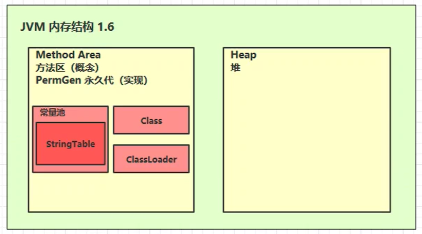

# JVM

> ​	改进笔记中对垃圾回收针对的区域所做的描述。[OOM异常详解](https://blog.csdn.net/weixin_39702187/article/details/104828030)

## 一、前言

### 1.1 什么是JVM

[(85条消息) 关于JVM(基本常识)_JVM是什么意思_小蔡学编程的博客-CSDN博客](https://blog.csdn.net/weixin_51373750/article/details/123392987)

​		`JVM（Java Virtual Machine）`是一种用于计算设备的规范，它是一个虚构出来的计算机，是通过在实际的计算机上仿真模拟各种计算机功能来实现的。引入Java语言虚拟机后，Java语言在不同平台上运行时不需要重新编译。Java语言使用Java虚拟机屏蔽了与具体平台相关的信息，使得Java语言编译程序只需生成在Java虚拟机上运行的目标代码（`字节码`），就可以在多种平台上不加修改地运行。

​		 **简单地说，JVM是《JVM虚拟机规范》中提出来的规范，并不是具体实现，相当于“接口”，而真正实现它的是形如HotSport的“实现类”**。

> ​		扩展：JVM其实并不是只为Java语言服务的，而是针对**字节码文件**，也就是说，只要是字节码文件，JVM就支持。
>
> 
>
> ​		像Java语言自不必说，还有大数据开发常用的Scala语言，Groovy语言，Python等其他语言经过处理也可以转换成字节码文件，从而在JVM环境中运行。


### 1.2 JVM、JRE、JDK 的关系

|                JVM、JRE、JDK 的关系图                 |
| :---------------------------------------------------: |
|  |


### 1.3 常见的JVM

|                     常见的JVM实现                     |
| :---------------------------------------------------: |
|  |


## 二、JVM内存结构

|                       JVM内存结构                       |
| :-----------------------------------------------------: |
|  |

​		JVM将虚拟机分为5大区域，程序计数器、虚拟机栈、本地方法栈、java堆、方法区；

- `程序计数器`：线程私有的，是一块很小的内存空间，作为当前线程的行号指示器，用于记录当前虚拟机正在执行的**线程指令地址**；
- `虚拟机栈`：线程私有的，每个方法执行的时候都会去创建一个栈帧，用于存储局部变量表、操作数、动态链接和方法返回等信息，当线程请求的栈深度超过了虚拟机允许的最大深度时，就会抛出StackOverFlowError；
- `本地方法栈`：线程私有的，保存的是`native方法`的信息，当一个JVM创建的线程调用native方法后，JVM不会在虚拟机栈中为该线程创建栈帧，而是简单的`动态链接`并**直接调用该方法**；
- `堆`：java堆是所有线程共享的一块内存，几乎所有对象的实例和数组都要在堆上分配内存，因此该区域经常发生垃圾回收的操作；
- `方法区`：存放已被加载的类信息、常量、静态变量、即时编译器编译后的代码数据。

> ​		`ClassLoader`：Java 代码编译成二进制后，会经过类加载器，这样才能加载到 JVM 中运行。
>
> ​		方法执行时，字节码中的每条指令是由执行引擎中的`解释器`逐行执行的，方法中被频繁调用的热点代码方法，由 `JIT 编译器(just-in-time compilation：即时编译)`优化后执行，`GC` 会对堆中不用的对象进行回收。


### 2.1 程序计数器

#### 1）定义

​		`Program Counter Register` 程序计数器（在寄存器中）

- 作用：是记录下一条 JVM 指令的`执行地址行号`。
- 特点：
    - 是线程私有的
    - 不会存在内存溢出


#### 2）作用

```java
0: getstatic #20 // PrintStream out = System.out; 
3: astore_1 // -- 
4: aload_1 // out.println(1); 
5: iconst_1 // -- 
6: invokevirtual #26 // -- 
9: aload_1 // out.println(2); 
10: iconst_2 // -- 
11: invokevirtual #26 // -- 
14: aload_1 // out.println(3); 
15: iconst_3 // -- 
16: invokevirtual #26 // -- 
19: aload_1 // out.println(4); 
20: iconst_4 // -- 
21: invokevirtual #26 // -- 
24: aload_1 // out.println(5); 
25: iconst_5 // -- 
26: invokevirtual #26 // -- 
29: return
```

- 解释器会将指令解释为机器码然后交给 CPU 执行，程序计数器会记录下一条指令的地址行号，这样下一次解释器会从程序计数器所记录的地址行号中拿到指令然后进行解释执行。
- 在多线程的环境下，如果两个线程发生了上下文切换，那么程序计数器会记录线程下一行指令的地址行号，以便于接着往下执行。


### 2.2 虚拟机栈

#### 1）定义

- 每个线程运行需要的内存空间，称为虚拟机栈
- 每个栈由多个栈帧（Frame）组成，对应着每次调用方法时所占用的内存
- 每个线程只能有一个活动栈帧，对应着当前正在执行的方法


#### 2）栈内存溢出

​		**栈帧过大^①^**、**过多^②^**、或者在程序中的一些**第三方类库操作^③^**，都有可能造成栈内存溢出，即会报`java.lang.stackOverflowError`错误。

​		对于③的情况，这里举例说明：

- 不恰当使用Jackson转换对象至JSON格式而导致栈内存溢出

```java
// Emp类，包含了Dept属性（Dpet类中也包含了Emp属性）---------循环依赖
class Emp {
    private String name;
    private Dept dept;
}

// Dept类，包含了Emp属性（Emp类中也包含了Dept属性）---------循环依赖
class Dept {
    private String name;
    private Emp emps;
}    

// main方法测试
public static void main(String[] args) throws Exception {
    Dept dept = new Dept();
    dept.setName("dept");

    Emp emp = new Emp();
    emp.setName("emp");
    emp.setDept(dept);

    dept.setEmps(emp);

    ObjectMapper objectMapper = new ObjectMapper();
    System.out.println(objectMapper.writeValueAsString(dept));
}
```


- 解决方案

```java
class Emp {
    private String name;
    @JsonIgnore
    private Dept dept;  // 原理：只允许通过部门关联员工，而无法通过员工关联部门。
}
```

> ​		`@JsonIgnore`：转换时忽略被注解的属性的JSON格式转换。


#### 3）线程运行诊断

##### ① 在Linux生产环境中使用jstack完成`线程诊断`的流程

- `top` 命令：查看是哪个进程占用 CPU 过高
- `ps H -eo pid, tid, %cpu | grep 进程id` ：通过 ps 命令进一步查看是进程中的哪个线程占用 CPU 过高
- `jstack 进程id`：通过查看**Java进程**中的线程的 nid，与刚才通过 ps 命令看到的 tid 来对比定位，注意 jstack 查找出的线程 id 是 16 进制的，而ps命令查到的tid是十进制的，我们需要手动进行换算。


##### ② jstack命令相关参数解释

[java jstack prio，tid，nid](https://www.freesion.com/article/1909574501/)

- `tid`：java内的线程id
- `nid`：操作系统级别线程的线程id
- `prio`：java内定义的线程的优先级
- `os_prio`：操作系统级别的优先级


#### 4）有关栈区的一些问题

##### ① 垃圾回收（GC）是否涉及栈内存？

​		不会。栈内存的使用是方法调用产生的，当方法调用结束后，此方法便会弹出栈，空间也会被释放。垃圾回收的范围是针对于堆内存的……


##### ② 栈内存分配越大越好吗？（`Xss`）

​		不是。因为物理内存是一定的，栈内存越大，虽然所支持的方法[递归]调用越多，但是同时可执行的线程数就会减少（这也就说明，**多个线程各自使用的栈空间的大小总和 = Xss所设置的大小**）。


##### ③ 方法的局部变量是否线程安全？

- 如果方法内部的变量没有逃离方法的作用范围（永远只能被当前方法使用），它就是线程安全的。

- 如果是方法内部的局部变量引用了对象，并逃离了方法的作用范围（**方法返回了这个对象**or**这个对象可能会被多个方法使用**），那就要考虑线程安全问题。


### 2.3 本地方法栈

​		**在Java中调用`本地方法(native)`时，所分配给这些`本地方法(native)`的内存空间**。像JDK源码中的一些带有 `native` 关键字修饰的方法就是需要 Java 去调用本地的C或者C++方法来实现某些功能。这是因为 Java 有时候没法直接和操作系统的底层进行交互，所以需要用到本地方法栈，服务于带 `native` 关键字的方法。


### 2.4 堆内存

#### 1）定义

- 堆(heap)
    - 堆是JVM中所有线程共享的，在**虚拟机启动**的时候就已经被创建好了
- 所有对象（对象本身）和数据都在堆中存放，也是GC的主要区域
  
- 特点
    - 它是为所有线程共享的区域，所以堆内存中的对象都需要考虑`线程安全`问题
    - 垃圾回收机制所针对的就是堆内存中没有被使用的对象


#### 2）堆内存溢出(`OOM`)

​		`java.lang.OutofMemoryError ：java heap space`。即堆内存溢出错误。

​		我们可以使用 `-Xmx 指定大小` 来指定堆内存大小。


#### 3）堆内存诊断

- `jps` 工具
    - 查看当前系统中有哪些 java 进程，并显示出这些进程的id
- `jmap` 工具
    - 使用jps拿到进程id后，就可以通过`jmap - heap 进程id`查看这个进程的堆内存占用情况。但是jmap只能查询到**某一时刻**下堆内存的占用情况。要想连续检测一段时间内堆内存的占用情况，我们可以使用jconsole。
- `jconsole` 工具
    - 图形化界面的、多功能的监测工具，可以实现`连续监测`。
- `jvisualvm` 工具
    - 比jconsole更强大的性能检测工具。


#### 4）日常之如何及时排查出堆内存溢出

​		虽然Java中拥有垃圾回收机制，但垃圾回收机制是针对于堆内存中`没有被引用的无用对象`。那么在现实场景中可能会存在：我们不断产生新对象，并且这些新对象一直在被使用，也就意味着这些对象不能被作为垃圾进行回收。这样，当这些无法被回收的对象达到一定数量时，毫无疑问就会产生**堆内存溢出**的问题。

​		那么在实际生产环境中由于内存空间很大，导致不太容易暴露堆内存溢出的问题，也许随着时间的累积，最终会导致内存溢出。那么我们在排错的时候，可以将堆内存设置的稍微小些，这样可以尽早的暴露出问题。


### 2.5 方法区

#### 1）定义

- 是JVM的所有线程共享的，主要用于存储`类的信息`、`常量池`、`方法数据`、`方法代码`等。
- 方法区逻辑上属于堆的一部分，但是为了与堆区分，通常又叫**非堆（Heap）区**


#### 2）永久代(`PermGen`)和元空间(`Metaspace`)

##### ① 永久代

- `PermGen` ， 就是 `PermGen space` ，全称是 `Permanent Generation space` ，是指内存的永久保存区域。
- PermGen space 是JDK7及之前， HotSpot虚拟机基于JVM规范对方法区的一个落地实现。在JDK8被移除，**元空间**是对它的替代。


##### ② 元空间

- 元空间与永久代之间最大的区别在于：**<font color="blue">元空间并不在虚拟机中，而是使用本地内存</font>**。
- 元空间则是JDK1.8及之后，HotSpot虚拟机对方法区的新实现。但永久代仍存在于JDK7中，并没完全移除，比如：
    - 字面量 （interned strings）转移到 Java heap；
    - 类的静态变量（class statics）转移到Java heap；
    - 符号引用（Symbols） 转移到 Native heap；


##### ③ 为什么使用元空间替换永久代？

1. 字符串存在永久代中，容易出现性能问题和内存溢出。
2. 类及方法的信息等比较难确定其大小，因此对于永久代的大小指定比较困难，太小容易出现永久代溢出，太大则容易导致老年代溢出。
3. 永久代会为 GC 带来不必要的复杂度，并且回收效率偏低。
4. Oracle 可能会将HotSpot 与 JRockit 合二为一。


#### 3）组成

|          Hotspot 虚拟机JDK1.6---堆&方法区---结构图           |
| :----------------------------------------------------------: |
|  |


|          Hotspot 虚拟机JDK1.8---堆&方法区---结构图           |
| :----------------------------------------------------------: |
|  |


> ​		JDK1.6 StringTable 的位置是在**永久代**中，JDK1.8 StringTable 的位置是在**堆**中。


#### 4）方法区内存溢出

- 1.8 之前会导致`永久代`内存溢出：java.lang.OutOfMemoryError: PermGen Space
    - 使用 `-XX:MaxPermSize=8m` 指定永久代内存大小
- 1.8 之后会导致`元空间`内存溢出：java.lang.OutOfMemoryError: Metaspace
    - 使用 `-XX:MaxMetaspaceSize=8m` 指定元空间大小

> ​		在实际情况下，比如通过**动态代理**生成了大量的代理类，则会很容易导致方法区内存溢出。


#### 5）`常量池`与`运行时常量池`

> ​		须知：**字节码**中包含`类的基本信息`、`常量池`，`类方法定义`，包含了`虚拟机的指令`


- 使用 `javap -v Test.class` 命令反编译如下代码

```java
public class Test {
    public static void main(String[] args) {
        System.out.println("Hello World!");
    }
}
```


- 结果

|                    字节码中的常量池                     |
| :-----------------------------------------------------: |
|  |

​		每条指令都会对应常量池表中一个地址，常量池表中的地址可能对应着一个`类名`、`方法名`、`参数类型`等信息。

|                       虚拟机指令                        |
| :-----------------------------------------------------: |
|  |


- **常量池**：俗称`静态常量池`。其实就是一张表，虚拟机指令根据这张常量表找到要执行的类名、方法名、参数类型、字面量等信息。
- **运行时常量池**：常量池是 \*.class 文件中的，当该类**被加载**以后，它的常量池信息就会放入运行时常量池，并把里面的`符号地址`变为`真实地址`。


#### 6）StringTable（字符串常量池）

[常量池、运行时常量池和字符串常量池（StringTable）之间的关系及StringTable经典面试题详解](https://blog.csdn.net/weixin_43882265/article/details/121196181)

- 案例（面试经典题）

```java
/*
   （1）a == c：为true是因为 b为final类型，当final变量是基本数据类型以及String类型时，
   如果在编译期间能知道它的确切值，则编译器会把它当做【编译期常量】使用。
   也就是说在用到该final变量的地方，相当于直接访问的这个常量，而不需要在运行时确定。
   因此在上面的一段代码中，由于变量b被final修饰，因此会被当做编译器常量，
   所以在使用到b的地方会直接将变量b替换为它的值。
   所以 c = b + "word" 等于 c = “hello” + “word” 。即--->【有final时是直接比较内容而不是地址】。

   （2）a == e：为false是因为 e = d + "word" 在字节码中是创建了一个StringBuilder对象，
   然后用StringBuilder对象执行append方法来拼接出字符串对象“ab”，然后再调用toString()方法将拼接的字符串对象转换成为String。
   而在StringBuilder的源码中，toString()方法是返回的一个【新new的对象】，也就是上面的s3是放在堆里面的。
   而s4则是【字符串常量】，是放在字符串常量池中的。所以返回的是false。 即----->【地址值不同】

   （3）a == f：为true是因为常量相加的时候，其实是在编译的时候就直接将这些个串相加为“helloword”。
   这是JVM的优化，结果在编译器就已经确定好了。所以运行的时候，a和f的字节码是一样的。
   因为在常量池中已经有了一个“helloword”，所以这两个引用指向的是同一个字符串“helloword”，
   所以返回结果也是true。即----->【指向同一个地址】
*/
public static void main(String[] args) {
    /*
       字符串的创建是【懒加载】的。
       只有当程序逐步向下执行时使用到了这个字符串对象时，才会将这个字符串对象创建注册进【字符串常量池(StringTable)】。
    */
    
    String a = "helloword";
    final String b = "hello";
    String d = "hello";
    String c = b + "word";
    String e = d + "word";
    String f = "hello" + "word";
    System.out.println(a == c);   // true
    System.out.println(a == e);   // false
    System.out.println(a == f);   // true

}
```


#### 7）StringTable特性

- 常量池中的字符串仅是符号，只有在被用到时才会转化为对象
- 利用串池的机制，来避免重复创建字符串对象
- `字符串变量（str1 + str2）`拼接的原理是StringBuilder（1.8中）
- `字符串常量("hello" + "world")`拼接的原理是编译器优化
- 可以使用intern方法，主动将串池中还没有的字符串对象放入串池中


#### 8）intern方法

[java中toString返回的字符串是存在字符串常量池中的吗？](https://www.zhihu.com/question/534695271)

- `JDK 1.8`：当一个字符串调用 `intern()` 方法时，如果 String Pool 中：
    -   存在一个字符串和该字符串**值**相等（使用 equals() 方法相等），就会返回 String Pool 中字符串的**引用地址**
    - 不存在，会把对象的**引用地址**复制一份放入串池，并返回串池中的引用地址，前提是堆内存有该对象。因为JDK1.8中的串池在堆中，所以为了节省内存而不再创建新的对象再放入串池中。也就是说，<u>调用intern方法使用的字符串对象和实际放入串池中的对象是**两个相同的对象引用**</u>（**<font color="blue">复制的是对象引用</font>**）
-  `JDK1.6`：将这个字符串对象尝试放入串池，如果有就不放入，返回已有的串池中对象的地址；如果没有会**把此对象复制一份**，再放入串池，并返回串池中的对象。也就是说，<u>调用intern方法使用的字符串对象和实际放入串池中的对象是**两个不同的对象**</u>（**<font color="blue">复制的是对象本身</font>**）


Demo：https://www.bilibili.com/video/BV1yE411Z7AP?p=32&vd_source=fc63803bb06c782d1a34636d7a7376bf


#### 9）new String(“a“) + new String(“b“); 字节码里面到底做了什么？

**题目**：

​		new String("ab")会创建几个对象？看字节码，就知道是两个。

- 一个对象是：new关键字在堆空间创建的；
- 另一个对象是：字符串常量池中的对象"ab"。 字节码指令：ldc


**思考**：

​		new String("a") + new String("b")呢？

- 对象1：new StringBuilder()
- 对象2：new String("a")
- 对象3：常量池中的"a"
- 对象4：new String("b")
- 对象5：常量池中的"b"

- 深入剖析： `StringBuilder的toString()`：生成了**对象6** ：new String("ab")

> ​		强调一下，toString()的调用，只是在堆中动态的生成了一个对象，但是在字符串常量池中，没有生成"ab"。


#### 10）StringTable 垃圾回收

- `-Xmx10m`：指定堆内存大小
- `-XX:+PrintStringTableStatistics`：打印字符串常量池信息
- `-XX:+PrintGCDetails -verbose:gc`：打印 GC 的次数，耗费时间等信息


```java
/**
 * 演示 StringTable 垃圾回收
 * 配置参数：-Xmx10m -XX:+PrintStringTableStatistics -XX:+PrintGCDetails -verbose:gc
 */
public class Code_05_StringTableTest {

    public static void main(String[] args) {
        int i = 0;
        try {
            for(int j = 0; j < 10000; j++) { // j = 100, j = 10000
                /* 由于对象未被直接引用，所以皆会被作为垃圾回收的对象 */
                String.valueOf(j).intern();
                i++;
            }
        }catch (Exception e) {
            e.printStackTrace();
        }finally {
            System.out.println(i);
        }
    }

}
```


#### 11）StringTable 调优

- 因为`StringTable`是由`HashTable`（哈希表）实现的，所以可以适当增加`HashTable桶`的个数，来减少字符串放入串池所需要的时间：`-XX:StringTableSize=桶个数`（最少设置为 **1009**）

- 考虑将字符串对象入池：可以通过 `intern` 方法减少字符串对象（特指**不同的字符串对象但拥有相同的串值**）重复入池，让不同变量指向相同常量。


### 2.6 直接内存(Direct Memory)

[直接内存(Direct Memory)](https://blog.csdn.net/sj15814963053/article/details/122634649)

- 常见于 `NIO` 操作中，被用作`数据缓冲区`
- 分配以及回收成本较高（因为是操控操作系统），但读写性能高
- 不受 JVM 内存回收管理

---


#### 1）使用直接内存的好处

##### ① 未使用直接内存时，文件读写流程


​		因为 Java 是不能直接操作操作系统中的文件的，需要切换到内核态，使用**本地方法**进行操作，然后读取磁盘文件。具体一点，就是会在系统内存中创建一个缓冲区，并将数据读到系统缓冲区， 然后再将系统缓冲区中的数据复制到 Java 堆内存中。缺点就是数据存储了两份：在系统内存中有一份，在Java 堆中有一份，这便造成了不必要的空间浪费与性能损耗。


##### ② 使用直接内存时，文件读写流程


​		直接内存是操作系统和 Java 代码都可以访问的一块区域，则无需将代码从系统内存复制到 Java 堆内存，从而提高了效率。


#### 3）直接内存回收原理

```java
public class Code_06_DirectMemoryTest {

    public static int _1GB = 1024 * 1024 * 1024;

    public static void main(String[] args) 
        throws IOException, NoSuchFieldException, IllegalAccessException {
//        method();
        method1();
    }

    // 演示 直接内存 是被 unsafe 创建与回收
    private static void method1() 
        throws IOException, NoSuchFieldException, IllegalAccessException {

        // 暴力反射获取Unsafe
        Field field = Unsafe.class.getDeclaredField("theUnsafe");
        field.setAccessible(true);
        Unsafe unsafe = (Unsafe) field.get(Unsafe.class);

        // 创建一块直接内存
        long base = unsafe.allocateMemory(_1GB);
        unsafe.setMemory(base,_1GB, (byte)0);
        System.in.read();

        // 回收所创建的直接内存
        unsafe.freeMemory(base);
        System.in.read();
    }

    // 演示 直接内存被 释放
    private static void method() throws IOException {
        ByteBuffer byteBuffer = ByteBuffer.allocateDirect(_1GB);
        System.out.println("分配完毕");
        System.in.read();
        System.out.println("开始释放");
        byteBuffer = null;
        System.gc(); // 手动 gc
        System.in.read();
    }
}


```

> ​		但是直接内存的回收并不是通过 JVM 的垃圾回收来释放的，而是通过unsafe.freeMemory 来手动释放的。


- 第一步：allocateDirect 的实现

```java
public static ByteBuffer allocateDirect(int capacity) {
    return new DirectByteBuffer(capacity);
}
```


- 第二步：DirectByteBuffer 类

```java
DirectByteBuffer(int cap) {   // package-private

    super(-1, 0, cap, cap);
    boolean pa = VM.isDirectMemoryPageAligned();
    int ps = Bits.pageSize();
    long size = Math.max(1L, (long)cap + (pa ? ps : 0));
    Bits.reserveMemory(size, cap);

    long base = 0;
    try {
        base = unsafe.allocateMemory(size); // 申请内存
    } catch (OutOfMemoryError x) {
        Bits.unreserveMemory(size, cap);
        throw x;
    }

    unsafe.setMemory(base, size, (byte) 0);
    if (pa && (base % ps != 0)) {
        // Round up to page boundary
        address = base + ps - (base & (ps - 1));
    } else {
        address = base;
    }
    cleaner = Cleaner.create(this, new Deallocator(base, size, cap)); // 通过虚引用，来实现直接内存的释放，this为虚引用的实际对象, 第二个参数是一个回调，实现了 runnable 接口，run 方法中通过 unsafe 释放内存。
    att = null;
}
```

​		这里调用了一个 `Cleaner` 的 `create` 方法，且后台线程还会对`虚引用`的对象监测，如果虚引用的实际对象（这里是 `DirectByteBuffer` ）被回收以后，就会调用 Cleaner 的 clean 方法，来清除直接内存中占用的内存。

```java
public void clean() {
    if (remove(this)) {
        try {
            // 调用函数的 run 方法, 释放内存
            this.thunk.run();
        } catch (final Throwable var2) {
            AccessController.doPrivileged(new PrivilegedAction<Void>() {
                public Void run() {
                    if (System.err != null) {
                        (new Error("Cleaner terminated abnormally", var2)).printStackTrace();
                    }

                    System.exit(1);
                    return null;
                }
            });
        }

    }
}

```

​		`this.thunk.run()`，thunk 即为 Runnable 对象。run 方法就是回调 `Deallocator` 中的 run 方法，

```java
public void run() {
    if (address == 0) {
        // Paranoia
        return;
    }
    // 释放内存
    unsafe.freeMemory(address);
    address = 0;
    Bits.unreserveMemory(size, capacity);
}

```


#### 4）直接内存的回收机制总结

​		使用了 `Unsafe` 类来完成`直接内存`的分配回收，回收需要主动调用`freeMemory` 方法。ByteBuffer 的实现内部使用了 Cleaner（虚引用）来检测 ByteBuffer 。一旦ByteBuffer 被垃圾回收，那么会由 ReferenceHandler（守护线程） 来调用 Cleaner 的 clean 方法调用 freeMemory 来释放内存。

**注意**：

```java
/**
  * -XX:+DisableExplicitGC 禁用显示的GC操作（调用System.gc()即为显示的进行GC）
  */
private static void method() throws IOException {
    ByteBuffer byteBuffer = ByteBuffer.allocateDirect(_1GB);
    System.out.println("分配完毕");
    System.in.read();
    System.out.println("开始释放");
    byteBuffer = null;
    System.gc(); // 此时：手动 GC 失效
    System.in.read();
}


```


一般用 JVM 调优时，会加上下面的参数：

```java
-XX:+DisableExplicitGC  // 静止显示的 GC
```

​		意思就是禁止我们手动的 GC，也就是让 `System.gc()` 无效，它是一种 `full gc`，会回收新生代、老年代，会造成程序执行的时间比较长。所以我们建议**通过 `unsafe` 对象调用 `freeMemory` 的方式释放内存**。


## 三、垃圾回收（GC）

### 3.1 如何判断对象可以回收

#### 1）[引用计数算法](https://blog.csdn.net/yw_1207/article/details/100017933)

​		当一个对象被引用时，就让引用对象的值加一，当值为 0 时，就表示该对象不被引用，可以被垃圾收集器回收。这个引用计数法听起来不错，但是有两个弊端，一是需要额外的空间来存储计数器，以及繁琐的更新操作；二是产生循环引用时，两个对象的计数都为1，就会导致两个对象都无法被释放。


#### 2）[可达性分析算法](https://blog.csdn.net/qq_32099833/article/details/109253339)

- JVM 中的垃圾回收器通过可达性分析来探索所有存活的对象
- 扫描堆中的对象，看能否沿着 GC Root 对象为起点的引用链找到该对象，如果找不到，则表示可以回收

- 可以作为 GC Root 的对象
    - **虚拟机栈（栈帧中的本地变量表）中引用的对象**
    - **方法区中类静态属性引用的对象**
    - **方法区中常量引用的对象**
    - **本地方法栈中 JNI（即一般说的Native方法）引用的对象**


##### 附：通过Eclipse Memory Analyzer 工具分析GC Root对象 

- 第一步：使用 `jps` 命令，查看程序的进程


- 第二步：使用` jmap -dump:format=b,live,file=1.bin 进程id`命令，转储堆内存占用文件
    - dump：转储文件
    - format=b：文件格式为二进制
    - live：只抓取当前存活着的对象。其实会执行一次GC，没有被GC的自然就是当前存活着的对象了
    - file：文件名


- 第三步：打开 `Eclipse Memory Analyzer` 对 转储 的`bin文件`进行分析


​		上图显示：分析出来的 GC Root 包括 ArrayList 对象。当我们将 list 置为null之后，再次进行转储，那么 list 对象就会被回收，图略……


#### 3）四种引用


1. **强引用**
    - 只有所有 GC Roots 对象都不通过【强引用】引用该对象，该对象才能被垃圾回收。其实就是普通的对象引用关系，如：`String s = new String(“强引用”);`
2. **软引用（SoftReference）**
    - 仅有软引用引用该对象时，在垃圾回收后，内存仍不足时会再次出发垃圾回收，回收软引用对象。
    - 可以配合（不强制）`引用队列`来释放软引用自身（**软引用本身也是一个对象**）
3. **弱引用（WeakReference）**
    - 仅有弱引用引用该对象时，在垃圾回收时，无论内存是否充足，都会回收弱引用对象。
    - 可以配合（不强制）`引用队列`来释放弱引用自身（**弱引用本身也是一个对象**）
4. **[虚引用](https://blog.csdn.net/jawnhaha/article/details/115523379)（PhantomReference）**
    - 必须配合引用队列使用。它的典型用法是：配合 `ByteBuffer` 使用，被虚引用引用的对象回收时，会将虚引用入队，再由 `Reference Handler 线程`调用虚引用对象的相关方法来释放**直接内存**
5. **终结器引用（FinalReference）**
    - 无需手动编码，但其内部配合引用队列使用，在垃圾回收时，终结器引用入队（被引用对象暂时没有被回收），再由 Finalizer 线程通过终结器引用找到被引用对象并调用它的 finalize 方法，**第二次 GC 时**才能回收被引用对象。


#### 4）演示常用引用的用法

##### ① 演示软引用

> ​		`软引用`适合在**内存敏感**的应用场景下应用。所谓内存敏感就是指**内存空间有限**，所以我们可以通过释放一些无关紧要的内存占用来腾出一部分内存空间。

```java
/**
 * 演示 软引用
 * -Xmx20m -XX:+PrintGCDetails -verbose:gc  ：设置最大堆内存大小为20MB，并打印GC详细参数
 */
public class Code_08_SoftReferenceTest {

    public static int _4MB = 4 * 1024 * 1024;

    public static void main(String[] args) throws IOException {
        method2();
    }

    // 设置 -Xmx20m , 演示堆内存不足,
    public static void method1() throws IOException {
        ArrayList<byte[]> list = new ArrayList<>();

        /* list强引用byte[] */
        for(int i = 0; i < 5; i++) {
            list.add(new byte[_4MB]);
        }
        System.in.read();
    }

    // 演示 软引用
    public static void method2() throws IOException {
        /* list强引用SoftReference，SoftReference软引用byte[]  */
        ArrayList<SoftReference<byte[]>> list = new ArrayList<>();
        for(int i = 0; i < 5; i++) {
            SoftReference<byte[]> ref = new SoftReference<>(new byte[_4MB]);
            System.out.println(ref.get());
            list.add(ref);
            System.out.println(list.size());
        }
        System.out.println("循环结束：" + list.size());
        for(SoftReference<byte[]> ref : list) {
            System.out.println(ref.get());
        }
    }
}
```

- `method1` 方法解析：首先会设置堆内存的最大大小为 20m，然后运行 mehtod1 方法，会抛`OOM异常`，堆内存不足，因为 mehtod1 中的 list 都是**强引用**。


- `method2` 方法解析：在 list 集合中存放了 软引用对象，当内存不足时，会触发 full gc，将被软引用的对象回收。细节如图：


​		在以上的代码演示中，在内存空间不足，并且GC之后内存空间仍不足时，虽然`被软引用引用的对象`被回收了，但是`软引用对象本身`却还没被回收（只不过为`null`值而已）。所以，一般在使用软引用时会搭配一个`引用队列`一起使用。

- 修改 method2 如下：

```java
// 演示 软引用 搭配引用队列
public static void method3() throws IOException {
    ArrayList<SoftReference<byte[]>> list = new ArrayList<>();
    // 引用队列
    ReferenceQueue<byte[]> queue = new ReferenceQueue<>();

    for(int i = 0; i < 5; i++) {
        // 关联了引用队列，当软引用所关联的 byte[] 被回收时，软引用自己会加入到 queue 中去
        // 再说仔细一点：软引用所关联的 byte[] 如果没有被回收，那么软引用本身不会被加入到queue中去
        SoftReference<byte[]> ref = new SoftReference<>(new byte[_4MB], queue);
        System.out.println(ref.get());  // 获取此软引用对象引用的对象
        list.add(ref);
        System.out.println(list.size());
    }

    // 从队列中获取无用的软引用对象（）并移除
    Reference<? extends byte[]> poll = queue.poll();
    // 是引用本身不为空，而不是引用的值不为空
    while(poll != null) {
        list.remove(poll);
        poll = queue.poll();
    }

    System.out.println("=====================");
    // 至此，list集合中无用的软引用被回收完毕了
    for(SoftReference<byte[]> ref : list) {
        System.out.println(ref.get());
    }
}
```


##### ② 演示弱引用

```java
public class WeakReferenceTest01 {

    public static void main(String[] args) {
        method1();
        System.out.println("&&&&&&&&&&&&&&&&&&&&&&&&&&&&&&&&&&");
        method2();
    }

    public static final int _4MB = 4 * 1024 * 1024;

    // 演示 弱引用
    public static void method1() {
        List<WeakReference<byte[]>> list = new ArrayList<>();
        for (int i = 0; i < 10; i++) {
            WeakReference<byte[]> weakReference = new WeakReference<>(new byte[_4MB]);
            list.add(weakReference);

            System.out.print("（" + i + "）");
            for (WeakReference<byte[]> wake : list) {
                System.out.print(wake.get() + ",");
            }
            System.out.println();
        }

        System.out.println("===========================================");

        for (WeakReference<byte[]> wake : list) {
            System.out.print(wake.get() + ",");
        }
        System.out.println();
    }

    // 演示 弱引用搭配 引用队列
    public static void method2() {
        List<WeakReference<byte[]>> list = new ArrayList<>();
        ReferenceQueue<byte[]> queue = new ReferenceQueue<>();

        for (int i = 0; i < 10; i++) {
            WeakReference<byte[]> weakReference 
                = new WeakReference<>(new byte[_4MB], queue);
            list.add(weakReference);
            System.out.print("（" + i + "）");
            for (WeakReference<byte[]> wake : list) {
                System.out.print(wake.get() + ",");
            }
            System.out.println();
        }
        System.out.println("===========================================");
        Reference<? extends byte[]> poll = queue.poll();
        while (poll != null) {
            list.remove(poll);
            poll = queue.poll();
        }
        for (WeakReference<byte[]> wake : list) {
            System.out.print(wake.get() + ",");
        }
    }
}
```


### 3.2 [垃圾回收算法](https://blog.csdn.net/qq_50313418/article/details/122889435)

#### 1）标记清除(`Mark Sweep`)

- 第一步：利用可达性去遍历内存，把存活对象和垃圾对象进行标记；

- 第二步：再遍历一遍，并将所有被标记的垃圾对象回收掉。
    - 特点：
        - 效率不行，标记和清除的效率都不高；
        - 标记和清除后会**产生大量的不连续的空间分片（内存碎片）**，可能会导致之后程序运行的时候需分配大对象而找不到连续分片而不得不触发一次GC。


#### 2）标记整理(`Mark Compact`)

- 第一步：利用可达性去遍历内存，把存活对象和垃圾对象进行标记；
- 第二步：将所有的存活的对象向一端移动，将端边界以外的对象都回收掉；
    - 特点：
        - 适用于存活对象多，垃圾少的情况（在同等空间条件下，存活的对象越多，意味着需要进行移动的对象就越少）；
        - 需要整理的过程，无内存碎片产生；


#### 3）复制(`Copy`)

​		将内存按照**容量大小**分为大小相等的两块，每次只使用一块，当一块使用完了，就将还存活的对象移到另一块上，然后再把使用过的内存空间移除；

- 不会有内存碎片
- 需要占用两倍内存空间（内存利用率较低）


> ​		**`from`中存的是上一次GC后的幸存者，`to`中存的是当前GC后的幸存者**。然后在当前GC后，to需要与from交换一下内存空间。


#### 4）分代收集算法

​		根据内存对象的存活周期不同，将内存划分成几块，java虚拟机一般将内存分成`新生代`和`老生代`，在新生代中，有大量对象死去和少量对象存活，所以采用**复制算法**，只需要付出<font color="blue">对少量存活对象的复制成本</font>就可以完成垃圾回收；而老年代中因为对象的存活率极高（<font color="blue">一直存活着的对象太多了</font>），没有额外的空间对他进行[分配担保]()，所以采用**标记-清理算法**或者**标记-整理算法**进行回收；

​		在JVM的`垃圾回收器`中，会根据不同的情况来采用不同的算法，而不是只使用一种算法。这在JVM的`分代垃圾回收`中被体现的淋漓尽致。


> - #### 分配担保原则
>
> 


#### 5）总结


### 3.3 分代垃圾回收


- 新创建的对象首先分配在 `Eden` 区
- 当**新生代**空间不足时，会触发 `Minor GC` ，`Eden` 区 和 `From` 区存活的对象使用 `Copy算法` 复制到 `To` 中，存活的对象年龄加一，然后交换 `From` 与 `To`

- `Minor GC` 会引发一次 `Stop The World (STW)`，这会导致其他活动着的用户线程的暂停，直到垃圾回收结束后，用户线程才会恢复运行
- 当`幸存区`中的对象寿命超过`阈值`时，会被晋升至**老年代**，最大的寿命是 15（占用4bit）。当然，可能会存在提前晋升的情况，也就是当**新生代**的空间不足的时候……

- 当**老年代**的空间不足时，会先触发 `Minor GC`，如果空间仍然不足，那么就触发 `Full GC` ，这会导致线程停止的时间更长！


#### 1）相关JVM参数

| 含义       | 参数                         |
| ---------- | ---------------------------- |
| 堆初始大小 | -Xms                         |
| 堆最大大小 | -Xmx 或 -XX:MaxHeapSize=size |
| 新生代大小         | -Xmn 或 (-XX:NewSize=size + -XX:MaxNewSize=size )            |
| 幸存区比例（动态） | -XX:InitialSurvivorRatio=ratio 和 -XX:+UseAdaptiveSizePolicy |
| 幸存区比例 | -XX:SurvivorRatio=ratio            |
| 晋升阈值   | -XX:MaxTenuringThreshold=threshold |
| 晋升详情          | -XX:+PrintTenuringDistribution  |
| GC详情            | -XX:+PrintGCDetails -verbose:gc |
| FullGC 前 MinorGC | -XX:+ScavengeBeforeFullGC       |

- `堆内存`分配规则
    - 默认空余堆内存小于`40%`时，JVM就会增大堆直到`-Xmx`的最大限制；
    - 空余堆内存大于`70%`时，JVM会减少堆直到`-Xms`的最小限制；
    - 因此服务器一般设置**-Xms、-Xmx相等**以避免在每次GC 后调整堆的大小。


#### 2）Minor GC 与 FullGC

- `Minor GC`：GC的目标为新生代。
- `Full GC`：收集整个堆，包括新生代，老年代，永久代（在 JDK 1.8及以后，永久代被移除，换为metaspace 元空间）等所有部分的模式。


- **Minor GC触发条件**：
    - 当Eden区满时，触发Minor GC。
    - 新创建对象的大小大于Eden区所剩的空间。
- **Full GC触发条件**：
    - 调用`System.gc()`时，系统并不会马上进行垃圾回收，甚至不一定会执行垃圾回收，但仍增加了间歇性停顿的次数。建议能不使用此方法就别使用，让虚拟机自己去管理它的内存，可通过
        `-XX:+DisableExplicitGC`来禁止RMI调用System.gc()。
    - **在Minor GC后进入老年代的对象的平均大小大于老年代的可用内存（老年代空间不足）**：如果发现统计数据说之前Minor GC的平均晋升大小比目前Old Gen的剩余空间大，则不会触发Minor GC而是转为触发Full GC。
    - **方法区空间不足**：方法区中存放的为一些class的信息、常量、静态变量等数据，当系统中要加载的类、反射的类和调用的方法较多时，方法区可能会被占满，在未配置为采用`CMS GC`的情况下也可能会导致执行`Full GC`。这也是用元空间来取代永久代的原因，可以减少Full GC的频率，减少GC负担，提升其效率。
    - **新生代空间不足**：由Eden区、From Space区向To Space区复制，当对象的大小大于To Space可用内存时，则会提前把该对象转存到老年代，但此时老年代的可用内存小于该对象的大小。
    - **堆中分配很大的对象**：所谓大对象，是指需要大量连续内存空间的java对象，例如很长的数组，这种对象会直接进入老年代，而<font color="green">老年代虽然拥有很大的剩余空间，但是无法找到足够大的**连续空间**来分配给当前对象</font>，这种情况也会触发Full GC。为了解决这个问题，CMS垃圾收集器提供了一个可配置的参数，即
        `-XX:+UseCMSCompactAtFullCollection`，用于每次在Full GC之后进行一次**<font color="blue">碎片整理</font>**的过程。在进行内存整理的过程中是无法并发的，这也就意味着**空间碎片的问题没有了，但停顿时间不得不变长了**。JVM设计者们还提供了另外一个参数 `-XX:CMSFullGCsBeforeCompaction`，这个参数用于设置**在执行指定次数的Full GC后，再进行一次<font color="blue">碎片整理</font>**。
    - **CMS GC时出现`promotion failed`和`concurrent mode failure`**：
        - 对于采用CMS进行老年代GC的程序而言，尤其要注意GC日志中是否有`promotion failed`和`concurrent mode failure`两种状况，当这两种状况出现时可能会触发Full GC。
            - `promotion failed`：是在进行Minor GC时，`survivor space`放不下、对象只能**提前**放入老年代，但此时老年代也放不下造成的；
            - `concurrent mode failure`：是在执行CMS GC的同时有对象要放入老年代，而此时老年代空间不足造成的（注意：**有时候“空间不足”是CMS GC时当前的浮动垃圾过多导致暂时性的空间不足触发Full GC**）；其对应的解决办法为：增大survivor space、老年代空间或调低触发并发GC的比率。


#### 3）GC 分析

```java
public class Code_10_GCTest {

    private static final int _512KB = 512 * 1024;
    private static final int _1MB = 1024 * 1024;
    private static final int _6MB = 6 * 1024 * 1024;
    private static final int _7MB = 7 * 1024 * 1024;
    private static final int _8MB = 8 * 1024 * 1024;

    // -Xms20m -Xmx20m -Xmn10m -XX:+UseSerialGC -XX:+PrintGCDetails -verbose:gc
    public static void main(String[] args) {
        List<byte[]> list = new ArrayList<>();
        list.add(new byte[_6MB]);
        list.add(new byte[_512KB]);
        list.add(new byte[_6MB]);
        list.add(new byte[_512KB]);
        list.add(new byte[_6MB]);
    }
}
```

​		通过上面的代码，给 list 分配内存，然后观察`新生代`和`老年代`的情况，什么时候触发 `Minor GC`，什么时候触发 `Full GC` 等情况，使用前需要设置 JVM 参数。


> ​		在存放**<font color="green">大对象</font>**时，如果新生代没有足够的空间存放，但老年代有多余的空间，则会直接存放进老年代，而不会进行GC。
>
> ​		一个线程内的OOM异常不会导致整个Java进程的终止。


### 3.4 垃圾回收器

- GC的次数对应于吞吐量；GC的速度对应于响应时间。
- 工作方式都差不多，只是所使用到的回收算法不一样。


#### 1）串行

- 单线程
- 对堆内存的占用较少，适合个人电脑


```jvm
-XX:+UseSerialGC=serial + serialOld
```


- **安全点**：让其他线程都在这个点停下来，以免垃圾回收时移动对象地址，使得其他线程找不到被移动后的对象。因为是**串行**的，所以只有一个垃圾回收线程。且**在该线程执行回收工作时，其他线程进入阻塞状态**。
- **Serial 收集器**：Serial 收集器是最基本的、发展历史最悠久的收集器。
    - **特点**：单线程、简单高效（与其他收集器的单线程相比），采用`复制算法`。对于限定单个 CPU 的环境来说，Serial 收集器由于**没有线程交互的开销**，专心做垃圾收集自然可以获得最高的单线程收集效率。收集器进行垃圾回收时，必须暂停其他所有的工作线程，直到它结束（Stop The World）！
- **ParNew 收集器**：ParNew 收集器其实就是 Serial 收集器的多线程版本。
    - **特点**：多线程、ParNew 收集器默认开启的收集线程数与CPU的数量相同，在 CPU 非常多的环境中，可以使用 `-XX:ParallelGCThreads` 参数来限制垃圾收集的线程数。和 Serial 收集器一样存在 Stop The World 问题。
- **Serial Old 收集器**：Serial Old 是 Serial 收集器的老年代版本。
    - **特点**：是单线程收集器，采用`标记-整理算法`。


#### 2）吞吐量优先

- 多线程
- 对堆内存的占用较大，多核 CPU
- 让单位时间内，STW 的时间最短 0.2 0.2 = 0.4（让执行GC的次数少一些）


```jvm
-XX:+UseParallelGC ~ -XX:+UsePrallerOldGC
-XX:+UseAdaptiveSizePolicy
-XX:GCTimeRatio=ratio   // 1 / (1 + radio)
-XX:MaxGCPauseMillis=ms // 200ms
-XX:ParallelGCThreads=n
```


- **Parallel Scavenge 收集器**：与吞吐量关系密切，故也称为`吞吐量优先收集器`。
    - **特点**：属于新生代收集器。是采用`复制算法`的收集器（用到了新生代的幸存区），又是并行的多线程收集器（与 ParNew 收集器类似）。该收集器的目标是达到一个可控制的吞吐量。还有一个值得关注的点是：**<font color="blue">GC自适应调节策略</font>**（与 ParNew 收集器最重要的一个区别）

    - **GC自适应调节策略**：`Parallel Scavenge` 收集器可设置 `-XX:+UseAdptiveSizePolicy` 参数。当开关打开时不需要手动指定新生代的大小（-Xmn）、Eden 与 Survivor 区的比例（
        -XX:SurvivorRation）、晋升至老年代的对象年龄（-XX:PretenureSizeThreshold）等，虚拟机会根据系统的运行状况收集性能监控信息，**动态设置这些参数以提供最优的停顿时间和最高的吞吐量**，这种调节方式称为 **GC 的自适应调节策略**。
- `Parallel Scavenge` 收集器使用两个参数控制吞吐量：
    - `XX:MaxGCPauseMillis=ms` 控制最大的垃圾收集停顿时间（默认200ms）
    - `XX:GCTimeRatio=rario` 直接设置吞吐量的大小：`1 / (1 + ratio)`（吞吐量 = 运行用户代码时间 / ( 运行用户代码时间 + 垃圾收集时间 )。例如：我设置ratio为99，则`1 / (1 + 99) = 0.01`，也就是说，GC的时间只能占程序运行总时间的`1%`，则如果虚拟机共运行 100 分钟，垃圾收集器只能花掉 1 分钟，那么吞吐量就是 `(99 / (99 + 1)) * 100% = 99%` ）。

> ​		想让垃圾回收的**吞吐量**变高（即：垃圾回收的次数少），就得把堆内存的空间设置的大一点。但随之而来的，垃圾回收所花费的时间就会变长，即**系统响应时间**变长。

- **Parallel Old收集器**：Parallel Old收集器是Parallel Scavenge 收集器的老年代版本。
    - **特点**：是多线程收集器，采用`标记-整理算法`。


#### 3）响应时间优先---CMS（Concurrent Mark Sweep）

- 多线程
- 对堆内存的占用较大，多核 CPU
- 尽可能让 STW 的单次时间最短 0.1 0.1 0.1 0.1 0.1 = 0.5（让每次GC的速度快一些）


```jvm
-XX:+UseConcMarkSweepGC ~ -XX:+UseParNewGC ~ SerialOld
-XX:ParallelGCThreads=n ~ -XX:ConcGCThreads=threads
-XX:CMSInitiatingOccupancyFraction=percent
-XX:+CMSScavengeBeforeRemark
```

[CMS 垃圾收集流程](https://www.jianshu.com/p/6353747c9a1a)


##### ① 使用场景

- **CMS 收集器**：`Concurrent Mark Sweep`，一种以**<font color="blue">获取最短回收停顿时间（追求高响应）</font>**为目标的**老年代收集器**。在GC期间，`用户线程`和`GC线程`可以并发执行，因此在GC过程中用户也不会感受到明显的卡顿。
  - **特点**：基于`标记-清除算法`实现。并发收集、低停顿，但是会产生内存碎片。
  - **应用场景**：适用于注重服务的响应速度，希望系统停顿时间最短，给用户带来更好的体验等场景下。如 web 程序、B/S 服务。


##### ② 运行过程

- **CMS 收集器的运行过程分为下列4步**：
    1. **初始标记（CMS initial mark）**【有STW问题】：标记 GC Roots 能直接到的`下一级对象（仅仅只是下一级）`，由于跟 GC Root **直接关联**的下一级对象通常不会很多，因此这个过程其实很快。
    2. **并发标记（CMS concurrent mark）**【没有STW问题】：根据上一步的结果，继续向下标识所有关联的对象，直到这条链上的最尽头。这个过程是多线程的，虽然耗时理论上会比较长，但是其它工作线程并不会阻塞，没有 STW。
    3. **重新标记（CMS remark）**【有STW问题】：顾名思义，就是要再标记一次。为啥还要再标记一次？因为第 2 步并没有阻塞其它工作线程，其它线程在标识过程中，很有可能会产生新的垃圾。此次的标记重在标记出那些后产生的新的垃圾。
    4. **并发清除（CMS concurrent sweep）**【没有STW问题】：对标记的对象进行清除回收，清除的过程中，可能仍然会有**新的垃圾**产生，这些垃圾就叫`浮动垃圾`。如果当用户需要存入一个很大的对象时，新生代放不下去，而老年代又由于浮动垃圾过多也无法存储这个对象，就会出现一次`并发失败（Concurrent Mode Failure）`。这时，JVM将会启用后备方案：STW，并临时启用 `Serial Old 收集器`，对老年代垃圾使用`标记-整理算法`进行清除，这样一来，停顿时间就很长了！


##### ③ CMS存在的问题

- **并发回收导致CPU资源紧张**：在并发阶段，它虽然不会导致用户线程停顿，但却会因为占用了一部分线程而**导致应用程序变慢，降低程序总吞吐量**。CMS默认启动的回收线程数是：`（CPU核数 + 3）/ 4`，当CPU核数不足四个时，CMS对用户程序的影响就可能变得很大。

- **无法清理浮动垃圾**：在CMS的**并发标记**和**并发清除**阶段，用户线程还在继续运行，就还会伴随有新的垃圾对象不断产生，但这一部分垃圾对象是出现在标记过程结束以后，CMS无法在当次收集中处理掉它们，只好留到下一次垃圾收集时再清理掉。这一部分垃圾称为“浮动垃圾”。

- **并发失败（Concurrent Mode Failure）**：由于在**垃圾回收阶段用户线程还在并发运行**，那就还需要预留足够的内存空间提供给用户线程使用，因此CMS不能像其他回收器那样等到老年代几乎完全被填满了再进行回收，必须预留一部分空间供并发回收时的程序运行使用。默认情况下，当老年代使用了 `92%` 的空间后就会触发 CMS 垃圾回收，这个值可以通过 `-XX: CMSInitiatingOccupancyFraction` 参数来设置。这里会有一个风险：**要是CMS运行期间预留的内存无法满足程序分配新对象的需要，就会出现一次“并发失败”（`Concurrent Mode Failure`），这时候虚拟机将不得不启动后备预案：`Stop The World`，临时启用 `Serial Old` 来重新进行`老年代`的垃圾回收，这样一来停顿时间就很长了**。

- **内存碎片问题**：CMS是一款基于“`标记-清除`”算法实现的回收器，这意味着回收结束时会有内存碎片产生。内存碎片过多时，将会给大对象分配带来麻烦，往往会出现老年代还有很多剩余空间，但就是无法找到足够大的连续空间来分配当前对象，而不得不提前触发一次 Full GC 的情况。为了解决这个问题，CMS收集器提供了一个 `-XX:+UseCMSCompactAtFullCollection` 开关参数（默认开启），用于**在 Full GC 时开启内存碎片的合并整理过程**，由于这个内存整理必须移动存活对象，是无法并发的，这样停顿时间就会变长。还有另外一个参数 `-XX:CMSFullGCsBeforeCompaction`，这个参数的作用是要求CMS在执行过若干次不整理空间的 Full GC 之后，下一次进入 Full GC 前会先进行碎片整理（默认值为0，表示每次进入Full GC 时都进行碎片整理）。

    

> ​		CMS 收集器的内存回收过程是与用户线程一起并发执行的，可以搭配 ParNew 收集器（多线程，新生代，复制算法）与 Serial Old 收集器（单线程，老年代，标记-整理算法）使用。


[CMS详解](https://blog.csdn.net/weixin_45511599/article/details/125522660)

[(95条消息) GC中的 三色标记法_三色标记法 gc_骚人贵的博客-CSDN博客](https://blog.csdn.net/Gui_yunuo/article/details/106720168)


跨代引用？？？？？？

[java - CMS GC的初始标记阶段到底标记了哪些对象？ - SegmentFault 思否](https://segmentfault.com/q/1010000015396501?utm_source=tag-newest)


内存屏障？？？？？

https://www.nowcoder.com/questionTerminal/82d119e2fcba4acdb356f894e7c88331?orderByHotValue=1&mutiTagIds=639_618&page=20

内存屏障主要有：读屏障、写屏障、通用屏障、优化屏障、几种。
 以读屏障为例，它用于保证读操作有序。屏障之前的读操作一定会先于屏障之后的读操作完成，写操作不受影响，同属于屏障的某一侧的读操作也不受影响。类似的，写屏障用于限制写操作。而通用屏障则对读写操作都有作用。优化屏障则用于限制编译器的指令重排，不区分读写。前三种屏障都隐含了优化屏障的功能。


---


内存屏障主要解决了两个问题：**单处理器下的乱序问题和多处理器下的内存同步问题**。 

  流水线是**并行的**，多个指令可以同时处于同一个阶段，只要CPU内部相应的处理部件未被占满即可。 

  但这样会产生乱序。 

比如一条加法指令原本出现在一条除法指令的后面，但是由于除法的执行时间很长，在它执行完之前，加法可能先执行完了。再比如两条访存指令，可能由于第二条指令命中了cache而导致它先于第一条指令完成。
 **读屏障**：屏障之前的读操作一定会先于屏障之后的读操作完成，写操作不受影响，同属于屏障的某一侧的读操作也不受影响。
 **写屏障**：屏障之前的写操作一定会先于屏障之后的写操作完成，读操作不受影响，同属于屏障的某一侧的写操作也不受影响。

  **通用屏障**：对读写操作都有作用。 

  **优化屏障**：用于限制编译器的指令重排，不区分读写。


#### 4）响应时间优先---Garbage First（G1）

##### ① 适用场景

- 同时注重吞吐量和低延迟（响应时间）
- 超大堆内存（内存大的），会将堆内存划分为多个大小相等的区域（Region）
- **整体上是标记-整理算法，区域与区域之间是复制算法**
- 在 JDK8 中并不是默认开启的，而需要配置一些参数来开启
    - `-XX:+UseG1GC`：启用G1垃圾回收器
    - `-XX:G1HeapRegionSize=size`：设置划分的区域大小
    - `-XX:MaxGCPauseMillis=time`：设置GC时最大的暂停时间


##### ② G1垃圾回收阶段


- `Young Collection`【会STW】：收集新生代垃圾
- `Young Collection + Concurrent Mark`：如果老年代内存到达一定的阈值了，新生代垃圾收集的同时会执行一些并发的标记【不会STW】。
- `Mixed Collection`：会对**新生代** + **老年代** + **幸存区**等进行混合收集，等到收集结束，会重新进入到`Young Collection`。


###### Ⅰ. Young Collection

​		分代是按对象的生命周期划分，分区则是将堆空间划分为连续几个不同小区间，每一个小区间可以独立进行垃圾回收。我们可以控制一次回收多少个小区间，这样方便控制 GC 产生的**停顿时间**！

> ​		E：eden，S：幸存区，O：老年代
>
> 


###### Ⅱ. Young Collection + CM

- 在 Young GC 时会进行 GC Root 的**<font color="blue">初始化标记</font>**【会STW】
- 老年代占用堆空间比例达到阈值时，会进行**<font color="blue">并发标记</font>**【不会STW】，由 
    `-XX:InitiatingHeapOccupancyPercent=percent（默认45%）`决定


###### Ⅲ. Mixed Collection

会对 E、S、O 进行**全面的回收**

- **<font color="blue">最终标记</font>**【会 STW】
- **<font color="blue">拷贝存活</font>**【会 STW】

​		`-XX:MaxGCPauseMills=xxms` 用于指定最长的停顿时间！

> ​		**问**：为什么有的老年代被拷贝了，有的没被拷贝？
>
> ​		**答**：因为指定了最大停顿时间，所以如果对所有老年代region都进行回收，耗时可能过高。为了保证时间不超过设定的停顿时间，会回收**垃圾最多的老年代region**（回收后，能够得到更多内存）。


###### Ⅳ. G1|CMS发生FullGC的时机

- G1|CMS 在老年代内存不足时（老年代所占内存超过阈值）
    - 如果**垃圾产生速度慢于垃圾回收速度**，不会触发 Full GC，还是并发地进行清理。
    - 如果**垃圾产生速度快于垃圾回收速度**，便会触发 Full GC，然后退化成 Serial Old 收集器串行的进行GC，这就会导致停顿的时间更长。


##### ③ G1回收过程

> ​		G1（Garbage First）回收器采用**<font color="blue">面向局部收集</font>**的设计思路和**<font color="blue">基于Region的内存布局</font>**形式，是一款主要**面向服务端应用**的垃圾回收器。G1设计初衷就是替换 CMS，成为一种全功能收集器。G1 在JDK9 之后成为服务端模式下的默认垃圾回收器，取代了`Parallel Scavenge`加`Parallel Old` 的默认组合，而 CMS 被声明为不推荐使用的垃圾回收器。G1从整体来看是基于`标记-整理算法`实现的回收器，但从局部（Region与Region之间）上来看又是基于`复制算法`实现的。

​		**G1 回收器的运作过程 大致 可分为四个步骤**：

1. **初始标记**【会STW】：仅仅只是标记一下 GC Roots 能直接关联到的对象，并且修改
    `TAMS(Top At Mark Start)指针`的值，让下一阶段用户线程并发运行时，能正确地在可用的Region中分配新对象。这个阶段需要停顿线程，但耗时很短，而且是**借用进行Minor GC的时候同步完成的**，所以G1收集器在这个阶段实际并没有额外的停顿。
2. **并发标记**【不会STW】：从 GC Roots 开始对堆中对象进行可达性分析，递归扫描整个堆里的对象图，找出要回收的对象，这阶段耗时较长，但可与用户程序并发执行。当对象图扫描完成以后，还要重新处理在并发时有引用变动的对象。
3. **最终标记**【会STW】：对用户线程做短暂的暂停，处理并发阶段结束后仍有引用变动的对象。
4. **清理阶段**【会STW】：更新Region的统计数据，对各个Region的回收价值和成本（比较哪块Region中的垃圾多）进行排序，根据用户所期望的停顿时间来制定回收计划，可以自由选择任意多个Region构成回收集，然后把决定回收的那一部分Region的**存活对象**复制到空的Region中，再清理掉整个旧Region的全部空间。这里的操作**涉及存活对象的移动**，**必须暂停用户线程**，**由多条回收器线程并行完成的**。


#### 5）Young Collection [跨代引用](https://www.jianshu.com/p/53e5adf2addd)

- 新生代回收的跨代引用问题


- `Remembered Set`：存在于E中，用于保存新生代对象对应的脏卡
- `脏卡`：O 被划分为多个区域（一个区域512K），如果该区域引用了新生代对象，则该区域被称为**脏卡**


- 在引用变更的时候会使用到 `post-write barried` + `dirty card queue`
- 通过`concurrent refinement threads` 更新 Remembered Set


#### 6）总结

##### ① 各个垃圾回收器对比


##### ② 经典垃圾收集器直接的关系


> ​		图中连线表示它们可以搭配使用，Serial-CMS组合以及ParNew-Serial Old组合在JDK 9时已经被取消了。
>
> ​		**CMS与Serial Old直接也有连线，这是因为在CMS发生并发失败的时候（Concurrent Mode Failure）就会用备用方案Serial Old来进行收集**。


### 3.5 GC调优

查看虚拟机参数命令：

```java
java -XX:+PrintFlagsFinal -version | findstr "GC"
```

然后根据参数去查询具体的信息


#### 1）调优领域

- 内存
- 锁竞争
- cpu 占用
- io
- gc


#### 2）确定目标

> ​		权衡**低延迟/高吞吐量**，去选择合适的GC。

- CMS G1 ZGC
- ParallelGC
- Zing


#### 3）最快的 GC

> ​		首先排除减少因为自身编写的代码而引发的内存问题。

- 查看 Full GC 前后的内存占用，考虑以下几个问题
    - 数据是不是太多？
        - resultSet = statement.executeQuery(“select * from 大表”);
    - 数据表示是否太臃肿
        - 对象图
        - 对象大小 16 Integer 24 int 4
    - 是否存在内存泄漏
        - static Map map …
        - 软
        - 弱
        - 第三方缓存实现


#### 4）新生代调优

- 新生代的特点
    - 所有的 new 操作分配内存都是非常廉价的
        - `TLAB` (thread-lcoal allocation buffer)
    - 死亡对象回收零代价
    - 大部分对象用过即死（朝生夕死）
    - Minor GC 所用时间远小于 Full GC

- 新生代内存越大越好么？
    - 不是
        - 新生代内存太小：频繁触发 Minor GC ，会 STW ，会使得吞吐量下降
        - 新生代内存太大：老年代内存占比有所降低，会更频繁地触发 Full GC。而且触发 Minor GC 时，清理新生代所花费的时间会更长
    - 新生代内存设置为内容纳`[并发量 * (请求 - 响应)]`的数据为宜。
        - `请求 - 响应`的意思是说：在请求响应的这一个过程中所产生的对象（对象所占的总大小）。

- 幸存区需要能够保存 **当前活跃对象** + **需要晋升的对象**
    - 举个例子：如果有一些对象还没有达到晋升条件，但是此时幸存区的大小已经不够了，则会将这些对象提前存放至老年代。这就相当于变相的延长了这些对象的生命周期，并且会增加因老年代空间不足而导致的FullGC的概率。
- 晋升阈值配置得当，让长时间存活的对象尽快晋升
    - 举个例子：如果阈值设置的太高，会导致有一些会长时间存活的对象一直待在幸存区中无法被晋升。一方面，造成幸存区空间的浪费；另一方面，这些长时间存活的对象无法及时得到晋升，就会在幸存区中的`From`与`To`空间中来回复制，这样，就会产生一些性能损耗。

```java
-XX:MaxTenuringThreshold=threshold
-XX:+PrintTenuringDistrubution
```


#### 5）老年代调优

以 CMS 为例：

- CMS 的老年代内存越大越好。
- 先尝试不做调优，先观察到底有没有 Full GC ，如果没有或者出现的次数很少，就说明当前系统对老年代的设置已经足够合理了，则应尝试调优新生代。
- 观察当发生 Full GC 时老年代的内存占用情况，将老年代内存预设调大 1/4 ~ 1/3。

```java
// 当老年代的内存占用达到老年代内存空间的多少时，就使用CMS进行一次垃圾回收。则值越低，CMS越频繁。建议设置在75% ~ 80%之间（预留20% ~ 25%的空间给浮动垃圾）
-XX:CMSInitiatingOccupancyFraction=percent  
```


#### 6）案例

案例1：Full GC 和 Minor GC 频繁
案例2：请求高峰期发生 Full GC，单次暂停时间特别长（CMS）
案例3：老年代充裕情况下，发生 Full GC（jdk1.7）


---

## End 附录

### 6.1 JVM监控工具与调优

[jdk自带的JVM监控工具：jconsole ，jvisualvm，jmc](https://blog.csdn.net/zhaofuqiangmycomm/article/details/114919403)

[JVM监控与调优](https://blog.csdn.net/qq_26995513/article/details/77152887)


### 6.2 JVM常用参数

[(95条消息) JVM常用参数配置及作用_常用的JVM参数及作用_CaptHua的博客-CSDN博客](https://blog.csdn.net/CaptHua/article/details/124083099)

[JVM常用的参数](https://blog.csdn.net/qq_43418737/article/details/125170411)   

