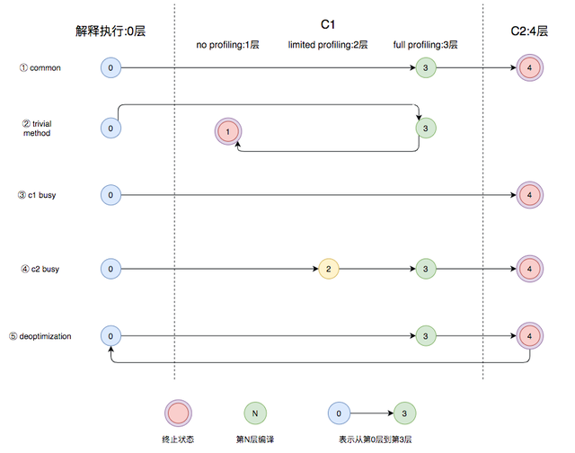
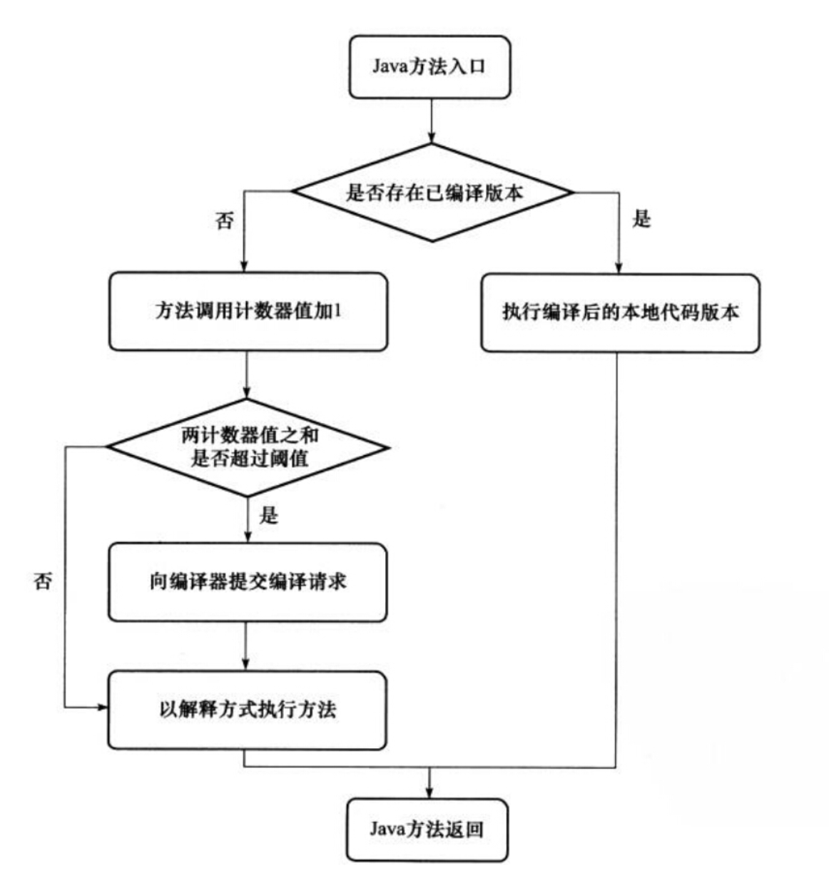
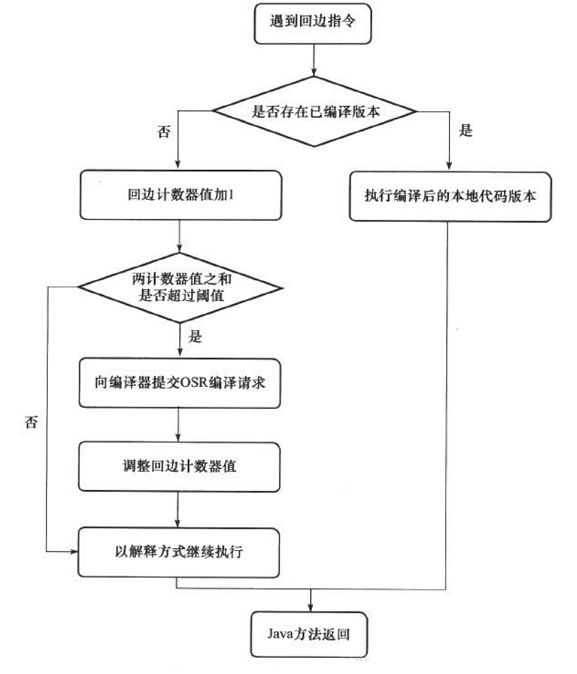

### 4.6 运行期优化

#### 1）概念解释

##### ① Java Compiler（Java 编译器）

​		Java编译器读取java源文件(`.java`)并将它们编译为java字节码文件(`.class`)。在Windows系统中的`javac.exe`可以简单看成是**Java编译器**。

##### ② Java Interpreter（Java 解释器）

​		Java编译器生成的是与机器码不同的`java字节码`，其并不能被CPU<u>直接</u>执行。而java解释器就像植根于软件中的CPU，能够**解析并执行**java字节码，解释方式是一行一行的读取，解释到哪就执行到哪。在Windows系统中的`java.exe`可以简单看成是**Java解释器**。

> ​		Java有个口号是“`Write Once,Run Anywhere`”，旨在展示Java程序设计语言的**跨平台特性**，而能够实现这个特性的基础就是`java字节码文件`和能够执行所生成的这个字节码文件的`Java虚拟机`。所以，至此我们可以知道：**生成java字节码文件就是Java编译器的工作，而执行字节码的工作就是JVM中Java解释器的工作**，没有它们就没有“`Write Once,Run Anywhere`”。

##### ③ JIT编译器（Just In Time Compile 即时编译器）

​		Java 程序最初是通过`解释器`来解释执行的，当虚拟器发现某个方法或代码块的运行特别**频繁**时（**以方法为单位**），就会把这些代码认定为“`热点代码`”，为了**提高热点代码的执行效率**，在运行时，虚拟机会把这些`热点代码`直接编译为`机器码`，并进行各种层次的优化，完成这个任务的编译器就被称为`即时编译器`。

​		HotSpot虚拟机中内置了两个**即时编译器**：`Client Complier(C1 编译器)`和`Server Complier(C2 编译器)`，简称为C1、C2编译器，分别用在==客户端==和==服务端==。

​		在`JDK8`以前，HotSpot虚拟机会根据自身版本与宿主机器的硬件性能自动选择运行模式，用户也可以使用【`-client`】或【`-server`】参数去强制指定虚拟机运行在==Client模式==或==Server模式==。用Client Complier可以获取更高的**编译速度（编译代码的这个过程耗时短，但编译出来的代码执行效率相对Server模式而言低一些）**，用Server Complier 来获取更好的**编译质量（编译代码的这个过程耗时长，但编译出来的代码执行效率更高）**。至于为什么提供多个即时编译器就与为什么提供多个垃圾收集器类似，都是为了<u>适应不同的应用场景</u>。

​		但从`JDK8`开始，默认启用**分层编译Tiered Compilers**，这时候已经没有【`-client`】和【`-server`】指令了。但如果只想开启 C2，可以关闭分层编译（`-XX:-TieredCompilation`），如果只想使用 C1，可以在打开分层编译的同时，使用参数：`-XX:TieredStopAtLevel=1`，其实就相当于只进行到level1层次的分层编译。

- JDK8以前
    - **client模式**：是一种轻量级编译器，也叫**C1**编译器，占用内存小，启动快，耗时短，它会进行简单并可靠的优化，更注重**效率**；
    - **server模式**：是一种重量级编译器，也叫**C2**编译器，启动慢，占用内存大，耗时长，但编译的代码执行效率更高，甚至会根据性能监控信息进行一些不可靠的激进优化，更注重**质量**；
- JDK8以后
    - **分层编译模式**：C1 + C2 在<u>开始阶段</u>采用 C1 编译，当代码运行到一定热度之后再采用 C2 **重新编译**；在 JDK8 之前，分层编译默认是关闭的，可以添加 `-server -XX:+TieredCompilation` 参数开启。

##### ④ 配置`解释执行`&`编译执行`的参数

[ JVM的三种运行参数](https://blog.csdn.net/fengsheng5210/article/details/123678695)

[JVM参数调优之-Xmixed、-Xint、-Xcomp](https://blog.csdn.net/Hathwayoung/article/details/109881552)

​		开发人员可以通过设置，控制虚拟机采用**解释执行**的方式或者采用**即时编译器**的方式又或者是**混合模式**，配置如下：

- `-Xint(解释模式 interpreted mode)`：强制JVM使用解释模式解释执行所有的字节码，禁用JIT。显而易见，这会**降低运行速度**，通常低10倍或更多。
- `-Xcomp(编译模式 compile mode)`：-Xcomp参数与-Xint正好相反，JVM在第一次使用时会把所有的字节码编译成**本地机器码**，从而带来效率上的最大程度的优化。然而，很多应用在使用-Xcomp时也会有一些性能损失，当然这比使用-Xint损失的少，原因是`-xcomp`**并没有让JVM合理的运用JIT编译器**。因为JIT编译器可以对是否需要进行即时编译的代码做判断，但如果所有的代码都进行编译的话，对于一些只执行一次的代码就没有意义了。
- `-Xmixed(混合模式 mixed mode)`【**默认**】，将**解释模式**与**编译模式**进行混合使用，由JVM自己决定，这是 JVM 默认的模式，也是推荐使用的模式。

##### ⑤ 分层编译

[JVM底层原理之什么是分层编译？ (baidu.com)](https://baijiahao.baidu.com/s?id=1732038087156353850)

###### Ⅰ. 5个层次

分层编译将 JVM 的执行状态分为了 5 个层次：

- level 0：解释器解释执行，默认开启profiling。
- level 1：C1 编译，执行不带profiling的C1代码，不开启 profiling。
- level 2：C1 编译，仅执行带方法调用次数和循环回边执行次数 profiling 的 C1 代码，开启部分profiling。
- level 3：C1 编译，执行带所有 Profiling 的 C1 代码，开启 profiling。
- level 4：C2 编译，执行C2的代码，C2编译也是将字节码编译为本地机器码，但是会启用一些编译耗时较长的优化，甚至会根据性能监控信息进行一些不可靠的**激进优化**。

###### Ⅱ. profiling（性能监控）

​		其中**profiling**就是收集能够反应程序执行状态的监控数据，它由多项数据组成，其中最基本的就是**方法的调用次数**和**循环回边的执行次数**。

###### Ⅲ. 各层次执行效率

​		虽然分了5个层次，但其实也没那么复杂，我们可以把`level 1、2、3`看做是一层：`C1`。因为这三层都是执行进行C1编译后的代码，唯一的区别是带了多少的`profiling`。因为profiling是影响性能的，所以执行效率上：**level1 > level2 > level3**。

> ​		那有的人会觉得既然level1是执行C1代码的三个层次中，执行效率最高的，那为什么不只执行level1呢？
>
> ​		话虽如此，由于level1没有开启profiling，执行效率最高，但这仅限于`C1`。如果是`C2`编译的代码，通常要比`C1`代码的执行效率高出**30% **！！而profiling，可以理解为就是开启`C2`编译条件的一把钥匙。

###### Ⅳ. 终止状态

​		level1由于不开启`profiling`，就相当于放弃了这把钥匙，自然也失去了开启C2编译的机会，所以我们可以得知，level1和level4是属于**终止状态**的。当一个方法执行到终止状态后，除非编译后的代码失效了，否则它就**不会再次发出该方法的编译请求**了。也就是说：一旦方法执行到level1和level4，一般它就固定下来了，后面不出意外也会一直执行level1或level4的层次。

###### Ⅴ. 分层编译的触发关系

​		**不管是什么方法，它都是从level 0开头的，这层是解释器，解释执行字节码，而不进行任何编译**。

|                        常见的编译路径                        |
| :----------------------------------------------------------: |
|  |

1. `common`：这条路径是一般情况，热点方法从解释执行，到被第3层的C1编译，最后进入C2编译。
2. `trivial method`：即不重要的方法，例如常见的get、set方法。第3层的profiling没有收集到有价值的数据，JVM就会放弃对其进行C2编译，转而进行无profiling的C1编译。因为差别并不大，还不如把宝贵的资源留给更需要进行C2编译的方法。
3. `C1 busy`：在C1忙碌的情况下，解释器在解释执行的过程中profiling，然后直接跳转到C2编译。
4. `C2 busy`：在C2忙碌的情况下，由于第3层C1又比第2层慢不少，为了不浪费资源，先进行第2层的C1，再随着时间进行第3层的C1编译。最后等C2不忙了，才进入C2编译。没错，这条线路不会进入第1层C1，**C2再忙也不会直接把可能需要优化的方法简单的交由C1处理就完事了**。
5. `deoptimization`：还有一种情况就是因为**激进优化**产生的问题，由于C2激进的策略，导致编译出来的C2代码有问题，这时候会进行`反优化`，即：**重新进入解释器解释执行的阶段**。

> ​		分层优化就是这样灵活的在各个层次间反复横跳，以达到**效率和质量**的平衡点，显然这比单一的使用C1或C2要强大多了。
>
> ​		从JDK8开始，默认启用**分层编译Tiered Compilers**，这时候已经没有【-client】和【-server】指令了，这时如果只想开启 C2，可以关闭分层编译（`-XX:-TieredCompilation`），如果只想使用 C1，可以在打开分层编译的同时，使用参数：`-XX:TieredStopAtLevel=1`，其实就相当于只进行到level1层次的分层编译。

##### ⑥ 什么是热点代码

- ==热点代码都是**方法**级别的==。即：热点代码分为
    - **被多次调用的方法**：方法调用的多了，代码的执行次数也多，成为热点代码很正常。
    - **被多次执行的循环体**：假如一个方法被调用的次数少，只有一次或两次，但方法内有个循环，一旦涉及到循环，部分代码执行的次数肯定多，这些多次执行的**循环体内代码**也被认为是“热点代码”。

##### ⑦ 如何检测热点代码

###### Ⅰ. 基于采样的热点探测

​		**基于采样的热点探测(Sample Based Hot Spot Detection)**：虚拟机会**周期性**的对各个线程的`栈顶`进行检查。则：如果某些方法经常出现在栈顶，这个方法就是“热点方法”。

- 缺点：不够精确，容易受到线程阻塞或外界因素的影响
- 优点：实现简单、高效，很容易获取方法调用关系

###### Ⅱ. 基于计数器的热点探测

​		**基于计数器的热点探测(Counter Based Hot Spot Detection)**：为每个方法(甚至是代码块)建立`计数器`，执行次数超过`阈值`就认为是“热点方法”。

- 缺点：实现麻烦，不能直接获取方法的调用关系
- 优点：统计结果精确

##### ⑧ 计数器

> ​		HotSpot 虚拟器为每个方法准备了两类计数器：**方法调用计数器**和**回边计数器**，两个计数器都有一定的**阈值**，超过阈值就会触发`JIT 编译`。使用`-XX:CompileThreshold` 可以设置阈值大小，Client 编译器模式下，阈值默认的值1500，而 Server 编译器模式下，阈值默认的值则是10000。

###### Ⅰ. 方法调用计数器

​		顾名思义，这个计数器用于统计**方法被调用的次数**。

​		当一个方法被调用时，会先检查该方法是否存在被JIT编译过的版本，如果存在，则优先使用编译后的本地机器码来执行。如果不存在已被编译过的版本，则将此方法的调用计数器值加1，然后判断方法调用计数器与回边计数器值之和是否超过方法调用计数器的阈值。如果超过阈值，那么将会向即时编译器提交一个该方法的代码编译请求。

​		`Client` 模式下的默认阈值是 `1500` 次，在 `Server` 模式下是 `10000`次，这个阈值可以通过 
`-XX:CompileThreadhold` 来人为设定。**如果不做任何设置，方法调用计数器统计的并不是方法被调用的绝对次数，而是一个相对的执行频率，即一段时间之内的方法被调用的次数**。当超过一定的时间限度，如果方法的调用次数仍然不足以让它提交给即时编译器编译，那么这个方法的调用计数器就会被减少一半，这个过程称为`方法调用计数器热度的衰减（Counter Decay）`，而这段时间就称为此方法的`统计的半衰周期（ Counter Half Life Time）`。进行热度衰减的动作是在虚拟机进行**垃圾收集**时顺便进行的，可以使用虚拟机参数 
`-XX:CounterHalfLifeTime` 参数设置半衰周期的时间，单位是秒。

​		如果不做任何设置，执行引擎并不会同步等待编译请求完成，而是继续进行解释器按照解释方式执行字节码，直到提交的请求被编译器编译完成。当编译工作完成之后，这个方法的调用入口地址就会被系统自动改写成新的，在**下一次调用**该方法时就会使用已编译的版本。

|              方法调用计数器与JIT 编译的交互过程              |
| :----------------------------------------------------------: |
|  |

###### Ⅱ. 回边计数器

​		统计一个方法中`循环体代码`执行的次数，在字节码中遇到控制流向后跳转的指令称为“**回边**”（ `Back Edge` ）。显然，建立回边计数器统计的目的就是为了触发 OSR 编译(`栈上替换 On Stack Replacement`)。关于这个计数器的阈值， HotSpot 提供了 
`-XX:BackEdgeThreshold` 供用户设置，但是当前的虚拟机实际上使用了 
`-XX:OnStackReplacePercentage` 来间接调整阈值。

> - OSR编译：
>
> ​		除了**以方法为单位进行即时编译**，还存在着**以循环为单位的即时编译**（OSR）。循坏回边计数器就是触发这种类型的编译。
>
> ​		OSR可以在程序执行过程中，动态地替换掉`Java方法栈帧`，从而**使得程序能够在非方法入口处进行解释执行和编译后的代码之间的切换**（说点人话：方法入口在替换前后没有发生改变）。
>
> ---
>
> 附：[热点代码编译(JIT)和栈上替换(OSR)](https://www.jianshu.com/p/f4fb342463d5)

​		它的作用就是统计一个方法中循环体代码执行的次数，在字节码中遇到**控制流向后跳转**的指令称为“回边”。

|                回边计数器与JIT 编译的交互过程                |
| :----------------------------------------------------------: |
|  |

> ​		Q：**在HotSpot虚拟机中使用的是哪钟热点代码检测方式呢**？
>
> ​		A：在HotSpot虚拟机中使用的是第二种——**基于计数器的热点探测方法**，因此它为每个方法准备了两个计数器：`方法调用计数器`和`回边计数器`。在确定虚拟机运行参数的前提下，这两个计数器都有一个确定的`阈值`，当计数器超过阈值溢出了，就会触发`JIT编译`。

#### 2）反射优化

