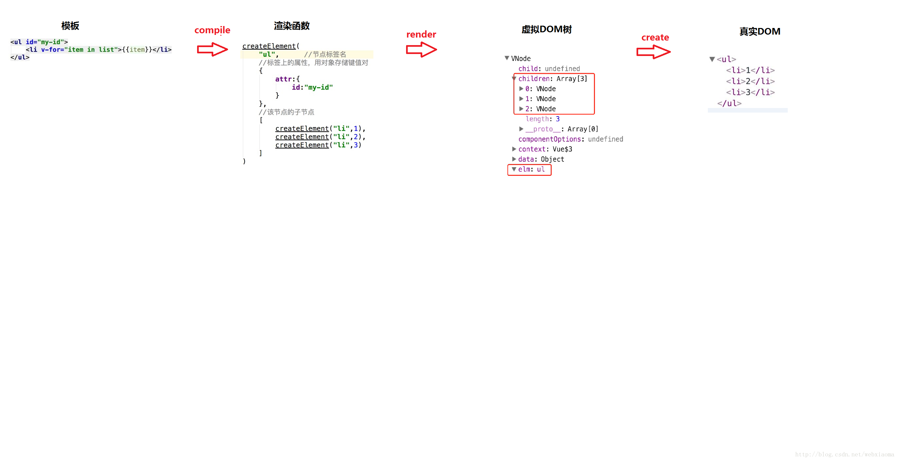

# Vue

## 引入

- 前端三要素：HTML、CSS、JavaScript

- - HTML决定**网页结构**
    - CSS决定**页面渲染效果**
    - JavaScript决定**网页功能**（交互、数据显示）

- UI框架

- - Bootstrap
    - AmazeUI
    - LayUI

- JS框架

- - jQuery
    - React
    - angular
    - node.js----后端开发
    - vue 集各种前端框架的优势发展而来


## 一、Vue简介

### 1.1 使用Vue的背景

- 使用jQuery的复杂性问题
    - 使用jQuery进行前后端分离开发，既可以实现前后端交互（Ajax），又可以完成数据渲
        染；
    - 存在的问题：jQuery需要通过**HTML标签拼接**、**DOM节点操作**来完成数据的显示，因此开发效
        率低并且容易出错，页面渲染的效率也较低；
    - vue是继jQuery之后的又一优秀的前端框架：专注于前端数据的渲染。其**语法简单**、**渲**
        **染效率高**；


### 1.2 业内流行的前端框架

- 前端三要素：HTML、CSS、JavaScript 
    - HTML决定网页结构
    - CSS决定显示效果
    - JavaScript决定网页功能（交互、数据显示）
- UI框架：
    - Bootstrap 
    - AmazeUI
    - Layui
- JS框架： 
    - jQuery（jQuery UI） 
    - React 
    - angular 
    - node.js：后端开发 
    - vue：集各种前端框架的优势发展而来


### 1.3 什么是MVVM

- `M-数据模型（Model）`：负责**数据存储**。泛指后端进行的各种业务逻辑处理和数据操控，主要围绕数据库系统展开。主要由JS来构建；
- `V-视图（View）`：负责**用户页面的展示**。主要由 HTML 和 CSS 来构建；
- `VM-视图模型（View Model）`：负责**业务逻辑处理**（比如Ajax|Axios请求等），对数据进行加工后交给视图展示，通过Vue类创建的对象叫Vue实例化对象，这个对象就是MVVM模式中的VM层，模型通过它可以将数据绑定到页面上，视图可以通过它将数据映射到模型上。

> ​		将结构布局（UI）与业务逻辑分开，通过`viewmodel`在**结构布局**和**业务逻辑**之间进行通信。


### 1.4 使用MVVM的优点

- **低耦合**：视图（View）可以独立于Model变化和修改。

- **可重用性**：我们可以把一些视图逻辑放在一个ViewModel里面（template），再让其它的View重用这段视图逻辑。

- **分层开发，便于维护与简化开发**：开发人员可以专注于`业务逻辑`（ViewModel）和`数据`（Model）的开发，设计人员可以专注于`页面设计`（View）。


### 1.5 Vue：渐进式的JavaScript框架

​		与其它重量级框架不同，Vue采用`自底向上`的**增量开发设计**。

​		所谓**渐进式**：就是阶梯式向前。Vue是轻量级的，它有很多独立的功能或库，我们可以根据项目来选用Vue的一些功能。例如：当我们开发项目时，若只用到vue的声明式渲染，我就只用Vue来完成声明渲染；当我们要用它的组件系统时，我们就可以使用它的组件系统。

​		Vue的渐进式表现在：声明式渲染----组件系统-----客户端路由------大数据装填管理-------构建工具。

​		VUE是**响应式**的（`Reactive`）。这也是Vue最独特的特性，也就是说当我们的**数据发生变更**时，Vue会帮我们更新所有网页中用到它的地方。


### 1.6 虚拟DOM

​		虽然JS的运行速度已经很快了，然而当面临大量的DOM操作时，对运行效率的影响也不容小觑。前端本身就是要通过JS处理DOM来更新视图数据的，而**每当更新数据后就会重新渲染整个页面**，这样会导致就算有些地方没有数据变动，DOM节点也被重新渲染了。这对性能会有很大的影响。

​		利用在**内存**中生成的与真实DOM所对应的数据结构来进行[局部（被更改|更新）]页面的渲染。这个在内存中生成的结构被称之为`虚拟DOM`。

​		当数据发生变化时，能够计算出重新渲染组件的最小代价，并应用到DOM操作上，而Vue就是利用了这一点。




## 二、Vue实例

> ​		每个使用Vue进行数据渲染的网页文档都需要创建一个Vue实例 —— `ViewModel`。


### 2.1 Vue实例的生命周期

​		Vue实例的生命周期指的是：**在Vue实例的`创建`，`运行`，到`销毁`的期间，所伴随发生的各种各样的事件，这些事件统称为生命周期**。

​		生命周期事件，也称生命周期函数，也称生命周期钩子。


### 2.2 生命周期函数的四个阶段

> ​		为了便于开发者在Vue实例的生命周期的不同阶段进行特定的操作，Vue在生命周期四个阶段的前、后分别提供了一个函数。这个函数无需开发者手动调用，当Vue实例到达生命周期的指定阶段时，会自动调用对应的函数。


#### 1）实例化期

​		**实例化期的生命周期函数**：`beforeCreate` 和 `created`。

> ​	初始化data、加载el。


#### 2）数据 挂载|加载 期

​		**数据 挂载|加载 期的生命周期函数**：`beforeMount` 和 `mounted`。

> ​	将Vue实例的data中的数据渲染到HTML标签。


#### 3）更新|重新渲染 期

​		**更新|重新渲染 期的生命周期函数**：`beforeUpdate` 和 `updated`。

> ​	当Vue的data数据发生变化，会将data中的数据重新渲染到HTML标签。


#### 4）实例销毁期

​		**实例销毁期的生命周期函数**：`beforeDestroy` 和 `destroyed`。


|                         生命周期函数                         |
| :----------------------------------------------------------: |
|  |


### 2.3 生命周期函数详解

- 实例化期

    - `beforeCreate`：在[Vue]实例创建之前执行，这时data 和 methods 中的 数据都还没有没初始化，**如果调用data和methods的数据的话，会报错**。

    - `created`：实例已经在内存中创建完毕，data 和 methods 中的数据也已经被初始化完毕，但此时还没有开始 编译模板，真实 dom 还没有生成，`$el` 也还不可用。

        - > ​		至此：data 和 methods都已经被初始化好了，如果要调用 methods 中的方法，或者操作 data 中的数据，最早可以在这个阶段中操作。

- 数据挂载期

    - `beforeMount`：在**内存**中已经编译好模板了，但是**还没有挂载到页面中**。即：页面还是一个旧页面。

    - `mounted`：`el` 被新创建的 `vm.$el` 替换，在内存中编译好的模板现在被挂载到了页面指定的容器中并显示。

        - > ​		至此：Vue实例已经初始化完成了。此时组件已经脱离了**创建阶段**，并进入到了**运行阶段**。 如果我们想要通过插件操作页面上的`DOM节点`，最早可以在这个阶段中进行。

- 更新期
    - `beforeUpdate`：在`data数据`更新之后，`组件数据`更新之前被调用。**这时data数据已经更新，但是页面中的数据还是旧的**，可想而知，真实DOM也还没被渲染。【页面还没有和最新的数据保持同步】
    - `updated`：updated 事件执行的时候，页面和 data 数据已经保持同步了，都是最新的。
- 销毁期
    - `beforeDestroy`：实例销毁之前调用。在这一步，实例上的data，methods等仍然完全可用。
    - `destroyed`：Vue 实例销毁后调用。调用后，Vue 实例指示的所有东西都会解绑定，所有的事件监听器会被移除，所有的子实例也会被销毁。


> ​		了解：
>
> - `activated`（激活前） ：在当某个组件使用了`keep-alive`组件缓存，并且该组件被激活时被调用。该钩子在服务器端渲染期间不被调用。
> - `deactivated`（激活后） ：在当某个组件使用了keep-alive组件缓存，并且当该组件停用时被调用。该钩子在服务器端渲染期间不被调用。
> - `errorCaptured`：当捕获一个来自子孙组件的错误时被调用。此钩子会收到三个参数：**错误对象**、**发生错误的组件实例**以及一个**包含错误来源信息的字符串**。此钩子可以返回 false 以阻止该错误继续向上传播。


## 三、Vue常用的7个属性

- `el属性`：用来指示Vue编译器从什么地方开始解析Vue的语法，可以说是一个占位符。
- `data属性`：用来组织从view中抽象出来的属性，可以说将视图的数据抽象出来存放在data中。
- `template属性`：用来设置模板。会替换页面元素，包括占位符。
- `methods属性`：放置页面中的业务逻辑，js方法一般都放置在methods中。
- `render属性`：创建真正的Virtual Dom。
- `computed属性`：用来计算属性。
- `watch属性`：
    - watch:function(new,old){}
    - 监听data中数据的变化
    - 两个参数。一个返回新值，一个返回旧值


## 四、Vue使用（时常更新）


### 缩写

​		`v-` 前缀作为一种视觉提示，用来识别模板中 Vue 特定的特性。当你在使用 Vue.js 为现有标签添加动态行为 (dynamic behavior) 时，`v-` 前缀很有帮助，然而，对于一些频繁用到的指令来说，就会感到使用繁琐。同时，在构建由 Vue.js 管理所有模板的[单页面应用程序 (SPA - single page application)](https://link.zhihu.com/?target=https%3A//en.wikipedia.org/wiki/Single-page_application) 时，`v-` 前缀也变得没那么重要了。因此，Vue.js 为 `v-bind` 和 `v-on` 这两个最常用的指令，提供了特定简写：

- `v-bind` 缩写

```vue
<!-- 完整语法 -->
<a v-bind:href="url"></a>
<!-- 缩写 -->
<a :href="url"></a>
```


- `v-on` 缩写

```vue
<!-- 完整语法 -->
<a v-on:click="doSomething"></a>
<!-- 缩写 -->
<a @click="doSomething"></a>
```


## Vue面试

[(85条消息) vue面试题整理(2022-持续更新中...)_老古懂的博客-CSDN博客](https://blog.csdn.net/qq_45659769/article/details/119564784)


## Vue扩展

### [vue中data和data()的区别](https://www.jb51.net/article/239474.htm)

### [computed计算属性和watch区别以及各自的使用](https://blog.csdn.net/qq_38110274/article/details/121242203)


