# 考前速记

## 1）阶码用移码表示 & 尾数用补码表示

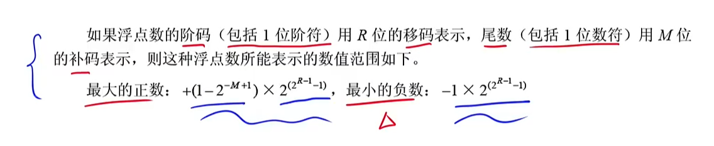

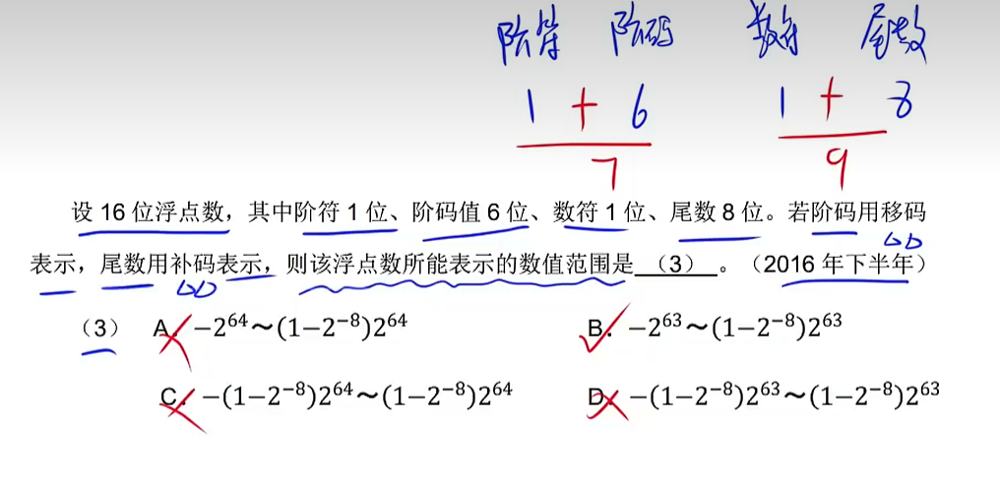

## 2）阶码用补码表示 & 尾数用原码表示

[2021年下半年第6题_哔哩哔哩_bilibili](https://www.bilibili.com/video/BV1ym4y1D7RW/?p=56&spm_id_from=pageDriver&vd_source=fc63803bb06c782d1a34636d7a7376bf)

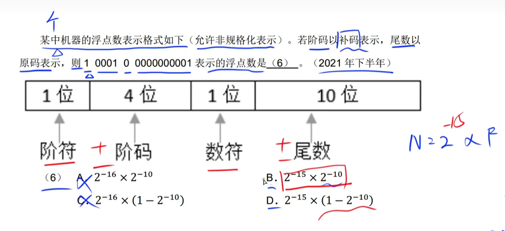

## 3）海明码

> ​		可以检错、纠错。码距>=2。

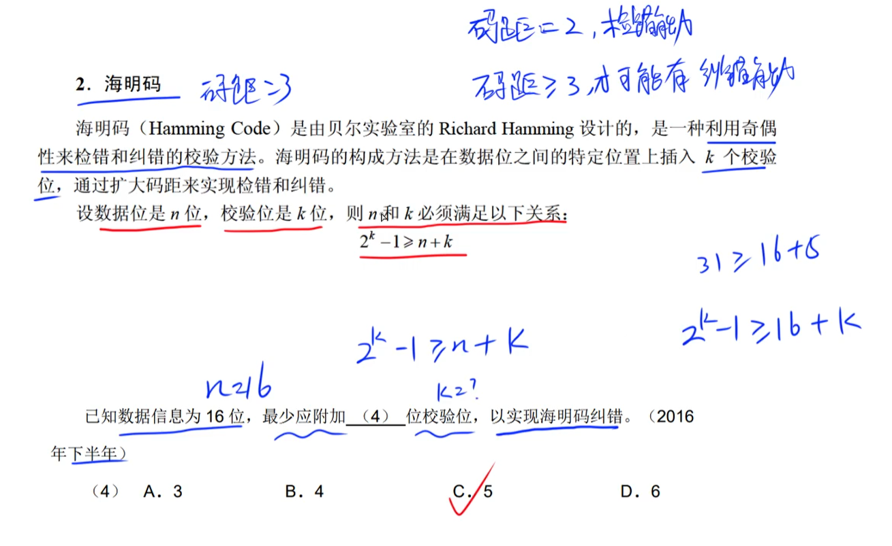

---

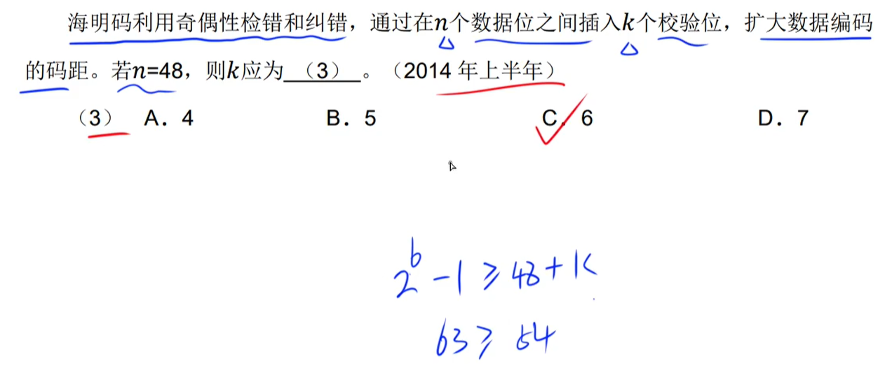

## 4）排序算法O(n)

### ==一般情况下，题目问算法的时间复杂度都是指：`最好时间复杂度`==

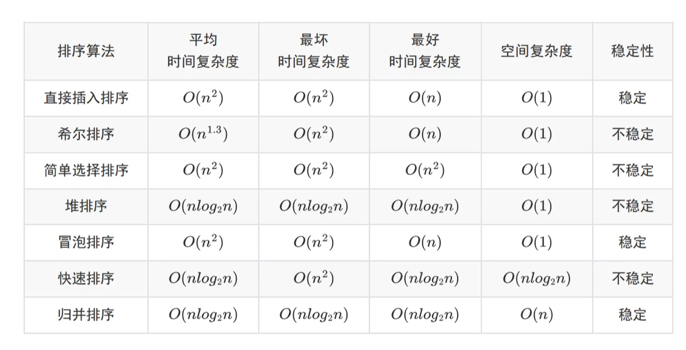

- 助记
    - **稳定**：乌龟（归并排序）直接（直接插入排序）从水里冒（冒泡排序）了出来。
    - **最好&非`O(n)`时间复杂度**：简单（简单选择排序）堆（堆排序）薯（快速排序）饼（归并排序）。
    - **非`O(1)`空间复杂度**：薯（快速排序）饼（归并排序）。

## 5）时间复杂度

## 6）分页存储原理

### ① 页面大小通常为4K

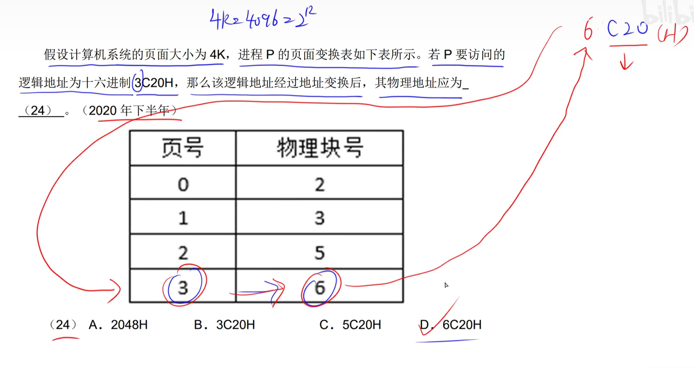

### ② 页面大小特殊情况：不是4K

- 1KB = 2^10^B，则代表`页内地址`的有10位（后10位）；页号就是最高位的那几位（排除掉后10位后的）1024(D) = ==1==<u>0000000000</u>(B) ，1为**页号**。

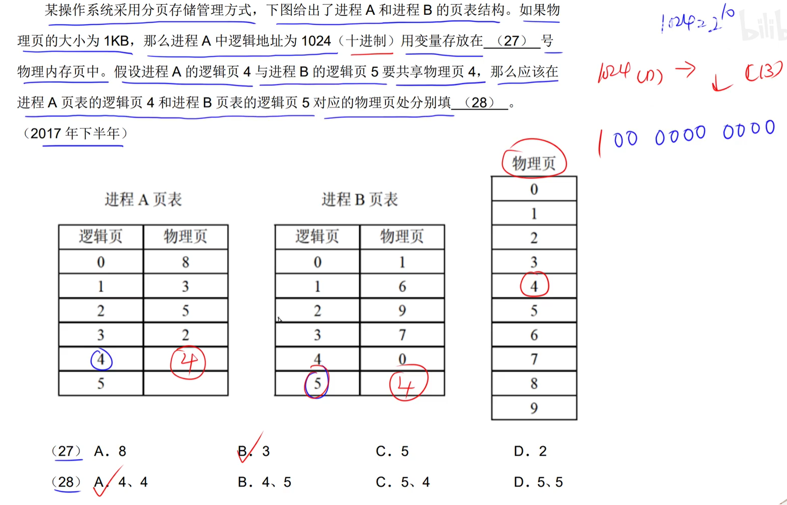

## 7）计网

### ① 网络设备是否隔离`广播域` & `冲突域`

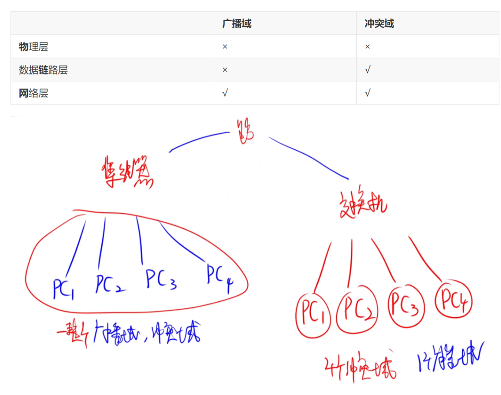

### ② IP地址 & MAC地址

- IP地址长度32(ipv4)或128(ipv6)位，MAC地址的长度为48位。
- IP地址工作在网络层，MAC地址工作在数据链路层。
- IP地址的分配基于网络拓扑，MAC地址的分配基于制造商。
- IP地址不具有唯一性，MAC地址具有唯一性。

## 8）树的性质

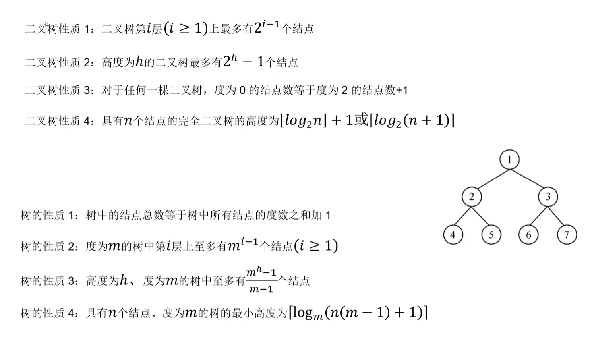

## 9）图

### 9.1 邻接矩阵存储`稠密图`（边数多）【无关于是否有向|无向】

### 9.2 邻接[链]表存储`稀疏图`（边数少）【无关于是否有向|无向】

## 10）`DFS` & `BFS`的时间复杂度只与`存储结构`有关

### 10.1 使用矩阵：O(n^2^)

### 10.2 使用链表：O(n + e)

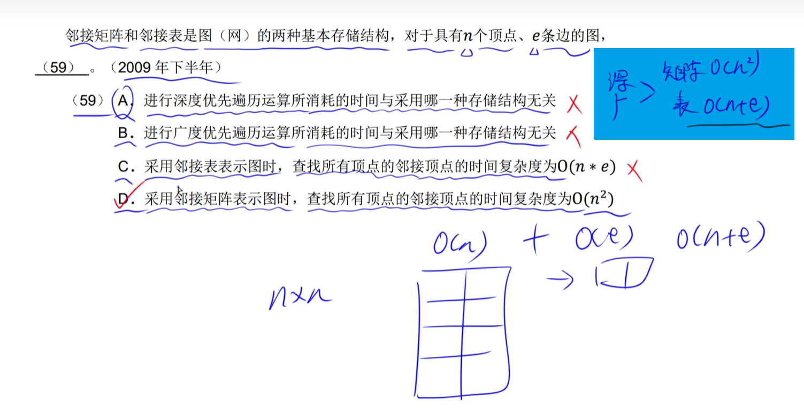

## 11）高频算法关键词识别

### `回溯算法`采用`DFS`策略搜索解空间

### `分支限界算法`采用`BFS`策略搜索解空间

### `动态规划算法`：具有最优子结构性质 & 子问题被重复求解<<全局最优解>>

### `贪心算法`：具有最优子结构性质 & 具有贪心选择【==要最好的==】的性质<<局部最优解>>

## 12）端口

#### FTP  `文件上传|数据传输`端口：==20==      &      `控制`端口：==21==

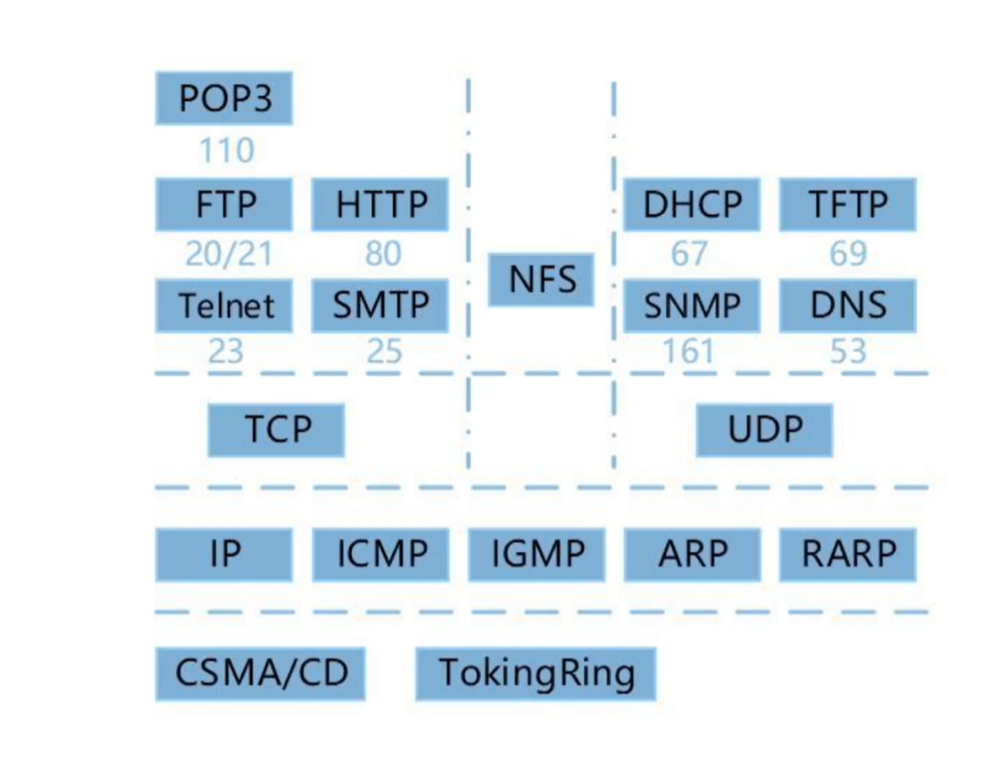

- 助记
    - TCP相关的，都带有T，外加一个POP
    - UDP相关的，都带有D或N，外加一个异类TFTP
    - IP相关的，都符合I\*P或者是A\*P模式

## 13）软件质量模型

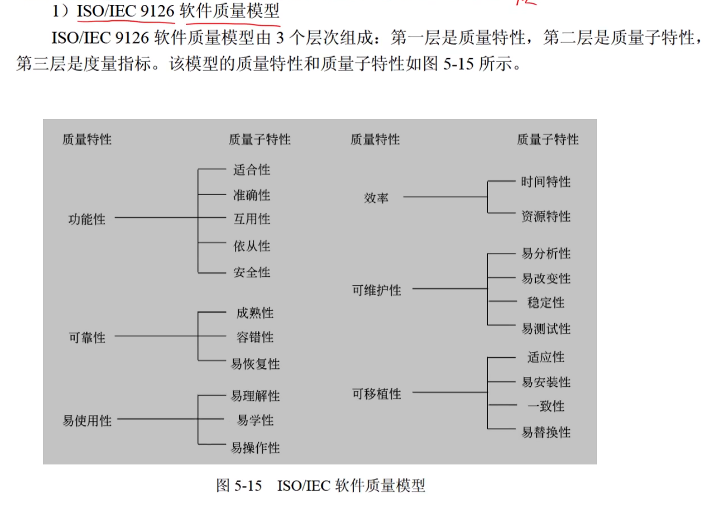

## 14）关系

#### include（包含关系）

​		一个基本用例包含另一个被包含用例。当基本用例执行时，被包含用例一定会执行。对包含关系的图形化表示是一条带箭头的虚线，并由基本用例指向被包含用例，在虚线上会用\<\<include>>进行标识。

#### extend（扩展关系）

​		当一个基本用例执行时，可能会出现特殊情况或者是可选情况，这个时候就会执行扩展用例。对扩展关系的图形化表示是一条带箭头的虚线，并由扩展用例指向基本用例，在虚线上会用\<\<extend>>进行标识。

#### generalize（泛化关系）

​		父用例泛化子用例，子用例继承父用例的所有属性和行为，并且父用例可以出现的地方，子用例都可以将其进行替换。

# %2022补%

## 1）CPU的基本组成

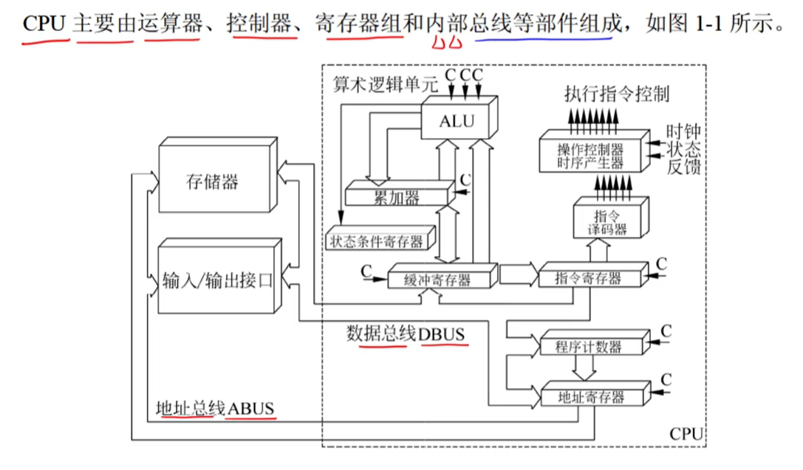

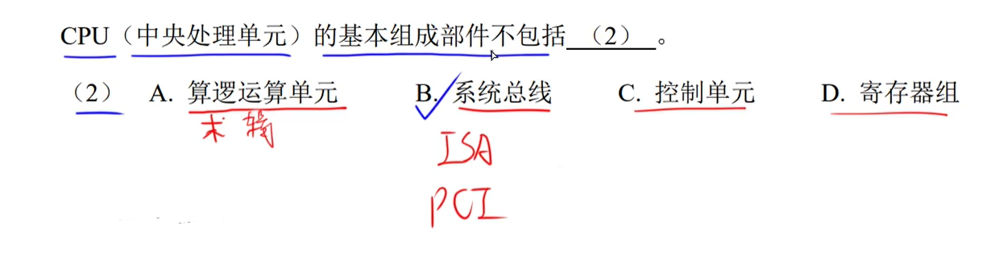

## 2）SRAM & DRAM

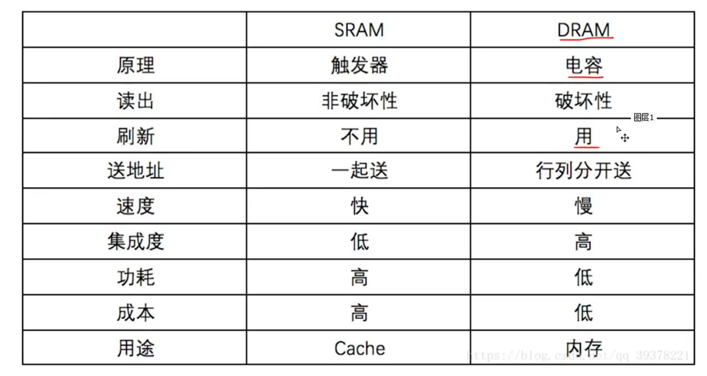

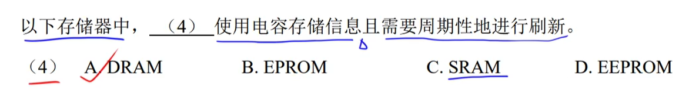

