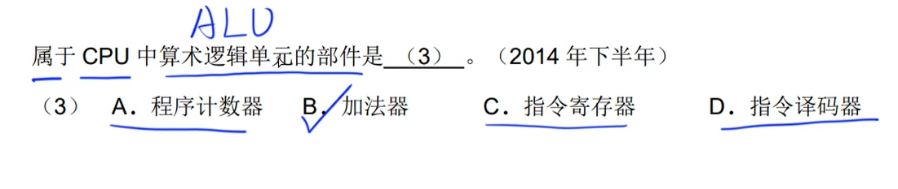
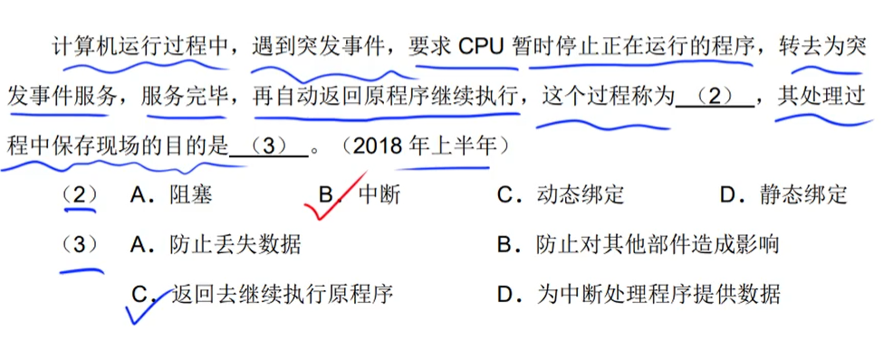
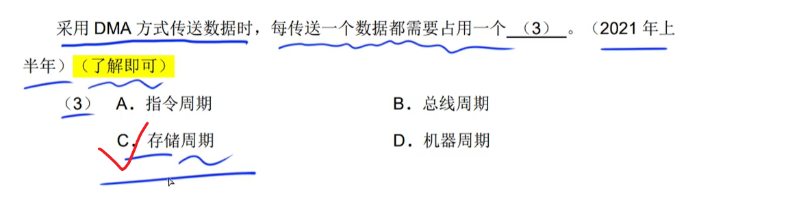

# 1~5题-计算机系统

## CPU

### CPU的基本组成  %2022补%

### 运算器

### 控制器

- **指令寄存器（IR）**：暂存CPU将要执行的指令【`指令 = 地址码 + 操作码`】
- **程序计数器（PC）**：用来 追踪|给出 下一条指令在内存中的地址
- **地址寄存器（AR）**：用来保存 当前 CPU所访问的内存单元的地址
- **指令译码器（ID）**：完成对指令中操作码的分析

###### 真题

---

---

---

---

---

----

---

#### ==指令寄存器对用户来说是完全透明的==

---

---

---

---

----

## 计算机基本单位

- 计算机中的**最小数据单位**：位|比特（bit）
- 计算机中的**最小存储单位**：字节（byte）

###### 真题

---

## 存储单位换算

先求芯片个数【(16K * 8bit) / (2K * 4) = 16 片】；

再求每个芯片所存储的地址容量大小【**((3FFFH - 0000H) ==+ 1==)** / 16D = 1024 D  <==> 400H】

- - 每个芯片所表示的地址区间。
    - 注意：不是`0000H ~ 0400H`，而是`0000H ~ 03FFH(0400H - 1H)`！

---

## 原码 & 反码 & 补码 & 移码

- **正数**的原码、反码、补码是相同的，移码是将补码的符号位取反
- **负数**的反码是原码的符号位不变，其它位取反；补码是反码+1

#### ==±0的补码和移码相同==

- 假设字长为8位
    - [+0]~原~=00000000，[一0]~原~=10000000

    - [+0]~反~=00000000，[一0]~反~=11111111

    - [+0]~补~=00000000，[一0]~补~=00000000

    - [+0]~移~=10000000，[一0]~移~=10000000

        - > ​		对于真值0，原码和反码各有两种不同的表示形式，而补码和移码只有唯一的一种表示形式。正因为补码和移码0的表示形式唯一，才使得补码和移码比原码和反码能够表示的负数个数多一个。

### 取值范围

#### 规律：==[[X]~补~]~补~ = [X]~原~==

- 8位
    - 原码：-127 ~ 127
    - 反码：-127 ~ 127
    - 补码：-128 ~ 127
    - 移码：-128 ~ 127

#### ① 定点数的补码和移码可表示2^n^个数

#### ② 定点数的原码和反码可表示2^n^ - 1个数

###### 真题

---

---

#### ==采用补码存储数据可以简化计算机运算部件的设计==

---

----

----

## 浮点数 & 规格化浮点数

#### ==对阶：小阶向大阶对齐，浮点数向右移==

---

### 规格化：将尾数的绝对值限定在区间`[0.5, 1]`

#### ==阶码的长度决定浮点表示的范围，尾数的长度决定浮点表示的精度==

---

---

#### ==小数点不需要占用存储位==

## 寻址

> 立即寻址：给出的是操作数本身。
>
> 直接寻址：给出的是操作数的地址。

## 校验码

### 奇偶校验码

> ​		只能检错、不能纠错。码距为2。

### 海明码

> ​		可以检错、纠错。码距>=2。

---

---

---

### 循环冗余校验码

> ​		只能检错、不能纠错。码距为2。
>
> - 模2运算

###### 真题

---

---

## RISC & CISC

- `RISC(Reduced Instruction Set Computer)`：精简指令集计算机
- `CISC(Complex Instruction Set Computer)`：复杂指令集计算机

###### 真题

---

---

----

---

## 流水线

###### 真题

---

#### 流水线操作周期：最长指令的时间段

#### 流水线吞吐率：最长流水线操作时间的倒数

#### 流水线执行n条指令的吞吐率

----

#### 串行执行 VS 流水线执行

---

---

---

## 存储器

#### SRAM & DRAM %2022补%

|                         SRAM & DRAM                          |
| :----------------------------------------------------------: |
|  |

###### 真题

---

---

#### ==按`内容`访问的存储器：关联|相联存储器==

---

----

#### 时间局部性

​		已经被执行过的程序，有很大的可能会马上被再次执行。

#### 空间局部性

​		在数组中能更好的解释。即一块空间，在被访问过一次之后，立即又访问了一块**临近**它的一块空间。		

#### 工作集理论

​		进程运行时，被**频繁访问**的页面集合。

## Cache

> ​		Cache与外存是八竿子打不着。它只与主存相关。

> ​		Cache的设计思想是：在合理的成本下**提高命中率**。
>
> ​		并没有明确的影响Cache命中率的关键因素。

#### ==发生快冲突次数：直接相连 > 组相联映像 > 全相联映像==

- 助记
    - 全相联映像的地址映像巨多！！！！！！！！！！！则发生冲突的概率最小！！！！！！！！

#### ==Cache与`主存地址`的映射是由`硬件`自动完成的==

###### 真题

---

---

---

## 中断

### 多级中断嵌套（了解）

### 中断响应时间

发出中断请求 ~ 开始进入中断处理程序

### 保存现场的目的是【返回去继续执行原程序】

### [可屏蔽中断和非|不可屏蔽中断](https://blog.csdn.net/lidandan2016/article/details/53437273/)（了解）

## 输入输出（I/O）控制方式

### 程序查询方式

- 定义|特点
    - CPU与I/O设备之间是**串行**工作的
    - 数据需要经过**CPU的中转**才能被存入主存

- 执行流程图

### 中断驱动方式

- 定义|特点
    - CPU与I/O设备之间是**并行**工作的
    - 数据需要经过**CPU的中转**才能被存入主存
    - I/O设备可以通过`中断信号`主动报告CPU操作已完成

- 执行流程图

### 直接存储器方式（DMA）---主存与外设之间

- 定义|特点
    - CPU与I/O设备之间是**并行**工作的
    - 数据不需要经过**CPU的中转**而可以直接由外设存入主存
    - ==每**传送一个数据**占用一个`存储周期`==
    - ==CPU在一个**`总线周期`|`机器周期`|`CPU周期`**结束时响应DMA请求==

- 执行流程图

###### 真题

---

----

---

----

----

---

---

### 只需了解的知识点

#### [时钟周期,机器周期,指令周期](https://www.knowbaike.com/it/16251.html)

---

## ==系统==总线（了解）

### 数据总线、地址总线、控制总线=>【`数、地、控`】

### 使用总线可以==减少线的数量==

### 总线中的单位换算

4GB = 2^2^ * 2^30^ = 2^32^（1GB = 2^30^B      GB-MB-KB-B）

- 地址总线\==>存储容量

- 数据总线\==>字长

### 求总线带宽

续上图：

### 其它了解

#### ==`SCSI`不属于系统总线==

#### ==PCI总线是并行内总线，SCSI总线是并行外总线==

---

#### 并行总线 & 串行总线 & 专用总线的特点

## 加密技术 & 认证技术

> ​		加密防止的是**被动攻击**；认证防止的是**主动攻击**。

### `窃听`问题

​		通过`加密技术`来解决：

##### 对称加密（私有秘钥加密算法|共享秘钥加密算法） & 非对称加密（公开秘钥加密算法） & 混合加密

### `篡改`问题

通过`认证技术`来解决：

##### 摘要

- **摘要**：对数据进行hash运算后的值【理想情况是：**信息摘要无法被篡改**】

### `假冒`问题

##### CA数字证书 | 数字签名

**数字证书|签名**

|                        CA数字证书结构                        |
| :----------------------------------------------------------: |
|  |

---

###### 真题

若发送方\~接收方的签名不一致，则数据不是**真实**/**有效**数据。

### `否认`问题

##### 数字签名

​		使用**非对称加密**（公开秘钥加密算法）算法来实现。

 

### 总结

`公钥`用于：加密和认证|验证

`私钥`用于：解密和签名

**私钥无论如何都不能在网络中进行传输**！！！

## 加密算法

##### 分类

|                    记忆法之`模糊列`记忆法                    |
| :----------------------------------------------------------: |
|  |

##### 题库

- 非对称算法可用于**数字签名**

- 对称算法加密解密速度快，适合于对**大量**明文消息做加密处理

###### MD5

## 可靠性公式

##### 串联系统

##### 并联系统

#### 主动攻击 & 被动攻击

>  ​		物理安全、网络安全、系统安全、应用安全。

