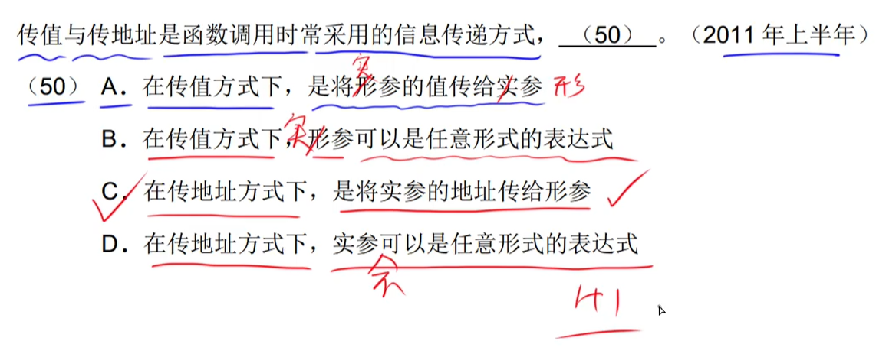

# 6分题-程序设计语言

## 编译程序和解释程序

|                     编译器工作阶段示意图                     |
| :----------------------------------------------------------: |
|  |

### 词法分析 & 语法分析 & 语义分析 & 目标代码生成

> - 在语法分析中，**语法错误**可以被全部检查出来。【分析语句的**形式**、程序的结构】
>
> - 在语义分析中，**语义错误**分为`静态语义错误`和`动态语义错误`。
>     - 静态语义错误可以在语义分析阶段被检查出来。
>     - 动态语义错误只可以在程序运行时被检查出来。

#### ==分配系统资源的工作在目标代码生成阶段完成==

### 中间代码（与机器无关）

### 正规式（进行`词法分析`时的一个工具）

> ​		在进行`词法分析`时的一个工具。

- 题库

- 排除法，得到最符合题意的那个选项

> ​		\*就代表可能出现的次数。即0\~n次。

## 程序设计语言基本知识

### 数据类型的作用

### 逻辑运算符

### 值传递 & 引用传递

- 常量的地址所引用的值不能被改变，所以，引用传递的时候，不能让实参为常量。
- 表达式，例如：`1 + 1` 。是没有所被引用的地址的，所以，引用传递的时候，不能让实参为表达式。

## 编译 & 解释程序翻译阶段

编译阶段步骤：**词法分析、语法分析、语义分析、\[中间代码生成、代码优化]、目标代码生成**。

- **在题目问解释方式的时候，看见目标程序，直接判错！**

## 符号表

## 有限自动机（进行==**词法分析**==的工具）

> - 确定的有限自动机：在识别字符之后，只有一种确定的转移状态。
> - 不确定的有限自动机：在识别字符之后，有多种转移状态。

> - 以是否能到达**终态**来判断是否能自动识别字符串。
> - 存在一种特殊的有限自动机，**终态**即是**初态**。
>     - 
>         - 

- 题库

|    其实A、B、D三个选项都对，但是B更规范…… 呃~………………     |
| :----------------------------------------------------------: |
|  |

## 上下文无关文法：表示各种`程序设计语言的语法规则`

## 中缀、后缀表达式|逆波兰式转换

|                         各符号优先级                         |
| :----------------------------------------------------------: |
|  |

- 中缀式：`a?b`
- 后缀式：`ab?`

> ​		中缀与后缀之间可以通过**栈**来转换。

|                             例题                             |
| :----------------------------------------------------------: |
|  |

---

例题：

- 优先级：> 大于 ^ 大于 v

## 语法树中、后序遍历

遍历二叉树……

## 杂题集锦

- 反编译通常不能把`可执行文件`还原成`高级语言源代码`

- 编译时为逻辑地址；运行时为物理地址

