# step03-下午题-试题1

## 数据流图的基本图形元素

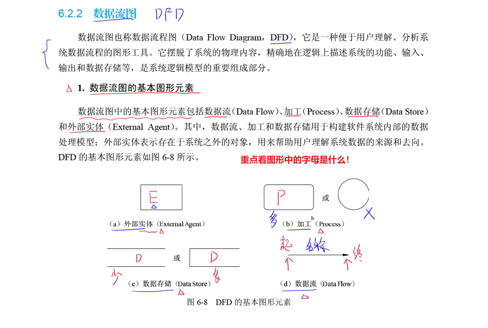

### 外部实体

> ​		**当前系统之外**的`人`、`物`、`外部系统`。

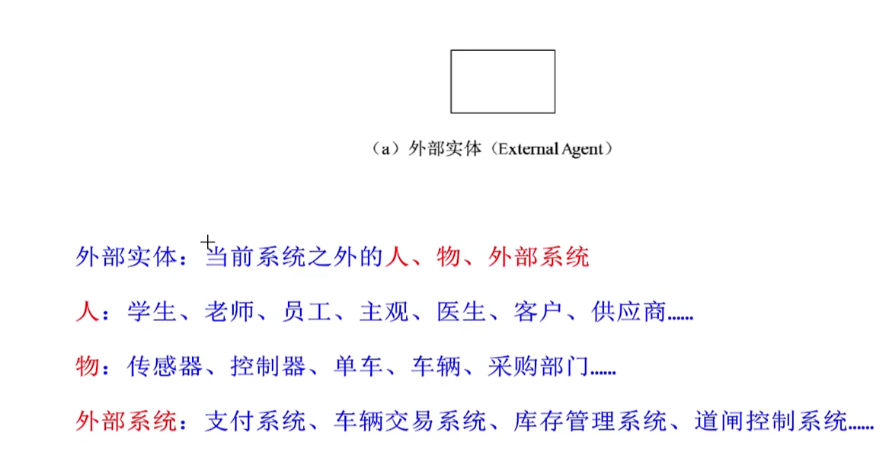

### 数据存储

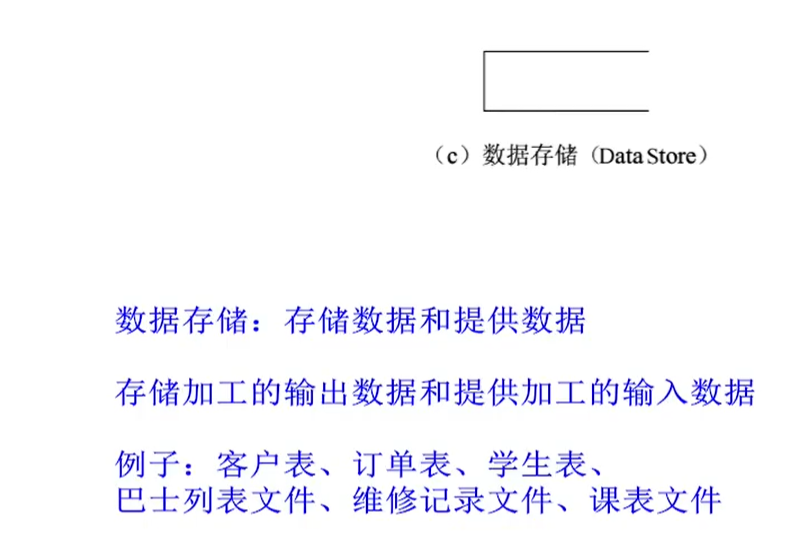

### 加工

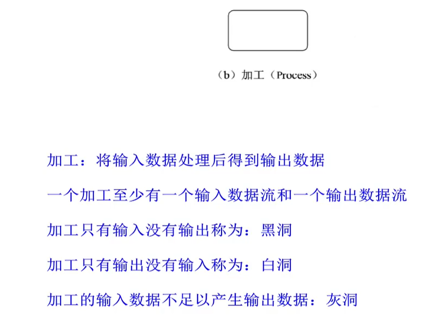

### 数据流

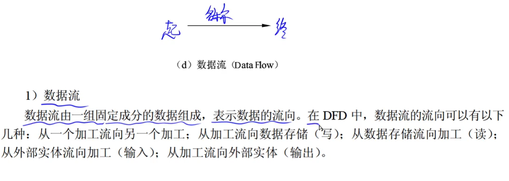

###### 解题耗时

- 问题1  <  5min

- 问题2  <  5min

- 问题3  <  15min

## 问题一

​		问**外部实体**的名称。

## 问题二

​		问**数据存储**的名称。

​		这些**数据存储**的名称都是：`XXX文件`、`XXX表`。

## 问题三解题思路

### 父图子图平衡

​		父图子图的数据流是约等于一一对应的。

### 加工既有数据流也有输出数据流

### 数据守恒

​		根据题目来找到缺失的数据流。

## 答题格式和注意事项

##### ==数据流的**起点**和**终点**，必定有一端是`加工`，或者两端都是`加工`==。

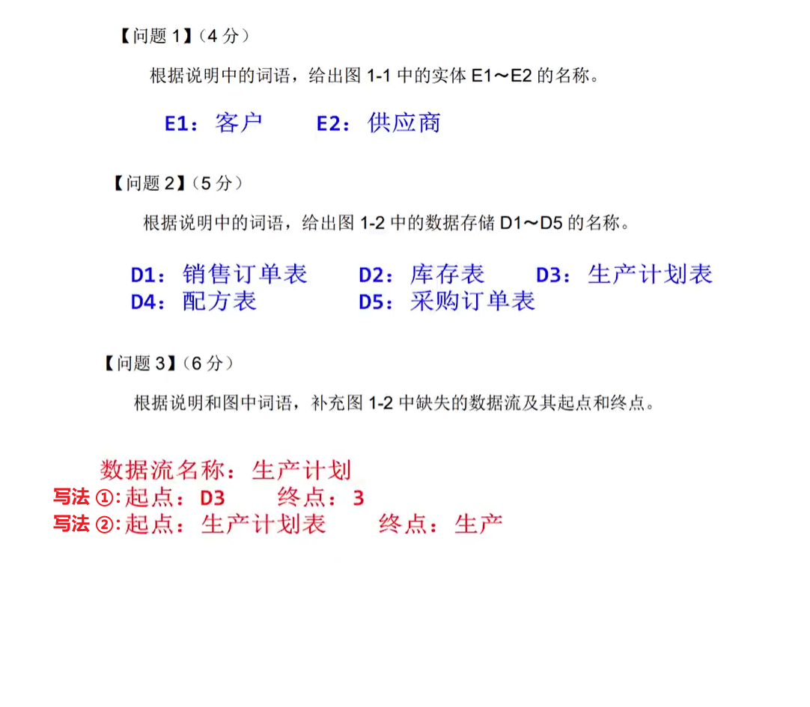

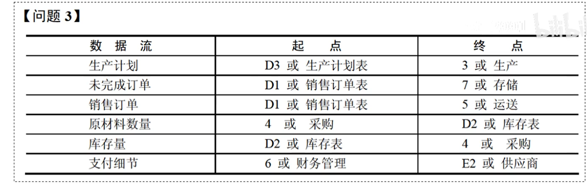

## 问题四：图存在的问题，答题例题

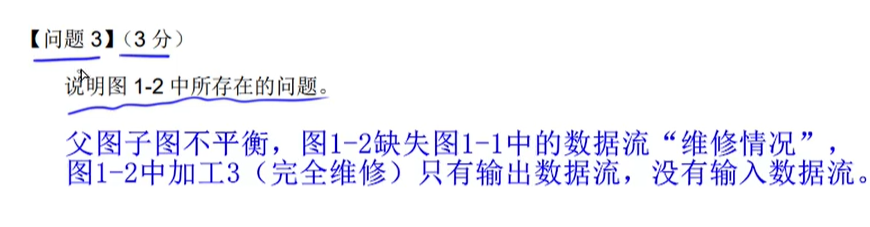

---

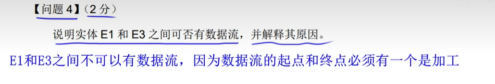

---

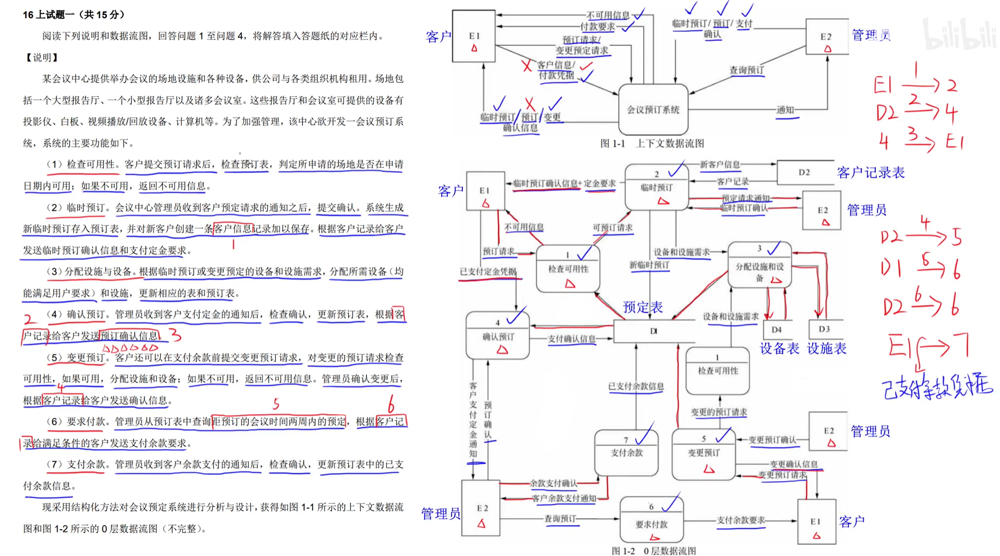

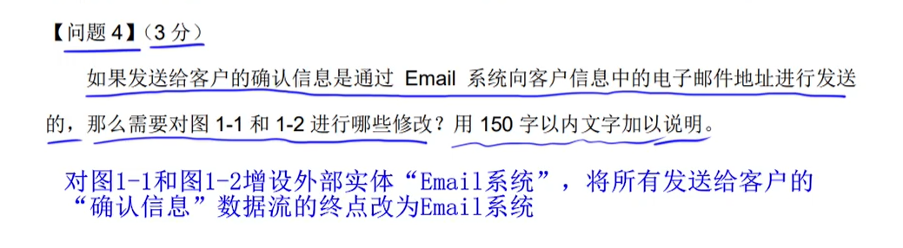

---

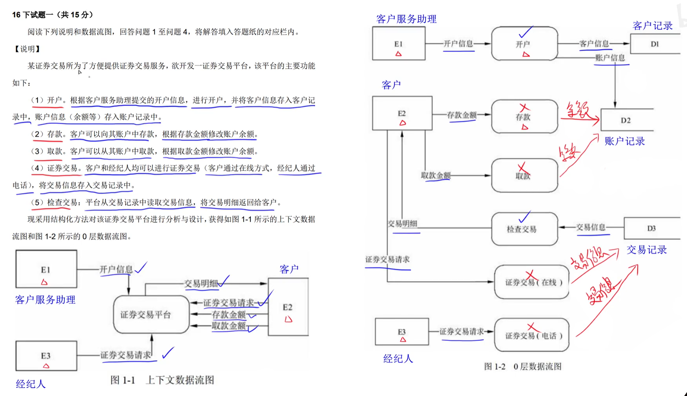

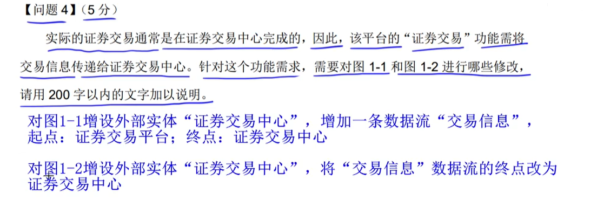

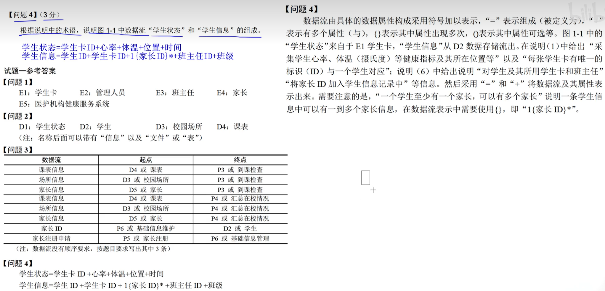

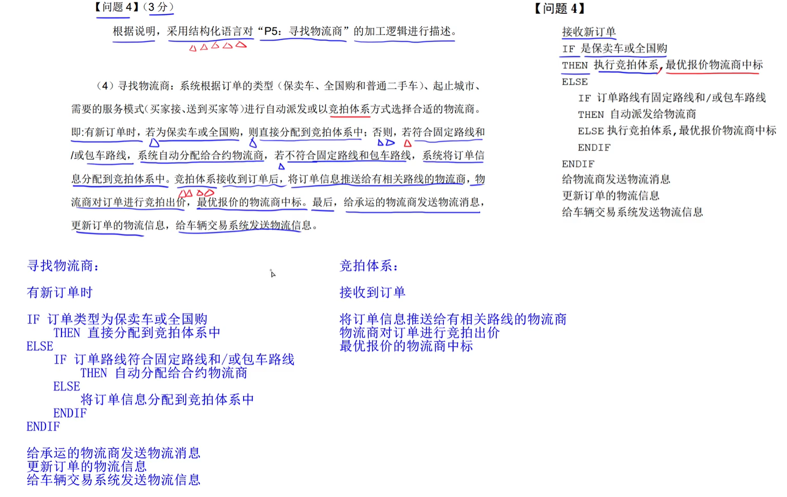

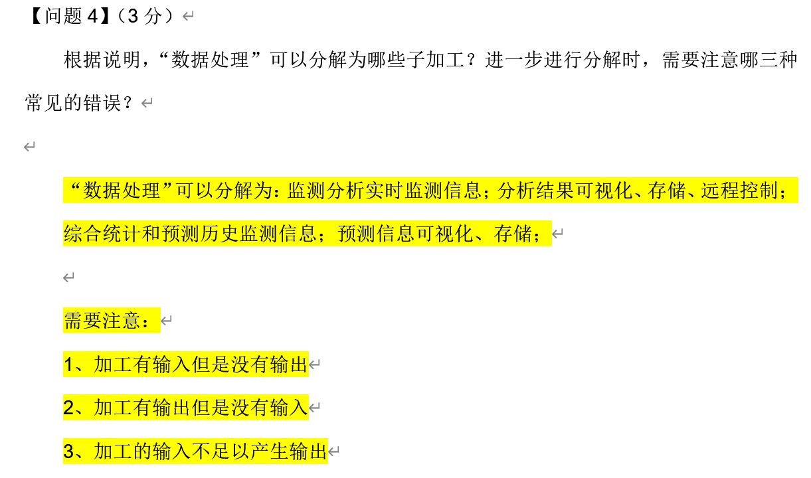

