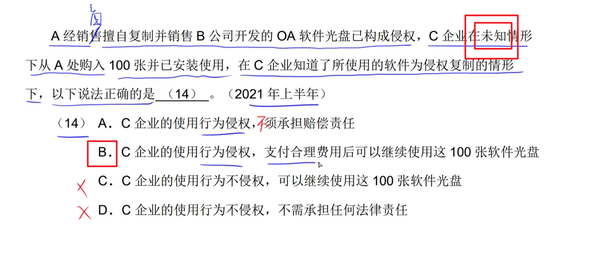
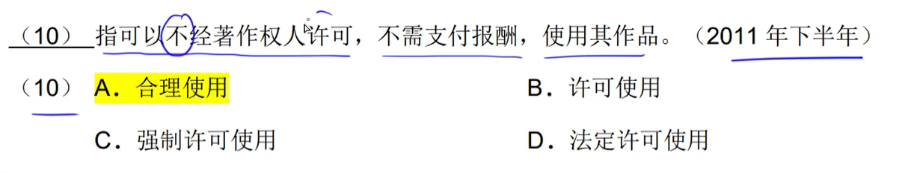

# step04-3分题-知识产权

## 知识产权

### 人身权（除了==发表权==的保护期受时间限制，其它的都不受限制）

- 发表权（有期限保护）：记忆>>死后，就无法发表作品了
- 署名权（永久保护）
- 修改权（永久保护）
- 保护作品完整权（永久保护）

### 财产权（都受时间限制）

除了人身权，都是财产权……

## 专利地域性

- 用哪国的专利，只有在 哪国 销售时才需要支付专利费

## 计算机软件==著作权==：自**软件==开发完成==**之日奏效	

### 主体

- 享有著作权的人

### 客体

- 源程序
- 目标程序
- 软件文档

### 两个基本文件

​		颁布的保护计算机软件著作权的两个文件是：《**中华人民共和国著作权法》和《计算机软件保护条例》**

==由国务院颁布==。

## 计算机软件著作权的所属|归属

### 职务作品（理解为上班仔完成公司所给项目）

​		==属于**职务作品**的，个人只享有**署名权（挂个名字）**，其它权利归公司所有==。

- ==不管怎样，为公司做事，所完成的作品一定归公司所有==

- 侵犯商业秘密权是指：**在开发工程中将一些先进技术透露出去了，导致其它人后来者居上**

### 委托开发（有委托方与受委托方的任务关系存在）

- 不签订合同时，著作权归==受委托方==所有

- 特殊题：==开发人与公司之间是否有特殊约定==

- 虽然李某是**个人**而非公司……，但他是**受委托方**，则在未签订特殊约定（合同）时，著作权归==受委托方==所有

## 计算机软件著作权侵权

- 不会“不构成侵权”

- ==不知者无罪==

## 计算机软件的商业秘密权

## 专利申请

- ==按申请时间先后顺序来决定谁得到专利==

- ==同一天（同一时间）申请专利，则需要协商==

- ==同时申请专利，要么都不授予，要么只有一方能被授予==

## 商标权

- 十年为期，续费

## 商标注册

- ==近似商标属于同一商标==（因为无法区分谁是正版谁是盗版）。如果**同一时间**申请则需要以抽签结果来决定谁能获得商标注册权

- ==近似商标属于同一商标==（因为无法区分谁是正版谁是盗版）。如果**同一时间**申请则需要以==谁先使用==来决定将商标给谁注册

## 杂题

### 独家许可 & 独占许可

> - **独家**：软件权利人可以使用（两个人可用）
> - **独占**：软件权利人不可以使用（一个人可用）

### 翻译权

