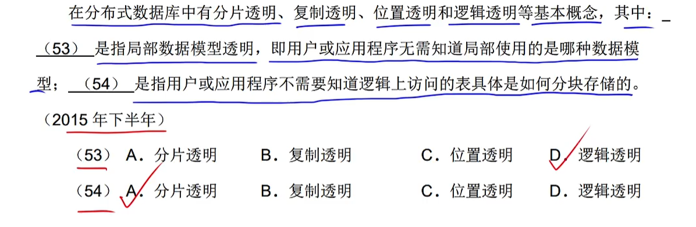

# step05-6分题-数据库

## 三级模式

### `概念模式`又称==模式==

## 两级映像

- 模式/内模式：物理映像（理解为：`物理`对应着磁盘上具体的`存储文件`）
- 模式/外模式：逻辑映像 

## 关系模式基本术语

 

## 完整性约束

- 自然连接后的属性列数就是不重复的列总数

- ==将列数换成对应的列名即可==

- 问效率：当然是==连接的次数越少，效率越高==

 

### 考察题型

- 排除法排除：非常量写法，即 字符串|值|条件 不带`''`

## DCL

### `for all` 将权限给所有用户

### `with grant option` 用户还能将权限赋予给其他人

- grant `insert|update on` table 表名 to 用户名 `with grant option` （允许将权限赋予给别人）

## 视图

### `with check option` 自动在操作视图（增删改查）时，加上where后的条件

## 全码

​		R中所有的属性组合在一起，即为**全码**。

|                    求候选关键字 & 主属性                     |
| :----------------------------------------------------------: |
|  |
|  |

## 范式

### 存在冗余、修改操作的不一致性、插入和删除异常

- 由于EM是主键，又存在`E→N`和`M→L`的部分依赖，则不满足2NF。

## 关系分解 & 无损连接 & 保持函数依赖

### 无损连接

​		关系分解之后，没有丢失任何属性。其实就是看`自然连接`所有的被分解的关系之后，连接后的属性是否等于分解之前的属性。

### 保持函数依赖

​		分解的关系中仍保持着原有的函数依赖。

## 派生属性 & 多值属性 & 简单属性 & 多值属性

- 派生属性：从一个字段的值可以推出另一个字段的值。

- 多值属性：一个字段有多种值可选。

    例如：由生日可以推出年龄，则年龄为派生属性；一个人可以有多种联系方式，则其为多值属性。

- 简单属性：原子属性，不可再分
- 复合属性：不是一个原子属性，还可以再分

## 冲突

### ==类似病人与医生的这种`就诊关系`，在关系中，需要加上`时间属性`才能唯一确定一组关系！！！==

## 逻辑结构设计

## 了解

## 分布式数据库

## 杂题

### ==故障类型==

#### 系统故障：软故障，系统出现问题

#### 事务[内部]故障：程序的一些异常问题

#### 介质故障：硬故障，硬件设备出现问题

#### 计算机病毒：由病毒导致的问题

