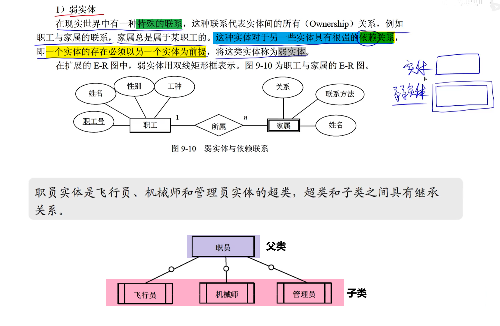
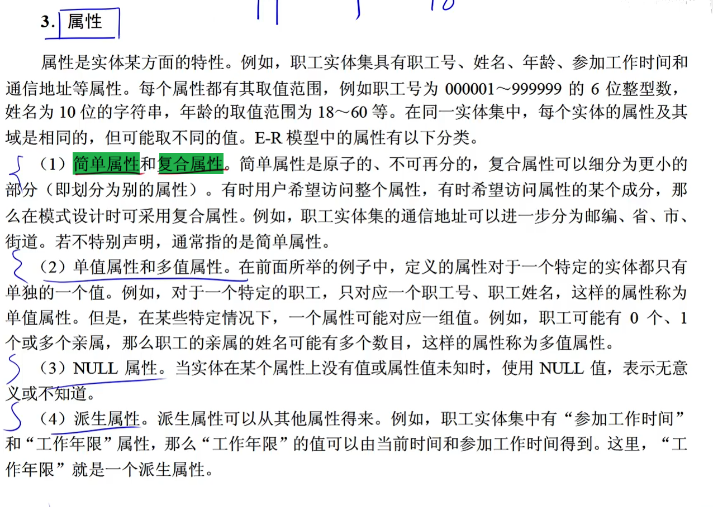
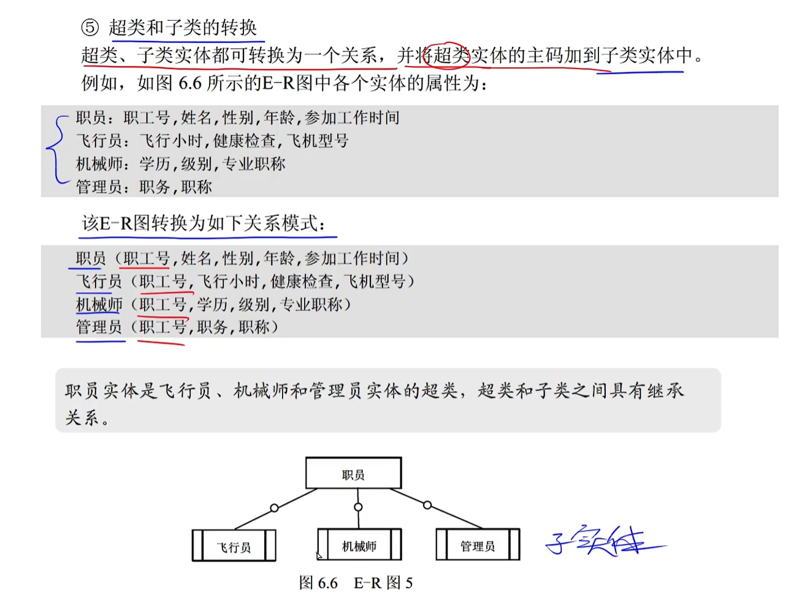
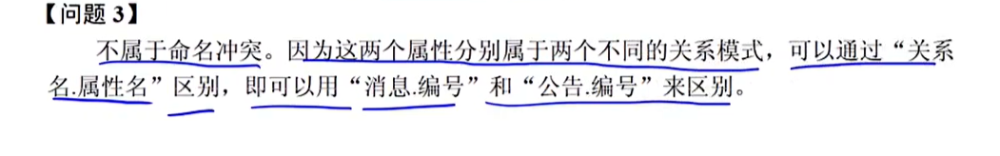
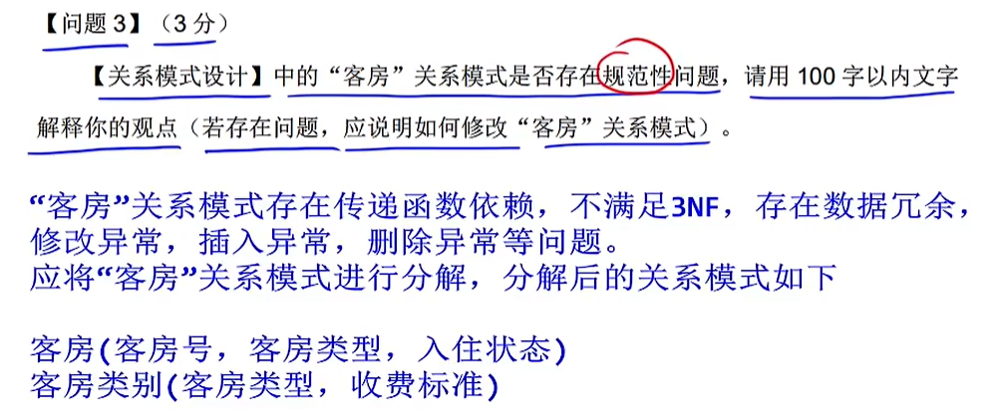
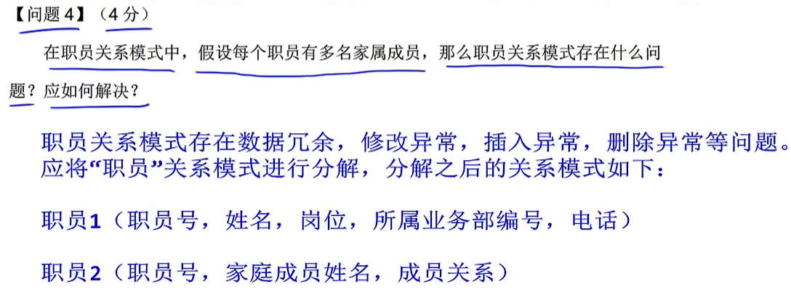
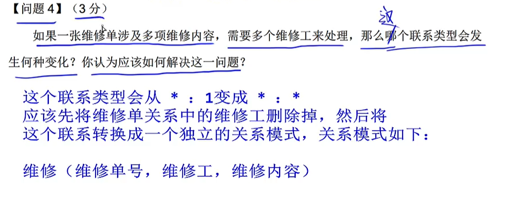

# step06-下午题-试题2-数据库

## 实体

## 属性

- **简单属性**：不可再分的属性
- **复合属性**：还可以进一步划分出子属性

## 解题

### 问题1：补充E-R图中缺失的联系

### 问题2：补充完善关系模式

​		==联系也可以有属性==。

#### 超类和子类转换：超类和子类都可转换为一个关系，再将`超类的主键`加入到子类实体中。

#### 联系也可以是一个关系模式

### 问题3：论述存在的问题

#### Q：问XXX是否属于弱实体

​		A：XXX属于`弱实体`，因为XXX的存在要依赖于YYY的存在为前提。

#### Q：问XXX是否属于简单属性

​		A：XXX不属于`简单属性`，因为简单属性是原子的，不可再分的。而XXX可以进一步划分为YYY、UUU……，所以XXX属性应该为`复合属性`。

#### Q：问不同关系模式中的同名属性是否属于命名冲突

#### Q：是否存在规范性问题

#### Q：表分解

#### Q：联系的变化

