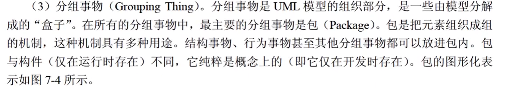
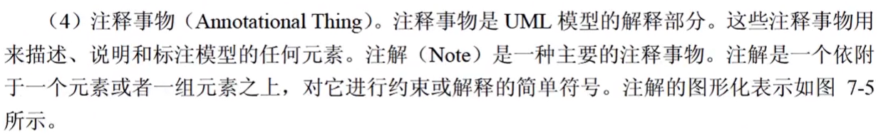
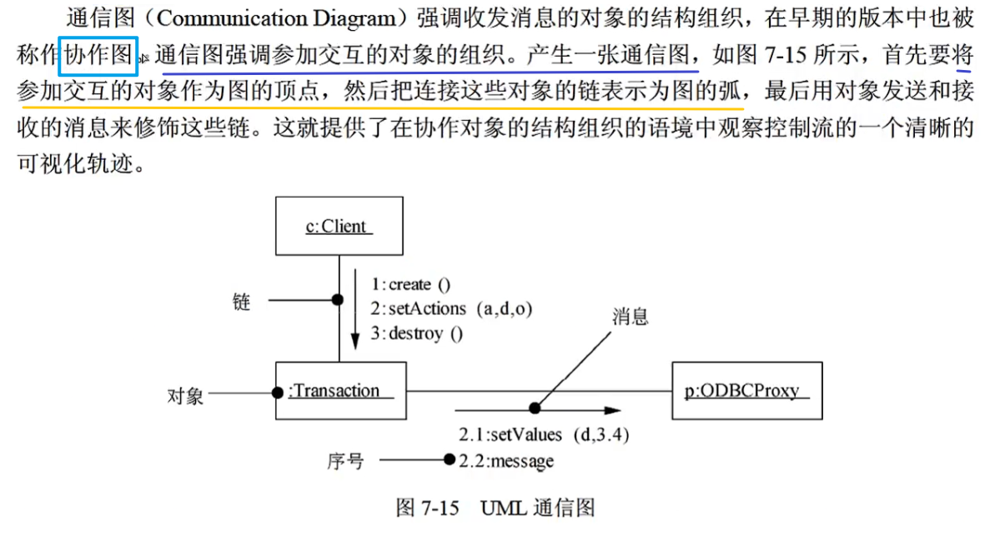

# step08-4分题-UML

## UML

### 事物

> ​		对模型中最具有代表性的成分的抽象。

#### 结构事物

#### 行为事物

#### 分组事务

#### 注释事物

#### `真题`

### 关系

> ​		把事物结合在一起。

#### 依赖

#### 关联

##### 聚集|聚合 & 组合

> ​		一种特殊类型的关联关系。

##### 关联的多重度与角色

- 一对一
- 一对多
- 多对多

#### 泛化

> ​		一种**特殊/一般关系**。即由具体的、个别的特殊元素（父类）扩大为一般元素（子类）。
>
> ​		继承是泛化的一种，但泛化不能等同于继承。

- 泛化示例：

> - 动物（父类）
>     - 猫（子类）
>     - 狗（子类）
>     - ……
>
> 

#### 实现

> ​		一般都是一个类实现一个接口。

#### `真题`

 

---

### 图

> ​		聚集了相关的事物。

#### 类图

> ​		[类图](https://baike.baidu.com/item/类图?fromModule=lemma_inlink)是描述系统中的类，以及各个类之间的关系的**静态视图**。能够让我们在正确编写代码以前对系统有一个全面的认识。类图是一种模型类型，确切的说，是一种**静态模型类型**。类图表示类、接口和它们之间的协作关系。

##### ==修饰符表示符==

- `+`：public
- `-`：private
- `#`：protected
- `~`：默认

##### UML类图概念（了解）

##### `真题`

---

#### 对象图

> ​		与[类图](https://baike.baidu.com/item/类图?fromModule=lemma_inlink)极为相似，它是类图的实例，对象图显示类的多个对象实例，而不是实际的类。它描述的不是类之间的关系，而是==某一时刻==**对象之间的关系**【对象快照】。

##### `真题`

#### 用例图

> ​		描述角色以及角色与用例之间的连接关系。说明的是谁要使用系统，以及他们使用该系统可以做些什么。一个[用例图](https://baike.baidu.com/item/用例图?fromModule=lemma_inlink)包含了多个模型元素，如系统、参与者和用例，并且显示了这些元素之间的各种关系，如泛化、关联和依赖。

- `参与者`：参与者是与系统进行交互的**外部实体**，可能是`使用者`，也可能是与系统进行交互的`外部系统`、`基础设备`等。
- `用例`： 用例是从用户角度描述系统的行为，它**将系统的一个功能描述成一系列的事件**，这些事件最终对操作者产生有价值的观测结果。用例是一个类，**它代表一类功能而不是使用该功能的某一具体实例**。

##### 关联关系

> ​		一个参与者关联N个用例。

- 参与者与用例之间的关系

|                           关联关系                           |
| :----------------------------------------------------------: |
|  |

##### 包含关系

> ​		一个用例==一定==包含另一个用例。
>
> ​		当`基本用例`执行时，`被包含用例`一定会执行。包含关系**由基本用例指向被包含用例**，关系是一条带箭头的虚线，虚线上标有<\<include>>。

- 用例和用例之间的关系

|                           包含关系                           |
| :----------------------------------------------------------: |
|  |

##### 扩展关系

> ​		一个用例执行的时候，==可能==会发生一些**特殊的情况**或者是**可选的情况**，这就是这个用例的`扩展用例`。
>
> ​		扩展用例由`扩展用例`指向`基本用例`，关系是一条带箭头的虚线，虚线上包含<\<extend>>。

- 用例和用例之间的关系

|                           扩展关系                           |
| :----------------------------------------------------------: |
|  |

##### 泛化关系

> ​		一般与特殊的关系。
>
> ​		`父用例`泛化`子用例`，子用例继承父用例的所有属性和行为。父用例可以出现的地方，都可以使用子用例将其替换。

- 用例与用例之间的泛化关系
- 参与者与参与者之间的泛化关系

|                           泛化关系                           |
| :----------------------------------------------------------: |
|  |

##### `真题`

#### 时序图|序列图|顺序图

|                             例子                             |
| :----------------------------------------------------------: |
|  |

##### `真题`

#### 通信图|协作图

> ​		展示了对象之间的**消息流**及其**执行顺序**。【收发消息的对象之间的结构组织】

##### `真题`

---

#### 状态图：事件触发转换，转换带来状态的改变

> ​		是对==一个==（反应型）对象**[状态]**的动态建模。
>
> - **一个`对象`**
> - **多个`对象状态`**

> ​		`反应型|事件驱动对象`的行为通常是由对来自其语境**外部的事件**所作出的反应来最佳刻画的。反应型对象在接受到一个事件之前通常处于空闲状态；当它接收到一个事件时，它的反应常常依赖以前的事件；在这个对象对事件做出反应后，它就又变成空闲状态，并等待下一个事件。对于这种对象，将着眼于对象的稳定状态，触发从状态到状态转移的事件，以及当每个状态改变时所发生的动作。

|                          状态图例子                          |
| :----------------------------------------------------------: |
|  |

##### 状态 & 活动|动作

> ​		一个状态代表系统的一种`行为模式`。状态规定了系统对事件的`响应方式`。
>
> ​		**系统对事件的响应，既可以是做一个（多个）动作，也可以是仅仅改变系统本身的状态，还可以是既改变状态，又做动作**。
>
> ​		==活动可以在状态内执行，也可以在状态转换时执行==。

##### 转换 & 事件

##### `真题`

#### 活动图

- 对工作流|业务流程|活动流程建模
- 对操作建模

##### `真题`

#### 构件图|组件图

##### `真题`

#### 部署图

> ​		部署图在**实施阶段**使用，展现了系统中`软件组件`和`硬件`之间的关系。【**物理模型**】

 

#### UML图总结

​		截止`UML2.0`一共有13种图形（UML1.5定义了9种，2.0增加了4种）。分别是：用例图、类图、对象图、状态图、活动图、顺序图、协作图、构件图、部署图9种，包图、组合结构图、交互概览图3种。 

- 用例图：从**用户角度**描述系统功能。
- 类图：描述系统中类的**静态结构**，描述一组对象、接口、协作和它们之间的关系。
- 对象图：系统中的多个对象在**某一时刻**的状态。
- 状态图：是描述**从状态到状态转移**的`控制流`，常用于对一个`反应型对象`进行动态建模。
- 活动图：描述了业务实现用例的**工作==流程==**。
- 顺序|时序图：对象之间的动态合作关系，强调**对象发送消息的（时间）顺序**，同时显示**对象之间的交互**。
- 通信|协作图：描述**收发消息**的**对象之间**的协助关系。
- 构件|组件图：用来描述**构件之间的组织和依赖**。通常把**构件映射为一个或多个类、接口或协作**。
- 部署图：部署图在**实施阶段**使用，展现了系统中`软件组件`和`硬件`之间的关系。
- 包图：对构成系统的**模型元素**进行分组整理的图。用于描述系统的分层结构，由包或类组成，表示包与包之间的关系。
- 组合结构图：表示**类**或者**构建内部结构**的图。
- 交互概览图：用`活动图`来表示**多个交互之间的控制关系**的图。

### 杂题

