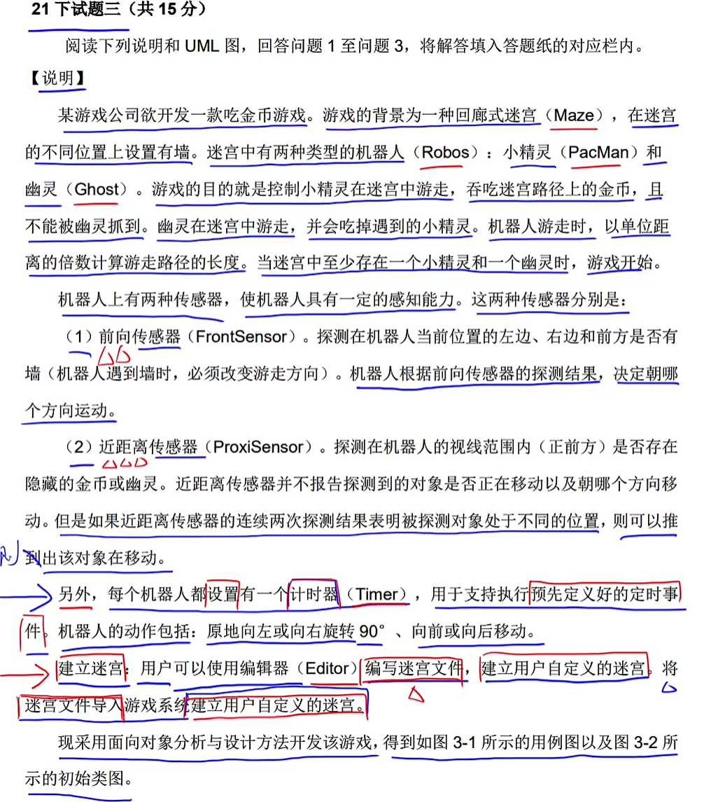
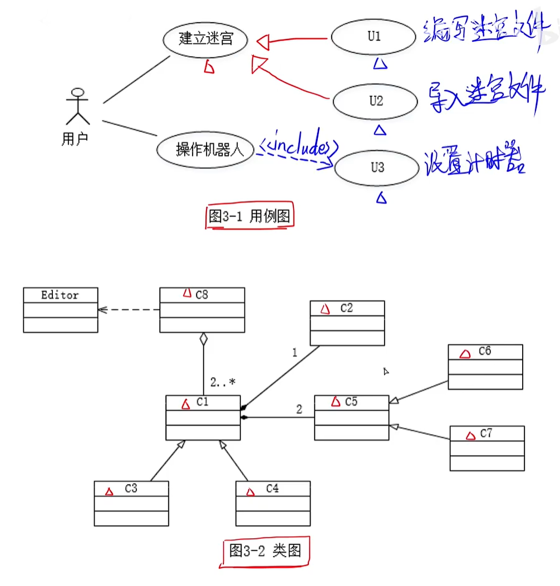
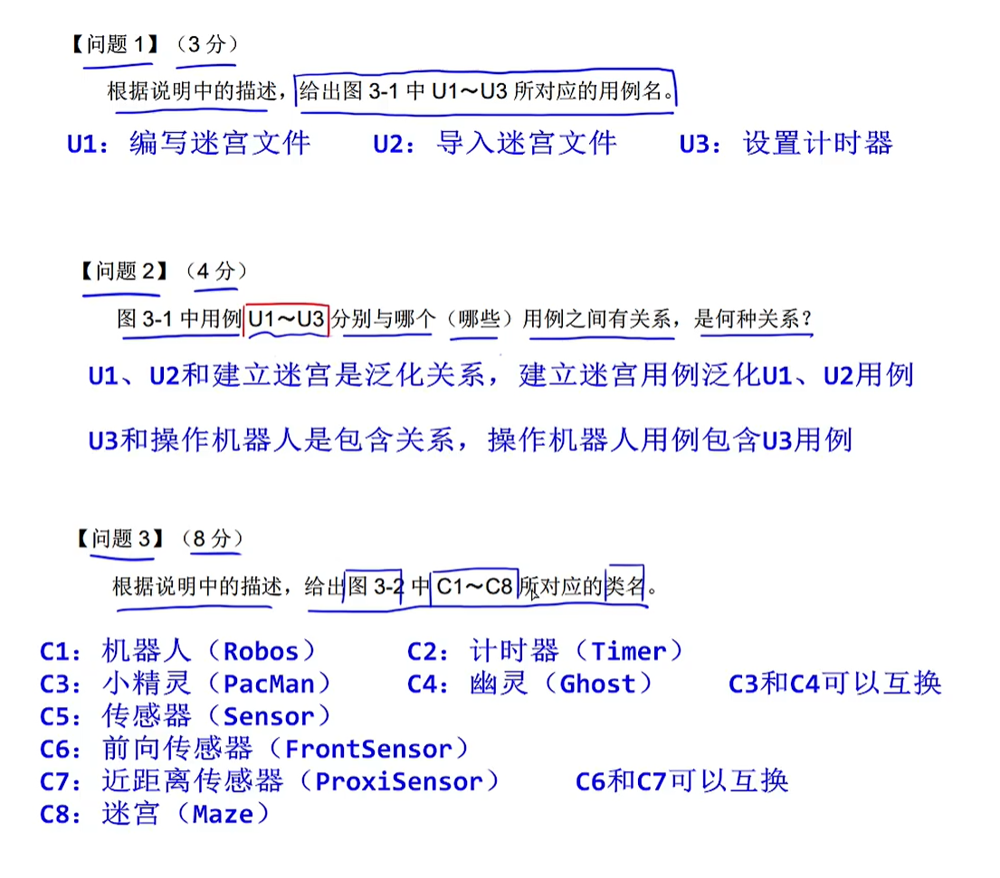
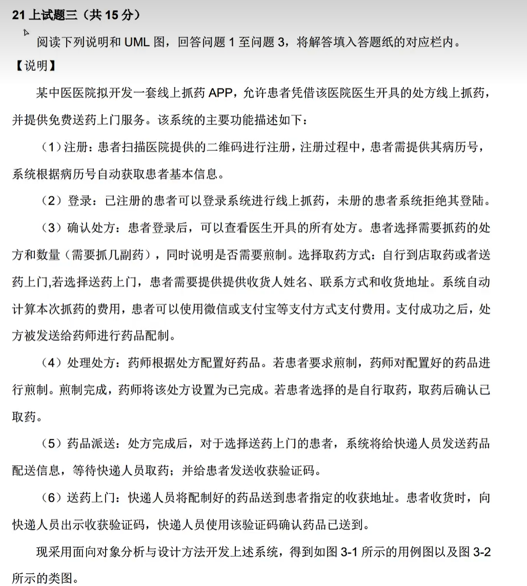
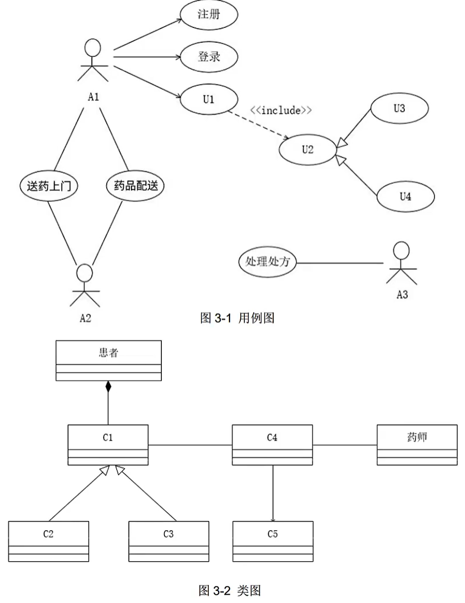
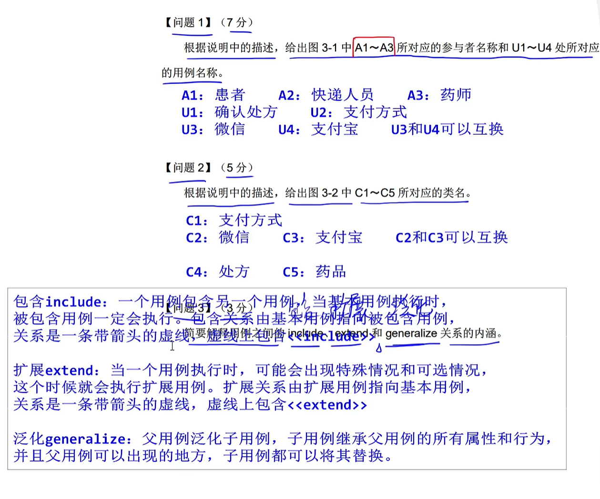

# step09-下午题-试题3-UML

## 2021下半年

### 题目

### 解答

## 2021上半年

### 题目

### 解答

#### include（包含关系）

​		一个基本用例包含另一个被包含用例。当基本用例执行时，被包含用例一定会执行。对包含关系的图形化表示是一条带箭头的虚线，并由基本用例指向被包含用例，在虚线上会用\<\<include>>进行标识。

#### extend（扩展关系）

​		当一个基本用例执行时，可能会出现特殊情况或者是可选情况，这个时候就会执行扩展用例。对扩展关系的图形化表示是一条带箭头的虚线，并由扩展用例指向基本用例，在虚线上会用\<\<extend>>进行标识。

#### generalize（泛化关系）

​		父用例泛化子用例，子用例继承父用例的所有属性和行为，并且父用例可以出现的地方，子用例都可以将其进行替换。

