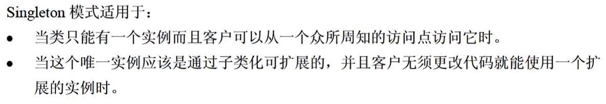
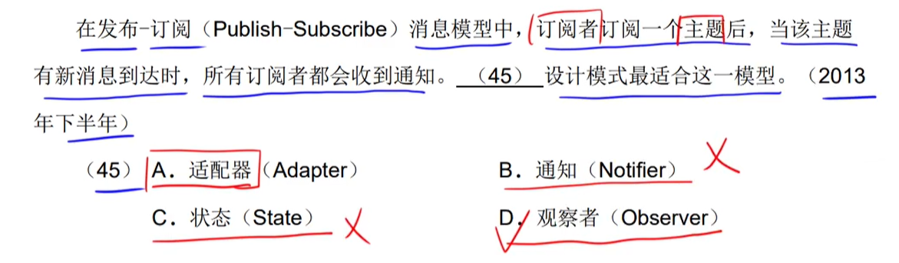

# step10-4分题-设计模式

## GoF23种设计模式分类

[(121条消息) 设计模式之口诀_23种设计模式记忆口诀_猎人在吃肉的博客-CSDN博客](https://blog.csdn.net/xiaojin21cen/article/details/105091181)

GoF23种设计模式可分为三大类：

|                         设计模式分类                         |
| :----------------------------------------------------------: |
|  |

- **创建型**（5个）：解决**对象创建问题**。
    - 单例模式
    - 工厂方法模式
    - 抽象工厂模式
    - 建造者|生成器模式
    - 原型模式
- **结构型**（7个）：一些类或对象**组合**在一起的经典**结构**。
    - 代理模式
    - 装饰模式
    - 适配器模式
    - 组合模式
    - 享元模式
    - 外观模式
    - 桥接模式
- **行为型**（11个）：解决类或对象之间的**交互问题**。
    - 策略模式
    - 模板方法模式
    - 责任链模式
    - 观察者模式
    - 迭代子模式
    - 命令模式
    - 备忘录模式
    - 状态模式
    - 访问者模式
    - 中介者模式
    - 解释器模式

## 创建型设计模式

### 简单工厂模式（`Simple Factory`）

### 工厂方法模式（`Factory`）

#### 意图

​		定义一个只用于创建一类对象的接口，**让子类决定实例化哪一个类**，使一个类的实例化延迟到其子类。

#### 结构

#### 适用性

### 抽象工厂模式（`Abstract Factory`）

#### 意图

​		定义一个用于创建**一系列相关对象**中某一个对象的接口，而无须指定它们具体的类。

#### 结构

#### 适用性

##### 真题

### 生成器|建造者模式（`Builder`）

[(119条消息) 【设计模式】建造者模式_鼠晓的博客-CSDN博客](https://blog.csdn.net/Small_Mouse0/article/details/66474580)

#### 意图

​		将一个复杂对象的**构建**与它的**表示**分离，使得同样的构建过程可以创建不同的表示。

#### 结构

#### 适用性

##### 真题

---

---

### 原型模式（`Prototype`）

#### 意图

​		用原型实例创建对象，后续通过复制原型来创建新的对象。【自我复制】

#### 结构

#### 适用性

### 单例模式（`Singleton`）

#### 意图

​		保证一个类仅有一个实例，并提供一个访问这个唯一实例的接口。

#### 结构

#### 适用性

##### 真题

## 结构型设计模式

### 适配器模式（`Adapter`）

#### 意图

​		将一个接口转换为客户希望的另外一个接口。适配器模式使得原本由于接口不兼容而不能一起工作的那些类可以一起工作。

#### 结构

#### 适用性

##### 真题

### 桥接模式（`Bridge`）

#### 意图

​		将**抽象部分**与**实现部分**分离，使它们都可以独立的变化。

> ​		考证：
>
> - 抽象部分对应**少**的那一坨
> - 接口部分对应**多**的那一坨

#### 结构

#### 适用性（了解）

##### 真题

### 组合模式（`Composite`）

#### 意图

​		将对象组合成**树形结构**以表示“`部分-整体`”的层次结构。`Composite`使得用户对**单个对象**和**组合对象**的使用具有一致性。

#### 结构

#### 适用性

##### 真题

---

---

### 装饰器模式（`Decorator`）

#### 意图

​		动态地给一个对象添加一些额外的**职责|功能**。就增加功能来说，装饰器模式相比生成子类更为灵活。可以在不想增加很多子类的情况下扩展类，防止类爆炸。

#### 结构

> ​		静态职责？？？？？

#### 适用性

##### 真题

### 外观|门面模式（`Fasade`）

#### 意图

​		为`子系统`中的一组接口提供一个一致的界面，外观模式定义了一个`高层接口`，这个接口使得这一子系统更加容易使用。

#### 结构

#### 适用性

##### 真题

- 记住外观模式图的特点

---

### 享元模式（`Flyweight`）

#### 意图

​		运用共享技术有效地支持大量细粒度的对象。

#### 结构

 

#### 适用性

### 代理模式（`Proxy`）

#### 意图

​		为其它对象提供一种代理以**控制对这个对象的访问**。

#### 结构

#### 适用性

##### 真题

## 行为型设计模式

### 责任链模式（`Chain of Responsibility`）

#### 意图

​		责任链模式（Chain of Responsibility Pattern）为请求创建了一个**接收者对象的链**。这种模式给予请求的类型，**对请求的发送者和接收者进行解耦**。这种类型的设计模式属于行为型模式。

​		在这种模式中，**通常每个接收者都包含对另一个接收者的引用**。**如果一个对象不能处理该请求，那么它会把相同的请求传给下一个接收者**，依此类推。

> ​		责任链模式避免请求发送者与接收者耦合在一起，让多个对象都有可能接收请求，将这些对象连接成一条链，并且沿着这条链传递请求，直到有对象处理它为止。

#### 结构

#### 适用性

### 命令模式（`Command`）

#### 意图

​		是一种`数据驱动`的设计模式，它属于**行为型模式**。请求以命令的形式包裹在对象中，并传给调用对象。调用对象寻找可以处理该命令的合适的对象，并把该命令传给相应的对象，该对象执行命令。

​		`命令模式`将一个**请求|命令**封装成一个对象，从而使您可以用不同的**请求|命令**对客户进行参数化。说成人话就是：==将**请求|命令**封装为一个对象，这个对象作为一个参数来传递给客户端执行一些操作==。

#### 结构

#### 适用性

##### 真题

---

### 解释器模式（`Interpreter`）

#### 意图

​		解释器模式（Interpreter Pattern）提供了评估语言的语法或表达式的方式，它属于**行为型模式**。这种模式实现了一个表达式接口，该接口解释一个特定的上下文。这种模式被用在 SQL 解析、符号处理引擎等。

​		给定一个语言，定义它的文法表示，并定义一个解释器，这个**解释器使用该标识来解释语言中的句子**。

#### 结构

#### 适用性

1、可以将一个需要解释执行的语言中的句子表示为一个**抽象语法树**。 

2、一些重复出现的问题可以用一种**简单的语言**来进行表达。 

3、一个**简单语法**需要解释的场景。

### 迭代器模式（`Iterator`）

#### 意图

​		提供一种方法顺序访问一个`聚合对象`中的各个元素，而又**无须暴露该对象的内部表示**（**不需要知道集合对象的底层表示**）。

#### 结构

#### 适用性

### 中介者模式（`Mediator`）

#### 意图

​		中介者模式用一个`中介对象`来**封装一系列的对象交互**，中介者使**各对象不需要显式地相互引用**，从而使其**耦合松散**，而且可以独立地改变它们之间的交互。

​		==中介者相当于一个平台，它可以协调对象之间的交互，而不需要具体的对象与对象之间进行显示交互==。

#### 结构

#### 适用性

##### 真题

### 备忘录模式（`Memento`）

#### 意图

​		备忘录模式（Memento Pattern）保存一个对象的某个状态，以便在适当的时候恢复对象。

​		**在不破坏封装性的前提下，捕获一个对象的内部状态，并在该对象之外保存这个状态**。

#### 结构

#### 适用性

### 观察者（`Observer`）

#### 意图

​		当对象间存在**一对多**关系时，则使用观察者模式（Observer Pattern）。比如，**当一个对象被修改时，则会自动通知依赖它的对象**。

​		定义对象间的一种一对多的依赖关系，当一个对象的状态发生改变时，所有依赖于它的对象都得到通知并被自动更新。

> ​		==若干个观察者（B站用户）观察一个目标（Up主），当目标（Up主）的状态发生改变时（Up主新发布了一条视频），则自动通知他的观察者（B站用户）==。

#### 结构

#### 适用性

- 一个抽象模型有两个方面，其中一个方面依赖于另一个方面。将这些方面封装在独立的对象中使它们可以各自独立地改变和复用。
- 一个对象的改变将导致其他一个或多个对象也发生改变，而不知道具体有多少对象将发生改变，可以降低对象之间的耦合度。
- 一个对象必须通知其他对象，而并不知道这些对象是谁。【**使得所交互的对象尽量松耦合**】
- 需要在系统中创建一个触发链，A对象的行为将影响B对象，B对象的行为将影响C对象……，可以使用观察者模式创建一种链式触发机制。

##### 真题

---

---

---

---

### 状态模式（`State`）

#### 意图

​		在状态模式（State Pattern）中，**类的行为**是基于它的**状态**改变的。

​		在状态模式中，我们创建表示各种状态的对象和一个行为随着状态对象改变而改变的 context 对象。

​		状态模式允许对象在**内部状态发生改变时**改变它的行为，对象看起来好像修改了它的类。

#### 结构

> ​		**Context根据不同的State来做出不同的响应**。

#### 适用性

##### 真题

---

### 策略模式（`Strategy`）

#### 意图

​		在策略模式（Strategy Pattern）中，一个类的**行为**或其**算法**可以在运行时更改。

​		在策略模式中，我们创建表示各种策略的对象和一个行为随着策略对象改变而改变的 context 对象。策略对象改变 context 对象的执行算法。

- 不同于`状态模式（State）`

> ​		==定义一系列的算法，把它们一个个封装起来，并且使它们可相互替换。有别于状态模式的是：状态模式中`Context`可以根据状态来切换不同的行为；而策略模式中，是单纯的在`Context`中替换使用不同的算法==。

#### 结构

#### 适用性

##### 真题

---

---

- ==不同时期，使用不同算法==

### 模板模式（`Template`）

#### 意图

​		定义一个操作中的算法的骨架，而将一些步骤延迟到子类中。模板方法使得子类可以不改变一个算法的结构即可重定义该算法的某些特定步骤。

#### 结构

#### 适用性

### 访问者模式（`Visitor`）

#### 意图

​		在访问者模式（Visitor Pattern）中，我们使用了一个`访问者类`，它**改变了元素类的执行算法**。通过这种方式，**元素的执行算法可以随着访问者的改变而改变**。这种类型的设计模式属于行为型模式。根据模式，元素对象已接受（==Accept==）访问者对象（==Visitor==），这样访问者对象就可以处理元素对象上的操作。

​		==主要将`数据结构`与`数据操作`分离==。

​		表示一个作用于某对象结构中的各元素的操作。它允许在不改变各元素的类的前提下定义作用于这些元素的新操作。

#### 结构

#### 适用性

1、对象结构中对象对应的类很少改变，但经常需要在此对象结构上定义新的操作。 

2、需要对一个对象结构中的对象进行很多不同的并且不相关的操作，而需要避免让这些操作"污染"这些对象的类，也不希望在增加新操作时修改这些类。

##### 真题

---

### 综合式真题

---

---

---

---

---

---

---

