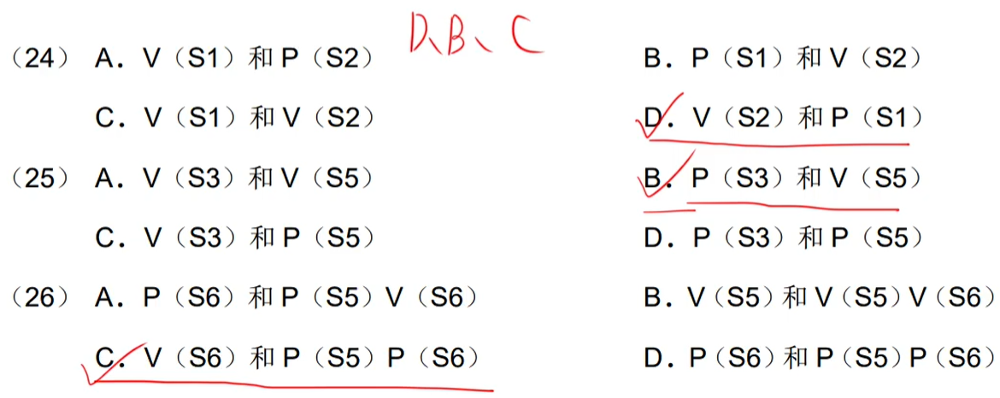
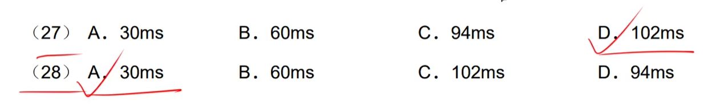
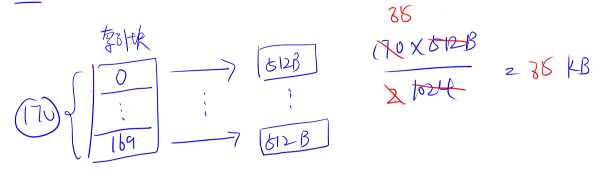

# step12-6分题-操作系统

## 操作系统的地位

- `用户`使用`应用软件`
- `应用软件`是基于`系统软件`开发出来的

##### 真题

---

## 进程管理

### 程序顺序执行

#### 特征

> ​		顺序性、封闭性、可再现性。

### 前趋图

##### 真题

---

---

---

---

---

### 程序并发执行和前趋图

### 进程状态切换

#### 三态模型

#### 五态模型

##### 真题

### 进程间的通信

#### 同步与互斥

##### ==使用`PV操作`实现资源的\<\<同步>>与\<\<互斥>>==

#### 信号量机制和PV操作

##### 真题

---

---

---

#### PV操作实现进程的同步与互斥

> - 互斥信号量的初值为1
> - 同步信号量的初值与资源数相同

|                             互斥                             |
| :----------------------------------------------------------: |
|  |

|                       同步----单缓冲区                       |
| :----------------------------------------------------------: |
|  |

|                       同步----多缓冲区                       |
| :----------------------------------------------------------: |
|  |

##### 真题

---

### 死锁

​		`系统资源数` >= `进程数量` * （`每个进程所需资源数 - 1`） + `1`

##### 真题

---

---

---

### 进程资源图

---

---

---

### 死锁避免

## 线程

---

---

## 局部性原理

> ​		无法淘汰掉不在内存中的页。

##### 真题

---

## 分页存储原理

​		==物理块号也即：页帧号==。

##### 真题

---

---

---

- 1KB = 2^10^B，则代表`页内地址`的有10位（后10位）；页号就是最高位的那几位（排除掉后10位后的）1024(D) = ==1==<u>0000000000</u>(B) ，1为**页号**。

---

## 段页式存储原理

- 段号：2^8^=256个段  （31 - 34 + 1 = 8）
- 页号：2^12^=4096个页  （23 - 12 + 1）【==**每个段最大允许有4096个页**==】
- 页内地址：2^12^B=4KB   （11 - 0 + 1）

##### 真题

---

---

## 单缓冲区 & 双缓冲区

|                           单缓冲区                           |
| :----------------------------------------------------------: |
|  |

|                           双缓冲区                           |
| :----------------------------------------------------------: |
|  |

##### 真题

---

## 磁盘|移臂（磁头|磁针）调度算法==扫描的是`柱面`

### 先来先服务（`FCFS`）

### 最短寻道时间优先（`SSTF`）

### 扫描算法（SCAN）|电梯调度算法

### 循环扫描算法（`CSCAN`）|单向扫描算法

##### 真题

---

---

## 旋转调度算法【==先移臂再旋转==】

##### 真题

---

## 多级索引结构（索引的物理块编号从==0==开始）

##### 真题

---

---

---

## 文件目录

##### 真题

---

## 目录结构

---

---

---

## 位示图

##### 真题

##### ==32位的字长 <\==> 一个位示图用32个物理块==

---

---

---

---

---

---

## 杂题

---

- 一个用户用完时间片，再等`n * q`个时间片才能继续被运行

---

---

---

---

---

---

---

---

---

---

---

---

---

---

