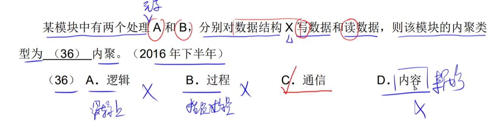

# step13-4分题-结构化开发

## 耦合

### 7种类型的耦合

> ​		“每个模块只想独立，谁都不想依赖”。

- 助记
    - 数据耦合：两个模块之间传递==一小坨==数据。【一个变量大小】
    - 标记耦合：两个模块之间传递==“一大坨”==数据。【封装后的数据结构 或者 没有封装】
    - 控制耦合：控制变量
    - 外部耦合：两个模块之间访问==软件之外==的某一个**外部环境（如：I/O设备）**
    - 公共耦合：两个模块之间访问一块==公共的**数据**环境==
    - 内容耦合：两个模块之间直接访问对方的==内部数据==

##### 真题

---

---

---

---

---

- ==一坨数据并没有被封装为数据结构，而是直接进行传递==

---

## 内聚

### 7种类型的内聚

> ​		“每个模块只想做一件事”。

- 助记
    - 偶然内聚：偶然？那就是==模块中的组成元素==之间没有联系！
    - 逻辑内聚：模块的==逻辑功能==相似，根据参数来确定模块该完成哪个（逻辑）功能。
    - 时间内聚：在==特定时间==内（例：同时执行）需要被执行的模块。
    - 过程内聚：模块按照==指定的过程==执行任务。
    - 通信内聚：使用 **相同|共享** 的 **数据结构|单纯的数据** 来进行操作。别和**标记耦合**搞混了！！！
    - 顺序内聚：模块中的组成元素==顺序执行功能==。
    - 功能内聚：模块中的组成元素共同完成==同一个功能==。

##### 真题

---

---

---

---

---

---

---

## 设计原则

##### 真题

---

---

---

- 物极必反

## 数据流图：自顶向下，从抽象到具体

#### ==是数据流而不是控制流==

----

---

### 在上午题中，如果一个数据流经过加工之后没有发生变化，则视为错误

---

---

---

---

## 数据字典

> ​		**外部实体**是不包含在数据字典中的。

## 决策树

## 对DFD中加工逻辑的描述

### 结构化语言

###### 真题

---

---

#### 加工逻辑只需描述大致逻辑，不需要描述具体实现（数据结构和算法）

## 体系结构设计

## 数据设计

## 接口设计

## 过程设计

## 杂题

---

---

---

---

---

---

---

---

