# step14_15-10分题-软件工程

## ==软件工程基本要素：方法 & 工具 & 过程==

## 能力成熟度模型 `CMM(Capability Maturity Model)`

> ​		CMM将软件开发过程划分为5个**成熟度级别**。

### 5个成熟度级别

- 助记
    - 初始级：**一团糟**，什么都是混乱的，求大佬带飞
    - 可重复级：反正刚开始，先找找有没有可以**copy**的项目碎片（**重复**以前所做的同类项目中的成功），以建立一个**最基本的项目**
    - 已定义级：已经被写进**文档**中了，即开发过程已经基本被定义好了
    - 已管理级：什么叫**已|被管理**？那就是有了一套**度量标准**！用以**严格把控质量**！
    - 优化级：项目基本成型，后期连续根据一些**反馈|改进意见**来进行优化~

###### 真题

---

---

---

## 能力成熟度模型集成 `CMMI(Capability Maturity Model Integration)`

### 阶段式模型（了解）

### 连续式模型

###### 真题

---

---

## 软件过程模型

### `需求【明确】时使用的模型`

#### 瀑布模型

- 需求==非常==明确  <==> 开发过程中，需求不再变化！！

###### 真题

---

---

---

---

---

---

#### V模型（了解）

##### ==选项中出现V选瀑布==

> ​		瀑布模型的变体。
>
> ​		==题目秒杀技巧：看见V模型，就选瀑布模型==。

#### 增量模型

- 快速构建（初代）产品，保证系统能**尽早投入使用**
- 适应商业产品的开发
- **第一代增量（最先开发的增量）就是最重要的核心产品**【基建设施】，其由于最早被开发出来，则可以经受更多的测试
- 增量的划分并不容易
- 虽然第一代增量的开发时间与成本很低，但是整体的管理成本、进度、配置的复杂性可能超出预期

> ​		需求明确，将需求分段成多个增量进行开发。【**划分增量并不容易**】

###### 真题

---

---

---

---

### `需求【不明确】时使用的模型`

#### 演化模型

- 一开始的**需求不明确**，但会在用户的使用过程中，同步的进行更新、迭代
- 系统==能==尽早的投入使用

##### 原型模型

- 使用一个个的原型，让==用户的需求==**更加明确**
- 不能保证系统能尽早投入使用

###### 真题

---

##### 螺旋模型

- 开发==大规模软件==
- 具备==风险分析==
- 虽然包含==维护周期==，但是**维护**和**开发**并没有本质区别

###### 真题

---

---

---

### `支持软件重用 & 各开发活动交叉迭代的进行`

#### 喷泉模型

- 以==用户需求==为动力，以==对象==作为驱动的模型
- ==**迭代**==：模型中的开发活动常常需要重复多次
- ==**无间隙性**==：各开发活动之间不存在明显的边界，开发人员可以同步进行

###### 真题

---

---

#### 统一过程(`UP`)模型（了解）-----------关键词：==角色==

##### `RUP`（了解）

###### 真题

---

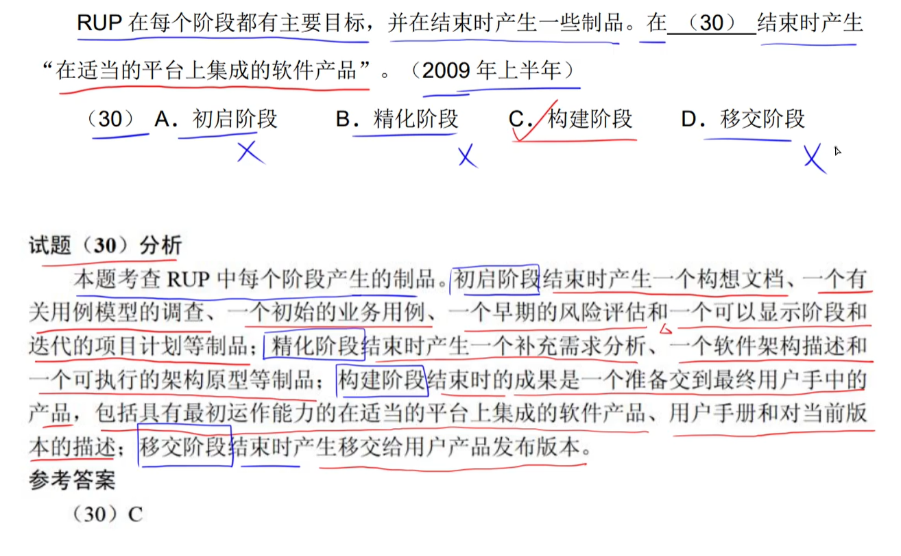

---

---

## 敏捷方法

###### 真题

---

---

---

---

---

---

---

---

## 软件需求

### 功能需求 & 性能需求 & 数据需求

###### 真题

---

## 系统设计

### 概要设计（`划分子模块`） & 详细设计（`算法`）

|                           概要设计                           |
| :----------------------------------------------------------: |
|  |

|                           详细设计                           |
| :----------------------------------------------------------: |
|  |

###### 真题

---

---

---

## 系统测试--==在需求分析阶段，软件测试的目标就应该被确定==

###### 真题

---

---

---

## 测试策略

### 单元测试

#### ==单元测试的内容==

- 模块接口
- **局部数据结构**
- 重要的执行路径
- 出错处理
- 边界条件

###### 真题

---

### 集成测试

- 回归测试
- 冒烟测试

| 自顶向下集成测试-----不用编写驱动模块；需要编写桩模块 （因为自顶向下说明了驱动模块是已经编写好了的） |
| :----------------------------------------------------------: |
|  |

| 自底向上集成测试-----不用编写桩模块；需要编写驱动模块 （因为自底向上说明了桩模块是已经编写好了的） |
| :----------------------------------------------------------: |
|  |

| 回归测试----发生了问题之后，再回过头来重新进行测试。 |
| :----------------------------------------------------------: |
| 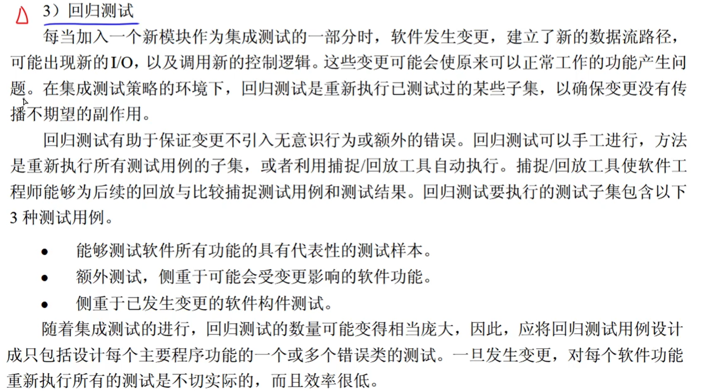 |

###### 真题

- ==回炉重造==  ==> 回归测试

---

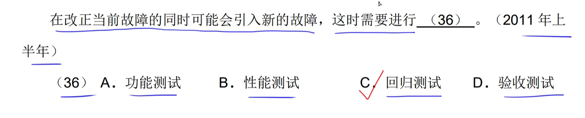

---

---

## 测试方法

### 黑盒测试

- **等价类划分**

> ​		**等价类就是与程序逻辑相同的一个表达逻辑|式**。

- **边界值分析**

- **错误推测**

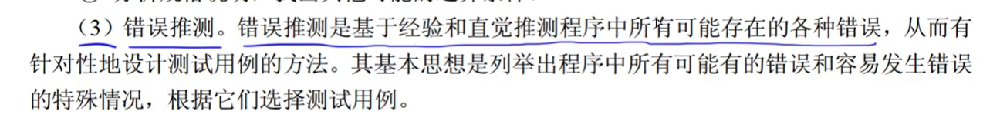

- **因果图**

### McCabe度量法【==m - n + 2==】

> ​		节点也包括`Begin(开始)`与`End(结束)`。

###### 真题

---

---

---

---

---

##### ==特殊情况==

---

---

---

---

### 白盒测试

#### 语句覆盖（==覆盖性最弱==）

> ​		所选的测试数据只需要把每一条**语句**能执行一次即可。

#### 判定覆盖（分支覆盖）

> ​		所选的测试数据需要把每一个**分支条件**都执行一次。
>
> ​		分支条件中可能会有多个条件判断，但`判定覆盖`只需要能保证某一个测试数据能让这一个分支得到确定的boolean结果就行。例如：A > 0 || B > 0
>
> - 只需要A > 0或者B > 0……能得到当前分支为true|false即可。不需要全部满足条件。
>
>     > ​		而`条件覆盖`则是需要执行到所有的条件。

#### 条件覆盖

#### 判定/条件覆盖

> ​		取【**判定覆盖**】与【**条件覆盖**】时所取的测试用例的==并集==。

#### 条件组合覆盖

> ​		每一个条件可能值的组合都需要出现一次。

#### 路径覆盖（==覆盖性最强==）

###### 真题

---

---

---

----

---

---

---

##### 路径覆盖的关键是找到所有的路径

---

#### 白盒测试 + McCabe测量法

##### 简单路径

> ​		各条路径中，不能有路径“覆盖”。

----

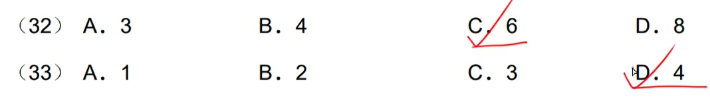

##### ==特殊情况==

---

#### 伪代码 + 白盒测试 + McCabe测量法

##### `伪代码转流程图`

|                             for                              |
| :----------------------------------------------------------: |
|  |

|                            while                             |
| :----------------------------------------------------------: |
|  |

|                         do …… while                          |
| :----------------------------------------------------------: |
|  |

###### 真题

---

---

---

## 系统可维护性评价指标

###### 真题

## 软件维护 & 软件文档

###### 真题

---

---

---

---

---

## 软件维护内容

- 助记
    - 正确性：有问题，得改正
    - 适应性：技术要求发生变化了，需要适应
    - 完善性：给系统**扩充功能**、改善系统的**性能**
    - 预防性：怕被淘汰，“垂死挣扎”

###### 真题

---

---

---

---

---

---

 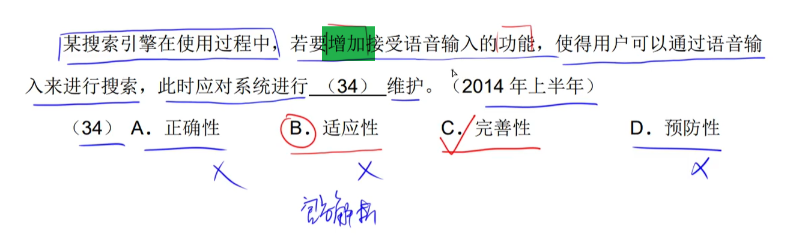

---

---

---

---

## 软件可靠性、可用性、可维护性

- MTTF：mean time to failure
- MT==B==F：mean time between failures
- MTT==R==：mean time to repair

###### 真题

---

---

---

## 沟通路径【n * (n - 1) / 2】

###### 真题

---

---

## 软件项目评估

---

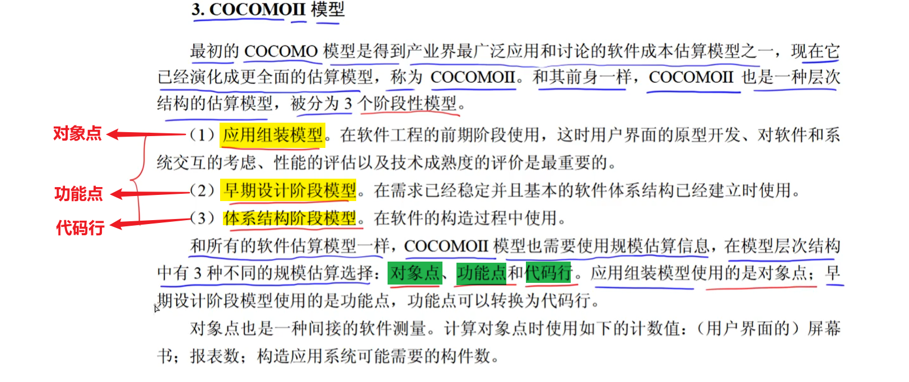

- 助记
    - 应用组装模型：组装的是**对象**
    - 早期设计阶段模型：设计要考虑的是**功能**
    - 体系结构阶段模型：**代码行**就是一个软件的<u>体系</u>了

###### 真题

---

---

## 进度管理[图]

### Gantt图（甘特图）

###### 真题

---

### PERT图

> ​		在PERT图中，`最早时刻`与`最迟时刻`相同。

#### `最早时刻`计算

#### `最迟时刻`计算

#### `松弛时间` & `关键路径`

- 松弛时间计算

---

- 关键路径计算

> ​		`关键路径`就是指：所有项目的`松弛时间`都为0的那一条路径。

###### 真题

---

[2013年下半年第17、18题_哔哩哔哩_bilibili](https://www.bilibili.com/video/BV1j94y1Z7xX/?p=185&spm_id_from=pageDriver&vd_source=fc63803bb06c782d1a34636d7a7376bf)

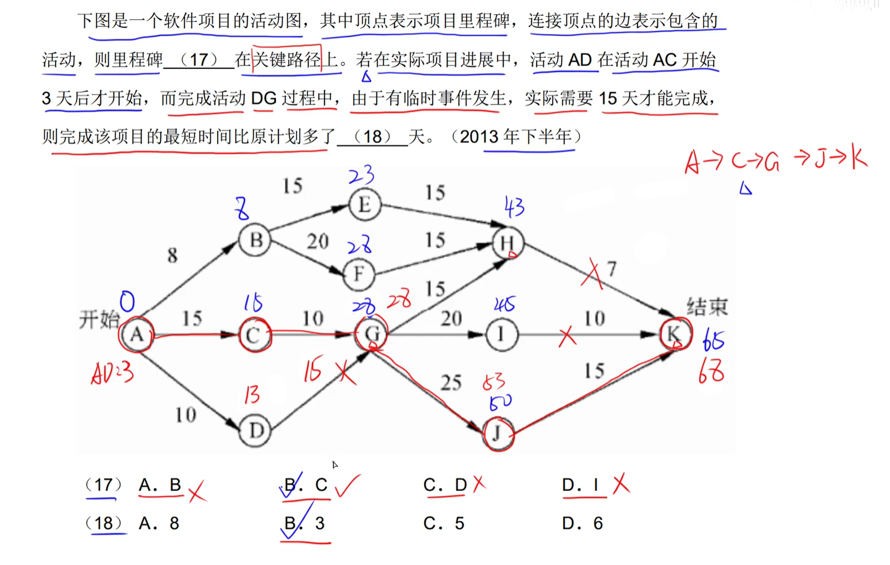

---

[2015年下半年第17、18题_哔哩哔哩_bilibili](https://www.bilibili.com/video/BV1j94y1Z7xX/?p=187&spm_id_from=pageDriver&vd_source=fc63803bb06c782d1a34636d7a7376bf)

---

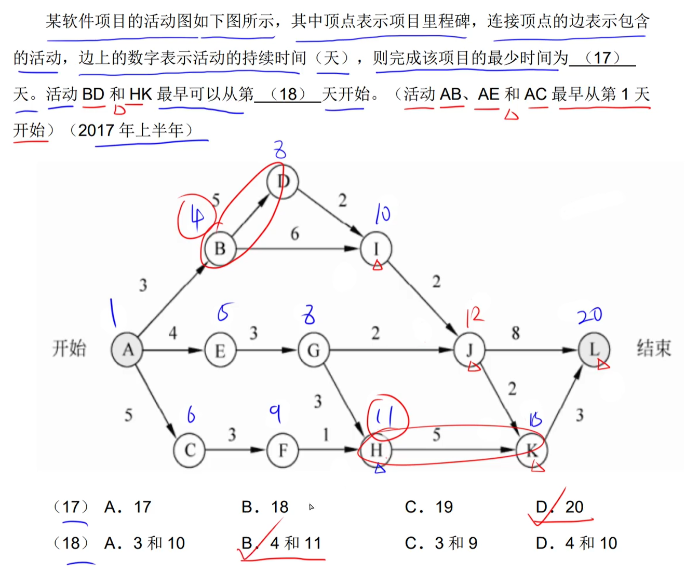

---

---

---

---

---

---

## 软件配置管理

###### 真题

---

----

---

## 风险管理

##### ==不确定性 & 损失==

### 风险识别

### 风险预测

#### 从两个方面评估一个风险：==`风险发生的可能性`和`概率`==

### 风险评估

#### 对风险评估很有用的技术就是==定义风险参照水准==

###  风险控制

#### 风险避免

#### ==应对风险的最好办法就是`主动避免风险`==

#### 风险监控

#### RMMM计划

###### 真题

---

---

---

---

---

---

---

---

---

---

###### ==记忆：RE <\==> PRE，意为：预先的。我预先就能将风险优先级设置出来==。

---

---

---

---

## 软件质量

### ISO/IEC 9126软件质量模型

###### 真题

---

---

- 数据隔离：为了保证**安全**==>`功能性`

---

---

---

---

---

---

----

---

---

### Mc Call软件质量模型（了解）

###### 真题

## 软件评审（了解）

###### 真题

---

---

## 软件容错技术（了解）

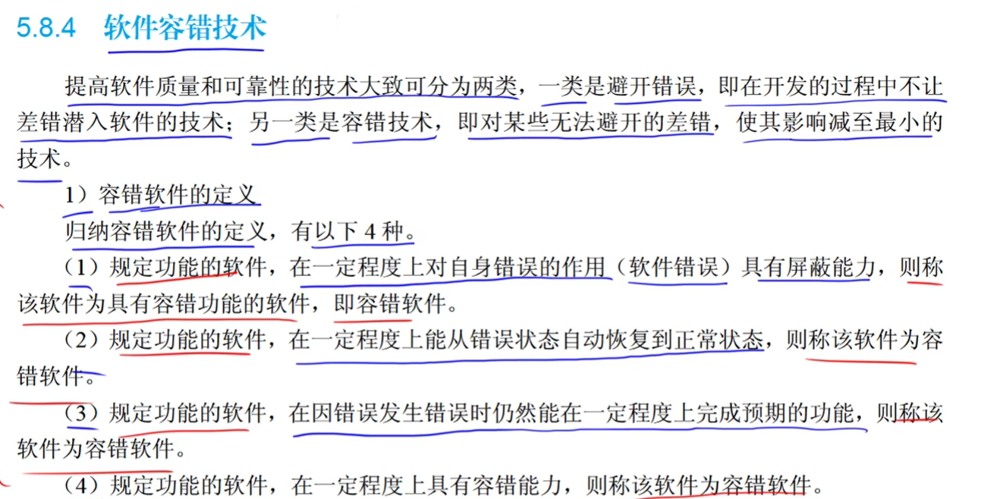

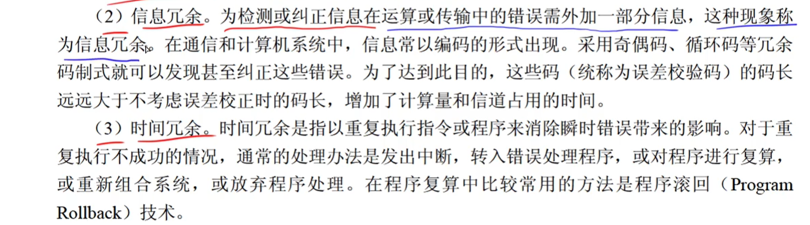

###### 真题

---

## 软件工具（了解）

###### 真题

#### ==`逆向工程`在软件维护阶段==

---

---

## 杂题

---

---

---

---

---

---

---

---

---

---

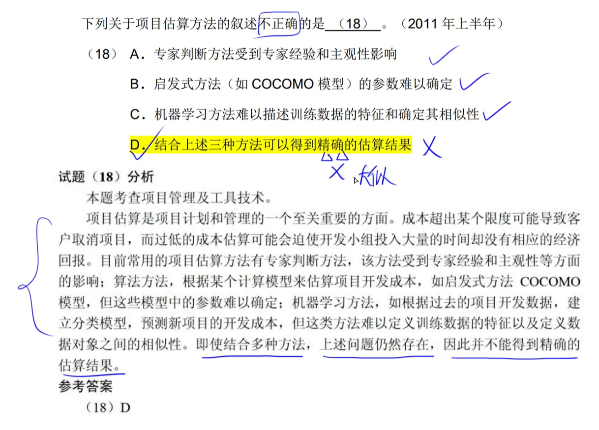

---

---

---

---

---

---

---

---

---

---

---

---

---

---

---

---

