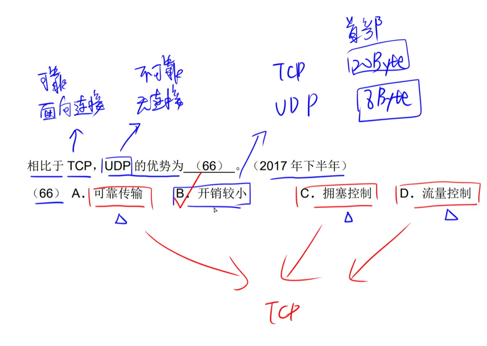
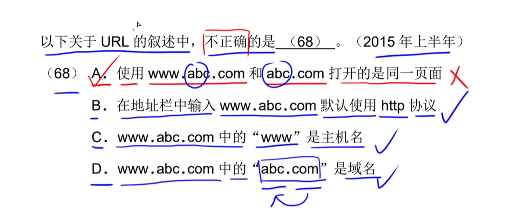
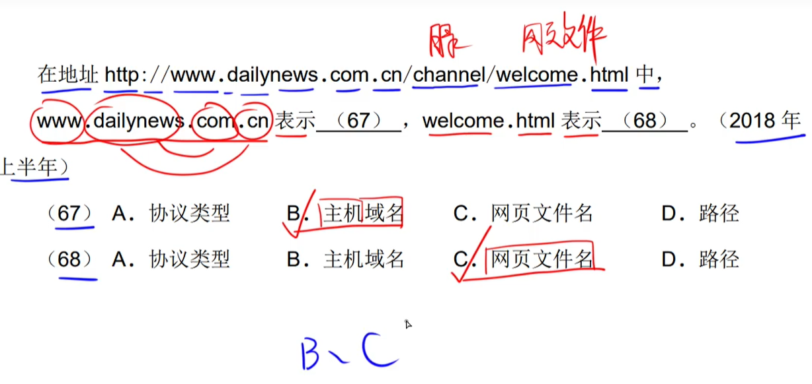
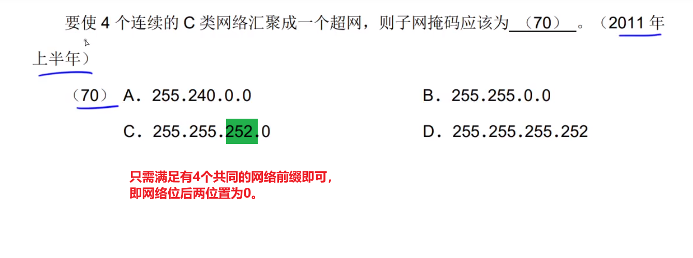
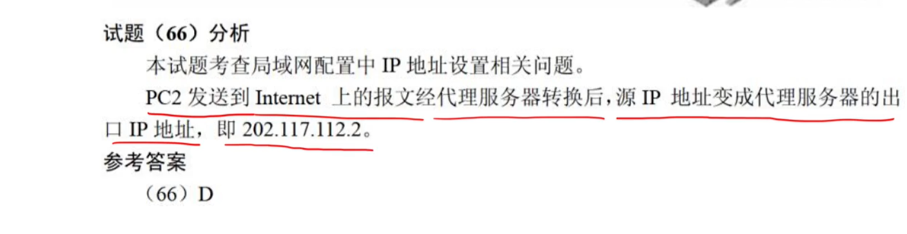

# step17-5分题-计算机网络

## 网络设备

- **物理层**：中继器、集线器（多端口中继器）
- **数据链路层**：网桥、交换机（多端口网桥）
- **网络层**：路由器
- **应用层**：网关

### 网络设备是否隔离`广播域` & `冲突域`

|                | 广播域 | 冲突域 |
| -------------- | ------ | ------ |
| **物**理层     | ×      | ×      |
| 数据**链**路层 | ×      | √      |
| **网**络层     | √      | √      |

###### 真题

---

----

---

---

---

## 计算机网络TCP/IP协议簇

### 端口

#### FTP  `文件上传|数据传输`端口：==20==      &      `控制`端口：==21==

- 助记
    - TCP相关的，都带有T，外加一个POP
    - UDP相关的，都带有D或N，外加一个异类TFTP
    - IP相关的，都符合I\*P或者是A\*P模式

###### 真题

#### ICMP

---

---

---

##### ==看见`ARP`，就排除这个带有ARP的选项==

---

## IP（不可靠、无连接）

## TCP（可靠、有连接）& UDP（不可靠、无连接）

#### ==UDP：例如视频通话，允许数据丢失（通话卡顿）& 开销较小==

###### 真题

---

#### ==`VolP`：视频通话==

---

---

----

#### ==网络不可用：那就只能单机使用（`127.0.0.1`）了！！！==

---

---

## SMTP（发邮件[文本、ASCII格式]）`25` & POP3（接收|暂存邮件）`110`

### 传输附件[非文本、非ASCII格式……]：MIME（邮件附件） & PEM（私密附件）

###### 真题

---

---

---

---

---

---

## ARP & RARP

- `ARP`：IP地址转为MAC地址
- `RARP`：将MAC地址转为IP地址

**==广播==发送请求**：向所有的IP发送请求，目的是获取到某个IP所对应的MAC地址。

**==单播==发送响应**：响应一个对应的MAC地址。

###### 真题

----

## DHCP

### windows 169无效 & Linux 0

###### 真题

---

----

## URL

###### 真题

##### `www.baidu.com` 与 `baidu.com`并不一样

> ​		是因为设置了浏览器参数，才会自动被优化。

---

---

----

----

---

## 浏览器

### ==发送==域名请求时，域名的查询次序

### ==收到==域名请求时，域名的查询次序

---

### HTTP请求过程

## IP地址 & 子网掩码

- A类地址：0~127
- B类地址：`128~191`
- C类地址：`192~223`
- D类地址：224~239

### 划分的子网数

#### ==问包含多少个主机数，一定是指`可用主机数`。则需要`-2`==

---

---

---

---

---

---

---

---

### 广播地址（最大地址） & 网络地址（最小地址）& 可用主机地址

- **广播地址**：主机号全为1
- **网络地址**：主机号全为0
- **可用主机地址**：**2^主机地址位数^ - 2**       （2代表的是一个广播地址 & 一个网络地址）

### 构造超网

## IPV6

- IPV6的范围：2^128^

- IPV4的范围：2^32^

###### 真题

---

## 无线网络

### 蓝牙

- 覆盖范围最小的
- 通信距离最短的

### 因特网

- 覆盖范围最大的

###### 真题

---

## windows命令

###### 真题

---

---

---

---

---

----

---

## 路由

### 外部路由：BGP

### 主机路由的子网掩码：255.255.255.255

### 默认路由的子网掩码：0.0.0.0

|                         路由管理距离                         |
| :----------------------------------------------------------: |
|  |

###### 真题

---

---

---

---

## HTML

---

---

---

---

---

## Linux

---

## 杂题

----

---

---

---

----

---

---

---

---

---

---

---

---

---

----

---

---

---

---

---

---

 	

