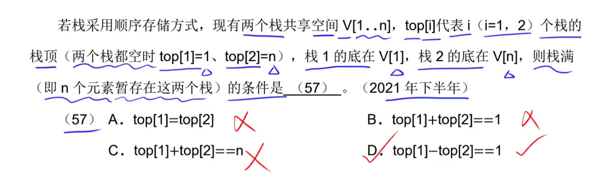

# step18_19_20-5分题-数据结构

## 时间复杂度

## 线性表

- 问的是存储方面的缺点，而不是效率方面的缺点

## 栈

---

- 具体入栈、出栈情况是视情况而定，即：不确定

---

---

---

## 循环队列

---

---

## 矩阵

### 代入法

---

## 树

----

---

## 二叉排序树

## 哈夫曼树

[2021年下半年第64、65题](https://www.bilibili.com/video/BV1gU4y1C7QL?p=52&spm_id_from=pageDriver&vd_source=fc63803bb06c782d1a34636d7a7376bf)

---

---

### ==线索二叉树是干扰项==

### 邻接矩阵存储`稠密图`（边数多）【无关于是否有向|无向】

### 邻接[链]表存储`稀疏图`（边数少）【无关于是否有向|无向】

### `DFS` & `BFS`的时间复杂度只与`存储结构`有关

### ==有`路径`存在 ≠ 有`边`存在==

### `强连通图`：任意两个顶点之间一定有一条路径！但并不意味着一定存在一条边

## 拓扑序列

---

---

## 查找

### 二分查找：最坏时间复杂度：O(log~2~n + 1)

## 顺序查找：平均：(n + 1) / 2；最坏：n

## 哈希表

---

## 堆

### 小顶|根堆 & 大顶|根堆

### 建立大顶|根堆

### 建立小顶|根堆

## 排序

### ==题目问算法的时间复杂度都是指：`最好时间复杂度`==

- 助记
    - **稳定**：乌龟（归并排序）直接（直接插入排序）从水里冒（冒泡排序）了出来。
    - **非`O(n)`时间复杂度**：简单（简单选择排序）堆（堆排序）薯（快速排序）饼（归并排序）。
    - **非`O(1)`空间复杂度**：薯（快速排序）饼（归并排序）。

### ==稳定是指：排序码相同者，在排序前后的相对位置不变==

Eg：17 21 21^*^ 48 63，在排序后序列为：17 21 21^*^ 48 63，由于21 21^*^的**相对位置**没有发生改变，则是**稳定**的。

Eg：17 21 21^*^ 48 63，在排序后序列为：17 21^*^ 21 48 63，由于21 21^*^的**相对位置**发生了改变，则是**不稳定**的。

### 直接插入排序

> ​		序列基本有序或者完全有序，用直接插入排序。最好时间复杂度：`O(n)`。

---

---

---

### 希尔排序

### 计数排序

​		待排序关键字序列中的所有元素均在`0 ~ 9`之间。

### 简单选择排序

### 堆排序

​		每一次排序都可以确定元素的最终位置。

### 冒泡排序

## 算法

---

---

---

### `回溯算法`采用`DFS`策略搜索解空间

### `分支限界算法`采用`BFS`策略搜索解空间

### `动态规划算法`：具有最优子结构性质 & 子问题被重复求解<<全局最优解>>

### `贪心算法`：具有最优子结构性质 & 具有贪心选择【==要最好的==】的性质<<局部最优解>>

---

